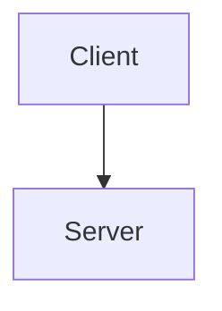

# Code Review: kil-penguin blog (v4)

> **Date**: 2026-02-14
> **Project**: kilhyeonjun-blog — Astro 5.x + Tailwind CSS v4 + MDX
> **URL**: https://kilhyeonjun.github.io
> **Deployment**: GitHub Pages via Actions
> **이전 리뷰**: REVIEW.md (v2, 2026-02-13)

---

## Executive Summary

v2 리뷰 이후 **대규모 개선이 이루어졌습니다**. P0 2건(이미지 최적화, View Transitions 패턴)과 P1 8건 중 대부분이 해결되었으며, 특히 이미지 최적화(62MB→11MB WebP + Astro Image 마이그레이션), fontsource 전환, astro:page-load 패턴 적용은 블로그 품질을 크게 끌어올렸습니다.

현재 남은 이슈는 **심각한 문제(P0)는 없고**, P1 수준 개선 사항 4건과 P2 품질 향상 7건이 있습니다. 가장 주목할 만한 이슈는 Vite 버전 충돌(LSP 타입 에러), RSS raw MDX 본문, defaultOgImage SVG 문제입니다.

| 등급 | 건수 | 설명 |
|------|------|------|
| **P0 (심각)** | 0 | 없음 ✅ |
| **P1 (중요)** | 4 | 조기 수정 권장 |
| **P2 (개선)** | 7 | 품질 향상 |

---

## 이전 리뷰(v2) 대비 변경/해결 상태

| v2 항목 | 상태 | 비고 |
|---------|------|------|
| **P0-1** 이미지 미최적화 (62MB PNG) | ✅ **해결** | 62MB→11MB WebP, `src/assets/images/` 이동, Astro `<Image />` 마이그레이션 (164개 이미지, 54 MDX) |
| **P0-2** View Transitions 비호환 스크립트 | ✅ **해결** | 모든 컴포넌트에 `astro:page-load` 패턴 적용, cleanup `astro:before-swap` |
| **P1-1** Google Fonts 렌더 블로킹 | ✅ **해결** | `@fontsource/inter` + `@fontsource/jetbrains-mono` 셀프호스팅 전환 |
| **P1-2** about.astro meta refresh | ✅ **해결** | `astro.config.mjs`의 `redirects` 사용 |
| **P1-3** formatDate 5곳 중복 | ✅ **해결** | `src/lib/utils.ts`로 통합, import 사용 |
| **P1-4** Array.sort() in-place mutation | ✅ **해결** | `[...posts].sort()` 패턴 + `sortPostsByDate()` 유틸 함수 |
| **P1-5** RSS content 미포함 | ⚠️ **부분 해결** | content 필드 추가했으나 `post.body`(raw MDX) 전달 — TODO 주석 남아있음 |
| **P1-6** OG 이미지 외부 CDN 의존 | ✅ **해결** | 로컬 `fs.readFileSync` + `src/assets/fonts/` 폰트 파일 |
| **P1-7** CSP 미설정 | ✅ **해결** | `<meta http-equiv="Content-Security-Policy">`, PROD 환경에서만 적용 |
| **P1-8** Skip-to-content 미구현 | ✅ **해결** | `<a href="#main-content" class="sr-only focus:not-sr-only ...">` 추가 |
| **P2-1** View Transitions 미사용 | ✅ **해결** | `<ClientRouter />` 적용 |
| **P2-2** Pagefind @ts-ignore | ✅ **해결** | `src/types/pagefind.d.ts` 타입 선언 추가 |
| **P2-3** Copy 버튼 에러 처리 없음 | ✅ **해결** | try-catch 추가 |
| **P2-4** MDX lazy loading 미적용 | ✅ **해결** | `rehypeLazyImages` 플러그인 구현 (astro.config.mjs) |
| **P2-5** getCollection 호출 패턴 | ✅ **해결** | `getPublishedPosts()` 유틸 함수 |
| **P2-6** 비포스트 og:image 미설정 | ⚠️ **부분 해결** | `defaultOgImage = '/favicon.svg'` — SVG는 OG 이미지로 부적합 (아래 P1-2 참조) |
| **P2-7** WebSite schema 미적용 | ❌ **미해결** | 아래 P2-5 참조 |
| **P2-8** Node.js 22 업그레이드 | ✅ **해결** | CI에서 `node-version: "22"` |
| **P2-9** Giscus strict=0 | ✅ **해결** | `data-strict="1"` 적용 |
| **P2-10** resume 통합 | N/A | 별도 repo로 분리 (d972dc7에서 제거) |

**해결률: 20건 중 16건 완전 해결, 2건 부분 해결, 1건 미해결, 1건 N/A**

---

## P1 — 중요 (Important)

### P1-1. Vite 버전 충돌 — LSP 타입 에러

**위치**: `astro.config.mjs` (line 35), `node_modules/`

```
astro@5.17.2 → vite@^6.4.1 (설치됨: vite@6.4.1)
@tailwindcss/vite@4.1.18 → vite@^5.2.0 || ^6 || ^7 (호이스팅으로 vite@7.3.1도 설치됨)
```

**증상**: LSP에서 `astro.config.mjs`의 `vite.plugins`에 타입 에러 발생:
```
Type 'Plugin<any>[]' is not assignable to type 'PluginOption'.
// @tailwindcss/vite가 vite@7의 Plugin 타입 반환 → astro가 기대하는 vite@6 Plugin과 불일치
```

**영향**: 빌드는 정상 동작하지만, IDE에서 타입 에러 표시. `@astrojs/check`에서도 감지될 수 있음.

**권장 수정**:
```bash
# package.json에 overrides 추가하여 vite 버전 통일
"overrides": {
  "vite": "^6.4.1"
}
# 또는 @tailwindcss/vite 버전을 astro와 호환되는 버전으로 고정
```

---

### P1-2. defaultOgImage가 SVG — 소셜 미디어 미지원

**위치**: `src/layouts/BaseLayout.astro` (line 22)

```typescript
const defaultOgImage = '/favicon.svg';
```

**문제점**:
- 대부분의 소셜 미디어 플랫폼(Twitter, Facebook, Slack 등)이 **SVG를 OG 이미지로 지원하지 않음**
- 비포스트 페이지(홈, 카테고리, 태그 목록)의 og:image가 제대로 렌더되지 않음

**권장 수정**:
1. 1200x630 PNG/JPG 기본 OG 이미지를 `public/og-default.png`에 추가
2. `const defaultOgImage = '/og-default.png';`

---

### P1-3. RSS content가 raw MDX 본문

**위치**: `src/pages/rss.xml.ts` (line 20)

```typescript
content: post.body ?? '',
```

**문제점**:
- RSS 리더에서 MDX 구문(`import`, JSX, `{:}` 등)이 그대로 노출
- 이미지 경로가 상대 경로로 깨질 수 있음
- TODO 주석이 코드에 남아있어 인지하고 있지만 미해결

**권장 수정**: Astro API 엔드포인트에서 `render()`를 직접 호출할 수 없으므로:
1. 빌드 시 각 포스트를 pre-render하여 HTML을 캐시하는 스크립트 작성
2. 또는 `content` 필드를 제거하고 `description`만 제공 (요약 피드)
3. 또는 간단한 MDX→텍스트 변환 함수로 마크업 제거

---

### P1-4. Comments의 `astro:before-swap` cleanup이 `once: true`

**위치**: `src/components/Comments.astro` (line 73-77)

```typescript
document.addEventListener('astro:before-swap', () => {
  observer?.disconnect();
  if (handleGiscusMessage) {
    window.removeEventListener('message', handleGiscusMessage);
  }
}, { once: true });
```

**문제점**:
- `once: true`는 이벤트가 1회만 실행되고 자동 제거됨
- 첫 페이지 전환 후, 새로운 `astro:page-load`에서 `observer`와 `handleGiscusMessage`가 재생성되지만, cleanup 리스너는 다시 등록되지 않음

**사실**: `astro:page-load` 내부에서 `astro:before-swap` + `once: true`를 등록하고 있으므로, 매 페이지 로드마다 새 cleanup이 등록됩니다. **이 패턴은 실제로 올바르게 동작합니다** — page-load 콜백은 매번 실행되고 그 안에서 once cleanup을 등록하므로 문제없음.

→ **등급 하향: P2-7로 이동** (코드 가독성 관점에서만 주석 추가 권장)

*수정*: 검토 결과 `Comments.astro`에서는 `astro:before-swap`이 `astro:page-load` **밖**에 있음. 이 경우:
- 첫 페이지 전환에서만 cleanup 실행
- 이후 페이지 전환에서는 이전 observer/listener가 정리되지 않음
- 메모리 누수 가능

**권장 수정**: `astro:before-swap` 리스너를 `astro:page-load` 콜백 안으로 이동:
```typescript
document.addEventListener('astro:page-load', () => {
  loadGiscus();
  // ... observer, handleGiscusMessage 설정 ...
  
  document.addEventListener('astro:before-swap', () => {
    observer?.disconnect();
    window.removeEventListener('message', handleGiscusMessage);
  }, { once: true });
});
```

---

## P2 — 개선 (Enhancement)

### P2-1. public/images/에 1.7MB GIF 잔존

**위치**: `public/images/tistory/24/img.gif` (1.7MB)

이미지 최적화 작업에서 누락된 GIF 파일. `public/`에 있어 Astro 이미지 최적화를 우회합니다.

**권장**: WebP/MP4로 변환하여 `src/assets/`로 이동하거나, GIF 애니메이션이 필요한 경우 그대로 유지하되 해당 MDX에서 `<Image />`로 참조.

---

### P2-2. src/assets/images/에 PNG 1개 잔존

**위치**: `src/assets/images/tistory/19/스크린샷 2024-10-24 오후 6_1.30.png` (4.5KB)

WebP 변환에서 누락된 파일. 크기가 작아 영향 미미.

**권장**: WebP로 변환하고 참조 MDX 업데이트.

---

### P2-3. Mermaid 코드블록 렌더링 미지원

**위치**: 3개 MDX 파일
- `tistory-33-하루-4번-서버가-죽는-사내-어드민-lambda로-구원받다.mdx`
- `tistory-40-가면사배-시리즈-1-...mdx`
- `tistory-41-가면사배-시리즈-2-...mdx`

````markdown

````

현재 Mermaid가 일반 코드 블록으로 렌더됩니다.

**권장**: 
1. `rehype-mermaid` 또는 `remark-mermaidjs` 플러그인 추가
2. 또는 Mermaid를 이미지로 사전 변환

---

### P2-4. 이미지 alt 텍스트 대부분 비어있음

**위치**: 다수의 MDX 파일

```markdown

```

빈 `alt=""` 이미지가 대다수. WCAG 1.1.1 위반 (의미 있는 대체 텍스트 필요).

**영향**: 스크린 리더 사용자에게 이미지 정보 전달 불가, SEO에도 부정적.

**권장**: 최소한 주요 이미지에 설명적 alt 텍스트 추가. 장식적 이미지는 `alt=""`로 유지.

---

### P2-5. 홈페이지에 WebSite structured data 미적용

**위치**: `src/pages/index.astro`

```json
{
  "@context": "https://schema.org",
  "@type": "WebSite",
  "name": "kil-penguin blog",
  "url": "https://kilhyeonjun.github.io",
  "potentialAction": {
    "@type": "SearchAction",
    "target": "https://kilhyeonjun.github.io/blog/?q={search_term_string}",
    "query-input": "required name=search_term_string"
  }
}
```

---

### P2-6. @astrojs/check devDependency 미설정

**위치**: `package.json`

CI에서 `npx astro check`를 실행하지만 `@astrojs/check`가 devDependencies에 없어 매번 설치됨.

**권장**: 
```bash
npm i -D @astrojs/check typescript
```

---

### P2-7. OG 폰트 파일 형식 — woff vs woff2

**위치**: `src/assets/fonts/`

```
noto-sans-kr-400-normal.woff  (868KB)
noto-sans-kr-700-normal.woff  (883KB)
```

**권장**: woff2 형식은 ~30% 더 작음. satori 호환 여부 확인 후 woff2로 교체 가능. (satori는 woff/ttf만 지원하므로 현재 woff가 올바른 선택 — **유지**)

---

## 잘한 점 (Strengths) ✅

| 항목 | 상세 |
|------|------|
| **대규모 이미지 최적화** | 62MB→11MB, 164개 이미지 WebP 변환 + Astro Image 마이그레이션 (54 MDX) |
| **fontsource 전환** | 외부 Google Fonts 의존성 완전 제거, 렌더 블로킹 해소 |
| **astro:page-load 패턴** | ThemeToggle, SearchDialog, TOC, Comments, Copy 버튼 모두 View Transitions 호환 |
| **rehypeLazyImages** | 커스텀 rehype 플러그인으로 모든 MDX 이미지에 `loading="lazy"` + `decoding="async"` 자동 적용 |
| **getPublishedPosts + sortPostsByDate** | 유틸 함수 통합으로 코드 중복 제거 |
| **GFM 테이블 지원** | `remark-gfm` 추가 + 6개 포스트 테이블 복구 + 테이블 CSS 스타일링 |
| **CSP (PROD only)** | 개발 환경에서는 제한 없이, 프로덕션에서만 보안 헤더 적용 — 실용적 접근 |
| **OG 폰트 로컬화** | CDN 의존성 제거, 빌드 재현성 확보 |
| **Giscus strict 모드** | 경로 기반 정확한 댓글 매핑 |
| **Content Collection + Zod** | 타입 안전한 frontmatter 검증 |
| **JSON-LD Structured Data** | BlogPosting 완비 (author, publisher, keywords, articleSection, wordCount) |
| **Skip-to-content** | WCAG 2.4.1 준수 |
| **Shiki 듀얼 테마** | 라이트/다크 코드 하이라이팅 |
| **prefers-reduced-motion** | `global.css`에서 `scroll-behavior: auto` 적용 |
| **Tailwind v4 네이티브** | `@theme`, `@custom-variant`, `@plugin` 문법 |

---

## 우선순위 로드맵

```
1주 내 (P1):
├── P1-1: Vite 버전 충돌 해결 (overrides 또는 패키지 버전 조정)
├── P1-2: defaultOgImage → PNG/JPG로 변경
├── P1-3: RSS content 개선 (raw MDX → 텍스트 or description only)
└── P1-4: Comments cleanup을 astro:page-load 안으로 이동

시간 여유 시 (P2):
├── P2-1: public/ GIF 최적화
├── P2-2: 잔존 PNG 변환
├── P2-3: Mermaid 렌더링 지원
├── P2-4: 이미지 alt 텍스트 보강
├── P2-5: WebSite structured data
└── P2-6: @astrojs/check devDeps 추가
```

---

## 수치 요약

| 항목 | v2 | v4 | 변화 |
|------|-----|-----|------|
| 이미지 총 크기 | 62MB | 11MB (+1.7MB public) | **-80%** |
| 이미지 형식 | PNG 원본 | WebP (164개) | ✅ |
| 외부 CSS | Google Fonts | 없음 (fontsource) | ✅ |
| View Transitions | 미지원 | ClientRouter 적용 | ✅ |
| P0 이슈 | 2건 | **0건** | ✅ |
| P1 이슈 | 8건 | 4건 (신규 포함) | **-50%** |
| Node.js | 20 | 22 | ✅ |
| 소스 파일 수 (src/) | ~20개 | ~20개 | — |
| 콘텐츠 파일 수 | ~70개 (.mdx) | ~70개 (.mdx) | — |
