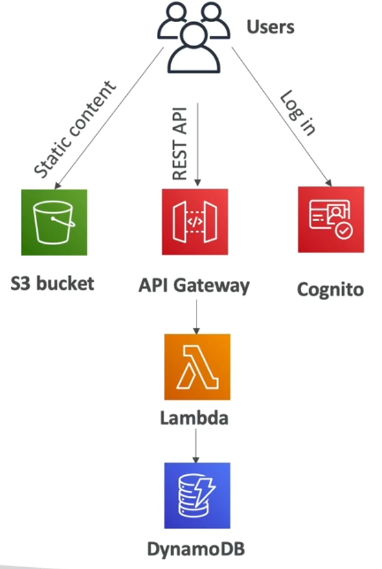
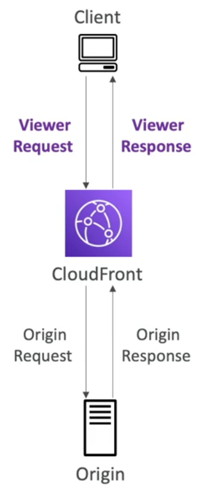
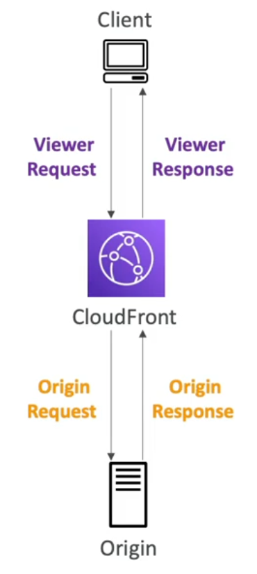
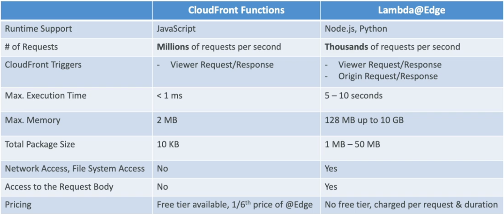
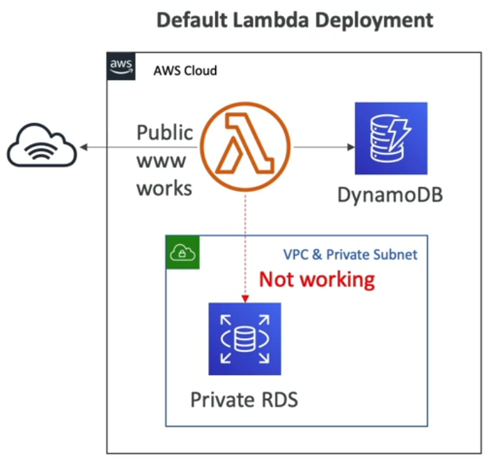
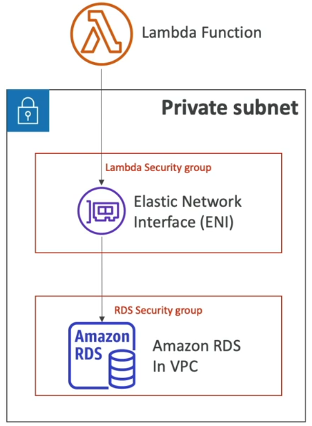
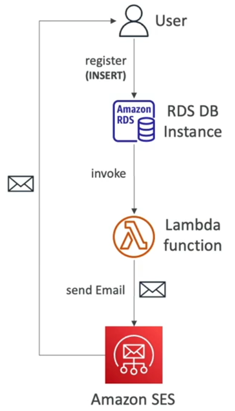
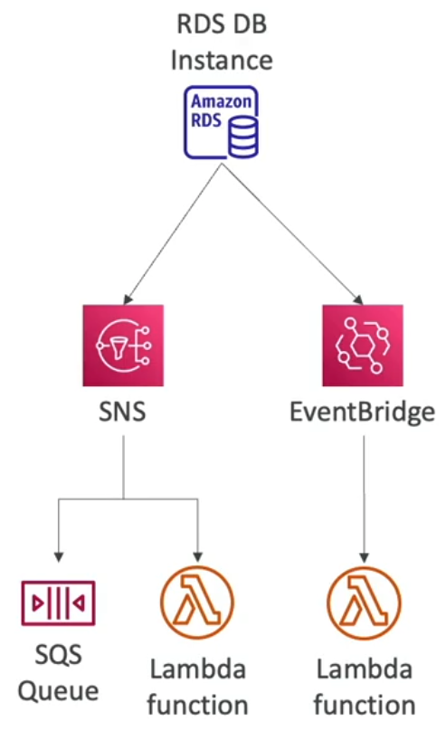

# Serverless

## Serverless 란?

- 서버리스 서비스를 사용하는 개발자는 더이상 서버를 관리할 필요가 없다.
- 서버가 없다는 뜻이 아닌, 관리할 필요가 없다는 것이다.
- 개발자는 단지 코드를 배포하기만, 함수를 배치하기만 하면 된다.
- 초기의 서버리스는 Faas(Function as a Service)를 의미했지만, 지금의 서버리스는 더 많은 것을 의미한다.
- AWS Lambda로부터 서버리스는 개발되었고, 이제는 데이터베이스, 메시징, 스토리지 등을 포함한 모든 관리형 서비스를 의미한다.
- 서버리스는 서버가 없다는 것을 의미하지 않고, 서버가 보이지 않거나, 관리하지 않고, 프로비저닝하지 않는 것을 의미한다.

## Serverless in AWS

- AWS Lambda
- DynamoDB
- AWS Cognito
- AWS API Gateway • Amazon S3
- AWS SNS & SQS
- AWS Kinesis Data Firehose • Aurora Serverless
- Step Functions
- Fargate

# AWS Lambda

## Why AWS Lambda

### Amazon EC2

- 클라우드 가상 서버 - 프로비저닝이 필요함
- RAM과 CPU 크기가 제한됨
- 지속적으로 실행됨
- 스케일링은 서버를 추가하거나 제거하는 작업을 해야 함

### Amazon Lambda

- 가상 함수 - 관리할 서버가 없음
- 제한 시간이 있음 - 짧은 실행 시간
- 온디맨드로 실행됨 (호출 시 실행)
- 스케일링 자동화

### Benefits of AWS Lambda

- 쉬운 가격 정책:
  - 호출 횟수 및 컴퓨팅 시간, 즉 Lambda가 실행된 시간 만큼 청구
  - Lambda 요청 1백만 건과 40만 GB의 컴퓨팅 시간에 대한 프리 티어 제공
- AWS의 전체 서비스와 통합 가능
- 다양한 프로그래밍 언어 사용 가능
- AWS CloudWatch를 통한 쉬운 모니터링
- 함수당 추가 리소스 확보가 쉬움 (최대 10 GB의 램을 프로비저닝 할 수 있음)
- RAM을 증가시키면 CPU 및 네트워크 성능도 향상됨

### AWS Lambda language support

- Node.js (JavaScript)
- Python
- Java (compatible with Java 8)
- C# (.NET Core)
- Golang
- C# / Powershell
- Ruby
- Custom Runtime API (community-supported, ex. Rust)

- Lambda 컨테이너 이미지를 지원함
  - Lambda 컨테이너 이미지는 Lambda Runtime API를 구현해야 함
  - 임의의 Docker 이미지를 실행하기 위해서는 ECS 또는 Fargate를 사용하는 것이 권장됨

### AWS Lambda Integrations Main ones

- API Gateway: REST API 생성, 람다 함수 호출
- Kinesis: Lambda를 이용해 바로 데이터 변환
- DynamoDB: 데이터베이스에 트리거가 생기면 람다 함수가 작동
- S3: 언제든 람다 함수를 작동시킬 수 있음
- CloudFront: Lambda@Edge
- CloudWatch Evnets & EventBridge: AWS의 인프라에 어떤 일이 생기고 그 상황에 대응하고자 할 때 상황에 따라 자동화를 실행하기 위해 람다 함수 사용
- CloudWatch Logs: 어디든 해당 로그를 스트리밍
- SNS: 알림과 SNS 주제에 대처할 수 있음
- SQS: SQS 대기열 메시지 처리 가능
- Cognito: 사용자가 데이터베이스에 로그인할 때마다 응답

### AWS Lambda Pricing: example

https://aws.amazon.com/ko/lambda/pricing/

- 요청당 지불:
  - 처음 1백만 건의 요청은 무료
  - 이후 1백만 건 요청마다 $0.20 (요청 당 $0.0000002)
- 기간당 지불: (1ms 단위로 증가)
  - 월당 첫 40만 GB-초의 컴퓨팅 시간은 무료 (GB-초는 1GB RAM의 실행 시간)
    - 함수가 1 GM RAM인 경우 40만 초
    - 함수가 128 MB RAM인 경우 320만 초
  - 이후 60만 GB-초에 대해 \$1 달러 청구
- AWS Lambda의 실행 비용은 매우 저렴하며 많은 사용자에게 인기가 있다.

## AWS Lambda Limits to Know - per region

Lambda 한도는 리전당 존재함

- **실행**
  - 메모리 할당: 128 MB - 10 GB (메모리는 1MB씩 증가)
  - 최대 실행 시간: 900초 (15분)
  - 환경 변수: 4 KB 까지
  - "함수 컨테이너"의 디스크 용량 (/tmp 폴더): 512 MB - 10 GB
  - 동시 실행 횟수: 1,000회 (증가 가능)
- **배포**
  - Lambda 함수 배포 시 최대 크기 (압축된 .zip 파일): 50 MB
  - 압축하지 않았을 때의 배포 크기 (코드 + dependecies): 250 MB
  - 시작 시 다른 파일을 로드하기 위해 /tmp 디렉토리 사용 가능
  - 환경 변수: 4 KB

### Customization At The Edge

- 보통은 함수와 애플리케이션을 특정 리전에서 배포하지만 CloudFront를 사용할 때에는 엣지 로케이션을 통해 콘텐츠를 배포한다.
- 모던 애플리케이션에서는 애플리케이션에 도달하기 전에 엣지에서 로직을 실행하도록 요구하기도 함
- 엣지 함수
  - CloudFront 배포에 연결하고 작성한 코드
  - 지연시간을 최소화하기 위해 사용자에게 가까운 위치에서 실행됨
- CloudFront는 두 가지 유형을 제공
  - CloudFront Functions
  - Lambda@Edge
- 서버를 관리할 필요 없이 전역으로 배포됨
- 사용 사례: CDN 콘텐츠를 사용자 지정하는 경우
- 사용한 만큼만 비용 지불
- 완전히 서버리스

#### CloudFront Functions & Lambda@Edge Use Cases:

- 웹사이트 보안 및 개인정보 보호
- 엣지에서 동적 웹 애플리케이션
- 검색 엔진 최적화 (SEO)
- 다양한 오리진과 데이터 센터 간 지능적인 라우팅
- 엣지에서의 봇 완화
- 실시간 이미지 변환
- A/B 테스팅
- 사용자 인증 및 권한 부여
- 사용자 우선 순위 지정
- 사용자 추적 및 분석

### CloudFront Functions

- JavaScript로 작성된 경량화된 함수
- 확장성이 높고 지연 시간에 민감한 CDN 사용자 지정에 사용됨
- 시작 시간은 1ms 미만, 초당 수백만 개의 요청 처리
- Viewer 요청 및 응답 변경에 사용
  - 뷰어 요청: CloudFront가 뷰어로부터 요청을 받은 다음 뷰어 요청 수정 가능
  - 뷰어 응답: CloudFront가 뷰어에게 응답을 보내기 전에 뷰어 응답 수정 가능
- CloudFront의 네이티브 기능 (모든 코드가 CloudFront에서 직접 관리)

CloudFront는 고성능, 고확장성이 필요할 때 뷰어 요청과 뷰어 응답에만 사용됨

### Lambda@Edge

- Node.js 또는 Python으로 작성된 Lambda 함수
- 초당 수천 개의 요청 처리
- 모든 CloudFront 요청 및 응답 변경에 사용
  - 뷰어 요청: CloudFront가 뷰어로부터 요청을 받은 다음 뷰어 요청 수정 가능
  - 오리진 요청: CloudFront가 오리진에 요청을 전송하기 전에 수정
  - 오리진 응답: CloudFront가 오리진에서 응답을 받은 후에 수정
  - 뷰어 응답: CloudFront가 뷰어에게 응답을 보내기 전에 뷰어 응답 수정 가능
- 함수는 하나의 AWS 리전(us-east-1)에서 작성하고, CloudFront가 모든 로케이션에 해당 함수 복제

### CloudFront Functions vs. Lambda@Edge

#### CloudFront Functions vs. Lambda@Edge - Use Cases

CloudFront Functions

- 캐시 키 정규화
  - 요청 속성 (헤더, 쿠키, 쿼리 문자열, URL)을 변환하여 최적의 캐시 키 생성
- 헤더 조작
  - 요청 또는 응답에서 HTTP 헤더 삽입/수정/삭제
- URL 재작성 또는 리디렉션
- 요청 인증 및 권한 부여
  - 사용자가 생성한 토큰 (JWT 등) 생성 및 유효성 검사를 통한 요청 허용/거부

Lambda@Edge

- 더 긴 실행 시간 (수 밀리초)
- 조정 가능한 CPU 또는 메모리
- 코드가 3rd party 라이브러리에 의존하는 경우 (예: 다른 AWS 서비스에 액세스하기 위한 AWS SDK)
- 데이터 처리를 위한 외부 서비스에 대한 네트워크 액세스를 통해 대규모 데이터 통합 수행
- 파일 시스템 액세스 또는 HTTP 요청의 본문에 대한 액세스

## Lambda in VPC

- 기본적으로 Lambda 함수는 사용자의 VPC가 아닌 AWS 소유의 VPC에서 실행
- 따라서 VPC 내에서 리소스(RDS, ElastiCache, 내부 ELB 등)에 액세스할 수 없음
- 이를 해결하려면 사용자의 VPC에서 Lambda 함수를 시작

- 사용자의 VPC에서 Lambda 함수를 시작하려면 VPC ID Lambda 함수를 시작하려는 서브넷을 지정하고 Lambda 함수에 보안 그룹을 추가해야 함
- Lambda는 사용자의 서브넷에 ENI (Elastic Network Interface)를 생성

### Lambda with RDS Proxy

VPC에서 Lambda를 사용하는 대표적인 사용 사례는 RDS 프록시이다. RDS 데이터베이스가 프라이빗 서브넷에 있어도 Lambda 함수로 직접 해당 DB에 액세스할 수 있다. 하지만 이런 방법으로 Lambda 함수가 DB에 직접 액세스하게 되면 RDS 데이터베이스의 로드가 상승해 시간 초과 등의 문제로 이어진다. 이를 해결하기 위해 RDS 프록시를 사용한다.

- RDS Proxy
  - DB 연결의 풀링과 공유를 통해 확장성 향상
  - 장애가 발생할 경우 장애 조치 시간을 66%까지 감소시키고 연결을 유지함으로써 가용성을 향상시킴
  - IAM 인증을 강제화하고 자격 증명을 Secret Manager에 저장함으로써 보안을 향상시킴
- RDS Proxy는 퍼블릭 액세스가 불가능하므로 Lambda 함수는 반드시 사용자의 VPC에 배포되어야 함

### Invoking Lambda from RDS & Aurora

- DB 인스턴스 안에서 람다 함수를 호출할 수 있음
- DB 안의 데이터를 처리할 수 있게 됨
- RDS for PostgreSQL 과 Aurora MySQL에서 지원
- DB 인스턴스 내에서 람다 함수에 대한 아웃바운드 트래픽을 허용해야 함 (Public, NAT GW, VPC Endpoint)
- DB 인스턴스에는 람다 함수를 호출하는 데 필요한 권한이 있어야 함 (Lambda Resource-based Policy & IAM Policy)

### RDS Event Notifications

- DB 인스턴스 자체에 대한 정보를 알려주는 알림 (created, stopped, start, ...)
- DB 데이터의 대한 정보는 없음
- DB 인스턴스, DB 스냅샷, 파라미터 그룹, 보안 그룹, 프록시, 커스텀 엔진 버전에 관한 이벤트를 구독할 수 있음
- 근 실시간 이벤트 (최대 5분)
- SNS에 전송하거나 EventBridge 사용하여 이벤트를 구독할 수 있음
