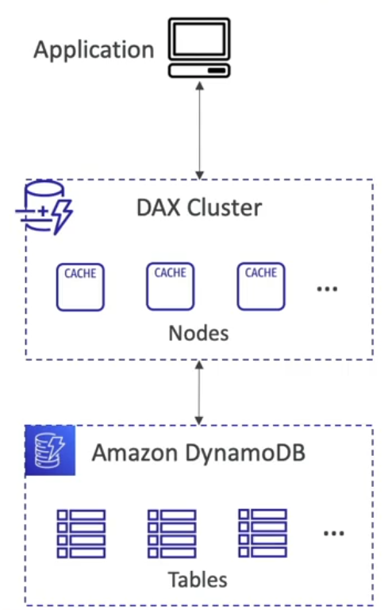
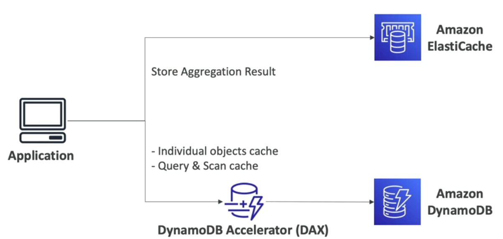
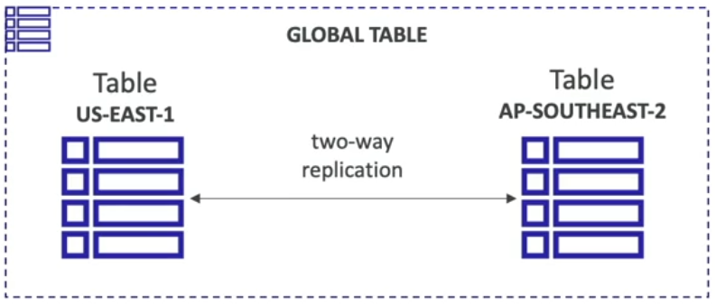

# Amazon DynamoDB

- 완전 관리형 데이터베이스
- 다중 AZ간의 데이터 복제를 통해 고가용성 제공
- NoSQL - 관계형 데이터베이스가 아님. 트랜잭션 지원
- 대규모 워크로드로 확장 가능한 분산 데이터베이스
- 성능이 빠르고 일관성을 유지함 (한 자릿수 밀리초의 성능)
- 보안, 인가 및 관리를 위해 IAM과 통합되어 있음
- 저렴한 비용. 오토 스케일링 기능 제공
- 유지 관리나 패치 작업이 필요 없으며 항상 사용 가능함
- Standard 및 Infrequent Access (IA) 테이블 클래스 지원

## DynamoDB - Basics

- DynamoDB는 테이블로 구성됨
- 각 테이블에는 Primary Key가 있음 (생성 시 부여됨)
- 각 테이블에는 무한한 개수의 항목 (=rows)를 가질 수 있음
- 각 항목은 속성이 있음 (추후 추가 가능 / null 가능)
- 항목의 최대 크기는 400 KB
- 지원하는 데이터 타입:
  - Scalar Types: String, Number, Binary, Boolean, Null
  - Document Types: List, Map
  - Set Types: String Set, Number Set, Binary Set
- 스키마를 빠르게 전개해야할 때 Aurora나 RDS보다는 DynamoDB가 더 나은 선택임

## Read/Write Capacity Modes

- 테이블의 용량 (읽기/쓰기 처리량)을 관리하는 방식을 제어한다.
- Provisioned Mode (default)
  - 초당 읽기/쓰기 수를 예측하여 미리 지정
  - 용량을 사전에 계획해야 함
  - 프로비저닝된 읽기 용량 단위 (RCU) 및 쓰기 용량 단위 (WCU)에 대해 비용을 지불
  - RCU 및 WCU에 대한 오토 스케일링 가능
- On-Demand Mode
  - 읽기/쓰기가 작업량에 따라 자동으로 확장/축소
  - 용량 계획이 필요하지 않음
  - 사용한 만큼 비용을 지불
  - 예측할 수 없는 작업량이나 급격한 증가가 예상되는 경우에 적합

## DynamoDB Accelerator (DAX)

- DynamoDB를 위한 완전 관리형 무결졀 인메모리 캐시
- DynamoDB 테이블에 읽기 작업이 많을 때 DAX 클러스터를 생성하고 데이터를 캐싱하여 읽기 혼잡을 해결함
- 캐시된 데이터에 대한 마이크로초 수준의 지연 시간
- 애플리케이션 로직 수정이 필요하지 않음 (기존 DynamoDB API와 호환됨)
- 캐시의 기본 TTL 기본값은 5분

### DynamoDB Accelerator (DAX) vs. ElastiCache

- DAX는 DynamoDB 앞에 있고 개별 객체 캐시, 쿼리, 스캔 캐시를 처리하는데 유용
- 집계 결과를 저장할 때는 Amazon ElastiCache가 좋음
- 대용량의 연산을 저장할 때에는 Amazon DynamoDB가 좋음
- 두 서비스는 상호 보완적인 성격을 띄며 Amazon DynamoDB에 캐싱 솔루션을 추가할 때는 보통 DAX를 사용

### Stream Processing

- 스트림 처리는 데이터의 변경 사항을 실시간으로 감지하고 이를 처리하는 기술
- DynamoDB의 스트림은 테이블에서 발생하는 모든 항목의 생성, 업데이트, 삭제 작업에 대한 변경 이벤트를 기록하는 일련의 이벤트 스트림
- 사용 사례:
  - 실시간으로 변경 사항에 대응하기 (사용자에게 환영 이메일 보내기)
  - 실시간 사용 분석
  - 파생 테이블 삽입
  - 리전 간 복제 구현
  - DynamoDB 테이블 변경 시 AWS Lambda 호출

DynamoDB Stream

- 보존 기간: 24시간
- 소비자 수 제한
- Lambda 트리거 또는 DynamoDB Stream kinesis adapter 사용 가능

Kinesis Data Stream

- 보존 기간: 1년
- 더 많은 소비자의 수
- AWS Lambda, Kinesis Data Analytics, Kinesis Data Firehose, AWS Glue Streaming ETL 등 사용 가능

### DynamoDB Global Table

- 여러 리전 간에 짧은 지연 시간으로 액세스 할 수 있도록 하는 기능
- active-active 복제
- 애플리케이션은 어떤 리전에서든 해당 테이블을 읽고 쓸 수 있음
- Global Tables를 설정하기 위해서는 먼저 테이블에 DynamoDB Streams를 활성화해야 함

### Time To Live (TTL)

- 만료 타임스탬프가 지난 항목을 자동으로 삭제하는 기능
- 사용 사례: 최근 항목만 저장, 규정 준수(ex. 2년 후 데이터 삭제해야 함), 웹 세션 핸들링

### Backups for disaster recovery

- 지정 시간 복구(Point-in-time Recovery, PITR)을 통한 지속적인 백업
  - 선택적으로 활성화할 수 있고, 최근 35일간 지속됨
  - 활성화하면 백업 기간 내에는 언제든 백업 윈도우 내에서 복구할 수 있음
  - 복구 과정에서는 새로운 테이블이 생성됨
- On-demand backups
  - 장기 보관을 위해 명시적으로 삭제할 때까지 보관되는 전체 백업 수행
  - 성능이나 지연 시간에 영향을 주지 않음
  - AWS Backup 서비스에서 구성 및 관리할 수 있음 (교차 리전 복사 기능 사용 가능)
  - 복구 과정에서 새로운 테이블 생성

### Integration with Amazon S3

- S3로 내보내기 (Export to S3) - PITR 기능 활성화해야 함

  - 최근 35일 이내 어떤 시점으로든 테이블을 내보낼 수 있음
  - 읽기 용량이나 성능에 영향을 주지 않음
  - 데이터 분석 수행 가능
  - 감사 목적으로 스냅샷 확보 가능
  - 데이터를 다시 DynamoDB로 가져오기 전에 데이터 ETL 등 대규모 변경을 실행할 수 있음
  - DynamoDB JSON 또는 ION 형식으로 내보냄

- S3에서 가져오기 (Import from S3)
  - S3에서 CSV, DynamoDB JSON 또는 ION 형식의 데이터를 가져와 DynamoDB에 새로운 테이블로 임포트
  - 쓰기 용량을 소모하지 않음
  - 임포트 중 발생하는 오류는 모두 CloudWatch Logs에 기록됨
