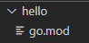
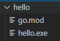
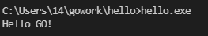
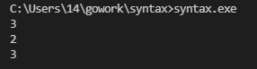
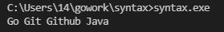

<!-- ### 목차

- [Go 기본 명령어 (1)](/go/go-base-1/) -->

※ Go 1.16 버전 부터 모듈 방식이 기본 옵션이 되어서 모든 Go 코드는 Go 모듈 안에 있어야 합니다.

# 모듈 생성

```
go mod init [폴더 경로]
ex) go mod init gowork/hello
```

  
위에 사진과 같이 go.mod라는 모듈 파일이 생성됩니다.

# 빌드

```
go build
```

  
위에 사진과 같이 [폴더명].exe 실행 파일이 생성됩니다.

# 실행

```
.\[실행파일명].exe
go run .\[코드파일명].go
```

- exe파일을 실행
- go run 명령어를 통해 exe 파일없이 코드 실행

# fmt

## Println

```javascript
package main

import "fmt"

func main() {
	fmt.Println("Hello GO!")
}
```

  
실행 파일을 실행하면 위에 사진과 같이 Hello GO! 가 출력 된 것을 보실수 있습니다.

# math

## Round, Floor, Ceil

```javascript
package main

import (
    "fmt"
    "math"
)

func main() {
    fmt.Println(math.Round(2.71))
    fmt.Println(math.Floor(2.71))
    fmt.Println(math.Ceil(2.71))
}

```

  
실행 파일을 실행하면 위에 사진과 같이  
Round는 반올림  
Floor는 내림  
Ceil은 올림  
이 실행된 것을 볼 수 있습니다.

# string

## title

```javascript
package main

import (
	"fmt"
	"strings"
)

func main() {
	fmt.Println(strings.Title("go git github java"))
}

```


실행 파일을 실행하면 위에 사진과 같이 단어의 첫글자만 대문자로 변환 되었습니다.

# rune

## rune 이란?

유니코드(UTF-8)을 표현하는 타입입니다.

- 16 bit로 표현되는 UTF-16이 아닌, 8 bit로 표현되는 UTF-8 인코딩 방식을 사용합니다.
- 유니코드는 인코딩에서 한글은 3byte를 사용하고 영어는 1byte를 사용합니다.
- Go에선 3byte int형 타입이 없기 대문에 4byte int인 int32를 사용합니다.

```javascript
    var c rune = '가'
```

위의 코드는 c라는 변수를 rune 타입으로 선언하면서 '가'의 유니코드 값을 넣었습니다.  
c에는 44032 값이 들어가게 됩니다.
