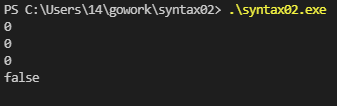
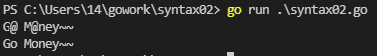
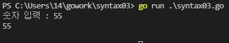
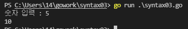
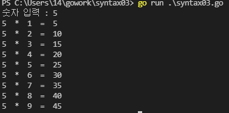
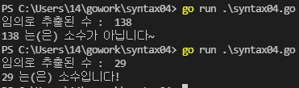

# 자료형(Type) 확인

```javascript
package main

import (
	"fmt"
	"reflect"
)

func main() {
	var c rune = '가'
	a := 7

	fmt.Printf("%T\n", c)
	fmt.Printf("%T\n", a)

	fmt.Println(reflect.TypeOf(c))
	fmt.Println(reflect.TypeOf(a))
}
```

- fmt 모듈의 Printf 메소드 이용
- reflect 모듈의 TypeOf 메소드 이용

# 초기값 확인

```javascript
package main

import (
    "fmt"
)

func main() {
    // zero value
    var e string
    var d bool
    var c rune
    var b float64
    var a int

    fmt.Println(a)
    fmt.Println(b)
    fmt.Println(c)
    fmt.Println(d)
    fmt.Println(e)
}

```



- int, float64, rune 등 숫자형 자료형은 초기값이 0
- bool 논리형 자료형은 초기값이 false
- string 문자형 자료형은 초기값이 ''

# 변수 선언 규칙

- 변수명은 영문자로 시작해야 됨
- 영문 대문자의 경우 다른 패키지에서 접근 가능
- 소문자로 시작하는 변수는 동일 패키지에서만 접근 가능
- 관례로는
  - camelCase 방식을 사용
  - index는 i로 줄여서 선언

# 문자열 변환

```javascript
package main

import (
	"fmt"
	"strings"
)

func main() {
	texts := "G@ M@ney~~"
	fmt.Println(texts)
	r := strings.NewReplacer("@","o")
	newText := r.Replace(texts)
	fmt.Println(newText)
}
```



## NewReplacer()

- strings의 메소드로 파라미터는 (바꾸고싶은 문자열, 바꿀 문자열)
- 문자열 교체 인스턴스를 반환

## Replace()

- 문자열 교체 인스턴스의 메소드로 파라미터는(문자열)
- 바뀐 문자열을 반환

# 문자열 입력

```javascript
package main

import (
        "bufio"
"fmt"
"os"
)

func main() {
  fmt.Print("숫자 입력 : ")
  rd := bufio.NewReader(os.Stdin)
  in, _ := rd.ReadString('\n')
  fmt.Println(in)
}
```



## Stdin

- Standard Input/OutPut 표준 입출력 ex) 키보드

## NewReader()

- reader 반환

## ReadString()

- 파라미터 값이 오기 전까지 읽음
- 읽은 데이터, 에러 반환

## \_

- Go언어 특성상 쓰지않으면 에러를 발생
- \_는 쓰지 않아도 됨

## 에러 출력

```javascript
package main

import (
	"bufio"
	"fmt"
	"log" // Fatal Function
	"os"
)

func main() {
	fmt.Print("숫자 입력 : ")
	rd := bufio.NewReader(os.Stdin)
	in, err := rd.ReadString('\n')
	if err != nil { // 에러가 발생하면
		log.Fatal(err)
	}else{
		fmt.Println(in)
	}

}
```


- 위에 결과는 if 문이 없을 때
- 아래 결과는 if 문이 있을 때
- 에러가 없으면 err 에 nil 반환

## Fatal()

- 에러를 출력후 프로그램 종료

# 문자열 정수 변환

```javascript
package main

import (
    "bufio"
    "fmt"
    "log" // Fatal Function
    "os"
    "strconv" // TrimSpace
    "strings" // ParseInt
)

func main() {
  fmt.Print("숫자 입력 : ")
  rd := bufio.NewReader(os.Stdin)
  in, err := rd.ReadString('\n')

  if err != nil { // 에러가 발생하면
    log.Fatal(err)
  }

  in = strings.TrimSpace(in)
  dan, err := strconv.ParseInt(in, 10, 32)

  if err != nil { // 에러가 발생하면
    log.Fatal(err)
  }
  fmt.Println(dan * 2)
}
```



## TrimSpace()

- 문자열 공백 제거

## ParseInt()

- 파라미터 (문자열, 진수, 크기(bit))
- 문자열 정수로 변환 값, 에러 반환

# 구구단 예제

```javascript
package main

import (
        "bufio"
"fmt"
"log" // Fatal Function
"os"
"strconv" // TrimSpace
"strings" // ParseInt
)

func main() {
  fmt.Print("숫자 입력 : ")
  rd := bufio.NewReader(os.Stdin)
          in, err := rd.ReadString('\n')

  if err != nil { // 에러가 발생하면
    log.Fatal(err)
  }

in = strings.TrimSpace(in)
  dan, err := strconv.ParseInt(in, 10, 32)

  if err != nil { // 에러가 발생하면
    log.Fatal(err)
  }

  for i := 1; i<10; i++ {
    fmt.Println(dan, " * ", i, " = ", (int(dan)*i))
  }
}
```



## while

```javascript
package main

import (
        "bufio"
"fmt"
"log" // Fatal Function
"os"
"strconv" // TrimSpace
"strings" // ParseInt
)

func main() {
  fmt.Print("숫자 입력 : ")
  rd := bufio.NewReader(os.Stdin)
          in, err := rd.ReadString('\n')

  if err != nil { // 에러가 발생하면
    log.Fatal(err)
  }

in = strings.TrimSpace(in)
  dan, err := strconv.Atoi(in)
  if err != nil { // 에러가 발생하면
    log.Fatal(err)
  }

  // 다른언어의 while문 구현
  i := 1
  for i < 10 {
    fmt.Printf("%d * %d = %d\n", dan, i, (dan * i))
    i++
  }
}
```

- Go 언어에선 while문이 없음
- for 문이 while문 처럼 동작할 수 있음

# rand

```javascript
package main

import (
	"fmt"
	"math/rand"
	"time" // seed 생성용 패키지
)

func main() {
	// seed 설정
	seed := time.Now().Unix()
	rand.Seed(seed)

	dice := rand.Intn(6) + 1
	fmt.Println(dice)
}
```

- seed를 설정해 주지 않으면 동일한 값만 출력

## Now()

- 현재 시간 반환

## Intn()

- 파라미터 (끝값)
- 0 ~ 끝값 전값 의 난수 반환

## 난수 소수 판별 예제

```javascript
package main

import (
	"fmt"
	"math/rand"
	"time"
)

// 난수 추출된 수의 소수 판정 프로그램 v0.6
func main() {
	seed := time.Now().Unix()
	rand.Seed(seed)

	isPrime := true
	number := rand.Intn(150) + 2
	// number = 21
	fmt.Println("임의로 추출된 수 : ", number)

	for i := 2; i < number; i++ {
		if number % i == 0{
			isPrime = false
			break // 첫 번째 약수가 발견되면 반복문 즉시 종료
		}
		// fmt.Print(i, " ")
	}

	if isPrime {
		fmt.Println(number ,"는(은) 소수입니다!")
	}else {
		fmt.Println(number ,"는(은) 소수가 아닙니다~")
	}
}
```



- isPrime는 flag로 나누어 떨어지면 false
- 나누어 떨어지면 break 반복문 탈출
