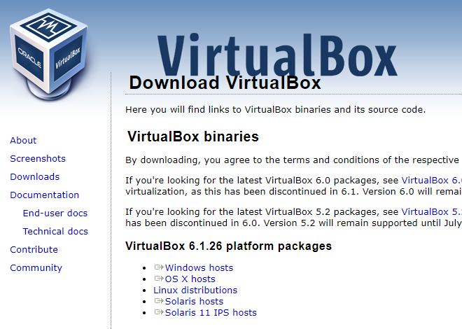
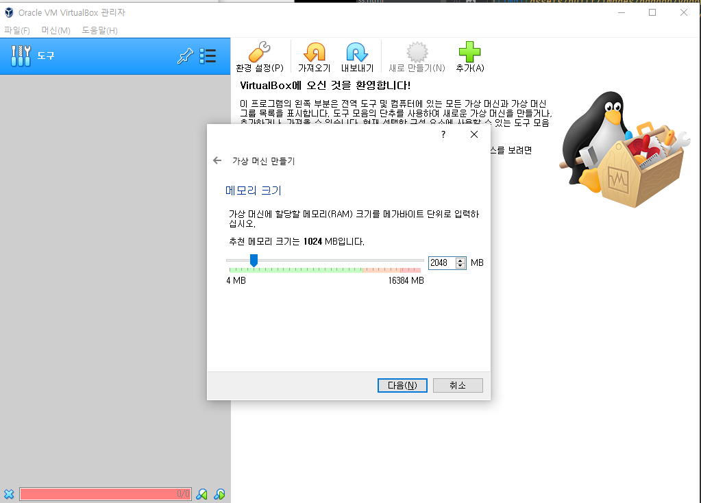
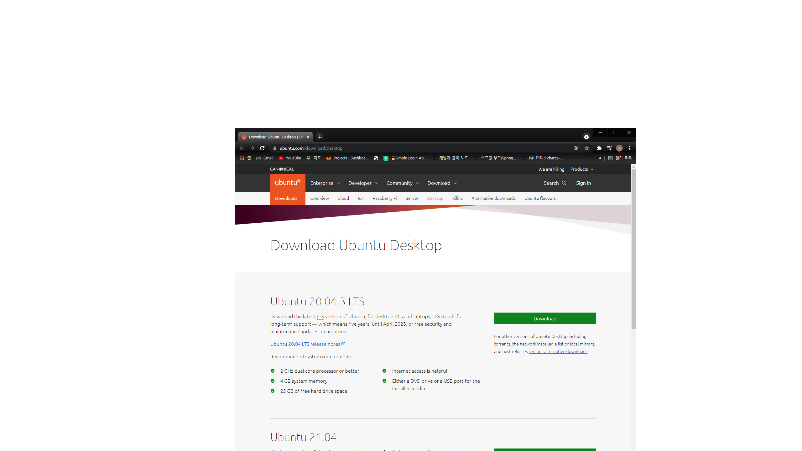
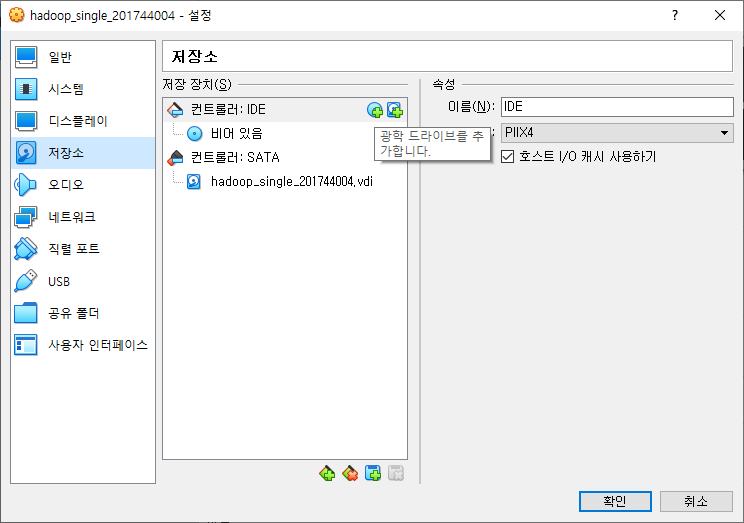
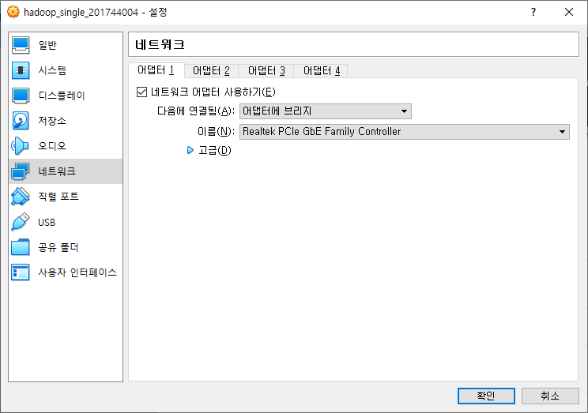

본 게시물은 윈도우 환경에서 진행하였습니다.

# VirtualBox 설치

- [다운로드](https://www.virtualbox.org/wiki/Downloads) 를 클릭하여 해당 페이지로 이동
- Windows hosts 클릭 후 exe 파일 설치

- 머신 - 새로만들기
- 우분투를 설치 할 것이기 때문에
- 종류 Linux
- 버전 Ubuntu(64bit)

- 메모리 2GB
  - 하둡을 이용할려면 2GB 정도 필요
    총 4개의 이미지가 필요하므로 8GB 이상 필요
    부족하면 메모리크기 줄이기
- 지금 새 가상 이미지 만들기
- VDI 선택
- 동적할당 선택
- 크기 20GB
- 만들기 클릭

# Ubuntu 설치

- [다운로드](https://ubuntu.com/download/desktop) 를 클릭하여 해당 페이지로 이동
- see our alternative downloads. 클릭
- Ubuntu 18.04 LTS (Bionic Beaver) 클릭
- 64-bit PC (AMD64) desktop image 클릭하여 이미지 다운  
  
- VirtualBox 설정 - 저장소 - 디스크 추가
- VirtualBox 시작 버튼을 눌러 우분투 설치
- 한국어 설정
- ubuntu 설치
- 기본 설정으로 진행
- 사용자 입력
- 설치가 완료되면 다시시작  
  
- 우분투 종료후 VirtualBox 설정 - 네트워크 설정
