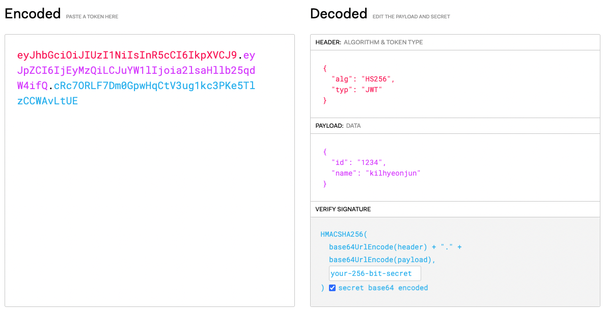

# JWT 란?

JWT(Json Web Token)란 JSON 포맷을 사용하여  
서비스 인증, 인가를 위해 사용되는 함호화된 토큰

# JWT 구조




Header

- alg : 알고리즘 방식
- typ : 토큰 타입

Payload

- 저장할 데이터

Signature

- 토큰 인코딩 및 유호성 검증시 사용되는 고유한 암호화 코드

## Router

```js
const express = require('express')
const router = express.Router({ mergeParams: true })
const validToken = require('../module/utils/authUtil').validToken // token 유효성 검사 미들웨어
const User = require('../controllers/user')

//user routes
router.post('/signup', User.signUp) // 회원가입
router.post('/signin', User.signIn) // 로그인
router.post('/logout', User.logout) // 로그아웃
router.get('/', User.find) // 모든회원정보 보기
router.delete('/delete/:email', User.delete) // 계정 삭제
router.get('/test', validToken, User.test) // jwt 인증 테스트

module.exports = router
```

## Controller

```js
const utils = require('../module/utils/utils')
const responseMessage = require('../module/utils/responseMessage')
const statusCode = require('../module/utils/statusCode')
const User = require('../model/User')
const jwt = require('../module/utils/jwt')

const options = {
  domain: 'localhost',
  path: '/',
  httpOnly: true,
}

module.exports = {
  // 회원가입
  signUp: async (req, res) => {
    const isDuplicate = (await User.findByEmail(req.body.email)) ? false : true
    const user = {
      email: req.body.email,
      name: req.body.name,
      password: req.body.password,
    }
    // 이메일 중복
    if (isDuplicate) {
      return res
        .status(statusCode.BAD_REQUEST)
        .send(utils.successFalse(responseMessage.ALREADY_ID))
    }
    // 회원가입 진행
    else {
      await User.save(user)
      return res
        .status(statusCode.OK)
        .send(utils.successTrue(responseMessage.SIGN_UP_SUCCESS, user))
    }
  },

  //로그인하기
  signIn: async (req, res) => {
    // 이메일 주소가 있을 때
    const user = await User.findByEmail({ email: req.body.email })
    if (user) {
      //비밀번호가 틀렸을 때
      if (user.password !== req.body.password)
        return res
          .status(statusCode.BAD_REQUEST)
          .send(utils.successFalse(responseMessage.SIGN_IN_FAIL))
      //  로그인 성공
      else {
        const token = jwt.sign(user)
        res.cookie('token', token, options)
        return res
          .status(statusCode.OK)
          .send(utils.successTrue(responseMessage.SIGN_IN_SUCCESS, token))
      }
    }
    // 이메일 없을 떄
    else
      return res
        .status(statusCode.BAD_REQUEST)
        .send(utils.successFalse(responseMessage.NO_USER))
  },

  // 사용자 조회
  find: async (req, res) => {
    var users = await User.find()
    return res.json(users)
  },

  logout: (req, res) => {
    if (req.cookies?.token) res.clearCookie('token')
    return res
      .status(statusCode.OK)
      .send(utils.successTrue(responseMessage.LOGOUT_SUCCESS))
  },

  test: (req, res) => {
    return res.status(statusCode.OK).send(utils.successTrue('인증 성공'))
  },
}
```

# Model

```js
const pool = require('../module/db/pool')

module.exports = {
  find: async () => {
    const [result, _] = await pool.query('select * from users')
    return result
  },
  findByEmail: async user => {
    const [result, _] = await pool.query(
      'select * from users where email = ?',
      [user.email]
    )
    return result[0]
  },

  save: async user => {
    try {
      const [
        result,
        _,
      ] = await pool.query(
        'insert into users (email, password, name) values (?, ?, ?)',
        [user.email, user.password, user.name]
      )
      return result
    } catch (error) {
      console.log(error)
      return
    }
  },
}
```

# jwt util

```js
const jwt = require('jsonwebtoken')
const { secretKey, option } = require('../../../config/secretkey')
const TOKEN_EXPIRED = -3
const TOKEN_INVALID = -2

module.exports = {
  sign: user => {
    const payload = {
      name: user.name,
      email: user.email,
    }
    const result = {
      token: jwt.sign(payload, secretKey, option),
    }
    return result
  },

  verify: async token => {
    let decoded
    try {
      // verify를 통해 값 decode!
      decoded = jwt.verify(token, secretKey)
    } catch (err) {
      console.log(err)
      if (err.message === 'jwt expired') return TOKEN_EXPIRED
      else if (err.message === 'invalid token') return TOKEN_INVALID
      else return TOKEN_INVALID
    }
    return decoded
  },
}
```

https://github.com/kilhyeonjun/node_express_jwt
