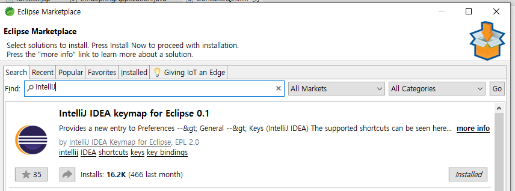

해당 게시물은 이 [강의](https://edu.goorm.io/lecture/24605/스프링부트-나만의-블로그-만들기)를 보고 제작하게되었습니다.

# ※ 환경 세팅

## 1. OpenJDK 설치

- 오라클 jdk 가 유료화가 됬습니다.
- 그러므로 OpenJDK 를 설치합니다.
- [링크](https://openjdk.java.net/)

## 2. MySQL 5.7 설치

- DB는 MySQL 사용할 것입니다
- 위에 버전을 사용해도 좋으나 버전마다 이슈사항이 다릅니다.(user password 문제 등)
- [링크](https://dev.mysql.com/downloads/windows/installer/5.7.html)

## 3. 폰트 설치

- 쿠키런 Regular 폰트를 사용할 것입니다.
- [링크](https://www.cookierunfont.com/#section7)

## 4. STS 툴 설치

- IDE는 Intellij도 있으나 유료이므로 STS를 사용합니다.
- [링크](https://spring.io/tools)

## 5. 인텔리 J - 키맵 세팅

- sts에서 Intellij 단축키를 사용하기위해 받아줍니다.
- Help - Eclipse Marketplace - IntelliJ IDEA keymap for Eclipse 0.1
- Window - Preferences - General - Editors - Keys - Scheme IntelliJ IDEA 설정

## 6. UTF-8 세팅

- Window - Preferences - General - Workspace - text file encoding UTF-8 설정
- Window - Preferences - Web - css, html, jsp encoding UTF-8 설정

## 7. 폰트 세팅

- Window - Preferences - General - Appearance - Colors and Fonts - basic - Text Font 원하는 폰트 설정
