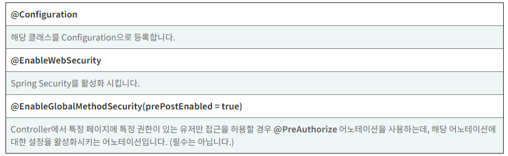

해당 게시물은 이 [강의](https://edu.goorm.io/lecture/24605/스프링부트-나만의-블로그-만들기)를 보고 제작하게되었습니다.

# 시큐리티 코드 짜기

## 1. 주소세팅

- / (컨텍스트 삭제)
- /auth/joinProc
- /auth/loginProc
- /auth/joinForm
- /auth/loginForm
- header.jsp
- joinForm.jsp
- user.js
- UserApiController.java
- UserController.java

## 2. 로그인 페이지 커스터마이징

- SecurityConfig.java

```java
package com.kbox.blog.config;

import org.springframework.context.annotation.Configuration;
import org.springframework.security.config.annotation.method.configuration.EnableGlobalMethodSecurity;
import org.springframework.security.config.annotation.web.builders.HttpSecurity;
import org.springframework.security.config.annotation.web.configuration.EnableWebSecurity;
import org.springframework.security.config.annotation.web.configuration.WebSecurityConfigurerAdapter;
import org.springframework.security.config.annotation.web.servlet.configuration.EnableWebMvcSecurity;


@Configuration // 빈 등록 (객체 생성)
@EnableWebSecurity // 필터 체인에 등록 (스프링 시큐리티 활성화)
@EnableGlobalMethodSecurity(prePostEnabled=true) // 특정 주소 접근시 권한 및 인증을 pre(미리) 체크하겠다.
public class SecurityConfig extends WebSecurityConfigurerAdapter{
@Override
protected void configure(HttpSecurity http) throws Exception {
    http
        .authorizeRequests()
        .antMatchers("/auth/loginForm", "/auth/joinForm")
        .permitAll()
        .anyRequest().authenticated()
        .and()
        .formLogin().loginPage("/auth/loginForm");
    }
}
```



- SecurityConfig.java 수정
  - 로그인 성공, 로그아웃 성공 URL 커스터마이징

```java
package com.kbox.blog.config;

import org.springframework.beans.factory.annotation.Autowired;
import org.springframework.context.annotation.Bean;
import org.springframework.context.annotation.Configuration;
import org.springframework.security.config.annotation.authentication.builders.AuthenticationManagerBuilder;
import org.springframework.security.config.annotation.method.configuration.EnableGlobalMethodSecurity;
import org.springframework.security.config.annotation.web.builders.HttpSecurity;
import org.springframework.security.config.annotation.web.configuration.EnableWebSecurity;
import org.springframework.security.config.annotation.web.configuration.WebSecurityConfigurerAdapter;
import org.springframework.security.crypto.bcrypt.BCryptPasswordEncoder;

import com.cos.blog.config.auth.PrincipalDetailService;


@Configuration // 빈 등록 (객체 생성)
@EnableWebSecurity // 필터 체인에 등록 (스프링 시큐리티 활성화)
@EnableGlobalMethodSecurity(prePostEnabled=true) // 특정 주소 접근시 권한 및 인증을 pre(미리) 체크하겠다.
public class SecurityConfig extends WebSecurityConfigurerAdapter{

	@Autowired
	private PrincipalDetailService principalDetailService;

	// 1. Bean 어노테이션은 메서드에 붙여서 객체 생성시 사용
	@Bean
	public BCryptPasswordEncoder encodePWD() {
		return new BCryptPasswordEncoder();
	}

	// 2. 시큐리티가 로그인할 때 어떤 암호화로 인코딩해서 비번을 비교할지 알려줘야 함.
	@Override
	protected void configure(AuthenticationManagerBuilder auth) throws Exception {
		auth.userDetailsService(principalDetailService).passwordEncoder(encodePWD());
	}

	// 3. 필터링
	@Override
	protected void configure(HttpSecurity http) throws Exception {
		http
        .csrf().disable()
	    .authorizeRequests()
	    .antMatchers("/", "/css/**", "/images/**", "/js/**", "/auth/**")
	    .permitAll()
	    .anyRequest().authenticated()
	    .and()
	    .formLogin().loginPage("/auth/loginForm")
	    .loginProcessingUrl("/auth/loginProc")
	    .defaultSuccessUrl("/");
	}

	// 참고 : .headers().frameOptions().disable() // 아이프레임 접근 막기
	// 참고 : .csrf().disable() // csrf 토큰 비활성화 (테스트시 걸어주는 것이 좋음)
}
```

- loginForm.jsp 변경 (input type에 name 속성 넣기)

```java
<%@ page language="java" contentType="text/html; charset=UTF-8" pageEncoding="UTF-8"%>

<%@ include file="../layout/header.jsp"%>

<div class="container">
	<form action="/auth/loginProc" method="post">
		<div class="form-group">
			<label for="username">Username</label>
			<input type="text" class="form-control" placeholder="Enter username" id="username" name="username">
		</div>

		<div class="form-group">
			<label for="password">Password</label>
			<input type="password" class="form-control" placeholder="Enter password" id="password" name="password">
		</div>

		<div class="form-group form-check">
			<label class="form-check-label">
			<input class="form-check-input" type="checkbox" name="remember"> Remember me
			</label>
		</div>
		<button class="btn btn-primary">로그인</button>
	</form>

</div>

<%@ include file="../layout/footer.jsp"%>
```

- user.js 수정

```java
let index = {
		init: function(){
			$("#btn-save").on("click", ()=>{ // function(){} , ()=>{} this를 바인딩하기 위해서!!
				this.save();
			});
		},

		save: function(){
			//alert('user의 save함수 호출됨');
			let data = {
					username: $("#username").val(),
					password: $("#password").val(),
					email: $("#email").val()
			};

			//console.log(data);

			// ajax호출시 default가 비동기 호출
			// ajax 통신을 이용해서 3개의 데이터를 json으로 변경하여 insert 요청!!
			// ajax가 통신을 성공하고 서버가 json을 리턴해주면 자동으로 자바 오브젝트로 변환해주네요.
			$.ajax({
				type: "POST",
				url: "/auth/joinProc",
				data: JSON.stringify(data), // http body데이터
				contentType: "application/json; charset=utf-8",// body데이터가 어떤 타입인지(MIME)
				dataType: "json" // 요청을 서버로해서 응답이 왔을 때 기본적으로 모든 것이 문자열 (생긴게 json이라면) => javascript오브젝트로 변경
			}).done(function(resp){
				alert("회원가입이 완료되었습니다.");
				//console.log(resp);
				location.href = "/";
			}).fail(function(error){
				alert(JSON.stringify(error));
			});

		},
}

index.init();
```

- PrincipalDetail.java
  - com.kbox.blog.config.auth 이하에 파일 생성

```java
package com.kbox.blog.config.auth;

import java.util.ArrayList;
import java.util.Collection;

import org.springframework.security.core.GrantedAuthority;
import org.springframework.security.core.authority.SimpleGrantedAuthority;
import org.springframework.security.core.userdetails.UserDetails;

import com.cos.blog.model.User;

//principal (접근 주체) = 세션처럼 사용 = Spring Security Context 에 보관됨
public class PrincipalDetail implements UserDetails{

	private static final long serialVersionUID = 7645618956884452156L;

	public PrincipalDetail(User user) {
		this.user = user;
	}

	private User user;

	public User getUser() {
		return user;
	}

	public void setUser(User user) {
		this.user = user;
	}

	// 계정의 비밀번호를 리턴한다.
	@Override
	public String getPassword() {
		return user.getPassword();
	}

	// 계정의 이름을 리턴한다.
	@Override
	public String getUsername() {
		return user.getUsername();
	}

	// 계정이 만료되지 않았는 지 리턴한다. (true: 만료안됨)
	@Override
	public boolean isAccountNonExpired() {
		return true;
	}

	// 계정이 잠겨있지 않았는 지 리턴한다. (true: 잠기지 않음)
	@Override
	public boolean isAccountNonLocked() {
		return true;
	}

	// 비밀번호가 만료되지 않았는 지 리턴한다. (true: 만료안됨)
	@Override
	public boolean isCredentialsNonExpired() {
		return true;
	}

	// 계정이 활성화(사용가능)인 지 리턴한다. (true: 활성화)
	@Override
	public boolean isEnabled() {
		return true;
	}

	// 계정이 갖고있는 권한 목록을 리턴한다. (권한이 여러개 있을 수 있어서 루프를 돌아야 하는데 우리는 한개만)
	@Override
	public Collection<? extends GrantedAuthority> getAuthorities() {

		Collection<SimpleGrantedAuthority> collectors = new ArrayList<>();
		collectors.add(new SimpleGrantedAuthority("ROLE_"+user.getRole()));

		return collectors;
	}

}
```

- UserRepository.java 수정

```java
package com.kbox.blog.repository;

import java.util.Optional;

import org.springframework.data.jpa.repository.JpaRepository;

import com.cos.blog.model.User;

// DAO
// 자동으로 bean등록이 된다.
// @Repository // 생략 가능하다.
public interface UserRepository extends JpaRepository<User, Integer>{
//  JPA Naming 쿼리
//  SELECT * FROM user WHERE username = ?1 AND password = ?2;
//  User findByUsernameAndPassword(String username, String password);

//	@Query(value="SELECT * FROM user WHERE username = ?1 AND password = ?2", nativeQuery = true)
//	User login(String username, String password);

	Optional<User> findByUsername(String username);
}
```

- UserService.java 수정

```java
package com.kbox.blog.service;

import org.springframework.beans.factory.annotation.Autowired;
import org.springframework.stereotype.Service;
import org.springframework.transaction.annotation.Transactional;

import com.cos.blog.model.User;
import com.cos.blog.repository.UserRepository;

// 스프링이 컴포넌트 스캔을 통해서 Bean에 등록을 해줌. IoC를 해준다.
@Service
public class UserService {

	@Autowired
	private UserRepository userRepository;

	@Transactional
	public void 회원가입(User user) {
		userRepository.save(user);
	}

//	@Transactional(readOnly = true) // Select할 때 트랜잭션 시작, 서비스 종료시에 트랜잭션 종료 (정합성)
//	public User 로그인(User user) {
//		return userRepository.findByUsernameAndPassword(user.getUsername(), user.getPassword());
//	}
}
```

- UserApiController.java 수정

```java
package com.kbox.blog.controller.api;

import org.springframework.beans.factory.annotation.Autowired;
import org.springframework.http.HttpStatus;
import org.springframework.web.bind.annotation.PostMapping;
import org.springframework.web.bind.annotation.RequestBody;
import org.springframework.web.bind.annotation.RestController;

import com.cos.blog.dto.ResponseDto;
import com.cos.blog.model.RoleType;
import com.cos.blog.model.User;
import com.cos.blog.service.UserService;

@RestController
public class UserApiController {

	@Autowired
	private UserService userService;

	@PostMapping("/auth/joinProc")
	public ResponseDto<Integer> save(@RequestBody User user) { // username, password, email
		user.setRole(RoleType.USER);
		userService.회원가입(user);
		return new ResponseDto<Integer>(HttpStatus.OK.value(), 1); // 자바오브젝트를 JSON으로 변환해서 리턴 (Jackson)
	}

}
```

- PrincipalDetailService.java

```java
package com.kbox.blog.config.auth;

import org.springframework.beans.factory.annotation.Autowired;
import org.springframework.security.core.userdetails.UserDetails;
import org.springframework.security.core.userdetails.UserDetailsService;
import org.springframework.security.core.userdetails.UsernameNotFoundException;
import org.springframework.stereotype.Service;

import com.cos.blog.model.User;
import com.cos.blog.repository.UserRepository;

@Service // Bean 등록 (IoC)
public class PrincipalDetailService implements UserDetailsService{

	@Autowired
	private UserRepository userRepository;

	// LoginForm에서 action="/loginProc" 되면
	// 스프링 필터 체인이 낚아채서 loadUserByUsername함수를 호출한다.
	@Override
	public UserDetails loadUserByUsername(String username) throws UsernameNotFoundException {
		User principal = userRepository.findByUsername(username)
				.orElseThrow(()->{
					return new UsernameNotFoundException("해당 사용자를 찾을 수 없습니다. : "+username);
				});

		return new PrincipalDetail(principal);
	}

}
```

- SecurityConfig.java 최종

```java
package com.kbox.blog.config;

import org.springframework.beans.factory.annotation.Autowired;
import org.springframework.context.annotation.Bean;
import org.springframework.context.annotation.Configuration;
import org.springframework.security.config.annotation.authentication.builders.AuthenticationManagerBuilder;
import org.springframework.security.config.annotation.method.configuration.EnableGlobalMethodSecurity;
import org.springframework.security.config.annotation.web.builders.HttpSecurity;
import org.springframework.security.config.annotation.web.configuration.EnableWebSecurity;
import org.springframework.security.config.annotation.web.configuration.WebSecurityConfigurerAdapter;
import org.springframework.security.crypto.bcrypt.BCryptPasswordEncoder;

import com.cos.blog.config.auth.PrincipalDetailService;


@Configuration // 빈 등록 (객체 생성)
@EnableWebSecurity // 필터 체인에 등록 (스프링 시큐리티 활성화)
@EnableGlobalMethodSecurity(prePostEnabled=true) // 특정 주소 접근시 권한 및 인증을 pre(미리) 체크하겠다.
public class SecurityConfig extends WebSecurityConfigurerAdapter{

	@Autowired
	private PrincipalDetailService principalDetailService;

	// 1. Bean 어노테이션은 메서드에 붙여서 객체 생성시 사용
	@Bean
	public BCryptPasswordEncoder encodePWD() {
		return new BCryptPasswordEncoder();
	}

	// 2. 시큐리티가 로그인할 때 어떤 암호화로 인코딩해서 비번을 비교할지 알려줘야 함.
	@Override
	protected void configure(AuthenticationManagerBuilder auth) throws Exception {
		auth.userDetailsService(principalDetailService).passwordEncoder(encodePWD());
	}

	// 3. 필터링
	@Override
	protected void configure(HttpSecurity http) throws Exception {
		http
		.csrf().disable()
	    .authorizeRequests()
	    .antMatchers("/", "/css/**", "/images/**", "/js/**", "/auth/**")
	    .permitAll()
	    .anyRequest().authenticated()
	    .and()
	    .formLogin().loginPage("/auth/loginForm")
	    .loginProcessingUrl("/auth/loginProc")
	    .defaultSuccessUrl("/");
	}

	// 참고 : .headers().frameOptions().disable() // 아이프레임 접근 막기
	// 참고 : .csrf().disable() // csrf 토큰 비활성화 (테스트시 걸어주는 것이 좋음)
}
```

- UserService.java 수정

```java
package com.kbox.blog.service;

import org.springframework.beans.factory.annotation.Autowired;
import org.springframework.security.crypto.bcrypt.BCryptPasswordEncoder;
import org.springframework.stereotype.Service;
import org.springframework.transaction.annotation.Transactional;

import com.cos.blog.model.User;
import com.cos.blog.repository.UserRepository;

// 스프링이 컴포넌트 스캔을 통해서 Bean에 등록을 해줌. IoC를 해준다.
@Service
public class UserService {

	@Autowired
	private BCryptPasswordEncoder encoder;

	@Autowired
	private UserRepository userRepository;

	@Transactional
	public void 회원가입(User user) {
		// 회원가입시 패스워드를 인코딩 하지 않으면 시큐리티 로그인을 이용할 수 없다.
		String rawPassword = user.getPassword();
		String encPassword = encoder.encode(rawPassword);
		user.setPassword(encPassword);
		userRepository.save(user);
	}

//	@Transactional(readOnly = true) // Select할 때 트랜잭션 시작, 서비스 종료시에 트랜잭션 종료 (정합성)
//	public User 로그인(User user) {
//		return userRepository.findByUsernameAndPassword(user.getUsername(), user.getPassword());
//	}
}
```
