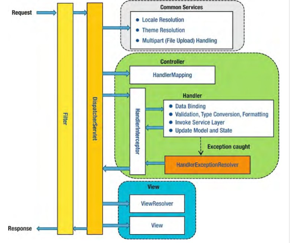

해당 게시물은 이 [강의](https://edu.goorm.io/lecture/24605/스프링부트-나만의-블로그-만들기)를 보고 제작하게되었습니다.

# 시큐리티 동작 원리

## 1. 스프링 mvc request life cycle

## 2. Filter와 Interceptor는 실행 시점이 다르다.

- Filter는 WebApplication에 등록 - web.xml
- Interceptor는 Spring의 Context에 등록

## 3. Interceptor와 Filter의 차이

- Interceptor는 시큐리티가 나오기전에 인증, 권한을 체크하는 훌륭한 도구로 사용되었다.
- Interceptor는 AOP를 흉내낼 수 있다. handlerMethod를 제공하기 때문에 메서드의 전후 처리가 가능하다.

## 4. Security

- Security의 인증 절차는 필터 체인을 거쳐 dispatcherservlet으로 가기전에 적용된다.
- 그리고 Security는 필터 체인을 통해서 걸러진 request 요청을 Interceptor를 이용해서 전후 처리할 수 있다.

## 5. Security 인증 절차

- Security를 통한 로그인은 Authentication 객체의 모험(여행)이라고 생각하면 이해하기 쉽다.

시큐리티가 로그인 하는 과정을 직접 해보는 예제하기

## 6. 스프링 시큐리티 설정 파일 참고

- https://bamdule.tistory.com/53
