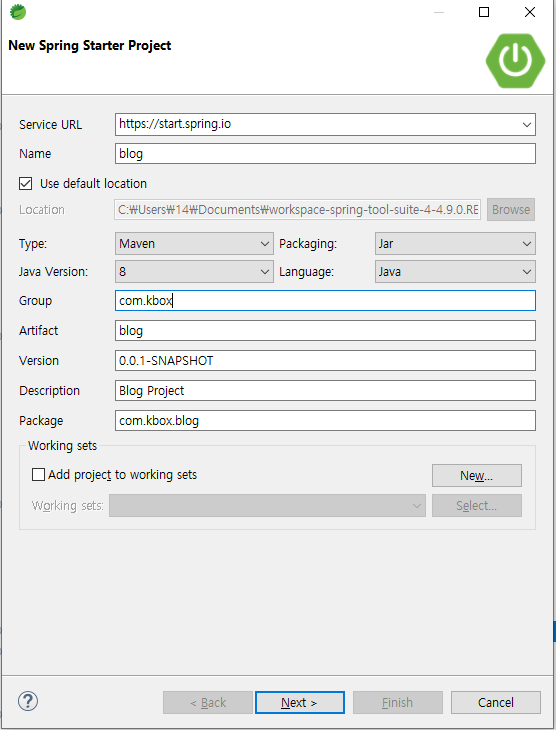
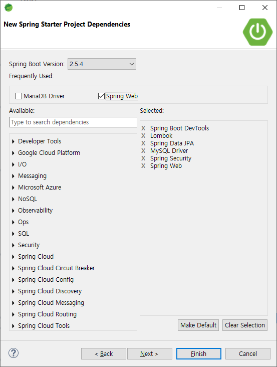

해당 게시물은 이 [강의](https://edu.goorm.io/lecture/24605/스프링부트-나만의-블로그-만들기)를 보고 제작하게되었습니다.

# ※ 의존성 설정

## 1. 프로젝트 생성



## 2. 의존성 설정



- Spring Boot DevTools
  - https://docs.spring.io/spring-boot/docs/1.5.16.RELEASE/reference/html/using-boot-devtools.html
  - spring boot 개발할때 필요한 기본 기능 제공
- Lombok
  - https://projectlombok.org/
  - Getter Setter 등 기능 제공
- Spring Data JPA
  - JPA를 통해 DB 접근
- MySQL Driver
  - MySQL DB 연동
- Spring Security
  - Spring 보안 라이브러리
- OAuth2 Client - 세팅안함.
  - 직접 노가다로 카카오 로그인 구현하여 개념잡기
  - 다음 인스타 프로젝트에서는 사용할 것임.
  - JWT는 APP과 연동할 때 사용할 예정
- 템플릿 엔진
  - jsp 사용할 예정 (타임리프도 있음)
- Spring Web
  - WEB MVC를 사용하여 웹 애플리케이션을 만드는데 필요한 스프링부트의 기본적인 요소를 가짐(어노테이션).
  - 내장형 컨테이너로 톰캣을 기본탑재하고 있다.
- 추가 적인 것들
  - https://mvnrepository.com/
- pom.xml 추가 라이브러리 의존성 추가

```xml
<!-- 추가 라이브러리 시작 -->
  <!-- 시큐리티 태그 라이브러리 -->
  <dependency>
    <groupId>org.springframework.security</groupId>
    <artifactId>spring-security-taglibs</artifactId>
  </dependency>

  <!-- JSP 템플릿 엔진 -->
  <dependency>
    <groupId>org.apache.tomcat.embed</groupId>
    <artifactId>tomcat-embed-jasper</artifactId>
  </dependency>

  <!-- JSTL -->
  <dependency>
    <groupId>javax.servlet</groupId>
    <artifactId>jstl</artifactId>
  </dependency>
<!-- 추가 라이브러리 종료 -->
```
