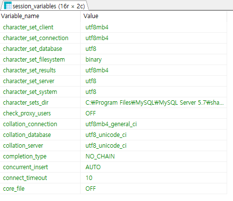

해당 게시물은 이 [강의](https://edu.goorm.io/lecture/24605/스프링부트-나만의-블로그-만들기)를 보고 제작하게되었습니다.

# ※ MySQL 한글 설정 및 연결

## 1. MySQL 한글 설정

```ini
[client]
default-character-set=utf8

[mysql]
default-character-set=utf8

[mysqld]
collation-server = utf8_unicode_ci
init-connect='SET NAMES utf8'
init_connect='SET collation_connection = utf8_general_ci'
character-set-server=utf8
```

- my.ini 파일에 해당위치에 추가
- 시스템 언어 utf-8로 변경 하기 위함
- MySQL 재시작

## 2. 한글 설정 확인



- show variables like 'c%';

## 3. 사용자 생성 및 권한 주기 및 DB 생성

```sql
-- 유저이름@아이피주소
create user 'kbox'@'%' identified by '1234';
-- ON DB이름.테이블명
-- TO 유저이름@아이피주소
GRANT ALL PRIVILEGES ON *.* TO 'kbox'@'%';
CREATE DATABASE blog CHARACTER SET utf8 DEFAULT COLLATE utf8_general_ci;
use blog;
```

- 해당 쿼리 실행해서 user 생성 및 권한 주기

## 4. MySQL 프로젝트 연결

- src/main/resources/application.properties 확장자를
- src/main/resources/application.yml 로 변경
- yaml 형식이 json과 같아 편함

```yml
spring:
  datasource:
    driver-class-name: com.mysql.cj.jdbc.Driver
    url: jdbc:mysql://localhost:3306/blog?serverTimezone=Asia/Seoul
    username: kbox
    password: 1234
```
