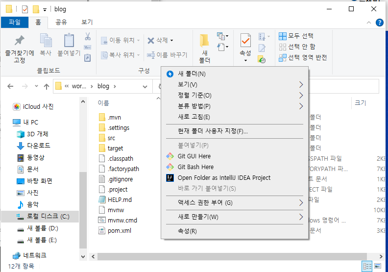
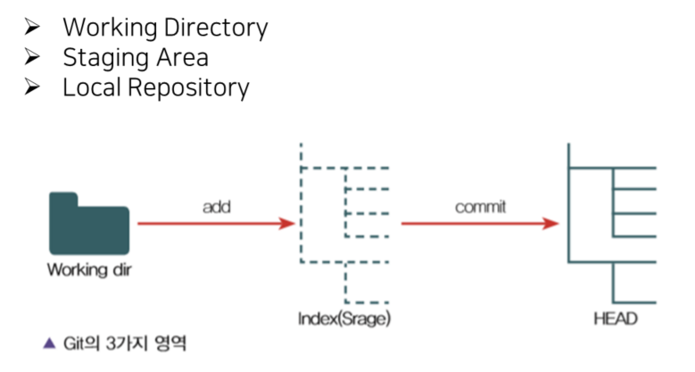

해당 게시물은 이 [강의](https://edu.goorm.io/lecture/24605/스프링부트-나만의-블로그-만들기)를 보고 제작하게되었습니다.

# ※ Git 세팅

## 1. github 회원가입

https://github.com/

## 2. git 설치

https://git-scm.com/downloads

## 3. 내 프로젝트 git 연동



- github 홈페이지에서 원격 repository 생성
- 내 프로젝트 폴더에서 오른쪽 클릭하여 git bash 실행

```bash
   git init
   git add .
   git commit -m "환경세팅완료 v1"
   git remote add origin https://github.com/kilhyeonjun/Springboot-JPA-Blog.git
   git push origin master
```


