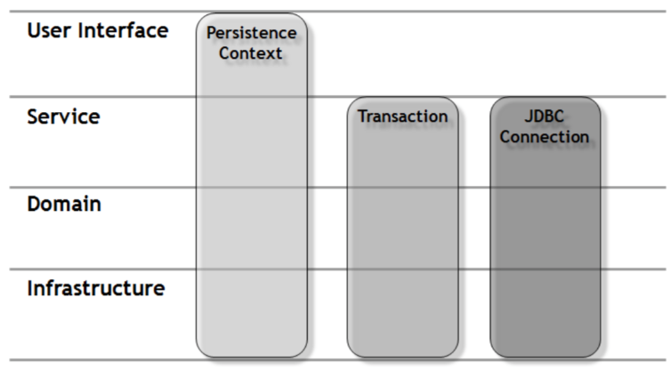
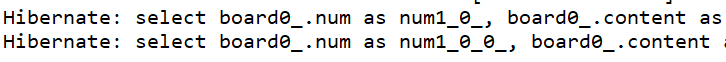

해당 게시물은 이 [강의](https://edu.goorm.io/lecture/24605/스프링부트-나만의-블로그-만들기)를 보고 제작하게되었습니다.

# yaml 설정

## 1. yaml 이란?

## 2. yml 설정

- web.xml, root-context.xml, servlet-context.xml의 합본
- application.yml

```yaml
server:
  port: 8000
  servlet:
    context-path: /blog
    encoding:
      charset: UTF-8
      enabled: true
      force: true

spring:
  mvc:
    view:
      prefix: /WEB-INF/views/
      suffix: .jsp

  datasource:
    driver-class-name: com.mysql.cj.jdbc.Driver
    url: jdbc:mysql://localhost:3306/blog?serverTimezone=Asia/Seoul
    username: cos
    password: cos1234

  jpa:
    open-in-view: true
    hibernate:
      ddl-auto: create
      naming:
        physical-strategy: org.hibernate.boot.model.naming.PhysicalNamingStrategyStandardImpl
      use-new-id-generator-mappings: false
    show-sql: true
    properties:
      hibernate.format_sql: true

  jackson:
    serialization:
      fail-on-empty-beans: false
```

### jasper

- .jsp 경로를 설정한 이유는 스프링 부트는 기본적으로 jsp사용이 권장하기 않기 때문에 timeleaf 같은 다른 템플릿 엔진을 사용해야 한다.
- 하지만 jsp를 사용하기 위해서는 해당 구조로 폴더 구성을 한 뒤 세팅하여야 한다.

### com.mysql.cj.jdbc.Driver

- datasource 의 mysql 드라이버에 cj가 들어간 이유는 mysql 6점대 이상 버전부터는 해당 드라이버를 사용하고
- 그 이전 드라이버는 cj가 없는 com.mysql.jdbc.Driver를 사용한다.

### open-in-view

```
org.springframework.orm.hibernate3.support.OpenSessionInViewFilter 클래스
```

- 영속성을 프리젠테이션 계층까지 가져간다.
- 트랜잭션은 Service계층에서 종료된다.
- Transaction이 종료된 후에도 Controller의 Session이 close되지 않았기 때문에,
- 영속 객체는 Persistence 상태를 유지할 수 있으며,
- 따라서 프록시 객체에 대한 Lazy Loading을 수행할 수 있게 된다.
- 버전 2.0부터 스프링 부트는 기본적으로 OSIV가 활성화되어있을 때 경고를 발행하므로 프로덕션 시스템에 영향을 주기 전에 이 문제를 발견 할 수 있다.  
  
- 서블릿 필터에서 Session 을 오픈하고 트랜잭션을 시작하던 전통적인 방식의 OPEN SESSION IN VIEW 패턴과 달리
- SpringMVC 에서 제공하는 OpenSessionInViewFilter 는 필터 내에서 Session 은 오픈하지만 트랜잭션은 시작하지 않는다.
- 따라서 서블릿 필터 안에서는 커넥션 풀로부터 JDBC 커넥션을 얻을 필요가 없다.

```
hibernate.enable_lazy_load_no_trans: true
```

- OSIV를 활성화 하였다면 위에 옵션을 필요 없다. 그리고 OSIV는 스프링부트가 디폴트로 활성화하고 있는 옵션이다. 경고를 제거하기 위해 명확하게 적어준 것 뿐!!

### ddl-auto

- create : 서버 시작시마다 DB초기화
- update : 수정사항만 DB에 반영
- none : DB에 아무런 반영을 하지 않음.

### physical-strategy

- org.hibernate.boot.model.naming.PhysicalNamingStrategyStandardImpl
- 엔티티를 만들 때 변수명 그대로 DB에 필드를 만들어 준다.
- org.springframework.boot.orm.jpa.hibernate.SpringPhysicalNamingStrategy
- 엔티티를 만들 때 변수명에 언더스코어를 붙여준다. 예) createDate -> create_date

### show-sql: true



### use-new-id-generator-mappings: false

- use-new-id-generator-mappings 는 mysql로 말하면 auto_increment 오라클로 말하면 시퀀스를 어떤식으로 사용할지 방식을 결정하는 것인데
- false를 하면 jpa가 사용하는 기본 넘버링 전략을 따라가지 않는다는 뜻이고 true를 하면 기본 넘버링 전략을 따라간다는 뜻이다.

### jackson.serialization.fail-on-empty-beans: false

- Lazy-loading으로 인해 empty-beans이 생길 수 있다.
- 너그럽게 빈 객체를 허락해주는 옵션이다.
