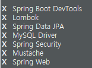

해당 게시물은 이 [강의](https://edu.goorm.io/lecture/24606/스프링부트-시큐리티-특강)를 보고 제작하게되었습니다.

# 환경설정

## MySQL DB 및 사용자 생성

```sql
create user 'kbox'@'%' identified by '1234';
GRANT ALL PRIVILEGES ON *.* TO 'kbox'@'%';
create database security;
use security;
```

## 프로젝트 생성



### Spring Boot DevTools

- Property Defaults
- Automatic Restart
- Live Reload
- Global Settings
- Remote Applications

### Lombok

- Getter/Setter
- ToString
- Constructor
- Builder

### Spring Data JPA

- Repository interface

### MySQL Driver

- JDBC

### Spring Security

- SecurityContextHolder
- SecurityContext
- Authentication
- UsernamePasswordAuthenticationToken
- AuthenticationProvider
- Authentication Manager
- UserDetails
- UserDetailsService
- Password Encoding
- GrantedAuthority

### Mustache

- template engine

### Spring Web

- spring-core
- spring-context
- spring-web
- spring-aop
- spring-beans
- spring-expression

## application.yml 설정

```yml
server:
  port: 8080
  servlet:
    context-path: /
    encoding:
      charset: UTF-8
      enabled: true
      force: true

spring:
  datasource:
    driver-class-name: com.mysql.cj.jdbc.Driver
    url: jdbc:mysql://localhost:3306/security?serverTimezone=Asia/Seoul
    username: kbox
    password: 1234

  # 생략 가능
  #  mvc:
  #    view:
  #      prefix: /templates/
  #      suffix: .mustache

  jpa:
    hibernate:
      ddl-auto: create #create update none
      naming:
        physical-strategy: org.hibernate.boot.model.naming.PhysicalNamingStrategyStandardImpl
    show-sql: true
```

## controller 생성

- com.kbox.security1.controller 패키지 생성

```java
package com.kbox.security1.controller;

import org.springframework.stereotype.Controller;
import org.springframework.web.bind.annotation.GetMapping;

@Controller // View를 리턴하겠다
public class IndexController {

	// localhost:8080/
	// localhost:8080
	@GetMapping({"","/"})
	public String index() {
		// 머스태치 기본폴더 src/main/resources/
		// viewReslover 설정 : templates (prefix), .mustach(suffix) 생략 가능
		return "index"; // src/main/resources/templates/index.mustach
	}
}
```

## ViewResolvers 설정

- com.kbox.security1.config 패키지 생성

```java
package com.kbox.security1.config;

import org.springframework.boot.web.servlet.view.MustacheViewResolver;
import org.springframework.context.annotation.Configuration;
import org.springframework.web.servlet.config.annotation.ViewResolverRegistry;
import org.springframework.web.servlet.config.annotation.WebMvcConfigurer;

@Configuration
public class WebMvcConfig implements WebMvcConfigurer{
	@Override
	public void configureViewResolvers(ViewResolverRegistry registry) {
		MustacheViewResolver resolver = new MustacheViewResolver();
		resolver.setCharset("UTF-8");
		resolver.setContentType("text/html; charset=UTF-8");
		resolver.setPrefix("classpath:/templates/");
		resolver.setSuffix(".html");

		registry.viewResolver(resolver);
	}
}
```
