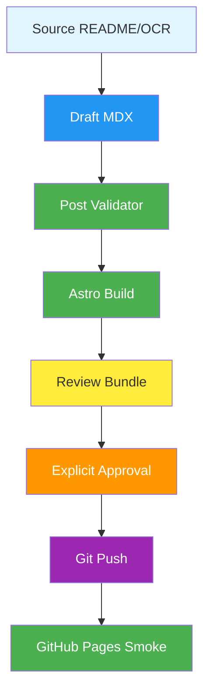

## 시작하며

가면사배2 블로그 1~13편을 한 번에 만들면서 느낀 건 단순했습니다. 글쓰기도 결국 운영입니다. 한 편을 감으로 쓰는 건 가능하지만, 열세 편을 비슷한 품질로 만들려면 감으로는 안 되더라고요. 초안을 만들고, 검증하고, 빌드하고, 검토용으로 묶고, 배포까지 확인하는 루프가 필요했습니다.

처음에는 “스터디 자료를 블로그 톤으로 바꾸면 되겠지” 정도로 생각했습니다. 그런데 실제로 해보니 문제가 계속 나왔습니다. MDX는 중괄호 하나에도 빌드가 깨질 수 있고, Telegram은 `.mdx` 첨부가 안정적이지 않았고, 날짜도 발표 PR 흐름과 맞춰야 했습니다. 글 자체보다 글을 안전하게 생산하는 흐름이 더 중요해진 순간이었습니다.

이 글은 그 과정을 프로젝트 제작기처럼 정리한 초안입니다. 아직 공개 글로 확정한 건 아니고, “블로그 하네스 자체를 어떻게 만들었는지”를 나중에 글감으로 쓸 수 있게 남겨둔 기록입니다.

## 문제는 글쓰기보다 반복성이었습니다

가면사배2 시리즈는 챕터가 13개입니다. 각 챕터마다 발표 README가 있고, OCR로 추출한 `full.md`가 있고, 블로그에는 개인 경험 공유체로 풀어야 했습니다. 한두 편이면 직접 읽고 손으로 고쳐도 됩니다. 하지만 13편이면 이야기가 달라집니다.

반복 작업에서 제일 위험한 건 “거의 됐다”는 착각입니다. 첫 번째 글은 잘 만들어졌는데 세 번째 글은 날짜가 틀릴 수 있습니다. 열 번째 글은 Mermaid가 깨질 수 있습니다. 열세 번째 글은 빌드는 되지만 검토용 첨부가 예전 버전일 수 있습니다. 사람이 마지막에 눈으로 한 번 보는 방식만으로는 이런 드리프트를 잡기 어렵습니다.

그래서 작업을 글쓰기 문제가 아니라 파이프라인 문제로 봤습니다.

| 단계 | 사람이 놓치기 쉬운 문제 | 하네스에서 잡아야 하는 것 |
|---|---|---|
| 소스 읽기 | 발표자료와 OCR 중 어느 쪽이 기준인지 흐려짐 | README와 OCR의 역할 분리 |
| 초안 생성 | 챕터마다 톤과 구조가 달라짐 | 공통 템플릿과 섹션 규칙 |
| 품질 검증 | 분량, 토론 질문, Mermaid 누락 | validator |
| 빌드 | MDX 문법 오류 | Astro build |
| 검토 전달 | 첨부 누락 또는 이전 버전 전달 | txt + zip 패키징 |
| 배포 | 승인 없이 push | 명시 승인 gate |

이 표를 만들고 나니 어떤 스크립트를 만들어야 하는지 선명해졌습니다. 글을 잘 쓰는 것도 중요하지만, “같은 실수를 다시 안 하게 만드는 장치”가 더 중요했습니다.

## 하네스의 핵심은 완료 조건을 코드로 만드는 것이었습니다

이번에 만든 검증은 대단한 NLP 평가기가 아닙니다. 대신 블로그 글이 최소한 지켜야 할 구조를 코드로 확인합니다. 예를 들어 frontmatter가 있는지, `draft` 값이 맞는지, 시리즈 이름과 순서가 맞는지, Mermaid가 충분한지, 토론 질문이 있는지, AI스러운 상투어가 너무 많지 않은지 봅니다.

처음에는 이런 검사가 너무 단순한가 싶었습니다. 그런데 실제로는 단순한 검사가 제일 많이 막아줬습니다. 사람이 놓치는 건 복잡한 논리보다 “3장 날짜가 틀렸다”, “빌드 전에 첨부를 만들어서 첨부가 옛날 버전이다”, “중괄호 때문에 MDX가 깨진다” 같은 기본적인 부분이더라고요.



이 흐름에서 중요한 건 각 단계가 다음 단계의 입력을 보장한다는 점입니다. validator가 통과해야 build를 돌릴 의미가 있고, build가 통과해야 검토 묶음을 보낼 의미가 있습니다. 그리고 검토 묶음을 보낸 뒤에 글을 수정했다면 다시 묶어야 합니다. 이걸 규칙으로 박아두지 않으면 언젠가 반드시 이전 파일을 보냅니다.

## MDX는 글쓰기 도구이면서 컴파일 대상입니다

Markdown만 생각하면 글은 텍스트입니다. 하지만 Astro MDX에서는 글이 컴파일 대상입니다. 본문에 들어간 중괄호, JSX처럼 해석될 수 있는 문자, 잘못된 frontmatter는 모두 빌드 실패로 이어질 수 있습니다. 블로그 글인데 빌드가 깨지는 순간 코드와 똑같이 다뤄야 합니다.

이번에 특히 신경 쓴 건 중괄호였습니다. 시스템 설계 글에는 `&#123;id&#125;`, `&#123;userId&#125;` 같은 표현을 예시로 쓰고 싶을 때가 많습니다. 코드 블록 안이면 괜찮지만, 본문에 그대로 쓰면 MDX가 표현식으로 해석할 수 있습니다. 그래서 generator 단계에서 코드 블록 밖의 중괄호를 escape하거나, validator에서 raw brace를 잡게 했습니다.

```typescript
// 본문 설명에는 이런 식의 중괄호가 위험할 수 있습니다.
const path = "/users/{userId}";

// 코드 블록 안에서는 괜찮지만,
// MDX 본문에서는 &#123;userId&#125; 처럼 escape하는 편이 안전합니다.
```

이 부분을 겪으면서 글쓰기 자동화에도 빌드 안전성이 필요하다는 걸 다시 느꼈습니다. 좋은 문장만으로는 부족합니다. 최종 산출물이 실제 사이트에서 렌더링되어야 합니다.

## Telegram 검토는 별도 산출물로 봐야 했습니다

처음에는 생성된 `.mdx` 파일을 그대로 보내면 된다고 생각했습니다. 그런데 메시징 플랫폼에서는 확장자, 파일명, 크기, 묶음 방식에 따라 전달이 달라질 수 있습니다. 사용자는 글을 검토하고 싶은데 파일 전달이 불안정하면 루프가 끊깁니다.

그래서 검토 산출물을 따로 만들었습니다.

| 산출물 | 목적 |
|---|---|
| `.mdx` | 실제 블로그 원본 |
| `.txt` | Telegram에서 안정적으로 읽는 검토본 |
| `.zip` | 여러 챕터를 한 번에 전달하는 묶음 |
| `VALIDATION-SUMMARY.txt` | 어떤 검증을 통과했는지 확인 |
| `BUILD.log` | Astro build 결과 확인 |

이렇게 분리하니 검토 루프가 훨씬 안정적이었습니다. 특히 여러 편을 한 번에 보낼 때는 zip 안에 README와 검증 로그를 같이 넣는 방식이 좋았습니다. “뭘 봐야 하는지”가 검토자 입장에서 명확해지기 때문입니다.

## 범용화하면서 study 전용과 공통부를 나눴습니다

가면사배2 작업을 끝낸 뒤 바로 든 생각은 이거였습니다. 이건 스터디 글에만 필요한 하네스가 아닙니다. 장애 회고, 디버깅 삽질기, 프로젝트 제작기, 튜토리얼에도 같은 루프를 쓸 수 있습니다.

그래서 구조를 둘로 나눴습니다.

| 영역 | 역할 |
|---|---|
| `study-blog-post-generator` | 가면사배/스터디 자료를 블로그로 바꾸는 전용 adapter |
| `blog-post-generator` | 모든 블로그 글에 공통으로 적용되는 작성/검증/패키징/publish 하네스 |

스터디 글에는 챕터 매핑, 발표 README, OCR `full.md`, Mermaid 보존 같은 전용 규칙이 필요합니다. 반면 모든 글에 공통으로 필요한 건 source-first, 민감정보 분류, frontmatter 검증, MDX safety, 빌드, 검토 패키징, 승인 후 배포입니다. 이걸 섞어두면 skill이 커지고 흐려집니다.

분리하고 나니 다음 주제도 adapter만 붙이면 됩니다. 예를 들어 장애 회고라면 증상, 영향, 원인, 해결, 재발 방지 구조를 쓰면 됩니다. 프로젝트 제작기라면 배경, 요구사항, 설계, 구현, 운영, 한계로 가면 됩니다.

## 검증 스크립트는 블로그 repo 안에도 있어야 합니다

처음에는 Hermes skill 안에 validator가 있었습니다. 그 자체로도 작업은 됩니다. 하지만 장기적으로는 블로그 repo 안에도 검증 스크립트가 있어야 합니다. 이유는 간단합니다. 블로그 repo를 열었을 때, 그 repo만으로도 품질 게이트를 이해하고 실행할 수 있어야 하기 때문입니다.

그래서 repo 쪽에도 다음 스크립트를 둘 수 있게 했습니다.

```bash
npm run verify:blog
npm run verify:blog:strict
npm run package:blog-review -- src/content/blog/example.mdx --output-prefix /tmp/blog-review
```

이렇게 되면 Hermes를 통해 작업하든, 터미널에서 직접 작업하든, 같은 검증 도구를 사용할 수 있습니다. 하네스가 특정 에이전트의 기억에만 있으면 약합니다. repo에 들어가야 다음 작업자도 같은 규칙을 볼 수 있습니다.

## 실무에 적용할 수 있는 인사이트들

### 1. 글도 빌드되는 산출물로 봐야 합니다

- MDX 블로그에서는 글이 단순 텍스트가 아닙니다.
- frontmatter, 중괄호, Mermaid, 이미지 경로 하나로 빌드가 깨질 수 있습니다.
- 그래서 글쓰기 루프에도 `npm run build`가 들어가야 합니다.

### 2. 검토 산출물과 배포 산출물을 분리해야 합니다

- 실제 원본은 `.mdx`입니다.
- 검토자는 `.txt`나 `.zip`이 더 편할 수 있습니다.
- 원본과 검토본이 달라질 수 있으니 마지막 수정 뒤에는 반드시 다시 패키징해야 합니다.

### 3. 전용 규칙과 공통 규칙은 빨리 분리하는 게 좋습니다

- 가면사배 챕터 매핑은 study 전용입니다.
- MDX safety, 승인 gate, build, review bundle은 공통입니다.
- 둘을 분리해야 다른 주제로 확장할 때 skill이 지저분해지지 않습니다.

### 4. 자동화는 “좋은 글”보다 “나쁜 상태를 막는 것”에서 먼저 효과가 납니다

- validator가 글의 재미를 보장하지는 않습니다.
- 하지만 날짜 오류, 필수 섹션 누락, draft 상태, MDX 위험은 잘 잡습니다.
- 품질 자동화는 창의성을 대신하기보다, 반복 실수를 줄이는 장치로 보는 게 맞았습니다.

## 아직 더 해볼 수 있는 것

가장 먼저 해볼 만한 건 실제로 다른 주제 글을 한 편 끝까지 써보는 겁니다. 예를 들어 “MDX 중괄호 때문에 Astro build가 깨진 문제”는 디버깅 글로 좋고, “가면사배2 블로그 일괄 생성 하네스”는 프로젝트 제작기로 좋습니다. 지금 이 글도 그 후보 중 하나입니다.

그다음은 SEO 쪽입니다. title과 description 길이, 시리즈 목록 노출, sitemap 포함, Pagefind 검색 포함 여부를 더 엄격히 볼 수 있습니다. 글이 많아질수록 검색과 목록 품질이 중요해집니다.

마지막으로 블로그 아이디어 backlog도 만들 수 있습니다. 작업 중에 “이건 글감이다” 싶은 순간을 놓치지 않고 후보로 쌓아두면, 나중에 글을 쓸 때 시작 비용이 줄어듭니다.

## 마무리

이번 작업을 하면서 다시 느낀 건, 하네스는 코딩에만 필요한 게 아니라는 점입니다. 글쓰기에도 반복 작업이 있고, 실패 패턴이 있고, 검증 기준이 있습니다. 그걸 코드와 skill로 고정해두면 다음 글을 쓸 때 훨씬 덜 흔들립니다.

특히 개인 블로그는 오래 갈수록 운영 자산에 가까워집니다. 한 번 잘 쓴 글도 좋지만, 계속 쓸 수 있는 구조를 만드는 게 더 중요합니다. 가면사배2 13편은 그 구조를 만들기 좋은 실험이었습니다.

이 초안은 아직 draft입니다. 실제로 공개하려면 문장을 더 줄이고, 예시를 조금 더 생생하게 만들고, 공개해도 되는 범위만 남기는 검토를 한 번 더 해야 합니다.

### 🤔 블로그 하네스에 대한 질문

- 글쓰기 자동화에서 사람의 검토는 어느 단계에 들어가는 게 가장 좋을까요?
- validator가 잡아야 할 품질 기준과 사람이 봐야 할 품질 기준은 어떻게 나누는 게 좋을까요?
- 개인 블로그에서도 CI처럼 글 품질 gate를 강하게 두는 게 장기적으로 도움이 될까요?

### 🛠️ 운영 자동화에 대한 질문

- 검토용 zip과 실제 배포 파일이 달라지는 문제를 어떻게 더 안전하게 막을 수 있을까요?
- publish 후 live URL 200 확인 외에 어떤 smoke test를 추가하면 좋을까요?
- draft 글이 많아질 때 backlog와 배포 후보를 어떻게 관리하는 게 좋을까요?

댓글로 공유해주시면 함께 배워나갈 수 있을 것 같습니다!
