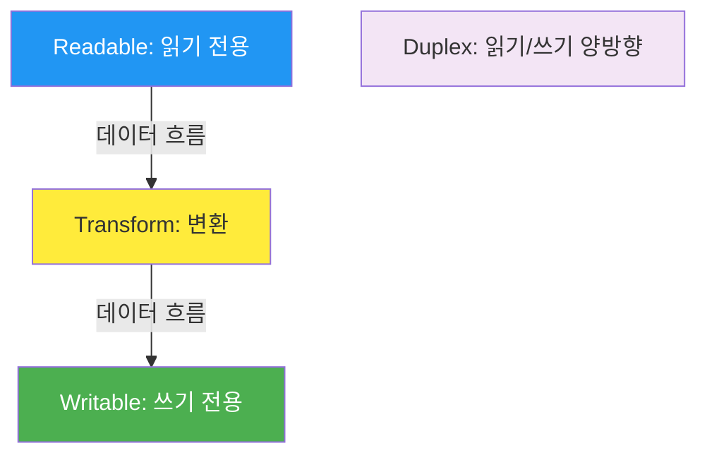
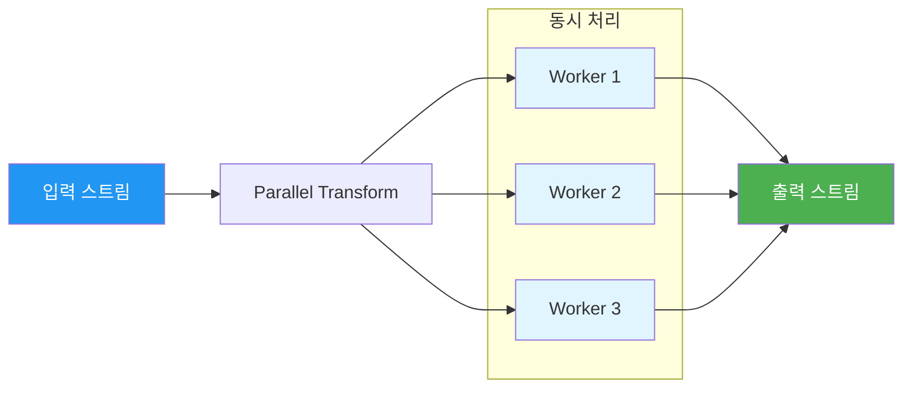

## 시작하며

Node.js 디자인 패턴 스터디 6주차! 지난 5장에서 **Promise와 async/await**로 비동기 제어 흐름의 우아함을 배웠다면, 이번 6장에서는 Node.js의 진정한 꽃이라 불리는 **스트림(Stream)**을 깊이 있게 다룹니다.

사실 스트림은 Node.js를 쓰면서 가장 자주 마주치지만, 동시에 가장 오해하기 쉬운 개념이기도 합니다. 처음에는 단순히 "파일 읽을 때 쓰는 거 아닌가?" 정도로만 생각했었는데, 이번에 정독해보니 데이터를 '청크(Chunk)' 단위로 쪼개어 흐르게 만든다는 것이 얼마나 강력한 철학인지 깨닫게 되더라고요. 특히 대용량 파일을 처리할 때 서버가 뻗지 않도록 지탱해 주는 최후의 보루 같은 존재라는 점이 인상적이었습니다.

개발자들 사이에서 "모든 것을 스트리밍 하십시오!"라는 말이 왜 나오는지, 그리고 왜 스트림이 Node.js 최고의 발명품 중 하나로 꼽히는지 이번 포스트를 활용해 정리해 보려 합니다. 데이터를 단순히 '담는' 것이 아니라 '흐르게' 만드는 기술, 스트림의 세계로 들어가 보겠습니다. 처음 공부할 때는 "그냥 한 번에 다 읽으면 편한데 왜 굳이 쪼개지?"라고 생각했는데, 실무에서 수백 메가바이트짜리 로그 파일을 다루다 보니 이 방식의 위력을 실감하게 되더라고요.

## 왜 스트림인가?

데이터를 처리할 때 우리는 보통 전체 데이터를 메모리에 올리는 **버퍼링(Buffering)** 방식을 먼저 떠올립니다. 하지만 데이터 크기가 기가바이트 단위로 커지면 어떻게 될까요? 서버의 RAM은 한계가 있고, 결국 `RangeError: Array buffer allocation failed` 같은 무시무시한 에러를 마주하게 됩니다.

스트림은 바로 이 지점에서 구원투수 역할을 합니다. 데이터를 한꺼번에 다루지 않고 아주 작은 조각으로 나누어 처리하기 때문에, 메모리 사용량을 일정하게 유지할 수 있습니다. "공간 효율성"뿐만 아니라 "시간 효율성"도 뛰어납니다. 첫 번째 조각이 도착하자마자 처리를 시작할 수 있으니까요. 이 조립성 또한 큰 장점인데, 작은 스트림들을 연결해서 거대한 파이프라인을 만드는 과정은 마치 레고를 조립하는 것처럼 즐겁더라고요.

### 버퍼링 vs 스트리밍 비교

두 방식의 차이를 표로 정리해 보았습니다. 트레이드오프를 이해하는 것이 설계의 중심이더라고요.

| 항목 | 버퍼링 (Buffering) | 스트리밍 (Streaming) |
| :--- | :--- | :--- |
| **메모리 사용** | 전체 데이터 크기에 비례 (위험) | 일정함 (청크 크기만큼만 사용) |
| **처리 시작 시점** | 전체 데이터 수신 완료 후 | 첫 번째 청크 수신 즉시 |
| **데이터 크기 제한** | 하드웨어 메모리 및 Buffer.MAX_LENGTH 제한 | 이론상 무제한 |
| **적합한 사례** | 작은 파일, 전체 데이터가 한 번에 필요한 연산 | 대용량 파일, 네트워크 통신, 실시간 처리 |

이 비교를 보면서 "아, 우리가 넷플릭스 영화를 볼 때 전체 파일이 다운로드될 때까지 기다리지 않는 이유가 바로 이거구나"라는 생각이 들었습니다. 만약 스트리밍이 없었다면 4K 영화 한 편을 보려고 몇 시간을 기다려야 했겠죠. 데이터가 흐른다는 개념이 사용자 경험에 얼마나 지대한 영향을 미치는지 다시금 깨달았습니다.

### 실제 예시: 파일 압축하기

간단한 파일 압축 예제를 활용해 두 방식의 차이를 코드로 보겠습니다.

```javascript
// ❌ 비효율적인 버퍼링 방식
import { promises as fs } from 'fs';
import { gzip } from 'zlib';
import { promisify } from 'util';

const gzipPromise = promisify(gzip);

async function compressFile(filename) {
  // 문제: 파일이 2GB를 넘으면 에러가 발생하거나 메모리 부족으로 프로세스가 죽습니다.
  // 전체 데이터를 한 번에 Buffer로 읽어들이기 때문입니다.
  const data = await fs.readFile(filename);
  const compressed = await gzipPromise(data);
  await fs.writeFile(`${filename}.gz`, compressed);
}
```

```javascript
// ✅ 효율적인 스트리밍 방식
import { createReadStream, createWriteStream } from 'fs';
import { createGzip } from 'zlib';
import { pipeline } from 'stream/promises';

async function compressFileStream(filename) {
  // 파일 크기가 10GB든 100GB든, 메모리는 아주 조금만 사용합니다.
  // pipeline API를 사용하면 파이프라인의 수명이 끝날 때 스트림을 자동으로 정리합니다.
  await pipeline(
    createReadStream(filename),
    createGzip(),
    createWriteStream(`${filename}.gz`)
  );
}
```

실무에서도 로그 파일을 분석하거나 대량의 DB 덤프 파일을 옮길 때 이 스트리밍 방식을 적극적으로 활용하고 있습니다. 특히 `pipeline` API를 쓰면 에러 처리와 스트림 정리가 자동으로 이루어져서 코드가 훨씬 견고해지더라고요. 예전에는 `.pipe()`를 여러 번 체이닝하다가 중간에 에러가 나면 리소스 누수가 생겨서 고생했던 기억이 있는데, `pipeline`을 쓰고 나서는 밤잠을 더 잘 잘 수 있게 되었습니다.

## 스트림의 4가지 타입

Node.js 스트림은 역할에 따라 크게 네 가지로 나뉩니다. 각 타입이 무엇을 담당하는지 아는 것이 스트림 코딩의 시작입니다.



### 1. Readable 스트림

데이터가 시작되는 곳입니다. 파일 시스템, HTTP 요청 바디 등이 여기에 속합니다. Readable 스트림은 두 가지 모드로 동작하는데, 이 차이를 이해하는 것이 중요했습니다.

- **Flowing 모드 (Push)**: 데이터가 들어오는 대로 콜백을 호출합니다. 가장 직관적이지만 흐름 제어가 까다로울 수 있습니다.
- **Non-flowing 모드 (Pull)**: 데이터를 직접 꺼내오는 방식입니다. `readable` 이벤트가 발생하면 `read()` 메서드로 필요한 만큼만 가져옵니다.

```javascript
// 방법 1: Non-flowing 모드 (Pull 방식)
// 명시적으로 데이터를 달라고 요청할 때만 읽습니다.
process.stdin
  .on('readable', () => {
    let chunk;
    // 버퍼가 빌 때까지 반복해서 읽습니다.
    while ((chunk = process.stdin.read()) !== null) {
      console.log(`읽어온 데이터: ${chunk.toString()}`);
    }
  })
  .on('end', () => console.log('입력 종료'));

// 방법 2: Flowing 모드 (Push 방식)
// 데이터가 들어오는 즉시 처리합니다.
process.stdin
  .on('data', chunk => {
    console.log(`받은 데이터: ${chunk.toString()}`);
  })
  .on('end', () => console.log('입력 종료'));
```

처음에는 그냥 `on('data')`만 쓰면 되는 줄 알았는데, 로직이 복잡해질수록 데이터를 '당겨오는' Pull 방식이 왜 필요한지 알겠더라고요. 스트림이 너무 빠르면 소비자가 감당하지 못할 수도 있으니까요. 시스템의 상황에 맞춰 속도를 조절할 수 있다는 점이 Pull 방식의 매력입니다.

### 2. Writable 스트림

데이터의 최종 목적지입니다. 파일에 쓰거나 HTTP 응답을 보내는 작업이 여기에 속합니다. 여기서 가장 중요한 개념이 바로 **Backpressure(백프레셔)**입니다.

만약 읽는 속도는 초당 100MB인데 쓰는 속도가 초당 10MB라면 어떻게 될까요? 남는 90MB는 메모리 어딘가에 쌓이게 되고, 결국 메모리 부족 사태가 벌어집니다. 이를 방지하기 위해 Writable 스트림은 "잠깐만, 나 지금 바빠!"라고 신호를 보낼 수 있습니다. `write()` 메서드가 `false`를 반환하는 시점이 바로 그 신호입니다.

```javascript
// 백프레셔를 고려한 커스텀 쓰기 함수
function writeMany(stream, data, encoding, callback) {
  let i = 0;

  function write() {
    let ok = true;
    while (i < data.length && ok) {
      // stream.write()가 false를 반환하면 내부 버퍼가 가득 찼다는 뜻입니다.
      ok = stream.write(data[i], encoding);
      i++;
    }

    if (i < data.length) {
      // 버퍼가 비워질 때 발생하는 'drain' 이벤트를 한 번만 기다립니다.
      stream.once('drain', write);
    } else {
      callback();
    }
  }

  write();
}
```

실제로 대량의 데이터를 외부 API로 전송할 때 백프레셔 처리를 안 해서 서버가 죽는 경우를 본 적이 있습니다. 스트림을 쓴다고 무조건 안전한 게 아니라, 흐름 제어를 존중해야 한다는 걸 뼈저리게 느꼈습니다. 이 로직을 직접 짜보면서 "흐름을 제어한다는 게 생각보다 섬세한 작업이구나"라는 생각이 들었습니다.

### 3. Transform 스트림

스트림의 진정한 매력은 여기서 나옵니다. 데이터를 읽고 쓰는 사이에 끼어들어 내용을 바꾸는 역할을 합니다. 압축, 암호화, 데이터 포맷 변경 등이 모두 Transform 스트림으로 구현됩니다. 단순히 `_transform` 메서드만 구현하면 되기 때문에 커스텀 스트림을 만들기가 매우 쉽습니다.

```javascript
import { Transform } from 'stream';

// 특정 텍스트를 치환하는 커스텀 Transform 스트림
class ReplaceStream extends Transform {
  constructor(searchStr, replaceStr, options) {
    super(options);
    this.searchStr = searchStr;
    this.replaceStr = replaceStr;
    this.tail = ''; // 청크가 단어 중간에서 잘릴 때를 대비한 꼬리 데이터
  }

  _transform(chunk, encoding, callback) {
    const pieces = (this.tail + chunk).split(this.searchStr);
    this.tail = pieces.pop(); // 마지막 조각은 다음 청크와 합쳐서 처리

    for (const piece of pieces) {
      this.push(piece + this.replaceStr);
    }
    callback();
  }

  _flush(callback) {
    this.push(this.tail); // 마지막 남은 꼬리 데이터 처리
    callback();
  }
}
```

"한 가지 일만 잘하는 작은 모듈을 조립하라"는 Unix 철학이 가장 잘 녹아있는 부분입니다. 예를 들어, 소문자를 대문자로 바꾸는 Transform 스트림을 만들어 두면 어디든 `pipe()`로 연결해서 재사용할 수 있습니다. 위 예제의 `tail` 처리를 보면서 "아, 스트림은 데이터가 어디서 잘릴지 모르니 이런 세세한 부분까지 신경 써야 하는구나"라고 감탄했습니다.

## 실전 스트림 패턴

이론을 넘어 실무에서 자주 쓰이는 패턴들을 정리해 보았습니다. 특히 `pipeline()`과 병렬 처리는 꼭 알아야 할 지식입니다.

### 순차 처리와 pipeline()

과거에는 `pipe()`를 썼지만, 이제는 `stream/promises`의 `pipeline()`을 사용하는 것이 정석입니다.

- **자동 에러 처리**: 중간 스트림 중 하나라도 에러가 나면 전체 파이프라인을 멈추고 연결된 모든 스트림을 정리합니다.
- **Promise 기반**: `await`로 깔끔하게 비동기 제어를 할 수 있습니다.

```javascript
import { pipeline } from 'stream/promises';
import { createReadStream, createWriteStream } from 'fs';
import { createGzip } from 'zlib';

try {
  // 여러 단계의 스트림을 하나로 엮습니다.
  await pipeline(
    createReadStream('large_data.txt'),
    createGzip(),
    createWriteStream('large_data.txt.gz')
  );
  console.log('성공적으로 압축되었습니다.');
} catch (err) {
  // 중간에 어디서 에러가 나도 여기서 한꺼번에 잡을 수 있습니다.
  console.error('압축 중 에러 발생:', err);
}
```

이런 세부사항들까지 고려해야 한다는 걸 보고 "Node.js는 단순히 데이터를 전달하는 게 아니라, 그 흐름의 생명주기 전체를 관리하는구나"라고 생각했습니다. `pipe()`만 썼을 때는 에러 핸들러를 모든 스트림에 하나하나 붙여야 해서 코드가 지저분해졌는데, `pipeline` 덕분에 광명을 찾았습니다.

### Duplex 스트림의 활용

Duplex 스트림은 읽기와 쓰기가 모두 가능한 양방향 스트림입니다. 가장 대표적인 예가 TCP 소켓입니다. 데이터를 보내면서 동시에 받을 수도 있죠. 읽기 채널과 쓰기 채널이 독립적으로 존재한다는 점이 특징입니다.

```javascript
import { createServer } from 'net';

const server = createServer((socket) => {
  // 소켓 자체가 Duplex 스트림입니다.
  socket.on('data', (data) => {
    console.log('클라이언트로부터 받은 데이터:', data.toString());
    // 받은 데이터를 그대로 다시 돌려주는 에코 서버 예시
    socket.write('서버 응답: ' + data);
  });
});

server.listen(8000, () => console.log('서버 실행 중...'));
```

실제로 네트워크 프로토콜을 구현하거나 프록시 서버를 만들 때 이 Duplex 스트림이 주요한 역할을 합니다. 읽기와 쓰기 스트림이 독립적으로 존재하면서도 하나의 객체로 관리된다는 점이 설계상 매우 깔끔하더라고요.

### 결합된 스트림 (Combined Streams)

여러 개의 스트림을 하나로 묶어 재사용 가능한 새로운 스트림을 만들 수도 있습니다. 예를 들어 '압축 후 암호화'하는 과정을 하나의 스트림처럼 취급하는 것이죠. `pumpify` 같은 라이브러리를 쓰면 이를 아주 쉽게 구현할 수 있습니다.

```javascript
import { createGzip } from 'zlib';
import { createCipheriv, randomBytes, scryptSync } from 'crypto';
import pumpify from 'pumpify';

function createEncryptStream(password) {
  const iv = randomBytes(16);
  const key = scryptSync(password, 'salt', 32);

  // 여러 스트림을 하나로 합쳐서 반환합니다. 
  // 외부에서는 이 반환값을 그냥 하나의 Writable/Readable 스트림처럼 쓰면 됩니다.
  return new pumpify(
    createGzip(),
    createCipheriv('aes-256-cbc', key, iv)
  );
}
```

이렇게 하면 복잡한 파이프라인 로직을 함수 내부로 숨기고, 외부에서는 그냥 하나의 스트림인 것처럼 편하게 `pipe()`로 연결할 수 있습니다. 모듈화의 정석이라고 봐도 무방할 것 같아요. 라이브러리 개발할 때 이런 식으로 내부 구현을 감추면 사용자가 훨씬 편하게 쓸 수 있겠더라고요.

### 병렬 처리 (Parallel Streams)

스트림은 처음부터 끝까지 순서대로 흐릅니다. 하지만 각 청크를 처리하는 데 시간이 오래 걸린다면(예: 네트워크 호출), 하나씩 처리하는 건 너무 느릴 수 있습니다. 이럴 때 **비순차 병렬 처리**를 고려해 볼 수 있습니다.



동시성(Concurrency)을 제한하면서 병렬로 처리하는 로직을 직접 구현해 보면, Node.js 스트림이 얼마나 유연한지 다시금 느끼게 됩니다. 다만 결과의 순서가 바뀔 수 있다는 점은 주의해야 하더라고요. 만약 순서가 중요하다면 추가적인 버퍼링 로직이 필요합니다. 실무에서 크롤러 만들 때 이 패턴을 썼더니 속도가 비교도 안 될 만큼 빨라져서 짜릿했던 기억이 납니다.

### 멀티플렉싱과 디멀티플렉싱

여러 데이터 소스를 하나의 스트림으로 합쳤다가 다시 나누는 기법도 중요합니다. 예를 들어 로그 파일 여러 개를 하나의 네트워크 연결로 보내는 상황이죠. 채널 ID를 부여해서 데이터를 섞어 보내고, 받는 쪽에서 다시 분리하는 방식입니다.

```javascript
// 간단한 멀티플렉싱 구조 예시
function multiplex(sources, destination) {
  sources.forEach((source, id) => {
    source.on('data', (chunk) => {
      // 헤더: [채널 ID (1바이트)][데이터 길이 (4바이트)]
      const header = Buffer.alloc(5);
      header.writeUInt8(id, 0);
      header.writeUInt32BE(chunk.length, 1);
      
      // 헤더와 데이터를 목적지 스트림에 씁니다.
      destination.write(header);
      destination.write(chunk);
    });
    
    source.on('end', () => {
      // 모든 소스가 끝나면 종료 처리 로직 (생략)
    });
  });
}
```

이 방식은 자원을 아끼면서도 여러 채널을 효율적으로 관리할 수 있게 해줍니다. 대규모 실시간 데이터 전송 시스템에서 꼭 사용되는 패턴이라는 걸 이번에 확실히 배웠습니다. "하나의 선으로 여러 이야기를 동시에 한다"는 개념이 네트워크 프로토콜의 정수처럼 느껴졌습니다.

## 스트림 코딩의 Best Practices

공부한 내용을 바탕으로 스트림을 다룰 때 지켜야 할 주요 원칙들을 정리해 보았습니다.

| 원칙 | 설명 | 적용 팁 |
| :--- | :--- | :--- |
| **작게 만들기** | 한 가지 일만 수행하는 스트림을 만듭니다. | Transform은 하나의 변환 작업만 담당하게 하세요. |
| **조합성 (Composability)** | 작은 스트림들을 연결하여 큰 로직을 만듭니다. | `pipe()`나 `pipeline()`을 적극적으로 활용하세요. |
| **에러 처리** | 파이프라인의 모든 단계에서 에러를 잡아야 합니다. | 가급적 `pipeline()` API를 사용하여 자동 정리를 믿으세요. |
| **Backpressure 존중** | 쓰기 스트림의 상태를 항상 확인해야 합니다. | `write()`의 반환값이 `false`라면 기다려야 합니다. |

### 실무 체크리스트: 언제 스트림을 써야 할까?

- **적합할 때**:
  - 수백 MB 이상의 대용량 파일을 읽거나 쓸 때
  - 네트워크를 활용해 데이터를 주고받을 때
  - 데이터를 받으면서 동시에 가공해야 할 때 (예: 실시간 로그 파싱)
  - HTTP 응답으로 비디오나 대용량 파일을 전송할 때

- **피해야 할 때**:
  - 데이터 크기가 매우 작을 때 (수 KB 수준) - 오히려 오버헤드가 큽니다.
  - 전체 데이터가 한꺼번에 있어야만 작업이 가능한 상황 (예: 정렬, 전체 집계)
  - 데이터의 특정 위치로 자주 점프(Random Access)해야 할 때

## 실무에 적용할 수 있는 인사이트들

### 1. 파이프라인으로 로직 캡슐화하기

- 복잡한 데이터 변환 로직을 여러 개의 작은 Transform 스트림으로 쪼개세요.
- 각 스트림은 독립적으로 테스트하기 쉬워지고, 나중에 다른 곳에서도 재사용하기 좋습니다.
- 유지보수할 때 전체 흐름이 한눈에 들어오는 효과가 있습니다. "이 파이프라인은 읽기 -> 압축 -> 암호화 -> 쓰기 순서구나"라고 바로 보이니까요.

### 2. 백프레셔 신호를 절대로 무시하지 마세요

- `stream.write()`가 `false`를 반환하면 즉시 쓰기를 중단하고 `drain` 이벤트를 기다려야 합니다.
- 이를 무시하고 계속 쓰면 Node.js의 내부 버퍼가 계속 커져서 메모리 누수의 원인이 됩니다.
- 실무에서는 `stream.finished()`나 `pipeline()`을 써서 안전하게 제어하는 편이 좋습니다. "설마 죽겠어?" 하다가 진짜 죽는 게 서버더라고요.

### 3. Object Mode를 활용한 객체 스트리밍

- 스트림이 꼭 문자열이나 버퍼만 다루는 건 아닙니다. `objectMode: true` 설정을 하면 JS 객체 자체를 흘려보낼 수 있습니다.
- JSON 데이터를 파싱해서 객체 단위로 필터링하거나 가공할 때 매우 유용합니다.
- `JSONStream` 같은 라이브러리를 쓰면 거대한 JSON 파일도 메모리 부담 없이 다룰 수 있습니다. DB 데이터를 한꺼번에 긁어와서 가공할 때 최고입니다.

### 4. PassThrough 스트림으로 모니터링하기

- `PassThrough` 스트림은 데이터를 수정하지 않고 그대로 통과시키는 스트림입니다.
- 중간에 끼워 넣어서 흐르는 데이터의 크기를 측정하거나, 로그를 남기는 용도로 쓰면 좋습니다.
- "지금 데이터가 얼마나 흐르고 있지?"라는 궁금증이 생길 때 파이프라인 사이에 슬쩍 끼워 넣어보세요.

### 5. 메모리 누수를 막는 최후의 보루, pipeline

- `.pipe()`는 에러가 발생했을 때 파이프라인의 다른 스트림들을 자동으로 닫아주지 않습니다.
- `pipeline()`은 이 문제를 완벽하게 해결해 줍니다. 특히 비정상적으로 종료된 스트림이 열려있어서 파일 디스크립터가 고갈되는 무시무시한 상황을 막아줍니다.
- 최신 Node.js 환경이라면 무조건 `stream/promises`의 `pipeline`을 권장합니다.

## 마무리

스트림은 Node.js의 정체성과도 같습니다. "작은 것을 연결하여 큰 것을 만든다"는 철학을 가장 잘 보여주는 도구니까요. 이번 6장을 공부하면서, 그동안 파편화되어 있던 비동기 지식들이 스트림이라는 하나의 흐름으로 묶이는 느낌을 받았습니다.

특히 백프레셔나 에러 전파 같은 복잡한 문제를 `pipeline()` 하나로 해결할 수 있다는 점이 정말 매력적이었습니다. 개발자로서 단순히 '동작하는 코드'를 넘어 '자원을 효율적으로 쓰는 코드'를 고민하게 된 계기가 된 것 같아요. "기다림을 예술적으로 관리한다"는 Node.js의 정수를 스트림을 활용해 다시 한번 확인했습니다. 이전에는 스트림 코드만 보면 겁부터 났는데, 이제는 "어떻게 하면 더 우아하게 흘려보낼까?"를 고민하게 되네요.

다음 포스트에서는 드디어 **7장 "생성 디자인 패턴"**을 다룰 예정입니다. 팩토리, 싱글톤, 의존성 주입 등 우리가 매일 쓰는 디자인 패턴들이 Node.js 환경에서 어떻게 녹아들어 있는지, 그리고 실무(특히 NestJS!)에서 어떻게 활용되는지 깊이 있게 파헤쳐 보겠습니다. 스트림으로 데이터의 흐름을 잡았다면, 이제는 객체의 생성을 잡을 차례입니다!

### 🌊 스트림 설계에 대한 질문

- Readable 스트림의 Flowing 모드와 Non-flowing 모드 중, 어떤 상황에서 어떤 방식을 선택하는 것이 더 안정적일까요?
- 백프레셔(Backpressure) 현상이 발생했을 때, 단순히 대기하는 것 외에 시스템의 전체적인 병목을 해결하기 위한 다른 전략이 있을까요?
- Transform 스트림을 설계할 때, 하나의 스트림에 모든 변환 로직을 넣는 것과 여러 개로 쪼개어 연결하는 것 사이의 적절한 균형점은 어디일까요?

### 🛠️ 실무 적용과 경험에 대한 질문

- 대용량 JSON 파일을 파싱하거나 생성할 때, 전체를 메모리에 올리지 않고 처리해 본 경험이 있으신가요? 어떤 라이브러리나 기법을 사용하셨나요?
- 스트림 파이프라인 중간에서 에러가 발생했을 때, 리소스 누수를 방지하기 위해 어떤 조치를 취하셨나요? `pipeline()` 외에 다른 대안을 써보신 적이 있나요?
- 네트워크 소켓 통신에서 Duplex 스트림을 활용해 양방향 데이터를 처리해 본 적이 있나요? 이때 가장 까다로웠던 점은 무엇이었나요?

### 🚀 성능 최적화에 대한 질문

- 스트림의 청크(Chunk) 크기를 조절하는 것이 성능에 어떤 영향을 미칠까요? 너무 작거나 너무 클 때 각각 어떤 부작용이 있을까요?
- 병렬 스트림(Parallel Stream)을 사용할 때 동시성(Concurrency) 수치를 결정하는 기준은 무엇인가요? CPU 코어 수나 네트워크 대역폭 중 무엇을 더 고려하시나요?
- 스트림과 WebWorker 혹은 Worker Threads를 결합하여 CPU 집약적인 스트림 처리를 최적화해 본 사례가 있다면 공유해 주실 수 있나요?

댓글로 공유해주시면 함께 배워나갈 수 있을 것 같습니다!

