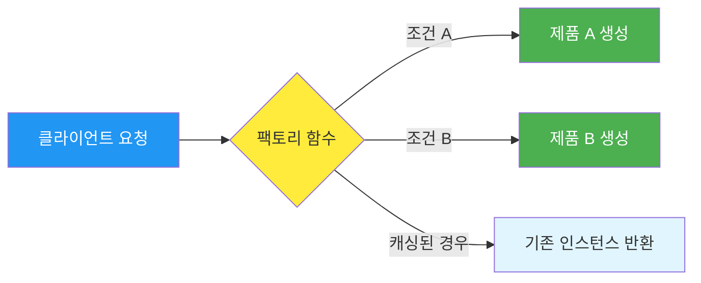

## 시작하며

Node.js 디자인 패턴 스터디 7주차에 접어들었습니다! 지난 6장에서는 데이터를 물 흐르듯 다루는 **스트림(Streams)**에 대해 공부했었는데, 이번 장에서는 그 데이터를 담을 그릇인 '객체'를 어떻게 하면 더 영리하게 만들 수 있을지에 대한 이야기를 나눕니다. 바로 **생성 디자인 패턴**입니다.

사실 자바스크립트는 클래스 기반 언어가 아니었던 시절부터 객체를 다루는 방식이 매우 유연했습니다. 그래서 전통적인 GoF(Gang of Four) 패턴이 제시하는 정형화된 방식과는 조금 결이 다른 부분이 있더라고요. 책을 읽으면서 "아, 이건 Node.js 환경이라서 더 중요하겠구나" 싶은 패턴들이 꽤 보였습니다. 

우리는 개발을 하면서 항상 "어떤 객체를 만들 것인가"에 집중하곤 합니다. 하지만 시스템이 복잡해질수록 "어떻게 만들 것인가"가 훨씬 더 중요한 문제가 되더라고요. 객체 하나를 만들 때마다 수많은 설정값과 의존성이 필요해진다면, 단순한 `new` 연산자만으로는 감당하기 어려운 시점이 반드시 옵니다. 

처음 개발을 시작했을 때는 그냥 `new` 키워드만 있으면 다 되는 줄 알았는데, 시스템 규모가 커질수록 객체 생성 로직이 여기저기 흩어져 있으면 유지보수가 정말 지옥이 된다는 걸 뼈저리게 느꼈던 기억이 납니다. 이번 스터디를 통해 그런 고민들을 해결할 수 있는 팩토리, 빌더, 그리고 현대 백엔드 프레임워크의 근간인 의존성 주입(DI)까지 정리해보는 시간을 가졌습니다.

특히 이번 장에서는 단순히 이론에 그치지 않고, 우리가 실무에서 가장 많이 사용하는 NestJS가 내부적으로 어떻게 의존성을 관리하는지도 딥다이브 해봤습니다. 평소에 "마법처럼 주입된다"라고 생각했던 기능들의 뒷면을 들여다보는 과정이 정말 즐거웠습니다. 자바스크립트라는 유연한 언어 위에서 어떻게 이런 엄격한 타입 기반의 DI 시스템이 구축되었는지 함께 나누고 싶습니다.

## 팩토리 (Factory)

## 팩토리 (Factory)

Node.js에서 가장 흔하게 마주치고, 또 가장 강력한 패턴 중 하나가 바로 **팩토리**입니다. 이름처럼 객체를 찍어내는 공장 역할을 하는 함수죠. `new` 연산자를 직접 쓰지 않고 함수 호출만으로 객체를 얻어내는 방식입니다.

단순히 `new`를 함수로 감싸는 것 이상의 의미가 있습니다. 팩토리를 사용하면 객체 생성 로직을 캡슐화하고, 호출자에게는 구현의 세부 사항을 숨긴 채 결과물만 던져줄 수 있거든요.

### 객체 생성과 구현의 분리

팩토리를 쓰면 얻는 가장 큰 이점은 역시 **유연성**입니다. 클라이언트는 어떤 클래스의 인스턴스가 생성되는지 몰라도 됩니다. 그냥 팩토리 함수에게 "이런 조건의 객체를 줘"라고 요청만 하면 되거든요. 

예를 들어 이미지 파일의 확장자에 따라 다른 처리 객체를 만들어야 한다고 생각해보겠습니다. 팩토리가 없다면 호출하는 쪽에서 매번 `if-else` 문을 돌리며 클래스를 선택해야 하겠지만, 팩토리를 쓰면 코드가 훨씬 깔끔해집니다.

```javascript
function createImage(name) {
  // 생성 로직을 팩토리 안에 꽁꽁 숨깁니다.
  if (name.match(/\.jpe?g$/)) {
    return new ImageJpeg(name);
  } else if (name.match(/\.gif$/)) {
    return new ImageGif(name);
  } else if (name.match(/\.png$/)) {
    return new ImagePng(name);
  } else {
    throw new Error('지원하지 않는 형식입니다');
  }
}
```

### 실전 예제: 코드 프로파일러

환경 변수(`NODE_ENV`)에 따라 동작이 다른 객체를 반환하는 것도 팩토리의 주특기입니다. 개발 환경에서는 실제 실행 시간을 측정하고, 운영 환경에서는 성능 영향을 주지 않기 위해 아무 작업도 하지 않는 'noop' 객체를 반환하는 식이죠.

```javascript
// profiler.js
class Profiler {
  constructor(label) {
    this.label = label;
    this.lastTime = null;
  }
  start() { this.lastTime = process.hrtime(); }
  end() {
    const diff = process.hrtime(this.lastTime);
    console.log(`Timer "${this.label}" took ${diff[0]}s ${diff[1]}ns.`);
  }
}

// 운영 환경용 빈 객체
const noopProfiler = { start() {}, end() {} };

export function createProfiler(label) {
  if (process.env.NODE_ENV === 'production') {
    return noopProfiler; // 운영 환경에서는 성능 최적화를 위해 아무것도 안 함
  }
  return new Profiler(label); // 개발 환경에서는 실제 측정 수행
}
```

실무에서 이런 패턴은 환경 설정에 따라 다른 로그 저장소를 반환하거나, 테스트 환경에서 가짜 객체(Mock)를 반환할 때 정말 유용하게 쓰입니다. 저는 예전에 외부 API 연동 모듈을 만들 때 개발 환경에서는 로컬 파일을 읽고 운영 환경에서는 실제 API를 호출하도록 팩토리를 구성했었는데, 코드 한 줄 바꾸지 않고 환경 변수만으로 동작을 제어할 수 있어서 정말 편했습니다. "운영 서버에서 로그가 너무 많이 남는데?" 싶을 때 팩토리 로직만 살짝 바꿔서 특정 조건에서만 로깅 객체를 반환하게 하면 배포 없이도 상황을 통제할 수 있더라고요.

### 캡슐화와 Private 변수

자바스크립트에서 팩토리 패턴이 사랑받는 또 다른 이유는 **클로저(Closure)**를 활용한 완벽한 캡슐화가 가능하기 때문입니다. 클래스의 `#` 필드 문법이 나오기 전에는 이 방식이 거의 유일한 `private` 변수 구현 방법이었죠.

```javascript
function createPerson(name) {
  // 이 변수는 외부에서 직접 접근할 수 없습니다.
  const privateProperties = {}; 

  const person = {
    setName(name) {
      if (!name) throw new Error('이름이 필요합니다');
      privateProperties.name = name;
    },
    getName() {
      return privateProperties.name;
    }
  };

  person.setName(name);
  return person;
}
```

이렇게 하면 객체의 상태를 외부의 무분별한 수정으로부터 보호할 수 있습니다. 팩토리가 반환하는 객체는 오직 우리가 허용한 메서드들만 들고 있으니까요. "객체는 데이터가 아니라 동작으로 정의된다"는 객체지향의 원칙을 가장 잘 보여주는 패턴이라는 생각이 들었습니다.

### 팩토리의 흐름 시각화

팩토리가 어떻게 요청을 처리하고 적절한 인스턴스를 반환하는지 간단한 흐름으로 그려봤습니다.



이 다이어그램을 보면 팩토리가 클라이언트와 구체적인 구현체 사이에서 완충 작용을 해주고 있다는 걸 알 수 있습니다. 중간에 생성 로직이 아무리 복잡해져도 클라이언트는 영향을 받지 않는다는 게 핵심입니다.

## 빌더 (Builder)

가끔 생성자에 인자를 10개씩 넘겨야 하는 클래스들을 마주할 때가 있습니다. 이럴 때 우리는 소위 "생성자 지옥"에 빠지게 되죠. 인자의 순서가 헷갈리는 건 기본이고, 중간에 선택적인 인자가 끼어들면 코드는 엉망진창이 됩니다. 이 문제를 해결해주는 구원자가 바로 **빌더 패턴**입니다.

### 복잡한 생성자로부터 탈출하기

빌더 패턴은 객체 생성 과정을 단계별로 쪼갭니다. 각 단계는 읽기 쉬운 메서드 이름으로 표현되고, 마지막에 `build()` 메서드를 호출하며 최종 객체를 얻어내죠.

| 구분 | 일반적인 생성자 방식 | 빌더 패턴 방식 |
|------------|----------|----------|
| **가독성** | 인자 순서와 의미 파악이 어려움 | 메서드 이름을 통해 의도가 명확함 |
| **유연성** | 선택적 인자 처리가 까다로움 | 필요한 단계만 골라서 호출 가능 |
| **안정성** | 인자 누락 실수가 잦음 | build() 단계에서 최종 유효성 검사 가능 |
| **코드 스타일** | 단일 라인이 길어짐 | 유창한 인터페이스(Method Chaining) |

예를 들어 복잡한 설정을 가진 배(Boat) 객체를 만든다고 할 때, 빌더를 쓰면 코드가 이렇게 바뀝니다.

```javascript
// 빌더 패턴을 적용한 우아한 생성 방식
const myBoat = new BoatBuilder()
  .withMotors(2, 'Best Motor Co.', 'OM123')
  .withSails(1, 'fabric', 'white')
  .withCabin()
  .hullColor('blue')
  .build();
```

코드가 마치 문장처럼 읽히지 않나요? 이런 스타일을 **유창한 인터페이스(Fluent Interface)**라고 부릅니다. 각 메서드가 `this`를 반환하도록 설계해서 체이닝이 가능하게 만드는 거죠. 

### 실전 예제: URL 객체 빌더

우리가 매일 다루는 URL도 빌더 패턴을 적용하기 아주 좋은 예시입니다. 프로토콜, 호스트명, 포트, 쿼리 스트링 등 설정할 게 정말 많거든요.

```javascript
export class UrlBuilder {
  setProtocol(protocol) {
    this.protocol = protocol;
    return this;
  }
  setAuthentication(username, password) {
    this.username = username;
    this.password = password;
    return this;
  }
  setHostname(hostname) {
    this.hostname = hostname;
    return this;
  }
  setPort(port) {
    this.port = port;
    return this;
  }
  setPathname(pathname) {
    this.pathname = pathname;
    return this;
  }
  
  build() {
    // build() 단계에서 필수 인자들을 검증할 수 있습니다.
    if (!this.protocol || !this.hostname) {
      throw new Error('프로토콜과 호스트명은 필수입니다');
    }
    return new Url(this.protocol, this.hostname, this.port, /* ... */);
  }
}
```

실무에서 `knex`나 `superagent` 같은 라이브러리를 써보셨다면 이미 이 패턴의 혜택을 톡톡히 누리고 계신 겁니다. 복잡한 SQL 쿼리를 메서드 체이닝으로 조립하는 과정 자체가 빌더 패턴의 정수거든요. 저도 쿼리 빌더를 처음 접했을 때 "와, SQL을 이렇게 가독성 좋게 짤 수 있다니!" 하고 감탄했던 기억이 납니다. "아, 내가 짠 코드지만 정말 읽기 편하다"라는 느낌을 받을 때 개발의 즐거움이 느껴지더라고요.

## 공개 생성자 (Revealing Constructor)

이 패턴은 Node.js나 브라우저 환경의 자바스크립트에서 꽤 독특하게 쓰이는 녀석입니다. 이름부터가 조금 생소할 수 있는데, 가장 대표적인 예시를 들으면 바로 "아!" 하실 거예요. 바로 `Promise`입니다.

### 생성 시점에만 부여되는 특권

공개 생성자의 핵심은 객체가 **생성되는 바로 그 순간에만** 내부 상태를 변경할 수 있는 기능을 노출하는 것입니다. 일단 생성이 완료되면 그 기능은 외부에서 영영 사라집니다.

```javascript
new Promise((resolve, reject) => {
  // 이 안에서만 resolve, reject를 쓸 수 있습니다.
  // 생성된 promise 인스턴스에는 resolve 메서드가 없습니다!
});
```

이 패턴은 **불변성(Immutability)**을 지키면서도 초기화 단계에서는 자유로운 조작을 허용하고 싶을 때 정말 유용합니다. 책에서는 `ImmutableBuffer`라는 예시를 통해 생성 시에만 데이터를 쓰고 이후에는 읽기 전용이 되는 버퍼를 구현하는데, 이게 참 영리한 방식이더라고요. 

### 활용 사례: 변경 불가능한 버퍼 만들기

생성 시에만 데이터를 쓸 수 있고, 생성이 끝나면 읽기 전용으로 변하는 버퍼를 직접 구현해본다면 이런 모양이 될 것 같아요.

```javascript
// immutableBuffer.js
export class ImmutableBuffer {
  constructor(size, executor) {
    const buffer = Buffer.alloc(size);
    const modifiers = {}; 
    
    // 버퍼의 모든 메서드를 돌면서 write가 포함된 메서드만 modifiers로 뺍니다.
    Object.keys(Object.getPrototypeOf(buffer)).forEach(prop => {
      if (typeof buffer[prop] !== 'function') return;
      
      if (prop.startsWith('write')) {
        modifiers[prop] = buffer[prop].bind(buffer);
      } else {
        this[prop] = buffer[prop].bind(buffer);
      }
    });

    // 실행 함수(executor)에만 쓰기 권한이 있는 modifiers를 전달합니다.
    executor(modifiers);
  }
}

// 사용 예시
const immutable = new ImmutableBuffer(5, ({ writeInt8 }) => {
  writeInt8(10, 0); // 생성 시점에는 가능!
});

console.log(immutable.readInt8(0)); // 10 (읽기 가능)
// immutable.writeInt8(20, 0); // 에러! 인스턴스에는 write 메서드가 없습니다.
```

객체의 제어권을 매우 세밀하게 다룰 수 있게 해줍니다. "생성할 때 너한테 잠깐 권한을 줄 테니까, 그때 다 해놓고 나중에 딴소리 마" 같은 느낌이랄까요? 보안이 중요한 모듈이나 상태가 고정되어야 하는 객체를 만들 때 고려해보면 좋을 패턴입니다. 저도 가끔 상태 관리가 너무 복잡해서 "제발 누가 내 변수 좀 안 건드렸으면 좋겠다" 싶을 때가 있는데, 그럴 때 이 패턴이 정답이 될 수 있겠더라고요.

## 싱글톤 (Singleton)

싱글톤은 전 세계 어디서든 딱 하나의 인스턴스만 존재하도록 보장하는 패턴입니다. 클래스 다이어그램에서 가장 먼저 배우는 패턴이기도 하죠. 그런데 Node.js에서는 이 싱글톤을 구현하는 방식이 조금 특별합니다.

### 모듈 시스템이 주는 선물

Node.js의 `require`나 `import`는 모듈을 처음 불러올 때 캐싱을 합니다. 이 특성을 이용하면 아주 간단하게 싱글톤을 만들 수 있습니다.

```javascript
// dbInstance.js
class Database {
  constructor(name) { this.name = name; }
}

// 인스턴스를 만들어서 내보냅니다.
export const dbInstance = new Database('my-app-db');
```

이렇게 하면 이 파일을 어디서 몇 번을 불러오든 항상 같은 메모리 주소의 `dbInstance`를 공유하게 됩니다. 별도의 싱글톤 클래스 로직을 짤 필요가 없는 거죠.

### 싱글톤의 함정: 절대 경로와 패키지 중복

하지만 주의할 점이 있습니다. Node.js의 캐싱 키는 파일의 **절대 경로**입니다. 만약 패키지 구조가 꼬여서 같은 라이브러리가 서로 다른 경로에 두 번 설치된다면(예: `node_modules` 하위의 `node_modules`), 각각 다른 인스턴스가 생성되는 대참사가 벌어질 수 있습니다.

특히 모노레포 환경이나 `pnpm`, `npm link`를 자주 사용하는 개발 환경에서 이런 문제가 빈번하게 발생합니다. 패키지 A가 의존하는 라이브러리 X와 패키지 B가 의존하는 라이브러리 X의 버전이 미세하게 다르다면, Node.js는 이를 별개의 모듈로 인식하고 각각 인스턴스를 만들어버립니다.

실제로 모노레포 환경에서 라이브러리 버전이 안 맞아서 싱글톤인 줄 알았던 DB 커넥션이 두 개가 생겨 리소스 부족으로 서버가 뻗었던 경험이 있습니다. 그때 이후로 싱글톤을 맹신하지 않고, 패키지 의존성 그래프를 꼼꼼히 확인하는 습관이 생겼습니다. 

이런 문제를 피하기 위해 어떤 개발자들은 `global` 객체에 인스턴스를 할당하는 극단적인 방법을 쓰기도 하지만, 이는 전역 오염과 디버깅의 어려움을 초래하기 때문에 권장되지 않습니다. 역시 가장 깔끔한 해결책은 의존성 관리 도구를 통해 버전을 통일하거나, 뒤에서 설명할 의존성 주입(DI)을 통해 단일 인스턴스를 명시적으로 관리하는 것입니다.

## 객체 생성 패턴, 언제 무엇을 써야 할까?

지금까지 여러 패턴을 살펴봤는데, 정작 실무에서 "이 상황엔 어떤 패턴이 정답이지?"라는 고민이 들 때가 많습니다. 제가 나름대로 정리한 기준은 다음과 같습니다.

1. **객체 생성 로직이 복잡하거나 조건에 따라 달라진다면?** → **팩토리 패턴**이 답입니다. 특히 클래스 이름을 호출자에게 노출하고 싶지 않을 때 가장 빛을 발합니다.
2. **생성자 인자가 너무 많고 가독성이 떨어진다면?** → 주저 없이 **빌더 패턴**을 선택하세요. 유효성 검사 로직을 `build()` 메서드 하나로 모을 수 있다는 점도 큰 매력입니다.
3. **앱 전체에서 상태를 공유해야 하는 자원(DB, Cache)이라면?** → **싱글톤 패턴**을 고려하되, Node.js의 모듈 시스템을 십분 활용하세요. 다만 의존성 중복 문제는 늘 머릿속에 넣어둬야 합니다.
4. **테스트 코드를 짜기 힘들고 모듈 간 결합도가 너무 높다면?** → **의존성 주입(DI)**이 유일한 해결책입니다. 처음에는 설정이 번거로울 수 있지만, 장기적으로는 가장 유지보수하기 좋은 코드를 만들어줍니다.

패턴은 도구일 뿐 목적이 되어서는 안 된다고 생각합니다. 현재 마주한 문제의 성격에 맞춰 가장 단순한 패턴부터 적용해보는 실용적인 접근이 필요하더라고요.

## 의존성 주입 (Dependency Injection)

마지막으로 살펴볼 주제는 **의존성 주입(DI)**입니다. 이건 사실 패턴이라기보다는 하나의 거대한 설계 원칙에 가깝습니다. 모듈 간의 결합도를 낮추기 위해 의존 객체를 내부에서 직접 만들지 않고 외부에서 넣어주는 방식이죠.

### 강한 결합의 위험성

모듈 안에서 다른 모듈을 직접 `import` 해서 써버리면, 그 모듈은 테스트하기가 정말 힘들어집니다. 데이터베이스를 직접 참조하는 블로그 서비스 모듈이 있다면, 테스트할 때마다 진짜 DB를 띄워야 하니까요.

```javascript
// 블로그 서비스가 DB를 주입받는 방식
export class Blog {
  constructor(db) {
    this.db = db; // 외부에서 넣어줍니다.
  }
}
```

이렇게 하면 테스트할 때는 진짜 DB 대신 메모리에서 돌아가는 가짜 DB를 넣어줄 수 있습니다. 이 작은 차이가 코드의 재사용성과 테스트 용이성을 완전히 바꿔놓습니다. 

### Manual Wiring vs DI Container

하지만 의존성이 많아지면 "조립"하는 코드가 엄청나게 복잡해집니다. A를 만들려면 B가 필요하고, B를 만들려면 C가 필요한 상황 말이죠.

```javascript
// Manual Wiring: 개발자가 직접 조립 (index.js)
const db = createDb("data.sqlite");
const auth = new AuthService(db);
const user = new UserService(db, auth);
const blog = new BlogService(db, user); 
// 서비스가 100개라면? 조립하는 코드만 수백 줄이 될 겁니다.
```

이 수동 조립 과정(Manual Wiring)의 고통을 덜어주기 위해 등장한 것이 바로 **DI 컨테이너**입니다. 개발자는 "무엇이 필요한가"만 선언하고, 조립은 기계(컨테이너)에게 맡기는 거죠.

---

## 실무 적용: NestJS의 의존성 주입

Node.js 생태계에서 DI를 가장 적극적으로, 그리고 우아하게 사용하는 프레임워크는 단연 NestJS입니다. NestJS는 위 조립 과정을 **IoC(Inversion of Control) 컨테이너가 자동 수행**합니다. 개발자는 "무엇이 필요한가(토큰/타입)"만 선언하면 되죠.

이 마법 같은 과정이 어떻게 일어나는지, 내부 동작 원리를 단계별로 파헤쳐 봤습니다.

### 1단계: 메타데이터 기록 (무엇이 필요한지 선언하기)

NestJS DI의 시작은 TypeScript의 **데코레이터**입니다. `@Injectable()`이 붙은 클래스는 컴파일 시점에 자신이 어떤 의존성을 가지고 있는지 메타데이터를 남깁니다.

TypeScript는 `emitDecoratorMetadata` 설정을 켜면 `design:paramtypes`라는 이름으로 생성자 파라미터의 타입 정보를 런타임에 보존합니다. 만약 타입 추론이 안 되는 커스텀 토큰을 쓴다면 `@Inject(TOKEN)`을 통해 `self:paramtypes`라는 별도 메타데이터에 기록하기도 하죠.

- **design:paramtypes**: 생성자 파라미터 타입 배열
- **self:paramtypes**: `@Inject()` 데코레이터가 남기는 직접적인 토큰 정보

결국 이 단계의 목표는 **"이 클래스는 A와 B가 있어야 생성될 수 있다"**라는 정보를 지도처럼 남겨두는 것입니다.

### 2단계: 의존성 그래프 구성 (누가 누구를 필요로 하는가)

`NestFactory.create()`가 호출되면 NestJS의 엔진이 돌아가기 시작합니다. 가장 먼저 하는 일은 애플리케이션의 모든 모듈을 훑으며 **의존성 그래프**를 그리는 것입니다.

1. **모듈 스캔**: `@Module()` 데코레이터의 `imports`를 따라 DFS(깊이 우선 탐색)를 수행하며 모든 모듈을 컨테이너에 등록합니다.
2. **프로바이더 래핑**: 등록된 각 프로바이더(서비스 등)는 `InstanceWrapper`라는 내부 객체로 감싸집니다. 이때 인스턴스는 아직 `null` 상태입니다. 스코프(Singleton, Request 등)와 같은 설정 정보만 담겨 있죠.

이 과정을 거치면 메모리 상에는 "전체 시스템의 조립도"가 완성됩니다. `InstanceWrapper`는 토큰, 스코프, 인스턴스 등을 관리하는 핵심 래퍼입니다.

### 3단계: 인스턴스 생성과 주입 (실제 조립 시작)

그래프가 완성되면 이제 실제로 객체를 만들 차례입니다. 이 책임은 **Injector** 클래스가 담당합니다.

Injector는 그래프를 순회하며 의존성 관계의 가장 밑바닥에 있는, 아무것도 필요로 하지 않는 프로바이더부터 인스턴스를 만들기 시작합니다. 

- **loadInstance**: 프로바이더 생성을 시도합니다. "이 프로바이더를 만들려면 먼저 의존성을 해결해야겠다"라고 판단하죠.
- **resolveConstructorParams**: 1단계에서 기록한 메타데이터를 꺼내 필요한 의존성들의 인스턴스가 이미 있는지 확인합니다. 없다면 재귀적으로 생성을 요청하죠.
- **instantiateClass**: 모든 조각이 모이면 드디어 **`new Provider(...instances)`**를 호출합니다.

우리가 수동으로 하던 작업을 프레임워크가 메타데이터를 기반으로 자동화한 것입니다. "아, 결국 프레임워크도 우리가 하던 짓을 대신 해주는구나"라는 생각이 들면서 그 정교함에 놀라게 됩니다. 사람이 하면 실수하기 쉬운 '순서'와 '조립'을 기계가 완벽하게 처리해주는 셈이죠.

### 주입 범위(Injection Scopes)의 차이

NestJS를 쓰다 보면 모든 프로바이더가 싱글톤인 것은 아닙니다. 상황에 따라 인스턴스 생성 전략을 바꿀 수 있는데, 이 부분도 성능과 밀접한 관련이 있습니다.

| 스코프 | 동작 방식 | 특징 |
|------------|----------|----------|
| **DEFAULT** | 앱 전체에서 단일 인스턴스 공유 | 가장 성능이 좋고 일반적인 싱글톤 방식 |
| **REQUEST** | HTTP 요청마다 새 인스턴스 생성 | 요청별 컨텍스트(로그, 사용자 정보) 관리에 용이 |
| **TRANSIENT** | 주입될 때마다 매번 새 인스턴스 생성 | 상태를 공유하지 않는 독립적인 객체 필요 시 사용 |

스코프 정보는 `InstanceWrapper`에서 관리됩니다. `REQUEST` 스코프를 쓰면 요청이 들어올 때마다 DI 서브트리를 새로 그리고 해결해야 하므로, 불필요하게 남발하면 GC(Garbage Collection) 부담이 커질 수 있다는 점을 항상 기억해야 합니다.

### 순환 의존성과 forwardRef()

실무에서 개발하다 보면 A 서비스가 B를 필요로 하고, B가 다시 A를 필요로 하는 **순환 의존성(Circular Dependency)** 상황을 가끔 마주칩니다. 일반적인 생성 방식으로는 "닭이 먼저냐 달걀이 먼저냐" 문제에 빠져서 영원히 객체를 만들 수 없게 되죠.

NestJS는 이를 `forwardRef()`로 해결합니다. "지금 당장은 실체가 없지만, 나중에 이 토큰을 다시 해석해줘"라고 지연 참조를 시키는 겁니다. 스캔 단계에서 그래프는 미리 그려두고, 인스턴스화 시점에 실제 주입을 미룸으로써 교착 상태를 풀어내는 지혜로운 방식입니다. 설계를 잘해서 이런 상황을 피하는 게 좋지만, 때로는 이런 탈출구가 있다는 게 큰 위안이 되더라고요.

### NestJS DI 파이프라인 시각화

위에서 설명한 1→2→3단계의 흐름을 다시 한번 정리해보면 이렇습니다.

```mermaid
graph TD
    subgraph Compile[1. 컴파일 시점]
        Dec[@Injectable] --> Meta[메타데이터 기록: design:paramtypes]
    end

    subgraph Scan[2. NestFactory.create 시점]
        Root[AppModule] --> ModScan[모듈 트리 스캔]
        ModScan --> Graph[의존성 그래프 구성]
        Graph --> Wrapper[InstanceWrapper 생성]
    end

    subgraph Instantiate[3. 실행 시점]
        Injector[Injector 실행] --> Resolve[의존성 재귀적 해결]
        Resolve --> New[실제 객체 생성: new Provider]
        New --> Finish[DI 완료]
    end

    style Dec fill:#2196f3,color:#fff
    style ModScan fill:#ffeb3b
    style Injector fill:#4caf50,color:#fff
    style Finish fill:#f3e5f5
```


## 실무에 적용할 수 있는 인사이트들

### 1. 팩토리 함수를 통한 테스트 용이성 확보

- **핵심 포인트**: 복잡한 클래스 인스턴스화 로직을 팩토리 함수로 감싸면 테스트 코드에서 Mock 객체를 주입하기가 훨씬 수월해집니다.
- **실무 적용**: `new` 연산자는 하드코딩된 결합을 만듭니다. 반면 팩토리는 함수 시그니처만 유지하면 내부 구현을 언제든 바꿀 수 있죠. 예를 들어, 메일 발송 서비스를 개발할 때 팩토리를 사용하면 테스트 환경에서는 실제 메일을 보내지 않는 `FakeMailService`를 반환하도록 쉽게 설정할 수 있습니다.
- **기대 효과**: 외부 인프라에 의존하지 않는 빠른 단위 테스트가 가능해지며, 코드의 테스트 커버리지를 높이는 데 큰 역할을 합니다.

### 2. 빌더 패턴으로 만드는 설정 객체

- **핵심 포인트**: 프로젝트의 설정 파일(Config)이나 외부 API 요청 옵션을 관리할 때 빌더 패턴을 적용해보세요.
- **실무 적용**: 필드가 5개 이상 넘어가는 순간부터 빌더의 가독성은 압도적으로 좋아집니다. 특히 선택적인 옵션이 많은 경우, 빌더는 코드의 의도를 명확히 전달하는 최고의 도구입니다. 복잡한 클라우드 리소스 생성 요청이나 정교한 쿼리 조건을 조립할 때 빌더를 쓰면 오타로 인한 런타임 에러를 사전에 방지할 수 있습니다.
- **기대 효과**: 설정 오류로 인한 버그를 줄이고, 새로운 개발자가 코드를 보았을 때 설정의 의미를 한눈에 파악할 수 있어 온보딩 비용이 절감됩니다.

### 3. 싱글톤의 범위와 생명주기 관리

- **핵심 포인트**: Node.js에서 모듈 캐싱에 의존한 싱글톤을 쓸 때는 패키지 의존성 중복 문제를 늘 경계해야 합니다.
- **실무 적용**: 만약 완전한 격리가 필요하다면 팩토리를 통해 매번 새 인스턴스를 반환하도록 설계하는 게 안전합니다. 상태를 가진 싱글톤은 테스트 간의 간섭을 일으키기 쉬우므로, 각 테스트 전에 상태를 초기화하는 로직이 필수입니다. `beforeEach`에서 싱글톤 내부의 캐시나 상태를 명시적으로 비워주는 습관을 들이는 것이 좋습니다.
- **기대 효과**: 예기치 못한 상태 공유로 인한 버그를 방지하고, 독립적이고 예측 가능한 테스트 환경을 구축할 수 있습니다.

### 4. NestJS DI 스코프 선택의 트레이드오프

- **핵심 포인트**: 기본값인 `DEFAULT`(싱글톤)가 성능 면에서 가장 우수합니다.
- **실무 적용**: `REQUEST` 스코프는 요청마다 객체를 새로 만드는데, 의존성 트리가 깊을 경우 매 요청마다 발생하는 생성/소멸 비용이 성능에 영향을 줄 수 있습니다. 꼭 필요한 경우가 아니라면 싱글톤을 유지하고, 요청 단위 상태는 별도의 컨텍스트 객체나 리퀘스트 객체에 직접 붙여서 전달하는 것이 효율적입니다. 
- **기대 효과**: 고성능 서버 환경에서 불필요한 메모리 할당과 GC 부하를 줄여 시스템의 전체적인 응답 속도를 개선할 수 있습니다.

### 5. 생성 패턴과 인터페이스 설계의 결합

- **핵심 포인트**: 생성 패턴은 결국 인터페이스를 어떻게 설계하느냐와 맞닿아 있습니다.
- **실무 적용**: 팩토리나 빌더가 반환하는 객체는 최대한 단순한 인터페이스를 가져야 합니다. 내부의 복잡한 상태를 노출하기보다, 사용자가 바로 실행할 수 있는 명확한 메서드 하나를 제공하는 것이 좋습니다. 저는 항상 "이 객체를 처음 보는 동료가 설명서 없이도 쓸 수 있을까?"를 고민하며 메서드 이름을 짓곤 합니다.
- **기대 효과**: 모듈 간의 결합도가 낮아지고, 시스템 전체의 가독성이 올라가며 버그가 발생했을 때 원인 파악이 훨씬 빨라집니다.

## 생성 패턴을 더 효과적으로 사용하는 보너스 팁

패턴을 공부하다 보면 자칫 "모든 곳에 패턴을 발라야겠다"는 강박이 생기기도 합니다. 하지만 실제 개발에서는 패턴을 쓰지 않는 것이 가장 좋을 때도 많더라고요. 제가 현업에서 느낀 몇 가지 팁을 덧붙입니다.

- **단순한 게 최고다**: 인자가 2~3개뿐이라면 빌더는 과합니다. 그냥 생성자를 쓰거나 객체 리터럴 `{}`을 넘기는 게 훨씬 직관적입니다.
- **클래스 vs 함수**: Node.js에서는 굳이 클래스를 고집할 필요가 없습니다. 팩토리 함수와 클로저만으로도 충분히 객체지향적인 코드를 짤 수 있습니다. 특히 상태가 없는 순수 유틸리티는 함수로 관리하는 게 메모리나 가독성 면에서 유리합니다.
- **불변성 유지**: 생성 패턴을 쓸 때 가능하다면 `Object.freeze()` 등을 활용해 반환된 객체를 불변으로 만드세요. 생성된 이후에 누군가 객체 속성을 바꿔버리면 추적하기 힘든 버그의 원인이 됩니다.

이런 작은 습관들이 모여서 더 견고한 아키텍처를 만든다고 믿습니다. 생성 패턴은 그 여정의 시작일 뿐이니까요.

## 생성 디자인 패턴 요약

| 패턴 | 핵심 설명 | Node.js 활용 예 |
|------|-----------|----------------|
| **Factory** | 객체 생성 로직을 캡슐화하여 구현과 분리 | `createProfiler()`, 환경에 따른 인스턴스 전환 |
| **Builder** | 복잡한 객체 생성 단계를 단계별로 단순화 | `superagent`, `knex` 쿼리 조립 |
| **Revealing Constructor** | 생성 시점에만 내부 조작 권한을 부여 | `Promise`, `ImmutableBuffer` |
| **Singleton** | 단일 인스턴스를 보장하고 공유 | 모듈 시스템 캐싱 (`export const instance`) |
| **Dependency Injection** | 의존성을 외부에서 주입하여 결합도 감소 | NestJS DI, 테스트 Mock 주입 |

## 마무리

생성 디자인 패턴의 세계를 여행하며 얻은 가장 큰 수확은 **"객체를 만드는 과정 자체가 하나의 중요한 로직"**이라는 깨달음이었습니다. 그동안 무심코 써왔던 `new` 연산자 하나하나가 사실은 시스템의 유연함을 결정짓는 중요한 설계 결정이었다는 걸 다시금 느꼈습니다.

특히 팩토리와 빌더가 주는 가독성과 유연함, 그리고 NestJS가 보여주는 DI의 정교함은 현대 백엔드 개발자라면 반드시 갖춰야 할 기본 소양이라는 생각이 들었습니다. "어떻게 만들 것인가"에 대한 고민이 깊어질수록, 우리가 만드는 애플리케이션은 변화에 더 강해질 수 있을 거예요.

자바스크립트의 유연함이 때로는 독이 되기도 하지만, 이런 패턴들과 결합했을 때는 그 어떤 언어보다 강력한 표현력을 발휘한다는 점이 참 매력적입니다. 이번 장을 통해 내 코드가 조금 더 단단해진 것 같아 뿌듯하네요.

다음 포스트에서는 드디어 **8장 "구조 디자인 패턴"**을 다룰 예정입니다. 객체와 클래스를 더 큰 구조로 조합하여 복잡한 시스템을 만드는 프록시, 데코레이터, 어댑터 패턴 등에 대해 깊게 정리해보겠습니다. 생성 패턴으로 잘 만든 객체들을 어떻게 멋지게 배치하고 연결할지 기대해주세요! 구조 패턴까지 마스터하고 나면 우리 코드는 한 단계 더 진화할 것입니다.

1장부터 차근차근 쌓아온 지식들이 이제 실무적인 아키텍처 이야기와 맞물리기 시작하니 스터디의 재미가 배가되는 것 같습니다. 혼자 공부했다면 금방 지쳤을 텐데, 함께 나누는 동료들이 있어 완주할 수 있을 것 같은 자신감이 생깁니다.

### 🏗️ 생성 패턴의 활용에 대한 질문

- 실무 프로젝트에서 빌더 패턴을 적용했을 때 가장 큰 이득을 보았던 사례는 무엇인가요? 반대로 빌더 패턴이 오히려 독이 되었던 경험이 있으신가요?
- 팩토리 함수와 클래스 생성자 중 어떤 방식을 더 선호하시나요? 팀 내에서 컨벤션을 정한다면 어떤 기준으로 나누는 것이 합리적일까요?
- 공개 생성자(Revealing Constructor) 패턴을 `Promise` 외의 다른 비즈니스 로직에 적용해본 사례가 있다면 공유해주세요.

### ⚡ NestJS DI와 IoC에 대한 질문

- NestJS의 DI 시스템이 제공하는 편리함 이면에 우리가 잃게 되는 것(예: 런타임 오버헤드, 디버깅의 어려움 등)은 무엇이라고 생각하시나요?
- `forwardRef()`를 사용해야 하는 상황이 왔을 때, 이를 기술적으로 해결하는 것과 설계적으로 순환 참조를 끊어내는 것 중 어떤 것이 우선시되어야 할까요?
- REQUEST 스코프 프로바이더를 사용하면서 겪었던 성능 이슈나 동시성 문제가 있었다면 어떻게 해결하셨나요?

### 🎯 설계 철학과 트레이드오프에 대한 질문

- "뉴(new)는 결합이다"라는 말에 대해 어떻게 생각하시나요? 모든 객체 생성을 팩토리나 DI에 맡기는 것이 오버엔지니어링일 수도 있을까요?
- 싱글톤 패턴이 "안티 패턴"이라고 불리기도 하는 이유와, Node.js 모듈 시스템 환경에서 이를 건강하게 유지하기 위한 본인만의 노하우가 있다면 무엇인가요?
- 객체의 생성 로직을 캡슐화하는 것이 코드의 복잡성을 낮추는 데 얼마나 기여한다고 보시나요? 주니어 개발자에게 이 패턴의 중요성을 설명한다면 어떤 비유를 드시겠습니까?

### 🛠️ 도구와 라이브러리에 대한 질문

- 여러분이 사용하는 라이브러리 중 빌더 패턴이나 팩토리 패턴을 가장 잘 활용하고 있다고 생각되는 라이브러리는 무엇인가요?
- NestJS 외에 Node.js에서 의존성 주입을 구현하기 위해 사용해본 다른 도구나 프레임워크가 있다면 그 경험을 공유해주세요.
- 테스트 코드를 작성할 때 Mock 객체를 생성하기 위해 별도의 팩토리 도구를 사용하시나요, 아니면 수동으로 객체를 조립하시나요?

댓글로 공유해주시면 함께 배워나갈 수 있을 것 같습니다!
