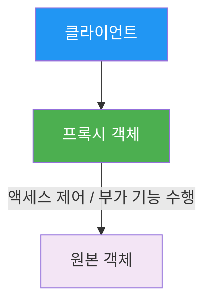
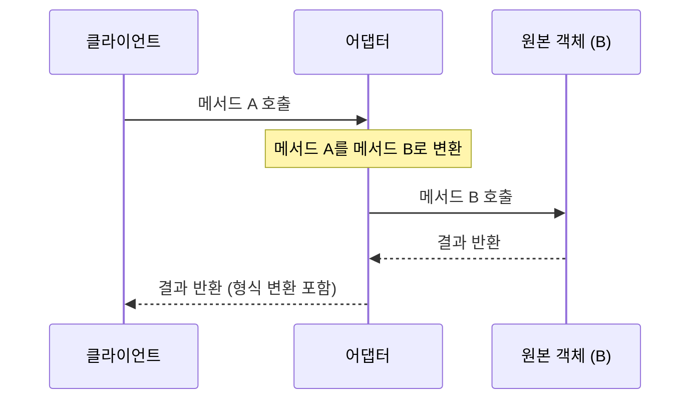

## 시작하며

Node.js 디자인 패턴 스터디 8주차! 지난 7장에서는 객체를 생성하는 다양한 방법인 **생성 디자인 패턴**을 다뤘습니다. 팩토리 함수부터 의존성 주입까지, 객체를 어떻게 '잘' 만들 것인가에 집중했다면, 이번 8장에서는 만들어진 객체들이 서로 어떤 관계를 맺고 협력할 것인지를 다루는 **구조 디자인 패턴**의 세계로 들어갑니다.

사실 디자인 패턴이라고 하면 왠지 거창하고 복잡할 것 같아서 처음에는 조금 긴장했거든요. 그런데 이번 장을 읽으면서 우리가 이미 실무에서 은연중에 쓰고 있던 많은 기법들이 사실은 프록시, 데코레이터, 어댑터라는 멋진 이름을 가진 패턴이었다는 걸 알게 됐어요. 

객체지향 설계의 정수라고도 불리는 이 패턴들이 Node.js의 역동적인 환경과 만났을 때 어떤 시너지를 내는지, 그리고 JavaScript의 특성에 따라 어떻게 변주되는지를 파헤쳐 보는 과정이 꽤나 흥미로웠습니다. 특히 Proxy 객체 같은 최신 언어 스펙이 고전적인 디자인 패턴을 얼마나 우아하게 구현해내는지 확인하는 과정에서 "와, 진짜 세상 좋아졌다"라는 감탄이 절로 나오더라고요.

이번 장에서는 단순히 패턴의 정의를 나열하는 게 아니라, 실제 코드 예제와 함께 우리가 왜 이런 구조를 선택해야 하는지, 그리고 각 방식의 트레이드오프는 무엇인지 깊이 있게 고민해 본 내용들을 공유해보려 합니다.

## 프록시 (Proxy): 객체에 대한 접근 제어

프록시 패턴은 이름 그대로 '대리인' 역할을 하는 객체를 두는 방식입니다. 원본 객체(Subject)에 직접 접근하는 대신 프록시를 거치게 해서, 그 과정에서 보안 검사를 하거나, 데이터를 캐싱하거나, 로그를 남기는 등 다양한 작업을 수행할 수 있습니다.

가장 중요한 포인트는 프록시와 원본 객체가 **동일한 인터페이스**를 가진다는 점이에요. 덕분에 클라이언트 입장에서는 자기가 지금 원본을 쓰는지 프록시를 쓰는지 전혀 신경 쓰지 않아도 됩니다.

### 프록시의 구조와 흐름

프록시 패턴의 기본적인 구조를 다이어그램으로 그려보면 이렇습니다.



이 구조를 보면서 처음 든 생각은 "미들웨어랑 참 비슷하다"는 거였어요. 요청이 목적지에 도달하기 전에 중간에서 가로채서 필요한 처리를 한다는 점이 Node.js 개발자들에게는 아주 익숙한 흐름이죠.

### 프록시를 구현하는 세 가지 기술

프록시를 구현하는 방법은 크게 세 가지가 있습니다. 처음에는 그냥 `new Proxy`만 쓰면 되는 거 아닌가 싶었는데, 하위 호환성이나 구현의 단순함을 고려하면 다른 방식들도 나름의 가치가 있더라고요.

| 기술 | 원본(Subject) 변경 여부 | 수동 위임 필요 여부 | 동적 속성 지원 | 추천 상황 |
|------|-------------|----------|----------|----------|
| **객체 컴포지션** | ❌ (변경 안 함) | ✅ (필요함) | ❌ | 안전성이 최우선일 때, 지연 초기화가 필요할 때 |
| **객체 확장 (몽키 패치)** | ✅ (직접 수정) | ❌ (필요 없음) | ❌ | 아주 간단한 수정이 필요하거나 프라이빗 범위일 때 |
| **Proxy 객체** | ❌ (변경 안 함) | ❌ (필요 없음) | ✅ | 동적인 접근 제어나 최신 환경에서의 고급 기능이 필요할 때 |

#### 방법 1: 객체 컴포지션 (Object Composition)

원본 객체를 새로운 객체의 내부 속성으로 포함시키는 방식입니다. 클래스 상속 대신 조합을 사용하는 아주 고전적이고 안전한 방법이죠.

```javascript
class SafeCalculator {
  constructor(calculator) {
    this.calculator = calculator;
  }

  // 가로채고 싶은 메서드만 정의합니다
  divide() {
    const divisor = this.calculator.peekValue();
    if (divisor === 0) {
      throw Error('0으로 나눌 수 없습니다!');
    }
    return this.calculator.divide();
  }

  // 나머지 메서드들은 원본 객체로 그대로 전달(위임)해야 합니다
  putValue(v) { return this.calculator.putValue(v); }
  getValue() { return this.calculator.getValue(); }
  peekValue() { return this.calculator.peekValue(); }
  clear() { return this.calculator.clear(); }
  multiply() { return this.calculator.multiply(); }
}
```

이 방식의 가장 큰 장점은 원본 객체를 전혀 건드리지 않는다는 점입니다. 하지만 예제에서 보듯, 내가 가로채지 않을 메서드들까지도 일일이 위임 코드를 짜줘야 한다는 게 꽤나 고역입니다. 메서드가 20~30개쯤 되면 코드가 엄청나게 길어지겠죠.

#### 방법 2: 객체 확장 (Object Augmentation / Monkey Patching)

원본 객체의 메서드를 직접 수정하는 방식입니다. JavaScript의 동적인 특성을 가장 노골적으로 활용하는 방법이죠.

```javascript
function patchToSafeCalculator(calculator) {
  const divideOrig = calculator.divide;
  // 원본 메서드를 새로운 로직으로 덮어씁니다
  calculator.divide = () => {
    const divisor = calculator.peekValue();
    if (divisor === 0) {
      throw Error('0으로 나눌 수 없습니다!');
    }
    return divideOrig.apply(calculator);
  };
  return calculator;
}
```

구현은 정말 간단하지만, 이 방식은 위험합니다. 만약 이 `calculator` 객체가 애플리케이션의 다른 부분에서도 공유되고 있다면, 내가 의도하지 않은 곳까지 영향을 미치게 됩니다. "이거 왜 갑자기 에러 나?" 하고 추적해보면 누군가 미처 알지 못한 곳에서 몽키 패치를 해둔 경우가 종종 있거든요.

#### 방법 3: ES2015 Proxy 객체

드디어 제가 가장 감탄했던 방식입니다. 런타임에 객체에 가해지는 모든 동작을 가로챌 수 있는 전용 객체를 만드는 것이죠.

```javascript
const safeCalculatorHandler = {
  get: (target, property) => {
    if (property === 'divide') {
      return function() {
        const divisor = target.peekValue();
        if (divisor === 0) {
          throw Error('0으로 나눌 수 없습니다!');
        }
        return target.divide();
      }
    }
    return target[property];
  }
};

const safeCalculator = new Proxy(new StackCalculator(), safeCalculatorHandler);
```

이 방식은 원본을 수정하지 않으면서도, 명시적인 위임 코드 없이 모든 속성에 접근할 수 있게 해줍니다. 특히 존재하지 않는 속성에 접근할 때도 가로챌 수 있다는 점이 정말 강력하더라고요.

### Proxy 객체의 마법: 트랩(Trap) 활용하기

Proxy 객체가 강력한 이유는 단순한 메서드 호출뿐만 아니라 객체의 거의 모든 동작을 가로챌 수 있기 때문입니다. 이를 '트랩'이라고 부르는데, 실무에서 요긴하게 쓸 수 있는 트랩들이 많습니다.

- `get/set`: 속성을 읽거나 쓸 때 실행됩니다.
- `has`: `in` 연산자를 사용할 때 실행됩니다.
- `deleteProperty`: 속성을 삭제할 때 실행됩니다.
- `apply`: 함수를 호출할 때 실행됩니다.
- `construct`: `new` 연산자로 인스턴스를 만들 때 실행됩니다.

재미있는 예시로, 모든 짝수를 무한히 포함하는 '가상 배열'을 Proxy로 만들 수도 있습니다. 이 코드는 실제로 배열에 데이터를 채우지 않고도 마치 거대한 배열이 있는 것처럼 동작하게 해줍니다.

```javascript
// 가상 배열 예제: 모든 짝수를 포함하는 배열
const evenNumbers = new Proxy([], {
  // 인덱스로 접근할 때 (예: evenNumbers[7])
  get: (target, index) => index * 2,
  // in 연산자를 사용할 때 (예: 2 in evenNumbers)
  has: (target, number) => number % 2 === 0
});

console.log(2 in evenNumbers);  // true
console.log(5 in evenNumbers);  // false
console.log(evenNumbers[7]);    // 14
```

실제로 데이터가 들어있지 않은데도 마치 있는 것처럼 동작하게 만드는 이 'Virtual Proxy' 기법은 대용량 데이터를 다루거나 지연 로딩이 필요한 환경에서 엄청난 효율을 발휘하겠더라고요. "아, 이래서 Proxy가 마법 같다고 하는구나"라는 생각이 절로 들었습니다.

### 변경 옵저버 패턴 (Change Observer Pattern)

프록시 패턴의 또 다른 꽃은 바로 객체의 상태 변경을 감지하는 옵저버 패턴을 구현하는 것입니다. 반응형 프로그래밍의 기초가 되는 이 패턴도 Proxy 객체를 쓰면 아주 우아하게 구현됩니다.

```javascript
export function createObservable(target, observer) {
  return new Proxy(target, {
    set(obj, prop, value) {
      if (value !== obj[prop]) {
        const prev = obj[prop];
        obj[prop] = value;
        // 상태가 변했을 때만 옵저버에게 알림을 줍니다
        observer({ prop, prev, curr: value });
      }
      return true;
    }
  });
}
```

이 코드를 보면서 저는 우리가 흔히 쓰는 **Redux**나 **Vue**의 상태 관리 원리를 조금이나마 엿볼 수 있었습니다. 객체의 속성을 바꾸기만 했는데 화면이 자동으로 갱신되는 마법이 결국은 이런 정교한 프록시 구조 위에서 돌아가고 있었던 것이죠.

실제 송장 계산 시스템을 만든다고 가정해보면, 수량이나 단가가 바뀔 때마다 합계를 자동으로 다시 계산해주는 기능을 이런 식으로 구현할 수 있습니다. 수동으로 "계산해!"라고 명령할 필요 없이 데이터의 변화에 시스템이 스스로 반응하게 만드는 것이죠. 이 방식이 코드의 선언적인 느낌을 훨씬 강하게 만들어준다는 걸 깨달았습니다.

### 실전 예제: 로깅 프록시

가장 흔하게 쓰이는 로깅 프록시를 ES2015 Proxy로 구현해 본 코드입니다.

```javascript
// 쓰기 가능한 스트림에 로깅 기능을 추가하는 프록시 생성 함수
export function createLoggingWritable(writable) {
  return new Proxy(writable, {
    // get 트랩을 사용해 메서드 접근을 가로챕니다
    get(target, propKey, receiver) {
      if (propKey === 'write') {
        return function(...args) {
          const [chunk] = args;
          console.log(`[LOG] Writing: ${chunk}`);
          // 원본 객체의 write 메서드 호출
          return target.write(...args);
        }
      }
      // write 외의 다른 속성은 그대로 반환
      return target[propKey];
    }
  });
}
```

이 코드를 보면서 Proxy 객체의 위력을 다시 한번 실감했습니다. 예전 같으면 모든 메서드를 수동으로 위임했어야 할 일을 단 몇 줄의 트랩 함수로 해결할 수 있더라고요. 실무에서도 API 요청의 응답 시간을 측정하거나, 특정 조건에서만 쓰기 권한을 부여하는 등의 작업을 할 때 이 Proxy 객체를 활용하면 코드가 정말 깔끔해집니다.

실제로 **Vue.js 3**나 **MobX** 같은 유명한 라이브러리들이 반응형 시스템을 구축할 때 이 Proxy 객체를 적극적으로 사용한다는 사실을 알고 나니, 이 패턴이 현대 JavaScript 생태계에서 얼마나 중요한 축을 담당하는지 새삼 느껴졌습니다.

## 데코레이터 (Decorator): 동적인 기능 확장

데코레이터 패턴은 기존 객체의 동작을 **동적으로 증강(Augment)**시키는 패턴입니다. 프록시와 구현 기술은 거의 동일하지만, 목적이 조금 다릅니다. 프록시가 접근 제어에 초점을 맞춘다면, 데코레이터는 새로운 기능을 추가하는 데 집중합니다.

### 프록시 vs 데코레이터 비교

두 패턴은 래퍼(Wrapper)라는 공통점이 있어서 자주 혼동되곤 합니다. 그래서 차이점을 표로 정리해봤어요.

| 구분 | 프록시 (Proxy) | 데코레이터 (Decorator) |
|------|--------|-----------|
| **핵심 목적** | 접근 제어, 보안, 캐싱, 지연 초기화 | 새로운 기능 추가, 동작 보완 |
| **인터페이스** | 원본과 동일하게 유지 | 원래 기능을 확장하거나 새 기능 추가 |
| **사용 시점** | 객체 생성 시점이나 접근 시점 | 런타임에 동적으로 기능이 필요할 때 |

프록시는 원본 객체를 '숨기는' 느낌이라면, 데코레이터는 원본 객체에 '옷을 입히는' 느낌에 가깝더라고요.

### 실무 사례: LevelUP 플러그인 시스템

Node.js 생태계에서 데코레이터 패턴의 정수를 보여주는 사례가 바로 **LevelUP** 데이터베이스 라이브러리입니다. LevelUP은 코어를 아주 작게 유지하고, 필요한 기능(인덱싱, 쿼리 엔진, 복제 등)은 플러그인 형태로 붙여서 사용합니다.

LevelUP은 단순히 데이터를 저장하는 기능을 넘어, 그 위에 수많은 '데코레이터'들을 얹어서 강력한 기능을 만들어냅니다. 예를 들어 텍스트 검색 기능을 추가하고 싶으면 `level-inverted-index`를 붙이고, JSON 데이터를 자동으로 파싱하고 싶으면 `encoding-down` 같은 플러그인을 씁니다.

```javascript
// 특정 패턴의 데이터가 저장될 때 알림을 주는 데코레이터 (플러그인)
export function levelSubscribe(db) {
  // 원래 db 객체에 없는 subscribe라는 새로운 메서드를 추가합니다
  db.subscribe = (pattern, listener) => {
    db.on('put', (key, val) => {
      // 패턴 매칭 로직
      const match = Object.keys(pattern).every(k => pattern[k] === val[k]);
      if (match) {
        listener(key, val);
      }
    });
  };
  // 증강된 db 객체를 반환합니다
  return db;
}
```

위 예제처럼 원본 `db` 인스턴스에 새로운 기능을 동적으로 주입하는 방식이 바로 데코레이터입니다. 클래스 상속을 쓰면 모든 인스턴스가 그 기능을 가지게 되지만, 데코레이터를 쓰면 **딱 필요한 인스턴스에만** 선택적으로 기능을 추가할 수 있다는 게 엄청난 장점이죠.

저는 이 대목에서 **Fastify**의 `decorate` API가 떠올랐습니다. Fastify 서버 인스턴스나 요청(Request) 객체에 커스텀 유틸리티를 추가할 때 이 API를 쓰는데, 이 역시 전형적인 데코레이터 패턴의 변형이더라고요. 상속보다는 조합(Composition)을 선호하는 Node.js의 철학이 이 패턴 속에 그대로 녹아있다는 걸 깨달았습니다.

또한, 이 방식은 라이브러리 제작자 입장에서 정말 영리한 선택입니다. 모든 기능을 코어에 다 넣으면 코드가 무거워지고 버그도 많아지는데, 이렇게 데코레이터 패턴을 기반으로 한 플러그인 아키텍처를 쓰면 사용자가 필요한 기능만 골라서 가볍게 쓸 수 있게 해주니까요. "아, 이게 바로 Node way구나"라는 생각이 다시금 들었습니다.

## 프록시와 데코레이터: 모호한 경계 허물기

학술적으로는 프록시와 데코레이터가 명확히 구분되지만, 사실 JavaScript와 Node.js의 실전에서는 그 경계가 매우 모호합니다. 책에서도 이 점을 강조하더라고요. 

중요한 건 "이게 프록시냐 데코레이터냐"를 따지는 게 아니라, **객체를 감싸서 기능을 제어하거나 확장한다**는 핵심 아이디어를 어떻게 활용할 것인가입니다. 

패턴의 이름에 갇히기보다는, 현재 내가 해결하려는 문제가 '접근 제어'인지 '기능 확장'인지에 집중하고, 그에 가장 적합한 구현 기법(컴포지션, 몽키 패치, Proxy 객체 등)을 선택하는 실용적인 자세가 필요하다는 걸 배웠습니다.

## 어댑터 (Adapter): 인터페이스의 가교

어댑터 패턴은 서로 다른 두 인터페이스 사이에서 다리 역할을 해주는 패턴입니다. 우리가 해외 여행 갈 때 챙기는 220V-110V 변환 플러그(돼지코)를 생각하면 이해가 빠릅니다.

클라이언트는 A라는 인터페이스를 기대하는데, 우리가 가진 객체는 B라는 인터페이스만 제공할 때, 중간에서 B를 A처럼 보이게 포장해주는 것이죠.

### 어댑터의 작동 원리



어댑터 패턴을 공부하면서 "이걸 언제 쓸까?" 고민해봤는데, 라이브러리를 교체하거나 기존 레거시 코드를 신규 시스템에 통합할 때 정말 유용하겠더라고요.

### 실전 예제: LevelUP을 fs API처럼 사용하기

Node.js의 `fs` 모듈은 파일 시스템 인터페이스의 표준입니다. 만약 우리가 데이터를 파일이 아니라 LevelUP 데이터베이스에 저장하고 싶은데, 기존 코드는 `fs.readFile` 같은 함수를 쓰고 있다면 어떨까요? 모든 코드를 다 수정해야 할까요?

이럴 때 어댑터가 구원투수로 등판합니다. 서로 어울리지 않을 것 같은 두 세계를 이어주는 것이죠.

```javascript
// LevelUP DB를 fs 모듈처럼 쓸 수 있게 해주는 어댑터
export function createFSAdapter(db) {
  return {
    readFile(filename, options, callback) {
      if (typeof options === 'function') {
        callback = options;
        options = {};
      }
      // fs.readFile의 호출을 db.get으로 변환
      // resolve를 사용해 파일 경로를 DB 키로 매핑합니다
      db.get(resolve(filename), {
        valueEncoding: options.encoding
      }, (err, value) => {
        if (err) {
          if (err.type === 'NotFoundError') {
            // 에러 형식도 fs 표준(ENOENT)에 맞춰 변환해줍니다
            const fsError = new Error(`ENOENT, open '${filename}'`);
            fsError.code = 'ENOENT';
            fsError.errno = 34;
            fsError.path = filename;
            return callback && callback(fsError);
          }
          return callback && callback(err);
        }
        callback && callback(null, value);
      });
    },
    
    writeFile(filename, contents, options, callback) {
      if (typeof options === 'function') {
        callback = options;
        options = {};
      }
      // fs.writeFile의 호출을 db.put으로 변환
      db.put(resolve(filename), contents, {
        valueEncoding: options.encoding
      }, callback);
    }
  };
}
```

이런 식으로 어댑터를 만들면, 기존에 `fs` 모듈을 쓰던 수많은 라이브러리들을 코드 수정 없이 데이터베이스 위에서 돌릴 수 있게 됩니다. 실제로 `level-filesystem` 같은 라이브러리가 이런 방식으로 구현되어 있고, 덕분에 Node.js 코드를 브라우저의 IndexedDB 위에서 돌리는 '마법' 같은 일도 가능해집니다.

저는 이 부분을 읽으면서 단위 테스트 상황을 떠올렸습니다. 실제 파일 시스템을 건드리는 코드를 테스트할 때, 이런 어댑터를 써서 메모리 기반의 DB로 갈아끼우면 테스트 속도도 빨라지고 격리도 완벽해지겠더라고요. 

또한, 하드웨어 장치를 제어하는 인터페이스가 바뀔 때나 외부 API의 명세가 변경될 때도 이 어댑터 패턴을 잘 활용하면 우리 시스템의 핵심 로직을 안전하게 보호할 수 있다는 확신이 들었습니다. "중간 계층을 두는 것이 때로는 가장 빠른 길이다"라는 말을 몸소 체험한 기분이었습니다.


## 직접 도전해본 연습문제의 교훈

이번 장은 이론도 좋았지만, 연습문제를 직접 풀어보면서 패턴의 진가를 더 깊이 느낄 수 있었습니다. 특히 인상 깊었던 몇 가지 과제를 공유해보려 합니다.

### HTTP 클라이언트 캐싱 프록시 (8.1)
HTTP 요청의 응답을 캐싱하는 프록시를 만드는 과제였습니다. 처음에는 간단히 `Map`에 결과를 담으면 되겠지 싶었는데, 동일한 URL에 대해 거의 동시에 여러 요청이 올 때 '캐시 쇄도(Cache Stampede)' 현상을 어떻게 막을지 고민하게 되더라고요. 프록시 계층에서 이 문제를 해결하니 비즈니스 로직은 건드리지 않으면서도 시스템 전체의 안정성이 높아지는 걸 보고 소름 돋았습니다.

### 타임스탬프 로깅 프록시 (8.2)
`console` 객체를 프록시로 감싸서 모든 로그 앞에 타임스탬프를 붙이는 과제였습니다. 몽키 패치로도 할 수 있지만, Proxy 객체를 써서 원본 `console`은 깨끗하게 유지하면서 출력만 가공하는 방식이 훨씬 우아하더라고요. "아, 이런 소소한 도구들도 디자인 패턴으로 만들 수 있구나"라는 걸 깨달았습니다.

### 지연 버퍼 가상 프록시 (8.5)
`write()`가 처음 호출될 때만 실제 `Buffer`를 할당하는 가상 프록시를 구현해봤습니다. 메모리가 부족한 환경에서는 이런 작은 지연 전략이 얼마나 큰 힘을 발휘할지 상상하니 디자인 패턴의 위력이 실감 났습니다. "일단 만들고 보자"는 생각보다 "필요할 때 만들자"는 생각이 시스템을 얼마나 가볍게 만드는지 배울 수 있었어요.

## 실무에 적용할 수 있는 인사이트들

### 1. 지연 초기화(Lazy Initialization)로 서버 부팅 최적화

프록시 패턴의 꽃인 가상 프록시(Virtual Proxy)를 활용해보세요. 무거운 DB 연결이나 외부 서비스 클라이언트를 앱 시작과 동시에 전부 만드는 대신, 첫 요청이 올 때까지 미루는 것입니다. 특히 람다(AWS Lambda) 같은 서버리스 환경에서 콜드 스타트 시간을 줄이는 데 아주 영리한 전략이 될 수 있습니다.

### 2. 어댑터 패턴으로 라이브러리 교체 스트레스 줄이기

특정 벤더의 라이브러리를 직접 쓰는 대신, 우리만의 인터페이스를 정의하고 어댑터를 씌워서 사용하세요. 나중에 더 좋은 라이브러리로 갈아끼워야 할 때, 우리 코드를 수백 군데 수정하는 대신 어댑터 하나만 새로 만들면 됩니다. "라이브러리에 의존하지 말고 인터페이스에 의존하라"는 격언을 실천하는 가장 빠른 방법입니다.

### 3. 상속보다는 데코레이션을 통한 유연한 확장

복잡한 상속 트리 때문에 고생하고 있다면 데코레이터 패턴으로 눈을 돌려보세요. 기능을 작은 조각으로 나누고, 런타임에 필요한 조각만 객체에 입히는 방식은 코드를 훨씬 유연하게 만듭니다. 특히 다양한 설정값에 따라 객체의 동작이 변해야 하는 복잡한 비즈니스 로직에서 이 방식은 구세주가 될 것입니다.

### 4. Proxy 트랩을 활용한 선언적 프로그래밍

데이터가 바뀌면 알아서 특정 로직이 실행되게 만들고 싶나요? `set` 트랩을 활용한 옵저버 패턴을 고려해보세요. 명령형으로 일일이 "이거 바꿨으니까 저거 계산해"라고 지시하는 코드보다, "이 데이터가 바뀌면 이 함수를 실행해"라고 선언해두는 코드가 훨씬 읽기 쉽고 버그도 적습니다.

## 마무리

8장을 정리하며 구조 디자인 패턴이 단순히 코드를 예쁘게 짜는 기술이 아니라, **시스템의 복잡성을 관리하고 변화에 유연하게 대응하게 만드는 전략**이라는 걸 깊이 느꼈습니다. 

프록시로 접근을 다스리고, 데코레이터로 기능을 입히며, 어댑터로 소통의 벽을 허무는 과정은 마치 정교한 기계를 조립하는 것과 같았습니다. 특히 JavaScript라는 유연한 언어가 제공하는 Proxy 객체 같은 도구들을 어떻게 디자인 패턴이라는 고전적인 지혜와 결합할지 고민해본 것이 큰 수확이었습니다.

처음에는 이 패턴들이 다 비슷비슷해 보여서 헷갈리기도 했지만, 각 패턴이 해결하고자 하는 '의도'에 집중하니 비로소 그 차이가 선명하게 보이더라고요. 이제 실무에서 코드를 짤 때 "여기에 프록시를 두면 나중에 캐싱을 붙이기 편하겠네?" 혹은 "이 라이브러리는 인터페이스가 너무 독특하니 어댑터를 씌우자" 같은 고민을 자연스럽게 하게 될 것 같습니다.

다음 포스트에서는 드디어 **9장 "행위 디자인 패턴"**을 다룰 예정입니다. 객체 간의 관계를 넘어, 객체들이 어떻게 메시지를 주고받으며 알고리즘과 제어 흐름을 구현하는지, 그 역동적인 상호작용의 세계를 함께 파헤쳐 보겠습니다. 

### 🏗️ 패턴 설계와 구조에 대한 질문
- 프록시 패턴을 사용할 때 발생할 수 있는 오버헤드는 어느 정도일까요? 성능이 극도로 중요한 환경에서도 Proxy 객체를 안심하고 써도 될까요?
- 데코레이터 패턴과 고차 함수(Higher-Order Function)는 어떤 관계가 있을까요? 함수형 프로그래밍 관점에서도 데코레이터를 정의할 수 있을까요?
- 어댑터 패턴을 남용하면 오히려 시스템의 전체적인 복잡도가 높아질 위험은 없을까요? 어댑터를 도입해야 하는 명확한 기준은 무엇일까요?

### 🛠️ 실무 적용과 트레이드오프에 대한 질문
- 몽키 패치가 위험하다는 건 알지만, 급하게 패치가 필요한 상황에서 가장 빠르고 효과적인 방법이기도 합니다. 몽키 패치를 '안전하게' 사용할 수 있는 가이드라인이 있을까요?
- 여러분의 프로젝트에서 실제로 사용 중인 프록시나 데코레이터 사례가 있나요? 어떤 문제를 해결하기 위해 도입하셨나요?
- 서드파티 라이브러리의 업데이트로 인해 인터페이스가 깨졌을 때, 어댑터 패턴을 사용해 대응해 본 경험이 있으신가요?

### 🎯 고급 기술 및 언어 스펙에 대한 질문
- ES2015 Proxy 객체의 트랩 함수 중 `apply`나 `construct`를 실무에서 유용하게 써본 경험이 있으신가요? 어떤 창의적인 활용이 가능할까요?
- TypeScript의 데코레이터(실험적 기능)와 이 책에서 다루는 객체 기반 데코레이터 패턴은 개념적으로 어떻게 연결되나요?
- 보안 관점에서 프록시를 사용할 때 주의해야 할 점(예: 민감한 데이터의 노출 등)은 무엇이 있을까요?

댓글로 공유해주시면 함께 배워나갈 수 있을 것 같습니다!
