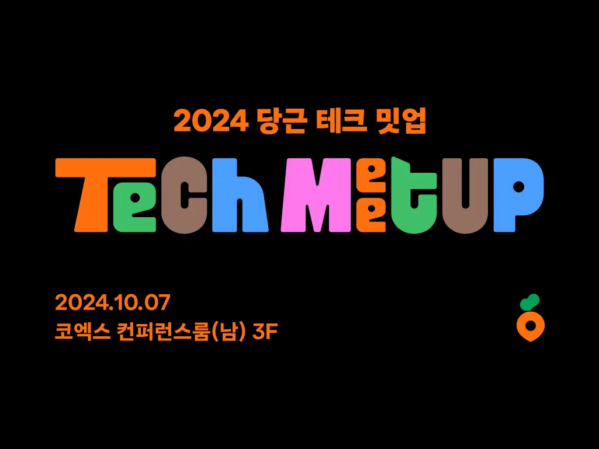
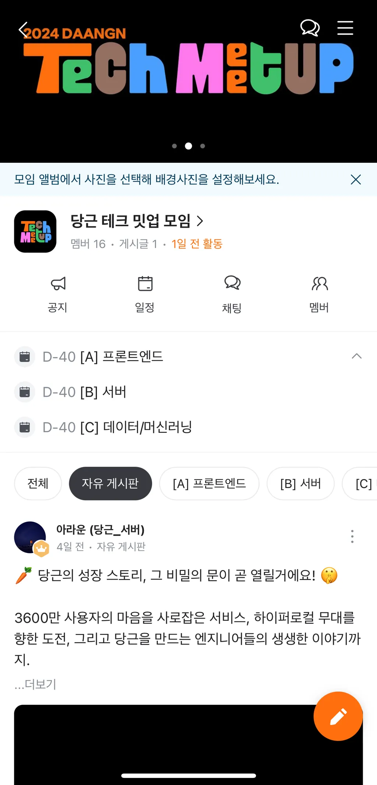
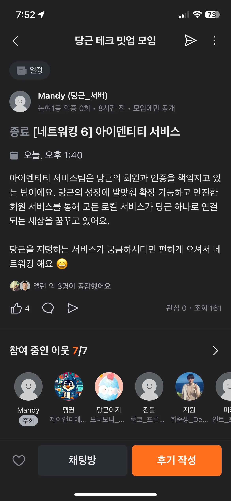
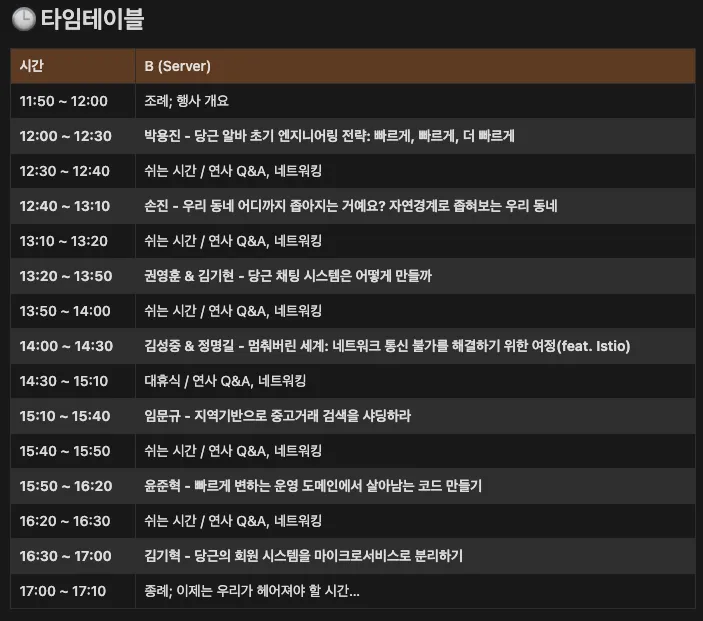

# 2024 당근 테크 밋업 후기

당근 테크 밋업에 다녀왔습니다.
당근에서 주최한 이번 밋업은 Frontend, Server, DATA/ML, Platform 4개의 트랙으로 진행되었습니다.
저는 Server 트랙을 참석했는데, 밋업에서 들은 내용을 정리해보려고 합니다.

-   당근 테크 밋업은 당근의 모임 시스템을 활용하여 진행되었습니다.
-   해당 모임에서 실시간 정보를 수신하고 이벤트 및 네트워킹 활동을 진행했습니다.

## 네트워크 활동

당근의 여러팀들이 모임 일정 등록을 통해 네트워크 모입을 진행했습니다.

저는 이중 이이덴티티 서비스 네트워크에 참여했습니다.
아이덴티티 서비스란 당근의 회원과 인증을 담당하는 서비스입니다.
기존 모놀리식 아키텍처에서 마이크로서비스 아키텍처로 전환하는 과정에서 이 서비스를 분리했습니다. (자세한 내용은 Server 트랙에서 설명합니다.)
네트워크활동 중 아쉬운 점은 서버트랙 시간과 겹친다는 점이었습니다.
서버트랙 듣던 중간에 네트워크활동을 참가해서 아쉬움이 있었습니다.

## Server 트랙

Server 트랙에서는 대부분 당근마켓의 각 팀에서 당근의 서비스 규모가 커지면서 겪은 문제와 해결방법을 공유했습니다.

## 굿즈

이번 테크밋업에선 당근에서 기본적으로 노트, 펜. 스티커, 안경닦이를 제공했습니다.
그리고 이벤트를 통해 옷, 키캡 케이스, 키링, 에코백(화이트, 블랙), 뱃지 등을 받을 수 있었습니다.
저는 키캡 케이스 3개, 키링 2개를 받아서 당근앱을 통해 다른 분들과 에코백(블랙), 뱃지를 교환했습니다.

## 결론

당근은 2015년 판교 장터라는 이름으로 판교에서 중고거래 서비스를 시작했습니다.
이후 시장 반응이 좋아지면서 전지역 서비스인 당근마켓을 시작했습니다.
그리고 중고거래 뿐만 아니라 모임, 알바, 중고차, 부동산 등 다양한 주민들의 니즈를 충족하기 위한 서비스가 나오면서 당근마켓에서 당근(당신의 근처)라는 이름으로 변경했습니다.
요즘드는 생각이 처음부터 서비스가 완벽할 순 없다는 것입니다. (오버 엔지니어링을 하지 않는다는 의미)
서비스를 우선적으로 출시해서 시장 반응에 따라 기능을 추가하고 개선하는 방식으로 서비스를 운영하는 게 중요하다고 생각합니다.
그리고 지금 요구사항에선 그 서비스가 완벽한 서비스였더라도 환경이 바뀌고 요구사항이 바뀜에따라 레거시가 될 수 있다는 것입니다.
당근의 Server 쪽 개발자들의 값진 경험을 들을 수 있어서 좋았으며 기존엔 당근이란 회사는 고인물이 많을 거라는 인식이 좀 있었는데 그런 인식이 바뀌게 된 것 같습니다.
다음 테크 밋업에도 꼭 참석하고 싶습니다.
