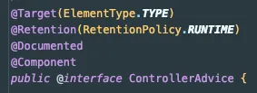
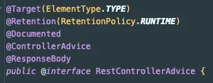

# Spring Global Exception Handler


## 개요

Spring에서 예외 처리 방법은 여러 가지가 있다.
가장 흔히 사용되는 방법으로는 **try-catch** 문을 이용한 예외 처리, **@ExceptionHandler**를 이용한 예외 처리, 그리고 전역에서 예외를 처리할 수 있는 **@ControllerAdvice**를 이용한 방법이 있다.
이 글에서는 각 방법의 특징과 장단점을 알아본다.

### 1\. try-catch 문을 이용한 예외 처리

```java
@RestController
public class TestController {

    @GetMapping("/test")
    public String test() {
        try {
            // 예외 발생 코드
            throw new Exception("고의로 발생시킨 예외");
        } catch (Exception e) {
            return "예외 발생: " + e.getMessage();
        }
    }
}
```

`try-catch` 문을 이용한 예외 처리는 가장 기본적인 방법이다.
특정 로직에서 예외가 발생했을 때 즉시 해당 로직 내에서 예외를 처리할 수 있다.
하지만, 예외가 발생할 수 있는 모든 부분마다 `try-catch`를 추가해야 하므로 중복 코드가 발생할 수 있다.
이러한 중복은 코드의 유지보수를 어렵게 만들고, 휴먼 에러가 발생할 가능성을 높인다.

### 2\. @ExceptionHandler를 이용한 예외 처리

```java
@RestController
public class TestController {

    @GetMapping("/test")
    public String test() {
        // 예외 발생 코드
        throw new RuntimeException("고의로 발생시킨 예외");
    }

    @ExceptionHandler(Exception.class)
    public String exceptionHandler(Exception e) {
        return "예외 처리됨: " + e.getMessage();
    }
}
```

`@ExceptionHandler`를 이용하면 특정 컨트롤러에서 발생하는 예외를 중앙에서 처리할 수 있다.
이 방법은 각 컨트롤러 내에 존재하는 예외를 담당하는 메서드를 만들어, 해당 컨트롤러에서 발생하는 예외를 일관되게 처리할 수 있다.
하지만 컨트롤러가 많아질수록 각 컨트롤러에 `@ExceptionHandler` 메서드를 추가해야 하는 번거로움이 발생하며, 중복 코드가 생길 수 있다.

### 3\. @ControllerAdvice를 이용한 전역 예외 처리

```
@ControllerAdvice
public class GlobalExceptionHandler {

    @ExceptionHandler(Exception.class)
    public ResponseEntity<String> handleAllExceptions(Exception e) {
        return ResponseEntity
                .status(HttpStatus.INTERNAL_SERVER_ERROR)
                .body("전역 예외 처리: " + e.getMessage());
    }
}
```

`@ControllerAdvice`는 **전역 예외 처리**를 담당하는 어노테이션이다.
이를 통해 모든 컨트롤러에서 발생하는 예외를 한 곳에서 처리할 수 있다.
즉, 중복된 예외 처리 로직을 없애고, 예외 처리를 일관성 있게 유지할 수 있다는 큰 장점이 있다.
이렇게 하면 코드가 간결해지고, 유지보수성이 크게 향상된다.

#### @ControllerAdvice와 @RestControllerAdvice의 차이





`@ControllerAdvice`는 View를 반환하는 예외 처리에 사용되고, `@RestControllerAdvice`는 JSON 데이터를 반환할 때 사용된다.
즉, `@RestControllerAdvice`는 `@ControllerAdvice`에 `@ResponseBody`가 추가된 형태다.추가로 `@RestControllerAdvice(annotations = RestController.class)`와 같이 특정 어노테이션이 있는 컨트롤러에 대해서만 예외를 처리하도록 설정할 수 있다.
이는 특정 컨트롤러 타입에 맞춘 예외 처리도 가능하게 해준다.
