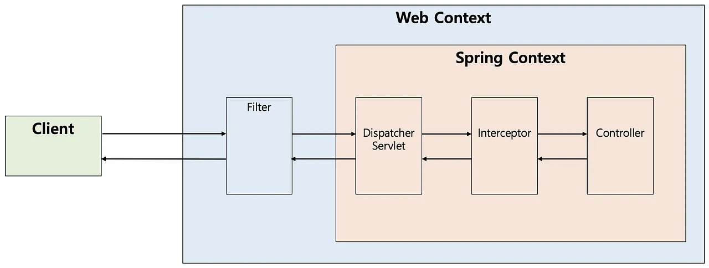

## 개요

콘서트 프로젝트에서 대기열을 구현하는 과정에서, 대기열 검증 로직을 어디서 처리할지 고민하게 되었다.
대기열 토큰을 가지고 입장 가능 여부를 검증하는 로직을 작성했는데, 이 로직을 필터나 인터셉터 중 어디에 두는 게 적절할지 알아보면서, 필터와 인터셉터의 차이점과 용도에 대해 정리해보았다.

### 필터(Filter)

필터는 J2EE 스펙에서 제공하는 기능으로, **디스패처 서블릿(Dispatcher Servlet)** 요청 전에 부가적인 작업을 처리할 수 있다. 디스패처 서블릿은 스프링의 가장 앞단에 존재하는 프론트 컨트롤러이며, 필터는 스프링의 범위를 벗어나 **톰캣과 같은 웹 컨테이너**에서 관리된다. 즉, 디스패처 서블릿의 전후에 처리되는 것이다.필터는 디스패처 서블릿 전에 특정 요청을 선별하거나, 요청과 응답을 가로채는 등의 작업을 수행할 수 있다.디스패처 서블릿에 대한 자세한 내용은 [Dispatcher Servlet (디스패처 서블릿)](https://penguin-dev.tistory.com/17) 글을 참고하자.

### 인터셉터(Interceptor)

인터셉터는 **스프링**이 제공하는 기능으로, 디스패처 서블릿이 **컨트롤러**를 호출하기 전과 후에 요청과 응답을 가로채거나, 부가적인 작업을 수행할 수 있다. 필터와 달리 **스프링 컨테이너**에 의해 관리되며, **핸들러 매핑**을 통해 컨트롤러 실행 전에 실행된다.디스패처 서블릿은 적절한 컨트롤러를 찾기 위해 **핸들러 매핑**을 사용하는데, 그 결과로 **HandlerExecutionChain**이 반환된다. 이 실행 체인에 인터셉터가 등록되어 있으면, 인터셉터를 순차적으로 거쳐서 컨트롤러가 실행되며, 등록된 인터셉터가 없다면 바로 컨트롤러가 실행된다.

### 필터(Filter)와 인터셉터(Interceptor)의 차이 및 용도

구분

필터(Filter)

인터셉터(Interceptor)

관리 컨테이너

서블릿 컨테이너(톰캣 등)

스프링 컨테이너

스프링의 예외처리 여부

X

O

Reqeust/Response
객체 조작 가능 여부

O

X

처리 시점

디스패처 서블릿 전/후

디스패처 서블릿 이후, 컨트롤러 호출 전/후

용도

\- 공통된 보안 및 인증/인가 관련 작업
\- 모든 요청에 대한 로깅 또는 감사
\- 이미지/데이터 압축 및 문자열 인코딩
\- Spring과 분리되어야 하는 기능

\- 세부적인 보안 및 인증/인가 공통 작업
\- API 호출에 대한 로깅 또는 감사
\- Controller로 넘겨주는 정보(데이터)의 가공

## 참고 링크

[\[Spring\] 필터(Filter) vs 인터셉터(Interceptor) 차이 및 용도 - (1)](https://mangkyu.tistory.com/173)
