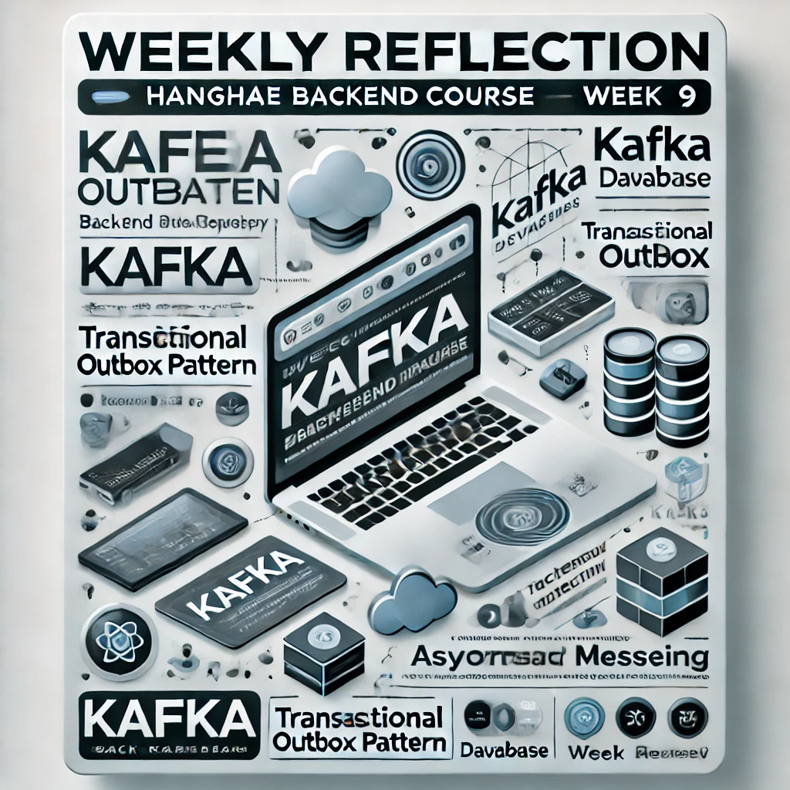

## 항해 플러스 추천인 코드

지원페이지에서 추천 코드에 `3ZTeU1`를 입력하시면 `20만원` 할인 혜택을 받을 수 있습니다.
항해 플러스 과정에 관심 있는 분들은 아래 링크를 통해 신청해보세요! 궁금한 점이나 커피챗을 원하시면 [LinkedIn](https://www.linkedin.com/in/kilhyeonjun/)이나 `kboxstar@gmail.com`으로 연락주세요.[항해 플러스 과정 페이지](https://hanghae99.spartacodingclub.kr/)

 [개발자 커리어 개척 캠프 항해99, 첫 취업부터 현직자 역량 강화까지10년이 지나도 남는 커리큘럼을 바탕으로 커리어를 개척하세요. 진정성있는 멘토링과 2천 명이 넘는 끈끈한 커뮤니티가 여러분과 함께 합니다.hanghae99.spartacodingclub.kr](https://hanghae99.spartacodingclub.kr/)

---

## 개요

이번 주차에는 Kafka를 이용해 이벤트를 발행하고 구독하는 과제를 진행하며, **Transactional Outbox Pattern**을 구현해보았습니다. 이 과정에서 Kafka의 비동기 특성 때문에 테스트에 어려움이 있었고, 이를 해결하기 위한 다양한 방법을 시도했습니다.

### 1\. 문제

Kafka는 비동기로 동작하기 때문에 통합 테스트를 진행하면서 몇 가지 번거로운 점이 있었습니다.

1.  **결과 확인 지연**
    -   이벤트가 정상적으로 처리되었는지 확인하기 위해 일정 시간이 지나야 결과를 볼 수 있었습니다.
2.  **Polling 필요성**
    -   메시지 발행 결과를 확인하려면 DB 상태를 지속적으로 확인해야 했습니다.

### 2\. 시도

1.  **Thread.sleep 사용**
    -   처음에는 메시지가 발행된 후 `Thread.sleep()`을 이용해 일정 시간 기다린 뒤 결과를 확인하는 방식을 시도했습니다.
    -   하지만 이 방법은 Kafka의 비동기 작업이 제대로 진행되지 않아, 메시지가 발행되기도 전에 테스트가 끝나는 문제가 있었습니다.
2.  **Awaitility 라이브러리 사용**
    -   이후 `Awaitility`라는 라이브러리를 사용하여 메시지 발행과 소비를 기다릴 수 있도록 수정했습니다.
    -   `Awaitility`는 메시지가 특정 시간 내에 수신되었는지 확인할 수 있도록 도와주었고, 테스트가 훨씬 안정적으로 동작하도록 만들었습니다.
        ([Awaitility 공식 사이트](http://www.awaitility.org/))

### 3\. 해결

1.  **Awaitility를 이용한 테스트 개선**
    -   `Awaitility`를 사용해 Polling 방식을 대체하면서 메시지 발행 및 소비 과정을 비동기로 확인할 수 있었습니다.
    -   이를 통해 기존의 `Thread.sleep`보다 효율적이고 안정적인 통합 테스트를 구성할 수 있었습니다.
2.  **Transactional Outbox Pattern 적용**
    -   이벤트를 Outbox 테이블에 저장한 뒤, Kafka로 메시지를 발행하는 구조를 구현했습니다.
    -   Kafka Producer가 메시지를 발행한 뒤, Outbox 상태를 업데이트하여 중복 발행을 방지했습니다.
    -   이로써 데이터베이스와 Kafka 간의 데이터 일관성을 유지할 수 있었습니다.

### 4\. 알게 된 점

1.  **Kafka와 비동기 테스트의 중요성**
    -   Kafka의 비동기 특성은 성능 면에서 유리하지만, 통합 테스트에서는 적절한 대기 메커니즘이 필요하다는 점을 느꼈습니다.
2.  **Awaitility의 유용함**
    -   `Awaitility`는 Kafka와 같은 비동기 시스템에서 테스트의 안정성을 크게 높여주는 유용한 도구임을 알게 되었습니다.
3.  **Transactional Outbox Pattern의 실효성**
    -   데이터베이스와 Kafka 간 데이터 일관성을 유지하면서 메시지 손실과 중복 발행 문제를 효과적으로 해결할 수 있는 패턴임을 실무적으로 경험할 수 있었습니다.
