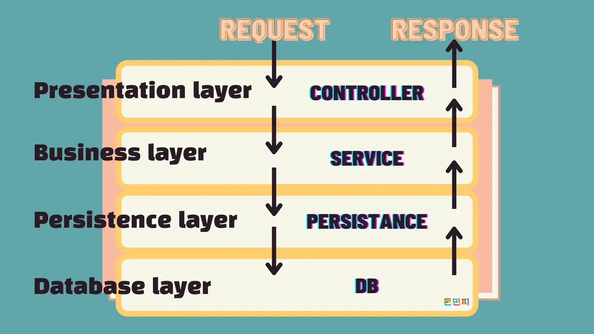
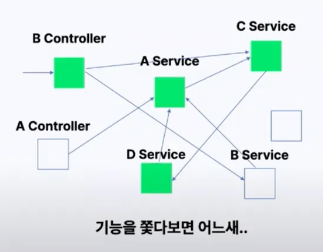

## **? 1. 서론 – 왜 아키텍처 개선이 필요할까?**

### **? 오랜만에 글을 씁니다!**

마지막 글을 작성한 지 벌써 3개월이 지났네요. 정신없이 업무를 하다 보니 블로그를 잠시 쉬었는데, 최근 실무에서 **아키텍처 개선을 고민하면서 공유하고 싶은 내용이 많아졌어요.**사실 이 내용은 **사내 기술 세미나에서 2주에 한 번씩 공유했던 내용**인데, 내부 환경에 맞춰 다듬다 보니 블로그에 바로 올리지는 못했어요. 이번 기회에 정리해서 공유해보려고 합니다.

---

### **? 이번 글에서 다룰 내용**

이번 글에서는 **사내에서 신규 아키텍처를 제안하는 과정**을 다뤄보려고 합니다.
단순히 **"새로운 기술이 좋아 보이니까 도입하자"**가 아니라,✔ **기존 아키텍처의 문제점을 분석하고,**
✔ **팀원들을 설득하며,**
✔ **실제 도입을 추진하는 전략까지 정리**했습니다.즉, **"어떻게 하면 새로운 아키텍처를 실무에 적용할 수 있을까?"**에 대한 **실전적인 접근 방법**을 공유하려고 합니다.

---

### **? 실무에서 아키텍처 개선이 필요한 이유**

현재 프로젝트는 **Layered Architecture(계층형 아키텍처)**를 기반으로 운영되고 있습니다.
이 구조는 기본적으로 안정적인 설계를 제공하지만, **규모가 커지면서 다음과 같은 문제점이 발생**했습니다.? **기존 아키텍처의 주요 문제점**
✔ **서비스 간 직접 호출**로 인해 **순환 참조 문제 발생**
✔ **의존성이 복잡해지면서 유지보수 비용 증가**
✔ **새로운 기능 추가 시 기존 코드 변경 범위가 넓어짐**
✔ **비즈니스 로직이 여러 서비스에 분산되어 코드 가독성이 저하됨**이러한 문제를 해결하기 위해 **클린 아키텍처와 UseCase 패턴을 적용한 신규 아키텍처를 제안**합니다.

---

### **? 사내에서 신규 아키텍처를 제안하는 과정**

새로운 아키텍처를 제안한다고 해서 **바로 도입할 수 있는 것은 아닙니다.**
팀원들이 공감해야 하고, 현실적인 적용 방법도 고려해야 하죠.**이 글에서 다룰 핵심 내용**
1️⃣ **기존 Layered Architecture의 문제점 분석**
2️⃣ **새로운 아키텍처의 구조와 개선된 점**
3️⃣ **순환 참조 문제 해결 방법 (UseCase 패턴 적용)**
4️⃣ **현실적으로 적용하는 전략 & 팀원 설득 방법**

---

## **? 2. 기존 Layered Architecture 분석**

### **1️⃣ 계층 구조와 의존성 방향**

현재 프로젝트는 \*\*전형적인 Layered Architecture(계층형 아키텍처)\*\*를 따르고 있습니다.
Layered Architecture는 애플리케이션을 **기능별 계층(Layer)으로 나누어 유지보수성을 높이는 구조**입니다.



#### **? Layered Architecture의 주요 계층**

1.  **Presentation Layer (표현 계층)**
    -   클라이언트 요청을 받고 응답을 반환
    -   주요 구성요소: **Controller, Consumer**
    -   역할: HTTP 요청 처리, 데이터 검증
2.  **Business/Domain Layer (비즈니스 계층)**
    -   핵심 비즈니스 로직을 처리하는 계층
    -   주요 구성요소: **Service, Domain Model**
    -   역할: 비즈니스 규칙 적용, 데이터 조작 로직 수행
3.  **Infrastructure/Persistence Layer (인프라 계층)**
    -   데이터 저장 및 외부 시스템 연동 담당
    -   주요 구성요소: **Repository, Cache, Redis, SQS, S3**
    -   역할: 영속성 관리, 외부 API 호출

✅ **의존성 방향의 원칙**
이 아키텍처에서는 **상위 계층에서 하위 계층으로 단방향 의존성이 흐르는 것이 원칙**입니다.
즉, **Controller → Service → Repository → Database** 순서로 호출되어야 합니다.
하지만 개발을 하다보면 Service의 책임이 모호해지며 Service와 Service 간의 참조도 발생하게 됩니다.

---

### **2️⃣ Layered Architecture의 문제점**

#### **? 1. 복잡한 의존성 – 서비스 간 직접 참조**

**서비스 간 직접 호출이 많아지면서 의존성이 꼬이는 문제**가 발생했습니다.
예를 들어, PostService가 UserService를 직접 호출하고, UserService가 다시 PostService를 호출하는 경우 **순환 참조(Circular Dependency)**가 발생할 수 있습니다.

#### **⚠️ 기존 코드 예시 – 직접 참조로 인한 높은 결합도**

```typescript
@Injectable()
export class PostService {
  constructor(
    private readonly userService: UserService, // UserService 직접 참조
  ) {}

  async createPost(userId: number, content: string): Promise<Post> {
    const user = await this.userService.getUserById(userId); // 직접 호출 (결합도 ↑)
    if (!user) throw new NotFoundException('User not found');

    return await this.postRepository.create({ userId, content });
  }
}

```

> **? 문제점:**
>
> -   PostService가 UserService를 직접 참조하면서 **강한 결합도**가 형성됨
> -   비즈니스 로직이 서비스 간 분산되면서 유지보수가 어려워짐

---

#### **? 2. 서비스 간 결합도 증가 – 기능 변경이 어려움**

기능을 추가하거나 수정할 때, **여러 서비스가 서로 직접 호출하면서 하나의 변경이 여러 파일에 영향을 미치는 문제**가 발생합니다.

#### **⚠️ 예제 – 서비스 간 복잡한 의존성**

```typescript
@Injectable()
export class NotificationService {
  constructor(private readonly userService: UserService) {}

  async sendUserNotification(userId: number, message: string) {
    const user = await this.userService.getUserById(userId);
    if (!user) throw new NotFoundException('User not found');

    console.log(`Sending notification to ${user.name}: ${message}`);
  }
}

```

```typescript
@Injectable()
export class UserService {
  constructor(private readonly postService: PostService) {}

  async getUserWithPosts(userId: number) {
    const user = await this.userRepository.findById(userId);
    if (!user) throw new NotFoundException('User not found');

    const posts = await this.postService.getPostsByUser(userId);
    return { user, posts };
  }
}

```

> **? 문제점:**
>
> -   UserService가 PostService를 호출하고, NotificationService가 다시 UserService를 호출 → **결합도가 점점 증가**
> -   단일 기능을 변경하더라도 **여러 서비스의 수정이 필요** → 유지보수 비용 증가

---

#### **? 3. 순환 참조 발생 가능성**

서비스 간의 직접 참조가 많아지면, \*\*순환 참조(Circular Dependency)\*\*가 발생할 가능성이 높아집니다.
NestJS에서는 **순환 참조가 발생하면 런타임 에러(Cannot resolve dependencies)가 발생**하여 애플리케이션이 실행되지 않습니다.

#### **⚠️ 순환 참조 발생 코드 예시**

```typescript
@Injectable()
export class PostService {
  constructor(
    private readonly userService: UserService, // UserService 직접 참조
  ) {}

  async getPostsByUser(userId: number): Promise<Post[]> {
    return await this.postRepository.findByUserId(userId);
  }
}

```

```typescript
@Injectable()
export class UserService {
  constructor(
    private readonly postService: PostService, // PostService 직접 참조 (순환 참조 발생!)
  ) {}

  async deleteUser(userId: number): Promise<void> {
    const posts = await this.postService.getPostsByUser(userId); // PostService 호출
    if (posts.length > 0) {
      throw new BadRequestException('Cannot delete user with existing posts');
    }

    await this.userRepository.delete(userId);
  }
}

```

> **? 문제점:**
>
> -   PostService → UserService 호출
> -   UserService → 다시 PostService 호출 → **순환 참조 발생**
> -   **NestJS에서 Cannot resolve dependencies 오류가 발생하여 실행 불가능**

---

#### **? 4. 스파게티 의존성 발생 원인**

아래 이미지는 **서비스 간 의존성이 꼬이면서 스파게티 코드가 형성되는 문제**를 보여줍니다.



이미지 출처: [(레거시 시스템) 개편의 기술 - 배달 플랫폼에서 겪은 N번의 개편 경험기 | 인프콘 2022](https://youtu.be/HNt3H_7muHs?feature=shared&t=758)

---

### **? 결론 – 문제를 해결하기 위해 필요한 것?**

위 문제를 해결하기 위해,
✅ **서비스 간 직접 호출을 줄이고**
✅ **의존성 방향을 명확히 하고**
✅ **UseCase 패턴을 적용하여 비즈니스 로직을 모듈화하는 아키텍처로 개선**해야 합니다.다음 단계에서는 **클린 아키텍처와 UseCase 패턴을 적용한 신규 아키텍처를 소개**하겠습니다. ?
