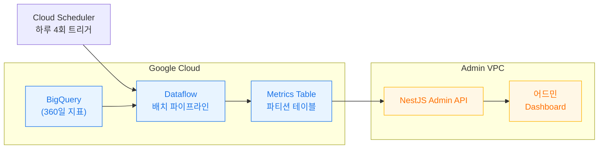
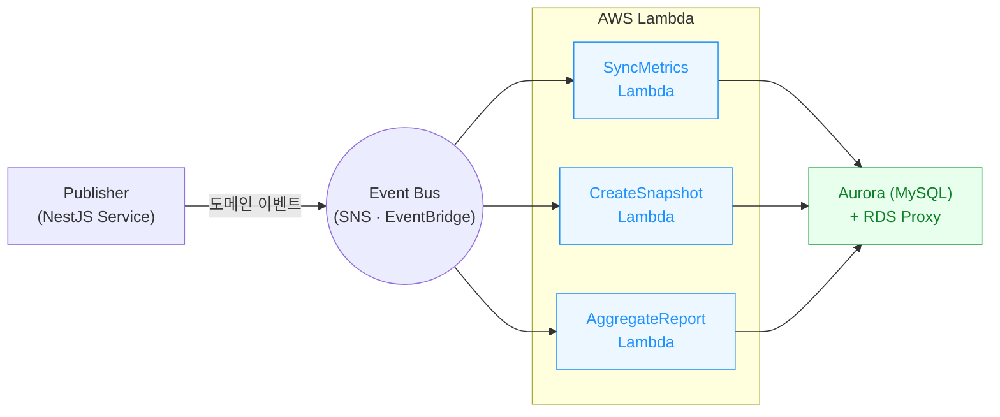
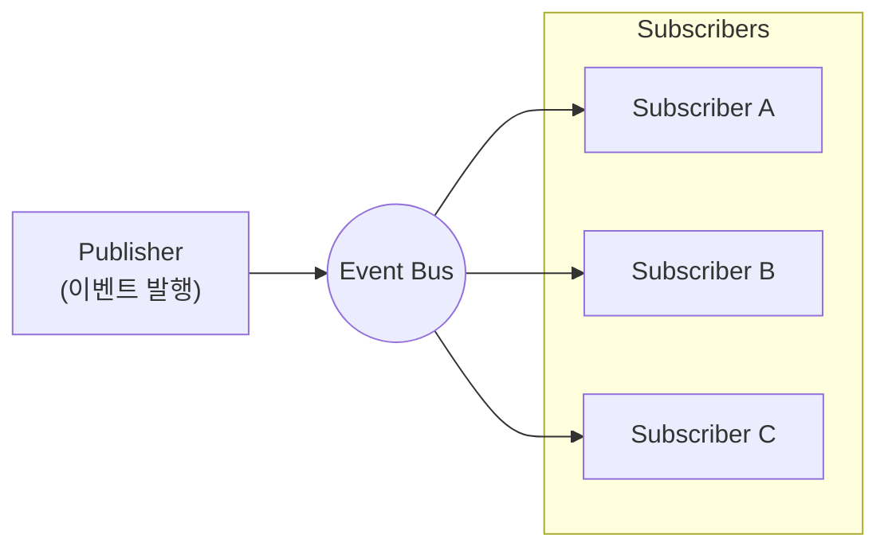

# 사내 어드민의 딜레마 - t4g.small의 한계

> "하루 4번 서버가 죽는 이유를 찾아서"

## 프롤로그: 평범한 월요일 오전의 악몽



마케팅 프로젝트는 전형적인 **사내 어드민 시스템**입니다.

```
📊 트래픽 패턴
- 평일 09:00-18:00: 마케팅 팀 활발 사용
- 평일 18:00-09:00: 거의 사용 없음
- 주말: 완전히 조용함

💰 비용 최적화 전략
- t4g.small (2 vCPU, 2GB RAM) - $13/월
- 오토스케일링 최소화
- 불필요한 리소스 제거
```

평상시에는 문제없었습니다. 하지만 **새로운 요구사항**이 들어왔습니다:

```
📋 BigQuery 마케팅 메트릭 동기화
- 360일치 마케팅 지표 데이터 처리
- 하루 4번 실행 (3:30, 9:30, 15:30, 21:30)
- 기존 스케줄링 시스템에 추가
```

그리고 **매일 4번**, 조용하던 서버에 지옥이 펼쳐지기 시작했습니다.

## 하루 4번의 지옥 스케줄

```
⏰ 구글 빅쿼리 일일 마케팅 메트릭 동기화
- 새벽 03:30 🌙 (조용한 시간)
- 오전 09:30 ☀️ (출근 직후 - 업무 시작!)
- 오후 15:30 ☀️ (캠페인 최적화 골든타임!)
- 밤   21:30 🌙 (퇴근 후)
```

**최악의 타이밍:** 오전 9:30과 오후 3:30은 **마케팅 팀이 가장 활발하게 사용하는 시간**이었습니다.

## 3가지 지옥의 증상들

### 1\. 메모리 부족 지옥


```typescript
// 💀 하루 4번의 메모리 학살
@Cron('30 3,9,15,21 * * *') // 3:30, 9:30, 15:30, 21:30
async syncBigQueryMetrics() {
  const today = moment().clone().startOf('day');
  const DAYS_TO_SYNC = 60; // 60일치 데이터 처리

  // 60일치 날짜 배열 생성
  const dates: string[] = Array.from({ length: DAYS_TO_SYNC }, (_, i) =>
    today.clone().subtract(i, 'day').format('YYYY-MM-DD'),
  );

  // 2GB RAM으로 60일치 BigQuery 작업을 한 번에 처리...
  await Promise.all(dates.map(date =>
    this.processBigQueryData(date) // 즉시 OOM 💥
  ));
}
```

**문제점:**

-   **t4g.small (2GB RAM)**이 60일치 데이터를 감당 못함
-   **BigQuery 결과 로딩 시 즉시 OOM** 발생
-   **하루 4번** 메모리 부족으로 프로세스 강제 종료
-   **ARM Graviton2 CPU 100% 점유**로 다른 기능 완전 마비

**실제 상황:**

```
09:30 - 마케팅 팀 출근 직후 → 서버 다운 💥
15:30 - 캠페인 최적화 시간 → 서버 다운 💥

"t4g.small로 BigQuery 데이터 처리는 불가능!"
```

### 2\. 업무 시간 마비 지옥

```
// 😱 마케팅 팀의 절망적인 상황
// "오전 9:30마다 어드민이 먹통이 돼요!"
// "오후 3:30에 캠페인 수정하려는데 서버가 죽어있어요!"

// 최악의 타이밍
오전 09:30 - 출근 후 업무 시작 시간 💥
    ↓
서버 CPU 100%, 어드민 접속 불가 (30분간)
    ↓
오후 15:30 - 캠페인 최적화 골든타임 💥
    ↓
또 다시 서버 마비... (30분간)
```

**문제점:**

-   **업무 시간 중** 서버 완전 마비
-   마케팅 팀 업무 효율성 급락
-   캠페인 최적화 기회 상실
-   **사내 어드민의 존재 이유** 자체가 위협받음

### 3\. 연쇄 실패 지옥

```java
@Cron('30 3,9,15,21 * * *') // 하루 4번 실행
async processAllSnapshots() {
  await this.syncGoogleMetrics();          // 45분 소요
  await this.createDailySnapshots();       // 60분 소요
  await this.aggregateReportData();        // 30분 소요
  // 총 135분 → 다음 스케줄과 겹침! 💥
}
```

**실제 상황:**

```
09:30 시작 → 11:45 완료 (2시간 15분)
15:30 시작 → 17:45 완료 (2시간 15분)
21:30 시작 → 23:45 완료 (2시간 15분)
03:30 시작 → 05:45 완료 (2시간 15분)

= 하루 9시간 서버 점유! 💥
```

**문제점:**

-   **6시간 간격** 스케줄인데 **2시간 이상** 소요
-   하나가 실패하면 **연쇄적으로 모든 스케줄 지연**
-   BigQuery 쿼리 타임아웃으로 **전체 동기화 실패**

## 해결책을 찾아서

사내 어드민의 특성을 고려한 여러 방안을 검토했습니다:

### 방안 1: 서버 사양 업그레이드 ❌

```
현재: t4g.small (2 vCPU, 2GB RAM) - $13/월
최소 필요: t4g.medium (2 vCPU, 4GB RAM) - $26/월

비용 증가: 월 $13 → $26 (2배 증가)
```

**문제점:**

-   **2배 비용 증가**로 사내 어드민 예산 부담
-   하루 8시간을 위해 24시간 비용 지불
-   2GB → 4GB RAM 업그레이드해도 60일치 처리는 여전히 버거움

### 방안 2: 스케줄링 시간 분산

```javascript
// 작업을 여러 시간대로 분산
@Cron('0 1 * * *') // 새벽 1시
async processRecentSnapshots() { /* 최근 30일 */ }

@Cron('0 3 * * *') // 새벽 3시
async processOldSnapshots() { /* 31-360일 */ }
```

**문제점:** 여전한 스파이크 문제, 복잡한 관리

### 방안 3: Lambda + Event-Driven 아키텍처 ✅



그리고 우리가 선택한 **게임 체인저**:

```kotlin
// ✅ Lambda + 이벤트 기반 처리
async updateMarketingData(data: MarketingData) {
  const result = await this.marketingService.update(data);

  // 이벤트 발행 → Lambda가 필요할 때만 실행
  await this.eventService.publish({
    eventName: EventName.MARKETING_SNAPSHOT_REQUESTED,
    payload: { date: data.date, metrics: data.metrics }
  });
}
```

**왜 Lambda였을까?**

1.  **메모리 문제 완전 해결** → 자동 스케일링으로 OOM 방지
2.  **NestJS DI 그대로 활용** → 기존 코드 재사용
3.  **사용량 기반 비용** → 24시간 서버 운영 대비 효율적
4.  **pub-sub 구조** → 기존 스케줄링 작업들도 전환 가능

## 사내 어드민에 Lambda가 완벽한 이유



### 1\. 비용 효율성 💰

```
기존 t4g.small (작동 불가): $13/월
t4g.medium 업그레이드 시: $26/월
Lambda 전환 후: $27/월 (Lambda $5 + RDS Proxy $22)

💡 비용 효과: t4g.medium과 거의 동일하지만 무한 확장성 확보
```

**💡 핵심 인사이트:**

-   **Lambda 자체 비용은 매우 저렴**: 월 $5 정도
-   **RDS Proxy 필수**: Lambda 동시 실행으로 인한 DB 연결 문제 해결
-   **사용량 기반 과금의 위력**: 하루 8시간 vs 24시간 차이
-   **서버 관리 비용 완전 제거**: 운영 부담 대폭 감소

### 2\. 기술적 연속성 🔄

-   **NestJS DI 그대로 활용** → 기존 코드 재사용
-   **TypeORM 그대로 사용** → 데이터 레이어 유지
-   **기존 서비스 로직 재활용** → 개발 시간 단축

### 3\. 아키텍처 개선 기회 🏗️

-   **pub-sub 구조 도입** → 기존 스케줄링 작업들도 전환
-   **Event-Driven 패턴** → 확장성과 유지보수성 향상
-   **마이크로서비스 준비** → 향후 확장 가능

## 결과 미리보기

이 아키텍처 전환으로 우리가 얻은 결과:

-   💰 **비용**: t4g.medium과 거의 동일 ($26 → $27/월)
-   ⚡ **처리 시간**: 평균 2시간 → 5분 이내 완료
-   🚫 **업무 방해**: 하루 4번 마비 → 0번 (완전 해결!)
-   🧠 **메모리 문제**: t4g.small OOM → Lambda 자동 스케일링
-   🔧 **운영 부담**: 서버 관리 → 완전 관리형 서비스
-   📈 **확장성**: 수동 스케일링 → 자동 무한 확장
-   🚀 **개발 효율**: 기존 코드 재사용 → 빠른 개발
-   🏗️ **아키텍처**: 모놀리식 스케줄링 → Event-Driven 구조

## 다음 편 예고

다음 편에서는 **"NestJS를 Lambda에서 그대로 쓰는 마법"**을 다룰 예정입니다:

-   기존 NestJS 코드를 Lambda에서 재사용하는 방법
-   Lambda Handler Factory 패턴
-   TypeORM 연결 관리 최적화
-   실제 성능 비교와 코드 예시

---

**사내 어드민 운영하시는 분들께**비슷한 비용 vs 성능 딜레마를 겪고 계신가요? t4g.small로 BigQuery 작업을 시도해보신 적 있나요?여러분의 경험과 고민을 댓글로 공유해주세요!

---

*이 글은 실제 마케팅 프로젝트에서 겪은 경험을 바탕으로 작성되었습니다.*
