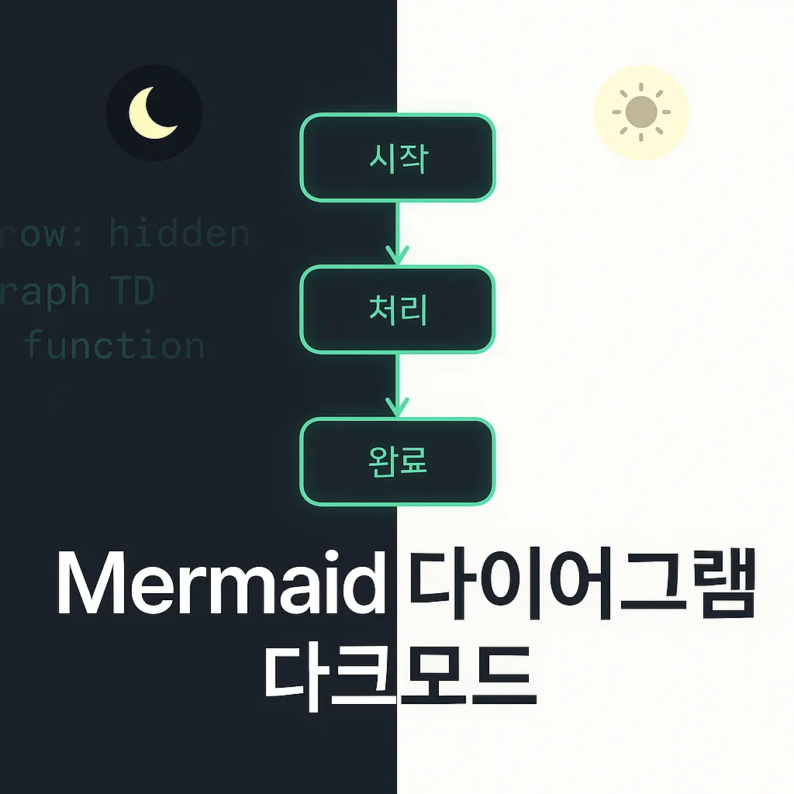

# Tistory에서 Mermaid 다이어그램 다크모드 자동 전환 구현하기

> "pronist/hello 스킨과 완벽하게 동기화되는 Mermaid 다이어그램 만들기"

## 프롤로그: 다크모드 시대의 다이어그램 딜레마

기술 블로그를 운영하다 보면 **다이어그램**은 필수입니다. 복잡한 아키텍처를 설명하거나 플로우차트를 그릴 때 **Mermaid**만큼 편리한 도구도 없죠.하지만 **다크모드**가 대세가 된 지금, 한 가지 문제가 있었습니다:

```erlang
? 사용자가 다크모드로 전환
? 다이어그램은 여전히 라이트 테마
? 눈이 아픈 상황 발생...
```

특히 **Tistory + pronist/hello 스킨**을 사용하는 환경에서는 더욱 복잡했습니다. 스킨의 다크모드 토글과 Mermaid 테마가 따로 놀았거든요.

## 문제 상황 분석

### 1\. Tistory의 코드 블록 제약

Tistory에서는 Mermaid를 직접 지원하지 않습니다. 대신 **코드 블록**을 사용해서 우회해야 하죠:

```xml
<!-- Tistory에서 작성하는 방식 -->
<pre class="delphi"><code>
graph TD
    A[시작] --> B[처리]
    B --> C[완료]
</code></pre>
```

이 코드 블록을 JavaScript로 **동적 변환**해야 합니다.

### 2\. pronist/hello 스킨의 다크모드 구조

**pronist/hello** 스킨은 Tailwind CSS 기반으로 다크모드를 구현합니다:

```stylus
// 다크모드 감지 방법
document.documentElement.classList.contains('dark') // true/false
```

-   **다크모드 ON**: `<html class="dark">`
-   **다크모드 OFF**: `<html>` (클래스 없음)

### 3\. Mermaid 재렌더링의 함정

가장 까다로운 부분은 **다크모드 토글 시 재렌더링**이었습니다:

```livecodeserver
// ❌ 잘못된 방법 - 문법 에러 발생
element.innerHTML = element.textContent; // SVG → 텍스트 변환 실패
```

이미 렌더링된 SVG를 다시 텍스트로 변환하려고 하면 문법 에러가 발생합니다.

## 해결책: 3단계 전략

### 1단계: 원본 코드 안전 보관

```dart
// 원본 Mermaid 코드를 두 곳에 저장
const originalMermaidCode = new Map();

function convertCodeBlocksToMermaid() {
  const elements = document.querySelectorAll('pre.delphi');

  for (const element of elements) {
    const codeElement = element.querySelector('code');
    const originalCode = codeElement.textContent.trim();

    const div = document.createElement('div');
    div.innerHTML = originalCode;
    div.className = 'mermaid';

    // ? 핵심: 원본 코드를 안전하게 보관
    div.setAttribute('data-original-code', originalCode);
    originalMermaidCode.set(div, originalCode);

    // DOM 교체
    const pre = codeElement.parentElement;
    pre.style.textAlign = 'center';
    pre.removeChild(codeElement);
    pre.appendChild(div);
  }
}
```

**핵심 아이디어**: 원본 텍스트를 HTML 속성과 JavaScript Map 두 곳에 저장해서 **이중 보안**을 확보합니다.

### 2단계: 스마트한 다크모드 감지

```javascript
function detectHelloDarkMode() {
  return document.documentElement.classList.contains('dark');
}

function initMermaid() {
  const isDark = detectHelloDarkMode();

  mermaid.initialize({
    theme: isDark ? 'dark' : 'default',
    startOnLoad: false, // 수동 제어
    securityLevel: 'loose'
  });
}
```

**pronist/hello** 스킨의 다크모드 구조에 맞춰 정확히 감지합니다.

### 3단계: 안전한 재렌더링

```javascript
function reRenderMermaidSafely() {
  const isDark = detectHelloDarkMode();

  // 새로운 테마로 재초기화
  mermaid.initialize({
    theme: isDark ? 'dark' : 'default',
    startOnLoad: false,
    securityLevel: 'loose'
  });

  const mermaidElements = document.querySelectorAll('.mermaid');

  mermaidElements.forEach(element => {
    // ? 핵심: 원본 텍스트로 정확히 복원
    const originalCode = element.getAttribute('data-original-code') ||
                        originalMermaidCode.get(element);

    if (originalCode) {
      element.removeAttribute('data-processed');
      element.innerHTML = originalCode; // SVG가 아닌 원본 텍스트
    }
  });

  mermaid.init(); // 새로운 테마로 재렌더링
}
```

**핵심**: SVG로 렌더링된 결과가 아닌 **원본 텍스트**로 복원해서 재렌더링합니다.

## 완전한 구현 코드

```xml
<!-- Tistory 스킨 HTML 편집 > head 태그 마지막 부분에 추가 -->
<script src="https://cdn.jsdelivr.net/npm/mermaid/dist/mermaid.min.js"></script>
<script>
(function() {
  const originalMermaidCode = new Map();

  function detectHelloDarkMode() {
    return document.documentElement.classList.contains('dark');
  }

  function initMermaid() {
    const isDark = detectHelloDarkMode();

    mermaid.initialize({
      theme: isDark ? 'dark' : 'default',
      startOnLoad: false,
      securityLevel: 'loose'
    });
  }

  function convertCodeBlocksToMermaid() {
    const elements = document.querySelectorAll('pre.delphi');

    for (const element of elements) {
      const codeElement = element.querySelector('code');
      if (!codeElement) continue;

      const originalCode = codeElement.textContent.trim();

      const div = document.createElement('div');
      div.innerHTML = originalCode;
      div.className = 'mermaid';
      div.setAttribute('data-original-code', originalCode);

      originalMermaidCode.set(div, originalCode);

      const pre = codeElement.parentElement;
      pre.style.textAlign = 'center';
      pre.removeChild(codeElement);
      pre.appendChild(div);
    }
  }

  function reRenderMermaidSafely() {
    const isDark = detectHelloDarkMode();

    mermaid.initialize({
      theme: isDark ? 'dark' : 'default',
      startOnLoad: false,
      securityLevel: 'loose'
    });

    const mermaidElements = document.querySelectorAll('.mermaid');

    mermaidElements.forEach(element => {
      const originalCode = element.getAttribute('data-original-code') ||
                          originalMermaidCode.get(element);

      if (originalCode) {
        element.removeAttribute('data-processed');
        element.innerHTML = originalCode;
      }
    });

    mermaid.init();
  }

  function watchThemeChanges() {
    let timeoutId;

    const observer = new MutationObserver(function(mutations) {
      mutations.forEach(function(mutation) {
        if (mutation.type === 'attributes' &&
            mutation.attributeName === 'class' &&
            mutation.target === document.documentElement) {

          clearTimeout(timeoutId);
          timeoutId = setTimeout(() => {
            reRenderMermaidSafely();
          }, 150);
        }
      });
    });

    observer.observe(document.documentElement, {
      attributes: true,
      attributeFilter: ['class']
    });
  }

  function initialize() {
    try {
      initMermaid();
      convertCodeBlocksToMermaid();
      mermaid.init();
      watchThemeChanges();

      console.log('Mermaid 다크모드 자동 전환 활성화 완료');
    } catch (error) {
      console.error('Mermaid 초기화 실패:', error);
    }
  }

  document.addEventListener('DOMContentLoaded', initialize);
})();
</script>
```

## 사용법

### 1\. Tistory 스킨 HTML 편집

위의 코드를 **스킨 편집 > HTML 편집**에서 `</head>` 태그 직전에 추가합니다.**참고**: `</body>` 태그 직전에 추가해도 동일하게 작동하지만, head 태그에 넣는 것이 더 안정적입니다.

### 2\. 글 작성 시

```css
```delphi
graph TD
    A[Lambda 함수] --> B[RDS Proxy]
    B --> C[데이터베이스]
    C --> D[응답]
```

```clean

**delphi** 언어로 코드 블록을 작성하면 자동으로 Mermaid 다이어그램으로 변환됩니다.

### 3. 자동 동작 확인

- 페이지 로드 시: 현재 테마에 맞는 다이어그램 표시
- 다크모드 토글 시: 0.15초 후 자동으로 테마 변경

## 기술적 하이라이트

### 1. **이중 보안 저장**
```javascript
div.setAttribute('data-original-code', originalCode); // HTML 속성
originalMermaidCode.set(div, originalCode);           // JavaScript Map
```

### 2\. **디바운스 적용**

```lisp
clearTimeout(timeoutId);
timeoutId = setTimeout(() => {
  reRenderMermaidSafely();
}, 150);
```

연속된 토글을 방지해서 성능을 최적화합니다.

### 3\. **MutationObserver 활용**

```css
observer.observe(document.documentElement, {
  attributes: true,
  attributeFilter: ['class']
});
```

DOM 변경을 실시간으로 감지해서 즉시 반응합니다.

## 결과

이제 **pronist/hello** 스킨에서 다크모드를 토글할 때마다:

-   ✅ Mermaid 다이어그램이 자동으로 테마 변경
-   ✅ 문법 에러 없는 안전한 재렌더링
-   ✅ 0.15초의 부드러운 전환 효과
-   ✅ 원본 코드 완벽 보존

## 다른 스킨에서 사용하려면?

**pronist/hello** 외의 다른 스킨에서 사용하려면 다크모드 감지 부분만 수정하면 됩니다:

```javascript
function detectDarkMode() {
  // 각 스킨에 맞게 수정
  return document.body.classList.contains('dark-theme') ||
         document.documentElement.classList.contains('dark') ||
         window.matchMedia('(prefers-color-scheme: dark)').matches;
}
```

## 마무리

기술 블로그에서 **사용자 경험**은 정말 중요합니다. 다크모드를 사용하는 독자가 밝은 다이어그램 때문에 눈이 아프다면, 아무리 좋은 내용이라도 읽기 힘들겠죠.이 구현으로 **Tistory + Mermaid + 다크모드**의 완벽한 조합을 만들 수 있었습니다. 여러분의 기술 블로그도 더욱 전문적이고 사용자 친화적으로 만들어보세요!

---

**비슷한 문제를 겪고 계신 분들께**다른 블로그 플랫폼이나 스킨에서도 비슷한 방식으로 구현 가능합니다. 궁금한 점이 있으시면 댓글로 남겨주세요!

---

*이 글은 실제 Tistory 블로그 운영 경험을 바탕으로 작성되었습니다.*
