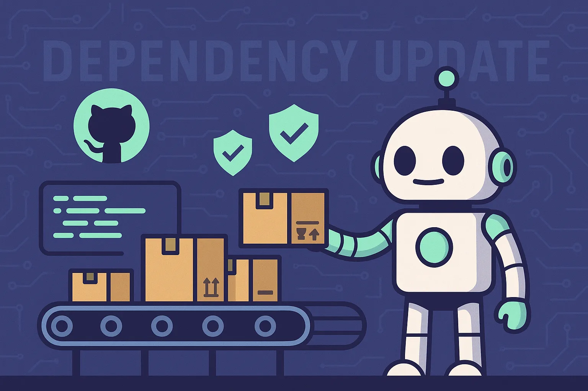

# Dependabot으로 의존성 관리 자동화하기

> ? **매일 아침 의존성 업데이트 PR을 확인하는 것이 일상이 된 개발자를 위한 실전 가이드**

안녕하세요! 오늘은 저희 팀에서 실제로 사용하고 있는 **Dependabot 설정과 운영 노하우**를 공유해드리려고 합니다.의존성 관리, 정말 귀찮지 않나요? 새로운 보안 패치가 나올 때마다 수동으로 업데이트하고, 어떤 패키지가 outdated인지 확인하고... 이런 반복 작업을 자동화할 수 있다면 얼마나 좋을까요?**Dependabot**이 바로 그 해답입니다! ?

## 왜 Dependabot을 도입했을까?

저희 팀도 처음에는 수동으로 의존성을 관리했어요. 하지만 프로젝트가 커지면서 문제가 생겼습니다:

-   ? **업데이트를 깜빡하는 경우**가 자주 발생
-   ? **보안 취약점 대응**이 늦어짐
-   ⏰ **의존성 관리에 너무 많은 시간** 소모
-   ? **어떤 패키지를 언제 업데이트해야 할지** 판단하기 어려움

그래서 Dependabot을 도입했고, 지금까지 **62개의 PR**을 자동으로 처리했습니다!

## 우리의 Dependabot 설정 공개

실제로 저희가 사용하는 설정을 그대로 공개합니다:

```dts
# .github/dependabot.yml
version: 2
updates:
  - package-ecosystem: "npm" # Yarn 사용해도 "npm"으로 설정해요
    directory: "/"
    schedule:
      interval: "daily" # 매일 체크
      time: "09:00" # 오전 9시 (출근 시간!)
      timezone: "Asia/Seoul" # 한국 시간 기준
    target-branch: "develop" # develop 브랜치로 PR 생성
    commit-message:
      prefix: "chore(deps)" # 깔끔한 커밋 메시지
      include: "scope" # deps, deps-dev 구분
    open-pull-requests-limit: 10
    assignees:
      - "kil-penguin" # 담당자 자동 할당
    labels:
      - "dependencies"
      - "automated"
    rebase-strategy: "auto"
```

### ? 설정 포인트 해설

**왜 매일 체크할까요?**

-   보안 업데이트를 빠르게 감지하기 위해서예요
-   하지만 PR이 너무 많다면 `weekly`로 변경해도 됩니다

**왜 develop 브랜치로 할까요?**

-   main 브랜치에 바로 PR을 만들면 위험하니까요
-   develop에서 테스트 후 안전하게 배포하는 전략입니다

## 매일 아침 루틴: Dependabot PR 체크하기

저희 팀의 아침 루틴을 공개합니다! ☕

### ? 오전 9:30 체크리스트

```stata
# 1. 새로운 PR 확인
gh pr list --author "app/dependabot" --state open
```

이 명령어 하나면 모든 Dependabot PR을 볼 수 있어요!

### ? 우선순위는 이렇게 정해요

| 긴급도 | 타입 | 어떻게 처리할까? |
|--------|------|----------------|
| **최우선** | Security | 바로 병합! |
| **자동처리** | Patch (1.0.1 → 1.0.2) | 자동 승인됨 |
| **확인필요** | Minor (1.0.0 → 1.1.0) | 자동 승인됨 |
| **신중검토** | Major (1.0.0 → 2.0.0) | 수동 검토 필수 |

## Dependabot PR 읽는 법

처음에는 Dependabot PR이 복잡해 보일 수 있어요. 하지만 구조를 알면 쉬워집니다!

### ? PR 제목 해석하기

```
chore(deps)(deps): bump remeda from 2.23.1 to 2.23.2
```

-   `chore(deps)`: 의존성 관련 작업이라는 뜻
-   `(deps)`: 프로덕션 의존성 (deps-dev면 개발 의존성)
-   `bump`: 버전 업데이트
-   `remeda from 2.23.1 to 2.23.2`: 어떤 패키지가 어떻게 바뀌는지

### ? PR 본문에서 확인할 것들

1.  **Release Notes** (접혀있어요)
    -   새 버전에서 뭐가 바뀌었는지 확인
    -   Bug Fixes, Features, Breaking Changes 체크
2.  **Compatibility Score**
    -   Dependabot이 알려주는 안전도 점수
    -   높을수록 안전한 업데이트
3.  **Dependabot Commands**
    -   `@dependabot rebase`: 충돌 해결
    -   `@dependabot ignore`: 이 업데이트 무시

## 실전 처리 방법

### ✅ 일반적인 경우 (Patch/Minor)

대부분의 경우는 이렇게 처리해요:

```livecodeserver
# 자동 승인 확인 후 바로 병합
gh pr merge <PR_NUMBER> --squash
```

### ? Major 업데이트는 조심스럽게

Major 업데이트는 Breaking Changes가 있을 수 있어서 신중하게 처리합니다:

1.  **Release Notes 꼼꼼히 읽기**
2.  **로컬에서 테스트해보기**

```mipsasm
git checkout <dependabot-branch>
yarn install && yarn lint && yarn build
# 문제없으면 병합
gh pr merge <PR_NUMBER> --squash
```

### ? 보안 업데이트는 최우선

보안 관련 업데이트는 바로 처리합니다:

```livecodeserver
gh pr review <PR_NUMBER> --approve
gh pr merge <PR_NUMBER> --squash
```

## 자주 발생하는 문제와 해결법

### ? 린팅 에러가 났을 때

가끔 새로운 의존성 때문에 린팅 에러가 날 수 있어요:

```properties
# 브랜치로 이동해서
git checkout <dependabot-branch>

# 린팅 자동 수정
yarn install
yarn lint --fix

# 수정사항 커밋
git add .
git commit -m "fix: resolve linting issues"
git push
```

### ⚔️ 충돌이 발생했을 때

주로 `yarn.lock` 파일에서 충돌이 발생해요:

```properties
# 리베이스로 해결
git checkout <dependabot-branch>
git rebase develop

# 충돌 해결 후
git add yarn.lock
git rebase --continue
git push --force-with-lease
```

또는 더 간단하게:

```java
@dependabot rebase
```

PR에 이 코멘트를 달면 Dependabot이 자동으로 리베이스해줘요!

## 설정 커스터마이징 팁

### ? 그룹화로 PR 수 줄이기

AWS SDK처럼 관련 패키지들이 많다면 그룹화하세요:

```vim
groups:
  aws-sdk:
    patterns:
      - "@aws-sdk/*"
    update-types:
      - "minor"
      - "patch"
```

이렇게 하면 AWS SDK 관련 업데이트가 하나의 PR로 묶여요!

### ? 특정 패키지 제외하기

문제가 있는 패키지는 제외할 수 있어요:

```groovy
ignore:
  - dependency-name: "problematic-package"
  - dependency-name: "legacy-lib"
    update-types: ["version-update:semver-major"]
```

### ? 보안 업데이트만 받기

매우 보수적으로 운영하고 싶다면:

```vim
allow:
  - dependency-type: "direct"
    update-types: ["security"]
```

## 우리가 배운 것들

### ? 꿀팁들

1.  **Yarn 사용해도 `package-ecosystem: "npm"`으로 설정**
    -   Dependabot이 `yarn.lock` 파일을 보고 자동으로 Yarn 명령어 사용해요
2.  **CODEOWNERS 파일과 연동**
    -   `package.json` 변경 시 자동으로 리뷰어 할당
3.  **GitHub CLI 적극 활용**
    -   웹 브라우저보다 CLI가 훨씬 빨라요

### ? 우리의 성과

-   **총 처리한 PR**: 62개
-   **주요 업데이트 패키지**: @aws-sdk/*, @types/*, NestJS 관련
-   **평균 처리 시간**: PR당 5분 이내
-   **보안 업데이트 대응**: 당일 처리

## 자주 묻는 질문들

### Q: PR이 너무 많이 생성돼요!

**A**: 이런 방법들을 시도해보세요:

-   `interval: "weekly"`로 변경
-   `open-pull-requests-limit: 5`로 줄이기
-   그룹화 설정 추가

### Q: 자동 병합이 안 돼요

**A**: 저희도 현재는 자동 승인만 하고 수동 병합해요. 테스트 환경이 완전히 구축되면 auto-merge를 활성화할 예정입니다.

### Q: Major 업데이트가 무서워요

**A**: 맞아요! 저희도 조심스럽게 처리해요:

1.  Release Notes 꼼꼼히 읽기
2.  로컬에서 테스트
3.  스테이징 환경에서 검증
4.  문제없으면 배포

## 마무리

Dependabot 도입 후 저희 팀의 의존성 관리가 정말 편해졌어요. 특히:

-   ⏰ **시간 절약**: 수동 체크 시간이 90% 줄었어요
-   ? **보안 강화**: 보안 업데이트를 놓치는 일이 없어졌어요
-   ? **스트레스 감소**: 의존성 관리 걱정이 사라졌어요

여러분도 Dependabot을 도입해서 더 중요한 개발 업무에 집중하세요!

## 유용한 명령어 모음

마지막으로 자주 사용하는 명령어들을 정리해드릴게요:

```stata
# PR 목록 보기
gh pr list --author "app/dependabot" --state open

# PR 상세 정보
gh pr view <PR_NUMBER>

# PR 승인 및 병합
gh pr review <PR_NUMBER> --approve
gh pr merge <PR_NUMBER> --squash

# PR 닫기
gh pr close <PR_NUMBER>

# 테스트 상태 확인
gh pr checks <PR_NUMBER>
```

---

**이 글이 도움이 되셨나요?** 댓글로 여러분의 Dependabot 경험도 공유해주세요! ?*이 글은 저희 팀의 실제 운영 경험을 바탕으로 작성되었습니다.*
