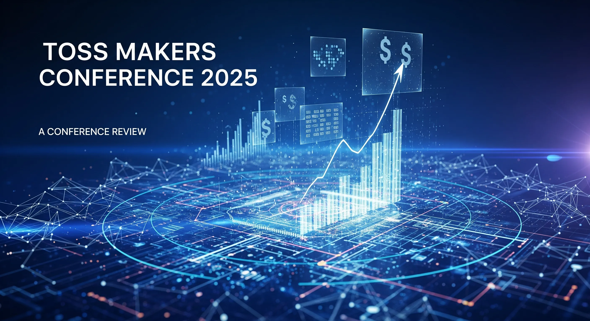

# 토스 메이커스 컨퍼런스 2025 참석 후기: 대규모 서비스의 기술적 진화를 엿보다

> **참석일**: 2025년 7월 25일 (금)
> **장소**: 코엑스 컨벤션센터
> **주요 세션**: 10개 기술 세션 참석

---



## ? 들어가며

토스 메이커스 컨퍼런스 2025에 참석하며 가장 인상 깊었던 점은 **"실패를 감추지 않고 드러내며 빠르게 공유하여 다음 선택의 근거로 삼는다"**는 토스의 기술 철학이었습니다.20년 된 레거시 시스템의 현대화부터 최신 ML 플랫폼 구축까지, 각 세션에서 공유된 내용은 단순한 성공 사례가 아닌 **시행착오와 해결 과정이 담긴 진솔한 경험담**이었습니다.

---

## ? 핵심 인사이트

### 1️⃣ 레거시는 짐이 아닌 자산이다

**"20년 레거시를 넘어 미래를 준비하는 시스템 만들기"** 세션에서 가장 놀라웠던 점은 토스가 2020년 인수한 20년 된 결제 시스템을 **완전히 새로 만들지 않고 점진적으로 현대화**했다는 것입니다.

```
현대화 전략:
  - Git 도입으로 코드 관리 체계화
  - MSA 전환 (150개+ 마이크로서비스)
  - 4개 AZ 분산 Kubernetes 클러스터
  - Java 17/21 사용률 50% 이상 달성
```

**핵심 교훈**: 레거시를 적으로 보지 말고, 비즈니스 가치를 인정하면서 단계적으로 개선하는 것이 현실적이고 효과적입니다.

### 2️⃣ 분산 시스템의 새로운 패러다임

**"현장결제 서비스의 분산 트랜잭션 관리학 개론"**에서 소개된 **트리 구조 기반 트랜잭션 관리**는 기존의 2PC나 Saga 패턴과는 완전히 다른 접근법이었습니다.

```
문제: 2개 트랜잭션 → 16가지 경우의 수
      4개 트랜잭션 → 256가지 경우의 수

해결: 트리 구조 + Resolve 메커니즘
      - 각 노드가 직계 하위 노드 상태만 관리
      - 복잡도를 O(1) 서브트리 단위로 축소
      - 양방향 보정 (재시도 + 롤백)
```

**핵심 교훈**: 복잡한 문제를 해결할 때는 기존 패턴에 얽매이지 말고, 문제의 본질을 이해하여 새로운 접근법을 시도해볼 용기가 필요합니다.

### 3️⃣ 설정 관리도 소프트웨어 개발이다

**"수천 개의 API/BATCH 서버를 하나의 설정 체계로 관리하기"**에서 인상 깊었던 점은 **설정을 코드처럼 설계하고 관리**한다는 철학이었습니다.

```properties
Overlay Architecture:
  App (최고 우선순위)
    ↓
  AppGroup
    ↓
  Phase
    ↓
  Cluster
    ↓
  Global (기본값)

특징:
  - 템플릿 시스템으로 중복 제거
  - Python 스크립트 주입으로 동적 설정
  - JobDSL로 배치 작업 코드화
```

**핵심 교훈**: 설정 관리를 단순한 파일 관리로 보지 말고, 소프트웨어 개발의 관점에서 접근하면 훨씬 체계적이고 확장 가능한 시스템을 만들 수 있습니다.

---

## ?️ 아키텍처 혁신 사례

### ScyllaDB로 극한 성능 달성

**토스뱅크의 Online Feature Store**에서 ScyllaDB를 선택한 이유와 운영 경험이 매우 실용적이었습니다.

```haml
성능 지표:
  - 쓰기: 120,000 TPS, P99 < 5ms
  - 읽기: P99 < 5ms 안정적 유지
  - 처리량: 매일 수천만건 적재

주의사항:
  - Large Partition 관리 (100MB+ 파티션 문제)
  - Full Scan 쿼리 제어 필요
  - 중간 Feature Server로 쿼리 검증
```

**핵심 교훈**: 새로운 기술 도입시 성능만 보지 말고, 운영 복잡도와 함정까지 고려해야 합니다.

### 결제 시스템의 CQRS + 이벤트 기반 전환

**"확장성과 회복탄력성을 갖춘 결제시스템 만들기"**에서 가장 인상 깊었던 점은 **실제 장애 사례와 해결 과정**을 숨김없이 공유한 것이었습니다.

```
주요 장애와 해결:
  1. DB 부하 → 인덱스 힌트로 옵티마이저 제어
  2. 타임아웃 불일치 → 전체 서버 체인 타임아웃 재설정
  3. 이벤트 누락 → 아웃박스 패턴 + 보상 트랜잭션
  4. 데이터 불일치 → 두 원장간 보정 배치 운영
```

**핵심 교훈**: 완벽한 시스템은 없다. 중요한 것은 **시스템이 스스로 회복할 수 있는 구조**를 만드는 것입니다.

---

## ? 개발 조직의 성장

### Infrastructure as Code의 진화

**"성장하는 엔터프라이즈를 위한 인터널 서비스 제공 전략"**에서는 토스가 어떻게 계열사 확장에 대응했는지 볼 수 있었습니다.

```
해결 전략:
  - Terraform으로 인프라 "찍어내기"
  - ArgoCD로 Kubernetes 리소스 관리
  - Config Store로 MSA 환경 설정 통합
  - Gateway Plugin으로 공통 로직 처리
```

**핵심 교훈**: 조직이 성장할 때는 사람이 늘어나는 것보다 **자동화와 추상화**가 더 중요합니다.

### 배치 시스템의 완전한 재구축

**"레거시 정산 개편기"**에서는 20년 된 정산 시스템을 어떻게 현대적으로 재구축했는지 상세히 다뤘습니다.

```
성능 최적화 3법칙:
  1. 캐싱: 가맹점 설정정보 메모리 캐시
  2. 벌크 처리: 래퍼 클래스로 배치 처리
  3. JDBC Batch Insert: N번 → 1번 처리

결과:
  - 처리 성능: 최대 10배 향상
  - 2,100개 배치 자동화 관리
  - 하루 수천만건 안정적 처리
```

**핵심 교훈**: 성능 최적화의 핵심은 **I/O 최소화**입니다.

---

## ? 개발자 성장의 과학

### 권태기 극복의 3가지 전략

마지막 세션 **"개발자 권태기, 10년 동안 이렇게 이겨냈습니다"**는 기술적 내용은 아니었지만, 가장 실용적인 세션이었습니다.

```markdown
1. 일상 무료함 탈출 (Flow 이론):
   - 명확한 목표 + 적절한 난이도 + 즉각적 피드백
   - 매일 작은 도전 추가

2. 동기 회복 (자기결정성 이론):
   - 자율성: 스스로 선택하는 일
   - 유능감: 기술적 성장 체감
   - 관계성: 동료와의 협업

3. 번아웃 예방:
   - 수면 위생이 핵심 (한국 OECD 수면시간 꼴등)
   - 침실은 수면 전용, 20도 유지
```

**핵심 교훈**: 개발자도 사람이다. 기술적 성장만큼 **심리적 웰빙**도 중요합니다.

---

## ? 실시간 데이터 처리의 현실

### Apache Druid vs StarRocks

**"고객은 절대 기다려주지 않는다"** 세션에서는 두 OLAP 엔진의 실제 사용 경험을 비교해볼 수 있었습니다.

```yaml
Apache Druid:
  장점: 시계열 특화, 비트맵 인덱스, 월 5천만원 절감
  한계: 멱등성 부족, 스키마 변경 어려움, 운영 복잡

StarRocks:
  장점: 멱등성 지원, CDC 네이티브, 조인 성능 84.6% 개선
  특징: Colocation Group으로 로컬 조인

현재: 하이브리드 운영 (각각의 장점 활용)
```

**핵심 교훈**: 완벽한 솔루션은 없다. 상황에 맞는 **하이브리드 접근**이 현실적입니다.

---

## ? 마무리: 토스에서 배운 것들

### 기술 철학

1.  **점진적 개선**: 완벽한 시작보다 지속적인 개선
2.  **실패 공유**: 실패를 숨기지 않고 학습 자산으로 활용
3.  **자동화 우선**: 반복 작업의 자동화로 창조적 업무에 집중
4.  **개발자 경험**: 기술적 우수성과 개인 성장의 조화

### 즉시 적용해볼 것들

-    설정 관리의 체계화 (계층형 구조 도입)
-    배치 작업의 코드화 및 자동화
-    카나리 배포를 통한 안전한 시스템 전환
-    개발자 권태기 예방을 위한 작은 도전들

### 장기적으로 고민해볼 것들

-    레거시 시스템의 점진적 현대화 전략
-    분산 트랜잭션 관리 방식 개선
-    Infrastructure as Code 도입
-    실시간 데이터 처리 아키텍처 고도화

---

**토스 메이커스 컨퍼런스의 가장 큰 가치는 '완벽한 해답'을 제시하는 것이 아니라, '시행착오와 학습의 과정'을 공유한다는 점이었습니다.****대규모 서비스를 운영하며 겪는 현실적인 문제들과 그 해결 과정을 통해, 기술 선택의 트레이드오프와 실무진의 고민을 엿볼 수 있었습니다.**기술 컨퍼런스 참석이 단순한 트렌드 파악을 넘어 **실무에 바로 적용할 수 있는 구체적인 인사이트**를 얻을 수 있는 소중한 경험이었습니다.

---

*본 후기는 토스 메이커스 컨퍼런스 2025 참석 후 개인적인 관점에서 작성되었으며, 실제 발표 내용을 바탕으로 구성되었습니다.*
