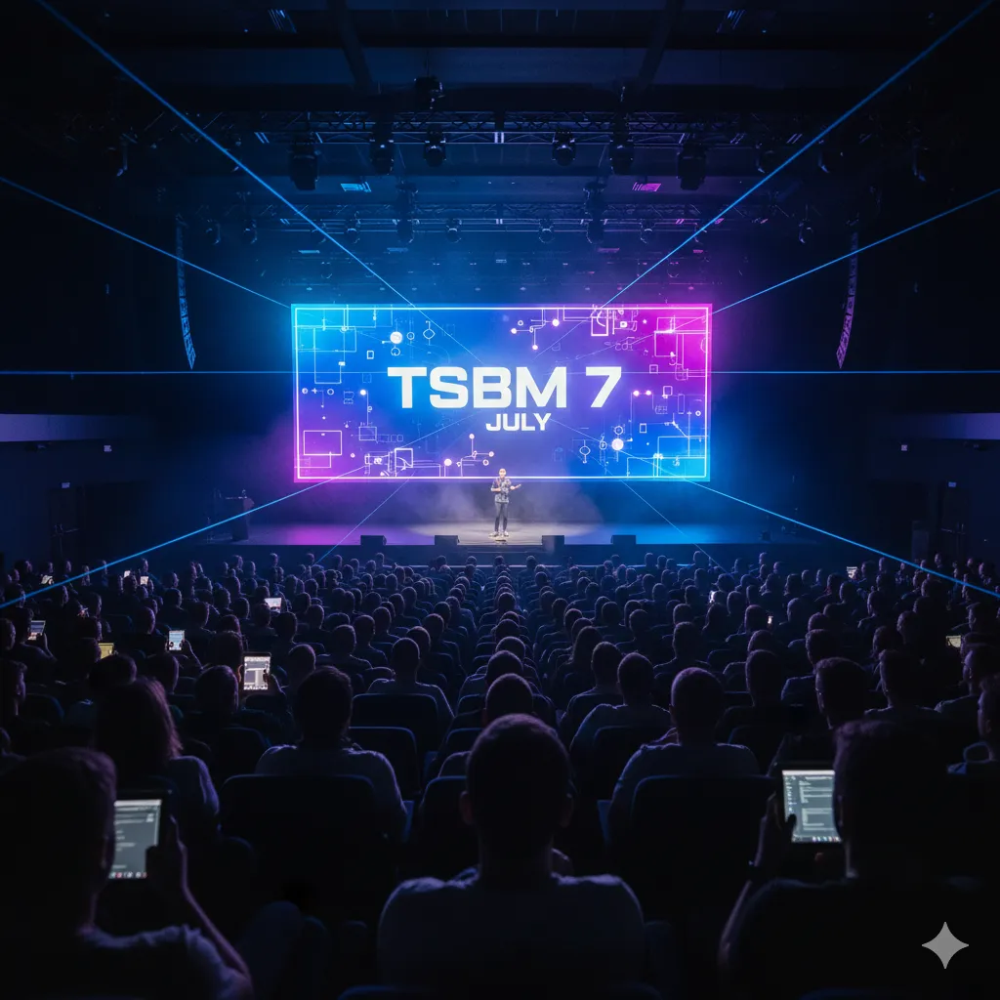

## 시작하며

최근에 토스 본사에서 열린 **TypeScript Backend Meetup #7**에 다녀왔습니다.

### TSBM이 뭔가요?

혹시 TSBM을 처음 들어보시는 분들을 위해 간단히 소개하면, **TypeScript Backend Meetup**의 줄임말로 TypeScript 기반 백엔드 개발자들의 커리어 성장과 네트워킹을 위한 정기 모임입니다. 매월 개최되며, 실무 경험을 바탕으로 한 기술 발표와 자유로운 네트워킹이 특징이에요.

-   **공식 GitHub**: [https://github.com/ts-backend-meetup-ts/meetup](https://github.com/ts-backend-meetup-ts/meetup)
-   **공식 유튜브**: [Typescript Backend Meetup](https://youtube.com/@typescriptbackend)
-   **문의**: [TSBM 공지 오픈카톡방](https://open.kakao.com/o/gKXJtxEh)

### 나의 TSBM 여정

사실 TSBM은 이번이 처음이 아니에요. 5월에 열린 첫 번째 모임에도 참석했었는데, 그때는 바쁘다는 핑계로 후기를 제대로 남기지 못했거든요.하지만 첫 모임에서 받은 인상이 너무 좋았어요. 단순한 기술 발표가 아니라 실제 현업에서 겪는 고민들과 해결 과정을 솔직하게 나누는 분위기가 정말 인상적이었습니다. 그래서 이번 7월 모임(실제로는 8월 1일에 진행)에도 망설임 없이 신청했어요.역시나 이번 밋업도 기대를 저버리지 않았습니다. 평소 온라인으로만 접하던 기술들을 실제로 현업에서 어떻게 적용하고 있는지 직접 들을 수 있는 좋은 기회였고, 특히 실제 회사에서 겪은 시행착오와 해결 과정을 솔직하게 공유해주는 세션들이 많아서 더욱 인상 깊었습니다.이번에는 꼭 후기를 남겨야겠다는 생각으로 열심히 메모하며 들었던 내용들을 정리해보려고 합니다.

## 토스 김인성님 오픈마이크: "Node.js 챕터는 무엇을 하는가?"

밋업 시작 전, 토스 Node.js 챕터 리드 김인성님의 오픈마이크가 있었습니다. "솔직히 채용 홍보를 해보려고 준비했다"고 진솔하게 말씀하셔서 오히려 더 흥미롭게 들을 수 있었어요.

### 토스 Node.js 챕터의 진화 과정

토스 Node.js 챕터는 2018년 **스크래핑 기술 내재화**로 시작해서, 지금은 토스 전 계열사의 기술적 엣지를 만들어내는 조직으로 성장했다고 합니다.가장 놀라웠던 건 **하루 45만개의 테스트**를 돌리는 테스트 자동화 플랫폼이었어요. 이 정도 규모의 테스트를 빠른 시간 내에 처리한다는 것 자체가 정말 대단하다고 생각했습니다.

### 현재 토스 Node.js 챕터가 하는 일들

김인성님이 소개해주신 주요 프로젝트들:**TDMS (Toss Deploy Management System)**

-   토스 전체 계열사의 배포 관리 시스템
-   프론트엔드, 서버, 네이티브 앱 모든 배포를 관리
-   외부 의존성 장애 시에도 배포 가능한 격리 시스템 구축

**Deus (디자인 툴)**

-   Figma, Framer와 같은 디자인 툴을 자체 개발
-   내부 시스템과 강결합으로 생산성, 로깅, 컴플라이언스까지 챙김
-   토스 앱 내 미니앱 개발에 활용 예정

**운영 업무 자동화**

-   Slack, Google, 외부 SaaS 연동 자동화
-   Greenhouse, Workday 등 인사 시스템 연동
-   바이럴 모니터링, AML, FDS 등 다양한 업무 자동화

**AI/ML 플랫폼**

-   핀테크 특성상 고객 정보 보안이 중요한 환경에서의 AI 활용
-   내부 직원용 LLM 빌더 구축
-   전 세계 10개국 40여개 AI 모델 배포 및 오케스트레이션

### 모듈화를 통한 생산성 우상향

김인성님이 강조한 핵심은 **"모듈화를 통한 생산성 우상향"**이었습니다. 특히 t2-http 라이브러리 구조가 인상적이었어요:

```haml
// 계층화된 HTTP 통신 라이브러리 구조
HttpTemplate (개발자 친화적 인터페이스)
  ↓
HttpClient (실제 통신 스펙 정의)
  ↓
다양한 구현체들:
- @tossteam/t2-http-client.axios (서버용)
- @tossteam/t2-http-client.got (고성능 서버용)
- @tossteam/t2-http-client.fetcher (브라우저용)
- HttpClientWithApp (앱 네이티브 통신용)
```

한국 사이트들이 표준 스펙을 엄격히 따르지 않는 문제까지 고려해서 자체 쿠키 스토어를 구현했다는 점도 흥미로웠습니다. 이런 디테일한 부분까지 신경 쓰는 게 토스다운 접근이라는 생각이 들었어요.

### 슬랙 자동화의 혁신

기존 Slack Bolt의 복잡한 이벤트 처리 방식을 NestJS 스타일 컨트롤러 패턴으로 개선한 사례도 인상적이었습니다:

```kotlin
@SlackController()
export class AutomationController {
  @MessageHandler()
  async handleMessage(message: SlackMessage) {
    const thread = await this.slack.createThread(message);
    return thread.reply("처리 완료");
  }

  @ActionHandler("deploy_button")
  async handleDeployAction(action: SlackAction) {
    const deployment = await this.deployService.start(action.payload);
    return action.respond(`배포 시작: ${deployment.id}`);
  }
}
```

이런 식으로 슬랙 이벤트를 체계적으로 관리할 수 있다니, 우리 팀에서도 참고할 만한 아이디어라고 생각했습니다.

### 토스의 기술 철학

"모든 모듈이 전 계열사에서 재사용되면서 생산성이 우상향한다"는 철학이 특히 인상적이었어요. 한 번 잘 만든 모듈이 토스페이먼츠, 토스플레이스, 토스뱅크, 토스증권 등 모든 계열사에서 활용되면서 조직 전체의 생산성이 계속 올라간다는 것이죠.김인성님이 마지막에 "토스 Node.js 챕터는 토스 커뮤니티의 기술적 엣지를 만들어내는 조직"이라고 정의하신 것이 정말 와닿았습니다.

## 김범서님의 DDD 세션: "해보지 않겠나 DDD..?"

첫 번째 메인 세션은 퓨처스콜레의 김범서님이 발표한 DDD 세션이었습니다. 프로그래밍 농담으로 시작하신 게 기억에 남아요:

> 의사: "하나님이 아담의 갈비뼈로 이브를 만들었으니, 의사가 가장 오래된 직업!"
> 엔지니어: "그 전에 혼돈 속에서 세상의 질서를 만들고 건축했으니, 엔지니어가 먼저!"
> 프로그래머: "그 혼돈을 누가 만들었죠?" ?

### 레거시 MVC의 현실적 문제들

김범서님이 보여준 레거시 코드 예시가 너무 현실적이어서 뜨끔했습니다:

```reasonml
// 끝없이 늘어나는 Repository 메서드들
class UserRepository {
  findAll() {}
  findById(id: string) {}
  findByEmail(email: string) {}
  findByRole(role: string) {}
  findActiveUsersWithRecentOrders() {} // 화면별 특화 쿼리들...
  findInactiveUsersOlderThan(months: number) {}
  // ... 끝없는 find 메서드들

  save(user: User): Promise<void> {} // 정작 이게 Repository의 본질!
}
```

이런 코드, 우리 프로젝트에도 있지 않나요? ?

### CQRS로 조회와 명령 분리하기

가장 실용적이었던 건 CQRS + DAO 패턴이었습니다:

```cs
// Command: Repository는 비즈니스 로직에서만 사용
class OrderRepository {
  async findById(id: string): Promise<Order> {}
  async save(order: Order): Promise<void> {}
}

// Query: 화면 로직을 위한 직접 조회
class GetOrderListQueryHandler {
  constructor(private prisma: PrismaClient) {}

  async execute(customerId: string) {
    return this.prisma.order.findMany({
      where: { customerId },
      select: { id: true, total: true, createdAt: true },
    });
  }
}
```

이렇게 하면 새로운 화면 요구사항이 생겨도 QueryHandler만 추가하면 되고, 핵심 비즈니스 로직은 건드리지 않아도 되겠더라고요.

### UI와 조회의 밀접성

React Server Components나 GraphQL처럼 UI와 데이터 조회를 가까이 두는 트렌드에 대한 이야기도 흥미로웠습니다. "응집도 관점에서 관련된 것들을 함께 두는 게 유지보수에 좋다"는 말씀이 인상적이었어요.

## 최성국님의 MSA 세션: "생산성 높은 MSA 환경 구성하기"

두 번째 메인 세션은 아임웹 생산성팀 최성국님의 MSA 환경 구성 이야기였습니다. 15년간 쌓인 PHP 모놀리스를 MSA로 전환하면서 겪은 현실적인 문제들과 해결 과정이 정말 솔직하고 유익했어요.

### MSA의 이상과 현실

처음에는 MSA를 도입하면 개발 속도가 빨라질 거라고 생각했는데, 오히려 복잡도만 증가했다는 고백이 인상적이었습니다:

```makefile
기대: 서비스별 독립 배포 → 빠른 개발 → 빠른 피드백
현실: 인프라 복잡도 폭증 → 인증 파편화 → 개발 속도 저하
```

새로운 마이크로서비스 하나 띄우려면 3개의 저장소(Terraform, Kubernetes, ArgoCD)를 오가며 일주일이 걸렸다고 하니, 정말 비효율적이었겠어요.

### 자동화를 통한 혁신적 개선

하지만 이 문제를 해결한 방법이 정말 인상적이었습니다:**Before**: 인프라 엔지니어가 3개 저장소 × 일주일 작업
**After**: 개발자가 `apps/my-service/Dockerfile` 푸시 → 20분 후 서비스 실행99% 시간 단축이라니, 정말 대단한 성과라고 생각했어요.

### Terraform 모듈화의 힘

특히 Terraform 모듈 패키징 아이디어가 좋았습니다:

```
# 기존: 매번 50줄의 복잡한 리소스 정의
resource "aws_ecr_repository" "app" { ... }
resource "aws_iam_role" "app" { ... }
resource "aws_secretsmanager_secret" "app" { ... }

# 개선: 한 줄로 모든 인프라 구성
module "microservice" {
  source = "./modules/microservice"
  service_name = "my-service"
  environment  = "production"
}
```

npm install하듯이 인프라를 설치하는 개념이라는 설명이 직관적이었어요.

### JWT 기반 인증 통합

인증 파편화 문제도 중앙화된 JWT 서버로 해결했다고 합니다. 각 팀이 OAuth 2.0, Passport, JWT를 제각각 구현하던 문제를 하나의 표준으로 통일한 거죠.

### Kong Gateway 선택 이유

API Gateway로 Kong을 선택한 이유도 흥미로웠어요:

-   **Istio**: 학습 곡선이 가파르고 k8s 외부 서비스 연결 불가
-   **Nginx/Caddy**: 설정 복잡하고 백엔드 엔지니어들이 문법 학습 필요
-   **Kong**: YAML 기반 선언형 설정으로 Git 형상 관리 가능

"선언형 설정이 중요한 이유는 인프라 엔지니어와 백엔드 엔지니어 간 커뮤니케이션 비용을 줄일 수 있기 때문"이라는 설명이 와닿았습니다.

## 김현우님의 NestJS 세션: "NestJS 의존성 주입 딥다이브"

마지막 세션은 모두싸인의 김현우님의 NestJS 의존성 주입 딥다이브였습니다. "사사똑 코마없"(사람 사는 거 똑같고 코딩에 마법은 없다)라는 표현이 기억에 남아요.

### 의존성 주입의 4단계 과정

NestJS가 어떻게 마법처럼 의존성을 주입해주는지 4단계로 설명해주셨습니다:

1.  **메타데이터 기록**: TypeScript가 컴파일 시 `design:paramtypes` 등 생성
2.  **모듈 스캔**: DFS로 모든 모듈 순회하며 의존성 트리 구성
3.  **InstanceWrapper 생성**: 실제 인스턴스를 담을 래퍼 객체 생성
4.  **인스턴스 생성**: 의존성 순서대로 `new` 키워드로 실제 객체 생성

### TypeScript 메타데이터 시스템

특히 TypeScript가 컴파일 시 자동으로 생성하는 메타데이터를 활용한다는 점이 흥미로웠어요:

```reasonml
// TypeScript 컴파일 후 자동 추가
Reflect.defineMetadata("design:paramtypes", [UserRepository], UserService);
```

@Inject 데코레이터는 이런 메타데이터에 추가 정보를 덧붙이는 역할이고요.

### 실제 소스코드 레벨 분석

김현우님이 실제 NestJS 소스코드를 보여주면서 설명해주신 게 정말 좋았어요. `NestFactory.create()`부터 시작해서 실제 인스턴스가 생성되는 과정까지, 정말 "마법은 없다"는 걸 보여주셨습니다.순환 참조 처리나 성능 최적화(Promise.all로 병렬 처리) 같은 디테일까지 다뤄주셔서 NestJS에 대한 이해가 한층 깊어졌어요.

## 개인적인 소감과 적용 계획

### 가장 인상 깊었던 점

1.  **김범서님의 DDD 실용적 접근**: 완벽한 DDD보다는 CQRS 같은 실용적 패턴부터 시작하는 점진적 접근
2.  **최성국님의 자동화 집착**: 99% 시간 단축이라는 구체적 성과와 "수기 작업 완전 제거"라는 명확한 목표
3.  **김현우님의 NestJS 내부 분석**: "마법은 없다"는 철학으로 실제 소스코드까지 보여준 깊이 있는 설명
4.  **기술 선택의 현실성**: 이론적 완벽함보다는 팀의 학습 곡선과 유지보수성을 고려한 선택

### 우리 팀에 적용해보고 싶은 것들

**단기적으로**:

-   CQRS 패턴으로 조회 로직 분리해보기
-   공통 기능들을 패키지로 모듈화하기
-   반복적인 인프라 작업 자동화 검토

**중장기적으로**:

-   DDD 패턴을 작은 기능부터 점진적 적용
-   API Gateway 도입으로 공통 기능 중앙화
-   배포 프로세스 완전 자동화

### 아쉬웠던 점

시간 관계상 각 세션이 좀 빠르게 진행되어서, 더 깊이 있는 질의응답을 하지 못한 게 아쉬웠어요. 특히 DDD 세션에서는 Domain Service나 Bounded Context 같은 고급 개념들을 더 듣고 싶었는데, 시간이 부족했습니다.

## 마무리

이번 TSBM 7월 밋업은 단순한 기술 소개를 넘어서, 실제 현업에서의 시행착오와 해결 과정을 솔직하게 공유해주는 자리였습니다. 특히 "완벽한 기술"보다는 "현실적인 해결책"에 초점을 맞춘 발표들이 많아서 더욱 유익했어요.김범서님의 DDD 점진적 접근, 최성국님의 MSA 자동화 집착, 김현우님의 NestJS 내부 구조 분석까지... 각각 다른 관점에서 TypeScript 백엔드 개발의 현실과 미래를 엿볼 수 있었습니다.다음 TSBM 밋업도 꼭 참석해서, 또 다른 인사이트를 얻어오고 싶네요. 혹시 비슷한 경험이나 의견이 있으신 분들은 댓글로 공유해주세요!

---

*이 글이 도움이 되셨다면 공유해주세요. 더 많은 개발자들과 함께 성장하고 싶습니다.*
