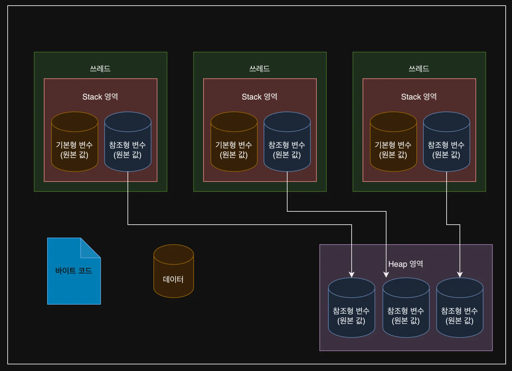

## 항해 플러스 추천인 코드

지원페이지에서 추천 코드에 `3ZTeU1`를 입력해주시면 `20만원` 할인 적용됩니다.
항해 플러스 과정에 관심이 있는 분들은 아래 링크를 통해 신청해보세요!
궁금하시거나 커피챗을 하고 싶으신 분들은 [링크드인](https://www.linkedin.com/in/kilhyeonjun/)이나 `kboxstar@gmail.com`으로 연락주세요.[항해 플러스 과정 페이지](https://hanghae99.spartacodingclub.kr/)

## 항해99 플러스 백엔드 코스 6기 언어 사전 스터디 5주차 - 프로세스와 스레드

## 프로세스와 스레드

### 프로세스

프로세스는 실행 중인 프로그램이다.
운영체제로부터 독립적인 메모리 공간과 시스템 자원을 할당받아 작업을 수행한다.

#### 프로세스 작업 단위

-   프로세스는 독립적인 실행 단위다.
-   각 프로세스는 고유한 메모리 공간을 가진다.
-   프로세스 간 통신(IPC)을 위해서는 특별한 메커니즘이 필요하다.

#### 프로세스 구조

1.  코드 영역: 실행할 프로그램의 코드가 저장된다.
2.  데이터 영역: 전역 변수와 정적 변수가 저장된다.
3.  힙 영역: 동적으로 할당되는 메모리를 관리한다.
4.  스택 영역: 지역 변수, 함수 호출 정보 등이 저장된다.

### 스레드

스레드는 프로세스 내에서 실행되는 작업의 단위다.
하나의 프로세스는 여러 개의 스레드를 가질 수 있다.

#### 스레드의 생성

-   스레드는 프로세스 내에서 생성된다.
-   같은 프로세스 내의 스레드들은 프로세스의 자원을 공유한다.

#### 스레드의 자원

-   스레드는 프로세스의 메모리와 자원을 공유한다.
-   스레드 간 통신은 프로세스 간 통신보다 간단하고 효율적이다.

#### Java 스레드

Java에서 스레드를 생성하는 방법은 두 가지가 있다.

1.  Thread 클래스 상속
2.  Runnable 인터페이스 구현

Java 프로그램은 JVM 위에서 실행되며, 메인 스레드부터 시작하여 필요에 따라 추가 스레드를 생성할 수 있다.

### 프로세스와 스레드의 관계

프로세스와 스레드의 관계를 시각화한 다이어그램이다.



이 다이어그램은 하나의 프로세스 내에 여러 스레드가 존재하는 모습을 보여준다.
각 스레드는 독립적으로 실행되지만, 프로세스의 자원을 공유한다.

## 멀티 스레드

### 싱글 스레드

싱글 스레드 프로그램은 한 번에 하나의 작업만 수행할 수 있다. 작업들이 순차적으로 실행된다.

### 멀티 스레드

멀티 스레드 프로그램은 여러 작업을 동시에 수행할 수 있다. 이를 통해 프로그램의 성능과 반응성을 향상시킬 수 있다.

#### 멀티 스레드의 장단점

장점:

-   자원을 효율적으로 사용할 수 있다.
-   응답성이 향상된다.
-   작업을 병렬로 처리할 수 있어 성능이 개선될 수 있다.

단점:

-   동기화 문제가 발생할 수 있다.
-   디버깅이 어려울 수 있다.
-   과도한 스레드 생성은 오히려 성능을 저하시킬 수 있다.

## Thread 와 Runnable

Java에서 스레드를 구현하는 주요 방법들에 대해 알아보자.

### Thread 클래스

Thread 클래스를 상속받아 스레드를 구현하는 방법이다.

1.  Thread 클래스를 상속받는다.
2.  run() 메소드를 오버라이드하여 스레드가 수행할 작업을 정의한다.
3.  스레드 객체를 생성하고 start() 메소드를 호출하여 스레드를 실행한다.

예제 코드:

```java
public class MyThread extends Thread {
    @Override
    public void run() {
        for (int i = 0; i < 5; i++) {
            System.out.println("Thread: " + Thread.currentThread().getId() + " is running");
            try {
                Thread.sleep(1000);
            } catch (InterruptedException e) {
                e.printStackTrace();
            }
        }
    }

    public static void main(String[] args) {
        MyThread thread1 = new MyThread();
        MyThread thread2 = new MyThread();

        thread1.start();
        thread2.start();
    }
}
```

### Runnable 인터페이스

Runnable 인터페이스를 구현하여 스레드를 만드는 방법이다.

1.  Runnable 인터페이스를 구현한다.
2.  run() 메소드를 구현하여 스레드가 수행할 작업을 정의한다.
3.  Runnable 객체를 Thread 생성자에 전달하여 스레드 객체를 생성한다.
4.  생성된 스레드 객체의 start() 메소드를 호출하여 스레드를 실행한다.

예제 코드:

```java
public class MyRunnable implements Runnable {
    @Override
    public void run() {
        for (int i = 0; i < 5; i++) {
            System.out.println("Thread: " + Thread.currentThread().getId() + " is running");
            try {
                Thread.sleep(1000);
            } catch (InterruptedException e) {
                e.printStackTrace();
            }
        }
    }

    public static void main(String[] args) {
        Thread thread1 = new Thread(new MyRunnable());
        Thread thread2 = new Thread(new MyRunnable());

        thread1.start();
        thread2.start();
    }
}
```

### 람다 표현식을 사용한 스레드 생성

Java 8 이후부터는 람다 표현식을 사용하여 더 간단하게 스레드를 생성할 수 있다.
Runnable 인터페이스가 함수형 인터페이스이기 때문에 람다 표현식으로 구현이 가능하다.예제 코드:

```reasonml
public class LambdaThread {
    public static void main(String[] args) {
        Runnable task = () -> {
            for (int i = 0; i < 5; i++) {
                System.out.println("Thread: " + Thread.currentThread().getId() + " is running");
                try {
                    Thread.sleep(1000);
                } catch (InterruptedException e) {
                    e.printStackTrace();
                }
            }
        };

        Thread thread1 = new Thread(task);
        Thread thread2 = new Thread(task);

        thread1.start();
        thread2.start();
    }
}
```

이 예제에서는 Runnable 인터페이스를 람다 표현식으로 구현하고 있다.
이 방식은 코드를 더 간결하게 만들어주며, 특히 스레드에서 수행할 작업이 간단할 때 유용하다.람다 표현식을 사용하면 다음과 같은 이점이 있다.

1.  코드의 간결성: 별도의 클래스를 만들지 않고도 스레드를 생성할 수 있다.
2.  가독성 향상: 스레드가 수행할 작업을 직관적으로 볼 수 있다.
3.  유연성: 필요에 따라 쉽게 스레드의 동작을 변경할 수 있다.

Java의 ExecutorService와 함께 사용하면 더욱 효율적인 멀티스레딩 프로그래밍이 가능하다.
