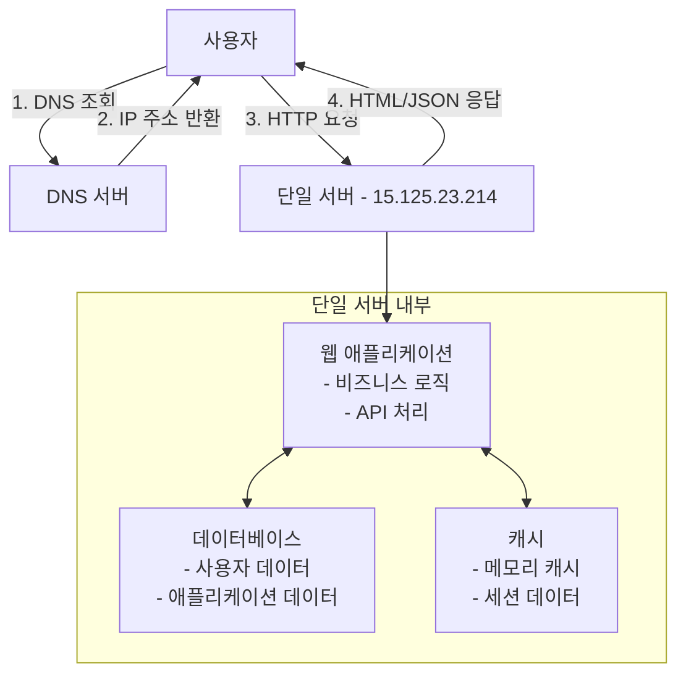
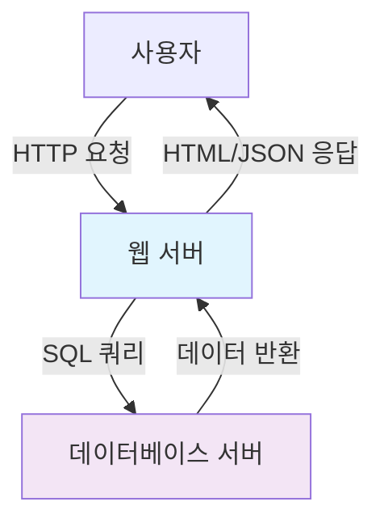
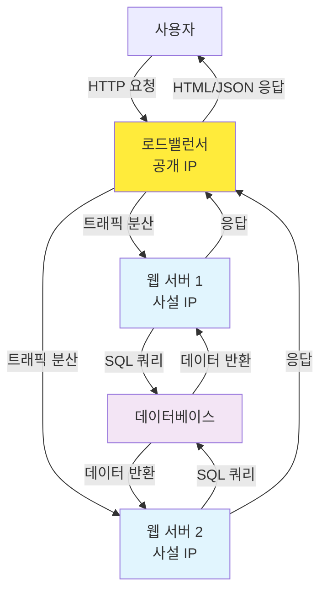
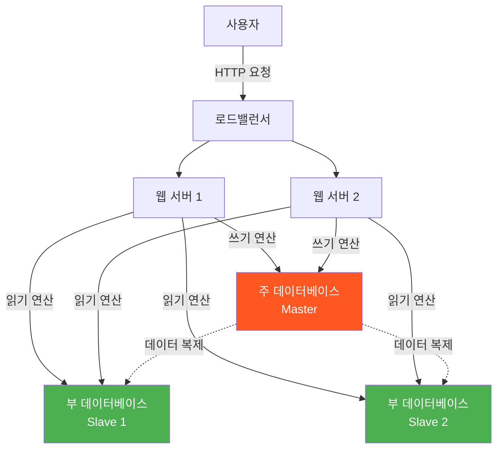
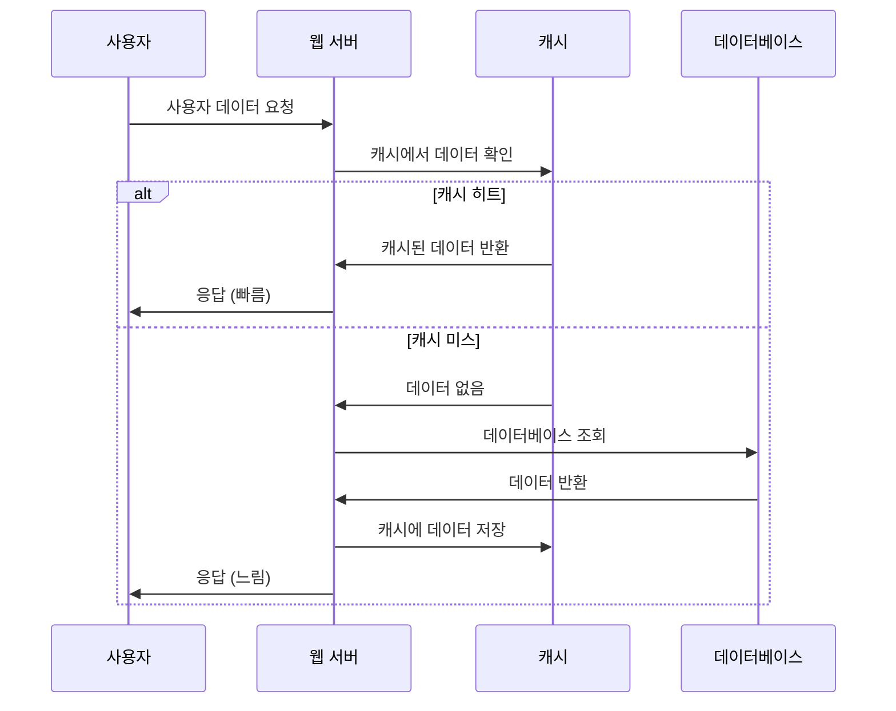
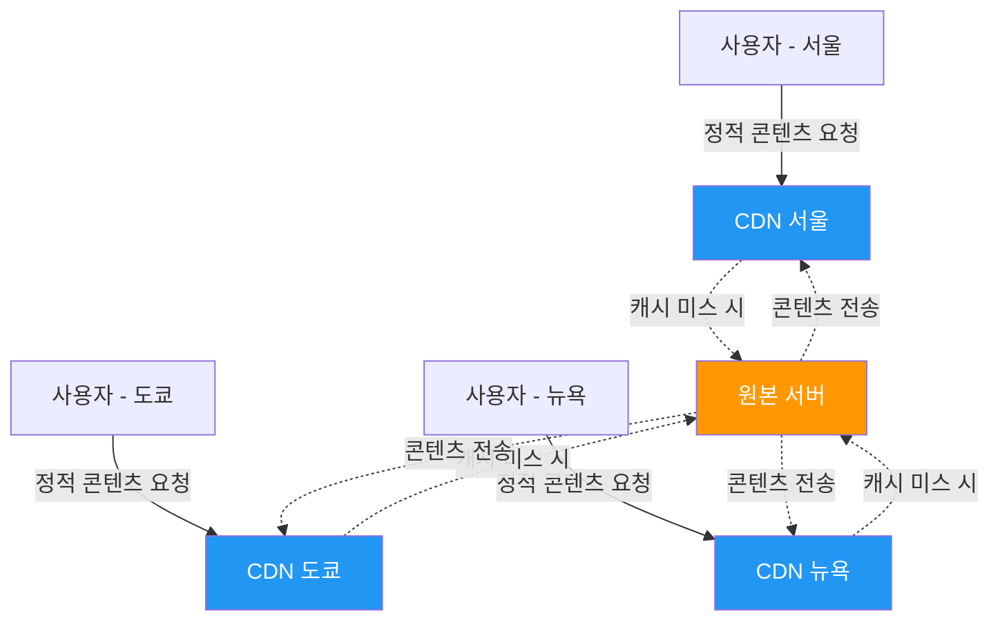
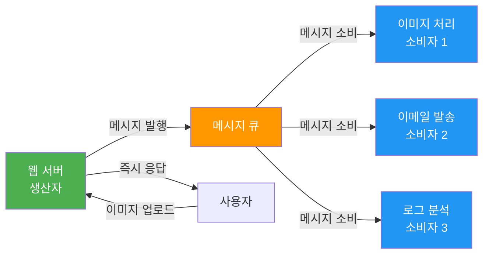
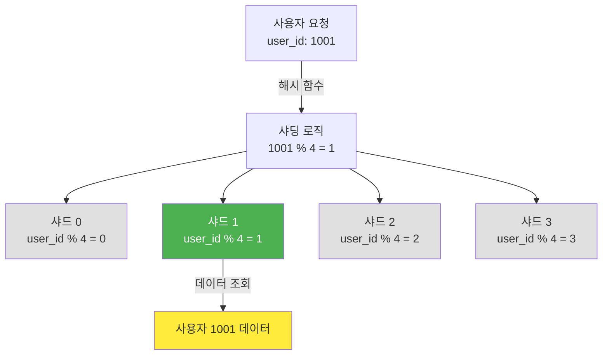

## 시작하며

항해 플러스 동기들과 함께 "가상 면접 사례로 배우는 대규모 시스템 설계 기초(가면사배)" 독서 스터디를 시작했습니다!앞으로 각 장마다 학습한 내용을 정리해서 공유할 예정인데, 첫 번째로 1장 "사용자 수에 따른 규모 확장성"을 읽고 나니 정말 많은 걸 배웠더라고요.단일 서버에서 수백만 사용자를 지원하는 시스템까지의 진화 과정을 단계별로 설명해놓은 게 인상적이었습니다. 개발자로서 항상 "우리 서비스가 사용자가 많아지면 어떻게 대응해야 할까?"라는 고민이 있었는데, 이 책에서 체계적으로 정리해놓은 내용이 정말 도움이 됐어요.독서 스터디 동기들과 함께 토론하면서 더 깊이 이해할 수 있었고, 혼자만 알고 있기 아까워서 핵심 내용들을 정리해서 공유해보려고 합니다.

## 책에서 제시하는 11단계 시스템 진화 과정

### 1단계: 단일 서버 - 모든 것의 시작

책에서는 가장 간단한 형태부터 시작합니다. 하나의 물리적 서버 안에 모든 컴포넌트가 함께 실행되는 구조입니다.



**실제 구현 예시**:

```cs
// 모든 것이 하나의 서버에서 실행
const express = require("express");
const app = express();

// 메모리 캐시 (단순한 Map 객체)
const cache = new Map();

// 데이터베이스 연결 (같은 서버)
const db = require("./database"); // localhost 연결

app.get("/api/users/:id", async (req, res) => {
  // 캐시 확인
  if (cache.has(req.params.id)) {
    return res.json(cache.get(req.params.id));
  }

  // DB 조회
  const user = await db.query("SELECT * FROM users WHERE id = ?", [
    req.params.id,
  ]);
  cache.set(req.params.id, user);

  res.json(user);
});

app.listen(3000); // 모든 것이 포트 3000에서 실행
```

**장점**:

-   구현이 간단하고 비용이 저렴
-   소규모 트래픽에는 충분
-   개발과 배포가 단순함
-   네트워크 지연이 없음

**한계**:

-   단일 장애 지점(SPOF) 문제
-   확장성 제한 (CPU, 메모리, 디스크 한계)
-   성능 병목 (모든 요청이 하나의 서버로)
-   컴포넌트 간 리소스 경합

이 부분을 읽으면서 "아, 우리도 처음엔 이랬지"라는 생각이 들었습니다. 모든 서비스가 이런 단순한 구조에서 시작하는 게 자연스러운 것 같아요. 실제로 스타트업이나 개인 프로젝트에서는 이런 구조로 시작해서 점진적으로 확장해나가는 게 일반적이죠.

### 2단계: 데이터베이스 분리 - 첫 번째 분리

다음 단계는 웹 서버와 데이터베이스를 분리하는 것입니다. 각각 독립적으로 확장할 수 있게 되죠.



책에서 흥미로웠던 부분은 데이터베이스 선택 기준을 표로 정리해놓은 것이었습니다:

관계형 데이터베이스

비관계형 데이터베이스

복잡한 쿼리와 트랜잭션

낮은 응답 지연시간

ACID 속성 필요

비정형 데이터

성숙한 생태계

대용량 데이터

실무에서 "언제 NoSQL을 써야 할까?"라고 고민했었는데, 이런 기준이 명확하게 정리되어 있어서 좋았습니다.

### 3단계: 로드밸런서 도입 - 가용성의 시작

로드밸런서를 도입해서 여러 웹 서버로 트래픽을 분산시키는 단계입니다.



**핵심 개념**:

-   공개 IP는 로드밸런서만 보유
-   웹 서버들은 사설 IP로 통신
-   장애 시 자동 복구 가능

책에서 강조한 건 "가용성 향상"이었습니다. 한 서버가 죽어도 서비스가 계속 돌아간다는 것, 정말 중요한 개념이죠.

### 4단계: 데이터베이스 다중화 - 읽기 성능 개선

주(Master) 데이터베이스와 부(Slave) 데이터베이스로 나누는 단계입니다.



**구조**:

-   주 데이터베이스: 쓰기 연산
-   부 데이터베이스: 읽기 연산
-   데이터 복제를 통한 동기화

**장애 시나리오**도 자세히 설명되어 있었습니다:

-   부 서버 장애: 읽기 트래픽을 주 서버나 다른 부 서버로 전환
-   주 서버 장애: 부 서버를 주 서버로 승격, 복구 스크립트 실행

이 부분에서 "아, 실제 운영에서는 이런 시나리오들을 다 고려해야 하는구나"라는 걸 깨달았습니다.

### 5단계: 캐시 계층 - 성능의 핵심

캐시 부분이 개인적으로 가장 흥미로웠습니다. 책에서 제시한 **캐시 우선 읽기(Cache-Aside)** 패턴:



```javascript
async function getUser(userId) {
  // 1. 캐시에서 확인
  const user = await cache.get(`user:${userId}`);
  if (user) {
    return JSON.parse(user);
  }

  // 2. 캐시 미스 시 DB 조회
  const userData = await database.query("SELECT * FROM users WHERE id = ?", [
    userId,
  ]);

  // 3. 캐시에 저장 (1시간 TTL)
  await cache.setex(`user:${userId}`, 3600, JSON.stringify(userData));
  return userData;
}
```

**고려사항들**도 정말 실무적이었습니다:

-   캐시 적용 시점: 읽기가 빈번하고 쓰기가 적은 데이터
-   데이터 일관성: 원본과 캐시 간 동기화
-   만료 정책: TTL 설정
-   장애 대응: 캐시 서버 다중화
-   데이터 방출 정책: LRU, LFU, FIFO

이런 세부사항들까지 고려해야 한다는 걸 보고 "캐시가 단순해 보이지만 실제로는 복잡하구나"라고 생각했습니다.

### 6단계: CDN - 정적 콘텐츠 최적화

CDN(콘텐츠 전송 네트워크) 도입 단계입니다.



**동작 과정**:

1.  사용자가 정적 콘텐츠 요청
2.  CDN에 캐시된 콘텐츠가 있으면 반환
3.  없으면 원본 서버에서 가져와 캐시 후 반환

**고려사항**:

-   비용: 데이터 전송량에 따른 과금
-   적절한 TTL 설정
-   CDN 장애 대응 방안
-   콘텐츠 무효화 방법

특히 "비용" 부분이 현실적이었습니다. 자주 사용되지 않는 콘텐츠를 캐싱하는 건 이득이 크지 않다는 점, 실무에서 정말 중요한 고려사항이죠.

### 7단계: 무상태 웹 계층 - 확장성의 핵심

개인적으로 가장 중요하다고 생각한 부분입니다.**상태 정보 의존적 vs 무상태** 비교:

상태 정보 의존적

무상태

서버가 클라이언트 상태 보관

상태 정보를 외부 저장소에 보관

특정 서버로만 요청 전달 필요

어떤 서버로든 요청 전달 가능

확장성 제한

자동 확장 가능

**구현 방법**:

-   세션 데이터를 Redis, Memcached 등 외부 저장소로 이동
-   데이터베이스에 사용자 상태 저장
-   NoSQL 활용

이 개념을 이해하고 나니 "왜 세션을 외부 저장소에 두라고 하는지" 명확해졌습니다.

### 8단계: 데이터 센터 - 글로벌 서비스

지리적 라우팅(GeoDNS)을 통해 사용자를 가장 가까운 데이터 센터로 라우팅하는 단계입니다.**기술적 과제**:

-   트래픽 우회: GeoDNS를 통한 효과적인 라우팅
-   데이터 동기화: 데이터 센터 간 데이터 일관성
-   테스트와 배포: 여러 지역에서의 테스트 및 배포 자동화

글로벌 서비스를 운영할 때 고려해야 할 점들이 정말 많다는 걸 깨달았습니다.

### 9단계: 메시지 큐 - 비동기 처리



**구성 요소**:

-   생산자(Producer): 메시지 발행
-   메시지 큐: 메시지 버퍼 역할
-   소비자(Consumer): 메시지 처리

**장점**:

-   느슨한 결합: 생산자와 소비자 독립적 운영
-   안정성: 메시지 지속성 보장
-   확장성: 각 컴포넌트 독립적 확장

**사용 사례**도 구체적이었습니다:

-   이미지 처리: 업로드 → 큐 → 비동기 처리
-   이메일 발송: 요청 → 큐 → 배치 처리
-   로그 처리: 수집 → 큐 → 분석

### 10단계: 로그, 메트릭, 자동화 - 운영의 기초

**로그**: 에러 로그 모니터링, 중앙화된 로그 수집 시스템
**메트릭**: 호스트 단위, 종합 메트릭, 비즈니스 메트릭
**자동화**: 지속적 통합(CI), 자동 빌드, 테스트, 배포이 부분에서 "시스템을 만드는 것과 운영하는 것은 다른 영역이구나"라는 걸 느꼈습니다.

### 11단계: 데이터베이스 샤딩 - 최종 확장



**샤딩 전략**: 샤딩 키 선택, 해시 기반 샤딩**고려사항**:

-   데이터 재샤딩: 샤드 추가 시 데이터 재분배
-   유명인사 문제: 특정 샤드에 트래픽 집중
-   조인과 비정규화: 여러 샤드 간 조인의 어려움

샤딩이 가장 복잡한 단계라는 걸 알 수 있었습니다.

## 책에서 배운 핵심 아키텍처 패턴들

### 수직적 확장 vs 수평적 확장

수직적 확장 (Scale Up)

수평적 확장 (Scale Out)

서버 성능 향상

서버 수량 증가

구현 단순

복잡성 증가

하드웨어 한계 존재

이론적 무제한 확장

SPOF 위험

장애 내성

고비용

상대적 저비용

### 로드밸런싱 전략

-   **라운드 로빈**: 순차적으로 서버 선택
-   **가중 라운드 로빈**: 서버 성능에 따른 가중치 적용
-   **최소 연결**: 연결 수가 가장 적은 서버 선택
-   **IP 해시**: 클라이언트 IP 기반 서버 선택

### 캐시 패턴

-   **Cache-Aside**: 애플리케이션이 캐시 관리
-   **Write-Through**: 쓰기 시 캐시와 DB 동시 업데이트
-   **Write-Behind**: 캐시 먼저 쓰고 나중에 DB 업데이트
-   **Refresh-Ahead**: 만료 전 미리 캐시 갱신

## 트레이드오프에 대한 깊은 이해

책에서 가장 인상 깊었던 부분은 **트레이드오프 분석**이었습니다.

### 성능 vs 일관성

-   **강한 일관성**: 모든 노드에서 동일한 데이터, 성능 저하
-   **최종 일관성**: 일시적 불일치 허용, 성능 향상

### CAP 정리

-   **일관성(Consistency)**: 모든 노드가 동일한 데이터
-   **가용성(Availability)**: 시스템이 항상 응답
-   **분할 내성(Partition Tolerance)**: 네트워크 분할 시에도 동작

### 비용 vs 성능

-   **고성능 하드웨어**: 높은 비용, 뛰어난 성능
-   **분산 시스템**: 상대적 저비용, 복잡성 증가

"모든 기술 선택에는 트레이드오프가 있다"는 걸 명확하게 이해하게 됐습니다.

## 실무에 적용할 수 있는 인사이트들

### 1\. 점진적 확장의 중요성

-   처음부터 복잡한 아키텍처 구축보다는 필요에 따른 점진적 확장
-   각 단계에서 병목 지점을 파악하고 해결
-   과도한 엔지니어링(Over-engineering) 방지

### 2\. 모니터링의 필수성

-   시스템 확장 전 현재 상태 정확한 파악 필요
-   메트릭 기반 의사결정
-   장애 예방을 위한 사전 모니터링

### 3\. 데이터 중심 설계

-   데이터의 특성(읽기/쓰기 비율, 크기, 접근 패턴)에 따른 저장소 선택
-   데이터 일관성 요구사항 분석
-   백업 및 복구 전략 수립

### 4\. 장애 대응 설계

-   단일 장애 지점 제거
-   장애 시 자동 복구 메커니즘
-   우아한 성능 저하(Graceful Degradation)

## 책의 핵심 메시지

> "수백만 사용자를 지원하는 시스템을 설계하는 것은 도전적인 과제이며, 지속적인 계량과 끝없는 개선이 요구되는 여정이다."

이 문장이 책의 핵심을 잘 표현한다고 생각합니다.**배운 핵심 원칙들**:

1.  **점진적 확장**: 필요에 따른 단계적 시스템 진화
2.  **병목 지점 파악**: 각 단계에서의 성능 제약 요소 식별
3.  **트레이드오프 이해**: 성능, 일관성, 비용 간의 균형
4.  **장애 대응**: 안정적인 서비스를 위한 다중화와 모니터링
5.  **데이터 중심 설계**: 데이터 특성에 맞는 아키텍처 선택

## 마무리

이 책의 1장을 읽으면서 시스템 설계에 대한 체계적인 사고 과정을 배울 수 있었습니다. 특히 "단계별 진화"라는 접근 방식이 인상 깊었어요.실무에서 "처음부터 완벽한 시스템을 만들어야 한다"는 압박감을 느꼈었는데, 이 책을 통해 "필요에 따라 점진적으로 개선해나가면 된다"는 걸 깨달았습니다.다음 포스트에서는 2장 "개략적인 규모 추정"을 다룰 예정입니다. 시스템 설계할 때 용량 계산하는 방법을 다룬다고 하는데, 이것도 정말 필요한 내용일 것 같아요.이 내용으로 토론하면 좋을 질문들을 정리해봤습니다:

### 🤔 시스템 설계 접근법에 대한 질문

-   단일 서버에서 시작하는 것 vs 처음부터 분산 시스템으로 설계하는 것, 어떤 상황에서 어떤 선택을 해야 할까요?
-   수직 확장과 수평 확장의 기준점은 어떻게 정해야 할까요?
-   로드밸런서 도입 시점을 어떻게 판단하시나요?

### 🗄️ 데이터베이스 확장에 대한 질문

-   읽기 복제본을 언제 도입해야 할까요? 트래픽 기준이 있나요?
-   데이터베이스 샤딩을 고려해야 하는 시점은 언제인가요?
-   NoSQL vs RDBMS 선택 기준은 무엇인가요?

### ⚡ 캐시 전략에 대한 질문

-   어떤 데이터를 캐시해야 하고, 어떤 데이터는 캐시하지 말아야 할까요?
-   캐시 무효화 전략 중 가장 효과적인 방법은 무엇인가요?
-   메모리 캐시 vs 분산 캐시, 언제 어떤 것을 선택해야 할까요?

### 🏗️ 아키텍처 진화에 대한 질문

-   마이크로서비스로 전환하는 적절한 시점은 언제일까요?
-   CDN 도입의 비용 대비 효과를 어떻게 측정하나요?
-   메시지 큐 도입이 필요한 상황은 어떤 경우인가요?

### 📡 모니터링과 운영에 대한 질문

-   시스템 확장 시점을 판단하는 핵심 지표는 무엇인가요?
-   장애 대응을 위한 모니터링 체계는 어떻게 구축해야 할까요?
-   성능 병목점을 찾는 가장 효과적인 방법은 무엇인가요?

댓글로 공유해주시면 함께 배워나갈 수 있을 것 같습니다!
