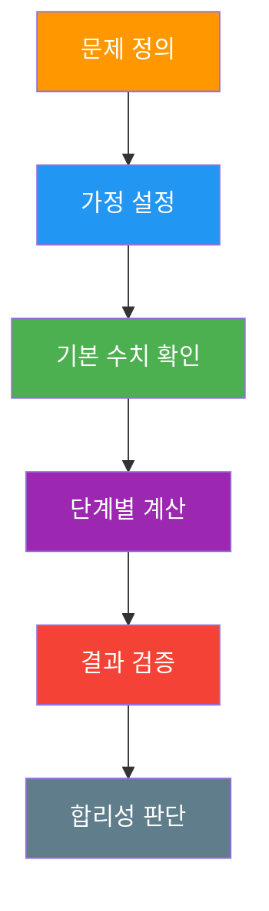
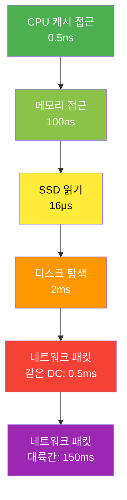
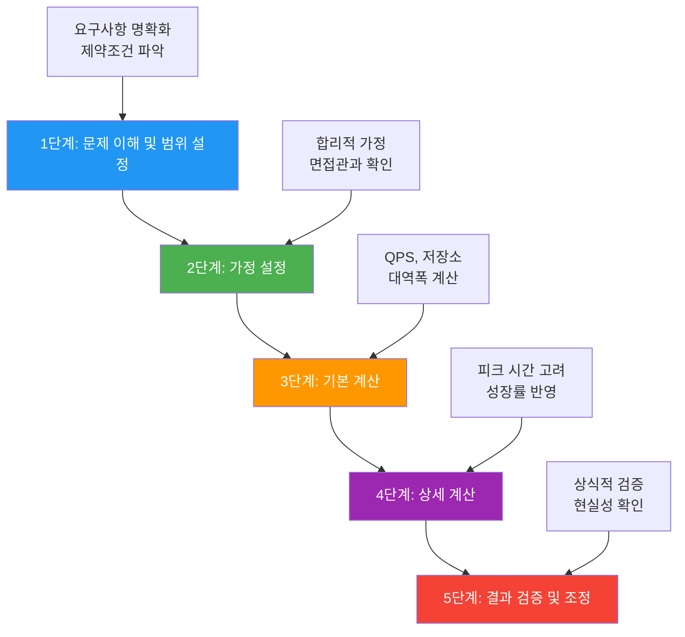
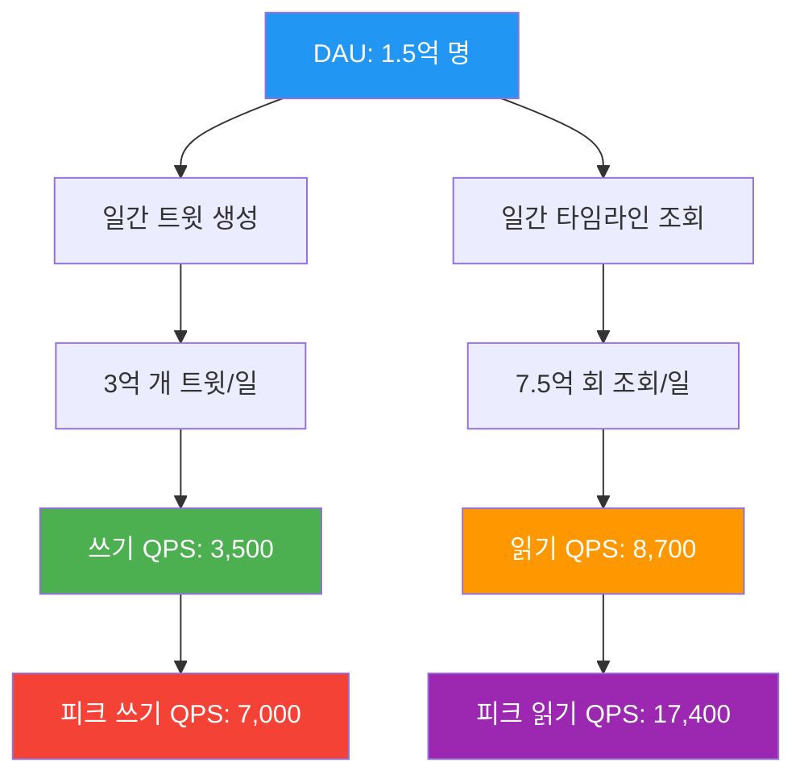
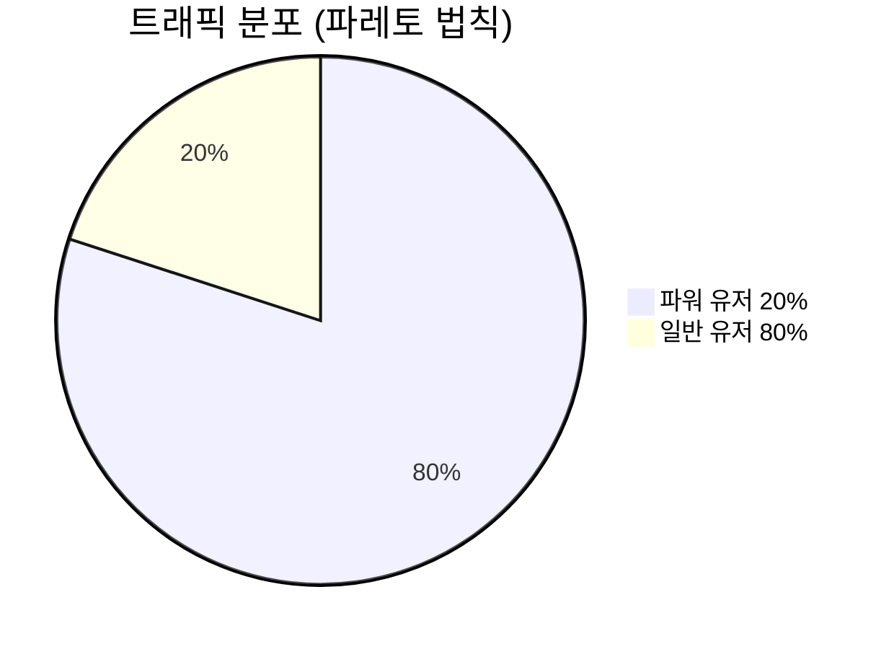
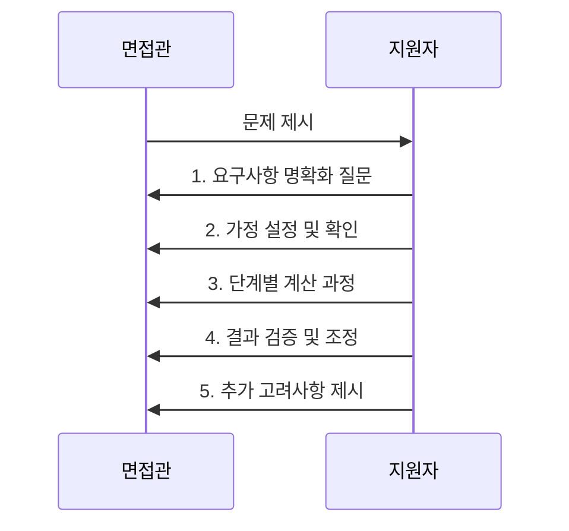
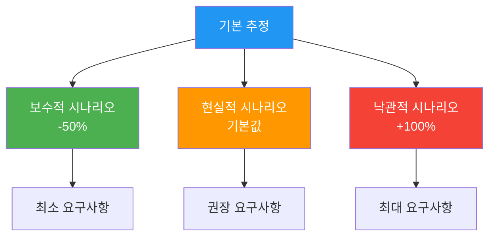

## 시작하며

가면사배 스터디 2주차! 1장에서 단일 서버부터 수백만 사용자까지의 시스템 진화 과정을 배웠다면, 이번 2장에서는 그런 시스템을 설계하기 전에 반드시 필요한 **개략적인 규모 추정(Back-of-the-envelope Estimation)**에 대해 다룹니다.처음에는 "봉투 뒷면 계산"이라는 번역이 좀 어색했는데, 실제로 읽어보니 정말 핵심적인 내용이더라고요. 시스템 설계 면접에서도 자주 나오고, 실무에서도 "이 정도 트래픽이면 서버가 몇 대나 필요할까?" 같은 질문에 답할 수 있어야 하거든요.스터디 동기들과 함께 실제 서비스들을 예시로 들어가며 계산해보니, 이론으로만 알던 것들이 구체적인 숫자로 와닿더라고요. "아, 유튜브가 이 정도 규모구나", "우리 회사 서비스와 비교하면 이 정도 차이가 나는구나" 하는 감각을 기를 수 있었습니다.특히 개발자로서 "감으로 때려맞추기"가 아니라 **논리적이고 체계적으로 접근하는 방법**을 배울 수 있어서 정말 유용했어요. 이번 포스트에서는 책에서 배운 핵심 개념들과 실무에 적용할 수 있는 팁들을 정리해보겠습니다.

## 개략적 규모 추정의 정의와 중요성

### 개략적 규모 추정이란?

**개략적 규모 추정(Back-of-the-envelope Estimation)**은 복잡한 시스템의 규모를 간단한 계산을 통해 대략적으로 추정하는 기법입니다. 정확한 수치보다는 **올바른 사고 과정과 합리적인 가정**을 통해 현실적인 범위 내의 답을 도출하는 것이 목표입니다.



### 왜 중요한가?

**시스템 설계 면접에서**:

-   논리적 사고 과정을 평가하는 핵심 도구
-   복잡한 문제를 단순화하는 능력 검증
-   실무 경험과 기술적 감각 측정

**실무에서**:

-   용량 계획(Capacity Planning) 수립
-   인프라 비용 추정
-   성능 병목 지점 예측
-   아키텍처 의사결정 지원

실제로 제가 경험한 상황들입니다:

-   "새 기능 출시 시 예상 트래픽 증가량은?"
-   "데이터베이스 샤딩이 필요한 시점은 언제?"
-   "CDN 도입의 비용 대비 효과는?"
-   "캐시 서버 메모리 용량을 얼마나 할당해야 할까?"

이런 질문들에 "감으로" 답하는 것이 아니라 **체계적인 계산**을 통해 근거 있는 답변을 할 수 있게 됩니다.

## 필수 기초 지식 - 2의 제곱수와 데이터 단위

### 데이터 단위 체계

개략적 규모 추정의 첫 번째 단계는 **기본 단위에 대한 정확한 이해**입니다. 면접에서 "1GB가 몇 바이트인지" 매번 계산하면 시간만 낭비하죠.

단위

2의 제곱수

대략적인 값

실제 값

실무 예시

1KB

2^10

~1천

1,024

짧은 텍스트 파일, JSON 응답

1MB

2^20

~1백만

1,048,576

고화질 사진, 작은 동영상

1GB

2^30

~10억

1,073,741,824

영화 1편, 대용량 데이터베이스

1TB

2^40

~1조

1,099,511,627,776

서버 스토리지, 데이터 센터

1PB

2^50

~1천조

1,125,899,906,842,624

대규모 클라우드 스토리지

**기억하는 팁**:

-   사진 1장 = 1MB
-   영화 1편 = 1GB
-   개인 PC 하드디스크 = 1TB
-   대기업 데이터 센터 = 1PB

### 시간 단위와 계산 상수

단위

초(seconds)

실무 활용

1일

86,400

일간 트래픽 계산

1주

604,800

주간 성장률 분석

1개월

2,592,000

월간 사용자 추정

1년

31,536,000

연간 데이터 증가량

**계산 팁**: 하루는 대략 10^5초(100,000초)로 근사하면 계산이 쉬워집니다.

## 성능 지표의 핵심 - 응답 지연시간(Latency)

### 제프 딘의 응답지연 수치

구글의 제프 딘(Jeff Dean)이 정리한 **컴퓨터 시스템 응답지연 수치**는 시스템 설계의 바이블과 같습니다. 이 수치들을 알고 있으면 "캐시를 도입하면 얼마나 빨라질까?", "네트워크 호출을 줄이면 성능이 얼마나 개선될까?" 같은 질문에 구체적으로 답할 수 있습니다.



작업

응답시간

상대적 비교

실무 적용

CPU 캐시 접근

0.5ns

1배

CPU 집약적 연산 최적화

메모리 접근

100ns

200배

인메모리 캐시(Redis)

SSD 읽기

16μs

32,000배

데이터베이스 인덱스

디스크 탐색

2ms

4,000,000배

전통적인 하드디스크

네트워크(같은 DC)

0.5ms

1,000,000배

마이크로서비스 통신

네트워크(대륙간)

150ms

300,000,000배

글로벌 API 호출

### 실무에서의 성능 최적화 인사이트

**메모리 vs 디스크**: 메모리가 디스크보다 20,000배 빠르다는 것은 단순한 숫자가 아닙니다.

```typescript
// 디스크 기반 조회 (2ms)
const userFromDB = await database.query("SELECT * FROM users WHERE id = ?", [
  userId,
]);

// 메모리 캐시 조회 (0.0001ms = 100ns)
const userFromCache = await redis.get(`user:${userId}`);

// 성능 차이: 20,000배 향상 (2ms ÷ 0.0001ms)
```

**네트워크 지연의 현실**:

-   같은 데이터센터 내 API 호출: 0.5ms
-   해외 API 호출: 150ms (300배 차이!)
-   CDN 활용의 중요성을 수치로 이해할 수 있음

**실제 경험담**:
해외 결제 API를 호출하는 기능을 개발할 때, 150ms 지연 때문에 사용자 경험이 크게 저하됐었습니다. 이 수치를 알고 있었다면 처음부터 비동기 처리나 캐싱 전략을 고려했을 텐데요.

## 체계적 추정 방법론

### 5단계 추정 프로세스

개략적 규모 추정은 다음과 같은 체계적인 과정을 따릅니다:



### 핵심 계산 공식들

**QPS(초당 쿼리 수) 계산**:

```
평균 QPS = 일간 총 요청 수 ÷ 86,400초
최대 QPS = 평균 QPS × 피크 배수 (보통 2~10배)
```

**저장소 요구량 계산**:

```
일간 저장소 = 일간 데이터 생성량 × 평균 데이터 크기
연간 저장소 = 일간 저장소 × 365일 × 복제 계수
```

**대역폭 계산**:

```fix
읽기 대역폭 = 평균 QPS × 평균 응답 크기
쓰기 대역폭 = 쓰기 QPS × 평균 요청 크기
```

## 실전 예제: 트위터 규모 추정

### 1단계: 문제 이해 및 가정 설정

**기본 가정**:

-   월간 활성 사용자(MAU): 3억 명
-   일간 활성 사용자 비율: 50% (DAU = 1.5억 명)
-   사용자당 일간 트윗 수: 2개
-   사용자당 일간 타임라인 조회: 5회
-   미디어 포함 트윗 비율: 10%
-   평균 트윗 크기: 280자 = 280바이트
-   평균 미디어 크기: 1MB

### 2단계: QPS 계산



**상세 계산**:

1.  **트윗 생성 (쓰기)**:
    -   일간 트윗: 1.5억 × 2 = 3억 개
    -   평균 쓰기 QPS: 3억 ÷ 86,400 = 3,472 ≈ 3,500
    -   피크 쓰기 QPS: 3,500 × 2 = 7,000
2.  **타임라인 조회 (읽기)**:
    -   일간 조회: 1.5억 × 5 = 7.5억 회
    -   평균 읽기 QPS: 7.5억 ÷ 86,400 = 8,681 ≈ 8,700
    -   피크 읽기 QPS: 8,700 × 2 = 17,400

### 3단계: 저장소 요구량 계산

**텍스트 데이터**:

```typescript
// 일간 텍스트 저장소
const dailyTextStorage = 300_000_000 * 280; // 84GB/일
const yearlyTextStorage = dailyTextStorage * 365; // 약 30TB/년
```

**미디어 데이터**:

```typescript
// 일간 미디어 저장소
const dailyMediaTweets = 300_000_000 * 0.1; // 3천만 개
const dailyMediaStorage = dailyMediaTweets * 1_000_000; // 30TB/일
const yearlyMediaStorage = dailyMediaStorage * 365; // 약 11PB/년
```

**총 저장소 (5년 보관)**:

-   텍스트: 30TB × 5 = 150TB
-   미디어: 11PB × 5 = 55PB
-   **총합: 약 55PB**

### 4단계: 대역폭 계산

**읽기 대역폭**:

-   평균 응답 크기: 1KB (트윗 메타데이터)
-   읽기 대역폭: 8,700 QPS × 1KB = 8.7MB/s

**쓰기 대역폭**:

-   평균 요청 크기: 300바이트
-   쓰기 대역폭: 3,500 QPS × 300바이트 = 1.05MB/s

### 5단계: 결과 검증

**상식적 검증**:

-   55PB는 개인 PC 하드디스크(1TB) 55,000개 분량
-   피크 QPS 17,400은 초당 17,400명이 동시 접속하는 수준
-   실제 트위터의 공개된 수치와 비교해보면 합리적인 범위

**실무 인사이트**:
이 계산을 통해 "왜 트위터가 복잡한 분산 시스템을 구축해야 하는지" 이해할 수 있습니다. 단일 서버로는 절대 처리할 수 없는 규모죠.

## 실무 적용 전략과 고급 기법

### 파레토 법칙(80/20 법칙) 활용

**핵심 원리**: 전체 사용자의 20%가 80%의 트래픽을 생성한다는 경험적 법칙



**실무 적용 사례**:

-   상위 20% 인기 콘텐츠만 캐시 → 80% 성능 향상 달성
-   캐시 메모리 효율성: 4배 향상 (0.8 ÷ 0.2)

**실제 경험**:
우리 서비스에서 전체 API 중 상위 20%만 캐싱했는데, 전체 응답 시간이 70% 개선됐습니다. 파레토 법칙이 실제로 적용되는 걸 확인할 수 있었어요.

### 계산 단순화 기법

**반올림 전략**:

-   복잡한 수치는 10의 배수로 반올림
-   99,987 ÷ 9.1 → 100,000 ÷ 10 = 10,000
-   정확성보다는 **사고 과정의 명확성**이 중요

**근사치 활용**:

-   하루 = 86,400초 → 100,000초(10^5)로 근사
-   오차 약 15%이지만 계산이 훨씬 간단

### 상식적 검증 체크리스트

계산 결과의 합리성을 검증하는 방법:

검증 항목

체크 포인트

예시

규모 비교

알려진 서비스와 비교

"페이스북보다 10배 큰데 서버가 더 적다?"

물리적 한계

하드웨어 제약 확인

"1초에 백만 건 처리? 현실적인가?"

비용 합리성

경제적 타당성

"연간 인프라 비용이 매출을 초과?"

성장률 검증

지속 가능성

"매년 10배 성장이 가능한가?"

### 고급 추정 기법

**시나리오 기반 추정**:

-   보수적: 사용자 증가 1.5배, 사용량 증가 1.2배
-   현실적: 사용자 증가 2.0배, 사용량 증가 1.5배
-   낙관적: 사용자 증가 3.0배, 사용량 증가 2.0배

**계층별 추정**:

-   **애플리케이션 계층**: QPS, 응답시간
-   **데이터 계층**: 저장소, 읽기/쓰기 비율
-   **네트워크 계층**: 대역폭, 지연시간
-   **인프라 계층**: 서버 수, 비용

## 시스템 설계 면접 전략

### 면접에서의 체계적 접근법

면접관이 "대규모 이미지 서비스의 저장소 요구량을 추정해보세요"라고 물어봤을 때의 모범 답안 과정:



**단계별 실제 대화 예시**:**1단계 - 요구사항 명확화**:

> "이미지 서비스의 범위를 명확히 하고 싶습니다. 소셜 미디어 형태인가요, 아니면 클라우드 스토리지 형태인가요? 그리고 글로벌 서비스인지 특정 지역 서비스인지도 확인하고 싶습니다."

**2단계 - 가정 설정**:

> "다음과 같이 가정하겠습니다:
>
> -   MAU 10억 명 (인스타그램 수준)
> -   일간 활성 사용자 비율 30% (DAU 3억 명)
> -   사용자당 일간 이미지 업로드 1장
> -   평균 이미지 크기 2MB
> -   데이터 보관 기간 5년"

**3단계 - 계산 과정**:

> "단계별로 계산해보겠습니다:
>
> -   일간 업로드: 3억 명 × 1장 = 3억 장
> -   일간 저장소: 3억 장 × 2MB = 600GB
> -   연간 저장소: 600GB × 365일 × 3배 복제 = 650TB
> -   5년 총 저장소: 650TB × 5년 = 3.25PB"

**4단계 - 결과 검증**:

> "3.25PB라는 수치가 합리적인지 검증해보겠습니다. 이는 개인 PC 하드디스크 3,250개 분량으로, 10억 사용자 서비스 규모로는 현실적인 수치라고 판단됩니다."

**5단계 - 추가 고려사항**:

> "실제 구현 시에는 다음 사항들도 고려해야 합니다:
>
> -   이미지 압축 및 최적화로 30-50% 용량 절약 가능
> -   CDN 캐싱으로 원본 저장소 부하 분산
> -   콜드 스토리지로 비용 최적화
> -   지역별 데이터 센터 분산"

### 면접 성공을 위한 핵심 포인트

**DO (해야 할 것)**:

-   가정을 명확히 설정하고 면접관과 확인
-   계산 과정을 단계별로 설명
-   중간중간 상식적 검증 수행
-   결과에 대한 추가 고려사항 제시

**DON'T (하지 말아야 할 것)**:

-   침묵 속에서 혼자 계산
-   복잡한 수식이나 정확한 계산에 매몰
-   가정 없이 바로 계산 시작
-   결과에 대한 검증 없이 끝내기

## 트레이드오프와 고려사항

### 정확성 vs 단순성

개략적 규모 추정에서 가장 중요한 트레이드오프는 **정확성과 단순성** 사이의 균형입니다.

접근법

장점

단점

적용 상황

정확한 계산

높은 정확도

시간 소모, 복잡성

실제 용량 계획

근사 계산

빠른 판단, 명확성

오차 발생

면접, 초기 설계

### 일반적인 함정들과 대응 방법

**1\. 단위 혼동 함정**:

-   ❌ `storage = 1000000 * 1000` (단위 불분명)
-   ✅ `1,000,000장 × 1MB = 1,000GB` (단위 명시)

**2\. 비현실적 수치 함정**:

-   "1초에 1억 건 처리" → 물리적으로 불가능
-   "개인 서비스가 페이스북보다 큰 트래픽" → 상식적으로 불합리
-   "무제한 성장률" → 경제적으로 지속 불가능

**3\. 가정 설명 누락 함정**:

-   ❌ `result = 1000000 * 2 * 365` (가정 불분명)
-   ✅ "DAU 100만 명, 사용자당 일 2개 포스트, 365일 기준으로 계산"

### 불확실성 관리 전략

**시나리오 기반 접근**:



**범위 추정 방법**:

-   최소값: 보수적 가정 기반
-   최대값: 낙관적 가정 기반
-   권장값: 현실적 가정 기반

### 실무에서의 검증 방법

**벤치마킹 기법**:

-   트위터: MAU 3.3억, QPS 18,000 (비율: 54 QPS/백만 사용자)
-   인스타그램: MAU 10억, QPS 50,000 (비율: 50 QPS/백만 사용자)
-   페이스북: MAU 28억, QPS 100,000 (비율: 36 QPS/백만 사용자)
-   우리 서비스 추정치가 이 범위 내에 있는지 확인

**A/B 테스트를 통한 검증**:

-   소규모 사용자 그룹으로 실제 측정
-   추정값과 실측값 비교 분석
-   오차 패턴 파악 및 모델 개선

## 실무에 적용할 수 있는 인사이트들

### 1\. 용량 계획(Capacity Planning)의 체계화

**기존 방식**: "서버가 느려지면 그때 증설하자"
**개선된 방식**: 데이터 기반 사전 계획**용량 계획 요소들**:

-   현재 지표: QPS 1,000, 저장소 100GB, 사용자 5만 명
-   성장률 예측: 사용자 월 20% 증가, 사용량 월 10% 증가
-   확장 임계값: CPU 70%, 저장소 80% 도달 시 확장

### 2\. 비용 최적화 전략

**클라우드 비용 추정**:

-   컴퓨팅 비용: QPS 기반 서버 수 계산
-   스토리지 비용: 데이터 증가율 기반 용량 계획
-   네트워크 비용: 대역폭 사용량 추정

### 3\. 아키텍처 의사결정 지원

**캐시 도입 시점 판단**:

-   읽기 QPS: 8,000
-   캐시 히트율: 80% 예상
-   메모리 지연: 0.1ms vs DB 지연: 10ms
-   **성능 개선 효과**: 79.2% 향상 ((10-0.1)/10 × 0.8)

### 4\. 모니터링 지표 설정

추정 과정에서 도출된 수치들을 모니터링 임계값으로 활용:

-   QPS 임계값: 추정 최대 QPS의 80%
-   저장소 임계값: 예상 증가율 기반 알림 설정
-   응답시간 임계값: 성능 지연시간 기반 SLA 설정

## 책에서 배운 핵심 원칙들

### 추정의 3대 원칙

1.  **단순성 우선**: 복잡한 계산보다는 명확한 사고 과정
2.  **가정의 투명성**: 모든 가정을 명시하고 검증 가능하게
3.  **현실성 검증**: 결과가 상식적으로 타당한지 확인

### 실무 적용 가이드라인

**프로젝트 초기 단계**:

-   대략적 규모 추정으로 기술 스택 선택
-   예상 비용 범위 산정
-   개발 일정 계획 수립

**운영 단계**:

-   성능 병목 지점 예측
-   확장 시점 계획
-   장애 대응 시나리오 준비

**면접 준비**:

-   다양한 서비스 유형별 추정 연습
-   계산 과정 설명 능력 향상
-   트레이드오프 분석 역량 개발

## 마무리

개략적 규모 추정은 단순히 **숫자를 맞추는 게임이 아니라 시스템적 사고를 기르는 도구**라는 걸 깨달았습니다.실무에서 "감으로 때려맞추기"에서 벗어나 **데이터와 논리에 기반한 의사결정**을 할 수 있게 되었고, 팀원들과의 기술 토론에서도 훨씬 설득력 있는 근거를 제시할 수 있게 됐어요.특히 인상 깊었던 부분은 **트레이드오프의 명시적 고려**였습니다. "정확성 vs 단순성", "비용 vs 성능" 같은 선택의 순간에서 각각의 장단점을 수치로 비교할 수 있다는 것이 정말 유용했습니다.다음 포스트에서는 3장 "시스템 설계 면접 공략법"을 다룰 예정입니다. 1-2장에서 배운 이론적 기반을 실제 면접에서 어떻게 활용하는지 구체적인 전략을 정리해보겠습니다.

### 📊 규모 추정 실무 적용에 대한 질문

-   여러분의 서비스에서 가장 중요한 추정 지표는 무엇인가요?
-   추정과 실제 결과가 크게 달랐던 경험이 있으신가요?
-   용량 계획 수립 시 어떤 방법을 사용하고 계신가요?

### 🧮 계산 방법론에 대한 질문

-   QPS 추정 시 피크 시간을 몇 배로 계산하시나요?
-   데이터 증가율을 어떻게 예측하고 계신가요?
-   클라우드 비용 추정에서 놓치기 쉬운 항목은 무엇인가요?

### 🎯 면접 준비에 대한 질문

-   시스템 설계 면접에서 가장 어려웠던 추정 문제는 무엇이었나요?
-   계산 실수를 줄이는 나만의 팁이 있나요?
-   면접관과의 소통에서 중요하게 생각하는 포인트는?

### 🛠️ 도구와 방법에 대한 질문

-   추정 정확도를 높이기 위해 사용하는 도구나 방법이 있나요?
-   벤치마킹할 때 참고하는 서비스나 자료는 무엇인가요?
-   팀 내에서 추정 결과를 공유하고 검증하는 프로세스가 있나요?

댓글로 경험을 공유해주시면 함께 배워나갈 수 있을 것 같습니다!
