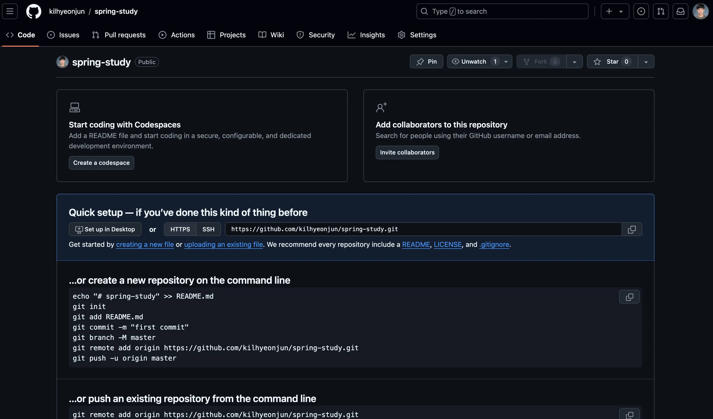
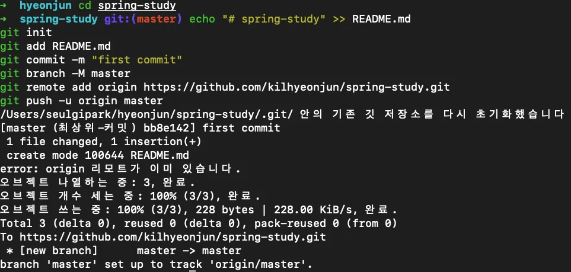
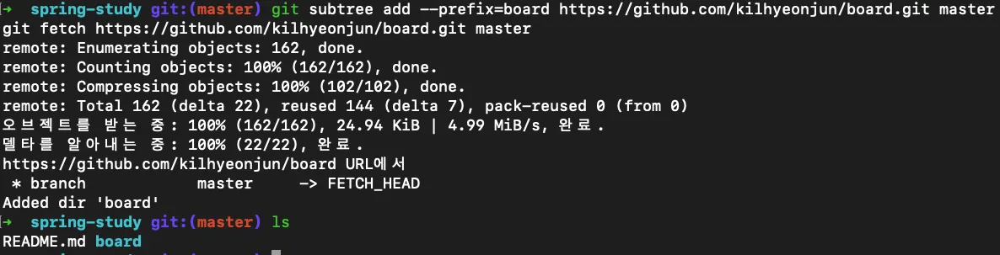
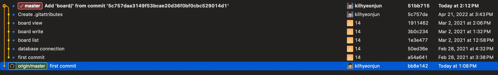
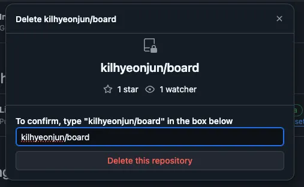

# GitHub Repository들 하나로 합치기 (subtree)

나 같은 경우에는 공부용으로 만든 Repository들이 많아 이걸 하나로 정리하고 싶었다.

## 1\. 준비 단계

-   병합할 모든 Repository의 목록을 만든다.
-   각 Repository의 구조를 검토하고 충돌 가능성을 확인한다.
-   중요한 데이터는 백업해둔다.

## 2\. 새 Repository 생성


GitHub에서 새로운 빈 Repository를 생성한다.



이 Repository가 모든 프로젝트를 통합할 대상이 된다.

## 3\. 새 Repository 클론

새로 생성한 Repository를 로컬 시스템에 클론한다.

```crmsh
git clone <Repository url>
cd <프로젝트 폴더 위치>
```

Repository를 생성때 Readme 생성에 체크를 하지않았다면 `first commit`이 존재하지 않을 것이다.
아래의 명령어를 통해 first commit을 해주자!

```mipsasm
echo "# spring-study" >> README.md
git init
git add README.md
git commit -m "first commit"
git branch -M master
git remote add origin <Repository url>
git push -u origin master
```



## 4\. Repository 합치기

```
git subtree add --prefix=<기존레포지토리명> <기존레포지토리주소> <기존메인브랜치명>
```



성공적으로 subtree가 추가되었다.



git tree를 봤을 때 해당 레포가 추가된걸 볼 수 있다.

## 5\. 원격 저장소로 push

메인 브랜치명이 master일경우 `HEAD:master`로 바꿔주면 된다.

```maxima
git push origin HEAD:main
```

## 6\. 기존 Repository 삭제

이제 불필요해진 기존 repository를 삭제하면 된다.


