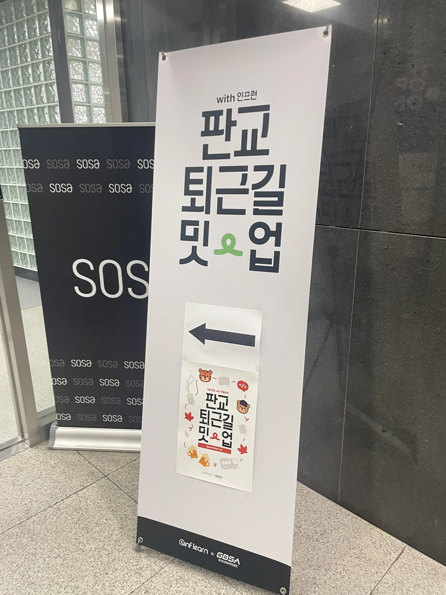
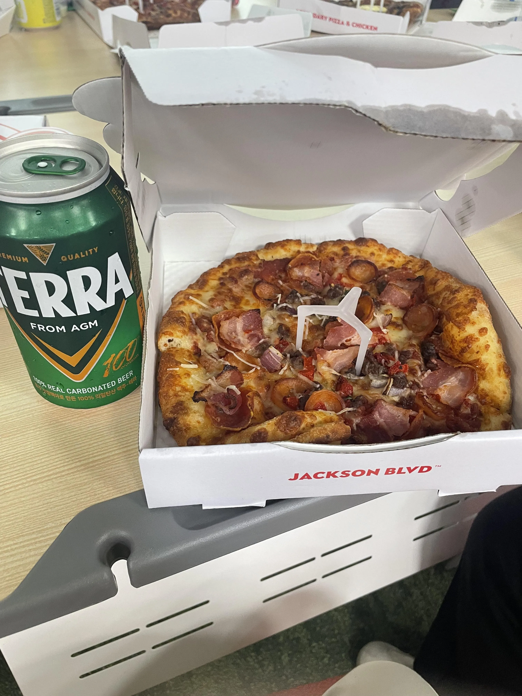
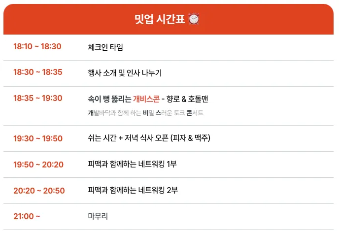

# 판교 퇴근길 밋업 - 가을 특집 후기

인프런에선 판교 퇴근 밋업을 진행하고 있다.
그중에 나는 가을 특집 with 개밟바닥 밋업에 당첨되어 참가하게 되었다.

## 밋업 소개

이번 테크 밋업의 주제는 속이 뻥 뚫리는 `개비스콘` 개발바닥과 함께하는 비밀스러운 토크 콘서트의 줄임말이다.
개발바닥은 인프런의 CTO인 향로(이동욱)님과 반려생활의 CTO인 호돌맨(이주현)님의 개발 관련 유투브 채널이다.
이력서 첨삭등의 강의가 많아 취준생일 때 많이 봤던 것 같다. (사실 지금도 이직을 준비하면서 이력서를 쓰고 있어 봐야되는데 시간이 안난다...)

## 밋업 후기

밋업은 사진과 진행되지만 상황에 따라 유연하게 진행되었다.
개비스콘시간 때 신청자 분들의 질문을 10개를 받아 QnA시간을 가졌다.
유투브를 하셔서 그런지 입담이 좋으셨고 그래서 지루하지 않고 매우 재밌었다.
그리고 섬세하게 대답을 해주셔서 너무좋았지만 생각보다 시간이 부족해서 6개 정도의 질문만 QnA 진행되어서 조금 아쉬웠다.

개비스콘 시간이 끝난 후 본격적인 저녁식사와 네트워킹 시간이 있었다.
저녁은 피자와 맥주(논알콜도 있어요)가 준비되었고 네트워킹 시간에는 포지션별로(BE, FE 등) 사전에 조가 편성되어 있었다.
그리고 각 조 별로 향로님 또는 호돌맨님과 이야기할 수 있는 시간도 있었다.
나는 BE포지션으로 다양한 연차 및 회사의 분들과 이야기를 나눌 수 있어서 좋았다.
각자의 고민들도 들어보고 각자의 생각을 나눌 수 있었다.
그리고 가장 신기했던 건 내가 지금 항해 플러스 백엔드 6기과정을 진행하고 있는데 5기 수료생 분이 같은 네트워킹 조에 있어서 신기했다.

## 마치며

이번 밋업을 통해 개발바닥님들의 가치관을 조금은 알 수 있었던 것 같고 나 역시도 생각의 변화가 생겼다.
가장 크게 느낀 점은 개발 문화보다 조직 문화가 좋은 회사에서 일하고 싶다는 생각이 들었다.
네트워킹을 하면서 다양한 분야에서 일하는 분들의 이야기를 듣고 내가 알지 못한 인사이트를 얻을 수 있는 것도 너무 좋았다.
그래서 인프런 퇴근길 밋업이 나오는 대로 신청을 해볼 생각이다.
