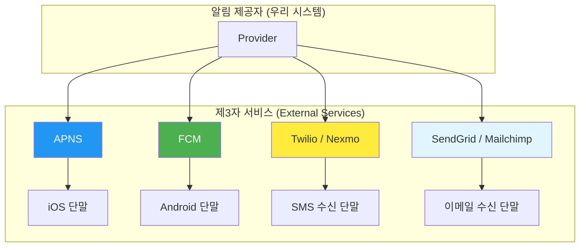
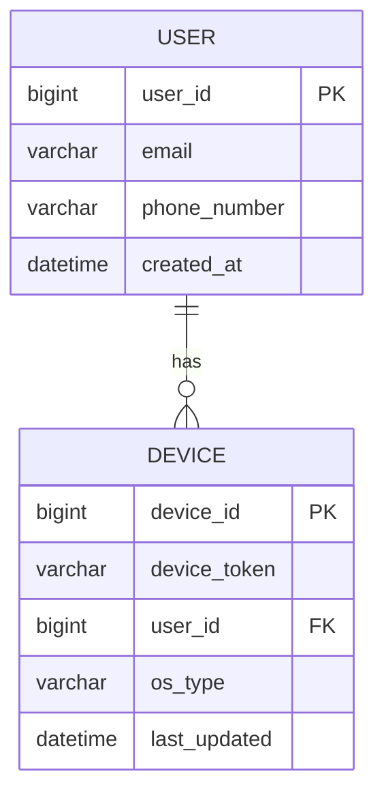
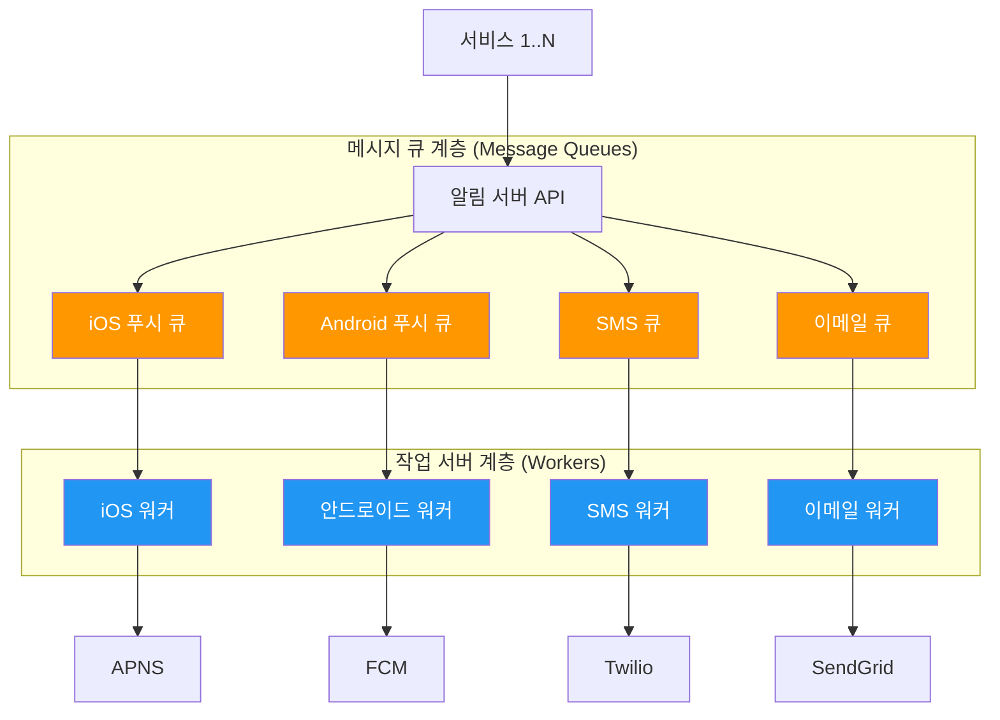
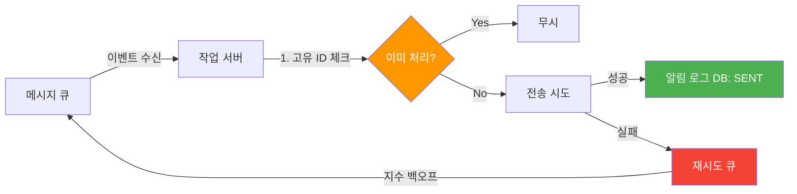
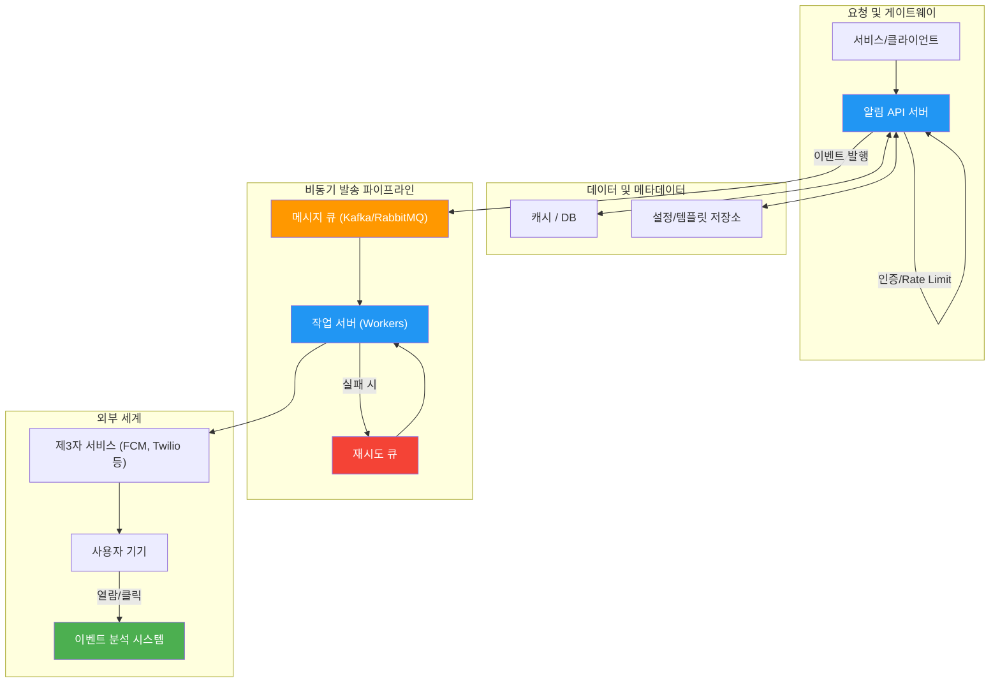

## 시작하며

가면사배 스터디도 어느덧 6주차에 접어들었습니다! 지난 9장 "웹 크롤러 설계"에서는 인터넷의 방대한 데이터를 수집하는 엔진의 내부를 들여다봤었는데요. 그때도 규모의 경제에 감탄했지만, 이번 10장 **알림 시스템 설계**는 또 다른 의미로 "대규모"의 무게감을 느끼게 해준 챕터였습니다.

사실 개발자로서 알림은 공기 같은 존재잖아요? "회원가입 완료되었습니다", "누군가 내 글에 댓글을 달았습니다" 같은 메시지를 보내는 건 우리에게 너무나 익숙한 작업입니다. 저도 스터디 준비 전에는 "그냥 FCM(Firebase Cloud Messaging) 라이브러리 가져다가 API 쏘면 끝나는 거 아냐?"라고 가볍게 생각했었습니다. 그런데 하루에 수천만 건의 메시지를 보내야 하는 상황을 가정해보니, 그 "그냥"이라는 단어가 얼마나 무책임한 것이었는지 깨닫게 되더라고요.

스터디 동기들과 토론하면서 가장 많이 나왔던 이야기가 "우리가 만드는 서비스가 대박이 나서 초당 수천 명에게 푸시를 쏴야 한다면, 우리 서버는 버틸 수 있을까?"였습니다. 단순히 코드를 짜는 것과 시스템을 설계하는 것은 차원이 다른 문제라는 걸 이번 장을 통해 다시금 배웠습니다. 이번 포스트에서는 그런 고민들에 대한 해답을 찾아가는 과정을 정리해보려고 합니다.

## 시스템 요구사항과 설계 범위 확정하기

설계의 첫걸음은 언제나 범위를 좁히는 것입니다. "모든 걸 다 하는 시스템"은 결국 "아무것도 제대로 못 하는 시스템"이 되기 십상이니까요.

면접 상황을 가정하고 우리가 설계할 알림 시스템의 요구사항을 명확히 해봤습니다.

### 지원 유형 및 환경

가장 먼저 어떤 채널을 지원할지 정해야 합니다. 요즘 시대에 하나만 지원해서는 살아남기 힘들죠.

| 채널 | 용도 | 비고 |
|------|------|------|
| **모바일 푸시 알림** | 실시간 업데이트, 리마인더 | iOS(APNS), Android(FCM) 모두 지원 |
| **문자 메시지(SMS)** | 본인 인증, 중요 공지 | 발송당 비용 발생 (비쌈) |
| **이메일** | 뉴스레터, 긴 공지 사항 | 스팸함 분류 주의 필요 |
| **웹 푸시** | 브라우저 알림 | 별도 구독 동의 필요 |

단말기도 스마트폰뿐만 아니라 태블릿, 그리고 웹 브라우저까지 커버하는 것을 목표로 합니다.

### 비기능적 요구사항 (성능과 안정성)
여기서부터가 진짜 엔지니어링의 영역입니다.
- **실시간성**: 알림은 가능한 한 빨리 전달되어야 합니다. 다만, 시스템에 너무 과한 부하가 걸린다면 몇 초 정도의 지연은 허용하는 **연성 실시간(Soft Real-time)** 방식을 채택하기로 했습니다. "Hard Real-time"이 아니라는 점이 설계의 복잡도를 현실적으로 낮춰주는 신의 한 수더라고요.
- **확장성**: 아래 표처럼 채널별로 상당한 트래픽을 감당할 수 있어야 합니다.
- **안정성**: 어떤 이유에서든 알림이 소실되어서는 안 됩니다. 또한, 같은 알림이 사용자에게 여러 번 가는 '중복 발송'도 최소화해야 합니다.

| 채널 | 일일 발송량 | 초당 환산 (피크 기준) |
|------|-----------|---------------------|
| 모바일 푸시 | 1,000만 건 | ~500 TPS |
| SMS | 100만 건 | ~50 TPS |
| 이메일 | 500만 건 | ~250 TPS |

이 요구사항들을 보면서 "1,000만 건"이라는 숫자를 가만히 곱씹어 봤습니다. 초당으로 환산하면 수백 건에서 수천 건이 될 텐데, DB 트랜잭션 하나하나가 얼마나 소중한 자원인지 다시금 느끼게 되더라고요. 특히 읽기 연산보다 쓰기 연산이 훨씬 비싼 알림 로그 시스템에서 이 수치를 견뎌내야 한다는 게 큰 도전 과제처럼 느껴졌습니다.

여기서 주목할 포인트는 **연성 실시간(Soft Real-time)**이라는 설계 결정입니다. "Hard Real-time"이었다면 알림 하나하나를 밀리초 단위로 보장해야 하니 아키텍처가 훨씬 복잡해졌을 텐데, 몇 초 정도의 지연을 허용함으로써 메시지 큐 기반의 비동기 구조를 도입할 수 있게 된 거죠. 이 한 가지 결정이 전체 설계의 복잡도를 현실적으로 낮춰주는 신의 한 수였다고 생각합니다.

## 개략적 설계안: 알림 유형별 지원과 아키텍처

알림을 보내는 일은 우리 서버가 직접 하는 게 아닙니다. 각 분야의 전문가(제3자 서비스)에게 "이 메시지 좀 전달해줘!"라고 부탁하는 과정에 가깝습니다.

### 알림 유형별 전송 흐름

우리가 주로 사용하게 될 외부 서비스들을 정리해보면 이렇습니다.



각 채널의 특성을 비교해보면 우리가 왜 이런 구조를 가져가야 하는지 명확해집니다.

| 채널 | 제공 서비스 | 주요 특징 | 고려사항 |
| :--- | :--- | :--- | :--- |
| **iOS 푸시** | APNS | 애플 공식 채널 | 기기 토큰 관리 필수 |
| **안드로이드** | FCM | 구글 공식 채널 | 중국 내 사용 불가 (별도 서비스 필요) |
| **SMS** | Twilio, Nexmo | 높은 도달률 | 발송당 비용 발생 (비쌈) |
| **이메일** | SendGrid | 대량 발송 최적화 | 스팸함 분류 주의 필요 |

이 표를 정리하면서 느낀 점은, 알림 시스템이 단순히 기술적인 문제를 넘어 **비용과 지역적 특성**까지 고려해야 하는 복합적인 문제라는 것이었습니다. 특히 중국 시장을 타겟팅한다면 FCM 대신 JPush 같은 로컬 서비스를 붙여야 한다는 점은 실무에서 정말 놓치기 쉬운 포인트인 것 같아요. "왜 우리 알림이 중국 사용자에게는 안 갈까?"라는 문제를 아키텍처 단계에서 미리 예방할 수 있다는 게 설계의 묘미 아닐까요?

> **비용 참고**: SMS는 건당 수 원~수십 원의 비용이 발생하는 반면, 푸시 알림은 무료에 가깝습니다. 일일 100만 건의 SMS만 해도 월 수천만 원의 비용이 되니, 채널 선택 전략이 곧 비용 전략이 됩니다. 반드시 필요한 경우(본인 인증, 결제 알림 등)에만 SMS를 사용하고, 나머지는 푸시로 대체하는 것이 현실적인 접근법이에요.

### 연락처 수집과 DB 설계

알림을 보낼 대상이 누구인지, 그 사람의 기기가 무엇인지 알아야겠죠? 사용자가 앱을 처음 설치하고 로그인할 때 우리는 이 정보를 수집해야 합니다.



여기서 중요한 건 한 명의 사용자가 여러 대의 기기를 가질 수 있다는 점입니다. 아이폰과 아이패드를 동시에 쓰는 사용자를 위해 **1:N 관계**로 설계했습니다.

처음에는 "그냥 User 테이블에 `last_device_token` 하나만 두면 안 되나?"라고 생각했었는데, 동기들과 토론하다 보니 "그러면 멀티 디바이스 환경에서 알림이 누락될 수 있겠네요"라고 바로 수긍하게 되더라고요.

또한, 기기 토큰은 만료되거나 변경될 수 있기 때문에 `last_updated` 필드를 두어 주기적으로 정보를 갱신하고, 만약 오랫동안 업데이트되지 않은 토큰은 '죽은 토큰'으로 간주해 정기적으로 청소해주는 배치 작업도 필요하겠다는 생각이 들었습니다.

### 초기 설계의 함정: 단일 서버 방식

처음 설계를 시작할 때 "서버 한 대에서 다 처리하면 안 되나?"라는 유혹에 빠지기 쉽습니다. 하지만 이 방식에는 치명적인 문제가 세 가지 있습니다.

1. **단일 장애점(SPOF)**: 그 서버가 다운되면 알림 시스템 전체가 멈춥니다.
2. **규모 확장성 한계**: DB, 캐시, 워커 등 특정 컴포넌트만 개별적으로 확장하기 어렵습니다.
3. **성능 병목**: 외부 서비스 응답 대기 시간이 길어지면 뒤에 대기 중인 모든 알림이 줄줄이 밀립니다.

이 세 가지 문제를 한 번에 해결해주는 것이 바로 메시지 큐 기반의 비동기 아키텍처입니다.

## 메시지 큐를 활용한 비동기 아키텍처

서버 한 대가 알림 생성부터 실제 전송까지 다 처리한다면 어떻게 될까요? 아마 이메일 발송 서비스가 느려지는 순간, 뒤에 대기 중인 푸시 알림과 SMS까지 줄줄이 소시지처럼 지연될 겁니다. 최악의 경우 서버가 뻗어버리는 **SPOF(Single Point of Failure)** 문제가 발생하죠.

이를 해결하기 위해 시스템의 각 컴포넌트를 **메시지 큐**로 느슨하게 연결했습니다.



이렇게 구성하면 얻는 이점이 정말 많습니다.

1. **결합도 감소**: 알림 API 서버는 큐에 메시지를 던지기만 하면 끝입니다. 실제 발송이 얼마나 걸리든 상관없죠.
2. **독립적 확장**: 블랙프라이데이 같은 이벤트로 이메일 발송량이 폭증한다면? 이메일 워커만 수십 대 늘리면 됩니다. 다른 채널에는 아무런 영향이 없어요.
3. **내결함성**: 외부 SMS 업체가 잠시 점검 중이라도, 메시지는 큐에 안전하게 보관됩니다. 점검이 끝나면 워커가 다시 꺼내서 보내면 되니까요.
4. **장애 격리**: 채널별로 큐를 분리했기 때문에, FCM에 장애가 나도 이메일과 SMS는 정상적으로 발송됩니다. 하나의 큐에 모든 채널을 섞으면 한 곳의 장애가 전체를 마비시킬 수 있어요.

여기서 한 가지 더 짚고 넘어갈 점은 **알림 서버(API)의 역할**입니다. 이 서버는 의도적으로 "가볍게" 유지해야 합니다. 사용자 정보를 조회하고, 설정을 체크하고, 메시지를 큐에 넣는 것까지만 담당합니다. 무거운 작업(실제 발송, 재시도, 로깅)은 전부 워커에게 위임하죠. 이렇게 하면 API 서버가 수평 확장하기 훨씬 쉬워지고, 응답 시간도 빨라집니다.

이 부분을 읽으면서 "우리 서비스에서도 이벤트 기간에 트래픽이 튈 때가 있는데, 이런 비동기 구조가 없다면 API 서버 자체가 뻗어버렸을 거예요"라는 생각이 들었습니다. 큐가 일종의 방패 역할을 해주는 셈이죠.

스터디에서 "그러면 메시지 브로커로 뭘 쓰는 게 좋아?"라는 질문이 나왔는데, 각각의 특성이 좀 다릅니다.

| 브로커 | 장점 | 단점 | 적합한 경우 |
|--------|------|------|-------------|
| **RabbitMQ** | 메시지 라우팅이 유연, 재시도 로직 편리 | 대규모 처리량에서 한계 | 채널별 복잡한 라우팅이 필요할 때 |
| **Kafka** | 초고속 처리량, 메시지 영속성 보장 | 운영 복잡도 높음 | 일일 수천만 건 이상 처리할 때 |
| **SQS** | 관리형 서비스로 운영 부담 적음 | 순서 보장 어려움 | AWS 인프라 위에서 빠르게 구축할 때 |

개인적으로는 Kafka 같은 고성능 메시지 브로커가 대규모 알림 시스템에는 더 적합할 것 같다는 생각이 들었습니다. 메시지를 디스크에 영속적으로 저장하니 장애 복구도 수월하고, 컨슈머 그룹으로 워커를 묶으면 수평 확장도 자연스러워지니까요.

## 상세 설계: 안정성과 성능의 디테일

이제 뼈대는 완성됐습니다. 하지만 "대규모" 시스템이라면 구석구석 숨어있는 예외 상황들을 처리해야 합니다. 단순히 기능이 돌아가는 것을 넘어, 장애 상황에서도 시스템을 지키는 힘은 이런 디테일에서 나오기 때문입니다.

### 알림의 안정성(Reliability) 확보

"알림이 안 갔어요"라는 컴플레인은 개발자에게 가장 뼈아픈 소리입니다. 이를 방지하기 위한 두 가지 핵심 전략을 세웠습니다.

- **데이터 소실 방지 (Log DB)**: 워커가 메시지를 큐에서 꺼내자마자 삭제하는 게 아니라, 실제 전송이 완료될 때까지 **알림 로그 DB**에 상태를 기록합니다. 일단 적어두면 나중에 서버가 죽어도 무엇을 못 보냈는지 알 수 있으니까요. 이 로그는 나중에 고객센터 대응용으로도 요긴하게 쓰일 것 같습니다.
- **중복 전송 방지 (Idempotency)**: 분산 시스템에서 '정확히 한 번(Exactly-once delivery)'은 거의 불가능의 영역입니다. 네트워크 타임아웃으로 재시도를 하는 순간 중복의 위험이 생기니까요. 대신 **고유 ID**를 사용해 멱등성을 보장합니다. 같은 ID의 알림이 또 오면 "어, 이거 아까 보냈던 거네?" 하고 버리는 것이죠.

아래 그림처럼 알림 로그 DB가 데이터 소실을 막는 안전망 역할을 하고, 고유 ID 체크가 중복을 막는 필터 역할을 합니다.



### 운영 효율을 높이는 추가 컴포넌트

단순히 쏘는 것 외에 운영팀과 사용자를 위해 필요한 기능들입니다.

1. **알림 템플릿**: 매번 "OO님, 반갑습니다!"라는 문구를 하드코딩할 순 없죠. 템플릿 저장소를 두고 가변적인 데이터만 치환해서 사용합니다. 예를 들어 `안녕하세요, [사용자명]님! [상품명]이 재입고되었습니다.`처럼 고정 문구와 변수를 분리하면, 마케팅팀에서 문구를 수정하고 싶을 때 개발자 도움 없이도 직접 고칠 수 있게 됩니다.
2. **사용자 설정 (Opt-out)**: 사용자가 특정 알림을 거부했다면 절대 보내지 말아야 합니다. 발송 직전에 반드시 설정 저장소를 체크하는 로직이 들어갑니다. 이걸 무시하면 앱 삭제의 지름길이 됩니다.
3. **전송률 제한 (Rate Limiting)**: 한 사람에게 1분에 100개의 알림을 보내면 그건 스팸입니다. 시스템 차원에서 사용자당 발송 횟수를 제한해야 합니다.
4. **재시도 전략**: 전송 실패 시 바로 포기하지 않고, 시간을 두고 다시 시도하는 **지수 백오프(Exponential Backoff)**를 적용합니다. 1초 → 2초 → 4초 → 8초... 이렇게 간격을 늘려가면서 재시도하면 외부 서비스가 복구될 시간을 벌어주면서도 무의미한 요청으로 부하를 주지 않습니다.
5. **보안**: `appKey`, `appSecret` 등을 활용한 API 인증을 통해 인가된 클라이언트만이 알림을 보낼 수 있도록 합니다. 반드시 즉시 전달해야 하는 알림이라면 스팸 공격에 무방비 상태가 되니까요.

워커의 내부 로직을 코드로 표현해보면 대략 이런 모습일 것 같아요.

```typescript
// Notification Worker Logic Example
async function handleNotificationTask(task: NotificationTask) {
  const { userId, notificationId, type, content } = task;

  try {
    // 1. 중복 발송 체크 (Idempotency)
    // Redis 같은 캐시 저장소를 활용해 빠르게 확인합니다.
    const isDuplicate = await cache.get(`sent:${notificationId}`);
    if (isDuplicate) {
      console.log(`[Skip] Duplicate notification detected: ${notificationId}`);
      return;
    }

    // 2. 사용자 수신 거부 설정 확인
    // 발송 직전에 최신 설정을 확인하여 사용자의 의사를 존중합니다.
    const userSettings = await db.userSettings.findUnique({ where: { userId } });
    if (!userSettings.isAllowed(type)) {
      console.log(`[Skip] User opted out from ${type} notifications: ${userId}`);
      return;
    }

    // 3. 템플릿 적용 및 최종 메시지 생성
    const message = templateEngine.render(content, { userName: task.userName });

    // 4. 외부 공급자(APNS, FCM 등)를 통한 실제 발송
    const response = await externalProvider.send(type, message);

    // 5. 성공 시 결과 저장 및 캐싱
    if (response.success) {
      await db.notificationLog.update({ where: { notificationId }, data: { status: 'SENT' } });
      await cache.set(`sent:${notificationId}`, 'true', { ttl: 86400 }); // 24시간 동안 중복 방지
    } else {
      throw new Error('External provider returned failure');
    }
  } catch (error) {
    // 6. 실패 시 재시도 큐로 이동
    // 지수 백오프 전략을 사용하여 재시도 간격을 늘립니다.
    const nextDelay = calculateNextDelay(task.retryCount);
    await retryQueue.push(task, { delay: nextDelay });
    console.error(`[Error] Failed to send notification ${notificationId}. Retrying in ${nextDelay}ms`);
  }
}
```

이 코드를 작성하면서 "아, 실무에서도 `try-catch`로 감싸서 실패 케이스를 큐로 다시 던지는 패턴을 정말 많이 쓰는데, 알림 시스템은 특히 외부 API 의존성이 높아서 이런 예외 처리가 설계의 핵심이겠구나"라는 걸 다시금 절감했습니다.

여기서 주의할 점이 하나 있는데, 타임아웃 처리입니다. 외부 서비스가 응답을 안 주고 버티면 워커 스레드가 하나씩 점유당해서 결국 전체 워커 풀이 좀비처럼 변해갈 수 있거든요. 그래서 외부 호출에는 반드시 **커넥션 타임아웃**과 **읽기 타임아웃**을 설정하고, 타임아웃이 발생하면 즉시 포기하고 재시도 큐로 넘기는 게 안전합니다.

또 하나 실무에서 놓치기 쉬운 건 **Dead Letter Queue(DLQ)**입니다. 재시도를 3~5회 했는데도 계속 실패하는 메시지는 무한 루프에 빠지지 않도록 별도의 DLQ로 보내고, 나중에 수동으로 원인을 분석하는 프로세스가 필요합니다.

## 최종 설계안: 전체 시스템의 조감도

지금까지 논의한 모든 컴포넌트를 하나로 합쳐보겠습니다. 단순한 우체통 같았던 시스템이 꽤 정교한 공장처럼 변했습니다.



이 설계도에서 특히 인상 깊었던 건 마지막에 위치한 **이벤트 분석 시스템**이었습니다. 알림이 "전달"되는 것에서 끝나는 게 아니라, 사용자가 그걸 "읽었는지", "클릭했는지"까지 다시 데이터로 돌아오는 순환 구조를 보면서, 시스템 설계가 단순히 기능을 구현하는 것을 넘어 비즈니스 가치를 창출하는 과정이라는 점을 깊이 이해하게 되었습니다. 개발자로서는 "잘 가기만 하면 장땡"이라고 생각하기 쉬운데, 비즈니스 관점에서는 "그래서 이 알림이 실제 구매로 이어졌나?"가 훨씬 중요할 때가 많으니까요.

추적해야 할 핵심 지표들을 정리하면 이렇습니다.

| 지표 | 설명 | 활용 |
|------|------|------|
| **도달률(Delivery Rate)** | 실제로 기기까지 전달된 비율 | 죽은 토큰 정리 타이밍 판단 |
| **확인률(Open Rate)** | 알림을 열어본 비율 | 문구/시간대 최적화 |
| **클릭률(CTR)** | 알림 내 링크를 클릭한 비율 | 콘텐츠 매력도 측정 |
| **전환율(Conversion Rate)** | 알림 → 실제 행동(구매 등) 비율 | 비즈니스 기여도 정량화 |
| **큐 깊이(Queue Depth)** | 큐에 쌓인 미처리 메시지 수 | 시스템 병목 조기 감지 |

## Do's and Don'ts

| | Do's (이렇게 하자) | Don'ts (이건 피하자) |
|---|---|---|
| 아키텍처 | 채널별 큐를 분리해서 장애를 격리 | 하나의 큐에 모든 채널 메시지를 섞기 |
| 안정성 | 전송 전 알림 로그 DB에 먼저 기록 | 큐에서 꺼내자마자 로그 없이 바로 전송 |
| 중복 방지 | 고유 ID 기반 멱등성 체크 | '정확히 한 번'을 시스템으로 보장하려 집착 |
| 재시도 | 지수 백오프로 간격을 점점 늘리기 | 실패 즉시 무한 재시도 |
| 사용자 | 발송 직전에 opt-out 설정 확인 | 설정 무시하고 일괄 발송 |
| 모니터링 | 큐 깊이, 도달률, CTR 실시간 추적 | 발송 후 결과를 확인하지 않기 |

## 실무에 적용할 수 있는 인사이트들

이번 10장을 정리하며 얻은 핵심 인사이트들을 공유합니다.

### 1. 외부 시스템은 절대 믿지 마라
APNS나 FCM 같은 거대 서비스도 언제든 느려지거나 장애가 날 수 있습니다. 이들과의 통신은 반드시 비동기로 처리하고, 타임아웃과 서킷 브레이커 같은 방어 기제를 두는 것이 우리 시스템을 지키는 길입니다.

실제로 저희 서비스에서도 외부 SMS 업체가 점검에 들어가면서 발송이 밀린 적이 있었는데, 메시지 큐가 없었다면 API 서버 자체가 타임아웃으로 뻗었을 겁니다. 큐가 버퍼 역할을 해줘서 점검이 끝난 후 자연스럽게 소화된 경험이 있어요.

### 2. '정확히 한 번'의 환상 버리기
분산 시스템에서 네트워크 지연이나 재시도로 인해 중복은 언제든 발생할 수 있습니다. 시스템을 극도로 복잡하게 만들어 '딱 한 번'을 보장하려 애쓰기보다, 중복이 발생했을 때 안전하게 처리할 수 있는 **멱등한 로직**을 짜는 것이 훨씬 효율적이고 견고한 전략입니다. 고유 ID만 잘 관리해도 99.9%의 문제는 해결되더라고요.

### 3. 모니터링은 필수, 메트릭은 생명
큐에 쌓인 메시지 수(Queue Depth)는 시스템의 건강 상태를 보여주는 가장 정직한 지표입니다. 이 수치가 급증한다면 어딘가 병목이 생겼다는 뜻이죠. 워커를 증설해야 할지, 외부 서비스에 문제가 생긴 건지 즉각 판단할 수 있는 대시보드는 필수입니다.

### 4. 사용자 경험(UX)과 기술의 조화
아무리 멋진 아키텍처라도 사용자가 알림을 스팸으로 느껴 앱을 지운다면 의미가 없습니다. 전송률 제한과 정교한 설정 기능은 기술적인 도전만큼이나 중요한 '사용자에 대한 배려'라는 점을 잊지 말아야겠습니다.

### 5. 비용 최적화: 동적 채널 선택
SMS는 건당 비용이 발생하기 때문에, 가능하다면 무료인 푸시 알림을 먼저 시도하고 실패할 때만 SMS로 폴백하는 전략이 효과적입니다. 카카오 알림톡처럼 중간 가격대의 채널을 두는 것도 좋은 방법이고요. 이런 **동적 채널 선택** 로직을 알림 서버 단에 구현하면 월 단위로 상당한 비용 절감이 가능합니다.

## 마무리

알림 시스템 설계를 공부하면서 느낀 점은 "단순해 보이는 것도 규모가 커지면 복잡한 예술이 된다"는 사실을 새삼 실감했습니다. 메시지 큐를 통한 비동기 처리, 컴포넌트 간의 느슨한 결합, 그리고 예외 상황에 대비한 꼼꼼한 설계까지... 대규모 시스템이 갖춰야 할 미덕들을 골고루 배울 수 있는 시간이었습니다.

특히 "안정성"이라는 키워드를 위해 얼마나 많은 보이지 않는 레이어들이 쌓여있는지를 보며, 제가 짜는 코드 한 줄의 무게를 다시 생각하게 되었습니다. "이 알림 하나가 사용자에게는 소중한 정보일 수 있다"는 마음가짐으로 시스템을 대해야겠다는 다짐도 해봅니다.

스터디에서 나온 결론 중 가장 기억에 남는 건, 알림 시스템의 설계 핵심은 결국 **"남의 서비스가 죽었다고 우리 서비스까지 죽게 내버려 두지 않는 것"**이라는 점이었습니다. 메시지 큐가 방패 역할을 하고, 알림 로그가 안전망 역할을 하고, 지수 백오프가 완충 역할을 하는 이 삼중 방어가 대규모 알림 시스템의 뼈대라는 걸 확실히 배웠습니다.

다음 포스트에서는 11장 **"뉴스 피드 시스템 설계"**를 다룰 예정입니다. 페이스북이나 인스타그램의 피드가 어떻게 실시간으로 구성되고 배달되는지, 그 거대한 흐름의 비밀을 함께 파헤쳐보겠습니다.

### 🏗️ 아키텍처 및 확장성에 대한 질문

- 현재 아키텍처에서 만약 1초 미만의 지연 시간(Hard Real-time)이 반드시 즉시 전달해야 하는 알림이라면, 어떤 부분을 수정해야 할까요?
- 대규모 알림 시스템에서 메시지 브로커로 Kafka와 RabbitMQ 중 어느 것이 더 유리할까요? 각자의 트레이드오프는 무엇일까요?
- 워커(Worker) 노드의 오토스케일링 기준을 잡을 때, CPU 사용률 외에 어떤 지표를 활용하는 것이 가장 효과적일까요?

### ⚡ 안정성과 데이터 처리에 대한 질문

- 알림의 '순서 보장'이 필요한 경우(예: 은행 입출금 알림)와 그렇지 않은 경우, 설계상 어떤 차이가 생길까요?
- 중복 전송 방지를 위한 고유 ID를 생성할 때, 분산 환경에서 충돌 없이 빠르게 생성하는 가장 좋은 방법은 무엇일까요?
- 외부 공급자(Provider)의 대규모 장애 상황에서 '우아한 성능 저하(Graceful Degradation)'를 구현하기 위한 시나리오를 어떻게 짤 수 있을까요?

### 🎯 비즈니스 로직 및 UX에 대한 질문

- 사용자 피로도를 줄이기 위해 '알림 요약(Summary Notification)' 기능을 도입한다면 아키텍처의 어느 지점에 구현하는 게 좋을까요?
- 비용 최적화를 위해 SMS 대신 카카오 알림톡이나 푸시를 먼저 쏘는 '동적 채널 선택' 로직은 어떻게 설계하면 좋을까요?
- 특정 알림의 클릭률(CTR)을 실시간으로 A/B 테스트하고 싶다면 현재 설계안에 어떤 컴포넌트를 추가해야 할까요?

댓글로 공유해주시면 함께 배워나갈 수 있을 것 같습니다!
