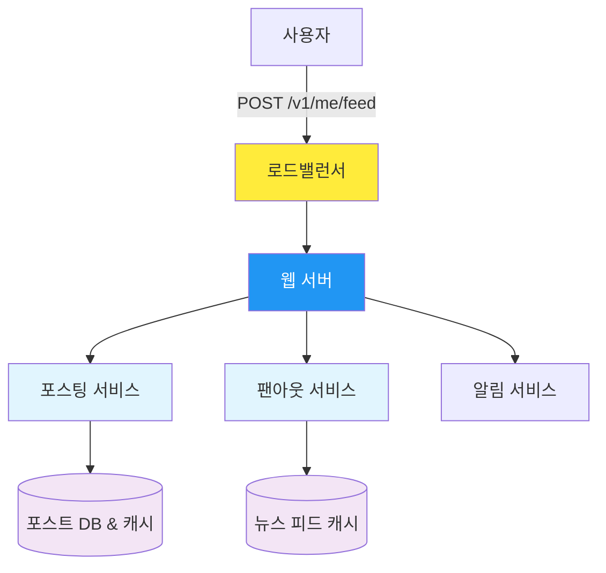
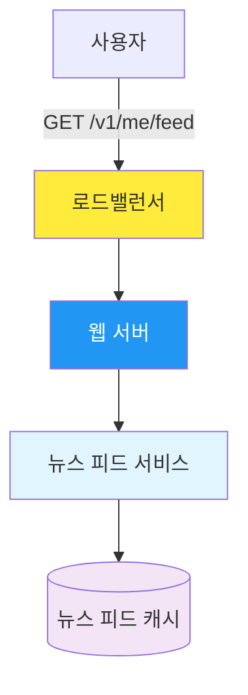
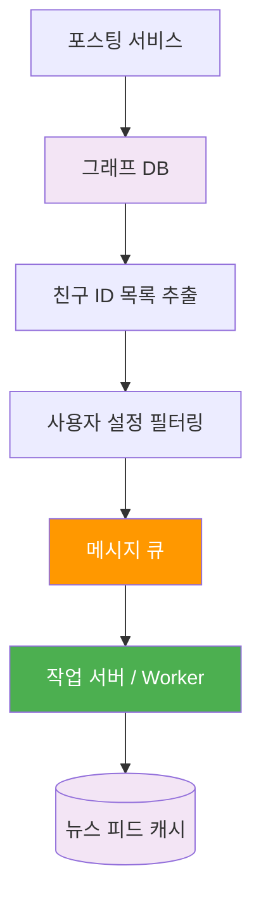
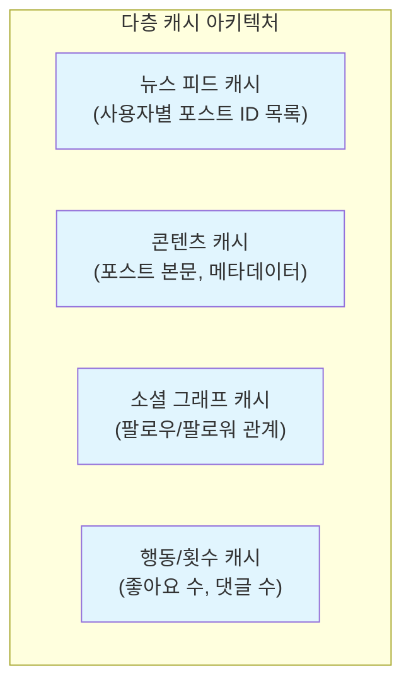

## 시작하며

가면사배 스터디 벌써 6주차네요! 지난 10장에서 **알림 시스템 설계**를 다루면서 사용자에게 정보를 실시간으로 푸시하는 방식을 배웠다면, 이번 11장에서는 소셜 미디어의 진정한 심장이라고 할 수 있는 **뉴스 피드 시스템**에 대해 다룹니다.

뉴스 피드를 '심장'에 비유한 이유는 명확합니다. 사용자가 서비스에 머무는 시간의 대부분을 차지하는 핵심 공간이자, 신선한 데이터(혈액)가 끊임없이 순환해야 하는 곳이기 때문이죠. 우리가 눈을 뜨자마자 페이스북이나 인스타그램을 켜면 친구들의 근황이 실시간으로 올라오는 그 화면, 그 뒤에서 어떤 거대한 엔진이 돌아가고 있을까요?

개발자 관점에서 "이 화면 하나를 위해 뒤에서 어떤 거대한 엔진이 돌아가고 있을까?"를 고민해 보니 생각보다 고려해야 할 설계 요소가 정말 많더라고요. 단순히 "내가 팔로우하는 사람들 글을 긁어오면 끝 아닌가?"라고 생각하기 쉽지만, 전 세계 수억 명의 사용자가 동시에 글을 올리고 읽는 상황이라면 이야기가 완전히 달라집니다. 

특히 이번 장을 공부하면서 **팬아웃(Fan-out)**이라는 생소한 용어와 마주했을 때, 그리고 그 뒤에 숨겨진 복잡한 트레이드오프를 이해했을 때 느꼈던 그 짜릿함이 아직도 생생하네요. 시스템 설계 면접에서 가장 단골로 나오는 주제이기도 해서, 이번 기회에 제대로 파헤쳐 보려고 합니다.

참고로 이번 장은 10장 알림 시스템과 연결 고리가 많습니다. 알림 시스템에서 배운 메시지 큐 기반 비동기 처리, 워커 패턴이 뉴스 피드의 팬아웃에서도 거의 동일하게 적용되거든요. 전 장에서 기초를 잘 다져놔서 이번 장은 좀 더 수월하게 이해할 수 있었습니다.

스터디원들과 토론하면서 가장 뜨거웠던 주제는 팔로워가 수억 명인 유명인(Celebrity)의 포스팅을 어떻게 처리하느냐였습니다. 생각해보세요. 팔로워 1억 명인 연예인이 글 하나를 올리면, Push 모델에서는 1억 개의 캐시를 갱신해야 합니다. 이게 몇 초 만에 끝날 리가 없잖아요? 이런 극단적인 상황에서의 해법이 이번 장의 하이라이트였습니다.

우리 서비스에 만약 엄청난 슈퍼스타가 가입한다면 서버가 버틸 수 있을지, 그 깊이 있는 내용들을 제가 이해한 언어로 하나씩 풀어보겠습니다.

## 1단계: 뉴스 피드 설계를 위한 요구사항 정의

모든 대규모 시스템 설계가 그렇듯, 뉴스 피드 역시 요구사항을 명확히 하는 것부터 시작해야 합니다. 뉴스 피드는 서비스마다 정책이 천차만별이거든요. 예를 들어 페이스북처럼 서로 친구 관계 기반인지, 아니면 트위터나 인스타그램처럼 한쪽만 팔로우하는 기반인지에 따라 데이터 구조가 달라질 수 있습니다.

이번 스터디에서 우리가 목표로 한 시스템의 핵심 요구사항들을 꼼꼼하게 정리해 봤습니다. 면접 상황이라면 이런 질문을 던지며 범위를 좁혀나가는 과정 자체가 실력으로 평가받는 지점이기도 하죠.

### 기능적 요구사항 (사용자에게 무엇을 제공할 것인가?)
- **피드 발행 (Publishing)**: 사용자가 새로운 포스트를 올리면 그 내용이 친구들의 뉴스 피드에 즉시(또는 아주 빠르게) 반영되어야 합니다.
- **피드 조회 (Retrieval)**: 사용자가 자신의 뉴스 피드 화면을 열었을 때, 본인이 팔로우하거나 친구를 맺은 사람들의 포스트가 **최신순(Reverse Chronological Order)**으로 보여야 합니다.
- **미디어 파일 지원**: 텍스트만 보여주는 건 옛날이야기죠. 이미지와 동영상 같은 무거운 미디어 파일도 끊김 없이 잘 보여야 합니다. 미디어 파일은 본문과 별도로 CDN에서 서빙하는 것이 기본이고, 피드 데이터에는 미디어 URL만 포함시킵니다.

### 비기능적 요구사항 (시스템이 어떤 품질을 갖춰야 하는가?)
- **초저지연(Low Latency)**: 피드를 새로고침했는데 로딩 스피너만 뱅글뱅글 돌아간다면 사용자는 금방 앱을 꺼버릴 겁니다. 읽기 성능이 시스템의 생명입니다.
- **높은 가용성(High Availability)**: 시스템 일부 노드에 장애가 생기더라도 사용자는 최소한 자신의 피드는 볼 수 있어야 합니다. 캐시, DB, 워커 모두 다중화가 필수입니다.
- **규모 확장성(Scalability)**: 일일 능동 사용자(DAU) 1,000만 명이라는 거대한 트래픽을 견뎌내야 합니다.
- **콘텐츠 유형**: 텍스트뿐 아니라 이미지, 비디오 등 무거운 미디어 파일도 지원해야 합니다.

DAU 1,000만 명이라는 숫자를 처음 봤을 때 "와, 우리 회사가 이 정도 사용자를 확보한다면 행복한 비명을 지르겠구나" 싶으면서도, 기술적으로는 아찔하더라고요. 한 사용자는 최대 5,000명의 친구를 가질 수 있고, 친구가 평균 500명이라고만 쳐도 한 사람이 글을 쓸 때마다 500개의 피드를 갱신해야 한다는 뜻이니까요. 단순한 RDBMS 조인 쿼리로는 1초도 버티지 못할 게 뻔해 보였습니다. 

간단히 규모를 추정해보면 이런 숫자가 나옵니다.

- DAU 1,000만 명 중 10%가 하루에 글 1개씩 올린다고 가정
- 글 100만 개 × 평균 친구 500명 = **하루 5억 건의 팬아웃 작업**
- 초당으로 환산하면 약 **6,000 TPS**

이 숫자만 봐도 단순한 동기 처리로는 절대 감당할 수 없다는 걸 알 수 있죠. 특히 '읽기'와 '쓰기'의 비율이 10:1 이상으로 읽기에 치중된 서비스의 특성상, 쓰기 부하를 어떻게 관리할지가 이번 설계의 핵심 과제였습니다.

### 설계의 시작: API 엔드포인트 정의
본격적인 설계에 앞서, 클라이언트와 서버가 주고받을 약속인 API를 정의해야 합니다. 뉴스 피드 시스템에서 가장 기본이 되는 두 가지 API는 다음과 같습니다. 이 엔드포인트들은 간단해 보이지만, 실제로는 인증 필터와 처리율 제한기를 거치게 됩니다.

- **피드 발행 API**: `POST /v1/me/feed`
  - 사용자가 새로운 포스트를 올릴 때 사용합니다.
  - Body에는 포스트의 내용(텍스트)이 들어갑니다.
  - 헤더에는 사용자 인증을 위한 토큰이 포함됩니다.
- **피드 조회 API**: `GET /v1/me/feed`
  - 사용자가 자신의 뉴스 피드를 가져올 때 사용합니다.
  - 보통 페이징 처리를 위한 파라미터가 추가됩니다.
  - 대규모 피드에서는 '커서(Cursor)' 기반 페이징이 성능 면에서 훨씬 유리하더라고요.

참고로 피드 조회 API에서 페이징 방식은 크게 **오프셋 기반**과 **커서 기반** 두 가지가 있는데, 대규모 피드에서는 커서 기반이 압도적으로 유리합니다.

- **오프셋 기반**: `?page=3&size=10` → 중간에 새 글이 추가되면 중복/누락 발생
- **커서 기반**: `?cursor=post_id_123&size=10` → 특정 포스트 이후의 글만 가져오니 일관성 보장

스터디에서 "왜 오프셋이 안 좋은 거야?"라는 질문이 나왔는데, 실시간으로 글이 올라오는 피드 특성상 페이지를 넘기는 동안 새 글이 추가되면 같은 글이 두 번 보이거나 아예 빠지는 문제가 생기기 때문입니다. 커서 방식이면 이런 문제가 원천적으로 없죠.

단순해 보이는 이 두 API가 뒤에서 얼마나 거대한 스케일의 인프라를 움직이게 되는지, 지금부터 하나씩 파헤쳐 보겠습니다.

## 뉴스 피드 시스템의 개략적 구조와 두 가지 흐름

대규모 시스템을 설계할 때는 복잡한 덩어리를 잘 쪼개는 게 중요합니다. 뉴스 피드는 크게 두 가지 핵심 워크플로우로 나눌 수 있는데, 이 구분이 설계의 시작점이 됩니다.

- **피드 발행(Feed Publishing)**: 사용자가 글을 올리면 친구들의 피드에 전파하는 **쓰기 경로**
- **뉴스 피드 생성(Feed Generation)**: 사용자가 앱을 열면 피드를 보여주는 **읽기 경로**

이 두 경로를 완전히 분리해서 설계하는 것이 핵심입니다. 쓰기 경로와 읽기 경로는 트래픽 패턴도 다르고, 최적화 방향도 다르니까요.

### 1. 피드 발행 (Feed Publishing)
사용자가 "게시" 버튼을 누르는 순간부터 일어나는 긴 여정입니다.



각 컴포넌트의 역할을 정리하면 이렇습니다.

| 컴포넌트 | 역할 | 특징 |
|----------|------|------|
| **웹 서버** | 인증(Auth)과 처리율 제한(Rate Limit) | 아무나 도배 못 하게 막는 첫 번째 방어선 |
| **포스팅 서비스** | 글을 DB와 캐시에 영구 저장 | 쓰기 경로의 핵심 |
| **팬아웃 서비스** | 새 포스트를 친구들의 피드 캐시에 전파 | 이번 장의 주인공! |
| **알림 서비스** | 푸시 알림 발송 | 10장에서 배운 구조 활용 |

### 2. 뉴스 피드 생성 (Feed Generation)
사용자가 앱을 켜서 피드를 불러오는, 즉 "읽기" 중심의 흐름입니다.



이 구조에서 가장 인상적이었던 건 **뉴스 피드 캐시**입니다. 사용자가 요청할 때마다 실시간으로 친구 글을 찾아서 조합하는 게 아니라, 이미 누군가가 정성스럽게 차려놓은 '밥상(캐시)'에서 데이터만 쏙 가져오는 방식이죠. 이 "미리 준비해둔다"는 개념이 대규모 시스템 읽기 성능의 핵심이라는 걸 다시금 느꼈습니다.

여기서 한 가지 궁금한 점이 생겼습니다. "만약 뉴스 피드에 광고나 추천 포스트를 끼워넣어야 한다면?" 실제 서비스에서는 팬아웃으로 준비된 친구 글 사이에 광고 서비스나 추천 엔진이 생성한 콘텐츠를 삽입하는 과정이 추가됩니다. 이건 피드 조회 시점에 별도의 "머징(Merging)" 단계로 처리하는 게 일반적이더라고요. 팬아웃 단계에서 광고까지 넣으면 광고 정책이 바뀔 때마다 캐시를 전부 갱신해야 하니까요.

## 상세 설계: 팬아웃(Fan-out) 전략의 깊은 이해

뉴스 피드 설계의 정수는 단연 **팬아웃(Fan-out)** 프로세스에 있습니다. 팬아웃은 말 그대로 '부채꼴처럼 펼친다'는 뜻으로, 한 사용자가 올린 포스트를 그와 연결된 모든 친구에게 전파하는 과정을 말합니다.

스터디원들과 가장 많은 시간을 할애해 토론한 부분이기도 한데요, 여기에는 두 가지 전통적인 모델이 있고 각각의 장단점이 극명하게 갈립니다.

어떤 모델을 선택하느냐에 따라 시스템의 성격이 완전히 달라지기 때문에, 면접에서도 "왜 이 모델을 선택했는지" 설명할 수 있어야 합니다.

### Push 모델 (쓰기 시점 팬아웃)

글을 쓰는 시점에 모든 친구의 피드 캐시를 미리 업데이트해두는 방식입니다.

- **장점**: 사용자가 피드를 읽을 때는 이미 캐시에 데이터가 다 들어있어서 응답 속도가 빛의 속도만큼 빠릅니다.
- **단점**: 친구가 엄청나게 많은 사용자(슈퍼스타)가 글을 쓰면, 그 순간 수백만 개의 캐시를 갱신해야 해서 쓰기 부하가 폭발합니다. 이를 **핫키(Hotkey) 문제**라고 부릅니다.
- **추가 단점**: 서비스를 잘 이용하지 않는 비활성 사용자의 피드까지 갱신하니 자원이 낭비됩니다.

### Pull 모델 (읽기 시점 팬아웃)

글을 쓸 때는 본인 저장소에만 저장하고, 친구들이 피드를 요청하는 순간에 비로소 데이터를 모아서 보여주는 방식입니다.

- **장점**: 글을 쓸 때 부하가 거의 없습니다. 보지도 않을 비활성 사용자의 피드를 미리 만들지 않아도 되니 자원 낭비가 적죠.
- **단점**: 피드를 읽을 때마다 "내 친구가 누구지? 그 친구들이 최근에 쓴 글이 뭐지?"를 계산해야 하므로 읽기 속도가 느려집니다.

두 모델을 비교 정리하면 이렇습니다.

| 비교 항목 | Push (쓰기 시점) | Pull (읽기 시점) |
|-----------|-----------------|-----------------|
| **쓰기 부하** | 높음 (친구 수에 비례) | 낮음 |
| **읽기 속도** | 매우 빠름 (캐시 히트) | 느림 (실시간 계산) |
| **핫키 문제** | 발생 (슈퍼스타) | 없음 |
| **비활성 유저** | 자원 낭비 | 낭비 없음 |
| **데이터 신선도** | 실시간에 가까움 | 읽기 시점에 확정 |

### 하이브리드 접근법: 영리한 절충안

실무에서는 보통 이 두 가지를 섞어서 사용합니다. 저는 이 대목에서 "역시 엔지니어링은 트레이드오프의 예술이구나"라는 감탄이 절로 나오더라고요.

1.  **일반 사용자**: 대다수의 사용자는 친구가 그리 많지 않습니다. 이들에겐 **Push 모델**을 적용해서 읽기 경험을 극대화합니다.
2.  **슈퍼스타(Celebrity)**: 팔로워가 수백만 명인 유명인은 **Pull 모델**로 처리합니다. 유명인이 글을 써도 시스템은 조용합니다. 대신 팔로워들이 피드를 조회할 때만 해당 유명인의 글을 가져와서 일반 친구들의 글과 합쳐주는 거죠.

이렇게 하니까 유명인의 포스팅 폭탄 부하를 막으면서도 대다수 일반 사용자의 빠른 피드 로딩 속도를 보장할 수 있게 되었습니다.

스터디에서 "그러면 유명인 기준은 뭐야? 팔로워 몇 명부터?"라는 질문이 나왔는데, 사실 이건 서비스마다 다를 수밖에 없더라고요. 팔로워 수 기반 임계값(예: 10만 명 이상)을 두거나, 팬아웃 소요 시간을 측정해서 일정 시간 이상 걸리면 자동으로 Pull 모델로 전환하는 방식도 가능할 것 같습니다. 중요한 건 이 기준이 **동적으로 조정 가능**해야 한다는 점이에요.

### 팬아웃 서비스의 비동기 처리 과정

실제 팬아웃 과정은 사용자의 포스팅 경험을 방해하지 않기 위해 **메시지 큐**를 통해 비동기적으로 이루어집니다. 사용자가 글을 올렸을 때 팬아웃이 끝날 때까지 기다리게 한다면, 친구가 많은 사용자는 글 하나 올리는 데 몇 초씩 걸릴 수도 있거든요.



1.  **친구 목록 조회**: **그래프 데이터베이스**에서 작성자의 친구 ID 목록을 가져옵니다. 그래프 DB는 노드와 엣지로 관계를 표현하기 때문에, "A의 친구의 친구" 같은 복잡한 관계 추적에 정말 최적화되어 있더라고요.
2.  **필터링**: 모든 친구에게 글을 다 뿌리는 게 아닙니다. "이 사람 글은 안 볼래"라고 숨김 처리한 사람이나, 계정이 비활성화된 사람 등을 걸러냅니다. 이 과정에서 **사용자 캐시**를 조회해서 빠르게 필터링을 수행합니다.
3.  **메시지 큐 투입**: 필터링된 친구 목록과 포스트 정보를 큐에 넣습니다. 이때 큐는 일종의 버퍼 역할을 해서, 작업 서버(Worker)들이 감당할 수 있는 속도로 일을 처리하게 돕습니다.
4.  **피드 캐시 갱신**: 작업 서버가 큐에서 데이터를 꺼내 각 친구의 **Redis** 같은 뉴스 피드 캐시에 포스트 ID를 추가합니다.

여기서 재미있는 건, 뉴스 피드 캐시에 포스트의 전체 내용을 다 넣지 않는다는 점입니다. 캐시 메모리는 비싸니까요! 대신 `<포스트 ID, 작성자 ID>` 쌍만 저장해서 메모리 사용량을 최소화합니다.

메모리 사용량을 간단히 계산해보면 이런 느낌입니다.

- 사용자 1명당 피드에 최대 1,000개의 포스트 ID 저장
- 포스트 ID + 작성자 ID = 약 16바이트
- 1,000만 사용자 × 1,000개 × 16바이트 = **약 160GB**

160GB면 Redis 클러스터 몇 대로 충분히 감당 가능한 수준입니다. 만약 포스트 전체 내용(평균 1KB)을 저장했다면 **약 10TB**가 되어 현실적으로 감당하기 어려웠을 거예요. 이래서 ID만 캐싱하는 전략이 핵심인 거죠.

```typescript
// 팬아웃 작업 서버의 가상 로직 예시
async function fanoutWorker(postId: string, authorId: string) {
  // 1. 작성자의 친구 목록 가져오기 (그래프 DB 조회)
  const friendIds = await graphDB.getFriends(authorId);
  
  // 2. 메시지 큐에 작업 분할해서 넣기 (대량 처리를 위해)
  for (const chunk of chunkArray(friendIds, 100)) {
    await messageQueue.publish('update-feed-cache', {
      postId,
      targetUserIds: chunk
    });
  }
}

// 개별 친구의 캐시 갱신
async function updateIndividualFeedCache(postId: string, targetUserId: string) {
  const cacheKey = `user:${targetUserId}:feed`;
  // Redis의 리스트나 정렬된 집합(Sorted Set)을 활용해 최신순 유지
  await redis.zadd(cacheKey, Date.now(), postId);
  // 메모리 관리를 위해 일정 개수(예: 1000개)가 넘으면 오래된 포스트 삭제
  await redis.zremrangebyrank(cacheKey, 0, -1001);
}
```

실제로 이런 식으로 코드를 짜서 비동기로 돌리면, 사용자는 포스팅 즉시 "완료" 응답을 받을 수 있고 친구들의 피드는 수초 내에 자연스럽게 갱신됩니다. "사용자 경험"과 "시스템 안정성"이라는 두 마리 토끼를 잡는 영리한 방법이죠.

한 가지 더 짚고 넘어갈 점은, Redis에서 피드를 관리할 때 **Sorted Set**을 사용하는 이유입니다. 단순 리스트(List)로도 구현할 수 있지만, Sorted Set은 타임스탬프를 스코어로 활용하면 자동으로 시간순 정렬이 유지되고, 특정 시간 범위의 포스트만 조회하는 것도 O(log N)으로 빠르게 처리할 수 있거든요. 페이징도 `ZREVRANGE` 한 방이면 끝이라 구현이 깔끔합니다.

## 상세 설계 2편: 피드 조회 서비스의 6단계 여정

앞서 피드가 어떻게 '발행'되는지 봤다면, 이제 사용자가 피드를 요청했을 때 시스템 내부에서 어떤 일들이 벌어지는지 그 순서를 꼼꼼히 짚어볼 필요가 있습니다. 다이어그램에서 봤던 흐름을 6단계로 나누어 정리해 봤습니다.

1.  **사용자의 요청**: 사용자가 `GET /v1/me/feed` API를 호출합니다. 이 요청은 로드밸런서를 거쳐 웹 서버 중 하나로 전달됩니다.
2.  **인증 및 서비스 호출**: 웹 서버는 요청한 사용자가 유효한지 토큰을 검증하고, 뉴스 피드 서비스를 호출합니다.
3.  **포스트 ID 목록 조회**: 뉴스 피드 서비스는 **뉴스 피드 캐시(Redis)**에서 해당 사용자가 보게 될 최신 포스트 ID 목록을 가져옵니다. (보통 최신순으로 정렬된 상태입니다.)
4.  **세부 콘텐츠 병렬 조회**: 가져온 ID들을 기반으로 실제 데이터들을 채웁니다. 여기서 중요한 건 **병렬성**입니다.
    - **콘텐츠 캐시**: 포스트 제목, 본문, 이미지 URL 등을 가져옵니다.
    - **사용자 캐시**: 작성자의 닉네임, 프로필 사진 정보를 가져옵니다.
    - 이 작업들을 따로따로 순서대로 하면 느려지기 때문에, 멀티 스레드나 비동기 I/O를 활용해 한꺼번에 조회하는 게 성능의 비결이더라고요.
5.  **피드 데이터 조립**: 캐시에서 긁어온 파편화된 데이터들을 하나의 JSON 객체로 예쁘게 조립합니다. 이때 광고 서비스나 추천 엔진이 개입해서 중간중간 광고를 끼워 넣기도 하죠.
6.  **최종 응답**: 완성된 뉴스 피드를 클라이언트에게 반환합니다.

이 모든 과정이 눈 깜빡할 사이(보통 100ms 이내)에 끝나야 합니다. 만약 캐시에 데이터가 없다면 DB까지 내려가야 하는데, 대규모 시스템에서는 이런 상황을 방지하기 위해 캐시 적중률(Hit Rate)을 99% 이상으로 유지하는 게 정말 중요하겠더라고요.

> **성능 목표 정리**: 뉴스 피드 조회 시 p99 응답 시간 100ms 이내를 목표로 합니다. 이를 위해 캐시 히트율 99% 이상, 병렬 조회를 통한 네트워크 라운드트립 최소화, 그리고 CDN을 통한 미디어 파일 분리가 핵심입니다.

## 피드 읽기 흐름과 다층 캐시 구조

사용자가 "피드 새로고침"을 눌렀을 때, 시스템은 이미 준비된 포스트 ID 목록을 가져와서 살을 붙이는 작업을 수행합니다. 여기서 "살을 붙인다"는 건 ID만 있는 데이터에 실제 포스트 내용과 작성자 정보를 채우는 과정입니다.

### 뉴스 피드 조회 시나리오
1.  사용자가 뉴스 피드 API를 호출합니다.
2.  뉴스 피드 서비스는 캐시에서 해당 사용자의 포스트 ID 목록(예: 10개)을 빠르게 가져옵니다.
3.  가져온 ID들을 가지고 **콘텐츠 캐시**와 **사용자 캐시**를 병렬로 조회해서 제목, 본문, 작성자 이름 등을 채웁니다.
4.  최종적으로 완성된 피드 데이터를 JSON 형태로 반환합니다.

여기서 핵심은 모든 데이터를 한 바구니에 담지 않는 **다층 캐시 구조**입니다.

### 효율적인 캐시 계층 설계



- **뉴스 피드 캐시**: 메모리 효율을 위해 포스트 본문 대신 **ID**만 보관합니다.
- **콘텐츠 캐시**: 포스트의 실제 내용을 저장하며, 인기가 많은 글은 더 오래 유지되도록 관리합니다.
- **소셜 그래프 캐시**: 친구 관계 정보를 담고 있어 팬아웃 시점에 빠르게 조회할 수 있게 돕습니다.
- **행동/횟수 캐시**: '좋아요' 수나 댓글 수처럼 아주 빈번하게 변하는 데이터를 따로 관리해서 메인 DB 부하를 줄여줍니다.

실제로 제가 참여했던 이전 프로젝트에서 좋아요 기능을 구현할 때, DB에 직접 업데이트를 치다가 성능 병목이 온 적이 있었거든요. 그때 이런 식으로 캐시 계층을 분리해서 관리했다면 훨씬 우아하게 해결했을 텐데 하는 아쉬움과 동시에 이제라도 제대로 배워서 다행이라는 생각이 들었습니다.

이미지나 동영상 같은 무거운 리소스는 전 세계에 퍼져 있는 **CDN(Content Delivery Network)**을 통해 배달됩니다. 사용자와 가장 가까운 서버에서 데이터를 내려주니 체감 속도가 확 올라가는 효과가 있죠.

### 캐시 장애 대비: 워밍업 전략

캐시가 전체 휘발되는 최악의 상황을 대비하는 것도 중요합니다. 만약 Redis 클러스터가 통째로 날아간다면 수천만 사용자의 피드를 DB에서 다시 만들어야 하는데, 이건 DB가 감당할 수 없는 부하입니다.

이를 대비한 전략으로는 크게 세 가지가 있습니다.

1. **다중화**: Redis를 마스터-슬레이브로 구성하거나 센티널/클러스터 모드를 활용해서 한 노드가 죽어도 다른 노드가 바로 대체합니다.
2. **점진적 복구**: 모든 사용자 피드를 한꺼번에 복구하지 않고, 사용자가 접속할 때만 해당 사용자의 피드를 DB에서 빌드해서 캐시에 넣는 "Lazy Loading" 방식을 사용합니다.
3. **스냅샷 백업**: Redis의 RDB/AOF 기능을 활용해 주기적으로 디스크에 백업하고, 장애 시 최근 스냅샷에서 복구합니다.

### 시스템의 지속적인 확장: DB와 모니터링
상세 설계의 끝에는 늘 그렇듯 '한계 너머'에 대한 고민이 필요합니다.

- **데이터베이스 규모 확장**: 읽기 요청이 많으면 **주-부 다중화(Master-Slave)**를 통해 읽기 부하를 분산하고, 데이터 자체가 너무 많아지면 **샤딩(Sharding)**을 통해 여러 서버에 데이터를 쪼개서 저장해야 합니다. 특히 포스트 ID를 샤딩 키로 잡을지, 사용자 ID를 잡을지에 따라 쿼리 성능이 천차만별이 되더라고요. 사용자 ID로 샤딩하면 특정 사용자의 모든 포스트를 한 샤드에서 조회할 수 있어 팬아웃에 유리하지만, 인기 사용자에 핫스팟이 생길 수 있습니다.
- **무상태(Stateless) 웹 계층**: 서버가 사용자의 상태(세션 등)를 직접 들고 있지 않게 설계해야 트래픽이 몰릴 때 서버 대수를 자유롭게 늘리는 '오토 스케일링'이 가능해집니다. 세션 데이터는 Redis 같은 외부 저장소에 보관하는 것이 정석이죠.

### 친구 관계 저장: 왜 그래프 DB인가?

스터디에서 "친구 관계를 왜 관계형 DB가 아니라 그래프 DB에 저장하는 거야?"라는 질문이 나왔습니다. 관계형 DB에서 친구의 친구를 찾으려면 JOIN을 여러 번 해야 하는데, 깊이가 깊어질수록 성능이 급격히 떨어집니다. 반면 그래프 DB는 노드와 엣지로 관계를 직접 표현하기 때문에, "A의 친구 목록"을 O(1)에 가까운 속도로 가져올 수 있어요.

Facebook의 TAO(The Associations and Objects)가 대표적인 사례인데, 친구 관계뿐 아니라 좋아요, 댓글 등 모든 소셜 관계를 그래프로 관리합니다. 이 구조 덕분에 "내 친구 중 이 글에 좋아요를 누른 사람"같은 복잡한 쿼리도 빠르게 처리할 수 있다고 하더라고요.
- **핵심 지표 모니터링**: 아무리 잘 설계된 시스템도 실시간으로 감시하지 않으면 무용지물입니다. 모니터링해야 할 핵심 지표들을 정리하면 이렇습니다.

| 지표 | 의미 | 알람 기준 예시 |
|------|------|---------------|
| **QPS (초당 쿼리 수)** | 시스템이 처리하는 요청량 | 예상치 대비 200% 초과 시 |
| **피드 생성 지연 시간** | 사용자가 피드를 받기까지 걸리는 시간 | p99가 500ms 초과 시 |
| **캐시 히트율** | 캐시에서 데이터를 찾은 비율 | 95% 미만 시 |
| **팬아웃 큐 깊이** | 메시지 큐에 쌓인 미처리 작업 수 | 10만 건 초과 시 |
| **팬아웃 소요 시간** | 글 발행 → 친구 피드 반영까지 걸리는 시간 | 평균 10초 초과 시 |

이런 지표들을 대시보드로 만들어두고 병목 지점을 상시로 파악해야 합니다. 특히 캐시 히트율이 떨어지기 시작하면 DB에 직접 쿼리가 쏟아져서 연쇄 장애로 이어질 수 있으니 가장 민감하게 봐야 할 지표라고 생각합니다.

## Do's and Don'ts

| | Do's (이렇게 하자) | Don'ts (이건 피하자) |
|---|---|---|
| 팬아웃 | 일반 유저는 Push, 유명인은 Pull로 하이브리드 적용 | 모든 유저에게 동일한 팬아웃 전략 사용 |
| 캐시 | 포스트 ID만 저장, 본문은 별도 캐시에서 병렬 조회 | 캐시에 포스트 전체 내용을 통째로 저장 |
| 비동기 | 팬아웃은 메시지 큐를 통해 비동기 처리 | 포스팅 API에서 팬아웃 완료까지 동기적으로 대기 |
| 필터링 | 사용자 설정(숨김, 차단)을 팬아웃 시점에 반영 | 필터 없이 모든 친구에게 무조건 전파 |
| 메모리 | Redis 피드 캐시에 상한(예: 1000개)을 두고 오래된 항목 삭제 | 캐시 크기 제한 없이 무한 증가 허용 |

## 실무에 적용할 수 있는 인사이트들

이번 뉴스 피드 설계를 공부하며 제 머릿속에 남은 실무 포인트를 정리해 봤습니다.

### 1. 쓰기 부하를 감수하고 읽기 성능을 챙겨야 할 때
대부분의 서비스는 읽기 트래픽이 쓰기보다 훨씬 많습니다. 뉴스 피드의 경우 읽기:쓰기 비율이 10:1 이상이라고 합니다. 이런 서비스라면 글을 쓰는 시점에 조금 더 고생(Push 팬아웃)하더라도 읽는 시점의 부하를 최소화하는 게 정석이라는 걸 다시 한번 확인했습니다.

### 2. 메시지 큐는 최고의 완충 장치
팬아웃처럼 작업량이 예측 불가능하고 무거운 로직은 메시지 큐를 활용한 비동기 처리가 필수입니다. 시스템이 일시적으로 느려질 수는 있어도 메시지 큐에 담아두면 결국엔 모두 처리될 것이라는 '보장'이 생기기 때문이죠. 이는 시스템의 **안정성(Reliability)**을 비약적으로 높여줍니다.

### 3. ID 기반 캐싱과 병렬 조회의 힘
캐시에 모든 정보를 다 담으려고 욕심내지 마세요. 중요한 ID 리스트만 캐싱하고, 나머지 정보는 각각의 전용 캐시에서 병렬로 가져오는 방식이 데이터 일관성 관리와 메모리 효율성 측면에서 훨씬 유리하다는 걸 배웠습니다.

### 4. 결과적 일관성(Eventual Consistency)을 받아들이자
포스트를 올린 직후 모든 친구의 피드에 즉시 반영되지 않을 수 있습니다. 하지만 수 초 내에 결국 반영된다면 대부분의 사용자는 불편을 느끼지 않습니다. 이 "결과적 일관성"을 수용하는 것이 대규모 분산 시스템에서의 현실적인 선택이에요. 강한 일관성을 고집하면 성능과 가용성을 포기해야 하니까요.

### 5. 삭제는 생성보다 어렵다
사용자가 포스트를 삭제했을 때, 이미 팬아웃으로 퍼진 수천 개의 피드 캐시에서 해당 포스트를 제거해야 합니다. 이건 생각보다 까다로운 문제인데, 보통은 삭제 이벤트를 별도로 발행해서 비동기로 캐시에서 제거하거나, 피드 조회 시점에 삭제된 포스트를 필터링하는 방식을 병행합니다.

## 마무리

가면사배 시리즈의 11번째 주제인 뉴스 피드 시스템 설계를 통해 **"모든 사용자에게 동일한 전략을 적용할 필요는 없다"**는 아주 값진 교훈을 얻었습니다. 일반 사용자와 슈퍼스타를 구분해서 대응하는 하이브리드 전략은 기술적인 정교함보다 "우리 서비스의 도메인과 사용자 특성을 얼마나 잘 이해하고 있는가"가 더 중요하다는 걸 보여주는 사례였으니까요.

이번 장에서 배운 것들을 되돌아보면, 뉴스 피드 시스템은 결국 아래 세 가지 축의 균형을 찾는 작업이었습니다.

1. **쓰기 부하 vs 읽기 속도**: Push/Pull 하이브리드로 해결
2. **데이터 신선도 vs 시스템 안정성**: 메시지 큐와 결과적 일관성으로 해결
3. **캐시 메모리 비용 vs 응답 속도**: ID 기반 캐싱과 다층 캐시 구조로 해결

스터디를 시작한 지 벌써 6주가 지났는데, 이제는 새로운 시스템을 볼 때마다 "여기엔 어떤 캐시가 있을까?", "팬아웃은 어떤 모델을 쓸까?"를 먼저 생각하게 되는 제 모습을 발견하곤 합니다. 뉴스 피드가 단순히 글의 나열이 아니라, 수많은 컴포넌트(메시지 큐, 그래프 DB, Redis, CDN 등)가 톱니바퀴처럼 맞물려 돌아가는 거대한 기계라는 걸 알게 된 게 이번 장의 가장 큰 소득이었습니다.

결국 대규모 시스템 설계의 본질은 무조건 최신 기술을 쓰는 게 아니라, 우리 서비스의 **트래픽 패턴을 분석하고 그에 맞는 트레이드오프**를 선택하는 과정이라는 걸 깊이 실감했습니다. 100% 완벽한 설계는 없지만, 특정 상황에서 최선의 선택을 할 수 있는 안목을 기르는 게 엔지니어로서의 숙제인 것 같아요.

이번 장에서 배운 핵심을 한 줄로 요약하면: **"읽기가 10배 많은 서비스에서는 쓰기 시점에 더 고생해서라도 읽기를 가볍게 만들어라. 단, 모든 사용자에게 같은 전략을 적용하지는 마라."** 이것이 대규모 뉴스 피드 시스템의 정수라고 생각합니다.

다음 포스트에서는 12장 **"채팅 시스템 설계"**를 다룰 예정입니다. 뉴스 피드가 '전파'의 예술이라면, 채팅은 '실시간성'과 '상태 관리'의 끝판왕이죠. 이번 장에서 배운 분산 시스템의 기초가 채팅에서는 또 어떻게 변주될지 벌써부터 기대가 됩니다!

### 🏗️ 아키텍처 및 팬아웃 전략에 대한 질문

- 우리가 '유명인'이라고 부를 수 있는 기준(팔로워 수 등)을 시스템적으로 어떻게 자동 감지하고 모델을 전환하면 좋을까요?
- 하이브리드 방식에서 유명인의 팔로워가 너무 많아 Pull 모델조차 버거운 경우(예: 1억 팔로워) 추가로 어떤 조치를 취할 수 있을까요?
- 만약 뉴스 피드에 '광고'나 '추천 포스트'를 섞어서 보여줘야 한다면, 팬아웃 서비스 구조를 어떻게 확장해야 할까요?

### ⚡ 성능 및 캐시 구조에 대한 질문

- 뉴스 피드 캐시(Redis 등)가 장애로 인해 전체 휘발되었을 때, 수천만 사용자의 피드를 DB에서 다시 복구하는 시나리오를 어떻게 대비해야 할까요?
- '좋아요' 수가 1초에 수만 번씩 발생하는 메가 히트 포스트의 경우, 횟수 캐시의 쓰기 병목을 어떻게 해결하면 좋을까요?
- 캐시 일관성(Cache Consistency) 문제로 인해 내가 쓴 글이 내 피드에는 보이는데 친구 피드에는 한참 뒤에 보인다면, 이를 해결하기 위한 기술적 대안은 무엇일까요?

### 📡 데이터 일관성과 운영에 대한 질문

- 사용자가 포스트를 '삭제'했을 때, 모든 친구의 피드 캐시에서 해당 포스트를 즉시 제거하는 가장 효율적인 방법은 무엇일까요?
- 뉴스 피드 데이터를 여러 데이터 센터(Multi-Region)에 걸쳐 복제할 때 발생하는 지연 시간 문제를 어떻게 극복할 수 있을까요?
- 친구 관계를 저장하는 그래프 DB가 장애가 났을 때, 전체 시스템의 가용성을 유지하기 위한 폴백(Fallback) 전략은 무엇이 있을까요?

댓글로 공유해주시면 함께 배워나갈 수 있을 것 같습니다!
