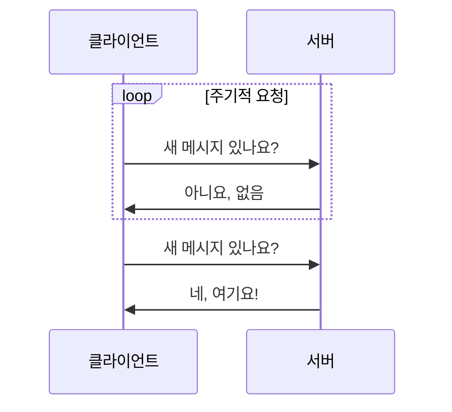
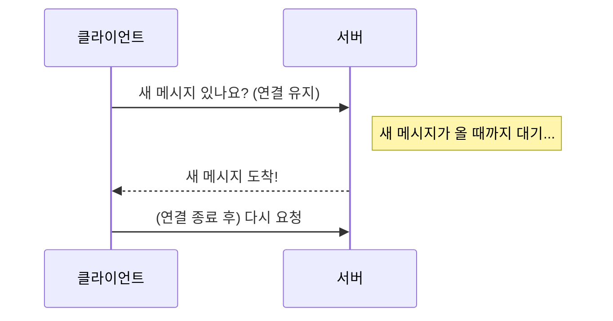
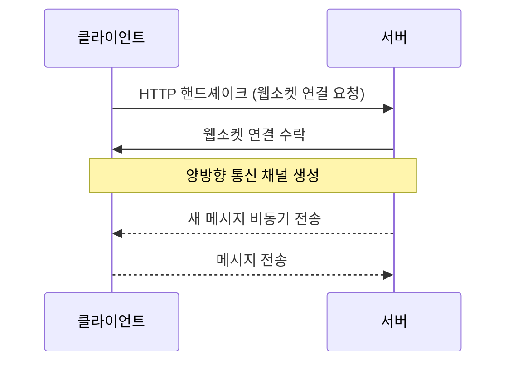
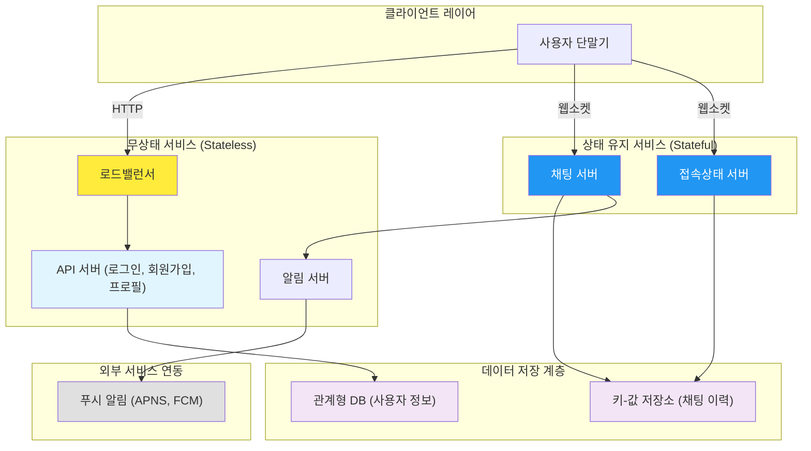
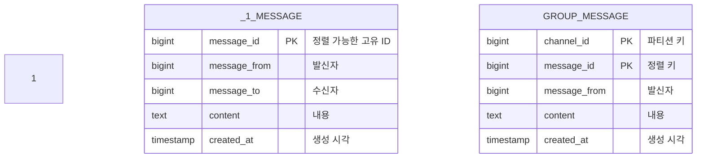
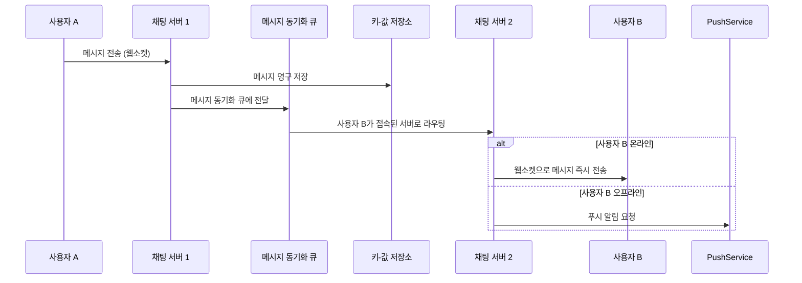
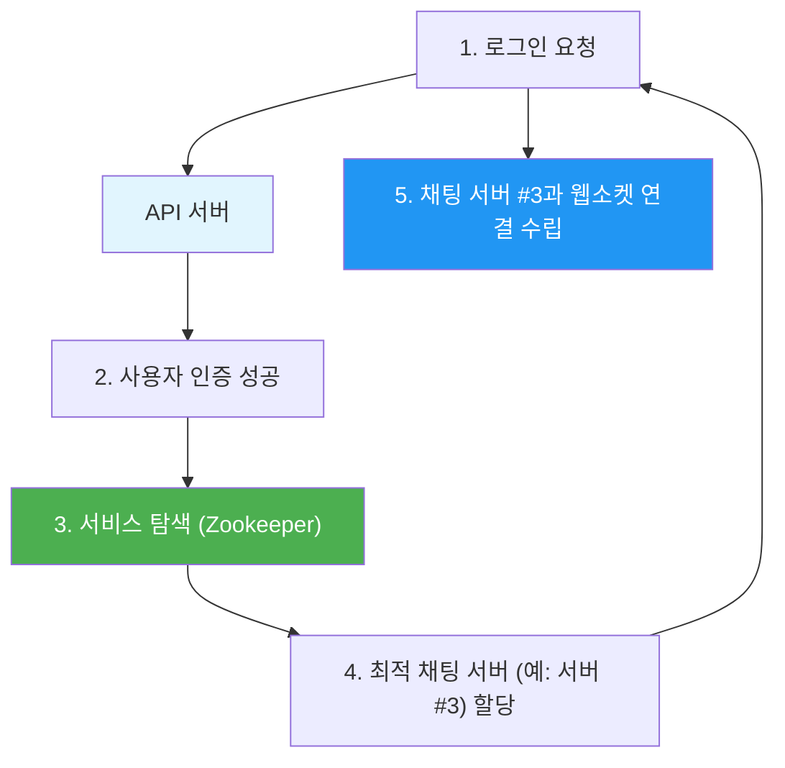

## 시작하며

가면사배 스터디 어느덧 7주차에 접어들었습니다! 지난 11장에서 사용자들의 활동을 실시간으로 보여주는 "뉴스 피드 시스템"을 다뤘다면, 이번 12장에서는 현대인에게 없어서는 안 될 **채팅 시스템 설계**에 대해 깊이 있게 다뤄보려고 합니다.

사실 채팅은 우리가 카카오톡이나 슬랙처럼 매일 쓰는 기능이라 "그냥 메시지 보내고 받으면 되는 거 아냐?"라고 가볍게 생각하기 쉽습니다. 하지만 일일 활성 사용자(DAU)가 5,000만 명에 달하고, 하루에 수백억 건의 메시지가 오가는 대규모 시스템을 설계한다고 하면 이야기가 완전히 달라지더라고요. 단순히 메시지 전달을 넘어 접속 상태 관리, 여러 단말 간의 동기화, 수만 명이 참여하는 그룹 채팅 등 고려해야 할 디테일이 정말 많아서 읽는 내내 "아, 이게 보통 일이 아니구나"라는 생각이 들었습니다. 

스터디원들과 토론하면서도 특히 웹소켓과 상태 유지 서비스의 관리 비용에 대해 많은 이야기를 나눴는데, 그 핵심 내용들을 아주 상세하게 정리해보고자 합니다. 단순히 기술적인 나열을 넘어, 왜 이런 선택을 해야 했는지에 대한 고민의 흔적들을 함께 따라가 보시죠.

## 채팅 시스템 설계의 요구사항과 범위

본격적인 설계에 앞서, 우리가 만들고자 하는 채팅 시스템의 모습을 구체화할 필요가 있습니다. 채팅 앱은 시장에 워낙 다양한 형태(왓츠앱, 위챗, 슬랙, 디스코드 등)로 존재하기 때문에 면접 상황이라면 반드시 요구사항부터 좁히고 들어가야 하더라고요.

이번 장에서 설정한 목표는 다음과 같습니다.

-   **기능**: 1:1 채팅과 소규모 그룹 채팅(최대 100명) 지원
-   **사용자 규모**: DAU 5,000만 명의 대규모 트래픽 감당
-   **메시지 제약**: 텍스트 위주 (최대 10만 자), 사진/비디오 등 미디어 지원
-   **접속 상태**: 사용자의 온라인/오프라인 여부 실시간 표시
-   **기타**: 푸시 알림, 여러 단말 동시 접속 지원, 채팅 이력 영구 보관

이 리스트를 보면서 "일일 사용자 5,000만 명"이라는 숫자가 주는 압박감이 상당했습니다. 메시지 하나가 1KB만 되어도 하루에 쌓이는 데이터량이 어마어마할 테니까요. 이런 규모를 견디기 위해서는 처음부터 확장성을 고려한 아키텍처가 선택이 아닌 필수라는 걸 다시금 느꼈습니다. 특히 "채팅 이력 영구 보관"이라는 조건은 데이터베이스 설계 시 엄청난 도전 과제가 될 것 같더라고요.

## 실시간 양방향 통신을 위한 프로토콜 선택

채팅 시스템의 가장 큰 기술적 도전은 "어떻게 하면 메시지를 지연 없이 실시간으로 전달할 수 있을까?"입니다. 클라이언트가 서버로 메시지를 보내는 건 일반적인 HTTP POST 요청으로도 가능하지만, 서버가 클라이언트에게 메시지를 "밀어주는(Push)" 방식은 고민이 필요합니다. 책에서는 세 가지 방식을 비교하며 우리를 설득하더라고요.

### 폴링 (Polling)

가장 원시적인 방법으로, 클라이언트가 일정한 간격으로 서버에 "나한테 온 메시지 있어?"라고 계속 물어보는 방식입니다.



이 방식은 구현은 정말 간단하지만, 메시지가 없어도 계속 요청을 보내야 해서 서버 리소스를 엄청나게 낭비하게 됩니다. 실시간성도 떨어지고요. 개인적으로는 트래픽이 아주 적은 토이 프로젝트가 아니라면 실무에서는 절대 쓰지 않을 방식이라고 생각했습니다. 서버 로그가 의미 없는 "메시지 없음" 응답으로 가득 차는 걸 상상만 해도 아찔하네요.

### 롱 폴링 (Long Polling)

폴링의 단점을 보완하기 위해 나온 "버티기" 방식입니다. 클라이언트가 요청을 보내면 서버는 메시지가 생길 때까지 연결을 끊지 않고 기다리다가, 새 메시지가 도착하는 순간 응답을 줍니다.



폴링보다는 효율적이지만, 여전히 서버 입장에서는 수많은 클라이언트의 연결을 계속 들고 있어야 한다는 부담이 있습니다. 타임아웃이 발생하면 다시 연결해야 하는 번거로움도 있고, 메시지를 보내는 서버와 받는 서버가 다를 경우 관리가 매우 복잡해지더라고요. 특히 로드밸런싱이 까다로워진다는 점이 큰 단점입니다.

### 웹소켓 (WebSocket)

채팅 시스템의 구원자라고 할 수 있는 방식입니다. 처음 연결할 때만 HTTP로 핸드셰이크를 하고, 그 이후에는 하나의 TCP 연결 위에서 양방향으로 데이터를 마음껏 주고받습니다.



양방향 통신이 가능하기 때문에 메시지를 보낼 때도, 받을 때도 별도의 오버헤드 없이 실시간으로 처리할 수 있습니다. 특히 80이나 443 포트를 그대로 쓸 수 있어서 방화벽 환경에서도 유리하다는 점이 실무자들에게는 큰 메리트입니다. 결국 대규모 채팅 시스템에서는 **웹소켓**이 가장 합리적인 선택이라는 결론에 도달하게 됩니다.

| 비교 항목 | 폴링 | 롱 폴링 | 웹소켓 |
| :--- | :--- | :--- | :--- |
| **실시간성** | 낮음 (요청 주기에 의존) | 중간 | 매우 높음 |
| **서버 자원 소모** | 매우 높음 (잦은 핸드셰이크) | 중간 | 낮음 (연결 유지 비용만 발생) |
| **통신 방향** | 단방향 (Pull) | 단방향 (Pull) | 양방향 (Bi-directional) |
| **적합한 사례** | 간단한 알림 체크 | 적당한 실시간 서비스 | 채팅, 게임, 주식 차트 등 |

이렇게 정리해보니 웹소켓이 왜 실시간 통신의 표준이 되었는지 명확하게 이해가 됐습니다. 다만 웹소켓은 연결을 계속 유지해야 하므로, 서버 측에서 연결 수에 따른 메모리 관리와 로드밸런싱을 더 정교하게 해야 한다는 숙제가 남더라고요.

> 웹소켓 연결 하나당 차지하는 메모리는 보통 수 KB 수준이지만, DAU 5,000만 명이 동시에 접속한다고 가정하면 연결만으로도 수백 GB의 메모리가 필요할 수 있습니다. 그래서 연결 풀링과 유휴 연결 정리 전략이 필수적입니다.

스터디 중에 "웹소켓이 만능은 아니지 않냐"는 의견도 나왔는데, 맞는 말이었어요. 서버-전송 이벤트(SSE)처럼 서버에서 클라이언트로 단방향 푸시만 필요한 경우에는 웹소켓보다 SSE가 더 가벼울 수 있습니다. 하지만 채팅처럼 양방향 통신이 본질인 서비스에서는 결국 웹소켓이 가장 자연스러운 선택이라는 데 모두가 동의했습니다.

## 고수준 아키텍처와 서비스 분리

대규모 시스템일수록 역할을 나누는 것이 중요합니다. 채팅 시스템도 예외는 아닌데요. 크게 무상태 서비스, 상태 유지 서비스, 제3자 서비스로 구분해서 설계합니다.



여기서 가장 눈여겨봐야 할 부분은 **상태 유지 서비스**입니다. 대부분의 현대적인 웹 서비스는 수평적 확장을 위해 무상태(Stateless) 설계를 지향하지만, 채팅 서버는 클라이언트와 웹소켓 연결을 "유지"해야 하므로 상태를 가질 수밖에 없습니다.

이런 구조를 보면서 "아, 채팅 서버가 죽으면 해당 서버에 연결된 모든 사용자가 튕기겠구나"라는 생각이 들어서 조금 무섭기도(?) 하더라고요. 그래서 이런 상태 유지 서버들을 어떻게 유연하게 관리하고 부하를 분산시킬지가 설계의 핵심 과제가 됩니다. 반면 로그인이나 프로필 조회 같은 기능은 여전히 무상태 API 서버에서 처리하게 함으로써 확장성을 확보하는 전략이 인상적이었습니다.

## 데이터 모델링: 메시지의 생명주기

채팅 데이터는 어떤 DB에 담아야 할까요? 결론부터 말씀드리면, 사용자 정보나 친구 목록 같은 정형 데이터는 **관계형 데이터베이스(RDBMS)**가 적합하고, 채팅 메시지 이력은 **키-값 저장소(NoSQL)**가 압도적으로 유리합니다.

그 이유는 크게 세 가지입니다.

1.  **쓰기 속도**: 채팅은 읽기보다 쓰기 작업이 엄청나게 빈번합니다. 수만 명의 사용자가 동시에 "반가워"라고 한마디씩만 해도 DB는 비명을 지를 텐데요. NoSQL은 보통 쓰기 최적화가 잘 되어 있어 이런 부하를 견디기에 좋습니다.
2.  **데이터 규모**: 하루에 수백억 건씩 쌓이는 메시지를 RDBMS의 무거운 인덱스 관리로 버티기에는 무리가 있습니다.
3.  **롱테일 데이터 패턴**: 사용자는 주로 최근 메시지만 봅니다. 하지만 예전 기록도 가끔은 찾아봐야 하죠. 키-값 저장소는 이런 거대한 데이터 덩어리를 파티셔닝하고 검색하는 데 효율적입니다.

### 메시지 ID 생성 전략

메시지 데이터를 설계할 때 가장 중요한 건 **메시지 ID**와 **순서 보장**입니다. 두 사용자가 동시에 메시지를 보냈을 때 누가 먼저인지가 꼬이면 대화 흐름이 이상해지니까요.



메시지 ID는 단순히 DB의 `auto_increment`를 쓰기 어렵습니다. 분산 환경에서는 여러 서버에서 동시에 메시지가 생성되기 때문이죠. 그래서 책에서는 **스노플레이크(Snowflake)** 같은 전역적 ID 생성기나, 특정 채팅방 내에서만 순서를 보장하는 로컬 순서 번호 생성기를 추천합니다.

실제로 실무에서 로그 시스템을 구축할 때 비슷한 고민을 했었는데, 시간 순서가 보장되는 ID가 나중에 데이터를 동기화하거나 정렬할 때 얼마나 강력한 도구가 되는지 다시 한번 깨닫게 됐습니다.

> 핵심 원칙: 메시지 ID는 같은 채팅방 안에서 반드시 정렬 가능해야 합니다.
> 전역적으로 유일할 필요까지는 없지만, 같은 채널 내에서는 시간 순서를 100% 보장해야
> 대화 흐름이 꼬이지 않습니다.

스노플레이크 방식의 장점은 ID 자체에 타임스탬프가 내장되어 있어서, 별도의 정렬 쿼리 없이도 ID만으로 시간 순서를 알 수 있다는 점이에요.
이게 수십억 건의 메시지를 다루는 환경에서는 엄청난 성능 이점으로 작용합니다.
아래 코드는 간단한 스노플레이크 스타일 ID 생성기의 개념을 보여줍니다.

```javascript
// 간단한 Snowflake 스타일 ID 생성기 개념 코드 (Node.js 예시)
// 실제 운영 환경에서는 더 정교한 라이브러리를 사용합니다.
class IdGenerator {
  constructor(nodeId) {
    this.nodeId = BigInt(nodeId); // 서버 고유 ID
    this.sequence = 0n;
    this.lastTimestamp = -1n;
  }

  generate() {
    let timestamp = BigInt(Date.now());

    if (timestamp === this.lastTimestamp) {
      this.sequence = (this.sequence + 1n) & 4095n; // 12비트 시퀀스
      if (this.sequence === 0n) {
        // 같은 밀리초에 시퀀스가 넘치면 다음 밀리초까지 대기
        while (timestamp <= this.lastTimestamp) {
          timestamp = BigInt(Date.now());
        }
      }
    } else {
      this.sequence = 0n;
    }

    this.lastTimestamp = timestamp;

    // 타임스탬프(41비트) + 노드ID(10비트) + 시퀀스(12비트) 조합
    return (timestamp << 22n) | (this.nodeId << 12n) | this.sequence;
  }
}

const gen = new IdGenerator(1);
console.log(gen.generate().toString()); // 정렬 가능한 거대한 숫자 ID 출력
```

## 채팅 시스템의 핵심 로직: 메시지 흐름

메시지가 사용자 A에게서 B에게로 전달되는 과정을 조금 더 자세히 들여다볼게요.

### 1:1 메시지 전달 과정

사용자 A가 보낸 메시지가 사용자 B에게 도달하기까지의 전체 흐름을 시퀀스 다이어그램으로 정리해봤습니다.



이 흐름에서 인상 깊었던 건 **메시지 동기화 큐**의 존재입니다. 단순히 서버가 상대방 서버로 직접 던지는 게 아니라 큐를 거침으로써, 서버 장애나 부하 상황에서도 메시지를 잃어버리지 않고 안정적으로 전달할 수 있게 설계되어 있더라고요. 또한 메시지를 저장소에 먼저 쓰고 나서 동기화 큐에 넣는 순서도 데이터의 안정성을 위해 꼭 지켜야 할 원칙이라는 점을 배웠습니다.

### 여러 단말 간의 동기화

요즘은 폰으로 채팅하다가 PC로 옮겨가는 경우가 흔하죠. 각 단말은 서버에 접속할 때마다 `cur_max_message_id`를 보냅니다. 서버는 이 ID보다 큰(더 최근의) 메시지들만 골라서 내려주면 됩니다.

예를 들어, 제가 폰으로 메시지 ID 10번까지 봤는데 노트북을 켰다면, 노트북은 서버에 "나 10번까지 봤어, 그 뒤로 온 거 다 줘"라고 요청하는 식이죠. 이 로직 덕분에 우리가 기기를 바꿔가며 접속해도 대화 내용이 끊기지 않고 이어지는 것이었더라고요.

여기서 한 가지 더 흥미로웠던 건, 이 동기화 로직이 단순해 보이지만 엣지 케이스가 꽤 많다는 점이었어요. 예를 들어 폰에서 메시지를 보내는 동시에 PC에서 새 메시지를 받는 상황이라면, 양쪽 단말의 `cur_max_message_id`가 서로 다른 시점을 가리키게 됩니다. 이런 경우 "마지막으로 확인한 ID" 기준이 아니라 "마지막으로 동기화된 ID" 기준으로 관리해야 누락이 발생하지 않겠죠. 실무에서도 멀티 디바이스 동기화를 구현할 때 이 부분에서 버그가 자주 발생한다는 이야기를 들은 적이 있어서 공감이 갔습니다.

### 그룹 채팅의 팬아웃(Fan-out)

그룹 채팅방에 100명이 있다면, 한 명이 보낸 메시지를 나머지 99명에게 어떻게 전달할까요? 소규모 그룹에서는 각 참여자의 **수신함(Message Queue)**에 메시지를 일일이 복사해서 넣어주는 방식을 씁니다.

-   **장점**: 수신자는 자기 큐만 보면 되어서 메시지 조회가 매우 빠릅니다. (쓰기 시점에 일을 다 해두는 셈이죠)
-   **단점**: 그룹이 커지면(예: 수만 명) 한 번의 메시지에 대해 수만 번의 쓰기 작업이 발생합니다.

위챗(WeChat) 같은 앱이 왜 단체방 인원수를 수백 명 단위로 제한하는지 기술적인 배경을 이해하게 되는 대목이었습니다. 수만 명이 있는 방이라면 '수신함 복사'가 아니라 공유된 '채팅방 저장소'를 직접 읽게 하는 식의 다른 전략이 필요하겠죠.

스터디에서 이 부분을 토론할 때 "결국 팬아웃 방식은 쓰기 시점 팬아웃(Write-time Fan-out)과 읽기 시점 팬아웃(Read-time Fan-out)의 트레이드오프"라는 이야기가 나왔어요. 소규모 그룹에서는 메시지를 보낼 때 각 수신함에 복사하는 쓰기 시점 팬아웃이 유리하지만, 대규모 그룹에서는 수신자가 직접 채팅방 저장소를 조회하는 읽기 시점 팬아웃이 더 효율적이죠. 11장 뉴스 피드에서 다뤘던 팬아웃 전략과 정확히 같은 고민이라는 점에서, 시스템 설계의 핵심 패턴들이 도메인을 넘나들며 반복된다는 걸 실감했습니다.

## 접속상태 관리와 서비스 탐색

사용자가 지금 들어와 있는지 아닌지를 보여주는 기능도 채팅의 핵심입니다. "친구가 1분 전에 들어와 있었네?"라는 정보를 어떻게 실시간으로 유지할까요?

### 박동(Heartbeat) 메커니즘

모바일 환경에서는 특히 네트워크가 불안정해서 사용자가 명시적으로 로그아웃하지 않아도 연결이 끊기는 경우가 많습니다. 지하나 터널에 들어가는 경우죠. 이를 해결하기 위해 클라이언트가 주기적으로 서버에 "나 살아있어!"라고 신호를 보내는 **박동 이벤트**를 활용합니다.

```javascript
// 박동 메커니즘 서버측 처리 개념
const HEARTBEAT_TIMEOUT = 30000; // 30초

wss.on('connection', (ws) => {
  ws.isAlive = true;
  ws.on('pong', () => { ws.isAlive = true; }); // 클라이언트의 응답 확인

  const interval = setInterval(() => {
    if (ws.isAlive === false) {
      updateUserPresence(ws.userId, 'offline');
      return ws.terminate();
    }
    ws.isAlive = false;
    ws.ping(); // 클라이언트에게 핑 전송
  }, HEARTBEAT_TIMEOUT);
});
```

일정 시간 동안 신호가 안 오면 서버는 해당 클라이언트를 오프라인으로 간주합니다. "아, 그래서 내가 터널에 들어갔을 때 친구들 화면에 내가 오프라인으로 뜨는 데 약간의 지연(박동 주기만큼)이 생기는구나"라고 무릎을 탁 쳤습니다.

### 서비스 탐색 (Service Discovery)

수많은 채팅 서버 중 클라이언트는 어떤 서버에 붙어야 할까요? 이 역할을 **주키퍼(Apache Zookeeper)** 같은 도구가 담당합니다. 사용자의 지리적 위치나 각 서버의 현재 부하를 고려해서 가장 적절한 서버의 주소를 클라이언트에게 알려줍니다.



이렇게 서버 목록을 동적으로 관리하면 특정 서버에 장애가 나도 클라이언트를 다른 서버로 유연하게 유도할 수 있습니다. 시스템 전체의 가용성을 높이는 중요한 장치입니다.

실무에서 이런 서비스 탐색 도구를 운영해보면 "서버가 건강한지 아닌지"를 판단하는 기준이 단순하지 않다는 걸 깨닫게 되더라고요. 단순히 프로세스가 살아 있는지뿐만 아니라, 현재 연결 수가 임계치를 넘기지 않았는지, 응답 지연이 정상 범위인지 등 여러 지표를 종합해서 서버의 "건강도"를 판단해야 합니다. 스터디 중에 "헬스 체크가 통과했는데도 실제로는 느린 서버에 신규 연결을 배정하면 안 되지 않냐"는 의견이 나왔는데, 정말 날카로운 지적이었어요.

## 더 완성도 높은 시스템을 위한 고려사항

책의 마무리에서는 실무에서 만날 수 있는 더 깊은 고민거리들을 던져줍니다.

-   **미디어 파일 처리**: 사진이나 동영상은 용량이 커서 채팅 서버를 직접 거치지 않습니다. S3 같은 객체 저장소에 올리고 CDN을 통해 전송한 뒤, 채팅창에는 그 URL만 보내는 게 정석입니다. 썸네일을 미리 생성해두는 센스도 필요하죠.
-   **종단 간 암호화(End-to-End Encryption)**: 보안이 극도로 중요한 서비스라면 서버조차 메시지를 읽을 수 없게 만드는 암호화 기술을 도입해야 합니다. 왓츠앱(WhatsApp)이나 텔레그램 비밀 채팅방이 쓰는 방식인데, 이 경우 서버에서 메시지 검색 기능을 구현하기가 매우 까다로워진다는 트레이드오프가 있습니다.
-   **오류 처리와 재전송**: 메시지 전송에 실패했을 때 단순히 끝내는 게 아니라, 지수적 백오프(Exponential Backoff)를 적용해 재시도하거나 사용자에게 전송 실패 상태를 명확히 알려주는 UX 처리가 정말 중요합니다. 카카오톡에서 메시지 옆에 빨간 느낌표가 뜨면서 "재전송"을 눌러본 경험, 다들 한 번쯤은 있잖아요? 그게 바로 이런 설계 덕분인 거죠.
-   **메시지 읽음 확인(Read Receipt)**: "읽음" 표시를 구현하려면 수신자가 메시지를 확인한 시점을 서버에 보내야 하는데, 그룹 채팅에서는 참여자 전원의 읽음 상태를 추적해야 하니 복잡도가 기하급수적으로 올라갑니다. 카카오톡의 숫자 표시(안 읽은 사람 수)나 슬랙의 눈 이모지 같은 기능이 뒤에서는 얼마나 많은 상태 관리를 하고 있을지 상상하면 대단하다는 생각이 들더라고요.
-   **메시지 검색**: 과거 대화 내역을 키워드로 검색하는 기능은 사용자 입장에서 매우 유용하지만, 수십억 건의 메시지에 대한 전문 검색(Full-Text Search)을 효율적으로 구현하려면 Elasticsearch 같은 별도 검색 엔진을 도입해야 합니다. 메시지가 저장될 때 비동기로 검색 인덱스를 업데이트하는 파이프라인이 필요한 거죠.

이런 세부사항들까지 고려해야 한다는 걸 보고 시스템 설계는 단순히 "데이터를 주고받는 것"을 넘어 "어떤 극한 상황에서도 사용자에게 신뢰를 주는 것"의 싸움이라는 생각이 들었습니다.

## 실무에 적용할 수 있는 인사이트들

### 1. 상태 유지(Stateful) 서비스의 신중한 관리

-   웹소켓 서버처럼 클라이언트와 연결을 유지해야 하는 서버는 배포나 수평적 확장이 일반적인 API 서버보다 훨씬 까다롭습니다.
-   최대한 비즈니스 로직은 무상태 API 서버로 분리하고, 채팅 서버는 '메시지 라우팅'과 '연결 유지'라는 본연의 역할에만 집중하게 만드는 것이 운영 관점에서는 훨씬 유리하더라고요.

### 2. 데이터 특성에 따른 영리한 저장소 선택

-   사용자 정보(SQL)와 채팅 로그(NoSQL)를 분리하는 것처럼, 데이터의 읽기/쓰기 패턴과 수명 주기를 먼저 분석하는 습관이 필요합니다.
-   특히 채팅 이력처럼 시간이 지날수록 접근 빈도가 급격히 낮아지는 데이터는 콜드 스토리지로 옮기는 등의 비용 최적화 전략도 함께 고민해야 합니다.

### 3. 실패를 가정한 설계 (Design for Failure)

-   네트워크는 언제든 끊길 수 있고, 서버는 언제든 죽을 수 있다는 걸 기본 전제로 깔아야 합니다.
-   박동(Heartbeat) 이벤트를 통한 상태 체크, 메시지 동기화 큐를 통한 버퍼링, 정렬 가능한 ID 생성 전략 등은 모두 이런 '실패' 상황에서도 시스템이 우아하게 동작하게 하려는 노력의 산물이라는 점이 큰 깨달음이었습니다.

### 4. 그룹 채팅의 규모 한계를 인지하기

-   소규모 그룹 채팅(100명 이하)에서 잘 동작하는 팬아웃 방식이 수천, 수만 명 규모로 가면 완전히 다른 전략이 필요하다는 걸 깨달았습니다.
-   디스코드처럼 수십만 명이 접속하는 서버를 운영하려면 팬아웃 대신 구독(Pub/Sub) 기반의 이벤트 스트리밍으로 전환해야 하고, 메시지 저장소도 채팅방 단위가 아니라 토픽 단위로 파티셔닝하는 게 효율적입니다.
-   "규모에 따라 아키텍처 자체가 바뀌어야 한다"는 점이 시스템 설계의 어려움이자 매력이라고 느꼈어요. 100명짜리 방과 10만 명짜리 방은 근본적으로 다른 문제를 풀어야 하니까요.

## 마무리

채팅 시스템 설계를 정리해보니 실시간성, 안정성, 확장성이라는 세 마리 토끼를 잡기 위해 얼마나 정교한 설계가 필요한지 알 수 있었습니다. 특히 웹소켓을 통한 실시간 통신과 NoSQL을 활용한 대량 저장 전략은 비단 채팅뿐만 아니라 대시보드, 주식 거래 시스템, 실시간 협업 도구 등 다양한 분야에 응용할 수 있는 정말 강력한 무기가 될 것 같아요.

결국 좋은 설계란 단순히 가장 빠른 기술을 쓰는 게 아니라, 우리 서비스가 처한 상황과 요구사항을 정확히 이해하고 그에 맞는 기술적 선택을 내리는 과정이라는 걸 다시금 깨닫습니다.

개인적으로 이번 장을 공부하면서 가장 인상 깊었던 순간은, 폴링에서 롱 폴링으로, 다시 웹소켓으로 진화해가는 흐름을 따라가면서 "왜 이전 방식이 부족했고, 왜 새로운 방식이 필요했는지"를 체감했을 때였어요. 기술의 발전이라는 게 갑자기 뚝딱 나오는 게 아니라, 기존 방식의 한계를 하나씩 극복하면서 점진적으로 이루어진다는 걸 실감했습니다. 스터디원들과 "우리 서비스에서도 실시간 기능을 넣는다면?" 하고 상상해보는 시간이 정말 유익했습니다.

다음 포스트에서는 13장 **"검색어 자동완성 시스템"**을 다룰 예정입니다. 구글이나 네이버에서 검색어를 입력할 때 실시간으로 추천 검색어가 뜨는 원리가 무엇인지, 수백만 건의 타이핑을 어떻게 0.1초 만에 처리하는지 함께 알아보시죠!

### 📡 통신 프로토콜과 실시간성에 대한 질문

-   웹소켓 대신 서버-전송 이벤트(SSE)를 채팅 시스템에 활용한다면 어떤 상황에서 더 유리할까요?
-   모바일 기기의 배터리 효율을 고려했을 때, 박동(Heartbeat) 주기를 설정하는 가장 합리적인 기준은 무엇일까요?
-   HTTP/3 프로토콜의 QUIC 기술이 기존 웹소켓 기반 채팅 시스템의 '헤드 오브 라인 블로킹(HoL Blocking)' 문제를 어떻게 해결해줄 수 있을까요?

### 🗄️ 데이터 저장 및 동기화에 대한 질문

-   메시지 삭제나 수정 기능을 구현한다면, NoSQL 저장소의 특성상 발생하는 '데이터 일관성' 문제를 어떻게 해결하면 좋을까요?
-   수만 명이 참여하는 대규모 오픈 채팅방(예: 카카오톡 오픈채팅)의 팬아웃 부하를 줄이기 위한 또 다른 전략은 무엇이 있을까요?
-   사용자가 스마트폰, 태블릿, PC를 동시에 쓸 때 '메시지 읽음 처리' 상태를 모든 기기에서 실시간으로 동기화하는 가장 깔끔한 방법은 무엇일까요?

### 🏗️ 시스템 안정성과 확장성에 대한 질문

-   채팅 서버가 배포를 위해 재시작될 때, 수백만 개의 웹소켓 연결이 한꺼번에 새 서버로 몰리는 '천둥 떼(Thundering Herd)' 문제를 어떻게 방지할 수 있을까요?
-   서비스 탐색(Service Discovery) 도구로 주키퍼 외에 컨설(Consul)이나 에트씨디(etcd)를 쓴다면 어떤 차이가 있을까요?
-   미디어 파일 전송 시 보안을 위해 생성한 임시 URL의 유효 기간을 설정하고 검증하는 로직은 어느 레이어에서 처리하는 것이 가장 효율적일까요?

댓글로 공유해주시면 함께 배워나갈 수 있을 것 같습니다!
