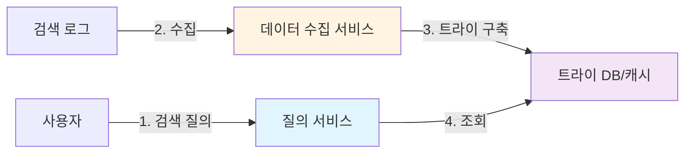
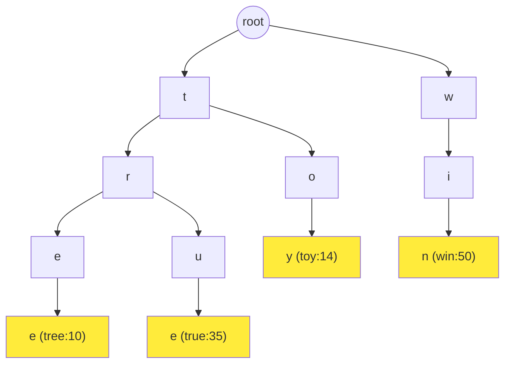
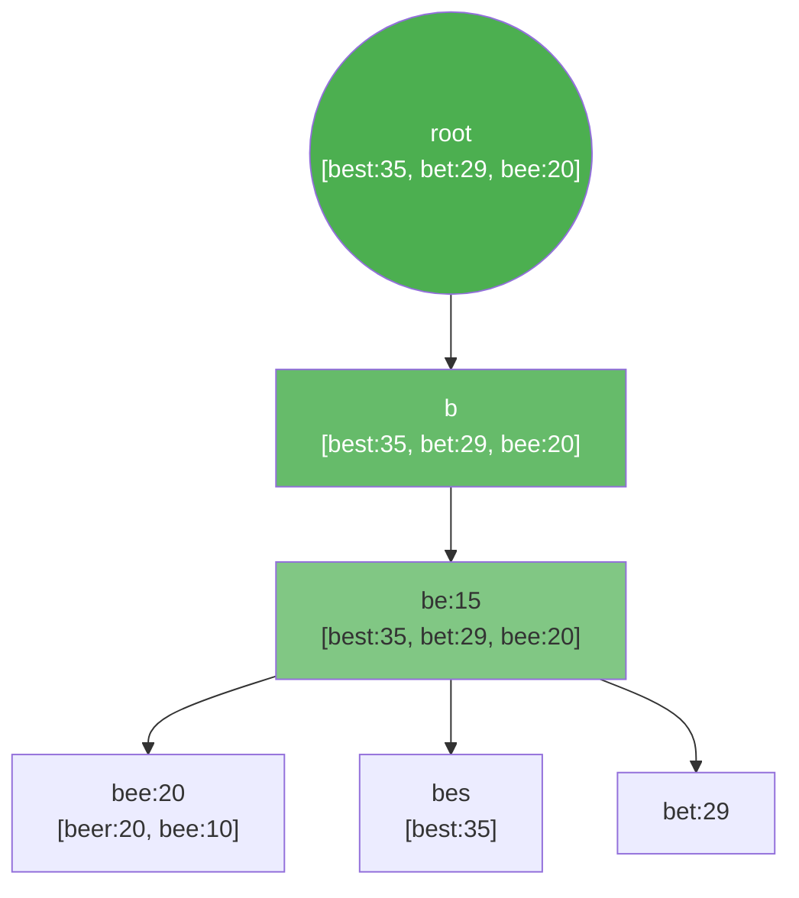
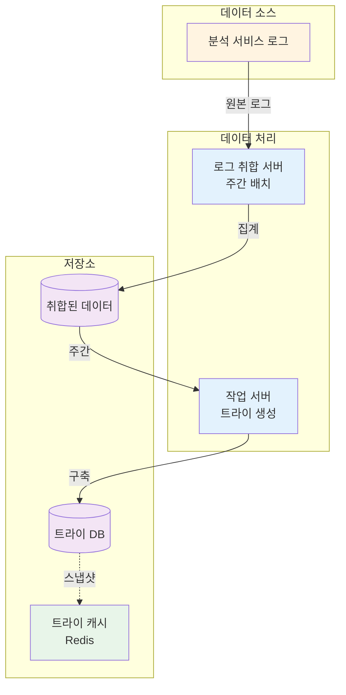
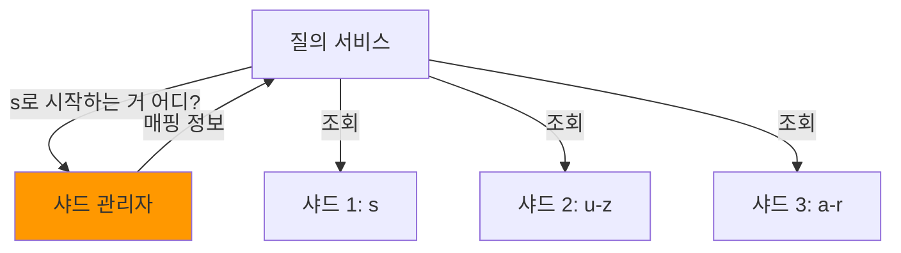
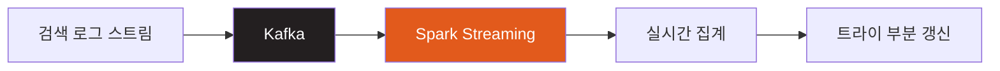
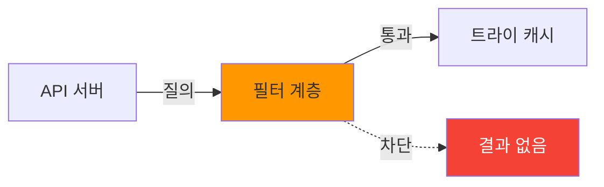

## 시작하며

가면사배 스터디 어느덧 8주차에 접어들었습니다! 지난 12장에서는 실시간성이 강조되는 **채팅 시스템 설계**를 다뤘었는데요. 이번 13장에서는 우리가 매일 수십 번씩 마주하는 **검색어 자동완성 시스템**에 대해 공부했습니다.

구글 검색창에 단어 한 글자만 입력해도 아래로 주르륵 연관 검색어가 뜨는 기능, 사실 너무 익숙해서 그 뒤에 얼마나 복잡한 로직이 숨어 있을지 깊게 생각해보지 않았던 것 같아요. 그런데 이번 장을 읽으면서 100ms라는 찰나의 시간 안에 수백만 건의 데이터를 뒤져 가장 인기 있는 검색어를 골라낸다는 게 얼마나 대단한 엔지니어링인지 실감했습니다. "단순한 트리 구조인 줄 알았는데, 대규모 트래픽을 견디려면 이런 정교한 최적화가 필요하구나"라는 걸 깊이 깨달았거든요.

스터디원들과 토론하면서 특히 트라이(Trie) 자료구조를 메모리에 어떻게 올릴지, 그리고 실시간 급상승 검색어는 어떻게 반영할지에 대해 열띤 대화를 나눴는데 그 핵심 내용들을 오늘 상세히 공유해보려고 합니다.

## 문제 이해 및 설계 범위 확정

본격적인 설계에 앞서 우리가 만들 시스템의 범위를 명확히 해야 합니다. 구글 같은 거대한 시스템을 한꺼번에 설계하기는 어렵기 때문에, 면접 상황을 가정하여 핵심 요구사항을 먼저 정리해봤습니다.

### 요구사항 정리

| 요구사항 | 기준치 | 비고 |
|---------|------|------|
| 빠른 응답 속도 | 100ms 이내 | 사용자가 입력할 때 즉시 반응해야 함 |
| 연관성 | 접두어 일치 | 입력한 단어로 시작하는 검색어 제안 |
| 정렬 기준 | 인기순(Frequency) | 질의 빈도에 기반한 정렬 |
| DAU | 1,000만 명 | 대규모 트래픽 처리 필요 |
| 지원 언어 | 영어만 | 모든 질의는 영어 소문자로 가정 (확장 가능성 고려) |

이 중에서도 가장 도전적인 과제는 **100ms 이내의 응답 속도**입니다. 페이스북의 연구에 따르면 자동완성 시스템의 지연 시간이 100ms를 넘어가면 사용자가 불편함을 느끼기 시작한다고 하더라고요. 네트워크 지연 시간을 제외하면 서버에서 처리하는 시간은 10~20ms 수준이어야 한다는 뜻인데, 이게 정말 쉽지 않은 목표죠.

### 개략적 규모 추정

DAU가 1,000만 명이라면 시스템이 감당해야 할 부하는 어느 정도일까요?

*   **1인당 검색 횟수**: 하루 평균 10회
*   **요청 발생 수**: 1회 검색당 평균 20바이트 입력, 각 글자 입력마다 요청 발생
    *   예: "dinner" 입력 시 d, di, din, dinn, dinne, dinner (총 6회 요청)
*   **평균 QPS**: 10,000,000 × 10 × 20 / 86,400 ≈ 24,000
*   **최대(Peak) QPS**: 약 48,000 (평균의 2배 가정)

초당 5만 건에 육박하는 요청을 0.1초 안에 처리해야 한다는 사실을 수치로 확인하고 나니, "단순한 DB 쿼리로는 절대 불가능하겠구나"라는 확신이 들었습니다. 저장소 측면에서도 매일 0.4GB 정도의 신규 데이터가 쌓이게 되는데, 이를 어떻게 효율적으로 집계할지도 고민해야 할 포인트였습니다.

## 검색어 자동완성 시스템의 개략적 설계

시스템은 크게 두 가지 서비스로 나뉩니다. 사용자가 입력한 데이터를 수집하는 **데이터 수집 서비스**와, 모인 데이터를 기반으로 자동완성 결과를 내놓는 **질의 서비스**입니다.

### 시스템 구성도



### 접근 방식 비교: SQL vs 트라이

처음에는 단순히 관계형 DB에 질의 빈도를 저장하고 `LIKE` 문을 쓰면 되지 않을까 생각할 수 있습니다. 하지만 실제 대규모 환경에서는 다음과 같은 차이가 발생합니다.

| 비교 항목 | SQL (Relational DB) | 트라이 (Trie Data Structure) |
|----------|-------------------|---------------------------|
| 검색 방식 | `WHERE query LIKE 'prefix%'` | 문자열 경로 탐색 |
| 시간 복잡도 | 데이터 양에 비례 (Index 필요) | 입력 문자열 길이에 비례 |
| 정렬 효율 | 매번 `ORDER BY` 발생 | 미리 정렬된 상태로 저장 가능 |
| 대규모 트래픽 | 인덱스 병목 및 디스크 I/O 발생 | 인메모리 처리 시 극히 빠름 |

이 표를 정리하면서 느낀 점은, "범용적인 도구(SQL)보다는 특정한 목적(접두어 검색)에 최적화된 자료구조를 선택하는 것이 대규모 시스템 설계의 핵심"이라는 점이었습니다. 그래서 우리는 트라이(Trie) 자료구조를 선택하게 됩니다.

## 대규모 트래픽을 견디는 상세 설계 전략

이제 이 시스템의 심장부인 트라이 자료구조와 이를 어떻게 최적화할지 파헤쳐 보겠습니다.

### 트라이(Trie) 자료구조와 기본 알고리즘

트라이는 문자열을 효율적으로 저장하고 검색하는 트리 형태의 구조입니다. 각 노드는 글자 하나를 저장하며, 루트에서 특정 노드까지의 경로가 하나의 접두어가 됩니다.



기본적인 검색 알고리즘은 접두어 노드를 찾은 뒤(O(p)), 하위 트리를 모두 탐색하여 유효한 단어를 찾고(O(c)), 이를 정렬(O(c log c))하는 방식입니다. 하지만 데이터가 수억 건이라면 하위 트리를 다 뒤지는 작업 자체가 재앙이 될 수 있습니다.

### 핵심 최적화 1: 접두어 길이 제한 및 노드 내 캐싱

여기서 책이 제시한 두 가지 최적화 기법이 정말 영리했습니다.

1.  **접두어 길이 제한**: 사용자가 입력하는 검색어 길이를 50자 정도로 제한합니다. 이로써 접두어 노드 찾는 시간이 데이터 양에 상관없이 작은 상수값 O(1)이 됩니다.
2.  **노드 내 Top-K 캐싱**: 각 노드에 해당 접두어로 시작하는 가장 인기 있는 검색어 5개를 미리 저장해둡니다.



이 최적화를 적용하면 하위 트리를 탐색할 필요 없이 **즉시 결과를 반환**할 수 있습니다. 시간 복잡도가 사실상 **O(1)**로 줄어드는 거죠. 추가 저장 공간은 좀 들겠지만, 사용자 경험을 위해서는 충분히 지불할 만한 가치가 있는 트레이드오프라고 생각했습니다.

### 트라이 노드 구현 예시 (TypeScript)

실제로 이 구조를 코드로 구현한다면 대략 이런 모습이 될 것 같아요.

```typescript
// 트라이 노드 구조 예시
class TrieNode {
    children: Map<string, TrieNode>;
    isEndOfWord: boolean;
    frequency: number;
    // 최적화: 각 노드에 미리 계산된 인기 검색어 5개를 저장
    topK: Array<{ query: string, freq: number }>;

    constructor() {
        this.children = new Map();
        this.isEndOfWord = false;
        this.frequency = 0;
        this.topK = [];
    }
}

// 자동완성 검색 함수
function getAutocomplete(prefix: string, root: TrieNode): string[] {
    let curr = root;
    // 1. 접두어 노드까지 이동 (O(1) - 길이 제한 덕분)
    for (const char of prefix.toLowerCase()) {
        if (!curr.children.has(char)) return [];
        curr = curr.children.get(char)!;
    }
    
    // 2. 미리 캐싱된 Top K 반환 (O(1))
    return curr.topK.map(item => item.query);
}
```

이 코드를 보면서 "실제 서비스에서는 `topK` 데이터를 어떻게 갱신해줄 것인가"가 다음 숙제가 되겠더라고요.

## 데이터 수집 서비스 상세 설계

매번 검색이 일어날 때마다 트라이를 갱신하는 건 성능상 매우 위험합니다. 트라이가 커질수록 상위 노드들의 `topK`를 전부 업데이트해야 하기 때문이죠. 그래서 보통은 배치 처리를 통해 주기적으로 트라이를 업데이트합니다.



로그 취합 서버가 주간 단위로 데이터를 모으고, 작업 서버가 이를 바탕으로 새로운 트라이를 만들어 DB와 캐시에 밀어넣는 구조입니다. 실무에서도 검색어 순위가 초 단위로 급변해야 하는 특수한 상황이 아니라면, 이런 배치 방식이 훨씬 안정적이고 경제적일 것 같습니다.

### 트라이 저장소 선택: MongoDB vs Cassandra

트라이를 어떻게 저장할지도 중요한 결정입니다.

1.  **MongoDB (Document)**: 트라이 전체를 직렬화해서 하나의 문서로 저장하기 좋습니다. 하지만 트라이가 커지면 문서 크기 제한에 걸릴 수 있죠.
2.  **Cassandra (Key-Value)**: 모든 접두어를 키(Key)로, `topK` 목록을 값(Value)으로 저장하는 방식입니다. 이 방식이 확장성 면에서는 훨씬 유리해 보이더라고요.

이 부분을 읽으면서 "단순히 인메모리 구조로만 생각했는데, 영속성 계층에서 어떻게 읽어올지도 정말 치밀하게 계산해야 하는구나"라고 생각했습니다.

## 질의 서비스 최적화 기법

클라이언트와 서버 간의 통신에서도 몇 가지 영리한 기법들이 사용됩니다.

1.  **AJAX 요청**: 페이지 새로고침 없이 비동기적으로 결과를 가져와서 끊김 없는 사용자 경험을 제공합니다.
2.  **브라우저 캐싱**: 구글의 자동완성 API 응답을 뜯어보면 `cache-control: private, max-age=3600` 같은 헤더를 볼 수 있습니다. 같은 접두어에 대해서는 1시간 동안 서버를 괴롭히지 말라는 뜻이죠.
3.  **데이터 샘플링**: 모든 질의를 로깅하면 CPU와 저장 공간이 버티지 못합니다. 10개 중 1개만 로깅해도 통계적으로는 충분히 유의미한 데이터를 얻을 수 있습니다.

```javascript
// 데이터 샘플링 로직 예시
function logQueryWithSampling(query) {
  const SAMPLE_RATE = 0.1; // 10%만 로깅
  
  if (Math.random() < SAMPLE_RATE) {
    analyticsService.send({
      q: query,
      t: Date.now()
    });
  }
}
```

이 샘플링 기법은 실제로 제가 진행했던 프로젝트에서도 트래픽이 몰리는 구간의 로그 수집 비용을 줄이는 데 큰 도움이 되었던 기억이 나네요. 역시 "완벽한 데이터보다는 충분히 유용한 데이터"를 취하는 전략이 실무에서는 중요하더라고요.

## 저장소 규모 확장과 샤딩 전략

트라이 데이터가 한 대의 서버에 담기 어려워질 정도로 커지면 샤딩이 필수적입니다.

### 1. 첫 글자 기준 샤딩
가장 단순한 방법은 'a'로 시작하면 1번 서버, 'b'는 2번 서버... 식으로 나누는 것입니다. 하지만 'c'로 시작하는 단어가 'x'보다 압도적으로 많기 때문에 데이터 불균형(Skew) 문제가 발생합니다.

### 2. 패턴 분석 기반 샤딩 (추천)
과거 질의 패턴을 분석해서 데이터를 균등하게 분배하는 방식입니다. 예를 들어 's'로 시작하는 검색어의 양이 'u'부터 'z'까지 합친 것과 비슷하다면, 's'만 따로 한 샤드에 할당하는 식이죠.



샤드 관리자(Shard Map Manager)가 어떤 검색어 범위가 어느 샤드에 있는지 매핑 테이블을 관리함으로써, 동적으로 샤드를 추가하거나 재배치할 수 있는 유연성을 확보하게 됩니다.

## 추가 고려사항: 다국어와 실시간성

설계를 마무리하며 스터디에서 나왔던 몇 가지 심화 주제들도 정리해봤습니다.

### 다국어 지원 (유니코드)
트라이 노드에 유니코드 데이터를 저장하면 한글, 중국어 등도 지원 가능합니다. 다만 한글은 "ㄱ", "가", "감" 처럼 타이핑에 따라 문자가 완성되는 특성이 있어서, 초성/중성/종성을 분리해서 저장하거나 정규화(NFC/NFD)하는 과정이 필요하겠더라고요.

### 실시간 검색어 추이 반영
주간 배치 방식의 가장 큰 약점은 "지금 당장 화제가 되는 뉴스"를 반영하지 못한다는 점입니다. 이를 해결하려면 다음과 같은 스트림 프로세싱 아키텍처가 추가되어야 합니다.



최근 검색어에 더 높은 가중치를 주는 시간 감쇠 함수(Time Decay Function)를 적용하면 훨씬 시의적절한 자동완성 결과를 제공할 수 있습니다.

### 트라이 갱신 전략 비교

트라이를 최신 데이터로 유지하기 위한 두 가지 전략을 비교해봤습니다.

| 비교 항목 | 주간 전체 교체 (Full Rebuild) | 개별 노드 갱신 (Incremental Update) |
|----------|---------------------------|----------------------------------|
| 구현 난이도 | 낮음 (단순함) | 높음 (복잡함) |
| 실시간성 | 낮음 (배치 주기 의존) | 높음 (즉시 반영 가능) |
| 서버 부하 | 배치 작업 시점에 집중 | 지속적인 오버헤드 발생 |
| 데이터 정합성 | 보장하기 쉬움 | 갱신 중 읽기 일관성 보증 필요 |
| 추천 상황 | 일반적인 검색 서비스 | 실시간 트렌드가 중요한 서비스 |

이 비교를 통해 "대부분의 서비스에서는 단순한 전체 교체 방식이 가장 비용 효율적이다"라는 결론을 내릴 수 있었습니다.

## 시스템의 안정성을 높이는 세부 기술들

상세 설계 과정에서 놓치기 쉬운 세 가지 핵심 세부 사항들을 추가로 정리했습니다.

### 1. 부적절한 검색어 필터링 (Filter Layer)

자동완성 결과에 혐오 표현이나 부적절한 단어가 노출되면 서비스 평판에 치명적입니다. 이를 위해 질의 서비스 앞에 **필터 계층**을 둡니다.



필터 계층은 DB를 직접 건드리지 않고도 실시간으로 차단 키워드를 업데이트할 수 있다는 장점이 있습니다.

```javascript
// 필터 계층 로직 예시
const blackList = new Set(['badword1', 'badword2']);

function filterQuery(suggestions) {
  return suggestions.filter(word => {
    // 블랙리스트에 포함된 단어가 있는지 검사
    const isInappropriate = Array.from(blackList).some(bad => word.includes(bad));
    return !isInappropriate;
  });
}
```

### 2. 가용성을 위한 트라이 복제

트라이 DB나 캐시 서버가 한 대뿐이라면 해당 서버 장애 시 전체 자동완성 기능이 마비됩니다. 이를 방지하기 위해 **데이터 다중화**가 필수적입니다.

- **마스터-슬레이브 구조**: 쓰기(트라이 생성)는 마스터에서, 읽기(질의)는 여러 대의 슬레이브에서 처리합니다.
- **지역별 복제**: 사용자와 가까운 데이터 센터(Edge)에 트라이 스냅샷을 복제하여 응답 속도를 더욱 개선합니다.

### 3. 트라이 직렬화와 역직렬화

트라이는 포인터로 연결된 객체 구조라 파일로 저장하거나 네트워크로 전송하기 까다롭습니다.

- **직렬화**: 트라이 노드들을 인접 리스트(Adjacency List)나 특정 포맷(JSON, Protocol Buffers)으로 변환합니다.
- **압축**: 트라이의 중복된 경로를 합치는 '데이지 체인' 기법이나 '더블 어레이 트라이(Double Array Trie)' 기법을 사용하면 메모리 사용량을 획기적으로 줄일 수 있습니다.

## 검색어 자동완성 시스템 용어 정리

이번 장에서 배운 핵심 용어들을 한곳에 모아봤습니다.

- **Trie (트라이)**: 문자열의 접두어를 기반으로 한 트리 형태의 자료구조. 'Retrieval'의 약자입니다.
- **Prefix (접두어)**: 단어의 앞부분. 예: "apple"의 접두어는 "a", "ap", "app"... 등입니다.
- **Sharding (샤딩)**: 데이터를 여러 서버에 분산하여 저장하는 기술.
- **Sampling (샘플링)**: 전체 데이터 중 일부만 추출하여 통계를 내는 기법.
- **Time Decay (시간 감쇠)**: 시간이 지남에 따라 데이터의 가중치를 줄이는 알고리즘. 실시간 인기 검색어 반영에 쓰입니다.
- **AJAX**: 페이지 전체를 새로고침하지 않고 서버와 데이터를 주고받는 비동기 통신 기술.

## 실무에 적용할 수 있는 인사이트들

### 1. 섣부른 실시간성 고집 지양

- 모든 데이터가 실시간으로 반영되어야 할 필요는 없습니다.
- 주간/일간 배치로도 비즈니스 가치를 충분히 창출한다면, 아키텍처를 단순하게 유지하는 것이 운영 측면에서 훨씬 유리합니다.
- 복잡성은 곧 장애 포인트와 비용으로 연결된다는 점을 항상 염두에 두어야 할 것 같아요.

### 2. 레이어드 캐싱의 위력

- 이번 설계에서는 노드 캐시, Redis 분산 캐시, 브라우저 캐시까지 3단계 캐싱을 적용했습니다.
- 성능이 서비스의 핵심 경쟁력인 시스템에서는 "어떤 데이터를 어디에, 얼마나 오래 들고 있을 것인가"에 대한 치밀한 전략이 필요합니다.

### 3. 데이터 샘플링의 지혜

- 100%의 정확한 데이터 수집보다 90%의 통계적 유의미함과 90%의 리소스 절감이 더 큰 가치를 줄 때가 많습니다.
- 대규모 시스템일수록 모든 것을 다 하려는 욕심보다는 적절한 수준에서 타협하는 엔지니어링 마인드가 중요하더라고요.

## 마무리

13장을 정리하며 우리가 당연하게 쓰는 검색창 뒤에 이토록 방대한 엔지니어링이 숨어 있다는 사실에 다시 한번 놀랐습니다. 특히 트라이 자료구조를 O(1)로 만들기 위한 노드 캐싱 전략은 "자료구조의 이론적 한계를 시스템 설계로 극복하는 아주 멋진 사례" 같아서 정말 인상 깊었습니다.

완벽한 설계란 정답이 있는 게 아니라, 주어진 제약 조건 안에서 최적의 트레이드오프를 찾아가는 여정이라는 걸 다시 한번 배울 수 있었던 유익한 시간이었습니다.

다음 포스트에서는 드디어 14장 **"유튜브 설계"**를 다룰 예정입니다. 대용량 미디어 처리와 스트리밍 기술의 끝판왕을 만날 생각에 벌써부터 기대가 되네요!

### 🤔 기술적 관점에 대한 질문

- 트라이 자료구조 외에 ElasticSearch 같은 검색 엔진의 역색인(Inverted Index)을 활용해 자동완성을 구현한다면 어떤 차이가 있을까요?
- 트라이 전체를 메모리에 올리기 어려울 때, 어떤 데이터를 메모리에 남기고 어떤 데이터를 디스크로 내보내야 할까요? (LRU 전략 등)
- 맞춤법 교정(Did you mean?) 기능까지 추가한다면 트라이 구조를 어떻게 확장해야 할까요?

### 🗄️ 저장소 및 확장성에 대한 질문

- 샤드 관리자(Shard Map Manager) 자체의 가용성과 일관성은 어떻게 보장할 수 있을까요?
- 주간 단위로 트라이를 전체 교체할 때, 서비스 중단 없이 매끄럽게 교체하는(Zero-downtime switch) 구체적인 전략은 무엇일까요?
- Redis 같은 인메모리 DB를 트라이 저장소로 쓸 때의 스냅샷 주기와 데이터 손실 허용 범위는 어떻게 정하는 게 좋을까요?

### 🎯 비즈니스 및 UX 관점에 대한 질문

- 개인의 최근 검색 히스토리를 반영한 "개인화된 자동완성"과 "전체 인기 검색어"를 어떤 비중으로 섞어 보여주는 것이 좋을까요?
- 부적절한 검색어(혐오 표현 등)를 필터링할 때, 트라이 데이터 생성 단계에서 거르는 것과 API 호출 단계에서 필터 레이어를 두는 것 중 무엇이 더 유연할까요?
- 검색어 자동완성 결과에 광고 키워드를 삽입한다면, UX를 해치지 않으면서도 수익을 극대화할 수 있는 배치는 무엇일까요?

댓글로 공유해주시면 함께 배워나갈 수 있을 것 같습니다!
