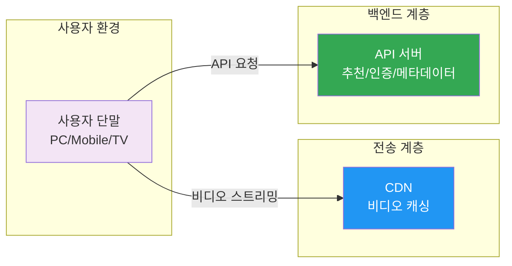
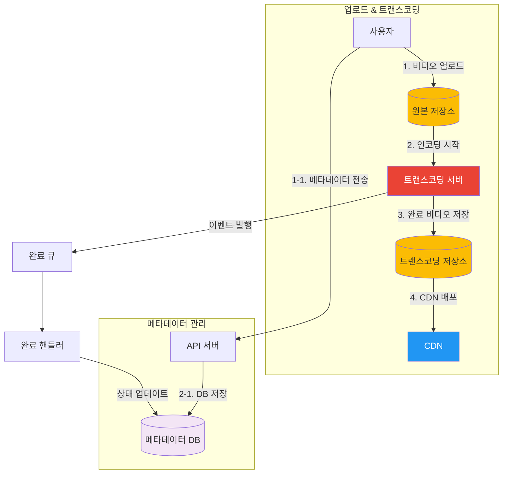
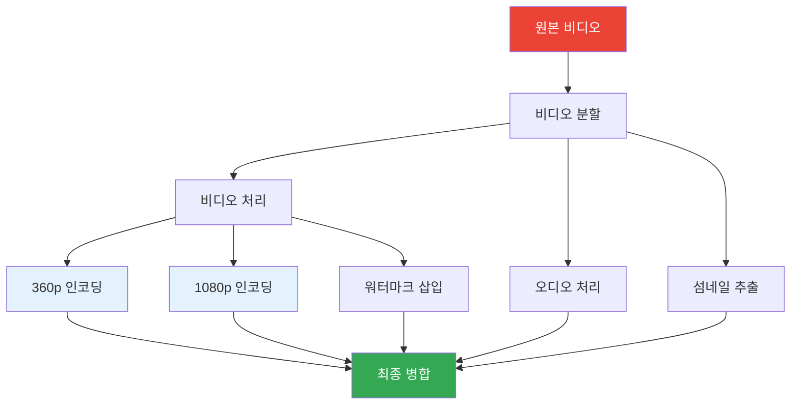
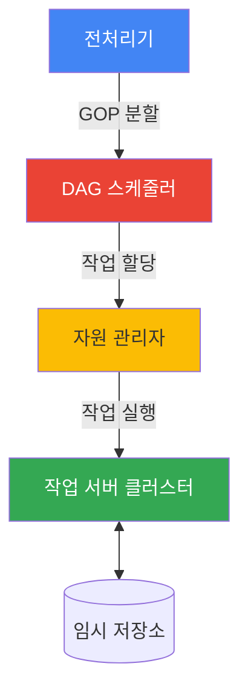
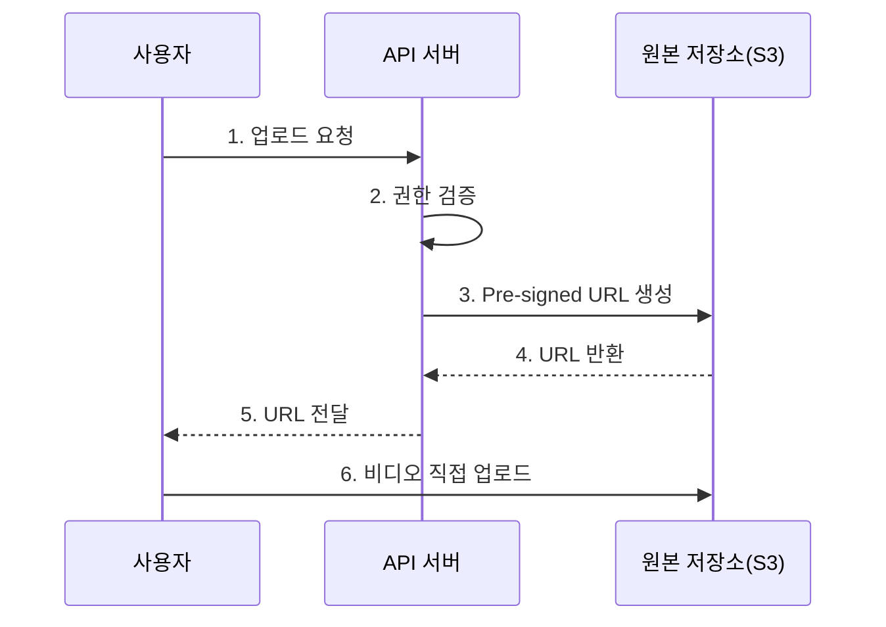
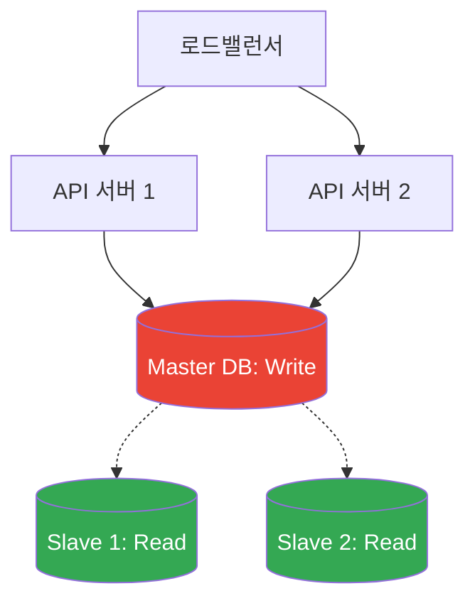

## 시작하며

가면사배 스터디도 어느덧 9주차에 접어들었습니다! 지난 13장에서는 **"검색어 자동완성 시스템"**을 통해 실시간 검색의 묘미를 맛봤다면, 이번 14장에서는 우리가 매일같이 사용하는 **유튜브(YouTube) 설계**에 대해 깊게 다뤄보려고 합니다.

사실 유튜브는 단순히 "비디오를 올리고 보는" 서비스처럼 보이지만, 그 이면에는 일간 150TB라는 어마어마한 데이터를 처리하기 위한 고도의 전략들이 숨어 있더라고요. 처음 책을 펼쳤을 때는 "그냥 서버에 올리고 CDN 쓰면 되는 거 아냐?"라고 가볍게 생각했었는데, 읽다 보니 고려해야 할 세부 사항이 정말 많아서 깜짝 놀랐습니다. 특히 천문학적인 CDN 비용을 어떻게 줄이는지, 수많은 단말기 환경에 맞춰 비디오를 어떻게 변환하는지 배우면서 시스템 설계의 참맛을 느꼈던 챕터였습니다.

스터디 동기들과 이번 장을 읽으면서 가장 많이 했던 이야기는 "역시 돈이 기술을 결정한다"는 점이었어요. 엄청난 CDN 비용을 줄이기 위해 데이터의 인기도를 분석하고 전송 경로를 차별화하는 전략은 정말 실무적인 인사이트가 가득했습니다. 혼자만 알고 있기 아까워 이번 주에도 핵심 내용들을 꼼꼼하게 정리해봤습니다.

## 1단계: 문제 이해 및 설계 범위 확정

유튜브는 전 세계에서 가장 트래픽이 많은 서비스 중 하나죠. 2020년 기준으로 월간 능동 사용자가 20억 명에 달하고, 하루에 재생되는 비디오만 50억 개라고 합니다. 이런 거대 시스템을 설계할 때는 가장 먼저 **규모(Scale)**를 제대로 파악하는 것이 중요합니다.

### 요구사항 정리

면접 상황을 가정해서 가장 중요한 기능들을 먼저 추려봤습니다. 모든 기능을 다 만들 순 없으니, 가장 중요한 부분에 집중해야 하니까요.

| 요구사항 | 상세 내용 |
|---------|----------|
| **가장 중요한 기능** | 비디오 업로드, 시청 기능 |
| **지원 단말** | 모바일 앱, 웹 브라우저, 스마트 TV |
| **사용자 규모** | DAU 500만 명 (가정) |
| **비디오 크기** | 최대 1GB |
| **품질** | 재생 품질 선택 기능, 끊김 없는 스트리밍 |

### 개략적 규모 추정

시스템의 체급을 결정하기 위해 숫자를 뽑아봤는데, 결과가 꽤 충격적이었습니다.

- **저장 용량**: DAU 500만 명 중 10%가 매일 비디오 하나씩(300MB) 올린다고 가정하면, 하루에 150TB의 저장 공간이 필요합니다. 1년이면 약 54PB라는 어마어마한 양이죠.
- **CDN 비용**: 모든 트래픽을 CDN으로 처리한다고 했을 때, 기가바이트당 0.02달러로 계산해보니 한 달에 약 450만 달러(약 60억 원)라는 비용이 나옵니다.

이 수치를 보면서 "와, 이건 단순히 기술의 문제가 아니라 비즈니스 생존의 문제겠구나"라는 생각이 들더라고요. 매일 150TB씩 데이터가 쌓이는데 이걸 어떻게 효율적으로 저장하고, 또 수십 억 원의 비용을 어떻게 줄일 수 있을지가 이번 설계의 진정한 승부처라는 걸 깨달았습니다. 단순히 서버를 늘리는 것만으로는 절대 해결할 수 없는 규모이기 때문입니다.

> **참고**: 실제 유튜브 통계를 보면 2020년 기준 광고 수입만 150억 달러(약 20조 원)에 달합니다. 이 규모의 매출이 나와야 CDN 비용을 감당할 수 있다는 의미이기도 하죠. 창작자 5천만 명이 콘텐츠를 올리고 80개 언어를 지원하는 글로벌 서비스의 인프라 비용이 어느 정도인지 감이 오시나요?

## 2단계: 개략적 설계안 - 업로드와 스트리밍

전체적인 시스템 아키텍처는 크게 세 가지 컴포넌트로 나뉩니다.

- **단말(Client)**: 사용자와 직접 만나는 인터페이스. PC, 모바일, 스마트 TV 등 다양한 기기를 지원해야 합니다.
- **CDN**: 비디오 데이터를 전 세계 엣지 서버에서 캐싱하여 전송합니다. 사용자에게 가장 가까운 서버가 담당하니 지연이 최소화됩니다.
- **API 서버**: 비디오 스트리밍을 제외한 피드 추천, 인증, 메타데이터 관리 등 모든 비즈니스 로직을 처리합니다.



### 비디오 업로드 프로세스

비디오 업로드는 단순히 파일 하나를 서버에 옮기는 과정이 아닙니다. 유튜브 수준의 서비스에서는 **비디오 업로드**와 **메타데이터 갱신**을 분리해서 병렬로 처리하는 게 정석이더라고요. 사용자가 비디오 파일을 올리는 동안, 제목/설명/태그 같은 메타데이터는 별도의 API 경로로 동시에 저장됩니다. 두 프로세스가 독립적으로 진행되니 전체 업로드 시간이 단축되고, 하나가 실패해도 다른 하나에 영향을 주지 않습니다.

전체 아키텍처를 보면, 업로드된 원본은 BLOB 저장소에 보관되고, 트랜스코딩 서버가 이를 가져가 인코딩을 수행합니다. 완료된 비디오는 CDN으로 배포되고, 동시에 메시지 큐를 통해 완료 이벤트가 발행되어 핸들러가 메타데이터 DB를 갱신하는 구조입니다.



이 구조에서 인상 깊었던 건 **메시지 큐(Message Queue)**를 활용한 비동기 처리였습니다. 트랜스코딩은 비디오 크기에 따라 시간이 꽤 걸리는 작업인데, 이걸 동기적으로 기다리지 않고 큐를 통해 이벤트 방식으로 처리함으로써 시스템의 결합도를 낮춘 것이 영리해 보였습니다. 실제로 저희 서비스에서도 무거운 이미지 프로세싱 작업을 처리할 때 이런 패턴을 사용하고 있어서 더 공감이 갔습니다.

### 스트리밍 프로토콜의 선택

비디오를 재생할 때 파일을 통째로 내려받는 게 아니라, 아주 작은 조각으로 나누어 지속적으로 전송받는 **스트리밍** 방식을 사용합니다. 이때 어떤 언어로 대화할지 정하는 것이 프로토콜인데, 대표적으로 Apple의 **HLS**나 Google 주도의 **MPEG-DASH**가 쓰입니다.

| 프로토콜 | 특징 | 비고 |
|---------|------|------|
| **MPEG-DASH** | HTTP 기반, 적응형 비트레이트 지원 | 표준화된 범용 프로토콜 |
| **Apple HLS** | iOS/macOS 기기에 최적화됨 | 애플 생태계의 표준 |
| **WebRTC** | 초저지연(Ultra Low Latency) | 주로 실시간 방송에 사용 |

요즘은 네트워크 상황에 따라 화질을 자동으로 조절해주는 **적응형 비트레이트 스트리밍(Adaptive Bitrate Streaming)**이 거의 기본이 되었습니다. 지하철에서 갑자기 화질이 안 좋아졌다가 다시 좋아지는 경험, 다들 있으시죠? 그게 바로 이 프로토콜들이 실시간으로 대역폭을 체크하며 열일하고 있는 증거입니다.

적응형 비트레이트 스트리밍의 동작 원리를 조금 더 풀어보면 이렇습니다.

1. 서버에 같은 영상의 여러 품질 버전(360p, 720p, 1080p, 4K 등)을 미리 준비해둡니다.
2. 클라이언트가 재생을 시작하면 현재 네트워크 대역폭을 측정합니다.
3. 측정된 대역폭에 맞는 최적의 품질 세그먼트를 요청합니다.
4. 네트워크 상태가 변하면 다음 세그먼트부터 자동으로 품질을 올리거나 내립니다.

스터디에서 "그러면 품질이 갑자기 바뀔 때 사용자가 불쾌하지 않나?"라는 질문이 나왔는데, 실제로 유튜브는 급격한 화질 저하보다는 **버퍼링 없는 연속 재생**을 우선순위로 두고 있다고 합니다. 사용자 경험 관점에서 화질이 잠깐 낮아지는 것보다 영상이 멈추는 게 훨씬 더 나쁘기 때문이죠. 이런 UX 판단이 기술 선택에 직접 영향을 미친다는 점이 인상적이었어요.

## 3단계: 상세 설계 - 트랜스코딩과 최적화

비디오 서비스의 심장이라고 할 수 있는 **트랜스코딩(Transcoding)** 부분을 깊이 들어가 보겠습니다. 원본 비디오는 용량이 너무 크고 기기마다 지원하는 포맷이 다르기 때문에, 이를 다양한 해상도와 포맷으로 변환하는 과정이 반드시 필요합니다.

### DAG(Directed Acyclic Graph) 모델

유튜브는 트랜스코딩 과정을 하나의 고정된 단계가 아니라, 유연한 **작업 그래프(DAG)**로 설계했더라고요. 콘텐츠 창작자마다 요구사항이 다르기 때문입니다. 누군가는 워터마크를 넣고 싶어하고, 누군가는 커스텀 섬네일을 사용하고 싶어하고, 또 누군가는 4K 인코딩만 필요한 경우도 있죠. 이런 다양한 요구사항을 하나의 고정 파이프라인으로 처리하면 유연성이 떨어지기 때문에, 각각의 작업을 독립된 노드로 관리하는 DAG 모델을 도입한 것입니다.

DAG의 첫 단계에서는 원본 비디오를 **비디오 트랙**, **오디오 트랙**, **메타데이터**로 분리합니다. 그 뒤 각각 독립적인 처리 경로를 타게 되는데요. 비디오 트랙은 검사(Inspection) → 인코딩 → 워터마크 삽입 순서로 처리되고, 오디오 트랙은 별도로 인코딩되며, 섬네일도 비디오에서 독립적으로 추출됩니다.



이렇게 DAG 모델을 도입하면 새로운 작업(예: 자막 자동 생성)이 추가되어도 전체 파이프라인을 흔들지 않고 유연하게 확장할 수 있습니다. "아, 이게 바로 객체지향의 원칙이 아키텍처로 구현된 모습이구나"라는 생각이 들어서 무척 흥미로웠습니다. 각 단계가 서로의 내부 구현을 몰라도 정해진 입력과 출력만 맞추면 되니까요.

스터디에서 "그러면 인코딩 포맷은 어떻게 정하는 거야?"라는 질문이 나왔는데, 비디오 파일은 크게 **컨테이너(Container)**와 **코덱(Codec)**으로 구성됩니다. 컨테이너는 `.avi`, `.mov`, `.mp4` 같은 확장자로, 비디오/오디오/메타데이터를 담는 바구니 역할을 합니다. 코덱은 `H.264`, `VP9`, `HEVC` 같은 압축 알고리즘으로, 화질은 유지하면서 파일 크기를 줄여주는 핵심 기술이죠. 유튜브가 360p부터 4K까지 다양한 해상도로 인코딩하는 것도 이 코덱 기술 덕분입니다.

### 트랜스코딩 아키텍처의 상세 구성

이런 DAG 작업을 실제로 수행하기 위해서는 꽤 체계적인 시스템이 필요합니다. 크게 **전처리기**, **스케줄러**, **자원 관리자**, **작업 서버**로 나뉘는데, 각각의 역할이 매우 명확하더라고요.



1. **전처리기(Preprocessor)**: 비디오를 GOP(Group of Pictures) 단위로 쪼개고 DAG를 생성합니다. GOP는 특정 순서로 배열된 프레임 그룹으로, 독립적으로 재생 가능한 최소 단위입니다. 분할된 GOP와 메타데이터는 임시 저장소에 캐싱해두는데, 인코딩 도중 실패하더라도 처음부터 다시 시작하지 않고 실패 지점부터 재개할 수 있게 하기 위함입니다.
2. **DAG 스케줄러**: 생성된 DAG를 작업 단계로 분할하여 자원 관리자의 작업 큐에 넘깁니다. 의존성 관계를 분석해서 병렬 실행이 가능한 작업들은 동시에 처리할 수 있도록 최적화합니다.
3. **자원 관리자(Resource Manager)**: 작업 큐(우선순위 큐), 작업 서버 큐(가용 서버 목록), 실행 큐(현재 실행 중인 작업)를 관리합니다. 최고 우선순위 작업을 꺼내서 가장 적합한 서버에 할당하고, 완료되면 실행 큐에서 제거하는 방식이죠. 이 구조 덕분에 서버 자원을 낭비 없이 활용할 수 있습니다.
4. **작업 서버(Task Worker)**: 실제로 인코딩이나 워터마크 삽입 같은 작업을 수행합니다. 작업 종류에 따라 서버 클러스터를 분리하기도 하는데, 인코딩 전용 서버, 워터마크 전용 서버, 섬네일 전용 서버 등으로 나누면 각 서버를 독립적으로 스케일링할 수 있어서 효율적이더라고요.

### 속도 최적화: GOP 단위 병렬 처리와 근거리 센터

1GB가 넘는 비디오를 하나의 거대한 덩어리로 처리하면 너무 느리겠죠? 그래서 앞서 언급한 **GOP 단위**로 비디오를 쪼개서 병렬로 처리합니다. 그 결과 업로드 속도와 인코딩 속도를 비약적으로 높일 수 있습니다.

```javascript
// GOP 단위 병렬 업로드 컨셉 코드
async function uploadLargeVideo(file) {
  // 1. 비디오를 GOP 단위 조각으로 나눔
  const chunks = splitIntoGOP(file);

  // 2. 여러 조각을 동시에 업로드 (병렬성 확보)
  const uploadPromises = chunks.map((chunk, index) => {
    return uploadChunkWithRetry(chunk, index);
  });

  // 3. 모든 조각이 올라가면 서버에 병합 요청
  const results = await Promise.all(uploadPromises);
  await notifyComplete(results);
}

async function uploadChunkWithRetry(chunk, index) {
  const MAX_RETRIES = 3;
  for (let i = 0; i < MAX_RETRIES; i++) {
    try {
      return await uploadToS3(chunk);
    } catch (e) {
      if (i === MAX_RETRIES - 1) throw e;
      // 지수 백오프 적용하여 재시도
      await backoff(i); 
    }
  }
}
```

이 방식을 쓰면 업로드 도중에 네트워크가 끊겨도 전체를 다시 올릴 필요 없이 실패한 조각만 다시 올리면 됩니다. 실패 시 지수 백오프(exponential backoff)를 적용해서 서버에 부하를 주지 않으면서도 안정적으로 재시도하는 것이 포인트입니다.

### 속도 최적화: 근거리 업로드 센터

GOP 분할 외에도 **물리적 거리**를 줄이는 전략이 있습니다. 한국 사용자가 미국 서버에 1GB 파일을 올리면 당연히 느리겠죠? 그래서 전 세계에 업로드 전용 센터를 두고, 사용자와 가장 가까운 엣지 서버로 업로드하게 합니다. CDN을 다운로드뿐 아니라 업로드에도 활용하는 셈이죠.

### 속도 최적화: 메시지 큐를 통한 느슨한 결합

기존에는 다운로드 → 인코딩 → 업로드가 순차적으로 진행되어 앞 단계가 끝나야만 다음 단계가 시작될 수 있었습니다. 하지만 각 단계 사이에 **메시지 큐**를 넣으면, 다운로드 모듈이 완료 이벤트를 큐에 넣고 바로 다음 작업을 시작할 수 있습니다. 인코딩 모듈은 큐에서 이벤트를 꺼내서 독립적으로 처리하고요. 이렇게 각 모듈이 큐를 매개로 느슨하게 결합되면, 전체 처리량이 비약적으로 올라갑니다.

### 보안의 완성: Pre-signed URL과 콘텐츠 보호

아무나 저희 서버에 파일을 올리게 두면 안 되겠죠? 그래서 **Pre-signed URL**이라는 방식을 사용합니다. 허가받은 사용자에게만 특정 파일 경로로 업로드할 수 있는 임시 URL을 발급해주는 것이죠.



이렇게 하면 서버 부하도 줄이면서 보안도 챙길 수 있습니다. 또한, 콘텐츠 저작권 보호를 위해 **DRM(Digital Rights Management)** 시스템이나 **AES 암호화**를 적용합니다. 재생할 때만 키 관리 서버에서 키를 받아와서 복호화하는 방식인데, 넷플릭스나 유튜브 프리미엄 같은 서비스들이 이 기술을 아주 적극적으로 활용하고 있습니다.

### 비용 최적화: 롱테일 분포의 마법

제가 이번 장에서 가장 감탄했던 부분입니다. 월 60억 원이라는 CDN 비용을 어떻게 줄일까요? 정답은 **데이터의 인기도**에 있었습니다. 유튜브의 비디오 시청 패턴은 **롱테일(Long Tail)** 분포를 따릅니다. 즉, 전체 비디오의 20%가 트래픽의 80%를 차지한다는 것이죠.

| 구분 | 전송 전략 | 비용 및 성능 |
|-----|----------|------------|
| **인기 동영상 (20%)** | 전 세계 CDN 엣지에 캐싱 | 비용 높음, 성능 매우 빠름 |
| **비인기 동영상 (80%)** | 주 데이터 센터에서 직접 스트리밍 | 비용 낮음, 성능 상대적 느림 |
| **지역별 인기 동영상** | 해당 지역 CDN에만 배포 | 비용 최적화, 타겟 성능 확보 |

이 전략을 적용하면 전체 비용을 무려 **70% 이상 절감**할 수 있습니다. 구체적으로 숫자를 뽑아보면 이렇습니다.

- **기존**: 모든 비디오를 CDN으로 처리 → 일일 $150,000
- **개선 후**: 인기 비디오 20%만 CDN → $30,000, 나머지 80%는 자체 서버 → $10,000
- **총 비용**: $40,000/일 (약 **73% 절감**)

무조건 기술적으로 "최고의 성능"만 고집하는 게 아니라, 데이터의 특성을 파악해서 비즈니스 관점에서 효율적인 타협점을 찾는 게 진짜 실력이구나라는 걸 다시 한번 느꼈습니다.

여기에 추가로 두 가지 최적화도 가능합니다. 첫째, 인기 없는 비디오는 **사전 인코딩을 생략**하고 최초 재생 시 on-demand로 인코딩하는 방법입니다. 짧은 비디오에 특히 효과적이죠. 둘째, **지역 기반 최적화**로 특정 지역에서만 인기 있는 비디오는 해당 지역 CDN에만 배포하는 것입니다. 불필요한 글로벌 배포를 막아 비용을 더 줄일 수 있습니다.

## 4단계: 마무리 및 추가 논의사항

유튜브와 같은 거대 시스템은 단일 서버의 확장을 넘어, 전 세계적인 인프라 분산과 비용 효율화가 핵심입니다. 마지막으로 운영과 확장을 위해 고려해야 할 세부 사항들을 정리해봤습니다.

### API 및 데이터베이스 규모 확장

사용자가 늘어남에 따라 API 서버와 DB도 당연히 확장되어야 합니다. API 서버는 **무상태(Stateless)**로 설계하여 로드밸런서 뒤에 수천 대를 배치할 수 있습니다. 세션 정보를 서버에 저장하지 않으니, 어떤 서버에 요청이 가든 동일하게 처리되고 수평 확장이 쉬운 것이죠.

데이터베이스는 두 가지 축으로 확장합니다.

- **읽기 복제(Replication)**: 주 서버(Master)에서 쓰기를 처리하고, 부 서버(Slave) 여러 대에 복제해서 읽기 부하를 분산합니다. 비디오 메타데이터 조회는 쓰기보다 훨씬 많으니까요.
- **샤딩(Sharding)**: 데이터를 사용자 ID 기준으로 여러 DB에 나누어 저장합니다. 각 샤드가 독립적으로 동작하니 쓰기 성능도 확보할 수 있습니다.



### 라이브 스트리밍

라이브 스트리밍은 일반 비디오와는 완전히 다른 도전 과제입니다. 일반 비디오는 사전에 업로드하고 충분한 시간을 두고 트랜스코딩할 수 있지만, 라이브는 실시간으로 인코딩해서 바로 쏴줘야 하니까요.

| 구분 | 일반 비디오 | 라이브 스트리밍 |
|-----|-----------|--------------|
| **업로드** | 사전 업로드 후 처리 | 실시간 인코딩 및 전송 |
| **지연 허용** | 수 분까지 가능 | 2~5초 이내 목표 |
| **병렬화** | GOP 단위로 높음 | 실시간 순차 처리라 낮음 |
| **오류 처리** | 재시도 가능 | 빠른 failover 필수 |
| **프로토콜** | HLS, DASH | RTMP, WebRTC, Low-Latency HLS |

방송자가 **RTMP**로 인제스트 서버에 영상을 보내면, 트랜스코더가 실시간으로 인코딩하고 Origin 서버를 거쳐 CDN으로 배포하는 구조입니다. 특히 WebRTC를 쓰면 1초 이하의 초저지연도 가능한데, 그만큼 구현 복잡도가 올라간다는 트레이드오프가 있어요.

### 비디오 삭제(Takedown)

저작권 위반 등으로 인한 **비디오 삭제** 요청은 세 가지 경로로 들어옵니다. 업로드 시 자동 감지, 사용자 신고, 그리고 권리자의 Content ID 매칭이죠. 위반이 확인되면 메타데이터 상태를 즉시 "삭제됨"으로 바꾸고, 전 세계 CDN 캐시를 무효화(Invalidation)한 뒤, 실제 파일은 배치 작업으로 정리합니다. 즉시 차단이 최우선이고, 물리적 삭제는 비동기로 처리하는 전략이 인상적이었어요.

### 시스템 안정성을 위한 오류 처리

대규모 시스템에서 오류는 "만약"의 문제가 아니라 "언제"의 문제입니다. 책에서 제시한 컴포넌트별 대응 전략은 정말 실무적이더라고요.

| 오류 유형 | 해결 전략 |
|---------|----------|
| **업로드 실패** | GOP 단위 재시도, 이어올리기 지원 |
| **트랜스코딩 오류** | 작업 재스케줄링, 다른 서버에서 재시도 |
| **CDN 장애** | 다른 CDN 업체로 우회 (멀티 CDN 전략) |
| **DB 장애** | 부 서버(Slave)를 주 서버(Master)로 승격 |

이런 장애 대응 시나리오를 보면서 "아, 실제 운영 환경에서는 개발만큼이나 방어적인 설계가 중요하구나"라는 걸 다시금 깨달았습니다. 장애가 나도 서비스가 죽지 않게 만드는 것이 설계의 완성이라는 생각이 듭니다.

여기서 중요한 건 **회복 가능 오류**와 **회복 불가능 오류**를 구분하는 것입니다. 네트워크 일시 장애처럼 잠깐 후 다시 시도하면 되는 오류는 지수 백오프로 재시도하면 됩니다. 하지만 비디오 포맷 자체가 잘못되었거나 파일이 손상된 경우는 아무리 재시도해도 해결되지 않으니, 즉시 작업을 중단하고 사용자에게 명확한 에러 코드를 반환하는 게 맞겠죠. 이 이분법은 비디오 시스템뿐 아니라 어떤 분산 시스템에서든 적용할 수 있는 범용적인 원칙이라고 느꼈습니다.

## Do's and Don'ts

| | Do's (이렇게 하자) | Don'ts (이건 피하자) |
|---|---|---|
| 업로드 | GOP 단위로 쪼개서 병렬 업로드, 실패 시 해당 조각만 재시도 | 대용량 파일을 한 번에 통째로 올리기 |
| 트랜스코딩 | DAG로 작업을 분리하고 메시지 큐로 느슨하게 연결 | 모든 처리를 하나의 거대한 파이프라인에 직렬로 묶기 |
| CDN | 인기도 기반으로 선택적 CDN 배포, 롱테일 활용 | 모든 비디오를 무조건 전 세계 CDN에 올리기 |
| 보안 | Pre-signed URL + DRM + AES 암호화 조합 | 서버를 통해 모든 업로드/다운로드를 프록시하기 |
| 오류 처리 | 회복 가능/불가능 오류를 구분하고 각각 다르게 대응 | 모든 오류에 무한 재시도 걸어두기 |

## 실무에 적용할 수 있는 인사이트들

### 1. 무거운 작업은 무조건 비동기로
- 트랜스코딩처럼 시간이 걸리는 작업은 메시지 큐를 활용해 결합도를 낮춰야 합니다.
- 작업 완료 후 핸들러를 통해 메타데이터를 갱신하는 패턴은 범용적으로 쓰기 좋습니다.
- 시스템의 안정성과 확장성을 동시에 잡을 수 있는 전략입니다.

### 2. 비용과 성능의 트레이드오프
- 모든 데이터를 가장 비싼 솔루션(CDN)으로 처리할 필요는 없습니다.
- 데이터의 특성(인기도, 접근 빈도)에 따라 계층화된 저장/전송 전략을 세우는 것이 중요합니다.
- 기술적 완벽함보다 비즈니스 가치가 우선되는 순간을 파악해야 합니다.

### 3. 보안은 레이어별로 철저하게
- Pre-signed URL을 통해 권한 없는 사용자의 업로드를 원천 차단합니다.
- DRM과 AES 암호화를 조합해 원본 콘텐츠의 저작권을 보호합니다.
- 보안은 시스템의 신뢰도를 결정짓는 가장 중요한 요소입니다.

### 4. 데이터 조각화의 힘
- 거대한 데이터를 다룰 때는 항상 쪼개서 병렬로 처리할 방법을 찾아야 합니다.
- GOP 단위 분할처럼 데이터의 구조적 특성을 활용하면 성능과 안정성을 모두 잡을 수 있습니다.
- 조각화의 또 다른 이점은 실패 범위를 줄여준다는 것입니다. 1GB 파일 전체가 아니라 몇 MB짜리 조각 하나만 다시 올리면 되니까요.

### 5. 클라우드 서비스를 적극 활용하자
- CDN과 BLOB 저장소를 직접 구축하는 것은 복잡하고 비용이 큽니다.
- 넷플릭스도 AWS를, 페이스북도 Akamai CDN을 활용합니다.
- 면접에서도, 실무에서도 "바퀴를 다시 발명하지 않는 것"이 중요합니다.

## 마무리

유튜브 설계를 공부하면서 느낀 점은, 대규모 시스템일수록 **"나누고 쪼개는 기술"**이 중요하다는 것이었습니다. 비디오를 GOP 단위로 조각내고, 작업을 DAG로 나누고, 서버를 무상태로 분리하는 모든 과정이 결국 거대한 트래픽을 감당하기 위한 눈물겨운 노력의 산물이더라고요.

개인적으로 이번 장에서 가장 크게 와닿은 건 **비용과 기술의 관계**였습니다. 월 60억 원이라는 CDN 비용을 보면서, 기술적 완벽함만 추구하면 사업이 망할 수도 있겠다는 현실적인 감각을 얻었달까요. 롱테일 분포를 활용해 인기 비디오 20%만 CDN에 태우고 나머지는 자체 서버에서 처리하는 전략은, 데이터의 특성을 이해하면 비용을 70% 이상 줄일 수 있다는 걸 보여줬습니다.

또 하나 기억에 남는 건 **오류 처리 설계**입니다. 대규모 시스템에서 오류는 "만약"의 문제가 아니라 "언제"의 문제라는 책의 표현이 정말 와닿았어요. 회복 가능한 오류는 지수 백오프로 재시도하고, 회복 불가능한 오류는 빠르게 포기하고 에러 코드를 반환하는 이분법적 접근이 실무에서도 바로 써먹을 수 있는 패턴이었습니다.

이번 장을 끝으로 미디어 시스템에 대한 눈이 조금은 트인 것 같습니다. 단순히 "좋은 기술"을 쓰는 게 아니라 "우리 상황에 맞는 적절한 기술"을 선택하는 법을 배운 챕터였어요.

다음 포스트에서는 드디어 이 시리즈의 마지막인 **15장 "구글 드라이브 설계"**를 다룰 예정입니다. 파일 동기화와 실시간 협업 플랫폼의 비밀을 파헤치며 대장정을 마무리해보겠습니다.

### 🏗️ 아키텍처 확장에 대한 질문

- 숏폼(Shorts)과 롱폼 비디오는 트랜스코딩 전략이 어떻게 달라야 할까요?
- 라이브 스트리밍 시 5초 이내의 지연 시간을 보장하기 위해 가장 먼저 개선해야 할 지점은 어디일까요?
- 데이터 센터가 통째로 다운됐을 때, CDN 엣지 서버만으로 서비스를 유지할 수 있는 방법이 있을까요?

### 💰 비용 및 효율성에 대한 질문

- 비인기 동영상을 CDN 없이 서비스할 때 발생하는 네트워크 비용은 어떻게 최적화할 수 있을까요?
- 트랜스코딩 시 CPU 집약적인 작업과 GPU 집약적인 작업 중 어떤 것이 더 비용 효율적일까요?
- 특정 지역에서만 인기 있는 영상이라면 해당 지역의 로컬 데이터 센터에만 두는 게 이득일까요?

### 🛡️ 보안 및 정책에 대한 질문

- Pre-signed URL의 만료 시간은 어느 정도가 가장 적당할까요? (업로드 속도 vs 보안)
- 저작권 위반 영상(Takedown) 처리 시 CDN 캐시를 가장 빠르게 무효화하는 방법은 무엇인가요?
- AES 암호화 키 관리 시스템(KMS) 자체가 장애가 났을 때 비디오 재생을 보장할 수 있는 대안이 있을까요?

댓글로 공유해주시면 함께 배워나갈 수 있을 것 같습니다!
