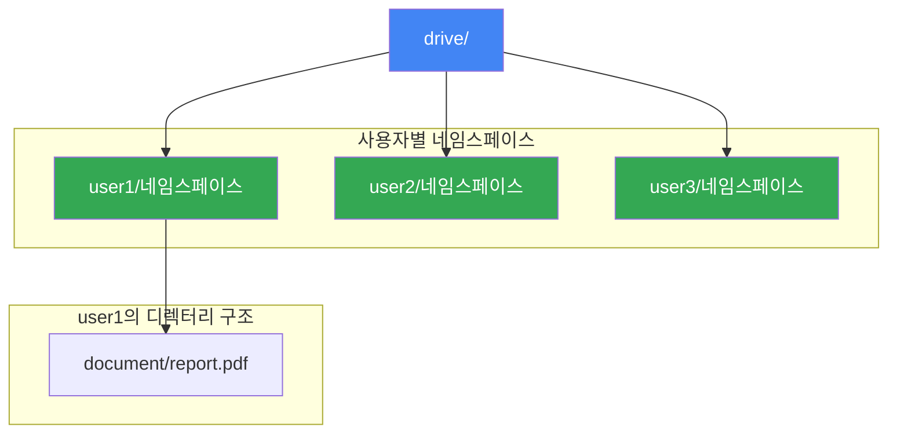
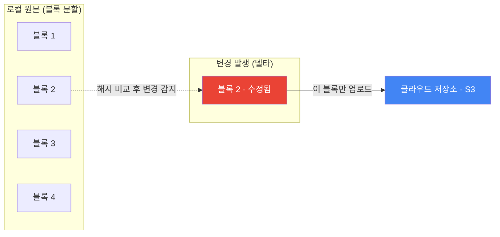

## 시작하며

가면사배 스터디의 마지막, 10주차에 드디어 도착했습니다! 지난 14장에서 대규모 동영상 스트리밍 플랫폼인 **유튜브 설계**를 다뤘다면, 이번 시리즈의 피날레인 15장에서는 우리가 매일같이 공기처럼 사용하는 **구글 드라이브 설계**에 대해 다룹니다.

사실 파일을 클라우드에 올리고 내리는 건 개발자 입장에서 언뜻 단순해 보일 수도 있잖아요? "파일 업로드 API 하나 만들면 끝 아닌가?"라고 생각할 수 있지만, 그 이면을 들여다보니 정말 고려할 게 많더라고요.

단순히 '저장'하는 걸 넘어, 수백 페타바이트(PB)의 데이터를 어떻게 하면 네트워크 대역폭을 낭비하지 않고 여러 기기에 실시간으로 동기화할 수 있을지에 대한 해답이 이 챕터에 고스란히 담겨 있었습니다. 특히 드롭박스(Dropbox)의 초기 성장을 이끌었던 **블록 저장소** 개념과 **델타 동기화** 기술이 아주 흥미로웠습니다. 이 두 가지 기술이 없었다면, 파일 하나 수정할 때마다 전체를 다시 올려야 했을 거고, 모바일 데이터 요금 폭탄을 맞는 사용자들이 속출했을 겁니다.

스터디 초기에 "이 두꺼운 책을 과연 끝까지 다 읽을 수 있을까?" 싶었는데, 어느덧 마지막 장을 정리하고 있으니 감회가 정말 새롭네요. 10주 동안 처리율 제한 장치부터 안정 해시, 채팅 시스템, 유튜브까지 다양한 대규모 시스템을 하나씩 격파해왔고, 그 과정에서 배운 수많은 패턴들이 이번 15장에서 총집합처럼 다시 등장하는 느낌을 받았습니다.

독자 여러분과 함께 구글 드라이브의 설계 원리를 깊이 있게 파헤쳐보며, 1장부터 달려온 이 긴 여정의 피날레를 멋지게 장식해보려 합니다.

## 단계 1: 문제 이해 및 설계 범위 확정

구글 드라이브는 파일 저장뿐만 아니라 여러 단말에서의 접근성, 그리고 안정적인 동기화가 핵심인 서비스입니다. 이번 설계에서는 구글 문서(Google Docs) 같은 실시간 문서 편집 기능은 일단 제외하고, 순수하게 **파일 저장 및 동기화**라는 본질에 집중하기로 했습니다.

### 기능적 요구사항 정리

면접에서 가장 먼저 해야 할 일은 "이 시스템이 정확히 무엇을 해야 하는가?"를 확인하는 것입니다. 질의응답을 통해 정리한 기능 범위는 다음과 같았습니다.

| 기능 | 설명 |
|------|------|
| **파일 업로드/다운로드** | Drag-and-drop으로 파일을 올리고 내려받기 |
| **파일 동기화** | 한 단말에서 추가한 파일이 다른 단말에 자동 동기화 |
| **파일 갱신 이력** | 파일의 버전 히스토리 조회 및 이전 버전 복원 |
| **파일 공유** | 다른 사용자와 파일 공유 |
| **알림** | 파일 편집/삭제/공유 시 다른 단말에 알림 |

여기서 핵심은 **구글 문서 편집 기능은 제외**한다는 것입니다. 여러 사용자가 동시에 같은 문서를 편집하는 기능은 Operational Transformation이나 CRDT 같은 별도의 복잡한 알고리즘이 필요해서 이번 설계 범위에서는 빼기로 했습니다.

### 비기능적 요구사항

| 요구사항 | 설명 | 중요도 |
|---------|------|--------|
| **안정성** | 데이터 손실이 절대 발생하면 안 됨 | ★★★★★ |
| **빠른 동기화** | 동기화 지연 최소화 | ★★★★☆ |
| **네트워크 효율성** | 대역폭을 낭비하지 않음 | ★★★★☆ |
| **규모 확장성** | 대량의 트래픽 처리 가능 | ★★★★☆ |
| **높은 가용성** | 일부 서버 장애에도 서비스 지속 | ★★★★☆ |

안정성이 다른 모든 것을 압도합니다. 속도가 좀 느려도 사용자는 참을 수 있지만, 파일이 사라지면 절대 용서하지 않거든요. 이 우선순위가 이후 설계의 모든 결정에 영향을 미칩니다.

### 주요 규모 추정

먼저 면접 상황에서 논의될 법한 수치들을 정리해봤습니다. 일간 능동 사용자(DAU)가 **천만 명(10M)**에 달하고, 파일 하나당 크기 제한은 **10GB**입니다.

개략적인 규모를 계산해봤는데, 숫자가 정말 압도적이었습니다.

| 구분 | 가정 및 수치 | 상세 내용 |
|-----|------|-----------|
| 가입 사용자 | 5,000만 명 | 서비스 전체 등록 유저 |
| **DAU** | **1,000만 명** | 매일 접속하는 활성 유저 |
| 사용자당 무료 공간 | 10GB | 기본 제공 저장 용량 |
| **저장 공간 총량** | **500 페타바이트(PB)** | 5,000만 명 × 10GB (추정치) |
| 업로드 QPS | 약 240 QPS | 일평균 2회 업로드 가정 |

500PB라는 저장 공간을 보면서 "이걸 대체 서버 몇 대로 감당할 수 있을까?"라는 현실적인 걱정부터 들었습니다. 10TB짜리 하드디스크 기준으로 약 5만 대가 필요한 규모입니다. 사용자당 10GB를 준다고 해도 전체 용량이 이 정도라니, 우리가 무심코 누르는 '업로드' 버튼 뒤에 이런 엄청난 인프라가 숨어있다는 게 새삼 대단하게 느껴졌습니다.

하지만 시스템 설계의 묘미는 이런 거대한 문제를 작은 단위로 쪼개서 해결해 나가는 데 있죠. 그리고 실제로 대부분의 사용자가 10GB 전체를 사용하지는 않기 때문에, 오버커밋(overcommit) 전략을 쓸 수도 있습니다. 항공사가 좌석보다 많은 표를 파는 것과 비슷한 전략이죠.

## 단계 2: 개략적 설계안 - 단순함에서 확장까지

처음부터 500PB 규모를 한꺼번에 설계하는 건 불가능에 가깝습니다. 그래서 단순한 한 대의 서버에서 시작해, 어떤 병목이 생길 때마다 해결책을 덧붙이는 방식으로 설계를 그려봤습니다. 이 접근법은 면접에서도 아주 효과적입니다. 한 번에 완벽한 아키텍처를 제시하는 것보다, "문제를 발견하고 → 해결하는" 과정을 보여주면 사고력을 어필할 수 있으니까요.

### 네임스페이스와 API 설계

가장 기초적인 구조는 각 사용자별로 **네임스페이스(namespace)**라는 하위 디렉터리를 두어 파일을 격리하는 방식입니다. 이렇게 하면 `user1/photos/summer.jpg` 같은 경로만으로도 파일을 유일하게 식별할 수 있게 됩니다.



업로드 API를 설계하면서 인상 깊었던 건 **이어 올리기(Resumable Upload)**의 도입이었습니다. 용량이 큰 파일을 올리다가 지하철에서 네트워크가 끊겼는데, 다시 처음부터 올려야 한다면 사용자 입장에서 정말 화가 나겠죠? 구글 드라이브는 업로드 상태를 모니터링하다가 끊긴 지점부터 다시 시작할 수 있게 설계되어 있습니다.

이어 올리기의 동작 과정은 다음과 같습니다.

1. **최초 요청**: 이어 올리기 URL을 받기 위한 초기 요청을 전송
2. **데이터 업로드**: 파일 데이터를 청크 단위로 전송하며 상태를 모니터링
3. **장애 발생 시**: 마지막으로 성공한 청크 이후부터 업로드를 재시작

"사용자의 인내심은 한계가 있다"는 걸 설계에 반영한 셈입니다. 10GB짜리 파일을 99% 올렸다가 처음부터 다시 올려야 한다면, 그 사용자는 다시는 우리 서비스를 안 쓸 테니까요.

### 한 대 서버의 한계와 극복

처음에 서버 한 대로 구성하면 두 가지 치명적인 문제에 부딪힙니다.

1. **저장 공간 부족**: 디스크가 꽉 차면 더 이상 업로드가 불가능합니다.
2. **데이터 손실 위험**: 서버 한 대가 죽으면 모든 데이터가 사라집니다.

저장 공간 문제는 **샤딩(Sharding)**으로 해결합니다. `user_id % N`으로 사용자를 여러 서버에 분산시키는 방식이죠. 하지만 데이터 손실 문제는 샤딩만으로는 해결이 안 됩니다. 이때 등장하는 것이 바로 **Amazon S3**입니다.

### 저장소의 끝판왕: Amazon S3 활용

S3는 데이터를 여러 지역(Region)에 걸쳐 다중화해주기 때문에 가용성이 무려 **99.999999999%**(일레븐 나인)에 달합니다. 이 숫자는 100만 개의 파일을 저장하면 1만 년에 한 번 꼴로 하나를 잃을 수 있다는 뜻입니다.

이 부분을 읽으면서 "역시 인프라는 거인의 어깨 위에 올라타는 게 최고구나"라는 생각이 들더라고요. 우리가 직접 500PB 분량의 하드디스크를 관리하는 것보다 전문 서비스를 활용하는 게 훨씬 경제적이고 안전하니까요.

S3의 다중화 전략은 두 가지가 있습니다.

| 전략 | 장점 | 단점 |
|------|------|------|
| **같은 지역 내 다중화** | 빠른 복구, 낮은 지연 | 지역 재해에 취약 |
| **여러 지역 다중화** | 데이터 손실 방지, 최고 가용성 | 비용 증가, 동기화 지연 |

구글 드라이브처럼 데이터 안정성이 최우선인 서비스에서는 당연히 **여러 지역 다중화**를 선택합니다. 비용이 더 들더라도, 사용자의 소중한 파일을 잃는 것보다 낫습니다.

이 판단에서 중요한 것은 "비용 vs 신뢰"의 트레이드오프입니다. 클라우드 저장소에서 데이터 유실 사고가 한 번만 나면 사용자의 신뢰를 영원히 잃을 수 있습니다. 그래서 저장소만큼은 과잉 투자가 오히려 합리적인 선택이 되는 것이죠.

> **핵심 원칙**: 파일 저장 서비스에서 "데이터를 잃지 않는 것"은 기능이 아니라 존재 이유입니다.
> 속도가 느리면 개선하면 되지만, 파일이 사라지면 서비스가 사라집니다.

## 단계 3: 상세 설계 - 효율적인 동기화의 비밀

상세 설계로 들어가면 이 시스템의 진정한 '뇌'라고 할 수 있는 **블록 저장소 서버**와 **델타 동기화**가 등장합니다. 이 부분이 구글 드라이브와 드롭박스가 기술적으로 차별화된 핵심 포인트이기도 합니다. 이전 챕터들에서 배운 캐시, 해시, 큐 같은 개념들이 여기서 총동원됩니다.

### 블록 저장소 서버의 동작 원리

블록 저장소 서버는 파일을 통째로 관리하지 않고, **4MB 블록 단위**로 분할하여 관리합니다. 각 블록에는 고유한 해시값이 할당되어 변경 여부를 빠르게 감지할 수 있죠. 새 파일이 업로드되면 다음과 같은 파이프라인을 거칩니다.

1. **분할(Split)**: 파일을 4MB 블록으로 나눔
2. **압축(Compress)**: 각 블록을 gzip/bzip2로 압축
3. **암호화(Encrypt)**: 보안을 위해 AES-256 등으로 암호화
4. **업로드(Upload)**: 클라우드 저장소(S3)로 전송

이 과정을 블록 저장소 서버에서 처리하기 때문에 클라이언트 쪽에는 분할/압축/암호화 로직이 불필요합니다. 만약 이 로직을 클라이언트에 넣으면 어떻게 될까요?

- iOS, Android, 웹 각 플랫폼별로 동일한 로직을 따로 구현해야 합니다
- 클라이언트에 암호화 키가 노출될 위험이 있습니다
- 로직 변경 시 모든 클라이언트 앱을 업데이트해야 합니다

따라서 블록 저장소 서버를 중앙에 두는 것이 유지보수와 보안 양쪽에서 압도적으로 유리합니다.

### 델타 동기화(Delta Sync): 필요한 부분만 바꾼다

100MB짜리 PDF 파일에서 글자 하나 고쳤다고 100MB를 다시 올리는 건 엄청난 네트워크 낭비입니다. 블록 단위로 관리하고 있으니, 수정이 발생하면 **바뀐 블록만** 찾아내서 클라우드로 쏘아 올리면 됩니다.



여기에 블록 단위로 압축(gzip)과 암호화까지 더해지니 속도는 빨라지고 보안은 철저해집니다. 드롭박스가 초기 시장을 장악할 수 있었던 비결도 바로 이 델타 동기화 덕분이었다고 하는데, 역시 기술적인 차별화가 서비스의 성패를 가른다는 걸 실감했습니다.

스터디에서 "블록 크기를 4MB로 정한 이유가 뭘까?" 하는 질문이 나왔는데, 트레이드오프를 정리하면 다음과 같습니다.

| 블록 크기 | 장점 | 단점 |
|-----------|------|------|
| **작은 블록 (1MB)** | 중복 제거 효율 높음, 델타 동기화 절감 큼 | 메타데이터 폭증, 블록 관리 오버헤드 |
| **중간 블록 (4MB)** | 균형 잡힌 선택 | 드롭박스가 실전에서 검증 |
| **큰 블록 (16MB)** | 메타데이터 적음, 관리 단순 | 작은 변경에도 큰 블록 전체 재전송 |

결국 4MB는 "메타데이터 관리 비용"과 "네트워크 전송 절감 효과" 사이에서 드롭박스가 실전 운영을 통해 찾아낸 최적값인 셈입니다.

면접에서 "왜 4MB인가?"라는 질문이 나왔을 때 이 트레이드오프를 설명할 수 있으면 설계에 대한 깊이 있는 이해를 보여줄 수 있습니다. 정답이 정해진 것이 아니라, 서비스 특성에 따라 달라질 수 있다는 점을 함께 언급하면 더 좋겠죠.

### 데이터베이스와 강한 일관성

파일 시스템에서 가장 치명적인 건 "내가 올린 파일이 내 폰에서는 보이는데 태블릿에서는 안 보이는" 불일치 상황입니다. 이를 방지하기 위해 메타데이터 관리용으로는 **관계형 데이터베이스(RDBMS)**를 선택했습니다. 

NoSQL도 확장성은 좋지만, 동기화 로직에서 중요한 **ACID 트랜잭션**과 **강한 일관성(Strong Consistency)**을 보장하기에는 RDBMS가 훨씬 안정적인 선택입니다. "데이터의 정확성이 속도보다 중요하다"는 판단이 들어간 설계라고 볼 수 있죠.

메타데이터 DB의 스키마를 설계할 때 특히 중요한 테이블들이 있습니다.

- **user 테이블**: 사용자 기본 정보
- **device 테이블**: 사용자의 단말 정보 (한 사용자가 여러 기기 사용 가능)
- **file 테이블**: 파일명, 경로, 최신 버전 번호, 체크섬 등
- **file_version 테이블**: 파일의 갱신 이력 (읽기 전용으로 관리하여 히스토리 훼손 방지)
- **block 테이블**: 파일 블록 정보와 순서

여기서 `file_version` 테이블을 **읽기 전용**으로 설계한다는 점이 인상적이었습니다. 한 번 기록된 버전 이력은 절대 수정하지 않음으로써, 파일 히스토리의 무결성을 보장하는 것이죠.

또한 파일을 복원할 때는 해당 버전에 연결된 블록들을 올바른 순서(block_order)대로 조합하면 됩니다. 블록은 이미 S3에 저장되어 있으니, 메타데이터만 조회하면 어떤 버전이든 즉시 복원할 수 있는 구조입니다. 이벤트 소싱(Event Sourcing) 패턴과도 닮은 구석이 있더라고요.

### 알림 서비스: 롱 폴링(Long Polling)의 재발견

파일이 바뀌면 다른 기기들에 "야, 파일 바뀌었으니까 새로 받아가!"라고 알려줘야 합니다. 여기에는 **롱 폴링** 방식이 사용됩니다.

| 방식 | 비교 포인트 | 구글 드라이브에서의 선택 이유 |
|-----|-----------|---------------------------|
| **웹소켓** | 실시간 양방향 통신 | 채팅처럼 수시로 데이터가 오가지 않음 (연결 유지 비용 큼) |
| **롱 폴링** | 서버 알림 위주 | 파일 변경은 간헐적임, 구현이 단순하고 안정적임 |

처음에는 "무조건 웹소켓이 최신 아키텍처 아닌가?" 싶었는데, 알림 빈도가 높지 않은 서비스에서는 롱 폴링이 훨씬 효율적이라는 걸 배우며 무릎을 탁 쳤습니다. 설계는 항상 목적에 맞는 최적의 도구를 고르는 과정이라는 걸 다시 한번 상기하게 됐어요.

12장 채팅 시스템에서는 메시지가 수시로 오가기 때문에 웹소켓을 썼지만, 파일 동기화는 그만큼 빈번하지 않습니다. 같은 "실시간 통신"이라도 서비스 특성에 따라 최적의 프로토콜이 다르다는 점이 시스템 설계의 묘미라고 할 수 있죠.

### 동기화 충돌 해결

여러 사용자가 같은 파일을 동시에 수정하면 어떻게 될까요? 구글 드라이브는 **먼저 처리되는 변경은 성공, 나중 변경은 충돌로 표시**하는 전략을 씁니다.

충돌이 발생한 사용자에게는 두 가지 선택지가 주어집니다.

- 서버의 최신 버전으로 덮어쓰기(내 변경 포기)
- 두 버전을 나란히 보면서 수동 병합

실무에서도 Git의 merge conflict와 비슷한 개념입니다. 자동으로 해결할 수 없는 충돌은 결국 사용자에게 판단을 맡겨야 하거든요. 다만 일반 사용자는 개발자만큼 충돌 해결에 익숙하지 않기 때문에, UI/UX 차원에서 "어디가 바뀌었는지"를 직관적으로 보여주는 것이 중요합니다.

드롭박스는 충돌이 발생하면 `SystemDesignInterview_user2_conflicted_copy_2019-05-01.txt` 같은 이름으로 충돌 사본을 따로 생성해서 사용자에게 보여줍니다. 파일이 사라지는 것보다는 중복이 생기는 게 훨씬 안전한 전략이니까요.

## 단계 4: 마무리 및 추가 논의 - 클라우드 저장소 설계의 완성

500PB의 거대 인프라를 지탱하기 위해 우리는 중복 제거(De-duplication)와 지능적 백업 전략 같은 다양한 최적화 기법을 총동원했습니다. 500PB를 아무런 최적화 없이 S3에 올리면 매달 수천만 달러의 비용이 발생하니, 비용 절감은 선택이 아니라 생존의 문제입니다.

### 비용을 획기적으로 줄이는 중복 제거

로직 중에 정말 흥미로웠던 게 **중복 제거**입니다. 만약 백 명의 사용자가 똑같은 '가면사배_스터디_자료.pdf'를 올린다면, 저장소에는 딱 하나만 보관하고 나머지는 참조만 걸어주는 방식입니다.

```javascript
// 중복 블록 제거 개념 로직
async function processBlock(data) {
  // 1. 블록의 해시값(SHA-256 등) 계산
  const hash = generateHash(data); 
  
  // 2. 이미 존재하는 블록인지 메타데이터 DB에서 조회
  const existing = await metaDB.findBlockByHash(hash);
  
  if (existing) {
    // 3. 이미 있다면 실제 저장은 건너뛰고 참조만 연결
    console.log("중복 블록 발견! 저장 생략.");
    return { action: 'LINK_ONLY', blockId: existing.id };
  }
  
  // 4. 새 블록이라면 압축 및 암호화 후 S3 전송
  const encryptedData = encrypt(compress(data));
  const newBlockId = await s3.upload(encryptedData);
  
  // 5. 메타데이터 DB에 새로운 블록 정보 기록
  await metaDB.saveBlockInfo(newBlockId, hash);
  return { action: 'UPLOAD_NEW', blockId: newBlockId };
}
```

실제로 제가 담당하는 서비스에서도 로그 파일이나 이미지 리소스가 중복으로 쌓이는 경우가 많은데, 이런 해시 기반 중복 제거를 도입하면 인프라 비용을 수천만 원은 아낄 수 있겠다는 실무적인 인사이트를 얻었습니다.

중복 제거는 두 가지 수준에서 적용할 수 있습니다.

- **파일 수준**: 동일한 파일 전체를 한 번만 저장 (간단하지만 효과 제한적)
- **블록 수준**: 동일한 블록 단위로 중복 제거 (더 정교하고 절감 효과 큼)

블록 수준 중복 제거가 더 강력한 이유는, 서로 다른 파일이라도 일부 블록이 동일할 수 있기 때문입니다. 예를 들어 같은 템플릿으로 만든 보고서들은 앞부분의 블록이 거의 동일할 수 있죠.

스터디에서 "중복 제거만으로 실제로 얼마나 절감할 수 있을까?"라는 질문이 나왔는데, 드롭박스의 사례에 따르면 블록 수준 중복 제거로 전체 저장량의 약 20~30%를 절감할 수 있다고 합니다. 500PB 기준으로 100~150PB를 아끼는 셈이니, 비용으로 환산하면 엄청난 금액이죠.

### 지능적 백업 전략

파일의 모든 버전을 영원히 보관하면 저장 비용이 기하급수적으로 증가합니다. 그래서 시간이 지날수록 버전 보관 밀도를 줄이는 전략이 필요합니다.

- **24시간 이내**: 모든 버전 보관
- **1주일 이내**: 매 시간 1개 버전만 유지
- **1개월 이내**: 매일 1개 버전만 유지
- **그 이상**: 매주 1개 버전만 유지

사용자 입장에서 최근 변경은 되돌릴 일이 많지만, 한 달 전 변경을 분 단위로 복구할 일은 거의 없으니 합리적인 전략입니다. 여기에 **아카이빙 저장소(Cold Storage)**를 더하면 비용을 더 절감할 수 있습니다. 자주 접근하지 않는 파일을 S3 Standard에서 S3 Glacier로 옮기면 저장 비용이 약 1/10로 줄어들거든요.

### 장애 처리와 고가용성

대규모 시스템에서 장애는 피할 수 없는 숙명이죠. 각 컴포넌트별로 장애 대응 전략을 정리하면 다음과 같습니다.

| 컴포넌트 | 장애 시나리오 | 대응 방법 |
|---------|-------------|----------|
| **로드밸런서** | 주 LB 다운 | 보조 LB 자동 활성화 (heartbeat 모니터링) |
| **블록 저장소 서버** | 서버 장애 | 다른 서버가 미완료 작업 이어받기 |
| **클라우드 저장소** | S3 리전 장애 | 다른 리전에서 데이터 복구 |
| **API 서버** | 서버 다운 | 무상태(Stateless) 설계, LB가 자동 우회 |
| **메타데이터 DB** | 주 DB 장애 | 부 DB를 주 DB로 승격 |
| **알림 서비스** | 서버 장애 | 클라이언트가 롱 폴링 재연결 |

특히 알림 서버 한 대가 백만 개의 연결을 유지할 수 있다는 드롭박스의 사례가 인상적이었습니다. 다만 서버가 죽었다 살아났을 때 백만 명이 한꺼번에 재접속하면 서버가 터질 수 있으니, **지수 백오프(Exponential Backoff)**를 써서 천천히 재접속하게 유도하는 디테일이 정말 중요하더라고요.

> 백만 개의 연결을 **유지**하는 것과 백만 개의 연결을 **동시에 시작**하는 것은 완전히 다른 문제입니다. 이 차이를 인식하는 것이 대규모 시스템 운영의 핵심 중 하나입니다.

## 실무에 적용할 수 있는 인사이트들

### 1. 델타 전송의 위력

전체를 다 보내지 말고 바뀐 부분만 보낸다는 개념은 프론트엔드 상태 동기화나 API 응답 최적화 등 실무 어디에서나 적용 가능합니다. React의 Virtual DOM도 결국 "변경된 부분만 실제 DOM에 반영한다"는 델타 방식이고, Git도 커밋 간의 diff만 저장합니다. 데이터 전송량을 줄이는 건 결국 돈과 직결되는 문제니까요.

### 2. 저장소 계층화(Tiering)

자주 쓰는 파일은 S3 Standard에, 몇 년 동안 안 본 파일은 Glacier 같은 저렴한 저장소로 옮기는 전략은 대규모 데이터를 다루는 서비스라면 반드시 고민해봐야 할 비용 절감 포인트입니다. 사용자에게는 티가 안 나지만 회사의 이익은 극대화되는 마법이죠. 실제로 어떤 서비스든 "최근 데이터의 접근 빈도가 압도적으로 높다"는 패턴이 거의 항상 성립하기 때문에, 계층화 전략의 효과는 대부분의 경우 보장됩니다.

### 3. 일관성 모델의 선택

기술적인 유행(NoSQL 등)을 쫓기보다는, 우리 서비스에서 '데이터의 무결성'이 얼마나 중요한지에 따라 RDBMS 같은 전통적이고 안정적인 선택지를 과감히 택할 수 있어야 합니다. 구글 드라이브에서 RDBMS를 선택한 이유는 파일 메타데이터에 ACID 트랜잭션과 강한 일관성이 필수적이기 때문입니다. 내 파일이 한 기기에서는 보이고 다른 기기에서는 안 보이면 사용자는 버그로 인식할 테니까요.

### 4. 해시 기반 중복 제거의 범용성

크롤러 챕터에서도 해시로 중복 콘텐츠를 판별했고, 구글 드라이브에서도 해시로 중복 블록을 제거합니다. 이 패턴은 정말 다양한 곳에 적용 가능합니다. 이미지 CDN에서 같은 이미지의 중복 저장을 방지하거나, 로그 시스템에서 반복되는 에러 메시지를 압축하는 데도 쓸 수 있죠.

### Do's and Don'ts

| Do (이렇게 하자) | Don't (이러지 말자) |
|:---|:---|
| 파일을 블록 단위로 쪼개서 관리하기 | 파일 전체를 하나의 덩어리로 저장/전송 |
| 이어 올리기(Resumable Upload) 지원하기 | 업로드 실패 시 처음부터 다시 시작 |
| 메타데이터에 RDBMS로 강한 일관성 보장하기 | 파일 동기화에 결과적 일관성(Eventual) 적용 |
| 자주 안 쓰는 데이터는 Cold Storage로 이동하기 | 모든 데이터를 동일한 비용의 저장소에 보관 |
| 해시 기반 중복 제거로 저장 비용 절감하기 | 같은 파일을 사용자마다 중복 저장 |
| 롱 폴링으로 간헐적 알림 처리하기 | 알림 빈도가 낮은데 웹소켓 연결 유지 |

## 마무리 — 시리즈를 돌아보며

구글 드라이브 설계를 끝으로, 10주간의 "가상 면접 사례로 배우는 대규모 시스템 설계 기초" 스터디 대장정이 드디어 막을 내렸습니다.

이번 15장을 정리하며 느낀 점은, 거대한 시스템도 결국은 사용자의 인내심을 배려하고(이어 올리기), 비용을 아끼려 노력하며(중복 제거), 데이터의 정확성을 지키려 애쓰는(강한 일관성) 수많은 작은 고민들이 모여 만들어진다는 것이었습니다.

### 10주간의 여정 회고

돌이켜보면, 매 챕터마다 반복적으로 등장했던 패턴들이 있었습니다.

- **3장**에서 배운 "설계 범위를 먼저 확정하라"는 원칙은 모든 챕터의 출발점이 되었습니다.
- **4장**의 처리율 제한 장치는 크롤러(9장)의 예의 설계, 알림 시스템(10장)의 과부하 방지 등 곳곳에서 재등장했습니다.
- **5장**의 안정 해시는 URL 단축기(8장), 크롤러(9장), 채팅(12장) 등 분산 시스템이 등장할 때마다 부하 분산의 열쇠가 되었습니다.
- **6장**의 키-값 저장소 개념은 뉴스 피드(11장), 검색어 자동완성(13장) 등 빠른 읽기가 필요한 시스템에서 핵심 저장소로 활용되었습니다.

결국 시스템 설계는 독립된 개념들의 모음이 아니라, 서로 연결되고 조합되는 **레고 블록** 같은 것이었습니다. 하나의 개념을 제대로 이해하면 다른 곳에서 재활용할 수 있고, 여러 개념을 조합하면 복잡한 시스템도 설계할 수 있게 되더라고요.

### 스터디를 통해 얻은 가장 큰 교훈

1. **완벽한 설계는 없다** — 모든 설계 결정에는 트레이드오프가 있습니다. 중요한 건 "왜 이 선택을 했는가"를 명확히 설명할 수 있는 것입니다.
2. **규모가 모든 것을 바꾼다** — 작은 규모에서는 문제가 안 되던 것들이 대규모에서는 병목이 됩니다. 항상 "이게 10배, 100배 커지면 어떻게 되지?"를 생각하는 습관이 중요합니다.
3. **기본기가 가장 강하다** — 해시 테이블, 큐, 캐시 같은 기본 자료구조와 개념이 모든 대규모 시스템의 뼈대를 이룹니다. 화려한 기술 이름에 현혹되지 말고 기본기를 탄탄히 다지는 것이 최선입니다.

설계자가 내리는 결정 하나하나가 모여 수억 명의 일상을 지탱하는 인프라가 된다는 사실이 참 숭고하게 느껴지기도 했습니다. 우리가 매일 쓰는 구글 드라이브, 드롭박스, 아이클라우드 뒤편에는 이렇게 치밀하게 설계된 분산 시스템이 조용히 돌아가고 있는 것이죠.

이번 포스트로 '가면사배 시리즈' 전체를 마무리합니다. 1장 단일 서버 확장성부터 시작해 채팅, 알림, 유튜브, 그리고 오늘 구글 드라이브까지... 매주 한 챕터씩 격파해온 시간들이 저에게는 단순한 공부 이상의 의미였습니다. 처음에는 막막하게만 느껴졌던 시스템 설계라는 거대한 산이, 이제는 나름의 지도(아키텍처)를 가지고 등반할 수 있는 친숙한 길이 된 것 같아요.

함께 고민하며 토론해준 스터디원들과 부족한 제 글을 끝까지 읽어주신 모든 독자 여러분께 진심으로 감사를 드립니다. 시리즈는 여기서 마침표를 찍지만, 저의 아키텍처에 대한 고민은 실무 현장에서 계속해서 이어질 예정입니다. 우리 모두 멋진 설계를 하는 개발자로 성장해 나가요!

### 🏗️ 아키텍처 및 상세 설계에 대한 질문

- 4MB 블록 크기를 결정할 때 고려해야 할 트레이드오프는 무엇일까요? 블록이 더 작아지면 중복 제거 효율은 좋아지겠지만 메타데이터 양이 폭증하지 않을까요?
- 파일의 버전 관리 상한을 두는 것 외에, 오래된 버전의 메타데이터를 효율적으로 아카이빙하는 영리한 방법은 무엇이 있을까요?
- 만약 클라우드 서비스(S3)를 쓸 수 없는 폐쇄망 환경이라면, 500PB 규모를 감당하기 위해 어떤 오픈소스 분산 파일 시스템(Ceph, GlusterFS 등)을 고려해야 할까요?

### 📡 동기화 및 알림 시스템에 대한 질문

- 롱 폴링 대신 웹소켓을 썼을 때, 구글 드라이브 정도의 대규모 동시 접속자 환경에서 발생할 수 있는 가장 치명적인 운영 이슈는 무엇일까요?
- 오프라인 상태에서 수천 개의 파일을 수정하고 다시 온라인이 된 클라이언트가 몰릴 때, 알림 서비스와 서버의 부하를 방지하기 위한 전략은?
- 모바일 단말의 전력 소모와 데이터 사용량을 고려했을 때, 가장 효율적인 동기화 주기는 어떻게 설정하면 좋을까요?

### 🛠️ 장애 대응 및 보안에 대한 질문

- 알림 서버가 장애 후 복구될 때, 백만 명이 동시에 몰리는 'Thundering Herd' 현상을 지수 백오프 외에 시스템적으로 방어할 방법은?
- 클라이언트 쪽에서 파일을 암호화해서 올리는 것과 서버 단에서 암호화하는 것, 보안 수준과 시스템 복잡도 측면에서 어떤 게 더 합리적인 선택일까요?
- 특정 국가나 지역의 인터넷 망이 차단되었을 때, 해당 지역 사용자들의 데이터를 안전하게 보존하고 다른 지역에서 접근하게 만들려면 어떤 지리적 다중화 전략이 필요할까요?

댓글로 공유해주시면 함께 배워나갈 수 있을 것 같습니다!
