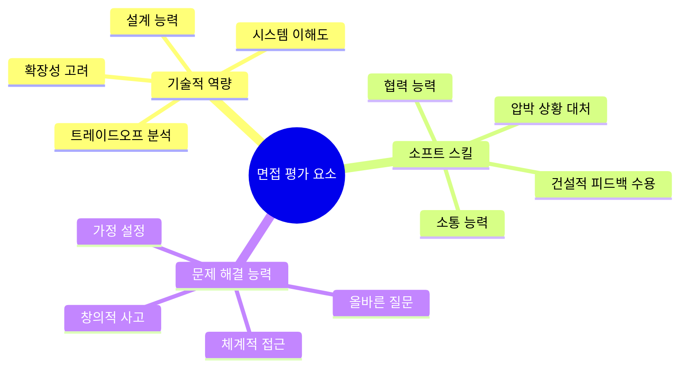
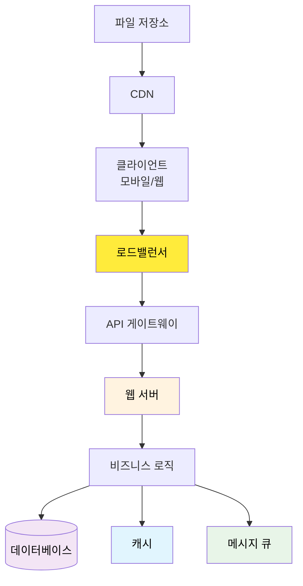
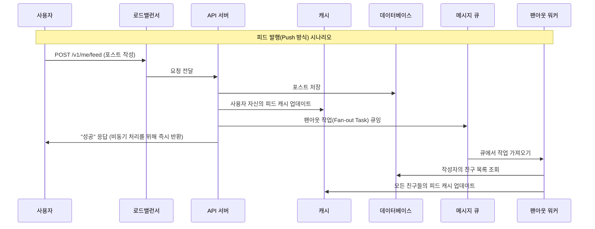
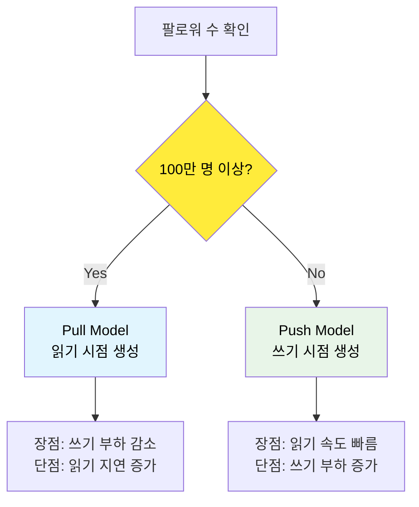
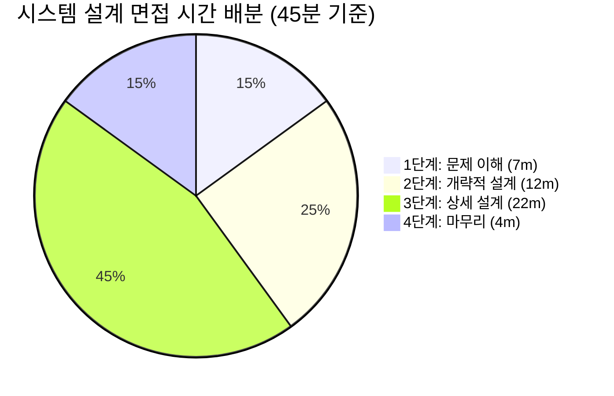

## 시작하며

가면사배 스터디 2주차입니다! 지난 2장에서는 시스템의 규모를 가늠해보는 **개략적인 규모 추정**에 대해 배웠습니다. 2장을 공부할 때만 해도 "10억 명의 사용자가 접속하면 서버가 몇 대 필요할까?" 같은 계산에 머리가 지끈거렸던 기억이 나네요. 하지만 이번 3장에서는 그런 기술적인 계산보다 훨씬 더 중요한 이야기를 다룹니다. 바로 실제 면접 상황에서 어떻게 대처해야 하는지, 즉 **시스템 설계 면접 공략법**입니다.

처음 이 장을 읽었을 때는 "면접 기술이 그렇게 중요한가? 그냥 기술 공부만 열심히 하면 되는 거 아냐?"라는 생각이 들기도 했어요. 하지만 내용을 깊게 읽어보니 시스템 설계 면접은 단순히 지식을 뽐내는 자리가 아니라, **동료와 함께 복잡하고 모호한 문제를 풀어가는 과정을 시뮬레이션**하는 것이더라고요. 개발자로서 설계 능력을 보여주는 것도 중요하지만, 소통하고 협력하는 태도가 얼마나 큰 비중을 차지하는지 깨닫게 된 계기가 되었습니다.

스터디 동기들과도 이 부분에 대해 열띤 토론을 나누었는데요. "우리가 과연 실무에서 동료와 설계 논의를 할 때 어떻게 행동했는가?"를 되돌아보니, 책에서 말하는 면접 전략이 곧 좋은 시니어 개발자로 가는 길이라는 확신이 들었습니다. 제가 느낀 핵심 노하우들을 정리해서 공유해보려고 합니다.

## 시스템 설계 면접의 본질

시스템 설계 면접의 진짜 목적은 무엇일까요? 책에서는 아주 멋진 문장으로 정의하고 있습니다.

> "시스템 설계 면접은 두 명의 동료가 모호한 문제를 풀기 위해 협력하여 해결책을 찾아내는 과정에 대한 시뮬레이션입니다."

이 문장을 읽고 나서 면접에 대한 긴장감이 조금은 설렘으로 바뀌었던 것 같아요. 면접관은 저를 평가하기만 하는 무서운 사람이 아니라, 잠재적인 팀원으로서 함께 화이트보드 앞에서 고민하는 파트너인 셈이죠. 실제로 실무에서도 기획자가 "이런 기능을 만들고 싶어요"라고 모호하게 던져주면, 엔지니어가 질문을 통해 구체화해 나가는 과정이 매일 반복되는데 바로 그 모습을 보고 싶어 하는 것입니다.

이 면접의 가장 큰 특징은 **정해진 정답이 없다**는 것입니다. 설계 과정 자체가 결과보다 훨씬 중요하며, 면접관은 제가 기술적으로 얼마나 박학다식한지보다는 다음과 같은 요소들을 유심히 살펴봅니다.

1. **소통 능력**: 모호한 문제를 해결하기 위해 적절한 질문을 던지는가?
2. **협력 태도**: 피드백을 건설적으로 수용하고 설계를 개선해 나가는가?
3. **논리적 사고**: 설계 결정마다 타당한 근거(Reasoning)를 제시하는가?
4. **문제 해결 능력**: 복잡한 문제를 작은 단위로 쪼개어 접근하는가?

특히 **트레이드오프(Trade-off)** 분석 능력이 핵심입니다. 모든 선택에는 장단점이 있기 마련이죠. 예를 들어, 데이터 일관성을 위해 성능을 조금 포기할지, 아니면 사용자 경험을 위해 최종 일관성(Eventual Consistency)을 택할지 논리적으로 설명할 수 있어야 합니다. 

실무에서도 항상 마주하는 선택의 연속인데, 면접관은 바로 그 선택의 과정을 보고 싶어 하는 것 같아요. "이게 무조건 맞습니다"라고 고집하는 게 아니라, "현재 요구사항이 실시간성이 중요하니 가용성을 높이는 대신 일관성을 조금 양보하는 방향이 좋겠습니다"라고 말하는 유연함이 필요합니다.



면접에서 보여줄 수 있는 긍정적인 신호와 부정적인 신호를 표로 정리해봤습니다. 평소 자신의 면접 스타일이 어디에 가까운지 체크해보면 좋을 것 같아요.

| 긍정적 신호 (Green Flag) | 부정적 신호 (Red Flag) |
| :--- | :--- |
| 요구사항 명확화를 위한 질문 | 요구사항 확인 없이 바로 답부터 제시 |
| 가정 사항을 명시하고 기록 | 가정 없이 자기만의 생각으로 진행 |
| 여러 해결책을 제시하고 비교 | 단일 해결책만 정답인 양 고집 |
| 트레이드오프 분석 (장단점 파악) | 필요 이상의 과도한 엔지니어링 |
| 면접관과의 능동적이고 협력적인 소통 | 완고하거나 편협한 태도 |
| 피드백을 수용하여 설계를 개선 | 비판에 대한 방어적이고 공격적인 태도 |

이 부분을 읽으면서 "아, 나도 가끔은 정답을 빨리 말해야 한다는 압박감에 질문도 없이 키보드부터 두드린 적이 있었지"라는 반성을 하게 되더라고요. 특히 **요구사항 명확화**는 실무에서도 기획자와 소통할 때 가장 중요한 단계인데, 면접에서도 역시 그 가치가 증명되는 것 같습니다.

## 효과적 면접을 위한 4단계 접근법

책에서는 면접 시간을 효과적으로 활용하기 위한 4단계 프로세스를 제안합니다. 이 프레임워크를 머릿속에 넣어두면 어떤 복잡한 문제가 나와도 당황하지 않고 차근차근 풀어나갈 수 있을 것 같아요.

### 1단계: 문제 이해 및 설계 범위 확정 (3-10분)

가장 흔히 하는 실수가 문제가 던져지자마자 바로 설계를 시작하는 것입니다. 책에서는 이런 지원자를 **지미(Jimmy)**라고 부며 경고하는데요. 아무리 뛰어난 엔지니어라도 요구사항을 잘못 이해하고 만든 시스템은 가치가 없기 때문입니다. 

> "천재적인 설계도 요구사항에 어긋나면 쓰레기에 불과합니다. 지미가 되지 말고 질문자가 되세요."

이 단계를 건너뛰면 면접 중반에 "아, 사실 동영상 스트리밍도 지원해야 하는데요?" 같은 말을 듣고 전체 설계를 뒤엎어야 하는 끔찍한 상황이 벌어질 수 있습니다. 질문을 던지는 것은 실력이 부족해서가 아니라, 오히려 **신중하고 꼼꼼한 엔지니어**라는 증거입니다.

질문은 크게 세 가지 카테고리로 나누어 생각하면 좋습니다.

1. **기능적 요구사항(Functional Requirements)**
   - 시스템이 수행해야 할 핵심 기능은 무엇인가? (포스트 작성, 피드 조회, 친구 추가 등)
   - 사용자 층은 누구이며, 어떤 플랫폼(iOS, Android, Web 등)을 지원해야 하는가?
   - 가장 우선순위가 높은 기능은 무엇인가? (MVP - Minimum Viable Product 정의)

2. **비기능적 요구사항(Non-functional Requirements)**
   - 일간 능동 사용자(DAU)는 얼마나 되는가? (천만 명? 일억 명?)
   - 읽기 중심인가, 쓰기 중심인가? (Read/Write Ratio - 보통 소셜 미디어는 100:1 이상으로 읽기가 많습니다.)
   - 허용 가능한 지연 시간(Latency)과 가용성(Availability) 수준은 어느 정도인가? (99.9%? 99.99%?)
   - 데이터 일관성 모델은 무엇을 선호하는가? (강한 일관성 vs 최종 일관성)

3. **기술적 제약사항 및 범위**
   - 회사가 이미 사용 중인 특정 기술 스택이 있는가?
   - 서비스 규모가 얼마나 빨리 확장될 것으로 예상하는가?
   - 예산이나 하드웨어 자원의 제약이 있는가?

뉴스 피드 시스템을 설계하라는 질문을 받았을 때, 면접관과 나눌 수 있는 대화를 시뮬레이션해본 표입니다. 이 대화가 끝나면 머릿속에 시스템의 대략적인 '체급'이 그려지게 됩니다.

| 지원자 질문 | 면접관 답변 | 개인적인 생각 |
| :--- | :--- | :--- |
| "모바일 앱과 웹 앱 가운데 어느 것을 지원해야 하나요?" | "둘 다 지원해야 합니다." | API 설계 시 공통 엔드포인트를 고민해야겠구나. |
| "가장 중요한 기능은 무엇인가요?" | "포스트 올리기와 친구 피드 보기입니다." | 나머지 기능은 나중에 곁가지로 붙이면 되겠네. |
| "뉴스 피드는 시간 역순으로 정렬되나요?" | "단순하게 시간 역순이라고 가정합시다." | 복잡한 추천 알고리즘보다는 인덱싱 전략이 중요하겠군. |
| "한 사용자는 최대 몇 명과 친구를 맺을 수 있나요?" | "5,000명입니다." | 팬아웃(Fan-out) 시 최악의 경우를 계산할 수 있겠다. |
| "일간 능동 사용자(DAU)는 얼마나 되나요?" | "천만 명(10M)입니다." | 단순 DB 쿼리로는 버티기 힘들겠는데? 캐시 도입 필수! |
| "피드에 이미지나 비디오도 올라올 수 있나요?" | "네, 미디어 파일도 지원해야 합니다." | CDN과 별도의 미디어 업로드 처리 로직이 필요하겠어. |
| "최대 지연 시간 요구사항이 있나요?" | "조회 시 200ms 이내면 좋겠습니다." | 대부분의 데이터는 캐시(In-memory)에서 처리해야겠군. |

이렇게 질문을 통해 요구사항을 확정하고 나면 비로소 "우리가 무엇을 만들어야 하는지"가 명확해집니다. 이 단계가 끝나면 면접관에게 **"지금까지 정리한 요구사항을 바탕으로 설계를 진행해도 될까요?"**라고 한 번 더 확인을 구하는 것이 좋습니다. 이런 사소한 절차가 면접관에게 신뢰를 주더라고요.

### 2단계: 개략적인 설계안 제시 및 동의 구하기 (10-15분)

요구사항이 정해졌다면 전체적인 그림을 그려야 합니다. 화이트보드에 핵심 컴포넌트들을 배치하고 연결하는 단계죠. 처음부터 너무 세세한 설정(DB 테이블 컬럼 등)에 집착하기보다는 시스템의 **청사진(Blueprints)**을 보여주는 것이 중요합니다. 

이 단계에서는 다음과 같은 작업들을 병행하게 됩니다.

1. **핵심 컴포넌트 설계**: API 서버, 로드밸런서, DB, 캐시 등 큰 덩어리를 배치합니다.
2. **개략적 계산 (Back-of-the-envelope estimation)**: 2장에서 배웠던 기술을 발휘할 시간입니다. 이 시스템이 요구사항을 만족할 수 있을지 숫자로 검증해봅니다.
3. **사용 사례(Use Case) 검토**: 핵심 플로우를 따라가며 시스템이 어떻게 동작하는지 설명합니다.



뉴스 피드 시스템의 경우 크게 두 가지 핵심 플로우로 나뉘는데요. 각 플로우를 면접관에게 소리 내어 설명하며 동의를 구하는 것이 포인트입니다.

- **피드 발행(Feed Publishing)**: 사용자가 새 포스트를 올리면 API 서버가 데이터를 받고, 포스트 DB에 저장한 뒤 친구들의 뉴스 피드 캐시를 업데이트하는 과정입니다.
- **피드 생성(Feed Generation)**: 사용자가 뉴스 피드를 조회하면, 이미 업데이트되어 있는 캐시에서 피드 목록을 가져와서 빠르게 보여줍니다.

#### 개략적인 규모 추정 해보기 (Back-of-the-envelope)

뉴스 피드 시스템의 DAU가 1,000만 명이라면, 초당 평균 쿼리(QPS)는 얼마나 될까요? 
- **조회(Read) QPS**: `10,000,000 DAU * 20 (하루 평균 조회 횟수) / 86,400초 ≈ 2,315 QPS`
- **피크(Peak) QPS**: 대략 평균의 2배인 `4,600 QPS` 이상
- **저장(Write) 요구량**: 하루 1,000만 명이 각 1개의 포스트를 올린다고 하면, `10^7 * 10KB (텍스트+메타데이터) = 100GB/day`. 1년이면 약 `36TB`의 저장 공간이 필요합니다.

이렇게 숫자를 제시하면 "아, 서버 한 대로는 힘들겠고 로드밸런싱과 오토 스케일링이 필요하겠군요"라는 논리적인 근거가 생깁니다. 또한 36TB라는 숫자를 통해 "단일 DB 서버로는 한계가 있으니 나중에 샤딩(Sharding)을 고민해야겠네요"라는 복선을 깔아둘 수도 있습니다.

면접관에게 **"이 부분에 대해 구체적인 계산을 더 해볼까요, 아니면 설계를 계속 진행할까요?"**라고 물어보는 것도 아주 영리한 소통 전략입니다. 만약 면접관이 "계산은 충분합니다"라고 한다면 바로 다음 단계로 넘어가 시간을 아낄 수 있거든요.

#### 사용 사례 검토 (Dry-run)

전체 구조를 그렸다면 "사용자 A가 포스트를 올렸을 때 사용자 B의 피드에 어떻게 나타나는지" 한 번 훑어봅니다. 이 과정에서 "어? 친구가 10,000명이면 10,000명에게 일일이 데이터를 밀어주는 건 너무 느리지 않을까요?" 같은 잠재적 문제점을 스스로 발견할 수 있습니다. 면접관은 스스로의 설계에서 허점을 찾고 개선하려는 모습에 높은 점수를 주더라고요.

이 단계에서 중요한 건 **면접관을 팀원처럼 대하는 것**입니다. "이런 구조로 생각하고 있는데, 혹시 더 고려해야 할 부분이 있을까요?"라고 물어보며 합의를 도출하는 태도가 인상적이었어요. 독단적으로 그림을 다 그린 뒤 통보하는 게 아니라, 함께 빌드업해나가는 과정이 시스템 설계 면접의 묘미입니다.

### 3단계: 상세 설계 (10-25분)

이제 전체 구조 중 가장 중요하거나 도전적인 부분을 깊이 있게 파고듭니다. 모든 컴포넌트를 다 자세히 설명할 시간은 부족하므로, 면접관과 상의하여 **어떤 부분을 깊게 다룰지 우선순위**를 정해야 합니다.

이때 면접관이 기대하는 수준은 경력에 따라 조금씩 다릅니다.

- **주니어**: 기본적인 컴포넌트 간의 상호작용, 데이터 베이스 스키마, API 설계, 에러 처리와 같은 구현의 안정성을 봅니다.
- **시니어**: 시스템의 성능 병목 지점, 자원 사용량 추정, 특정 기술 선택의 근거와 트레이드오프를 봅니다.
- **그 이상**: 시스템 전체의 확장성, 가용성, 데이터 일관성, 운영의 용이성 등을 아우르는 아키텍처적 깊이를 봅니다.

뉴스 피드 시스템에서 피드 발행 플로우를 더 상세하게 들여다본다면 다음과 같은 시퀀스 다이어그램을 그려볼 수 있습니다.



#### 팬아웃(Fan-out) 전략의 심층 분석

뉴스 피드 시스템에서 가장 재미있는 주제는 바로 **팬아웃(Fan-out)** 전략입니다. 사용자가 올린 포스트를 팔로워들에게 어떻게 전달할 것인가에 대한 고민이죠. 

- **Push 방식(쓰기 시점 생성)**: 포스트가 올라오는 즉시 팔로워들의 피드 캐시에 데이터를 넣어둡니다. 
  - **장점**: 읽기 시점에 이미 피드가 준비되어 있어 조회가 매우 빠릅니다.
  - **단점**: '핫스팟(Hotspot)' 문제가 생깁니다. 팔로워가 수천만 명인 유명인이 포스트를 올리면 쓰기 부하가 엄청나게 커져서 시스템이 마비될 수 있어요.
- **Pull 방식(읽기 시점 생성)**: 사용자가 접속할 때 비로소 친구들의 포스트를 가져와서 피드를 만듭니다. 
  - **장점**: 포스트 작성 시 부하가 거의 없습니다. 유명인 대응에 유리하죠.
  - **단점**: 사용자가 피드를 열 때마다 연산을 해야 하므로 응답 시간이 길어질 수 있습니다.

| 특성 | Push 방식 (Fan-out on Write) | Pull 방식 (Fan-out on Load) |
| :--- | :--- | :--- |
| **읽기 속도** | 매우 빠름 (캐시에서 즉시 조회) | 상대적으로 느림 (실시간 연산 필요) |
| **쓰기 부하** | 높음 (팔로워 수에 비례) | 낮음 (본인 DB에만 저장) |
| **추천 시점** | 포스트 작성 시 | 피드 조회 시 |
| **유명인 대응** | 매우 어려움 (부하 폭발) | 쉬움 |



실무에서는 보통 이 둘을 섞은 **하이브리드 전략**을 씁니다. 일반적인 관계에서는 Push 방식을 써서 사용자 경험을 높이고, 팔로워가 아주 많은 연예인 같은 경우에만 Pull 방식을 적용하는 식이죠. 

#### 피드 생성 최적화 과정

피드 생성을 최적화하기 위해 우리가 거치는 논리적인 단계는 다음과 같습니다.
1. **캐시 확인**: 사용자의 피드 캐시(Feed Cache)에 데이터가 있는지 먼저 확인합니다.
2. **캐시 미스 처리**: 캐시에 데이터가 없거나 모자라면 DB에서 친구 목록을 가져오고, 그들의 최근 포스트를 쿼리합니다.
3. **정렬 및 개인화**: 가져온 포스트들을 시간순으로 정렬하거나, 머신러닝 모델을 통해 개인화된 점수를 매깁니다.
4. **캐시 업데이트**: 생성된 피드를 캐시에 저장하여 다음 요청 때 더 빠르게 응답할 수 있도록 합니다.

여기서 간단하게 팬아웃 작업을 큐에 담는 의사코드를 작성해본다면 이런 느낌일 것 같아요.

```typescript
// 팬아웃 워커 예시 (Pseudo-code)
async function fanOutPost(postId: string, authorId: string) {
  // 1. 작성자의 친구/팔로워 목록을 DB나 캐시에서 조회
  const followers = await db.getFollowers(authorId);
  
  // 2. 각 팔로워의 피드 캐시에 새 포스트 ID를 추가
  for (const followerId of followers) {
    if (isCelebrity(authorId)) {
      // 유명인이라면 Push 하지 않고 패스 (Pull 방식 유도)
      continue;
    }
    // 각 팔로워별 Redis List나 Sorted Set에 포스트 ID 추가
    await cache.addToFeed(followerId, postId);
  }
}
```

실제로 제가 담당하는 서비스에서도 특정 이벤트가 발생했을 때 연관된 사용자들에게 데이터를 전파해야 하는 로직이 있었는데, 이 팬아웃 개념을 적용해보니 성능 개선의 실마리가 보이더라고요. "왜 이 부분을 비동기로 처리해야 하는가?"에 대한 답을 찾는 과정이 상세 설계의 묘미입니다.

### 4단계: 마무리 (3-5분)

마지막으로 전체 설계를 요약하고 남은 개선점을 논의합니다. 설계가 끝났다고 해서 바로 짐을 싸면 안 됩니다! 시간이 부족해서 다루지 못한 에지 케이스나, 운영 관점의 이슈들을 가볍게 언급하며 마무리하면 완벽합니다.

이 단계에서는 다음과 같은 주제들을 던져볼 수 있습니다.

1. **병목 구간 식별**: "지금 설계에서 DB 쓰기 부하가 여전히 걱정되는데, 나중에 샤딩(Sharding)을 도입하면 좋겠습니다."
2. **운영 및 모니터링**: "시스템이 정상적으로 동작하는지 알기 위해 에러율, QPS, 캐시 히트율 등을 모니터링해야 합니다."
3. **미래 확장성**: "현재는 1,000만 명 기준이지만, 1억 명이 되면 데이터 센터를 다중화해야 할 수도 있습니다."

| 장애 유형 | 대응 방안 | 운영 관점의 포인트 |
| :--- | :--- | :--- |
| **데이터베이스 장애** | 읽기 전용 복제본으로 자동 페일오버(Failover) | Replication 지연 시간 모니터링 |
| **캐시 장애** | 캐시 우회(Fallback) 및 점진적 복구 | DB 부하 폭발 방지 (Thundering Herd) |
| **네트워크 분할** | 각 지역별 독립적 서비스 제공 | 데이터 정합성 유지 전략 |

#### 확장성 로드맵 (Scalability Roadmap)

설계안이 현재 요구사항을 넘어서 어떻게 진화할 수 있는지 보여주는 것도 큰 가산점 요인입니다.
- **현재**: 1,000만 DAU 지원 (단일 지역, 캐싱 최적화)
- **단기**: 5,000만 DAU (DB 샤딩 도입, 전역 캐시 확장)
- **장기**: 1억 DAU 이상 (멀티 리전 배포, 마이크로서비스로의 완전한 분리)

운영적인 측면에서는 **Prometheus나 Grafana**를 통한 메트릭 수집, **ELK 스택**을 활용한 중앙화된 로그 수집 등을 언급하면 "이 친구는 실제로 시스템을 운영해본 경험이 있구나"라는 인상을 줄 수 있습니다. 완벽한 설계보다는 **지속적으로 발전 가능한 설계**를 보여주는 것이 훨씬 현실적이고 프로페셔널해 보이더라고요.

## 시간 배분 전략

45분이라는 짧은 시간 동안 이 모든 단계를 소화하려면 철저한 시간 관리가 필요합니다. 책에서 권장하는 배분 비율을 파이 차트로 그려봤습니다.



생각보다 **상세 설계**에 가장 많은 시간(22분 내외)을 써야 합니다. 반대로 말하면 1, 2단계에서 너무 시간을 끌면 정작 중요한 깊이 있는 논의를 못 하게 된다는 뜻이죠. 

| 단계 | 시간 가이드 | 체크포인트 |
| :--- | :--- | :--- |
| **1단계** | 3-10분 | 10분이 넘어가면 질문을 멈추고 설계를 시작해야 합니다. |
| **2단계** | 10-15분 | 25분 지점에는 전체 구조도가 그려져 있어야 합니다. |
| **3단계** | 10-25분 | 핵심 컴포넌트 1-2개에 집중하여 40분까지 진행합니다. |
| **4단계** | 3-5분 | 마지막 5분은 반드시 남겨서 요약과 운영 이슈를 논의합니다. |

실제로 제가 모의 면접을 해보니 요구사항을 묻다가 15분이 훌쩍 지나버리는 경우가 많더라고요. "요구사항이 어느 정도 정리되었으니, 이제 전체적인 그림을 그려보겠습니다"라는 **단계 전환 멘트**를 미리 준비해두는 것이 정말 큰 도움이 되었습니다.

- **전환 멘트 예시 1**: "요구사항이 명확해졌으니, 이제 개략적인 설계안을 그려보겠습니다."
- **전환 멘트 예시 2**: "전체 구조에 대해 동의해주셨으니, 방금 말씀하신 [팬아웃] 부분을 상세히 다뤄볼까요?"
- **전환 멘트 예시 3**: "시간 관계상 지금까지의 설계를 정리하고, 운영 측면에서 개선할 점을 말씀드리겠습니다."

시계나 타이머를 중간중간 확인하면서 20% 이상의 시간이 지체되었다 싶으면 과감하게 다음 단계로 넘어가는 결단력이 필요합니다. 4단계 마무리 시간을 확보하지 못하는 것이 가장 큰 Red Flag 중 하나라고 하니 주의해야겠어요.

## 실전 면접 전략

성공적인 면접을 위해 반드시 기억해야 할 Do's and Don'ts입니다. 리스트로 정리해보니 제가 과거에 했던 실수들이 몇 가지 보이더라고요.

### ✅ 해야 할 것 (Do's)
- **질문을 통해 요구사항 확인**: 모르는 건 부끄러운 게 아닙니다. 질문하지 않고 설계하는 게 더 무서운 일이에요.
- **가정 사항 명시 및 기록**: "동시 접속자 수는 10만 명이라고 가정하겠습니다"라고 말하고 화이트보드 한구석에 적어두세요. 설계의 나침반이 됩니다.
- **사고 과정 소리 내어 설명**: 면접관은 여러분의 뇌 속을 들여다보고 싶어 합니다. 침묵 속의 천재보다는 떠벌이 엔지니어가 낫습니다.
- **여러 해결책 제시 및 비교**: "DB 복제를 쓸 수도 있고, 캐시를 앞단에 둘 수도 있는데 여기서는 ~가 더 유리해 보입니다"라고 트레이드오프를 논의하세요.
- **건설적 피드백 수용**: 면접관의 힌트는 생명줄입니다. 고집 피우지 말고 즉시 설계에 반영하는 유연함을 보여주세요.

### ❌ 하지 말아야 할 것 (Don'ts)
- **지미가 되지 말기**: 요구사항 확인 없이 바로 아키텍처부터 그리지 마세요.
- **침묵 속의 설계**: 혼자서 5분 동안 그림만 그리고 있으면 면접관은 지루해집니다.
- **세부사항에 매몰**: 처음부터 DB 인덱스 종류나 함수 매개변수 이름에 집착하지 마세요. 큰 그림이 먼저입니다.
- **방어적 태도**: 자신의 설계에 대한 비판을 인신공격으로 받아들이지 마세요. 설계는 원래 완벽할 수 없습니다.

가장 인상 깊었던 조언은 **"포기하지 말라"**는 것이었습니다. 설계가 꼬이거나 막다른 길에 다다른 것 같아도, 면접관에게 도움을 요청하고 함께 돌파구를 찾는 모습 자체가 엔지니어로서의 훌륭한 자질로 평가받을 수 있거든요. "제가 이 부분에서 막혔는데, 보통 이런 상황에서는 어떤 접근을 선호하시나요?"라고 물어보는 것도 실력입니다.

## 면접 성공을 위한 실무 팁

어떤 시스템이 나와도 당황하지 않으려면 자주 출제되는 유형별로 핵심 포인트를 미리 익혀두는 것이 좋습니다. 또한, 자신의 연차에 맞는 기대 수준이 무엇인지 파악하는 것도 중요하더라고요.

### 기술적 깊이 vs 폭의 균형 (레벨별 기대 수준)

| 레벨 | 기술적 깊이 | 설계의 폭 | 주요 평가 포인트 |
| :--- | :--- | :--- | :--- |
| **주니어** | 기본 컴포넌트(DB, 캐시) 이해 | 단순한 3-Tier 구조 | 기초 지식, 학습 의지, 코드 품질 |
| **미드레벨** | 성능 최적화, 병목 지점 파악 | MSA, 서비스 간 통신 | 트레이드오프 분석, 확장성 고려 |
| **시니어** | 분산 시스템의 근본 원리 | 복잡한 에코시스템 설계 | 리더십, 기술 전략, 운영 안정성 |

### 핵심 시스템 컴포넌트 상세 준비사항

면접관이 특정 컴포넌트에 대해 깊게 물어볼 때를 대비해 아래 표의 내용 정도는 숙지하고 있으면 좋습니다.

| 컴포넌트 | 핵심 키워드 | 고려해야 할 트레이드오프 |
| :--- | :--- | :--- |
| **로드밸런서** | L4/L7, 라운드로빈, 최소 연결 | 가용성 vs 복잡성, 세션 유지(Sticky Session) |
| **캐시** | Cache-aside, Write-through, LRU | 데이터 정합성(Consistency) vs 응답 속도 |
| **데이터베이스** | 샤딩, 복제, ACID, NoSQL | 수평적 확장성 vs 조인(Join)의 어려움 |
| **메시지 큐** | Pub/Sub, Kafka, RabbitMQ | 순서 보장(Ordering) vs 처리량(Throughput) |

또한, 실무에서도 새로운 기능을 붙일 때 "여기에 메시지 큐를 넣으면 서비스 간 결합도를 낮출 수 있겠네"라고 생각하는 훈련을 평소에 해두면 면접에서도 자연스럽게 나오더라고요.

## 한 걸음 더 나아가기: 심화 학습 주제

면접에서 "더 개선할 방법이 있을까요?"라는 질문을 받았을 때 답변할 수 있는 고급 패턴들을 몇 가지 정리해봤습니다. 이 내용까지 언급한다면 면접관에게 확실한 인상을 남길 수 있을 거예요.

- **장애 전파 방지 (Circuit Breaker)**: 특정 서비스에 장애가 났을 때 전체 시스템으로 번지지 않도록 차단하는 패턴입니다. 예를 들어, 피드 생성 서버가 외부 추천 엔진 서버의 장애로 인해 함께 죽는 것을 방지할 수 있습니다. "넷플릭스의 Hystrix나 Resilience4j 같은 라이브러리의 개념을 도입해볼 수 있겠네요"라고 덧붙여보세요.
- **분산 트랜잭션 관리 (Saga Pattern)**: 마이크로서비스 환경에서 여러 DB의 데이터 일관성을 맞추기 위한 기법입니다. 포스트 저장과 피드 업데이트가 서로 다른 서비스라면, 하나가 실패했을 때 보상 트랜잭션을 실행하는 등의 복잡한 처리가 필요하더라고요.
- **명령과 조회 분리 (CQRS)**: 데이터를 변경하는 로직(Command)과 조회하는 로직(Query)을 분리하여 각각 최적화하는 방식입니다. 뉴스 피드처럼 읽기 부하가 압도적인 시스템에서는 읽기 전용 DB를 따로 두거나, NoSQL을 활용해 미리 정규화된 데이터를 저장해두는 방식이 아주 효과적입니다.
- **우아한 성능 저하 (Graceful Degradation)**: 서버 부하가 극도로 높을 때 덜 중요한 기능(예: 실시간 인기 게시물, 추천 친구 목록)은 잠시 생략하고 핵심 기능(뉴스 피드 목록)만 제공하는 전략입니다. 사용자에게 "서버 점검 중" 에러를 보여주는 것보다 훨씬 나은 사용자 경험을 제공하죠.

이런 고급 주제들은 단순히 이름을 아는 것보다 **"왜 이 상황에서 이 패턴이 필요한가"**를 설명하는 것이 훨씬 중요합니다. 스터디를 하면서 이런 아키텍처 패턴들을 하나씩 알아가는 재미가 쏠쏠하더라고요. 실제 대규모 서비스를 운영하는 회사들의 기술 블로그를 보면 이런 패턴들이 어떻게 적용되었는지 생생하게 확인할 수 있습니다.

## 실무에 적용할 수 있는 인사이트들

이번 장을 공부하며 제 실무 환경에 비추어 본 5가지 핵심 인사이트입니다.

### 1. 협력적 문제 해결의 가치
- 시스템 설계는 혼자 하는 예술이 아니라 팀이 함께 만드는 공학입니다.
- 실무에서도 동료의 피드백을 빠르게 반영하고 더 나은 방향을 찾는 태도가 시스템의 품질을 결정하더라고요. 면접관을 '나를 평가하는 사람'이 아니라 '나와 함께 일할 동료'로 대하는 연습을 해보세요.

### 2. 점진적 구체화의 힘
- 처음부터 완벽한 클래스 다이어그램이나 DB 스키마를 그리려 하지 마세요.
- 큰 그림(High-level)에서 시작해서 병목이 예상되는 곳을 점진적으로 파고드는 방식이 복잡성을 다루는 가장 효율적인 방법입니다. 이 방식은 실제 프로젝트 설계를 할 때도 문서화의 순서로 활용하기 좋습니다.

### 3. 트레이드오프에 대한 집착
- "이게 좋습니다"가 아니라 "이런 상황에서는 A가 좋지만, 저런 상황에서는 B가 유리합니다"라고 말할 수 있어야 합니다.
- 정답이 없는 설계 세계에서 논리적인 근거를 갖추는 연습이 주니어와 시니어를 나누는 분기점인 것 같아요. 평소에 기술 블로그를 읽을 때도 "왜 이 기술을 선택했는지"에 집중해서 읽어보시길 추천합니다.

### 4. 운영과 모니터링을 고려한 설계
- 설계가 끝났다고 해서 시스템이 완성된 게 아닙니다. 
- 어떻게 운영할지, 장애가 났을 때 어떻게 알 수 있을지를 설계 단계에서 미리 고민하는 습관이 실무에서 큰 장애를 막아줍니다. "로그를 남기는 건 성능에 영향을 줄 수 있지만, 장애 추적을 위해 필수적입니다" 같은 멘트가 면접의 격을 높여줍니다.

### 5. 문서화의 중요성 (스터디를 통해 느낀 점)
- 설계를 말로만 하는 것보다 다이어그램으로 시각화하고 텍스트로 정리하는 과정에서 논리적 허점이 발견되더라고요.
- 이번 3장 스터디를 준비하며 정리한 내용들이 실제 제 업무 일지나 설계 문서의 템플릿으로도 활용될 수 있을 것 같아 매우 뿌듯했습니다. 여러분도 자신만의 '설계 체크리스트'를 만들어보시는 건 어떨까요?

## 마무리

이번 3장은 기술적인 내용보다는 **커뮤니케이션과 문제 해결 방식**에 대해 깊이 고민해볼 수 있는 시간이었습니다. "시스템 설계 면접은 정답을 맞추는 퀴즈가 아니라, 동료와 함께 문제를 해결하는 협력적 과정이다"라는 메시지가 마음속에 깊게 남았어요.

처음에는 면접 전략이라고 해서 '어떻게 하면 면접관을 속일까?' 하는 얕은 기술을 기대했을지도 모릅니다. 하지만 책을 덮고 나니 결국 **진정성 있는 소통과 엔지니어링에 대한 논리적 근거**가 전부라는 걸 알게 되었습니다. 평소 개발을 할 때도 "이 코드가 왜 최선인가?"라고 스스로 묻고 답변하는 연습을 한다면, 실제 면접장에서도 당황하지 않고 자신의 논리를 펼칠 수 있을 것 같습니다.

이번 스터디를 통해 저도 제가 가진 고정관념을 많이 깰 수 있어서 정말 좋았습니다. 특히 "지미가 되지 말자"라는 문구는 앞으로 제 책상 앞에 붙여두고 싶을 정도예요.

다음 포스트에서는 4장 **"처리율 제한 장치의 설계"**를 다룰 예정입니다. API를 과도한 요청으로부터 보호하는 방패 역할을 하는 아주 중요한 컴포넌트인데, 실제 실무에서 Rate Limiting을 어떻게 구현하는지, 처리율 제한 알고리즘(Token Bucket, Leaking Bucket 등)은 각각 어떤 특징이 있는지 궁금하시다면 다음 편도 기대해주세요! 

가면사배 시리즈는 계속됩니다. 긴 글 읽어주셔서 감사합니다!


### 🤔 면접 접근 방식에 대한 질문

- **면접관의 침묵 대응**: 면접관이 너무 말을 안 하거나 피드백이 없을 때는 어떻게 소통을 유도하는 게 좋을까요? "혹시 제가 너무 세부적인 내용에 집중하고 있나요?"라고 먼저 물어보는 건 어떨까요?
- **가정 수정의 기술**: 설계 도중 제가 세운 가정이 틀렸다는 걸 깨달았을 때, 당황하지 않고 자연스럽게 설계를 수정하는 팁이 있을까요? 실수를 인정하고 "아, 아까 말씀하신 사용자 규모를 생각해보니 이 구조보다는 저 구조가 더 적합하겠네요"라고 논리적으로 선회하는 모습이 더 매력적이지 않을까요?
- **다이어그램의 수준**: 45분이라는 짧은 시간 내에 다이어그램의 정밀도는 어느 정도가 적당할까요? 너무 대충 그리면 실력이 없어 보일까 봐 걱정되고, 너무 열심히 그리면 시간이 부족할 것 같아 고민입니다.

### 🛠️ 실전 전략에 대한 질문

- **해결책 제시의 적정선**: 여러 해결책을 제시할 때, 보통 몇 가지 정도를 제안하는 것이 면접관 입장에서 가장 지루하지 않고 설득력 있을까요? (저는 보통 장단점이 뚜렷한 2가지 정도를 제시하고 하나를 선택하는 편입니다.)
- **주니어의 고난도 질문 대응**: 주니어 개발자가 시니어급 면접 질문(확장성, 가용성 등)을 받았을 때, 경험이 부족하더라도 답변할 수 있는 최선의 전략은 무엇일까요? 이론적인 지식이라도 논리적으로 풀어내는 것이 중요할까요?
- **드로잉 툴 활용 노하우**: 화이트보드나 온라인 드로잉 툴(Excalidraw, Miro 등)을 쓸 때, 가독성을 높이는 본인만의 노하우가 있으신가요? (예를 들어, 핵심 컴포넌트는 항상 같은 색으로 칠한다거나 하는 규칙들요.)

### 🏗️ 시스템 설계 역량에 대한 질문

- **설계 감각 키우기 루틴**: 평소에 실무를 하면서 시스템 설계 감각을 익히기 위해 어떤 루틴이나 학습 방법을 가지고 계신가요? 저는 유명한 기업의 기술 블로그를 매주 한 편씩 정독하고 다이어그램을 따라 그려보는 연습을 하고 있습니다.
- **까다로운 질문 돌파기**: 설계 면접에서 가장 대답하기 까다로웠던 질문이나 주제는 무엇이었나요? "전 세계 서버의 시간을 어떻게 동기화할 것인가?" 같은 분산 시스템의 난제들은 어떻게 돌파하셨는지 궁금합니다.
- **좋은 설계의 정의**: 좋은 설계안을 보고 "아, 이건 정말 잘 짰다"라고 느끼게 만드는 핵심 포인트는 무엇이라고 생각하시나요? 저는 '단순함'과 '확장성' 사이의 절묘한 균형이라고 생각하는데, 다른 분들의 의견도 듣고 싶습니다.

댓글로 공유해주시면 함께 배워나갈 수 있을 것 같습니다!
