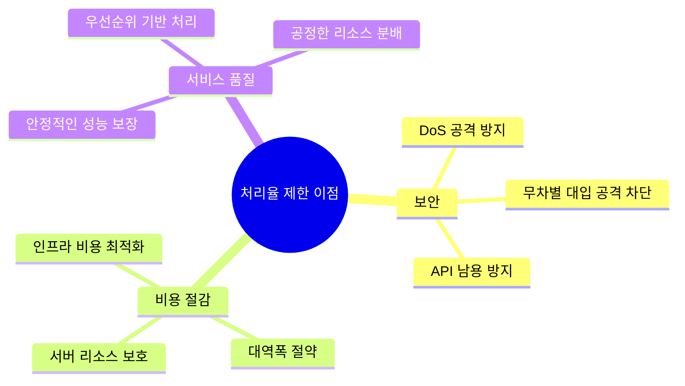
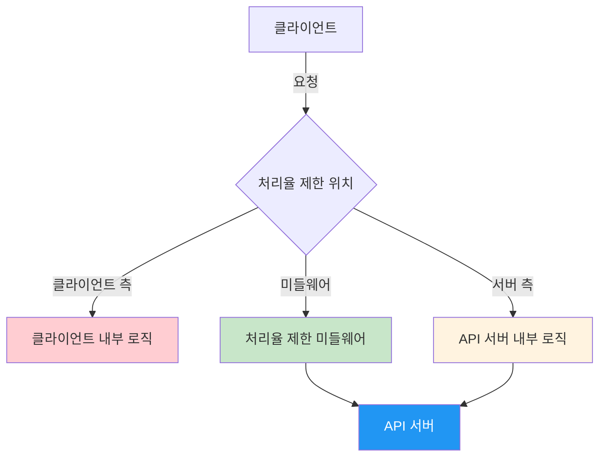
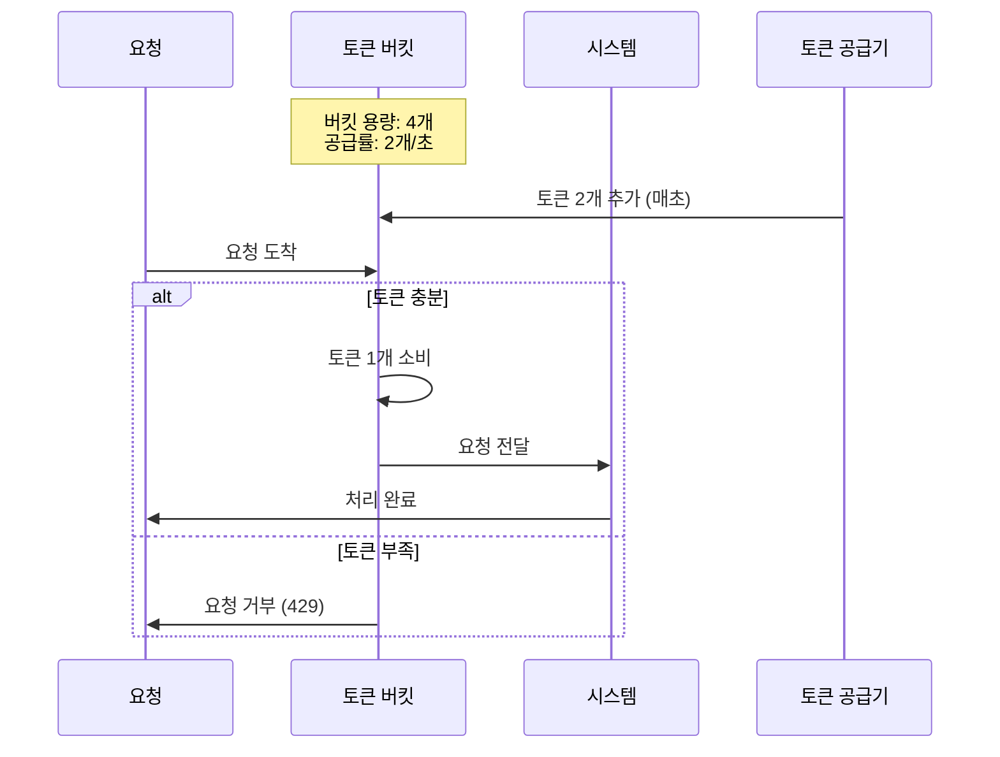
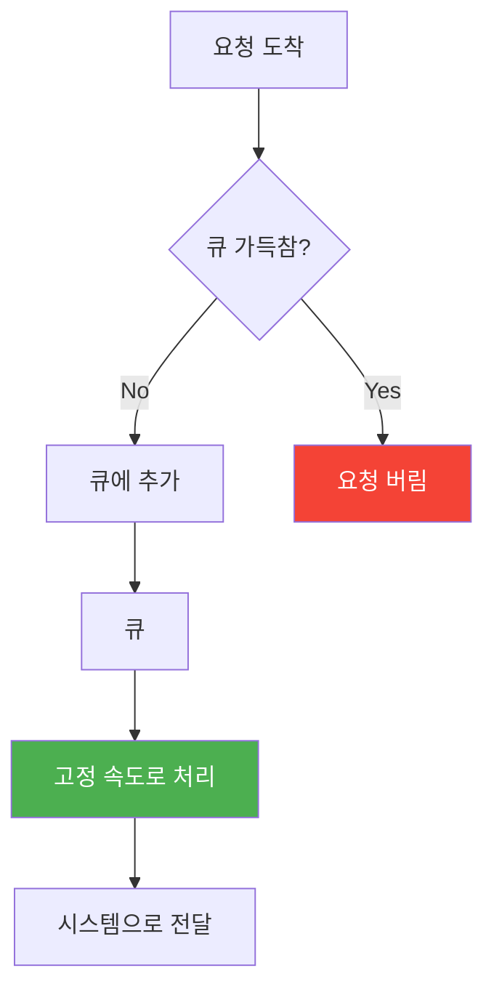
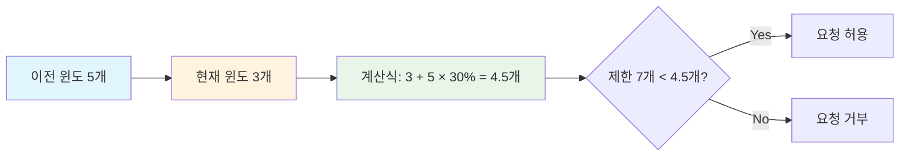
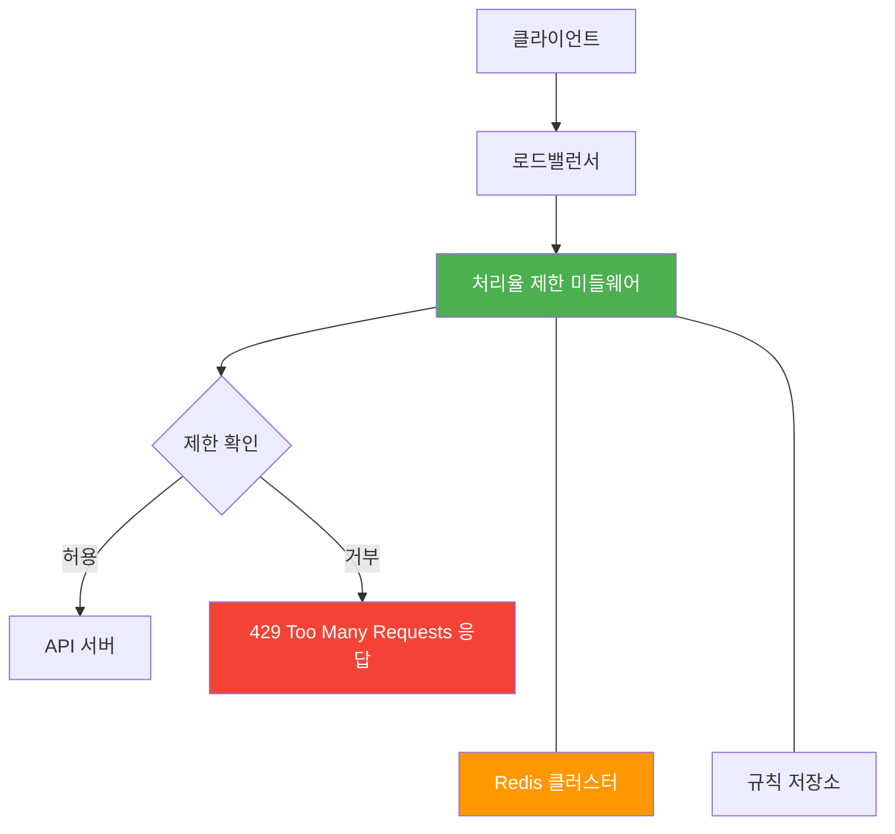
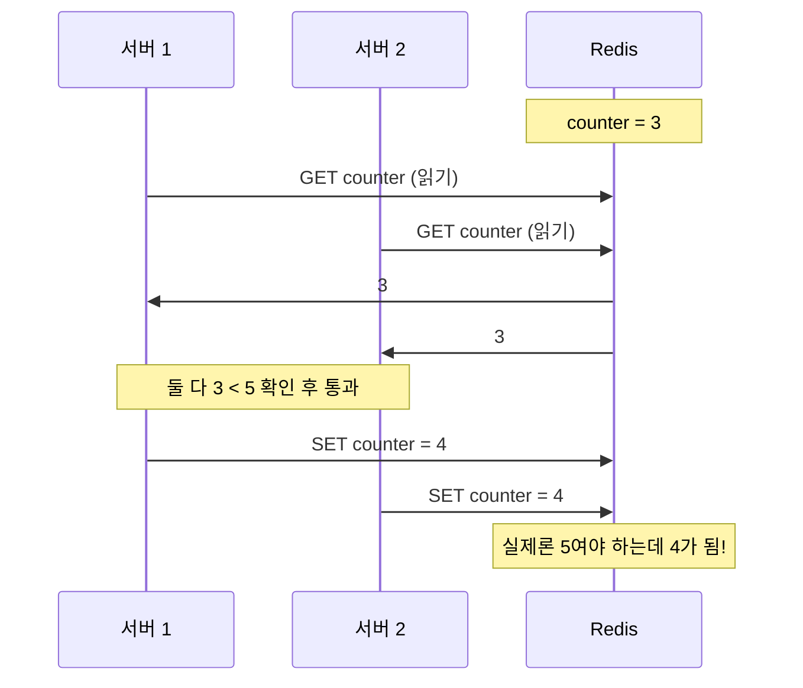
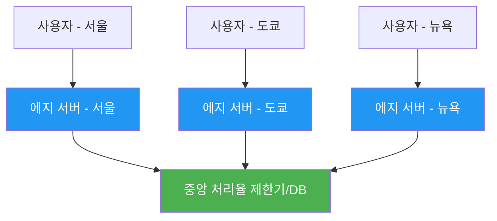
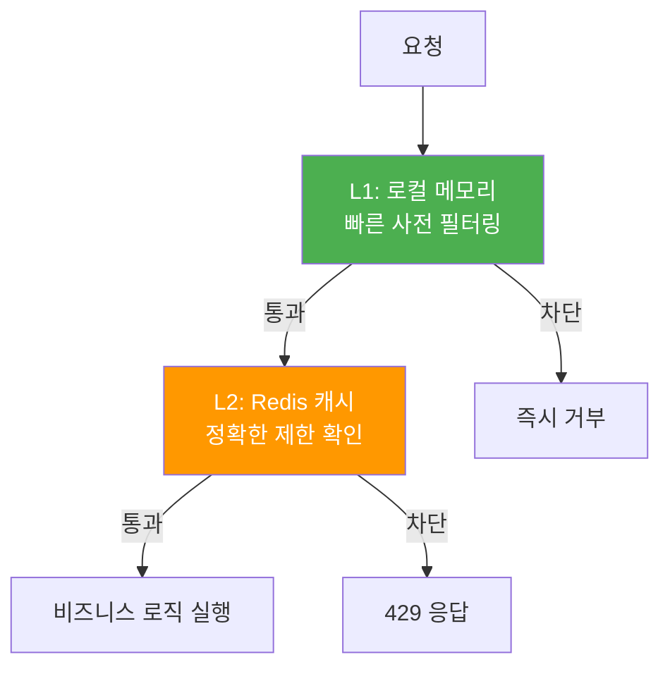

## 시작하며

가면사배 스터디가 어느덧 3주차에 접어들었습니다! 매주 새로운 주제를 다룰 때마다 "우리가 평소에 당연하게 사용하던 기능들이 뒤에서는 이렇게 복잡한 고민 끝에 만들어졌구나"라는 걸 새삼 느끼고 있어요. 지난 3장에서는 "시스템 설계 면접 공략법"을 통해 면접의 전체적인 흐름을 잡았다면, 이번 4장에서는 본격적으로 **처리율 제한 장치(Rate Limiter)**라는 구체적이고도 실전적인 시스템을 설계하는 방법을 다룹니다.

사실 처음에는 "그냥 API 호출 횟수만 카운트해서 막으면 되는 거 아닌가?"라고 단순하게 생각했었습니다. 그런데 막상 책을 펼쳐보니 알고리즘만 해도 대여섯 가지가 넘고, 특히 서버가 여러 대인 분산 환경으로 넘어가면 동기화와 성능 사이에서 균형을 잡는 게 정말 까다롭더라고요. 우리 서비스에서도 가끔 특정 사용자가 비정상적으로 요청을 쏟아낼 때가 있는데, 그때마다 임시방편으로 막았던 기억이 나면서 이번 기회에 제대로 된 아키텍처를 배워보자는 마음으로 정독했습니다. 

스터디 동기들과도 각자의 서비스 환경에서는 어떤 알고리즘이 가장 잘 맞을지 열띤 토론을 벌였는데, 그 인사이트들을 모아 정리해보겠습니다. 특히 주니어 개발자 입장에서 "왜 이 기술이 필요한지"부터 "실무에서는 어떻게 구현하는지"까지 흐름을 따라가 보려고 해요.

## 처리율 제한 장치: 우리 서버를 보호하는 든든한 방패

처리율 제한 장치는 말 그대로 클라이언트나 서비스가 보내는 트래픽의 전송 속도를 제어하는 장치입니다. 쉽게 말해 "특정 기간 동안 너는 몇 번까지만 요청할 수 있어"라고 규칙을 정해두는 것이죠.

> **처리율 제한 장치(Rate Limiter)**는 클라이언트 또는 서비스가 보내는 트래픽의 처리율(Rate)을 제어하기 위한 장치입니다.

트위터, 구글, 스트라이프 같은 글로벌 기업들도 각자의 서비스 특성에 맞춰 엄격한 제한 정책을 두고 있습니다. 예를 들어 트위터는 3시간 동안 300개의 트윗만 작성할 수 있게 제한하고, 구글 독스는 분당 300회의 읽기 요청까지만 허용한다고 하더라고요. 결제 솔루션인 스트라이프는 초당 100회 API 호출을 제한하고 있는데, 이런 구체적인 수치들을 보면서 "아, 우리가 무심코 쓰는 서비스들이 다 이런 촘촘한 그물망 안에서 돌아가고 있었구나"라는 생각이 들었습니다.

이렇게 큰 기업들이 굳이 사용자의 자유(?)를 제한하는 이유는 명확합니다. 무엇보다 **보안** 때문이죠. DoS(Denial of Service) 공격이나 무차별 대입 공격(Brute-force)을 방어하는 데 있어 처리율 제한은 1차 방어선 역할을 합니다. 또한, API 호출 횟수를 조절함으로써 불필요한 **비용을 절감**하고 서버 리소스를 효율적으로 사용할 수 있게 해줍니다.



이 다이어그램을 보면서 처리율 제한이 단순한 보안 도구를 넘어 비즈니스의 지속 가능성과 직결된다는 걸 다시금 느꼈습니다. 무한한 리소스는 없기에, 한정된 서버 자원을 모든 사용자에게 공정하게 나눠주는 배분기 역할도 하는 셈이죠. 읽으면서 "아, 이게 단순한 차단기가 아니라 교통정리를 해주는 신호등 같은 존재구나"라는 생각이 들었습니다. 특히 유료 API 서비스를 운영한다면, 특정 사용자가 전체 대역폭을 독점하지 못하게 막는 것이 서비스 품질 유지에 정말 결정적이더라고요.

## 어디에 설치해야 가장 효과적일까요?

처리율 제한 장치를 어디에 둘 것인가는 설계 초기 단계에서 가장 먼저 결정해야 할 중요한 지점입니다. 배치는 크게 세 가지 옵션으로 나뉩니다.



각 위치에 따른 특징을 제가 이해한 대로 정리해봤습니다.

| 위치 | 장점 | 단점 | 실무적인 한 줄 소감 |
| :--- | :--- | :--- | :--- |
| **클라이언트** | 네트워크 비용을 아끼고 서버 부하를 사전 차단함 | 사용자가 코드를 위조하기 쉬워 신뢰성이 낮음 | 앱 배터리 절약용으론 좋지만, 보안용으론 한계가 분명해요. |
| **미들웨어** | 서버 로직과 완전히 분리되어 독립적으로 확장 가능 | 인프라가 한 단계 더 추가되어 복잡해짐 | API 게이트웨이를 이미 쓰고 있다면 여기가 명당인 듯합니다. |
| **서버 측** | 비즈니스 로직과 긴밀하게 연동하여 정밀 제어 가능 | 서버 자체 부하가 늘어나 성능에 영향을 줌 | 특정 API에만 특수한 제한이 필요할 때 고민해볼 만해요. |

실무에서는 주로 API 게이트웨이 단계에서 미들웨어 형태로 처리하는 방식을 선호합니다. 클린 아키텍처 관점에서도 비즈니스 로직을 건드리지 않으면서 전역적으로 정책을 관리할 수 있다는 게 큰 매력이거든요. 예전에 제가 서버 로직 곳곳에 `if` 문으로 제한 코드를 쑤셔 넣었다가 나중에 유지보수할 때 고생했던 기억이 나서, 미들웨어 방식이 왜 표준이 되었는지 깊이 공감했습니다.

하지만 무조건 미들웨어가 정답은 아닙니다. 상황에 따른 **선택 기준**이 필요하더라고요.

- **기술 스택**: 현재 사용하는 언어가 처리율 제한 로직을 효율적으로 처리할 수 있는지, 캐시 서비스 인프라는 충분한지 고려해야 합니다.
- **비즈니스 요구사항**: 정책이 얼마나 자주 바뀌는지, 사용자별로 얼마나 세밀한 제한이 필요한지에 따라 위치가 달라질 수 있습니다.
- **운영 관점**: 인력을 얼마나 투입할 수 있는지, 모니터링과 디버깅은 어디가 더 편한지도 중요한 결정 요소입니다.

결국 "어디가 더 좋냐"보다는 "우리의 현재 상황에 어디가 더 적합하냐"를 판단하는 게 설계자의 핵심 역량이라는 걸 배웠습니다. 저는 개인적으로 인프라 관리가 가능하다면 API 게이트웨이 방식이 가장 확장성 있고 깔끔해 보이더라고요.

## 처리율 제한의 핵심, 5가지 알고리즘 뽀개기

이번 장의 꽃이라고 할 수 있는 부분입니다. 처리율 제한을 구현하는 5가지 알고리즘을 상세히 다루는데, 하나씩 뜯어보면 참 영리한 아이디어들이 많더라고요. 각 알고리즘의 동작 방식과 트레이드오프를 이해하는 게 이번 장의 핵심입니다.

### 1. 토큰 버킷 (Token Bucket)

가장 대중적이고 널리 쓰이는 알고리즘입니다. 버킷에 토큰을 일정 속도로 채워두고, 요청이 올 때마다 토큰을 하나씩 소모합니다. 토큰이 없으면 요청은 거부되죠.



이 알고리즘의 가장 큰 매력은 **버스트(Burst) 트래픽**을 허용한다는 점입니다. 평소에 트래픽이 적을 때 토큰을 모아뒀다가, 갑자기 요청이 몰려도 버킷이 가득 찰 때까지는 한꺼번에 받아줄 수 있거든요. 

> **버스트(Burst) 트래픽**이란 짧은 시간 동안 평상시보다 훨씬 많은 양의 요청이 집중되는 현상을 말합니다.

아마존 API 게이트웨이나 스트라이프 같은 유명한 서비스들도 이 방식을 쓴다고 하는데, 유연성 측면에서 확실히 강점이 있어 보입니다. 다만 버킷 크기와 토큰 공급률이라는 두 가지 매개변수를 서비스 특성에 맞게 세밀하게 튜닝해야 한다는 숙제가 남더라고요.

### 2. 누출 버킷 (Leaky Bucket)

토큰 버킷과 비슷해 보이지만, 요청을 처리하는 속도가 '고정'되어 있다는 점이 핵심입니다. 보통 큐(Queue)를 이용해서 구현하는데요. 요청이 들어오면 큐에 쌓이고, 큐에서는 일정한 속도로 요청을 하나씩 꺼내 처리합니다.



큐를 거쳐서 일정한 속도로만 요청을 내보내기 때문에 뒷단(Downstream) 서버를 아주 안정적으로 보호할 수 있습니다. 하지만 트래픽이 몰릴 때 최신 요청들이 큐에 들어가지 못하고 버려질 수 있다는 점이 아쉬워요. 안정성이 무엇보다 중요한 결제 처리 시스템이나 내부 배치 작업 등에 적합하겠다는 생각이 들었습니다. 쇼피파이(Shopify) 같은 전자상거래 플랫폼에서도 이 방식을 활용한다고 하네요.

### 3. 고정 윈도 카운터 (Fixed Window Counter)

시간을 1분, 1시간처럼 고정된 간격으로 나누고 각 칸마다 카운터를 두는 방식입니다. 구현이 정말 간단하고 메모리 효율적이라는 장점이 있지만, **윈도 경계 문제**라는 치명적인 약점이 있습니다.


경계 지점에서 트래픽이 집중되면 설정한 제한 수치의 2배까지도 트래픽이 튈 수 있더라고요. 아주 정밀한 제한이 필요한 곳보다는 대략적인 제한만으로 충분한 서비스에 어울릴 것 같습니다. 하지만 구현이 워낙 쉽고 이해하기 편해서, 간단한 내부 시스템 제한용으로는 여전히 매력적인 카드인 것 같아요.

### 4. 이동 윈도 로그 (Sliding Window Log)

고정 윈도의 경계 문제를 해결하기 위해 모든 요청의 타임스탬프를 로그(보통 Redis의 Sorted Set)에 기록하는 방식입니다. 새 요청이 오면 현재 윈도 밖의 낡은 로그는 지우고 남은 개수만 세면 되죠.

1. 요청이 들어오면 해당 타임스탬프를 로그에 추가합니다.
2. 현재 윈도의 시작점보다 오래된 타임스탬프는 모두 제거합니다.
3. 남은 로그의 개수가 제한 수치보다 작으면 요청을 허용합니다.

어떤 순간을 기준으로 윈도를 잡아도 제한을 정확히 준수한다는 게 엄청난 장점입니다. 하지만 모든 요청의 로그를 저장해야 하니 메모리를 많이 잡아먹는다는 게 단점입니다. 거부된 요청까지 로그에 남기게 되면 시스템 부하가 커질 것 같아 걱정되더라고요. 메모리 효율성보다는 정확도가 생명인 금융 서비스 같은 곳에 적합해 보입니다.

### 5. 이동 윈도 카운터 (Sliding Window Counter)

고정 윈도와 이동 윈도 로그의 장점을 섞은 똑똑한 방식입니다. 이전 윈도의 요청 수와 현재 윈도의 요청 수를 가중 평균 내서 현재 트래픽을 추정합니다.



이 방식은 메모리도 적게 쓰면서 경계 문제도 어느 정도 해결해줍니다. 클라우드플레어에서 실험한 결과 40억 개의 요청 중 오차가 0.003%에 불과했다고 하니, 실무에서는 거의 표준처럼 써도 무방할 만큼 훌륭한 알고리즘인 것 같아요. "완벽한 정확성보다 실용적인 근사치"라는 공학적 마인드가 돋보이는 부분이었습니다. 저도 나중에 큰 규모의 시스템을 설계한다면 이 알고리즘을 1순위로 고려할 것 같습니다.

### 알고리즘 한눈에 비교하기

지금까지 살펴본 5가지 알고리즘을 표로 정리해봤습니다. 어떤 상황에서 무엇을 선택할지 고민될 때 참고하면 좋을 것 같아요.

| 알고리즘 | 장점 | 단점 | 추천 사용 사례 |
| :--- | :--- | :--- | :--- |
| **토큰 버킷** | 구현이 쉽고 버스트 트래픽 허용 가능 | 매개변수(버킷 크기, 공급률) 튜닝이 까다로움 | API 게이트웨이, 범용 처리율 제한 |
| **누출 버킷** | 일정한 출력률 보장, 뒷단 서버 보호에 최적 | 트래픽 폭주 시 최신 요청이 버려질 수 있음 | 결제 시스템, 배치 작업 처리 |
| **고정 윈도** | 메모리 효율적이고 구현이 매우 단순함 | 윈도 경계에서 트래픽이 몰릴 수 있음 | 간단한 내부 API 제한 |
| **이동 윈도 로그** | 어떤 순간에도 매우 정확한 제한 가능 | 모든 요청의 타임스탬프를 저장해 메모리 낭비 심함 | 고정밀 금융 서비스, 보안 필수 API |
| **이동 윈도 카운터** | 메모리 효율과 정확도의 균형이 매우 뛰어남 | 근사치 기반이라 아주 미세한 오차가 있음 | 대규모 트래픽 서비스, 글로벌 API |

각 알고리즘은 정답이 있는 게 아니라 트레이드오프가 확실하더라고요. 저는 개인적으로 구현의 단순함보다는 운영의 안정성이 중요한 서비스라면 **이동 윈도 카운터**나 **토큰 버킷**이 가장 합리적인 선택지라는 결론을 내렸습니다.

## 실제 시스템 아키텍처 구성하기

알고리즘을 정했다면 이제 이걸 실제 시스템으로 구현해야 합니다. 요청 카운터를 어디에 저장할지가 관건인데, 보통 고성능 메모리 기반 저장소인 **Redis**를 사용합니다. 데이터베이스는 디스크 기반이라 너무 느리고, 메모리는 휘발성이며 서버 간 공유가 어렵기 때문이죠.



미들웨어는 Redis에서 카운터를 가져와 제한 여부를 판단합니다. 이때 단순히 거부만 하는 게 아니라, HTTP 헤더를 통해 클라이언트에게 친절하게 현재 상태를 알려주는 매너가 필요합니다. 

- `X-RateLimit-Remaining`: 이번 윈도 내에 남은 요청 수
- `X-RateLimit-Limit`: 윈도당 허용되는 전체 요청 수
- `X-RateLimit-Retry-After`: 제한에 걸렸을 때, 몇 초 뒤에 다시 시도할 수 있는지 (429 응답과 함께 제공)

이런 정보를 주면 클라이언트 개발자도 무작정 재시도 로직을 짜는 게 아니라, 헤더 값을 보고 영리하게 대기 시간을 조절할 수 있게 됩니다. 시스템 간의 대화에서도 이런 '배려'가 전체 시스템의 안정성을 높인다는 걸 배웠습니다. 

또한 제한 규칙은 코드에 하드코딩하기보다, 아래처럼 **YAML** 형태의 설정 파일로 관리하면 실시간 정책 변경에 훨씬 유리합니다.

```yaml
# 메시징 서비스 제한 규칙 예시
domain: messaging
descriptors:
  - key: message_type
    value: marketing
    rate_limit:
      unit: day
      requests_per_unit: 5

---
# 인증 서비스 (로그인) 제한 규칙
domain: auth
descriptors:
  - key: auth_type
    value: login
    rate_limit:
      unit: minute
      requests_per_unit: 5
```

이런 규칙들은 캐시에 올려두고 사용하면 성능 저하를 최소화할 수 있습니다. 스터디원들과 이야기하면서 "규칙 저장소를 별도로 두고 동적으로 로드하는 구조가 정말 유연해 보인다"는 의견이 많았는데, 실무에서도 이런 유연함이 큰 자산이 될 것 같아요.

## 분산 환경에서의 난제와 해결책

시스템 규모가 커져서 처리율 제한 장치가 여러 대가 되면 새로운 골칫거리가 생깁니다. 그중 대표적인 게 **경쟁 조건(Race Condition)**과 **동기화(Synchronization)** 문제입니다.

여러 대의 서버가 동시에 Redis의 카운터를 읽고 업데이트하려고 하면, 실제 요청보다 적게 카운팅되어 제한이 뚫리는 일이 발생할 수 있거든요. 마치 은행 계좌에서 두 명이 동시에 돈을 뽑았는데 잔액이 제대로 안 깎이는 상황과 비슷하죠.



이걸 해결하기 위해 책에서는 두 가지 강력한 해결책을 제시합니다.

1. **Lua 스크립트 활용**: Redis 내부에서 여러 명령어를 하나의 '원자적 작업'으로 묶어서 실행합니다. 중간에 다른 요청이 끼어들 틈이 없죠.
2. **Redis Sorted Set 활용**: 이동 윈도 로그 알고리즘을 구현할 때 특히 유용한데, 타임스탬프를 기준으로 데이터를 정렬하고 원자적으로 연산할 수 있게 해줍니다.

```javascript
// Redis Lua 스크립트를 활용한 원자적 카운트 증가 예시
const luaScript = `
  local key = KEYS[1]
  local limit = tonumber(ARGV[1])
  local window = tonumber(ARGV[2])
  
  local current = redis.call('get', key)
  if current and tonumber(current) >= limit then
    return 0 -- 제한 초과
  end
  
  redis.call('incr', key)
  if not current then
    redis.call('expire', key, window) -- 첫 요청 시 TTL 설정
  end
  return 1 -- 허용
`;
```

Lua 스크립트 방식은 구현도 깔끔하고 성능도 훌륭해서 실무에서 가장 선호되는 방식 중 하나입니다. "동기화가 어렵다면 작업 단위를 하나로 묶어라"라는 기본 원칙을 코드로 구현한 셈이죠. 역시 도구를 제대로 알고 쓰는 게 실력이구나라는 걸 다시 한번 느꼈습니다.

### 동기화(Synchronization) 이슈와 해결 방안

경쟁 조건만큼이나 머리 아픈 것이 바로 서버 간의 동기화입니다. 수백만 명의 사용자가 이용하는 서비스라면 처리율 제한 장치도 여러 대의 서버(인스턴스)에 나뉘어 있을 텐데요. 클라이언트의 요청이 매번 다른 인스턴스로 전달되면 각자 자기만의 카운터를 관리하게 되어 전체 제한 수치를 지키지 못하는 문제가 생깁니다.

이를 해결하기 위해 과거에는 **고정 세션(Sticky Session)** 방식을 쓰기도 했습니다. 특정 사용자의 요청은 항상 같은 처리율 제한 서버로 보내는 것이죠. 하지만 이 방식은 서버 한 대가 죽었을 때 해당 사용자의 요청을 처리하지 못하게 되고, 서버 간 부하 불균형이 생길 수 있어 요즘 같은 대규모 환경에서는 권장하지 않습니다.

그래서 가장 많이 쓰이는 방식이 앞서 언급한 **중앙 집중형 저장소(Redis Cluster)**입니다. 모든 처리율 제한 서버가 하나의 공유된 Redis 캐시를 바라보게 함으로써, 어떤 서버로 요청이 가든 정확한 전역 카운터를 공유할 수 있게 됩니다. 이 부분을 공부하면서 "분산 시스템의 핵심은 결국 상태를 어떻게 공유하고 관리하느냐에 달려 있구나"라는 걸 다시금 깨달았습니다.

### 성능 최적화: 지리적 분산과 에지 서버

글로벌 서비스를 운영한다면 지연 시간(Latency)도 무시할 수 없는 요소입니다. 한국에 있는 사용자가 요청을 보냈는데, 처리율 제한을 확인하기 위해 미국에 있는 Redis 서버까지 갔다 와야 한다면 응답 속도가 엄청나게 느려지겠죠?

이를 최적화하기 위해 전 세계 곳곳에 **에지 서버(Edge Server)**를 두고 사용자와 가장 가까운 위치에서 처리율 제한을 수행하는 지리적 분산 전략을 사용합니다. 



이렇게 에지 위치에서 1차적인 제한을 걸어주면 네트워크 지연 시간을 획기적으로 줄일 수 있습니다. "성능과 정확성은 언제나 트레이드오프 관계에 있다"는 명제를 해결하기 위해 이런 영리한 물리적 배치를 고민하는 것이 대규모 시스템 설계의 진짜 묘미인 것 같아요.

## 안정적인 운영을 위한 모니터링

시스템을 배포한 후에는 우리가 세운 정책이 잘 동작하는지 계속 지켜봐야 합니다. 처리율 제한 장치가 트래픽을 너무 짜게 제한해서 일반 사용자들이 고통받고 있지는 않은지, 혹은 알고리즘이 너무 무거워서 전체 응답 속도가 느려지지는 않았는지 체크해야 하죠.

실무에서 특히 중요하게 보는 메트릭들은 다음과 같습니다.

| 메트릭 | 설명 | 체크 포인트 |
| :--- | :--- | :--- |
| **거부율(Rejection Rate)** | 전체 요청 대비 거부된 비율 | 갑자기 튀면 공격 중이거나 정책이 너무 엄격한 것 |
| **처리 지연 시간(Latency)** | 제한 확인 로직이 소요하는 시간 | API 응답 속도에 주는 영향 체크 (1ms 미만 권장) |
| **캐시 히트율(Cache Hit Rate)** | 규칙 캐시 적중률 | Redis 호출을 줄이기 위한 로컬 캐시 효율성 확인 |
| **Redis 연결 수 및 부하** | 동시 Redis 연결 상태 | 저장소 병목으로 인한 전체 시스템 장애 예방 |

거부율이 예상보다 높다면 정책을 조금 완화하거나, 특정 경로에 대해서만 예외 처리를 해주는 등 유연한 대응이 필요합니다. 

특히 **장애 대응 전략**이 중요한데요. 만약 Redis 클러스터 자체가 다운되면 어떻게 해야 할까요? 전체 서비스를 멈출 수는 없으니, 일시적으로 모든 요청을 통과시키거나(Fail-open), 서버 로컬 메모리에 있는 카운터에 기반해 대략적인 제한이라도 수행하는 **Fallback 전략**이 필요합니다. 또는 **Circuit Breaker** 패턴을 적용해 장애가 발생한 컴포넌트를 격리하고 시스템 전체의 연쇄 장애를 막는 설계도 고려해야 합니다.

저도 예전에 모니터링 없이 야심 차게 도입했다가 사용자들의 항의 전화를 받고 급하게 롤백했던 아찔한 기억이 있어서, 이제는 메트릭 대시보드와 장애 대응 시나리오 없이는 어떤 정책도 바꾸지 않습니다.

## 실무에 적용할 수 있는 인사이트들

### 1. 계층적 제한 구조 설계

모든 요청을 Redis로 보내기보다, 서버 로컬 메모리에서 아주 빠른 1차 필터링을 먼저 수행하는 것이 좋습니다. 예를 들어 블랙리스트 IP나 명백하게 악의적인 요청은 Redis 조회 없이 로컬 캐시에서 즉시 차단하는 식이죠. 이렇게 하면 Redis 네트워크 오버헤드를 줄이면서도 전체적인 시스템 응답 속도를 비약적으로 높일 수 있습니다.



### 2. 사용자 등급별 차등 정책과 버스트 허용

무료 사용자와 유료 사용자의 제한 수치를 다르게 설정하는 것은 비즈니스적으로도 매우 중요합니다. 이때 토큰 버킷 알고리즘을 활용해 유료 사용자에게는 일시적인 트래픽 폭주(Burst)를 허용해주는 식의 배려를 할 수 있습니다. "차단"보다는 "공정한 배분"에 초점을 맞춘 설계가 사용자 경험(UX) 측면에서 훨씬 좋더라고요.

### 3. 지능형 동적 제한 조정 (Adaptive Throttling)

시스템의 CPU나 메모리 부하 상태를 실시간으로 감시하여 처리율 제한 수치를 동적으로 조정할 수 있습니다. 서버가 널널할 때는 제한을 조금 풀어주고, 서버가 위험 신호를 보내면 자동으로 제한을 타이트하게 조이는 방식입니다. 이 방식은 장애 상황에서 시스템이 완전히 뻗어버리는 최악의 시나리오를 막아주는 최후의 보루가 됩니다.

### 4. 악의적 사용자 탐지 및 차단 (Abuse Detector)

단순히 횟수만 제한하는 게 아니라, 사용자의 행동 패턴을 분석해 자동으로 페널티를 부여하는 로직도 실무에서는 유용합니다. 예를 들어, 로그인 실패를 반복하거나 존재하지 않는 엔드포인트를 무작위로 찌르는 행위는 일반적인 사용자 패턴이 아니거든요. 아래는 이런 비정상 행위를 감지하는 간단한 악용 탐지기 컨셉입니다.

```javascript
class AbuseDetector {
  constructor(redisClient) {
    this.redis = redisClient;
    this.suspiciousPatterns = {
      rapid_requests: { threshold: 100, window: 60 },
      failed_auth: { threshold: 10, window: 300 },
      unusual_endpoints: { threshold: 50, window: 3600 },
    };
  }

  async detectAbuse(userId, requestInfo) {
    // 다양한 위반 패턴을 루프를 돌며 확인합니다.
    for (const [patternName, config] of Object.entries(this.suspiciousPatterns)) {
      const patternKey = `abuse:${patternName}:${userId}`;
      
      if (await this.checkPatternViolation(patternKey, config)) {
        // 위반이 확인되면 즉시 페널티를 부여합니다.
        await this.applyPenalty(userId, patternName);
        return true; 
      }
    }
    return false;
  }

  async applyPenalty(userId, violationType) {
    // 위반 유형에 따라 차단 시간이나 제한 수치 축소 비율을 다르게 설정합니다.
    const penaltyDuration = 3600; // 기본 1시간 차단
    await this.redis.setex(`penalty:${userId}`, penaltyDuration, 'blocked');
    console.log(`User ${userId} penalized for ${violationType}`);
  }
}
```

이런 다층 보안 구조를 갖추면 IP를 돌려가며 공격하는 지능적인 공격자들도 어느 정도 걸러낼 수 있게 됩니다. 단순히 "못 들어오게 막는다"를 넘어 "누가 왜 공격하는지"를 파악하고 대응하는 단계로 나아가는 것이죠.

### 5. 배치 처리와 네트워크 오버헤드 최적화

처리율 제한 장치가 매번 Redis에 접근하는 것은 생각보다 큰 비용입니다. 수만 QPS(Queries Per Second)가 발생하는 환경에서는 Redis 자체가 병목이 될 수 있거든요. 이를 해결하기 위해 여러 요청을 하나로 묶어 처리하는 **배치 처리** 기술을 활용합니다.

- 클라이언트가 여러 요청의 허가 여부를 한 번에 물어봅니다.
- 서버 미들웨어는 로컬에서 일정 수의 요청을 모았다가 주기적으로 Redis에 업데이트합니다.
- Lua 스크립트를 활용해 여러 카운터를 한 번의 네트워크 호출로 원자적으로 갱신합니다.

이런 세밀한 최적화 기법들을 보면서 "대규모 시스템 설계는 1ms, 1byte를 아끼기 위한 전쟁터구나"라는 걸 다시금 실감했습니다. 저도 평소 코딩할 때 네트워크 비용을 너무 당연하게 생각하지 않았나 반성하게 되더라고요.

## 마무리

4장 "처리율 제한 장치의 설계"를 정리하면서, 이 장치가 단순한 '트래픽 차단기'가 아니라 **시스템의 지속 가능성을 지켜주는 핵심 인프라**라는 사실을 깊이 깨달았습니다. 5가지 알고리즘 각각의 장단점을 명확히 알고, 우리 서비스의 트래픽 패턴에 가장 잘 맞는 조합을 찾아내는 과정이 정말 즐거웠어요.

특히 인상적이었던 점은 "완벽함보다 실용성"을 추구하는 설계 철학이었습니다. 분산 환경의 복잡한 동기화 문제를 해결하기 위해 Lua 스크립트라는 도구를 활용하거나, 이동 윈도 카운터 알고리즘처럼 약간의 오차를 허용하면서 성능을 극대화하는 방식들이 그랬습니다. 주니어 개발자로서 "모든 것이 완벽해야 한다"는 강박에서 벗어나, 시스템의 규모와 요구사항에 맞는 합리적인 트레이드오프를 찾는 법을 배운 것 같아 뿌듯합니다.

이번 학습을 통해 앞으로 새로운 API를 설계할 때 "어떻게 하면 외부의 충격으로부터 우리 서버를 단단하게 보호할 수 있을까"에 대한 확실한 답을 얻은 것 같아 든든합니다. 특히 계층적 제한 구조나 Lua 스크립트를 활용한 원자적 연산 패턴은 조만간 진행할 프로젝트에도 꼭 적용해볼 계획입니다.

다음 포스트에서는 5장 "**안정 해시 설계**"를 다룰 예정입니다. 분산 시스템에서 데이터를 여러 서버에 골고루, 그리고 효율적으로 나누는 아주 영리한 기법이라고 하는데 벌써 기대가 되네요! 시스템 설계의 세계는 파면 팔수록 정말 끝이 없는 것 같습니다.

### 📡 아키텍처 및 기술적 관점에 대한 질문

- API 게이트웨이에서 일괄적으로 제한하는 것과 개별 서비스 내부에서 세밀하게 제한하는 것 중 실무에서는 어떤 조합을 선호하시나요?
- 중앙 집중형 Redis가 만약 장애가 난다면, 전체 서비스의 가용성을 위해 어떤 Fallback 전략을 주로 사용하시나요?
- CAP 정리 관점에서 처리율 제한 시스템은 일관성(Consistency)과 가용성(Availability) 중 무엇을 더 우선시해야 할까요?
- 사용자 수가 10배, 100배 증가할 때 처리율 제한 시스템의 확장(Scale-out) 전략은 어떻게 가져가는 것이 좋을까요?

### 🛠️ 알고리즘 및 구현에 대한 질문

- 토큰 버킷과 누출 버킷 중, 실제 여러분의 서비스 환경(예: 실시간 매칭, 결제 등)이라면 어떤 알고리즘을 먼저 고려하시겠어요?
- Lua 스크립트 외에 분산 환경에서 경쟁 조건을 해결하기 위해 시도해보신 다른 방법(예: Redis Lock 등)이 있으신가요?
- 고정 윈도의 경계 지점 트래픽 튐 현상이 실제 운영 환경에서 장애로 이어질 만큼 심각한 문제라고 보시나요? 아니면 실무적으로 허용 가능한 수준인가요?
- Redis 클러스터 vs 로컬 메모리 캐시의 성능 차이를 체감하신 적이 있나요? 선택의 기준은 무엇이었나요?

### 🎯 비즈니스 및 운영에 대한 질문

- 처리율 제한으로 인해 정상적인 사용자가 불편을 겪을 때, 이를 기술적으로 혹은 UX적으로 어떻게 완화해주면 좋을까요?
- 대규모 마켓팅 이벤트나 수강 신청처럼 예측 가능한 트래픽 폭주가 예상될 때, 처리율 제한 수치를 사전에 어떤 기준으로 산정하시나요?
- 악의적인 사용자가 수많은 IP를 돌려가며 공격하는 상황에서, IP 기반 제한의 한계를 극복할 수 있는 다른 식별 수단(Device ID, Fingerprinting 등)은 무엇이 있을까요?
- 실시간으로 처리율 제한 정책을 변경해야 할 때, 위험 요소를 최소화하기 위해 어떤 배포 전략을 사용하시나요?

댓글로 공유해주시면 함께 배워나갈 수 있을 것 같습니다!
