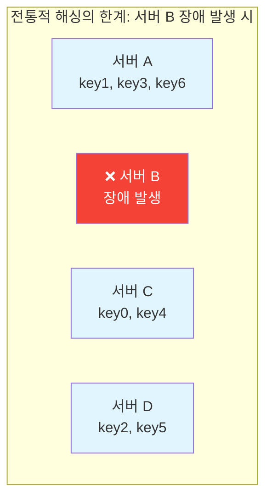
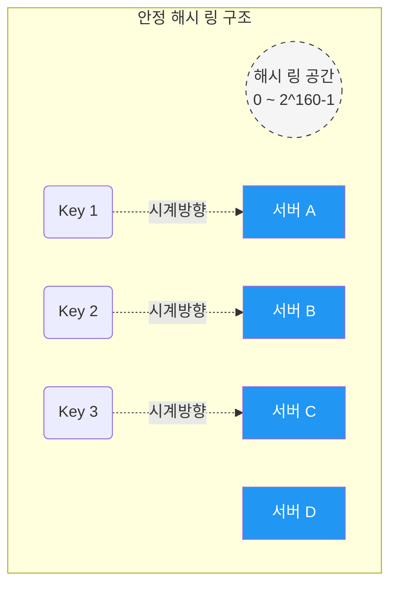
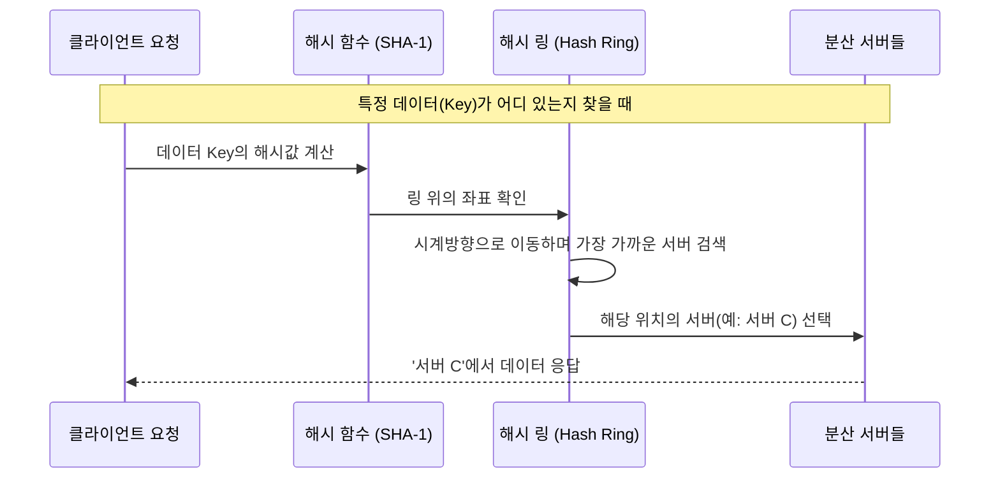
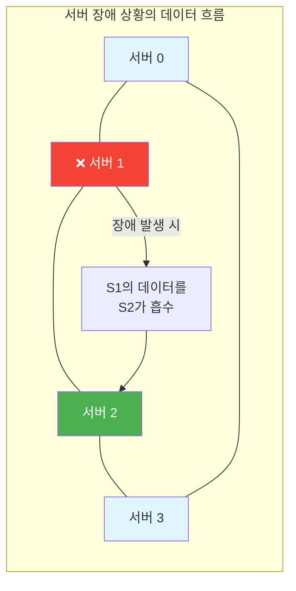
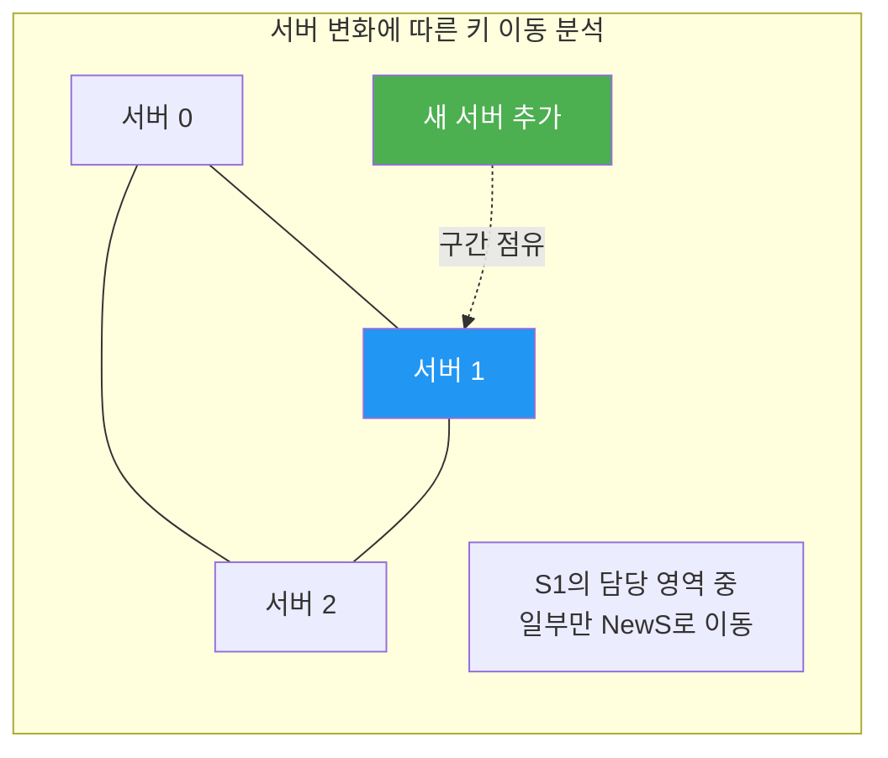
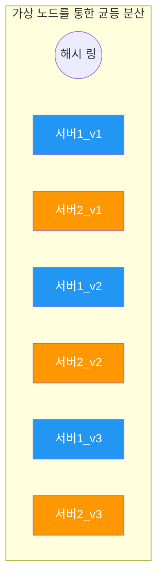

## 시작하며

가면사배 스터디가 어느덧 3주차에 접어들었습니다! 지난 4장에서는 시스템을 외부의 무분별한 요청으로부터 보호하는 든든한 방패인 **처리율 제한 장치**에 대해 심도 있게 다뤘었죠. 서버를 외부 공격이나 과부하로부터 지키는 법을 배웠으니, 이번 5장에서는 서버 내부의 효율적인 구조에 집중해볼 차례입니다. 바로 서버가 늘어나거나 줄어드는 변화무쌍한 환경에서 데이터를 어떻게 하면 똑똑하고 안정적으로 분산할 수 있을지에 대한 해답인 **안정 해시(Consistent Hashing)**입니다.

사실 처음 이 챕터 제목을 접했을 때는 "해시가 그냥 해시지, 안정적인 게 따로 있나?"라는 가벼운 의구심이 들더라고요. 우리가 코딩 테스트나 실무에서 흔히 쓰는 `Map`이나 `Dictionary`에서 사용하는 해싱 개념 정도로만 막연하게 생각했었거든요. 그런데 내용을 한 장 한 장 넘길수록, 우리가 흔히 사용하는 나머지 연산(`%`) 기반의 해시 방식이 서버가 수십 대, 수백 대로 유동적으로 변하는 대규모 분산 환경에서는 얼마나 위험한 시한폭탄이 될 수 있는지 뼈저리게 깨닫게 되었습니다.

특히 이번 장은 제가 발표를 맡았던 장이라 더 애착이 가는데요, 준비하면서 "아, 내가 지금까지 짰던 분산 로직들이 정말 위태로운 줄타기였구나" 싶어 식은땀이 나기도 했습니다. 스터디원들과 모여서 서버 한 대가 장애로 빠졌을 뿐인데 전체 데이터의 70%가 위치를 강제로 바꿔야 하는 상황을 시뮬레이션해 보면서 다들 "이건 진짜 아키텍처 레벨의 대참사다"라며 탄성을 내뱉었던 기억이 나네요. 

단순히 이론적인 알고리즘 공부가 아니라, 대규모 시스템이 어떤 철학으로 '유연성'을 확보하는지 배울 수 있었던 이번 5장의 핵심 내용을 하나씩 풀어보겠습니다. 시스템의 확장성을 설계할 때 왜 안정 해시가 선택이 아닌 필수인지, 그리고 이 단순하면서도 강력한 아이디어가 어떻게 거대 시스템의 균형을 유지하는지 아주 자세히 풀어보려고 합니다.

## 해시 키 재배치 문제와 대규모 캐시 미스

우리가 분산 시스템에서 데이터를 여러 서버에 균등하게 나누고 싶을 때, 가장 먼저 떠올리는 방법은 매우 직관적이고 수학적으로 명쾌합니다. 데이터의 키(ID, 이름 등)를 해시 함수에 넣어 나온 숫자를 서버의 개수(`N`)로 나누는 것이죠.

```javascript
// 아주 익숙하고 단순한 해싱 방식 (Modulo arithmetic)
// hash(key)는 어떤 키가 들어오든 고유한 숫자를 뱉어내고, 
// % N을 통해 0부터 N-1 사이의 서버 인덱스를 결정합니다.
const serverIndex = hash(key) % N; 
```

이 방식은 서버 대수(`N`)가 고정되어 있는 정적인 환경에서는 정말 빠르고 효율적으로 동작합니다. 데이터가 각 서버에 골고루 예쁘게 분산되니까요. 하지만 우리가 마주할 현실 세계는 늘 **동적**입니다. 

우리가 흔히 겪는 서버 환경의 변화는 크게 세 가지입니다.
1. **수평적 확장 (Scale-out)**: 트래픽 급증 시 서버 대수를 10대에서 20대로 늘리는 경우
2. **서버 장애 (Failure)**: 장비 결함이나 네트워크 이슈로 서버 한 대가 클러스터에서 이탈하는 경우
3. **업데이트 및 유지보수**: 패치 적용을 위해 서버를 한 대씩 껐다 켜는 경우

이런 동적인 환경에서 `N`이 변하는 순간, 아키텍처의 비극이 시작됩니다.

### 1. 서버 장애 상황 시뮬레이션: % N의 함정

스터디 노트에 정리된 4대 서버 환경의 예시를 통해 무엇이 문제인지 구체적으로 파고들어 보겠습니다. 서버 A, B, C, D가 운영 중인 상태에서, 서버 B가 갑작스러운 하드웨어 장애로 시스템에서 빠졌을 때를 가정해볼게요. 기존에는 `hash(key) % 4`였던 공식이 갑자기 `hash(key) % 3`으로 바뀌게 됩니다.

| 데이터 키 | 해시값 (가상) | 기존 인덱스 (% 4) | 기존 서버 | 새 인덱스 (% 3) | 새 배치 서버 | 결과 상태 |
| :--- | :--- | :--- | :--- | :--- | :--- | :--- |
| **key0** | 18,358,617 | 1 | 서버 B | 1 | 서버 C | ❌ 위치 변경 |
| **key1** | 26,143,584 | 0 | 서버 A | 0 | 서버 A | ✅ 유지 |
| **key2** | 18,131,146 | 2 | 서버 C | 2 | 서버 D | ❌ 위치 변경 |
| **key3** | 35,863,496 | 0 | 서버 A | 0 | 서버 A | ✅ 유지 |
| **key4** | 77,581,703 | 3 | 서버 D | 1 | 서버 C | ❌ 위치 변경 |
| **key5** | 38,164,978 | 2 | 서버 C | 2 | 서버 D | ❌ 위치 변경 |
| **key6** | 22,530,351 | 3 | 서버 D | 0 | 서버 A | ❌ 위치 변경 |

결과가 충격적이지 않나요? 전체 서버 4대 중 단 1대(25%)만 사라졌을 뿐인데, 데이터 7개 중에서 무려 5개의 위치가 바뀌었습니다. **약 71%의 키가 재배치**되는 결과가 나온 것이죠. 

이 시뮬레이션을 보면서 제가 가장 놀랐던 점은, 단순히 제거된 서버 B의 데이터만 문제가 생기는 게 아니라 **멀쩡히 잘 돌아가고 있던 서버 C와 D의 데이터 주인까지 바뀌어버린다는 것**이었습니다. "내 옆집이 이사 갔는데 갑자기 우리 집 주소까지 바뀌어버린 상황"과 같더라고요.

> **전통적 해싱의 뼈아픈 진실**: 
> 서버 한 대가 빠졌을 때, 그 서버가 들고 있던 데이터만 재배치되는 것이 아니라 시스템 전체의 데이터 주인이 뒤바뀌는 '대혼란'이 발생합니다. 이는 수학적으로 `N`이 `N-1`로 변하면서 모든 모듈러 연산의 결과값이 요동치기 때문입니다.



### 2. 파급 효과: 시스템 전체의 도미노 붕괴 (Cascading Failure)

이 현상이 실제 운영 환경에서 왜 치명적인지 이해하는 것이 이 챕터의 핵심입니다. 만약 이게 유저의 로그인 세션이나 프로필 정보를 들고 있는 **캐시 서버 클러스터**였다고 상상해보세요.

클라이언트는 평소처럼 서버 C에 저장되어 있던 `key2` 데이터를 찾으러 갑니다. 하지만 서버 대수가 줄어들면서 인덱스 계산 로직(`% 3`)이 바뀌었고, 이제 시스템은 `key2`를 찾으러 서버 D로 가라고 명령합니다. 서버 D에는 당연히 `key2`가 존재하지 않겠죠? 여기서 바로 대규모 **캐시 미스(Cache Miss)**가 발생합니다.

단순히 데이터 하나 못 찾는 문제가 아닙니다. 캐시가 막아주지 못한 수백만 개의 요청은 고스란히 원본 데이터베이스(DB)로 쏟아지게 됩니다. 평소 부하를 적절히 견디던 DB는 갑작스러운 트래픽 폭주에 비명을 지르며 다운될 것이고, 이는 곧 서비스 전체의 마비로 이어집니다. 

서버 한 대가 죽었는데 전체 시스템이 무너지는 이 현상을 보면서, 왜 대규모 시스템에서 '고가용성'을 그토록 강조하는지, 그리고 왜 단순 모듈러 연산이 위험한지 절감할 수 있었습니다. 분산 시스템 엔지니어라면 자다가도 벌떡 일어날 무서운 시나리오더라고요.


## 안정 해시의 마법, 해시 링과 배치 원리

이런 절망적인 상황을 해결하기 위해 고안된 영리한 알고리즘이 바로 **안정 해시(Consistent Hashing)**입니다. 위키피디아에서는 이를 다음과 같이 정의하고 있어요.

> **안정 해시(Consistent Hash)**: 
> "해시 테이블 크기가 조정될 때 평균적으로 오직 `K/N`개의 키만 재배치하는 해시 기술이다. 여기서 K는 키의 개수이고, N은 슬롯(서버)의 개수다."

쉽게 말해, 서버 4대 중 1대가 빠지면 아까처럼 71%가 아니라, 딱 이론적인 수치인 **25%** 정도만 재배치되게 만들어서 시스템을 평온하게 유지하겠다는 선언이죠.

### 1. 해시 링(Hash Ring)이라는 우아한 아이디어

안정 해시의 가장 빛나는 아이디어는 해시 공간을 일직선으로 보지 않고, 양 끝을 둥글게 이어 붙인 **원형의 링(Ring)**으로 간주하는 것입니다. 

- **광활한 해시 공간**: 보통 SHA-1 같은 해시 함수를 사용합니다. SHA-1의 출력 값 범위는 0부터 2^160-1까지인데, 이를 숫자로 환산하면 약 **1.46 × 10^48개**라는 어마어마한 크기가 됩니다. 거의 우주 공간에 가까운 무한한 점들이 찍힐 수 있는 캔버스라고 보시면 됩니다.
- **서버의 배치**: 서버의 고유 이름이나 IP 주소를 해싱하여 링 위의 특정 위치에 좌표를 찍습니다. 서버 A, B, C, D가 이 광활한 링 위의 동서남북 어딘가에 자리를 잡는 것이죠.
- **데이터 키의 배치**: 우리가 저장하려는 데이터의 키(예: 유저 ID) 또한 동일한 해시 함수로 처리하여 링 위의 좌표에 배치합니다.

### 2. 시계방향 탐색: 데이터의 주인을 찾는 단 하나의 규칙

데이터가 어느 서버에 저장될지 결정하는 규칙은 너무나 단순해서 더 매력적입니다. **"데이터가 찍힌 위치에서 시계방향으로 링을 타고 돌다가, 가장 처음 만나는 서버가 이 데이터의 주인이다."**



이 방식이 왜 혁신적일까요? 바로 어떤 서버가 추가되거나 삭제되더라도, **오직 그 서버와 직접적으로 연결된 구간의 데이터만 영향을 받기 때문**입니다. 링 위의 다른 서버와 데이터들은 자신들의 위치 관계나 순서가 전혀 변하지 않았으므로, 짐을 쌀 이유가 하나도 없는 것이죠.

### 3. 데이터 조회 과정 살펴보기

실제 시스템에서 클라이언트가 데이터를 요청할 때의 흐름을 시퀀스 다이어그램으로 정리해 보았습니다.



이 로직을 직접 코드로 구현해보면서 재미있는 걸 발견했는데요, 링을 시계방향으로 도는 과정이 논리적으로는 배열에서 **나보다 크거나 같은 값 중 가장 작은 값을 찾는 과정**과 같더라고요.

```javascript
/**
 * 안정 해시 기반의 서버 조회 로직 (JavaScript 예시)
 */
function findServerInConsistentHashRing(dataKey, serverNodes) {
  // 1. 데이터 키의 해시값을 계산합니다.
  const keyHash = getHashValue(dataKey);

  // 2. 링 위에 배치된 서버들의 정보를 가져와 해시값 순으로 정렬합니다.
  // 실제 운영 환경에서는 미리 정렬된 자료구조(TreeMap 등)를 사용하면 훨씬 빠릅니다.
  const sortedRing = serverNodes
    .map(nodeName => ({ name: nodeName, hash: getHashValue(nodeName) }))
    .sort((a, b) => a.hash - b.hash);

  // 3. 링을 시계방향으로 돕니다.
  for (const server of sortedRing) {
    if (server.hash >= keyHash) {
      return server.name;
    }
  }

  // 4. 링의 마지막을 넘어가면 첫 번째 서버로 되돌아옵니다. (Circular)
  return sortedRing[0].name;
}
```

이 단순한 `for` 루프(또는 이진 탐색) 하나가 대규모 장애 상황에서 수천 대의 서버를 지탱하는 든든한 버팀목이 된다는 게 정말 신기하지 않나요?

## 서버 추가와 제거: 최소한의 이동으로 해결하기

안정 해시가 도입된 시스템에서 서버 환경이 변하면 구체적으로 어떤 일이 벌어지는지 단계를 나누어 정리해 보겠습니다. 이 부분이 우리가 앞에서 보았던 '대혼란'을 어떻게 '평화'로 바꾸는지 보여주는 핵심입니다.

### 1. 새로운 서버가 추가될 때 (Node Addition)

링 위의 어느 지점에 새로운 서버(서버 4)가 추가되었다고 해볼게요. 이때 재배치가 필요한 데이터는 단 한 구간뿐입니다. 바로 **"서버 4의 반시계 방향에 있는 첫 번째 서버부터 서버 4까지의 구간"**에 찍혀있던 데이터들이죠.

- **이동 전**: 서버 4가 없었을 때는 해당 구간에 있는 키들은 시계방향으로 돌아 서버 0에 저장되었습니다.
- **이동 후**: 이제는 서버 4가 더 가까운 곳에 나타났으므로, 해당 키들만 짐을 싸서 서버 4로 옮겨갑니다.
- **이론적 최적화**: 서버가 총 N대 있을 때, 서버 하나가 추가되면 전체 데이터의 오직 `1/(N+1)`만이 영향을 받습니다. 

이 과정을 시뮬레이션해 보면서 정말 놀라웠던 건, 서버 4와 상관없는 서버 1, 2, 3은 자기 집 마당에 데이터가 들어오거나 나가는 걸 전혀 신경 쓰지 않아도 된다는 점이었습니다. 각 서버가 독립적으로 자신의 구간만 책임지면 되는 이 구조가 분산 시스템의 복잡도를 얼마나 낮춰주는지 깨닫게 되더라고요.

### 2. 기존 서버가 제거되거나 장애가 날 때 (Node Removal)

반대로 서버 하나(서버 1)가 갑작스러운 하드웨어 결함이나 네트워크 단절로 이탈하면 어떻게 될까요? 이때도 피해는 최소화됩니다.

- **이동 전**: 서버 1이 담당하던 데이터 구간이 있었습니다. (서버 0 다음부터 서버 1까지)
- **이동 후**: 서버 1이 사라졌으므로, 해당 구간의 데이터들은 시계방향으로 더 전진하여 **다음 서버인 서버 2**를 만나게 됩니다.
- **영향 범위**: 오직 제거된 서버가 맡고 있던 구간의 키들만 재배치됩니다.



장애가 난 서버의 데이터만 바로 옆 서버가 "걱정 마, 내가 잠시 맡아줄게" 하고 가져가는 셈입니다. 나머지 수많은 서버에 저장된 데이터들은 평소와 다름없이 자리를 지킵니다. 덕분에 우리는 서버 한 대가 죽었다고 해서 DB 전체가 내려앉는 '연쇄 붕괴' 걱정 없이 발 뻗고 잘 수 있게 되는 것이죠.

스터디를 진행하면서 "수평적 확장이 일상인 요즘 같은 클라우드 환경에서 안정 해시는 정말 대체 불가능한 축복이구나"라는 감탄이 절로 나왔습니다.


## 재배치 키 결정: 서버 추가와 제거 시의 디테일

안정 해시의 가장 큰 매력은 서버의 변화가 생겼을 때 이동하는 데이터가 최소화된다는 점입니다. 하지만 '최소화'된다는 것이 구체적으로 어떤 원리로 결정되는지 깊이 있게 이해하는 것이 중요합니다. 스터디를 하면서 이 부분을 다이어그램과 함께 정리해 보니 훨씬 명확해지더라고요.

### 1. 서버 추가 시의 재배치 메커니즘
새로운 서버가 링 위의 특정 지점에 추가되면, 그 서버의 **반시계 방향 이웃 노드**부터 **새 서버의 위치**까지의 구간에 있는 키들만 새 서버로 옮겨갑니다.

- **관찰 포인트**: 나머지 구간에 있는 키들은 시계방향으로 돌았을 때 만나는 첫 번째 서버가 여전히 동일합니다. 따라서 이동할 필요가 전혀 없죠.
- **수학적 이득**: 서버가 4대에서 5대로 늘어날 때, 전통적 방식은 80~90%의 데이터를 옮길 수도 있지만, 안정 해시는 약 20% 내외만 옮깁니다. 시스템 부하가 1/4 수준으로 줄어드는 셈입니다.

### 2. 서버 제거 시의 재배치 메커니즘
반대로 특정 서버가 제거되거나 장애로 사라지면, 그 서버가 담당하고 있던 구간(반시계 방향 이웃부터 본인까지)의 키들만 **시계방향의 다음 이웃 노드**로 흡수됩니다.

- **복구 전략**: 장애가 난 서버의 백업본이 다른 서버에 있었다면, 안정 해시 덕분에 복구 지점을 찾는 것도 매우 빨라집니다. 단순히 링 위의 다음 서버들을 찾아가면 되니까요.
- **유연한 대응**: 장애 서버를 복구하는 동안 임시 서버를 링의 동일한 위치에 투입하면, 데이터 이동을 아예 0으로 만들 수도 있는 유연함이 생깁니다.



이런 세부적인 동작 원리를 이해하고 나니, 단순히 "데이터가 적게 움직인다"는 추상적인 개념이 아니라 "데이터의 소유권이 인접한 노드 사이에서만 거래된다"는 실질적인 아키텍처로 다가왔습니다.

## 가상 노드: 더 균등하고 완벽한 분산을 위해

하지만 세상에 완벽한 기술은 없듯이, 안정 해시의 초기 형태에도 아쉬운 점이 있습니다. 서버를 링 위에 무작위로 배치하다 보면, 어떤 서버 사이의 구간은 광활하게 넓고 어떤 구간은 매우 좁아지는 **불균형 문제**가 발생할 수 있다는 것이죠.

### 1. 기본 구현의 두 가지 문제점: 불공평한 링

- **파티션 크기 불균등**: 어떤 서버는 링의 50%를 담당하고, 어떤 서버는 5%만 담당하는 상황이 생길 수 있습니다. (운이 나쁘면 서버 좌표가 한곳에 몰리기 때문이죠.)
- **데이터 분포 불균형**: 특정 서버(Hotspot)에만 요청이 몰려 서버가 과부하로 죽는 '빈익빈 부익부' 현상이 벌어질 수 있습니다.

구간이 넓은 서버는 감당해야 할 데이터가 너무 많아져서 과부하에 허덕이고, 구간이 좁은 서버는 할 일이 없어 유휴 자원이 생기는 비효율적인 상황이 벌어지는 겁니다. 이 불균형을 해결하기 위해 도입된 마법 같은 장치가 바로 **가상 노드(Virtual Node)**입니다.

### 2. 가상 노드의 원리: 일당백의 활약

가상 노드는 물리적인 서버 한 대가 링 위에서 여러 개의 가짜 지점(가상 노드)을 점유하게 만드는 방식입니다. 예를 들어 '서버 A'가 링 위에 하나만 떡하니 있는 게 아니라, '서버 A-1', '서버 A-2', '서버 A-100'처럼 수십, 수백 개의 좌표를 갖게 하는 것이죠.



가상 노드가 많아질수록 링 위에는 서버의 흔적들이 촘촘하게 메워지게 되고, 결과적으로 각 물리 서버가 담당하는 영역의 총합이 아주 비슷해집니다. 그 덕분에 데이터가 모든 서버에 아주 고르고 예쁘게 분산되는 효과를 얻게 됩니다. 

실제로 이 부분을 공부하면서 "아, 이건 통계학의 '대수의 법칙'을 시스템에 적용한 거구나!"라는 생각이 들더라고요. 샘플(가상 노드)이 많아질수록 평균에 수렴하는 그 원리 말이죠.

### 3. 가상 노드 개수와 균등도의 트레이드오프

그렇다면 가상 노드는 무조건 많을수록 좋을까요? 당연히 공짜는 아닙니다. 가상 노드를 늘릴수록 데이터 분산은 완벽에 가까워지지만, 그만큼 링 위의 노드 정보를 관리하고 탐색하는 데 필요한 메모리와 CPU 연산량이 늘어납니다. 책에서는 가상 노드 수와 데이터 분포의 표준편차 사이의 관계를 아래와 같이 정리해주었습니다.

| 가상 노드 수 | 데이터 분포 표준편차 (평균 대비) | 관리 오버헤드 | 추천 시나리오 |
| :--- | :--- | :--- | :--- |
| **50개** | 약 10% | 낮음 | 가벼운 사내 도구, 소규모 로컬 캐시 |
| **100개** | 약 7% | 보통 | 일반적인 상용 서비스, API 서버 그룹 |
| **200개** | 약 5% | 높음 | 금융권, 대규모 이커머스 등 고가용성 필수 시스템 |

엔지니어로서 우리는 시스템의 비즈니스 중요도와 리소스 가용량 사이에서 적절한 균형점을 찾아야 합니다. "우리 서비스는 5%의 오차도 허용할 수 없는가, 아니면 10% 정도는 괜찮은가?"를 자문해보는 과정이 정말 중요하더라고요.

## 실제 분산 시스템에서의 활용 사례

안정 해시는 단순히 전공 서적에만 존재하는 이론이 아닙니다. 우리가 이름만 들어도 아는 거대 서비스들의 뼈대를 든든하게 지탱하고 있죠. 각 시스템이 안정 해시를 어떻게 요리해서 쓰고 있는지 살펴보면 더 흥미롭습니다.

### 1. Amazon DynamoDB (NoSQL)
아마존의 핵심 데이터베이스인 다이나모DB는 데이터를 여러 노드에 분산하고 복제할 때 안정 해시를 사용합니다. 특히 수평적 확장이 핵심인 만큼, 노드가 추가되거나 제거될 때 데이터 이동을 최소화하여 24시간 중단 없는 서비스를 가능케 합니다. 또한 다이나모DB는 데이터 가용성을 위해 단순히 한 노드에만 저장하는 것이 아니라, 해시 링을 따라 시계방향으로 위치한 여러 개의 다음 노드들에 복제본을 저장하는 전략을 취하기도 합니다.

### 2. Apache Cassandra (Distributed DB)
분산 DB의 끝판왕이라 불리는 카산드라도 각 노드가 담당할 범위를 설정할 때 이 방식을 씁니다. 카산드라에서는 이를 **'Vnodes(Virtual Nodes)'**라고 부르며 시스템의 핵심 구현 원리로 활용하죠. 각 물리 노드에 수백 개의 가상 노드를 할당함으로써, 특정 노드가 장애가 났을 때 그 부하를 클러스터 내의 수많은 다른 노드들이 아주 조금씩 나누어 가질 수 있게 설계되어 있습니다. 덕분에 특정 서버에 부하가 쏠리는 '핫스팟' 현상을 기막히게 방지합니다.

### 3. Discord 채팅 시스템
수백만 명이 동시에 접속하는 디스코드의 실시간 메시징 시스템도 안정 해시를 적극적으로 사용합니다. Elixir 기반의 채팅 서버 클러스터에서 수많은 채팅 채널(Guild) 정보를 서버들에 골고루 배분하고 있죠. 디스코드 엔지니어링 팀은 서버를 교체하거나 업그레이드할 때 클라이언트 연결이 끊기지 않도록 하는 데 안정 해시가 큰 역할을 했다고 밝혔습니다. 500만 명의 동시 접속자를 단 한 번의 대규모 장애 없이 처리할 수 있었던 비결인 셈입니다.

### 4. Akamai & Cloudflare (CDN)
전 세계 곳곳에 퍼져 있는 엣지 서버들 사이에 콘텐츠를 배분하고, 캐시 적중률(Cache Hit Rate)을 극대화하기 위해 안정 해시는 절대적으로 필요한 기술입니다. 특정 웹 페이지나 이미지 같은 콘텐츠가 항상 동일한 엣지 서버로 라우팅되어야 효율적인 캐싱이 가능하기 때문입니다. 만약 단순 모듈러 해싱을 썼다면, 서버 한 대가 추가될 때마다 전 세계 CDN 캐시가 초기화되는 대참사가 벌어졌을지도 모릅니다.

### 5. Google Maglev 로드밸런서
구글의 강력한 소프트웨어 로드밸런서인 Maglev 또한 안정 해시를 응용하여 **'연결 일관성(Connection Consistency)'**을 유지합니다. 수만 대의 백엔드 서버 중 하나에 장애가 생겨도, 그 서버와 연결되어 있던 사용자들만 재배치될 뿐 나머지 수억 명의 구글 사용자들은 연결 끊김 없이 검색 서비스를 이용할 수 있습니다. 

실제로 제가 예전에 AWS의 ALB(Application Load Balancer) 설정을 살펴보며 '세션 고정(Sticky Session)'이나 '대상 그룹(Target Group)' 분산 알고리즘을 고민해 본 적이 있는데, 그 근간에 이런 거대한 아키텍처적 고민들이 녹아들어 있다는 걸 알고 나니 모든 설정 하나하나가 의미심장하게 다가오더라고요.


## 전통적 해싱 vs 안정 해싱 한눈에 비교하기

이 챕터의 핵심 내용을 한눈에 정리할 수 있도록 비교 테이블을 만들어 보았습니다. 설계를 결정해야 하는 순간에 이 표가 좋은 가이드라인이 되어줄 것 같아요.

| 비교 항목 | 전통적 해싱 (Modulo N) | 안정 해싱 (Hash Ring) |
| :--- | :--- | :--- |
| **확장성** | 서버 수 변경 시 대부분의 키(K/N 제외 전부) 재배치 | 최소한의 키만 재배치 (평균 K/N) |
| **장애 내성** | 서버 이탈 시 대규모 캐시 미스 및 DB 부하 폭증 | 영향받는 인접 구간만 데이터 이동하여 안정적 |
| **데이터 균등도** | 초기에는 우수하나, 서버 추가/제거 시 급격히 무너짐 | 가상 노드를 통해 어떤 상황에서도 높은 균등도 유지 |
| **구현 및 운영** | 매우 단순하여 구현이 쉽지만 운영 리스크가 큼 | 링 구조 관리 등 복잡도가 있으나 운영 안정성이 압도적 |
| **주요 용도** | 서버 대수가 고정된 소규모 시스템, 단일 DB 샤딩 | 클라우드 기반 서비스, NoSQL, 대규모 CDN/캐시 |

이 표를 보면서 "역시 어떤 기술이 무조건 좋다기보다는, 우리 시스템의 스케일과 성장 가능성에 맞는 적절한 도구를 선택하는 게 정답이구나"라는 결론을 내릴 수 있었습니다. 초기 스타트업이라면 단순한 방식이 빠를 수 있겠지만, 글로벌 서비스를 꿈꾼다면 안정 해시는 선택이 아닌 생존의 문제더라고요.

## 실무에 적용할 수 있는 인사이트들

이번 5장을 깊게 공부하며 얻은 소중한 실무 인사이트들을 정리해보았습니다. 단순히 책의 내용을 넘어, 개발자로서 가져야 할 마음가짐에 대해서도 생각해보게 되었습니다.

### 1. 변화(Failure & Scaling)를 상수로 두고 설계합시다
우리가 만드는 시스템은 언제든 서버가 죽을 수 있고, 언제든 확장될 수 있습니다. 단순히 "지금은 서버 2대니까 % 2로 충분해"라고 생각하는 건 미래의 나에게 기술 부채를 넘기는 일입니다. 안정 해시 같은 유연한 대안을 항상 머릿속에 두어야겠습니다. "이 코드가 서버가 1,000대가 되어도 멀쩡할까?"를 자문하는 습관이 중요할 것 같아요.

### 2. 핫스팟(Hotspot) 키는 알고리즘만으로 해결되지 않습니다
안정 해시를 쓰더라도 특정 데이터(예: 유명 연예인의 계정이나 실시간 급상승 검색어)에 요청이 비정상적으로 몰리면 특정 서버가 죽을 수 있습니다. 가상 노드를 활용해 부하를 물리적으로 분산하는 것도 방법이지만, 이런 초고부하 키에 대해서는 별도의 'L1 캐시'를 두거나 요청을 분산하는 세심한 애플리케이션 레벨의 전략이 병행되어야 합니다.

### 3. 트레이드오프는 반드시 '데이터'로 증명하세요
가상 노드 개수를 100개로 할지 200개로 할지 고민될 때, 감으로 정하기보다는 실제 데이터의 편차를 측정해보고 결정하는 자세가 중요합니다. 엔지니어링의 정답은 언제나 측정 가능한 지표에서 나온다는 걸 잊지 말아야겠습니다. "표준편차 5%를 위해 메모리 2배를 더 쓸 가치가 있는가?"를 데이터로 설득할 수 있어야 프로 엔지니어겠죠.

### 4. 이미 검증된 패턴의 '철학'을 먼저 배우세요
실무에서 직접 링 구조를 바닥부터 구현해야 하는 일은 드뭅니다. Redis Cluster나 Memcached처럼 이미 안정 해시가 녹아들어 있는 검증된 솔루션들이 많으니까요. 하지만 그 솔루션들이 왜 이런 방식을 선택했는지, 내부에서 가상 노드를 어떻게 관리하는지 그 '철학'을 이해하고 있다면 문제가 터졌을 때 훨씬 빠르고 정확하게 대응할 수 있을 것입니다.

### 5. 수학적 우아함보다 중요한 것은 시스템의 '평온함'입니다
안정 해시는 수학적으로 정말 우아한 알고리즘입니다. 하지만 그 목적은 결국 '장애 상황에서도 시스템이 조용히 유지되게 만드는 것'입니다. 기술적 화려함에 매몰되기보다, 우리 서비스가 사용자에게 끊김 없는 경험을 줄 수 있는 가장 '평온한' 방법이 무엇인지 고민하는 것이 아키텍트의 본질이라는 걸 느꼈습니다.

## 마무리

안정 해시 설계 챕터를 정리하며 제가 가장 크게 감명받은 점은 **"우아한 해결책이란 복잡한 수식이 아니라, 문제를 바라보는 시선을 조금 비트는 것에서 나온다"**는 사실이었습니다. 일직선의 공간을 링으로 구부린다는 그 단순한 발상의 전환이, 분산 시스템의 고질병인 재배치 문제를 이렇게 완벽하게 해결한다는 게 정말 아름답게 느껴졌거든요.

이번 챕터는 특히 제가 직접 발표를 준비하면서 SHA-1 해시 공간의 크기를 직접 계산해보고, 가상 노드가 늘어날 때 분포가 어떻게 변하는지 시뮬레이션해 보았던 과정이 정말 큰 공부가 되었습니다. 단순히 "안정 해시를 쓰면 좋다"고 알고 있는 것과, "서버 B가 빠졌을 때 시계방향의 서버 C가 어떤 부하를 넘겨받는지"를 구체적으로 그릴 수 있는 것은 천지차이더라고요.

서버 한 대의 장애가 시스템 전체의 도미노 붕괴로 이어지지 않게 막아주는 그 '안정성'이야말로 우리 주니어 개발자들이 앞으로 설계 역량을 쌓으며 지향해야 할 북극성이 아닐까 싶네요. 다음 포스트에서는 드디어 6장 **"키-값 저장소 설계"**를 다룰 예정입니다. 이번 장에서 배운 안정 해시가 실제 거대 저장소의 심장부에서 어떻게 구체적으로 뛰고 있는지 확인해 볼 수 있을 것 같아 벌써부터 기대가 큽니다!

여러분은 이번 안정 해시 이야기를 읽으며 어떤 생각이 드셨나요? 여러분만의 분산 시스템 경험이나 고민이 있다면 댓글로 자유롭게 들려주세요. 함께 고민하며 성장하는 즐거움을 나누고 싶습니다.

### 🏗️ 아키텍처 원리에 대한 질문

- 안정 해시를 직접 구현한다면, 어떤 해시 함수(SHA-1, MurmurHash, CRC32 등)가 성능과 분포 면에서 가장 유리할까요?
- 해시 링의 상태 정보를 관리하는 코디네이터(Zookeeper, Consul 등)가 장애가 나면 시스템은 어떻게 자가 복구를 해야 할까요?
- 서비스의 트래픽 패턴에 따라 가상 노드의 개수를 런타임에 동적으로 조절하는 방식이 실무에서 가능할까요?

### 🛠️ 실무 적용에 대한 질문

- 현재 운영 중인 서비스에서는 데이터 분산을 위해 어떤 알고리즘을 쓰고 계신가요? 혹시 재배치로 인한 이슈를 겪어보신 적이 있나요?
- Redis Cluster나 Memcached 같은 시스템의 소스 코드에서 안정 해시가 실제로 어떻게 구현되어 있는지 분석해 보신 적이 있나요?
- 특정 키에 트래픽이 몰리는 핫스팟 문제를 안정 해시만으로 해결할 수 없을 때, 여러분만의 노하우나 보완책이 있다면 무엇인가요?

### 🎯 확장성과 가용성에 대한 질문

- 서버를 추가할 때 발생하는 데이터 마이그레이션 부하가 서비스 응답 속도에 미치는 영향을 최소화하는 전략이 있을까요?
- 네트워크가 쪼개지는 파티션(Split-brain) 상황에서 안정 해시 클러스터가 데이터 일관성을 지키려면 어떤 합의 알고리즘을 쓰면 좋을까요?
- 대규모 시스템에서 안정 해시 로직 자체가 CPU 병목점이 된 사례를 보신 적이 있나요? 그럴 땐 어떻게 최적화할까요?

댓글로 공유해주시면 함께 배워나갈 수 있을 것 같습니다!
