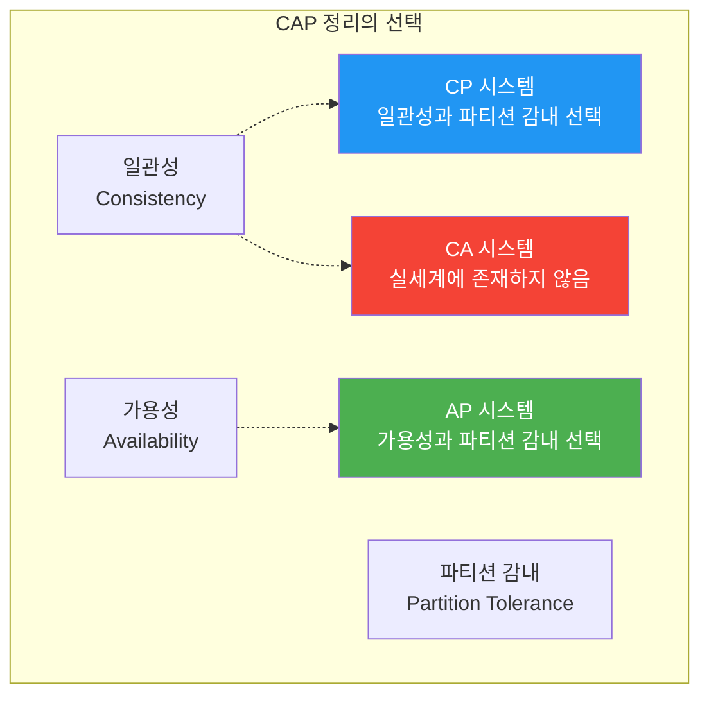
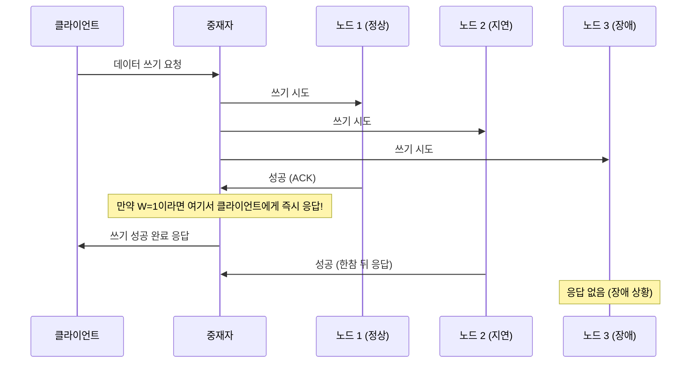
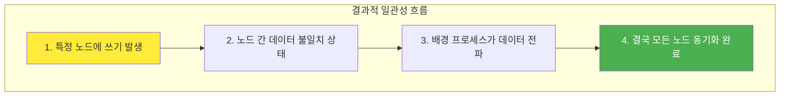
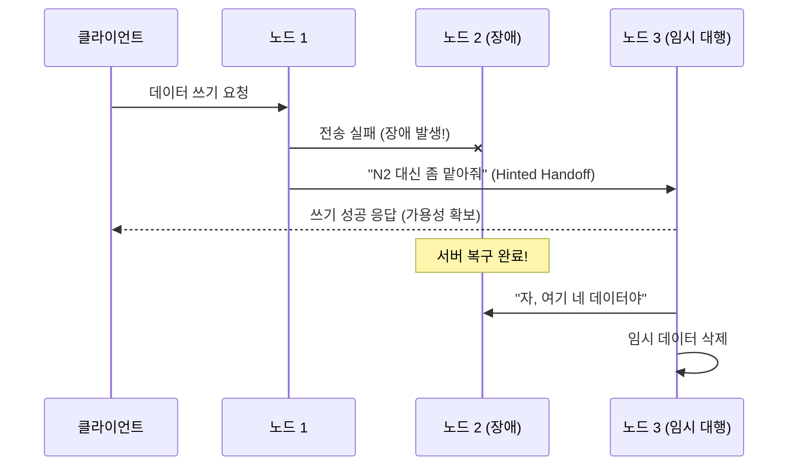
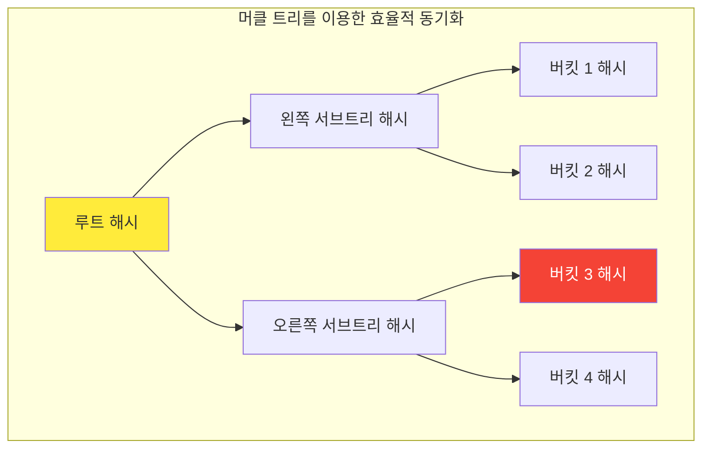
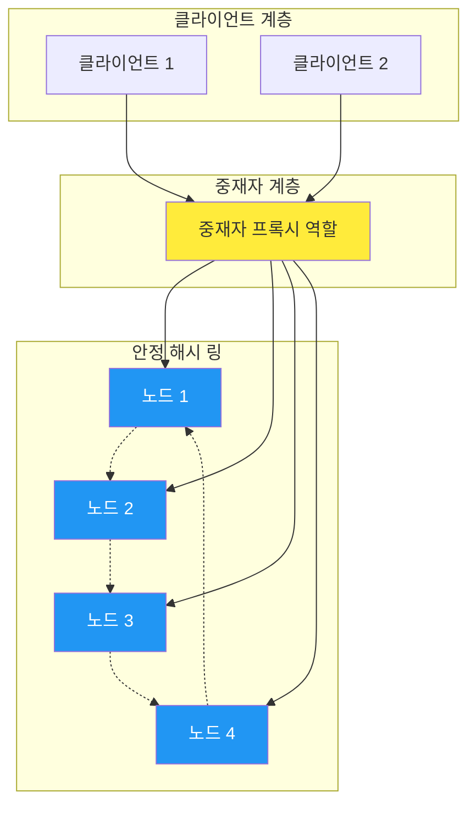
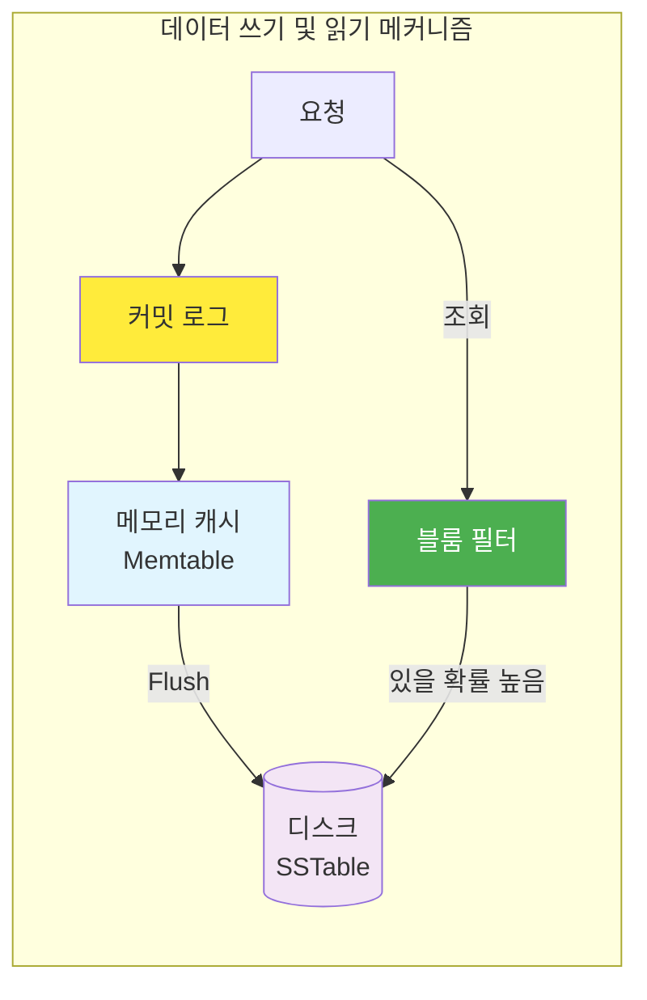

## 시작하며

가면사배 스터디 4주차! 지난 5장 "안정 해시 설계"에서 분산 시스템에서 서버 부하를 균형 있게 나누는 기초를 배웠다면, 이번 6장에서는 본격적으로 **키-값 저장소 설계**를 다룹니다. 단순히 "데이터를 저장한다"는 행위가 분산 환경으로 넘어가는 순간 얼마나 복잡하고 흥미로운 주제가 되는지 깊이 있게 들여다볼 수 있는 시간이었습니다.

사실 이번 장은 공부하면서 꽤나 머리가 아팠던 기억이 나요. 분산 시스템 특유의 불확실성을 어떻게 통제하느냐에 대한 수많은 고민들이 담겨 있거든요. 처음 이 장을 읽었을 때는 "그냥 Redis나 DynamoDB 쓰면 되는 거 아닌가?"라는 가벼운 생각이 들기도 했어요. 하지만 책장을 넘길수록 그 내면에 숨겨진 CAP 정리, 정족수 합의, 벡터 시계 같은 정교한 메커니즘들을 보며 감탄하게 되더라고요. 특히 우리가 당연하게 누리는 시스템의 '고가용성'이 어떤 트레이드오프를 통해 달성되는지 이해하고 나니, 평소 사용하던 저장소들을 바라보는 시선이 완전히 달라진 것 같습니다.

스터디 동기들과 함께 "어느 시점에 일관성을 포기하고 가용성을 선택해야 할까?"에 대해 열띤 토론을 벌였던 기억이 납니다. "우리 서비스라면 무조건 데이터 정확성이 우선이지!"라고 주장했다가도, "사용자 입장에서 앱이 멈추는 것만큼 최악의 경험은 없을 거야"라는 반론에 부딪히며 시스템 설계의 심오함을 느꼈습니다. 그 과정에서 얻은 인사이트들을 바탕으로, 대규모 시스템의 심장이라 할 수 있는 키-값 저장소의 설계 원리를 하나씩 정리해보겠습니다.

## 키-값 저장소의 기본과 단일 서버의 한계

키-값 저장소(Key-Value Store)는 말 그대로 고유한 **키(Key)**와 그에 대응하는 **값(Value)**의 쌍을 저장하는 데이터베이스입니다. 우리가 흔히 사용하는 해시 테이블(Hash Table)을 아주 거대하게 키운 형태라고 생각하면 이해하기 쉬워요.

> **키(Key)**는 데이터를 찾기 위한 고유 식별자입니다. "user:123:profile" 같은 일반 텍스트가 될 수도 있고, "253DDEC4" 같은 해시 값이 될 수도 있죠. 키가 짧고 명확할수록 검색 성능이 올라가기 때문에, 설계할 때 꽤나 신경 써야 하는 부분입니다.

값(Value)은 문자열, 리스트, 객체 등 무엇이든 담을 수 있는 '바구니' 같아요. 이 유연함 덕분에 비정형 데이터를 다루기에 정말 최적화되어 있습니다. 실무에서는 사용자 세션 관리, 캐싱, 장바구니 정보 저장 등에 아주 널리 쓰이죠.

가장 단순한 설계 방식은 한 대의 서버에 모든 데이터를 해시 테이블로 저장하는 것입니다. 빠른 속도가 장점이지만, 서비스가 조금만 성장해도 바로 벽에 부딪히게 되더라고요.

### 단일 서버의 한계와 개선 시도

한 대의 서버로 버티기 위해 보통 이런 노력들을 합니다.
1. **데이터 압축**: 저장 공간을 아끼기 위해 데이터를 압축해서 저장합니다. CPU 연산이 더 들어가지만 용량 확보에는 효과적이죠.
2. **데이터 계층화**: 자주 쓰이는 데이터(Hot Data)는 메모리에, 나머지는 디스크에 두는 방식입니다. 마치 캐시 레이어를 두는 것과 비슷하네요.

하지만 이런 노력에도 불구하고 태생적 한계는 명확했습니다.

| 구분 | 한계점 | 설명 |
| :--- | :--- | :--- |
| **용량 한계** | 메모리 부족 | 아무리 압축해도 한 대의 서버가 감당할 수 있는 데이터량에는 물리적인 끝이 있습니다. |
| **가용성** | 단일 장애점(SPOF) | 서버 한 대가 고장 나면 서비스 전체가 마비되는 치명적인 위험이 있습니다. |
| **확장성** | 수평적 확장 불가 | 트래픽이 몰릴 때 서버를 한 대 더 붙여서 성능을 나누기가 구조적으로 어렵습니다. |

결국 대규모 서비스를 위해서는 **분산 키-값 저장소**로의 전환이 필수적이더라고요. 이 지점부터 진짜 시스템 설계의 묘미가 시작되는 것 같습니다.

## 분산 시스템의 나침반, CAP 정리

분산 시스템을 설계할 때 가장 먼저 마주치는 거대한 장벽이 바로 **CAP 정리**입니다. 일관성(Consistency), 가용성(Availability), 파티션 감내(Partition Tolerance)라는 세 가지 가치를 동시에 만족하는 분산 시스템은 존재하지 않는다는 이론이죠. 

각각의 의미를 조금 더 깊게 들여다보면 이렇습니다.

1. **데이터 일관성(Consistency)**: 어떤 노드에 접속하더라도 모든 클라이언트는 동일한 데이터를 보게 되어야 합니다. "방금 업데이트한 내 프로필 사진이 왜 다른 사람한테는 예전 사진으로 보이지?" 같은 불상사가 없어야 한다는 뜻이죠.
2. **가용성(Availability)**: 일부 노드에 장애가 생기더라도 시스템은 항상 응답을 내려주어야 합니다. "지금은 서버 응답이 지연되고 있습니다"라는 메시지 대신, 성공이든 실패든 어떻게든 빠르게 답을 주는 능력이죠.
3. **파티션 감내(Partition Tolerance)**: 네트워크에 장애(Partition)가 생겨 노드 간 통신이 끊기더라도 시스템은 계속 동작해야 합니다. 분산 시스템에서는 서버가 물리적으로 떨어져 있으므로 파티션 상황은 언제든 발생할 수 있습니다.



여기서 중요한 점은 네트워크 장애(Partition)는 분산 시스템에서 피할 수 없는 현실이라는 것입니다. 네트워크 선이 뽑히거나 장비가 타버리는 일은 우리가 제어할 수 있는 영역 밖이니까요. 그래서 사실상 우리는 **CP**와 **AP** 사이에서 선택을 내려야 합니다.

### 실세계에서의 선택: CP vs AP

만약 네트워크 장애로 인해 노드 간 동기화가 불가능해진다면 어떤 일이 벌어질까요?

- **CP 시스템 (일관성 선택)**: 데이터 불일치를 막기 위해 아예 쓰기 연산을 중단합니다. "정확한 데이터가 아니면 아예 안 보여줄래"라는 고집이죠. 은행 송금이나 증권 거래 같은 서비스가 여기에 해당합니다.
- **AP 시스템 (가용성 선택)**: 조금 낡은 데이터일지라도 일단 읽기/쓰기를 허용합니다. "일단 서비스는 돌아가게 하고, 나중에 네트워크가 복구되면 그때 맞추자"라는 유연한 전략이죠. 인스타그램의 피드나 좋아요 기능이 대표적입니다.

이 부분을 공부하면서 "완벽한 설계란 없구나, 상황에 맞는 최선의 트레이드오프를 찾는 것이 개발자의 진짜 실력이구나"라는 걸 다시 한번 느꼈습니다. 실무에서도 서비스의 비즈니스 가치에 따라 이 기준을 명확히 세우는 게 설계의 시작점이더라고요.

## 데이터 일관성을 위한 정족수 합의

분산 저장소에서는 데이터를 여러 노드에 복제해서 저장합니다. 이때 "어느 정도의 노드에 써야 성공으로 볼 것인가?"를 결정하는 것이 **정족수 합의(Quorum Consensus)** 프로토콜입니다. 

> 정족수 합의란 분산 시스템에서 데이터의 일관성을 보장하기 위해, 읽기나 쓰기 작업 시 사전에 정의된 개수 이상의 노드로부터 동의를 얻어야 하는 방식입니다.

여기에는 세 가지 핵심 변수가 등장합니다.

- **N**: 데이터를 복제할 노드의 개수 (예: N=3이면 3개 서버에 사본 저장)
- **W**: 쓰기 성공으로 간주하기 위해 필요한 최소 승인 수 (W개 서버가 오케이라고 해야 성공)
- **R**: 읽기 성공으로 간주하기 위해 필요한 최소 응답 수 (R개 서버로부터 데이터를 받아야 성공)

이 변수들을 어떻게 조합하느냐에 따라 시스템의 성격이 완전히 달라지는데요. 아래 테이블을 보면 그 차이가 명확해집니다.

| 설정 전략 | 특징 | 장점 | 주요 사용 사례 |
| :--- | :--- | :--- | :--- |
| **W + R > N** | 강한 일관성을 보장합니다. | 어떤 노드에서 읽어도 최신 데이터를 보장받습니다. | 정확성이 생명인 금융/결제 시스템 |
| **R = 1, W = N** | 읽기 중심 최적화 | 읽기 속도가 매우 빠르지만, 쓰기 시 모든 노드 응답을 기다려야 합니다. | 조회가 빈번한 환경 |
| **W = 1, R = N** | 쓰기 중심 최적화 | 쓰기 속도가 매우 빠르지만, 읽기 시 모든 노드를 확인해야 합니다. | 로그 수집처럼 쓰기가 많은 환경 |



N, W, R 값을 조절하는 것은 마치 오디오의 이퀄라이저를 조절해서 원하는 음색을 찾는 과정 같더라고요. 실무에서도 서비스의 트래픽 패턴을 분석해서 이 값들을 세밀하게 튜닝하면, 하드웨어를 늘리지 않고도 엄청난 성능 이득을 볼 수 있겠다는 생각이 들었습니다.

## 서비스에 맞는 일관성 모델 선택하기

일관성 모델은 데이터의 정확도와 시스템 성능 사이의 약속입니다. 모든 서비스가 실시간으로 100% 완벽한 데이터를 보장할 필요는 없거든요. 때로는 속도를 위해 아주 미세한 불일치를 허용하는 것이 더 영리한 선택일 수 있습니다.

| 모델명 | 데이터 보장 수준 | 성능 영향 | 특징 |
| :--- | :--- | :--- | :--- |
| **강한 일관성** | 최상 (항상 최신 데이터) | 높음 | 쓰기 완료 시까지 읽기/쓰기 차단, 고가용성 저하 |
| **약한 일관성** | 낮음 (오래된 데이터 가능) | 낮음 | 성능 최우선, 데이터 유실 위험 감수 |
| **결과적 일관성** | 중간 (결국에는 맞춰짐) | 낮음 | 높은 가용성과 성능 보장, 분산 DB의 표준 |

### 결과적 일관성 (Eventual Consistency)

가장 흥미로웠던 모델은 **결과적 일관성**이었습니다. 당장은 사본들끼리 데이터가 다를 수 있지만, 시간이 지나면 결국 모든 노드가 같은 데이터를 갖게 된다는 철학이죠.



Amazon의 DynamoDB나 Cassandra 같은 세계적인 저장소들이 바로 이 모델을 채택하고 있습니다. 처음에는 "데이터가 안 맞으면 사고 아닌가?" 싶었지만, 수억 명의 사용자가 접속하는 환경에서 0.1초의 지연 시간을 줄이기 위해 이보다 영리한 트레이드오프는 없겠다는 생각이 들더라고요. 우리가 흔히 보는 소셜 미디어의 '좋아요' 수가 새로고침할 때마다 조금씩 변하는 것도 다 이런 이유 때문이었습니다.

## 데이터 충돌을 해결하는 벡터 시계

결과적 일관성을 선택하면 필연적으로 **데이터 충돌**이라는 손님을 맞이하게 됩니다. 여러 서버가 동시에 같은 데이터를 수정할 때, "누가 마지막에 썼는지" 혹은 "어떤 버전을 살려야 하는지"를 결정해야 하죠. 이때 사용하는 마법 같은 도구가 **벡터 시계(Vector Clock)**입니다.

> **벡터 시계**는 `[서버, 버전]`의 순서쌍을 데이터에 매단 것입니다. 어떤 버전이 다른 버전보다 앞선 것인지, 뒤처진 것인지, 아니면 서로 충돌하고 있는지를 판단하는 지표가 됩니다.

JavaScript로 간단한 로직을 구현해보면 이런 느낌입니다. (실제 시스템에서는 훨씬 복잡하겠지만 원리는 동일합니다!)

```javascript
class VectorClock {
  constructor() {
    this.clock = new Map(); // 서버ID -> 버전 카운터
  }

  // 데이터 업데이트 시 해당 서버의 버전 카운터 증가
  increment(serverId) {
    const current = this.clock.get(serverId) || 0;
    this.clock.set(serverId, current + 1);
    return new Map(this.clock); // 복제본 반환
  }

  // 두 시계를 비교하여 선후 관계 판단
  compare(otherClock) {
    let thisGreater = false;
    let otherGreater = false;

    const allServers = new Set([...this.clock.keys(), ...otherClock.keys()]);

    for (const server of allServers) {
      const v1 = this.clock.get(server) || 0;
      const v2 = otherClock.get(server) || 0;

      if (v1 > v2) thisGreater = true;
      if (v1 < v2) otherGreater = true;
    }

    if (thisGreater && !otherGreater) return "AFTER";   // this가 후행
    if (!thisGreater && otherGreater) return "BEFORE";  // this가 선행
    if (!thisGreater && !otherGreater) return "EQUAL";   // 동일 버전
    return "CONFLICT"; // 서로 다른 가지로 뻗어나간 충돌 상태
  }
}
```

### 벡터 시계 도입 시 고려할 점

벡터 시계가 만능은 아니더라고요. 실무에 도입한다면 아래 두 가지 한계를 꼭 고민해야 합니다.

1. **클라이언트 구현 복잡성**: 충돌을 감지하는 것은 저장소의 몫이지만, 이를 해결(Resolution)하는 로직은 보통 클라이언트가 작성해야 합니다. "A와 B 중 어떤 데이터를 살릴까?"에 대한 비즈니스 판단이 필요하기 때문이죠.
   - **Last Write Wins (LWW)**: 가장 간단하게는 타임스탬프를 기준으로 마지막에 쓴 것을 살리는 방식입니다.
   - **Semantic Resolution**: 데이터의 특성에 따라 병합 로직을 직접 짜는 방식입니다. 장바구니라면 두 버전을 합치는(Union) 식이죠.
2. **벡터 시계의 크기 증가**: 서버가 많아질수록 `[서버, 버전]` 쌍이 늘어나서 데이터 크기가 커집니다. 이를 막기 위해 오래된 쌍을 지우는 임계치(Threshold) 설정이 필요한데, 이때 선후 관계 판단이 부정확해질 수 있는 리스크가 있습니다.

실제로 이 로직을 공부하면서 "충돌을 무조건 피하는 게 아니라, 발생을 인정하고 영리하게 해결하는 게 분산 시스템의 핵심이구나"라는 걸 깊이 깨달았습니다.

## 분산 시스템의 숙명, 장애 대응 전략

서버가 수백, 수천 대인 시스템에서 장애는 예외가 아니라 '일상'입니다. 책에서는 이 일상을 우아하게 관리하는 세 가지 핵심 전략을 제시하는데, 그 아이디어들이 정말 무릎을 치게 만들더라고요.

### 1. 가십 프로토콜 (Gossip Protocol)

모든 노드가 서로의 상태를 일일이 확인(Multicasting)하는 건 서버 수가 많아질수록 엄청난 낭비입니다. 가십 프로토콜은 말 그대로 '소문'을 내는 방식이에요.

1. 각 노드는 멤버십 목록을 가지고, 주기적으로 자신의 **박동 카운터(Heartbeat Counter)**를 올립니다.
2. 무작위로 선정된 몇몇 노드에게만 자신의 정보를 보냅니다.
3. 정보를 받은 노드는 자신의 목록을 최신화하고, 또 다른 노드에게 전파합니다.
4. 특정 노드의 박동 카운터가 오랫동안 멈춰있다면, 시스템은 소문을 통해 "그 친구 죽은 것 같아"라고 판단합니다.

마치 학교에서 친구들끼리 소문을 퍼뜨리는 것과 비슷해서 정말 효율적이라는 생각이 들었습니다. 중앙 서버 없이도 시스템 전체가 생생하게 살아 움직이는 느낌을 주더라고요.

### 2. 단서 후 임시 위탁 (Hinted Handoff)

특정 서버가 잠시 죽었을 때, 다른 건강한 서버가 대신 데이터를 받아두었다가 나중에 복구되면 돌려주는 방식입니다. "임시 보관증"을 써주는 것과 비슷해요.



덕분에 사용자 입장에서는 특정 서버가 죽었는지도 모른 채 서비스를 계속 이용할 수 있습니다. 시스템의 가용성을 극한으로 끌어올리는 아주 똑똑한 방법이죠.

### 3. 머클 트리 (Merkle Tree)

서버 간에 데이터가 정말 똑같은지 확인할 때(Anti-Entropy), 전체 데이터를 다 보내는 건 엄청난 네트워크 낭비겠죠? 머클 트리는 데이터를 버킷 단위로 나누어 해시값을 비교하며 다른 부분만 핀셋처럼 찾아냅니다.



루트 해시값만 비교해서 같으면 통과, 다르면 자식 노드로 내려가며 정확히 어느 버킷이 다른지 찾아내는 과정이 정말 효율적이더라고요. 이런 세부적인 전략들을 보며 분산 시스템이 왜 "장애를 극복하기 위해 진화한 생명체" 같은지 다시 한번 느꼈습니다.

## 전체적인 시스템 아키텍처와 데이터 흐름

지금까지 배운 내용들을 하나로 묶으면 대규모 분산 키-값 저장소의 청사진이 그려집니다. 안정 해시 링 위에 데이터가 다중화되어 있고, 모든 노드가 동일한 책임을 지는 '완전 분산형' 구조가 핵심이죠.



이런 구조에서는 특정 서버가 죽어도 다른 노드가 그 역할을 대신할 수 있어 단일 장애점(SPOF)이 없습니다. 여기서 데이터가 실제로 디스크에 써지고 읽히는 과정도 꽤나 정교하게 설계되어 있더라고요.

1. **쓰기 경로**: 먼저 요청을 받으면 커밋 로그(Commit Log) 파일에 기록해서 안정성을 확보합니다. 그 다음 메모리 캐시(Memtable)에 데이터를 씁니다. 만약 메모리가 가득 차면 디스크의 SSTable(Sorted String Table)이라는 파일로 내보내죠.
2. **읽기 경로**: 메모리 캐시를 먼저 확인하고, 없으면 디스크를 뒤져야 합니다. 이때 **블룸 필터(Bloom Filter)**를 사용해서 어느 SSTable 파일에 우리가 찾는 데이터가 있는지 광속으로 걸러냅니다.



이 흐름을 보면서 Cassandra 같은 DB가 왜 그렇게 쓰기 성능이 괴물 같은지 이해가 됐습니다. 디스크의 여기저기를 찌르는 임의 쓰기(Random Write)를 피하고, 로그를 쌓듯 순차 쓰기(Sequential Write)를 활용하는 구조가 비결이었더라고요. "메모리에서 디스크로의 효율적인 플러시"가 시스템 전체 성능을 좌우한다는 걸 깨달았습니다.

## DynamoDB부터 Redis까지, 실무 적용 사례

마지막으로 우리가 현업에서 자주 만나는 저장소들이 각자 어떤 철학을 가지고 있는지 정리해봤습니다. 같은 NoSQL이라도 속을 들여다보면 성격이 참 다르더라고요.

| 서비스명 | CAP 분류 | 핵심 특징 | 주요 설계 철학 |
| :--- | :--- | :--- | :--- |
| **Amazon DynamoDB** | **AP** | 완전 관리형, 자동 확장 | 높은 가용성, 결과적 일관성, 벡터 시계 사용 |
| **Apache Cassandra** | **AP** | 선형적 확장성, SPOF 없음 | 튜닝 가능한 일관성(Query마다 설정 가능) |
| **Redis** | **CP (Cluster)** | 메모리 기반, 극강의 속도 | 고성능 캐싱, 마스터-슬레이브 복제 |
| **Riak** | **AP** | 오류에 강한 분산 구조 | 최종 일관성, 벡터 시계 기반 충돌 해소 |

- **Amazon DynamoDB**: AWS를 쓴다면 가장 먼저 고려하게 되는 녀석이죠. 벡터 시계를 사용해서 충돌을 감지하고, "무조건 응답한다"는 철학 아래 엄청난 가용성을 보여줍니다.
- **Apache Cassandra**: 데이터 센터를 여러 개 두는 글로벌 서비스에서 빛을 발합니다. 특히 쓰기 성능이 중요할 때 이만한 대안이 없는 것 같아요.
- **Redis**: 캐시나 세션 저장소로 거의 표준처럼 쓰입니다. 메모리에서 모든 게 이뤄지다 보니 속도 면에서는 타의 추종을 불허하지만, 데이터 영속성(Persistence) 옵션을 잘 설정하는 게 운영의 묘미더라고요.
- **Riak**: 분산 환경에서의 안정성을 최우선으로 고려한 시스템입니다. 벡터 시계를 통해 데이터 정합성을 맞추는 과정이 매우 정교하게 설계되어 있어, 연구해볼 가치가 충분합니다.

처음엔 "다 비슷한 거 아닌가?" 싶었는데, 각자의 장단점과 탄생 배경을 알고 나니 프로젝트 상황에 맞춰 어떤 도구를 꺼내 들어야 할지 어느 정도 감이 잡히는 것 같습니다. "무조건 좋은 기술은 없다, 우리 서비스에 맞는 기술이 있을 뿐이다"라는 선배들의 말이 다시금 떠오르네요.

## 실무에 적용할 수 있는 인사이트들

### 1. 트레이드오프는 피하는 게 아니라 선택하는 것

- 시스템 설계에 완벽한 정답은 없습니다.
- 서비스의 비즈니스 가치에 따라 일관성과 가용성 중 무엇이 더 중요한지 우선순위를 정해야 합니다.
- 무조건적인 '강한 일관성' 고집은 성능 저하의 주범이 될 수 있다는 걸 명심해야겠더라고요. 가끔은 '결국에는 맞춰지겠지'라는 유연함이 대규모 시스템을 지탱하는 힘이 됩니다.

### 2. 장애를 상수로 두는 설계 습관

- "서버는 언제든 죽을 수 있다"는 가정을 아키텍처에 녹여내야 합니다.
- 가십 프로토콜이나 재시도 로직 같은 자동 복구 메커니즘이 없는 분산 시스템은 모래성이나 다름없습니다.
- 실패를 우아하게 처리하는 'Graceful Degradation' 전략을 항상 고민하게 됐습니다. "서버가 죽어도 사용자는 눈치채지 못하게" 만드는 것이 프로의 설계라는 생각이 들었습니다.

### 3. 데이터 액세스 패턴 분석의 힘

- N, W, R 값을 조정하는 것만으로도 시스템의 성격이 완전히 바뀝니다.
- 우리 서비스가 읽기 중심인지 쓰기 중심인지 명확히 파악하면 저장소 비용을 아끼고 성능은 극대화할 수 있습니다. 무작정 서버 사양을 올리기 전에, 이런 소프트웨어적인 튜닝 포인트를 먼저 찾아보는 습관을 들여야겠어요.

### 4. 확장성을 고려한 유연한 아키텍처

- 처음부터 완벽한 분산 시스템을 구축할 수는 없습니다.
- 하지만 데이터가 커졌을 때 수평적 확장(Scale-out)이 가능한 구조인지는 반드시 체크해야 합니다.
- 안정 해시나 가십 프로토콜 같은 기술들이 왜 등장했는지를 이해하면, 미래의 확장을 대비한 기초 공사를 더 탄탄히 할 수 있을 것 같아요.

## 마무리

이번 6장 "키-값 저장소 설계"를 통해 분산 시스템의 핵심 원리들을 정말 압축적으로 배울 수 있었습니다. 단순히 기술적인 스택을 아는 것을 넘어, 그 이면에 흐르는 설계 철학과 트레이드오프의 기술을 엿본 느낌이라 더 뜻깊은 시간이었던 것 같아요.

특히 "결국에는 모든 데이터가 맞춰질 것이다"라는 결과적 일관성의 철학이 현대 대규모 시스템을 지탱하는 거대한 기둥이라는 사실이 깊게 와닿았습니다. 우리가 만드는 서비스들도 이런 유연함을 가질 때 비로소 진정한 의미의 확장성을 얻게 되는 게 아닐까 싶습니다. 시스템을 하나의 거대한 생명체로 바라보고, 장애와 충돌을 자연스럽게 받아들이는 자세가 개발자로서 한 단계 성장하는 계기가 된 것 같아요.

다음 포스트에서는 7장 **"분산 시스템을 위한 유일 ID 생성기 설계"**를 다룰 예정입니다. 전 세계에서 겹치지 않는 유일한 ID를 만드는 것이 분산 환경에서 왜 어려운지, 그리고 어떤 기발한 방법들이 있는지 기대해주세요! 가면사배 시리즈는 계속됩니다!

### 🏗️ 분산 아키텍처에 대한 질문

- 비즈니스 요구사항에 따라 CAP 중 어떤 두 가지를 선택하시나요? 금융 시스템과 소셜 미디어는 어떻게 달라야 할까요?
- 가용성을 위해 일관성을 포기했을 때 발생하는 비즈니스 리스크를 어떻게 관리하시나요?
- 네트워크 파티션 상황을 시뮬레이션하고 테스트해보신 경험이 있나요?

### ⚖️ 일관성과 정족수 설정에 대한 질문

- N=3인 환경에서 W=2, R=2 설정과 W=1, R=3 설정의 실제 성능 차이를 느껴보신 적이 있나요?
- 결과적 일관성 모델을 도입할 때 사용자 경험(UX) 측면에서 어떤 장치가 필요할까요?
- 정족수 합의가 실패했을 때의 폴백(Fallback) 전략은 어떻게 세우시나요?

### 🛠️ 데이터 충돌 및 장애 처리에 대한 질문

- 벡터 시계를 직접 구현하거나 사용해보면서 겪었던 가장 큰 어려움은 무엇이었나요?
- 가십 프로토콜 대신 중앙 집중식 상태 관리(예: ZooKeeper)를 사용하는 것이 더 유리한 경우는 언제일까요?
- 머클 트리를 활용해 대규모 데이터를 동기화해본 경험이 있으신가요?

댓글로 공유해주시면 함께 배워나갈 수 있을 것 같습니다!
