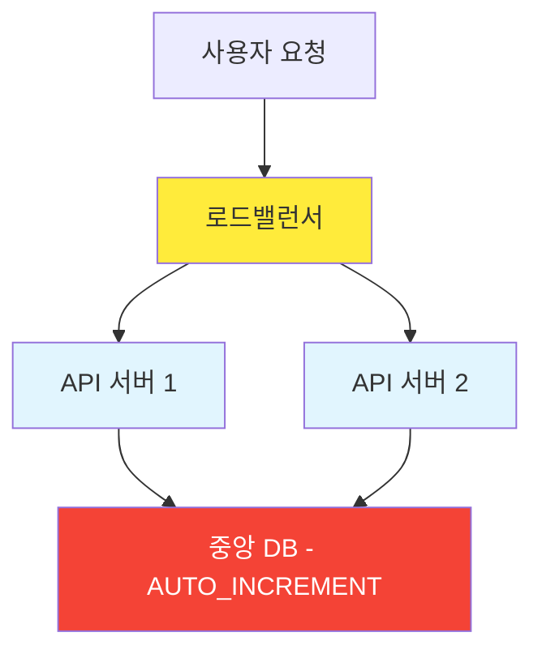
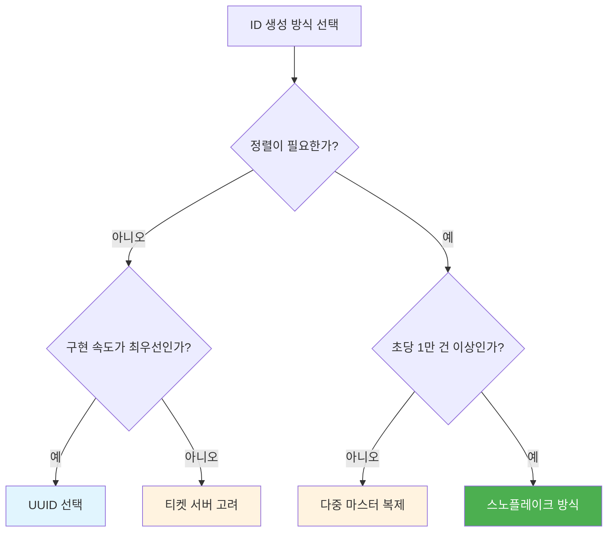
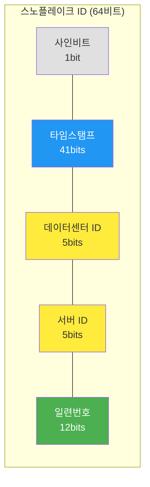

## 시작하며

가면사배 스터디 4주차에 접어들었습니다! 지난 6장 **"키-값 저장소 설계"**를 통해 분산 저장소의 복잡함과 정합성 유지의 어려움을 맛보았다면, 이번 7장에서는 그 저장소에 들어갈 데이터를 유일하게 식별할 수 있는 **"유일 ID 생성기"**에 대해 깊이 있게 공부했습니다. 스터디원들과 매주 목요일 저녁에 모여 토론하다 보면, 우리가 무심코 사용하는 아주 작은 데이터 단위 하나에도 정말 거대한 아키텍처 고민이 담겨 있다는 걸 매번 깨닫게 되더라고요.

처음 주제를 접했을 때는 "ID 생성하는 게 그렇게 큰 일인가? 그냥 데이터베이스에서 하나씩 늘려주면 되는 거 아냐?"라고 가볍게 생각했었거든요. 그런데 분산 시스템이라는 거대한 전제가 붙으니 고려해야 할 게 정말 많았습니다. 단순히 값이 겹치지 않게 만드는 것을 넘어, 시간 순서대로 정렬이 가능해야 하고, 초당 수만 건의 요청을 눈 깜짝할 새 처리해야 하며, 서버 한두 대가 죽어도 끄떡없어야 한다는 점이 꽤나 흥미로운 도전 과제였습니다. 이번 장을 읽으면서 "우리가 평소에 고유값으로 가볍게 쓰던 것들이 시스템 규모가 커지면 독이 될 수도 있겠구나"라는 생각이 들어서 정신이 번쩍 들었습니다.

## 분산 환경에서 유일 ID 생성이 어려운 이유

가장 먼저 부딪힌 장벽은 우리가 흔히 사용하는 데이터베이스의 `AUTO_INCREMENT` 기능이 가진 태생적인 한계였습니다. 단일 데이터베이스 환경에서는 너무나 당연하고 편리한 기능이지만, 서비스 규모가 커져서 서버를 여러 대로 늘리고 데이터베이스를 분산(Sharding)하는 순간 이 방식은 작동을 멈추거나 심각한 시스템의 아킬레스건이 됩니다.

보통 우리가 서비스를 처음 만들 때는 아래처럼 간단하게 ID를 생성하잖아요?

```sql
CREATE TABLE users (
  id BIGINT AUTO_INCREMENT PRIMARY KEY,
  name VARCHAR(100),
  email VARCHAR(100)
);
```

하지만 시스템이 커져서 데이터베이스 서버가 한 대에서 수십 대로 늘어나면, 각 서버가 "다음 ID는 내 차례인가?"를 서로 물어봐야 하는 상황이 벌어집니다. 이 과정에서 병목 현상이 생기거나, 자칫 잘못하면 중복된 ID가 발급되는 대참사가 일어날 수 있는 거죠.



위 그림처럼 모든 ID 생성을 하나의 중앙 데이터베이스에 의존하게 되면 몇 가지 심각한 리스크가 생깁니다.

1.  **단일 장애점 (SPOF)**: ID를 발급해주는 서버가 딱 한 대뿐인데, 여기가 죽어버리면 시스템 전체가 마비됩니다. 유일성이 생명인 시스템에서 ID 발급이 안 되면 데이터 저장 자체가 불가능해지니까요. 실제로 제가 예전에 경험했던 서비스에서도 ID 생성용 DB가 잠깐 죽었을 뿐인데, 회원 가입부터 주문까지 모든 기능이 멈췄던 아찔한 기억이 있습니다.
2.  **지연 시간 (Latency)**: 사용자는 전 세계 곳곳에 있는데, ID 하나 받으려고 지구 반대편에 있는 중앙 DB까지 매번 네트워크 통신을 해야 한다면 전체 응답 속도가 느려지는 결과를 초래합니다. 수 밀리초(ms)가 아까운 실시간 시스템에서는 치명적인 약점이죠.
3.  **확장성 (Scalability)**: 초당 수만 개의 ID를 생성해야 하는 폭발적인 트래픽 상황이 오면, 단일 DB 서버의 디스크 I/O나 잠금(Locking) 경쟁 때문에 그 부하를 견뎌내기 힘들어요. CPU 점유율이 솟구치면서 결국 응답을 거부하는 상황까지 가게 됩니다.

면접 상황을 가정한 요구사항 정의 단계에서도 꽤 까다로운 조건들이 따라붙었습니다. 면접관과 지원자의 대화를 통해 이번 설계의 목표를 명확히 정의하는 과정이 인상적이었는데요.

| 질문 | 답변 |
| :--- | :--- |
| **지원자**: "ID는 어떤 특성을 가져야 하나요?" | **면접관**: "ID는 유일해야 하고, 정렬 가능해야 합니다." |
| **지원자**: "새로운 레코드에 붙일 ID는 항상 1만큼 큰 값이어야 하나요?" | **면접관**: "시간 흐름에 따라 커지긴 해야 하지만, 1씩 증가할 필요는 없습니다." |
| **지원자**: "ID는 숫자로만 구성되나요?" | **면접관**: "그렇습니다." |
| **지원자**: "시스템 규모는 어느 정도입니까?" | **면접관**: "초당 10,000개의 ID를 생성할 수 있어야 합니다." |

이런 대화를 통해 정리된 핵심 요구사항은 다음과 같았습니다.
- **유일성**: ID는 전 세계에서 유일해야 한다.
- **숫자 구성**: ID는 숫자로만 구성되어야 한다. (문자열은 가급적 지양)
- **64비트**: ID는 64비트로 표현 가능한 값이어야 한다. (저장 공간 최적화)
- **시간 순서**: ID 발급 날짜에 따라 정렬 가능해야 한다.
- **성능**: 초당 10,000개의 ID를 만들 수 있어야 한다.

특히 **"초당 10,000개의 ID를 생성할 수 있어야 한다"**는 조건은 분산 환경이 아니면 도저히 감당할 수 없는 수준이더라고요. 이런 조건들을 모두 충족하면서 분산 환경에서 안정적으로 동작하게 만드는 게 이번 장의 핵심이었습니다.

스터디원들과 "우리가 운영하는 서비스에서 ID 생성이 병목이 될 수 있는 구간이 있을까?" 하고 돌이켜봤는데, 결제 시스템에서 주문번호 생성이 그런 케이스에 해당하더라고요.
블랙 프라이데이 같은 대형 세일 때 초당 수만 건의 주문이 동시에 들어오면, ID 생성이 느리다는 것 자체가 곧 매출 손실로 직결되니까요.
이런 실무 사례와 연결해서 생각하니 단순히 고유함을 보장하는 것을 넘어 시스템 전체의 효율성과 가용성을 고민해야 하는 영역이라는 게 더 와닿았습니다.

## 다양한 해결책의 장단점 비교

책에서는 최종적인 정답인 스노플레이크 방식에 도달하기까지 거쳐온 여러 대안을 먼저 제시합니다. 각 방법이 가진 트레이드오프를 꼼꼼히 비교해보니 "왜 이런 방식이 태어났는가"에 대한 맥락이 더 잘 이해됐습니다.

### 1. 다중 마스터 복제 (Multi-master Replication)

데이터베이스의 `auto_increment` 기능을 쓰되, 다음 ID를 구할 때 1이 아니라 **현재 서버 대수(k)**만큼 건너뛰며 생성하는 방식입니다. 서버가 2대라면 서버 1은 홀수(1, 3, 5...), 서버 2는 짝수(2, 4, 6...)만 만드는 식이죠.

- **장점**: 기존 데이터베이스 기능을 그대로 활용하므로 구현이 매우 간단하고, 데이터베이스 서버를 늘리면 이론적으로 초당 생산 가능한 ID 수도 늘어나는 수평적 확장이 가능합니다.
- **단점**: 서버를 중간에 추가하거나 제거할 때 정교한 관리가 필요합니다. 만약 서버를 2대에서 3대로 늘린다면, 기존에 짝수/홀수로 나누던 로직을 전부 3의 배수 체계로 바꿔야 하는데 이게 생각보다 까다로워 보이더라고요. 또한 여러 데이터 센터에 걸쳐 규모를 늘리기가 어렵고, 시간 흐름에 따른 정렬을 완벽하게 보장하기 어렵다는 한계가 있습니다.

예를 들어 서버 A가 1, 3, 5를 만들고 서버 B가 2, 4, 6을 만들면, 서버 B가 2번 ID를 만든 시점이 서버 A가 3번을 만든 시점보다 늦을 수 있어요.
숫자 크기와 실제 생성 시간이 일치하지 않는 거죠.
시간 순서가 중요한 타임라인 같은 기능에서는 이게 꽤 큰 문제가 됩니다.

### 2. UUID (Universally Unique Identifier)

서버들끼리 전혀 대화할 필요 없이 각자 알아서 128비트짜리 고유 ID를 생성하는 방식입니다. 128비트면 대략 340간(3.4 x 10^38) 개의 조합이 가능해서 중복될 확률이 거의 로또 당첨보다 낮다고 하네요.

- **장점**: 동기화 이슈가 전혀 없고, 서버를 무한정 늘려도 충돌 걱정이 거의 없습니다. 구현 자체가 매우 단순해서 어떤 프로그래밍 언어든 라이브러리 한 줄이면 생성이 가능하죠.
- **단점**: ID가 128비트로 너무 길어서 저장 공간을 많이 차지합니다. 요구사항은 64비트였는데 두 배나 긴 셈이죠. 또한 숫자가 아닌 '550e8400-e29b-41d4-a716-446655440000' 같은 형태라 가독성이 떨어지고, 무엇보다 생성 시간순으로 정렬이 불가능하다는 점이 가장 큰 약점이었습니다. 인덱싱 성능 면에서도 무작위로 들어오는 UUID는 DB에 큰 부담을 준다고 하더라고요.

> **인덱스 성능 이슈**: B-Tree 인덱스는 정렬된 순서로 삽입될 때 가장 효율적입니다.
> UUID처럼 완전히 랜덤한 값이 들어오면 트리의 여기저기를 수정해야 해서
> 페이지 분할(Page Split)이 빈번하게 발생하고, 이는 쓰기 성능을 크게 떨어뜨립니다.

참고로 최근에는 UUID v7이라는 새로운 표준이 나왔는데, 앞부분에 타임스탬프를 배치해서 정렬 문제를 해결했어요.
하지만 여전히 128비트라는 크기와 문자열 형태라는 점은 그대로라서, 64비트 숫자 ID가 필요한 환경에서는 스노플레이크가 여전히 우세합니다.

### 3. 티켓 서버 (Ticket Server)
ID 발급만을 전담하는 별도의 전용 서버를 두는 중앙집중식 방법입니다. 과거 플리커(Flickr)에서 분산 기본 키를 만들기 위해 이 기술을 사용했다고 하더라고요.

- **장점**: 유일성이 완벽하게 보장되면서도 오직 숫자로만 구성된 ID를 아주 쉽게 만들 수 있습니다. 구현 난이도가 낮아서 중소 규모 애플리케이션에서는 꽤 매력적인 선택지가 될 것 같아요.
- **단점**: 역시나 **티켓 서버 자체가 단일 장애점(SPOF)**이 된다는 점이 발목을 잡습니다. 이 서버 하나만 죽어도 시스템 전체의 '쓰기' 작업이 멈춰버리니까요. 가용성을 위해 티켓 서버를 여러 대 두면 다시 서버 간 데이터 동기화와 중복 방지라는 복잡한 문제에 직면하게 됩니다.

플리커(Flickr)가 이 방식을 성공적으로 운영할 수 있었던 건, 티켓 서버를 2대로 이중화하면서 하나는 홀수, 하나는 짝수만 발급하게 만들었기 때문이에요.
사실상 다중 마스터와 티켓 서버의 하이브리드인 셈이죠.
이 사례를 보면서 "교과서적인 분류가 절대적인 건 아니고, 실무에서는 여러 방식을 창의적으로 조합하는 게 핵심이구나"라는 걸 느꼈습니다.

각 방법의 특징을 한눈에 들어오게 테이블로 정리해봤습니다.

| 비교 항목 | 다중 마스터 | UUID | 티켓 서버 | 스노플레이크 |
| :--- | :--- | :--- | :--- | :--- |
| **길이** | 가변 (숫자) | 128비트 (문자열) | 가변 (숫자) | 64비트 (숫자) |
| **정렬 가능** | 부분적 | 불가 | 가능 | 가능 |
| **중앙 조율** | 필요함 | 필요 없음 | 필요함 | 필요 없음 |
| **구현 난이도** | 중간 | 매우 쉬움 | 쉬움 | 중간 |
| **가용성** | 중간 | 높음 | 낮음 | 높음 |

처음에는 그냥 UUID를 쓰면 제일 속 편하지 않을까 생각했는데, 데이터베이스 인덱싱 효율(B-Tree 구조에서의 무작위 삽입)이나 저장 공간의 낭비를 고려하면 64비트 숫자로 된 정렬 가능한 ID가 대규모 시스템에서는 압도적으로 유리하다는 걸 알게 됐습니다.

스터디에서 한 동기가 "그러면 실무에서는 언제 어떤 방식을 써야 하느냐"고 물었는데, 결국 상황에 따라 다르다는 게 정직한 답이더라고요. 아래 의사결정 흐름이 도움이 될 것 같아서 정리해봤습니다.



스터디원들도 이 흐름도를 보고 "결국 대규모 시스템이라면 스노플레이크가 거의 유일한 선택지"라는 데 동의했어요. 그리고 이런 고민의 산물로 등장한 것이 바로 그 유명한 트위터의 **스노플레이크** 방식입니다.

## 트위터 스노플레이크 상세 설계

트위터에서 개발한 스노플레이크(Snowflake)는 ID를 단순한 숫자 덩어리로 보지 않고, **비트(bit)를 정교하게 쪼개서** 그 안에 여러 가지 의미 있는 정보를 담는 전략을 씁니다. 마치 ID에 지리적, 시간적 정보를 인코딩하는 것과 비슷하더라고요.

### 64비트 ID 구조 뜯어보기

스노플레이크 ID 하나는 총 64비트로 구성되며, 각 비트 영역마다 고유한 역할이 배정되어 있습니다. 이 구조를 처음 봤을 때 "와, 비트 하나하나를 정말 알뜰하게 쓰는구나" 싶었습니다.



각 영역의 역할을 자세히 살펴보면 이렇습니다.

1.  **사인(Sign) 비트 (1비트)**: 64비트 정수의 가장 앞부분입니다. 양수와 음수를 구분하는 비트지만, ID는 항상 양수여야 하므로 보통 0으로 고정합니다.
2.  **타임스탬프 (41비트)**: 특정 기점(Epoch) 이후 경과한 밀리초(ms)입니다. 이게 가장 앞부분에 위치하기 때문에 ID가 발급 시간 순서대로 자연스럽게 정렬되는 마법이 일어납니다.
    - **왜 41비트인가?**: 2의 41승은 약 2조 2천억입니다. 이를 밀리초로 환산하면 약 69년(2^41 / 1000 / 60 / 60 / 24 / 365) 정도를 버틸 수 있는 분량이죠. 69년이면 웬만한 서비스의 수명보다는 길겠지만, 2010년에 시작한 트위터라면 이제 50년 정도 남은 셈이네요. 그 이후에는 기점을 옮기거나 비트 설계를 바꿔야 하겠죠?
3.  **데이터센터 ID (5비트)**: 총 32개(2^5)의 데이터센터를 식별합니다. 전 세계에 흩어져 있는 대규모 인프라를 구분하는 데 쓰이죠.
4.  **서버 ID (5비트)**: 각 데이터센터 내부에 있는 서버 32개를 식별합니다. 즉, 데이터센터당 32대, 전체 시스템에서 총 1,024개(32 * 32)의 독립된 서버 노드를 운영할 수 있다는 뜻입니다.
5.  **일련번호 (12비트)**: 각 서버가 같은 밀리초(1ms) 내에 ID를 여러 개 생성할 때 구분하기 위한 값입니다. 1ms마다 0으로 초기화되며, 최대 4,096개(2^12)까지 생성이 가능합니다. 초당 400만 개 이상의 ID를 만들 수 있는 엄청난 성능이죠.

### 타임스탬프가 중요한 진짜 이유

스노플레이크의 핵심은 결국 **타임스탬프**에 있습니다. 시간이 흐름에 따라 점점 큰 값을 가지므로, 결과적으로 ID 자체가 시간순으로 정렬 가능하게 되죠. 책에 나온 계산 예시를 보며 더 명확히 이해할 수 있었습니다.

> **타임스탬프 역추적 예시**
> 1. 이진수 타임스탬프: `00100010101001011010011011000101101011000` (41비트)
> 2. 십진수 변환: 297,616,116,568
> 3. 기원 시각(Epoch) 더함: 297,616,116,568 + 1,288,834,974,657 (Twitter Epoch)
> 4. 최종 결과: 1,586,451,091,225 (2020년 4월 9일 16:51:31 UTC)

이런 식으로 ID만 있으면 별도의 데이터베이스 조회 없이도 "이 데이터가 정확히 언제 생성되었는지"를 1ms 단위로 알아낼 수 있습니다. 디버깅할 때 생성 시간을 기준으로 로그를 추적해야 하는 상황에서 이 기능은 정말 빛을 발하더라고요.

이 구조의 묘미는 **서버들이 서로 통신하거나 중앙에서 관리받지 않고도 독립적으로 유일한 ID를 만들 수 있다**는 점입니다. 각자 할당받은 '데이터센터 ID'와 '서버 ID'가 고정되어 있으니, 시간만 제각각 잘 흐른다면 절대 겹칠 일이 없는 구조입니다. 분산 시스템의 철학인 '분할 정복'이 정말 잘 녹아있다고 느꼈습니다.

비트 할당에 따른 시스템 용량을 한눈에 정리해보면 이렇습니다.

| 비트 영역 | 크기 | 최대 값 | 의미 |
| :--- | :--- | :--- | :--- |
| **사인 비트** | 1비트 | 0 (고정) | 양수 보장 |
| **타임스탬프** | 41비트 | 약 69.7년 | 서비스 수명 |
| **데이터센터 ID** | 5비트 | 32개 | 글로벌 DC 수 |
| **서버 ID** | 5비트 | 32개/DC | DC당 서버 수 |
| **일련번호** | 12비트 | 4,096개/ms | 밀리초당 처리량 |
| **총 조합** | 64비트 | - | 초당 약 409만 개 ID |

이 표를 보면서 "비트 하나하나에 이렇게 명확한 의미가 부여되어 있다니, 정말 알뜰한 설계"라는 감탄이 절로 나왔어요.

### JavaScript로 본 핵심 구현 로직

이 원리를 코드로 옮겨보면 대략 이런 흐름이 됩니다. 실무에서 ID 생성 라이브러리를 직접 만들어야 한다면 참고할 만한 기초적인 뼈대입니다.

```javascript
class SnowflakeIdGenerator {
  constructor(datacenterId, serverId) {
    // 5비트 이내의 값인지 마스킹 처리
    this.datacenterId = BigInt(datacenterId & 0x1f);
    this.serverId = BigInt(serverId & 0x1f);
    this.sequence = 0n;
    this.lastTimestamp = -1n;
    
    // 트위터의 기원 시각 (2010년 11월 4일)
    // 우리 서비스의 시작일로 커스텀할 수 있습니다.
    this.epoch = 1288834974657n;
  }

  generateId() {
    let timestamp = BigInt(Date.now());

    // 시계가 거꾸로 흐르는 상황에 대한 방어 로직
    if (timestamp < this.lastTimestamp) {
      throw new Error("Clock moved backwards. Refusing to generate id.");
    }

    if (timestamp === this.lastTimestamp) {
      // 같은 밀리초 내라면 일련번호를 1 증가
      this.sequence = (this.sequence + 1n) & 0xfffn; // 12비트 마스크
      if (this.sequence === 0n) {
        // 일련번호가 4096을 넘어가면 다음 밀리초까지 대기
        timestamp = this.waitNextMillis(this.lastTimestamp);
      }
    } else {
      // 새로운 밀리초가 시작되면 일련번호 초기화
      this.sequence = 0n;
    }

    this.lastTimestamp = timestamp;

    // 비트 시프트 연산으로 64비트 ID 완성
    // 타임스탬프를 왼쪽으로 22비트 밀어주고 나머지를 채웁니다.
    return ((timestamp - this.epoch) << 22n) |
           (this.datacenterId << 17n) |
           (this.serverId << 12n) |
           this.sequence;
  }

  waitNextMillis(lastTimestamp) {
    let timestamp = BigInt(Date.now());
    while (timestamp <= lastTimestamp) {
      timestamp = BigInt(Date.now());
    }
    return timestamp;
  }
}

// 데이터센터 1번, 서버 1번으로 생성기 인스턴스 생성
const generator = new SnowflakeIdGenerator(1, 1);
console.log(`Generated Snowflake ID: ${generator.generateId().toString()}`);
```

실제로 제가 주로 사용하는 JavaScript 환경에서는 숫자가 커지면 정밀도가 깨질 수 있어서 `BigInt`를 활용하는 게 정석이겠더라고요. 타임스탬프 덕분에 ID만 보고도 "이 게시물이 정확히 언제 올라왔는지" 바로 역추적할 수 있다는 점이 운영 디버깅 시에도 큰 장점이라고 생각합니다. 별도의 생성 일자 컬럼을 조회하지 않아도 되니까요.

한 가지 주의할 점은, JSON으로 64비트 ID를 주고받을 때 JavaScript의 `Number` 타입이 53비트까지만 정밀하게 표현할 수 있다는 것입니다.
그래서 프론트엔드에 전달할 때는 문자열(String)로 변환하거나 `BigInt`를 직접 지원하는 직렬화 방식을 사용해야 해요.
트위터도 실제 API 응답에서 `id`(숫자)와 `id_str`(문자열)을 함께 내려주는 걸 보면, 이 문제가 얼마나 현실적인지 체감됩니다.

스터디에서 이 코드를 같이 돌려보면서 "같은 밀리초에 ID를 연속으로 3개 생성하면 일련번호가 0, 1, 2로 증가하는 걸 실제로 확인할 수 있다"는 점이 정말 흥미로웠어요.
이론으로만 배우던 것을 코드로 직접 검증해보니 이해의 깊이가 확 달라지더라고요.

## 실제 대규모 시스템의 적용 사례

스노플레이크 방식은 이미 수많은 거물급 서비스들에서 그 안정성과 효율성을 검증받았습니다. 각 회사는 본인들의 니즈에 맞게 비트 구조를 조금씩 변형해서 사용하고 있더라고요.

-   **Twitter**: 원조 스노플레이크의 산실입니다. 타임라인 정렬이 생명인 트위터에서 **초당 수십만 개**의 트윗 ID를 중앙 조율 없이 생성하기 위해 이 방식을 창안했습니다. 실시간 타임라인에서 1ms 차이로 트윗 순서가 바뀌면 사용자 경험이 크게 훼손될 수 있는데, 스노플레이크 덕분에 전 세계 여러 데이터센터에서 생성된 트윗들이 자연스럽게 정렬될 수 있었죠.
-   **Instagram**: PostgreSQL을 사용하면서도 스노플레이크의 철학을 절묘하게 결합했습니다. 특히 사진 ID 안에 **데이터베이스 샤드 ID**를 포함시킨 게 신의 한 수였는데요. 나중에 특정 사진의 원본 데이터를 찾을 때, 복잡한 인덱스 조회 없이 ID 비트만 추출해보고도 "아, 이 사진은 12번 샤드 서버에 있구나"라고 바로 알 수 있게 설계했더라고요. 샤딩 전략과 ID 설계를 하나로 묶어 확장성과 성능을 동시에 잡은 아주 똑똑한 사례입니다.
-   **Discord**: 실시간 메시징이 중요한 디스코드 역시 스노플레이크를 변형해 사용합니다. **동시 사용자 500만 명**이 쏟아내는 수조 개의 메시지를 지연 없이 처리하고, 각 채널 내에서 메시지 전송 순서를 보장해주는 핵심 기반 기술이죠. 디스코드는 Elixir 언어로 이 시스템을 구축해서 엄청난 고가용성을 확보했다고 하네요.
-   **MongoDB**: 96비트(12바이트) 구조의 `ObjectId`를 씁니다. 타임스탬프(4바이트), 머신 식별자(3바이트), 프로세스 ID(2바이트), 카운터(3바이트)를 조합하죠. 스노플레이크(64비트)보다는 길고 16진수 문자열로 표현되지만, 분산 환경에서 독립적으로 고유 ID를 생성한다는 근본 원리는 같습니다.
-   **소니(Sony)**: PlayStation Network에서도 스노플레이크 변형을 사용해 전 세계 수억 명의 게이머 활동 로그에 유일 ID를 부여하고 있다고 합니다. 게임 내 이벤트가 밀리초 단위로 쏟아지는 환경이라 시간 정렬이 특히 중요하겠죠.

이런 사례들을 공부하면서 "거대한 시스템들도 결국 이런 '분할 정복'이라는 단순하고도 명쾌한 원리에 뿌리를 두고 있구나"라는 확신이 들었습니다. 특히 인스타그램의 사례는 단순히 고유한 번호를 만드는 것을 넘어, 인프라 전체의 데이터 배치를 최적화하는 데 ID를 활용했다는 점이 정말 인상적이었습니다. 우리 서비스도 데이터가 샤딩되어 있다면 이런 방식의 ID 설계가 큰 도움이 될 것 같아요.

각 서비스가 스노플레이크를 어떻게 변형해서 쓰는지 비교해보면 더 흥미로워요.

| 서비스 | ID 크기 | 타임스탬프 | 고유 특징 |
| :--- | :--- | :--- | :--- |
| **Twitter** | 64비트 | 41비트 (69년) | 원조 스노플레이크, 가장 보편적인 구조 |
| **Instagram** | 64비트 | 41비트 | 샤드 ID를 내장해서 데이터 라우팅에 활용 |
| **Discord** | 64비트 | 42비트 | Elixir 기반, 채널 내 메시지 순서 보장 |
| **MongoDB** | 96비트 | 32비트 (136년) | ObjectId 형태, 머신+프로세스 식별자 포함 |

이렇게 보면 핵심 원리는 같지만 각자의 비즈니스 요구에 맞게 비트를 재배분하는 게 관건이라는 걸 알 수 있습니다.

## 안정적인 운영을 위한 고려사항과 최적화

설계도가 완벽해 보여도 실제 운영 서버에 올리는 순간 예상치 못한 복병들이 튀어나오기 마련입니다. 스노플레이크를 실무에 도입할 때 반드시 챙겨야 할 세밀한 포인트들을 정리해봤습니다.

### 시계 동기화 (Clock Synchronization)

스노플레이크 설계의 가장 큰 전제는 "시간은 항상 앞으로 흐른다"는 것입니다. 하지만 물리적인 서버의 시계는 미세하게 틀어질 수 있고, NTP(Network Time Protocol)를 통해 보정되는 과정에서 시간이 아주 잠깐 뒤로 밀리는(Backwards) 현상이 발생할 수도 있습니다. 만약 시간이 거꾸로 가면 중복된 ID가 생길 위험이 있으므로, 생성기 로직 내에서 "현재 시간이 마지막 발급 시간보다 앞서면 대기하거나 에러를 반환한다"는 방어 코드를 반드시 갖춰야 합니다.

실제로 AWS 같은 클라우드 환경에서는 Amazon Time Sync Service처럼 마이크로초 수준의 정확도를 보장하는 서비스를 제공하고 있어요. 하지만 온프레미스 환경에서는 NTP 서버의 안정성을 직접 관리해야 하니 부담이 훨씬 크죠. 스터디에서 "Google의 TrueTime API처럼 시간 불확실성의 범위까지 제공하는 방식이 가장 이상적이지만, 현실에서는 구현 비용이 만만치 않다"는 이야기가 나왔는데, 이상과 현실 사이의 간극을 어떻게 메울지가 엔지니어의 숙제라는 걸 느꼈습니다.

### 일련번호(Sequence) 오버플로 처리

같은 밀리초 안에 4,096개(2^12)를 초과하는 ID 요청이 들어오면 어떻게 될까요? 코드에서 봤듯이 일련번호가 0으로 돌아가는 순간 다음 밀리초까지 대기(Busy Wait)하게 됩니다. 초당 최대 처리량은 이론적으로 1,000ms × 4,096 = **약 409만 개**인데, 이 수치를 초과하는 극단적인 트래픽이 발생하면 대기 시간이 길어지면서 병목이 생길 수 있습니다.

이를 완화하기 위한 전략으로는 몇 가지가 있습니다.

- **사전 발급 풀(Pre-generation Pool)**: ID를 미리 대량으로 생성해 메모리에 쌓아두고, 요청이 오면 풀에서 꺼내 쓰는 방식입니다. 순간적인 버스트 트래픽에 효과적이죠.
- **서버 인스턴스 증설**: 서버 ID 비트(5비트)가 허용하는 범위 내에서 생성기 서버를 추가하면, 전체 시스템의 초당 처리 능력이 선형으로 늘어납니다.
- **비트 재배분**: 일련번호를 14비트로 늘리면 밀리초당 16,384개까지 생성 가능해지니, 타임스탬프 수명(69년 → 17년)과의 트레이드오프를 감안해 결정하면 됩니다.

### 비트 할당의 영리한 조절
책에서 배운 41-5-5-12 구조가 모든 경우에 정답은 아닙니다. 우리 서비스가 처한 상황에 따라 유유히 커스텀할 수 있어야 하죠. 예를 들어, 동시성은 엄청나게 높은데 시스템 수명은 짧게 가져가도 된다면 일련번호 비트를 늘리고 타임스탬프 비트를 줄이는 선택을 할 수 있습니다.

```javascript
// 높은 동시성을 위한 조정 예시 (일련번호 14비트, 타임스탬프 39비트)
const HIGH_CONCURRENCY_CONFIG = {
  timestampBits: 39,  // 약 17년 사용 가능 (2^39 / 1000 / 60 / 60 / 24 / 365)
  datacenterBits: 5,
  serverBits: 5,
  sequenceBits: 14,   // 밀리초당 16,384개 ID 생성 가능
};
```

이런 디테일한 조정 사항들을 고민해보니 "단순히 남의 코드를 복사하는 게 아니라, 우리 서비스의 트래픽 패턴과 예상 수명을 정확히 분석하는 게 먼저구나"라는 깨달음을 얻게 되더라고요.

참고로 타임스탬프의 기원 시각(Epoch)도 커스텀 가능합니다.
트위터는 2010년 11월 4일을 기원으로 쓰지만, 우리 서비스가 2025년에 시작한다면 2025년 1월 1일을 기원으로 설정하면 그만큼 사용 가능한 기간이 69년 가까이 확보되니까요.
이런 사소해 보이는 설정 하나가 시스템의 수명을 수십 년 단위로 좌우한다는 점이 신기하면서도 무서웠습니다.

### 고가용성 (High Availability)
ID 생성기는 시스템 전체의 쓰기 작업을 담당하는 관문입니다. 따라서 이 녀석이 죽으면 서비스 전체가 멈추게 되죠. 이른바 '미션 크리티컬'한 컴포넌트입니다.

단일 장애점을 방지하기 위해 다음과 같은 전략이 필수적입니다.
-   **다중 인스턴스 운영**: 여러 대의 ID 생성기 서버를 띄워 부하를 분산하고 가용성을 높입니다.
-   **로드 밸런싱**: 트래픽이 한쪽으로 쏠리지 않게 관리합니다.
-   **장애 복구 체계**: 특정 인스턴스에 문제가 생겼을 때 빠르게 감지하고 자동으로 복구하거나 교체하는 시스템(예: Kubernetes의 Liveness Probe 등)이 뒷받침되어야 합니다.
-   **지속적 모니터링**: ID 생성 성능은 물론, 혹시라도 시계 오차가 발생하지 않는지 실시간으로 감시하는 체계가 필요합니다.

스터디에서 "스노플레이크 ID 생성기의 SLA(Service Level Agreement)는 몇 나인이어야 하냐"는 질문이 나왔는데, 대부분의 서비스에서 ID 생성기는 99.99%(Four Nines) 이상의 가용성이 필요하다는 데 동의했어요. 연간 다운타임이 52분을 넘으면 그 시간 동안의 모든 쓰기 작업이 실패하니까요. 이런 미션 크리티컬한 컴포넌트일수록 이중화와 자동 페일오버가 기본 중의 기본이라는 걸 다시금 느꼈습니다.

## 실무에 적용할 수 있는 인사이트들

이번 장을 정리하며 제가 얻은 핵심 설계 원칙들은 이렇습니다.

1.  **분할 정복(Divide and Conquer)의 힘**: 복잡한 문제는 작게 쪼갤 때 가장 우아하게 해결됩니다. ID 하나에도 생성 시간, 위치, 순서 같은 정보를 영리하게 인코딩할 수 있다는 점을 실무 설계 시에도 적극 활용해봐야겠어요.
2.  **물리적 한계 인정하기**: 분산 시스템 환경에서는 "당연히 모든 서버의 시간은 완벽히 같겠지"라는 안일한 생각이 거대한 장애의 불씨가 됩니다. 네트워크 지연이나 시계 오차 같은 하드웨어적 한계를 설계 초기 단계부터 인정하고 방어 로직을 짜는 태도가 정말 중요하더라고요.
3.  **트레이드오프에 근거한 의사결정**: 완벽한 기술은 세상에 없습니다. UUID의 극한의 편리함과 스노플레이크의 고효율성 사이에서, 우리 팀의 개발 역량과 서비스 요구사항을 냉정하게 비교해 최선의 선택을 내리는 능력이 진짜 실력이 아닐까 싶습니다.
4.  **자율적 규칙 부여**: 중앙의 강력한 통제(Locking 등) 없이도, 미리 정의된 규칙(Protocol)만으로 독립적인 서버들이 충돌 없이 협력하게 만드는 설계가 대규모 시스템의 핵심이라는 걸 확실히 느꼈습니다.
5.  **ID에 비즈니스 로직 담기**: 인스타그램이 ID 안에 샤드 정보를 포함시킨 것처럼, ID 설계 단계에서부터 인프라의 운영 효율을 높일 수 있는 정보를 녹여 넣는 발상이 인상적이었습니다. 우리 서비스에서도 ID에 리전(Region) 정보나 데이터 타입 구분자를 넣으면, 데이터 조회 시 어느 저장소를 찾아가야 하는지 ID만 보고도 바로 알 수 있겠더라고요. 이런 아이디어 하나가 나중에 수십 밀리초의 지연을 절약해줄 수 있다는 점에서, ID는 단순한 식별자가 아니라 시스템 전체의 설계 철학이 담긴 작품이라는 생각이 들었습니다.

## 마무리

이번 7장을 공부하며 분산 ID 생성기가 단순히 번호표를 뽑아주는 도구가 아니라는 것을 뼈저리게 배웠습니다.
확장성, 성능, 그리고 유일성이라는 세 마리 토끼를 잡기 위해 비트 하나하나를 알뜰하게 사용하는 엔지니어들의 집념이 느껴지는 시간이었습니다.

이 장은 앞으로 배울 URL 단축기(8장), 채팅 시스템(12장) 등에서 ID 생성기가 핵심 부품으로 등장하는 만큼, 시리즈 전체의 기반이 되는 중요한 챕터였다고 생각합니다.
여기서 배운 원리가 이후 설계에서 어떻게 응용되는지 지켜보는 것도 큰 재미가 될 것 같아요.

> "분산 ID 생성기는 단순해 보이지만, 확장성, 성능, 유일성을 모두 만족시키는 것은 복잡한 엔지니어링 문제다. 스노플레이크는 이 문제에 대한 우아한 해결책을 제시한다."

스터디원들과 토론하면서 "만약 우리가 트위터 엔지니어였다면 처음에 어떤 실수를 했을까?" 같은 가정을 해보는 것도 참 즐거웠습니다. 아마 처음엔 단순히 DB 서버를 늘리다가 데이터 꼬임 현상에 밤을 지새웠을지도 모르겠네요. 이런 선구자들의 고민 덕분에 우리가 더 안정적인 시스템을 만들 수 있다는 것에 감사함을 느낍니다.

개인적으로 가장 기억에 남는 포인트는, ID 생성기라는 게 시스템 전체의 "심장박동" 같은 존재라는 것이었어요. 심장이 멈추면 온몸이 멈추듯, ID 생성기가 죽으면 새로운 데이터를 쓸 수 없어서 서비스 전체가 마비됩니다. 그래서 단순히 "유일한 숫자를 만드는 기능" 이상으로, 고가용성과 장애 복구까지 고려한 미션 크리티컬한 설계가 필요하다는 걸 깊이 깨달았습니다. 다음 장에서 배울 URL 단축기에서 이 ID 생성기가 어떻게 핵심 역할을 하는지 직접 보게 될 텐데, 벌써부터 기대가 되더라고요.

다음 포스트에서는 8장 **"URL 단축기 설계"**를 다룰 예정입니다. 우리가 일상적으로 사용하는 `bit.ly` 같은 서비스들이 내부적으로 어떻게 긴 주소를 짧게 줄이고, 수조 개의 주소를 광속으로 찾아내는지 그 마법 같은 설계의 비밀을 파헤쳐 보겠습니다.

댓글로 공유해주시면 함께 배워나갈 수 있을 것 같습니다!

### 📡 시계 동기화와 시스템 안정성에 대한 질문

- NTP 동기화 과정에서 서버 시계가 과거로 이동하는 'Clock Skew'가 발생했을 때, 서비스 중단 없이 시스템을 보호할 수 있는 우아한 방법은 무엇일까요?
- 서버를 재시작했을 때 마지막으로 발급한 ID 정보를 잃지 않기 위해, 타임스탬프 정보를 어느 수준까지 영속화(Persist)하거나 확인해야 할까요?
- 시계 오차가 허용 임계치를 넘었을 때 자동으로 관리자에게 알림을 보내는 모니터링 체계는 어떻게 구축하면 좋을까요?

### 🏗️ ID 구조의 유연한 설계에 대한 질문

- 만약 64비트를 넘어 128비트로 ID를 설계한다면 어떤 추가 정보를 더 담을 수 있을까요? 그리고 그에 따른 DB 인덱스 성능 변화는 어떻게 예측하시나요?
- 데이터센터 ID나 서버 ID를 매번 수동으로 관리하지 않고, ZooKeeper나 Consul 같은 도구를 통해 동적으로 할당받는 방식의 실질적인 장단점은 무엇일까요?
- 특정 샤드에 부하가 쏠리는 '핫스팟 샤드' 문제를 ID 비트 설계를 통해 소프트웨어 레벨에서 완화할 수 있는 영리한 아이디어가 있을까요?

### 🛠️ 실무 적용과 전환 전략에 대한 질문

- 기존에 RDBMS의 `AUTO_INCREMENT`를 사용하던 레거시 시스템을 무중단으로 스노플레이크 방식으로 전환하려면 어떤 단계적 마이그레이션 전략이 필요할까요?
- 데이터베이스의 기본 키(PK)로 스노플레이크 ID를 사용할 때, 디스크 공간 최적화와 조회 속도 사이에서 어떤 균형을 잡는 것이 현명할까요?
- 프론트엔드(브라우저) 환경에서 64비트 정수를 처리할 때 발생하는 정밀도 손실 문제를 해결하기 위해 어떤 데이터 타입을 사용하는 것이 가장 견고할까요?

댓글로 공유해주시면 함께 배워나갈 수 있을 것 같습니다!
