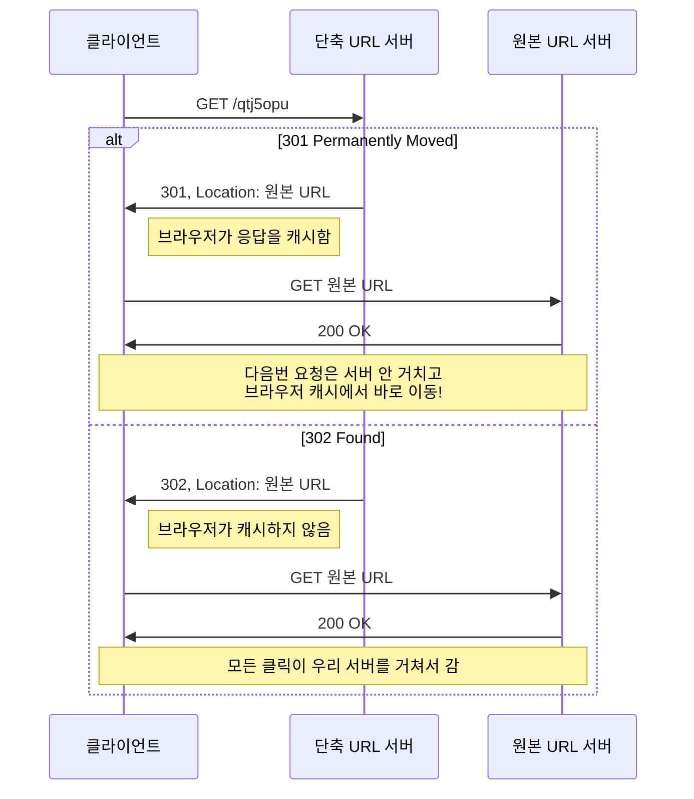
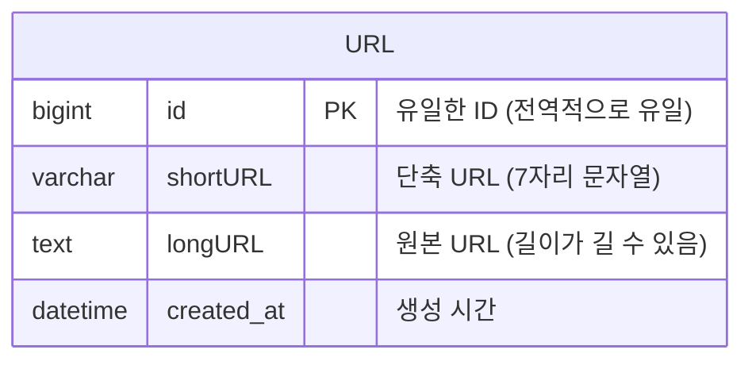
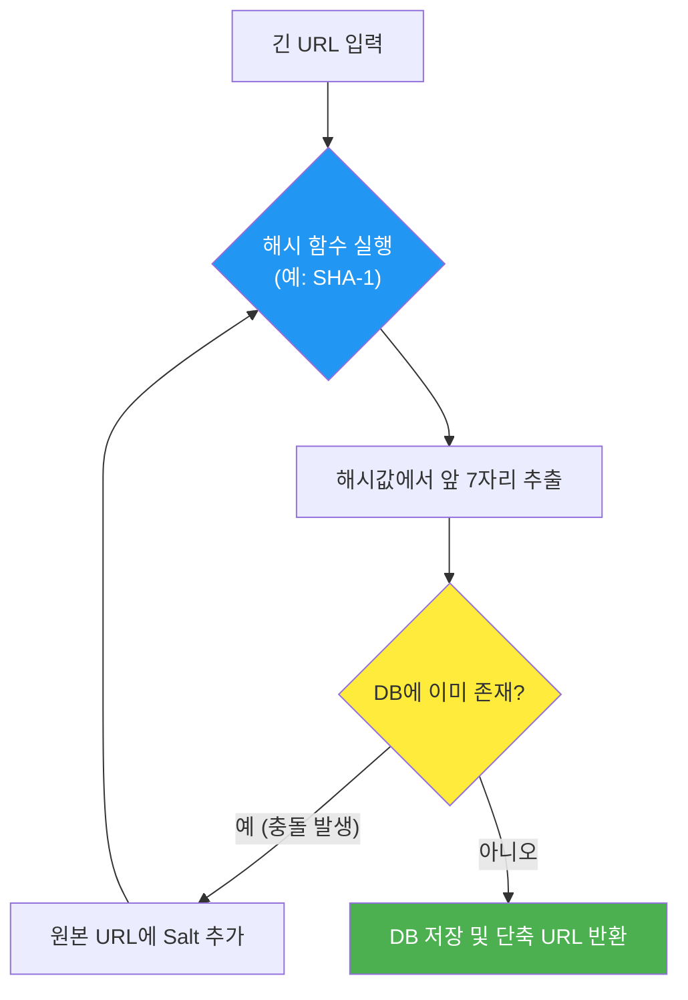
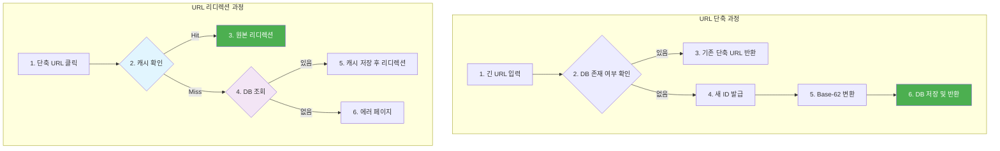

## 시작하며

가면사배 스터디 5주차! 지난 7장에서는 **"분산 시스템을 위한 유일 ID 생성기 설계"**를 통해 전 세계에서 하나뿐인 ID를 어떻게 충돌 없이 발급하는지 배웠다면, 이번 8장에서는 그 ID 생성 기술을 실무에 가장 가깝게 응용하는 **"URL 단축기 설계"**를 다룹니다.

사실 URL 단축기는 `bit.ly`나 `tinyurl` 같은 서비스로 우리에게 이미 친숙하잖아요? 그런데 "그냥 해시하면 끝 아냐?"라고 가볍게 생각했다가 책을 읽어보니 고려해야 할 디테일이 생각보다 엄청 많더라고요. 단순히 길이를 줄이는 걸 넘어, 대규모 트래픽을 처리하면서도 데이터 분석까지 놓치지 않는 설계 과정이 정말 흥미로웠습니다.

스터디원들과 "만약 우리가 직접 URL 단축기를 만든다면 어떤 기능을 먼저 구현할까?"에 대해 토론했는데, 결국 사용자 입장에서 가장 중요한 건 **'빠른 리디렉션'**과 **'신뢰할 수 있는 서비스'**라는 점에 모두가 공감했습니다. 이번 장을 정리하면서 "단순해 보이는 기능 뒤에는 이런 고민들이 숨어있구나"라는 걸 다시 한번 느꼈습니다. 

특히 7장에서 배운 ID 생성기가 여기서 어떻게 중요한 역할을 하는지 연결되는 지점이 정말 전율이 돋을 정도로 완벽하더라고요. 이전 장에서 공들여 설계한 기술이 다음 장에서 바로 핵심 부품으로 쓰이는 걸 보면서, 시스템 설계의 유기적인 연결성을 제대로 맛볼 수 있었습니다. "아, 이래서 앞에서 ID 생성기를 그렇게 자세히 다뤘구나!" 하는 깨달음이 올 때의 그 쾌감이란... 정말 말로 다 할 수 없었습니다. 독자 여러분도 이번 포스트를 통해 시스템이 톱니바퀴처럼 맞물려 돌아가는 과정을 함께 즐겨보셨으면 좋겠습니다!

## URL 단축기의 핵심 요구사항과 규모 추정

설계를 시작하기 전에 우리가 정확히 무엇을 만들어야 하는지 정의하는 게 가장 중요하겠죠. 면접관(혹은 기획자)과 대화하듯 요구사항을 정리해보는 과정이 꽤 인상적이었습니다.

### 우리가 만들어야 할 기능

가장 중요한 기능은 두 가지입니다. 하나는 긴 URL을 넣으면 짧은 주소를 뱉어주는 **URL 단축**, 다른 하나는 그 짧은 주소로 접속했을 때 원래 페이지로 보내주는 **URL 리디렉션**입니다.

비기능적으로는 시스템이 죽지 않아야 한다는 **고가용성**과, 수많은 사용자가 몰려도 버텨낼 수 있는 **확장성**이 필수입니다. 특히 생성된 단축 URL은 가능한 한 짧아야 한다는 제약이 있는데, 이게 바로 이번 장의 핵심 기술적 과제가 되더라고요.

이 부분을 읽으면서 "단순히 줄이는 게 문제가 아니라, 줄인 결과물이 얼마나 쓸모 있느냐가 관건이구나"라는 생각이 들었습니다. 예를 들어 트위터(X)처럼 글자 수 제한이 있는 곳에서는 단 1바이트라도 아끼는 게 사용자 경험에 큰 영향을 주니까요. 스터디원들과 이야기하면서 "만약 우리가 URL 단축기를 직접 만든다면, 단순히 짧게 만드는 걸 넘어 브랜드 이미지를 줄 수 있는 기능도 있으면 좋겠다"는 의견도 나왔는데, 이런 게 다 요구사항 확장의 시작이겠죠?

### 생각보다 어마어마한 데이터 규모

스터디를 하면서 다들 놀랐던 부분이 바로 **규모 추정** 단계였습니다. 보통 소규모 프로젝트를 할 때는 "그냥 DB에 넣으면 되겠지"라고 막연하게 생각하곤 하는데, 매일 1억 개의 단축 URL이 생성된다고 가정하면 이야기가 완전히 달라집니다.

- **QPS(Queries Per Second) 계산**: 초당 약 1,160건의 쓰기 연산과 11,600건의 읽기 연산(10:1 비율 가정)이 발생합니다. 초당 1만 번 이상의 읽기 요청을 한 대의 서버로 처리하는 건 정말 아슬아슬한 수준이죠.
- **저장소 요구량**: 10년 동안 서비스를 운영한다고 치면 무려 **3,650억 개**의 레코드를 보관해야 합니다. 
- **용량**: 평균 원본 URL 길이를 100바이트로 잡으면 약 **36.5TB**의 저장 공간이 필요합니다.

데이터 규모를 한눈에 볼 수 있게 표로 정리해봤습니다.

| 항목 | 계산식 | 결과값 |
| :--- | :--- | :--- |
| **초당 쓰기(QPS)** | 1억 / 86,400초 | **약 1,160 QPS** |
| **초당 읽기(QPS)** | 1,160 * 10 | **약 11,600 QPS** |
| **10년치 레코드 수** | 1억 * 365일 * 10년 | **3,650억 개** |
| **10년치 저장 용량** | 3,650억 * 100바이트 | **약 36.5 TB** |

이 수치를 보고 나니 "이건 그냥 로컬 DB 한 대로는 절대로 안 되겠구나"라는 생각이 확 들었습니다. 특히 36.5TB라는 용량도 용량이지만, 초당 11,600번의 조회를 견뎌야 한다는 점이 정말 무겁게 다가왔습니다. 시스템 설계의 묘미는 바로 이런 거대한 숫자를 다루는 데서 오는 것 같아요. 처음에는 숫자가 너무 커서 막막하게 느껴졌는데, "어차피 한 대에 다 안 들어가니까 쪼개면 되겠네?"라고 사고를 전환하는 과정이 정말 즐거웠습니다. 실제로 제가 다루는 서비스에서도 데이터가 이만큼 쌓인다면 어떤 저장 매체를 써야 비용을 아낄 수 있을지 고민해보게 되더라고요.


## 개략적 설계 - API와 리디렉션 전략

요구사항이 명확해졌으니, 이제 뼈대를 잡아볼 차례입니다. 서비스가 돌아가기 위해 필요한 API 엔드포인트와 리디렉션 방식을 결정해야 합니다.

### API 엔드포인트 설계

우리는 딱 두 개의 API만 있으면 됩니다. 설계 과정에서 "얼마나 RESTful하게 만들 것인가"도 중요한 논의 주제였는데요.

1. **URL 단축용 엔드포인트**:
    - `POST /api/v1/data/shorten`
    - **요청 데이터**: `{ "longUrl": "https://very-long-url.com/..." }`
    - **반환 데이터**: `{ "shortUrl": "https://tinyurl.com/y7ke-ocwj" }`
    - 긴 URL을 인자로 받아 단축 주소를 생성해 돌려주는 가장 기본적인 API입니다.

2. **URL 리디렉션용 엔드포인트**:
    - `GET /api/v1/{shortUrl}`
    - 단축 URL로 들어온 요청을 받아, 데이터베이스나 캐시에서 원래 주소를 찾아 301/302 상태 코드로 이동시켜줍니다.

이렇게 단순한 인터페이스지만, 그 뒷단에서는 수조 개의 데이터를 뒤져야 할 수도 있다는 게 시스템 설계의 매력이죠.

### 301 vs 302: 리디렉션의 갈림길

가장 고민이 깊었던 지점 중 하나가 바로 "어떤 HTTP 상태 코드를 쓸 것인가?"였습니다. 301과 302, 둘 다 리디렉션을 해주지만 성격이 완전히 다르거든요. 

- **301 Permanent Moved**: "이 주소는 이제 영구적으로 여기로 옮겨졌어!"라고 브라우저에게 알려주는 겁니다. 브라우저는 이 응답을 캐시에 저장해두고, 다음번에 같은 주소를 치면 아예 우리 서버에 묻지도 않고 원본 주소로 바로 날아가 버립니다.
- **302 Found**: "지금은 잠깐 여기로 가 있어!"라는 뜻입니다. 브라우저는 캐시를 하지 않고, 매번 우리 서버에 "나 어디로 가야 해?"라고 다시 물어보게 됩니다.



두 방식의 트레이드오프를 표로 정리해봤습니다.

| 상태 코드 | 특징 | 장점 | 단점 | 사용 사례 |
| :--- | :--- | :--- | :--- | :--- |
| **301** | 영구 이동 | 서버 부하 감소 (브라우저가 알아서 처리) | 클릭 수 등 트래픽 분석이 불가능함 | 성능 최우선 시스템 |
| **302** | 일시 이동 | **모든 클릭 추적 가능** (데이터 분석 용이) | 서버 부하 증가 | 마케팅 도구, 분석이 중요한 서비스 |

이 부분을 읽으면서 실무에서는 어떤 선택을 할까 고민해봤는데, 대부분의 마케팅 도구나 단축 서비스는 **데이터 분석이 훨씬 중요하기 때문에 302를 선호**할 것 같더라고요. 클릭 한 번이 곧 돈이고 데이터니까요! 스터디 중에는 "만약 SEO가 중요하다면 301을 써야 하겠지만, 단축 URL 서비스 특성상 분석 데이터를 포기하기는 정말 힘들겠다"는 결론에 도달했습니다.


## 상세 설계 - 데이터 모델과 해시 함수

이제 진짜 "어떻게 줄일 것인가"에 대한 기술적인 부분을 파헤쳐보겠습니다.

### 데이터 모델

메모리에 모든 URL 쌍을 담기에는 너무 비싸고 양이 많습니다. 그래서 우리는 관계형 데이터베이스(RDBMS)를 사용하기로 했습니다. 구조는 단순하지만 `id`와 `shortURL`, `longURL`을 매핑하는 형태가 됩니다.



이 데이터 모델을 보면서 스터디원들과 "NoSQL이 더 낫지 않을까?"라는 고민도 해봤습니다. 단순한 키-값 조회니까요. 실제로 읽기 연산이 많고 스키마가 단순한 경우 NoSQL이 성능상 유리할 수 있습니다. 하지만 ACID 속성을 보장하고 관계형 데이터의 성숙함을 활용하기 위해 RDBMS도 훌륭한 선택지라는 걸 깨달았습니다. 데이터가 커지면 결국 샤딩을 해야겠지만, 처음 시작은 익숙하고 튼튼한 RDBMS가 정답일 때가 많더라고요.

| 특징 | 관계형 DB (MySQL, PostgreSQL) | NoSQL (DynamoDB, MongoDB) |
| :--- | :--- | :--- |
| **장점** | 성숙한 기술, 데이터 일관성 보장, 복잡한 쿼리 가능 | 수평 확장 용이, 높은 가용성, 유연한 스키마 |
| **단점** | 수평 확장이 상대적으로 어려움 (샤딩 필요) | 일관성 모델이 상대적으로 약할 수 있음 |
| **선택 이유** | 데이터의 정확성과 관계형 모델의 안정성 중시 | 읽기 성능 극대화 및 무제한 확장성 중시 |

결국 정답은 없지만, "왜 이 기술을 선택했는가"를 설명할 수 있는 게 설계의 핵심이더라고요. 저는 개인적으로 운영 경험이 많은 RDBMS로 시작해서, 병목이 생기면 NoSQL로 마이그레이션하거나 하이브리드로 가져가는 방식이 현실적이라고 느꼈습니다.

인덱스 설계도 간과하면 안 되는 포인트인데요. `shortURL` 필드에 유니크 인덱스를 걸어두면 리디렉션 시 빠른 조회가 가능하고, `longURL`에도 인덱스를 걸면 동일한 긴 URL에 대한 중복 단축 방지가 수월해집니다. 다만 `longURL`은 길이가 가변적이라 인덱스 크기가 커질 수 있어서, 해시 인덱스를 별도 컬럼으로 두는 방식도 고려해볼 만하더라고요. 스터디에서도 "원본 URL의 SHA-256 해시를 별도 컬럼에 저장하고 거기에 인덱스를 거는 건 어떨까?"라는 아이디어가 나왔는데, 꽤 실용적인 접근이라고 생각했습니다.

### 해시 함수 설계: 62^7의 마법
우리의 목표는 3,650억 개의 URL을 수용하는 것입니다. 숫자(0-9)와 영문 대소문자(a-z, A-Z)를 합치면 총 62개의 문자를 사용할 수 있습니다. 이 문자들을 조합해서 몇 자리를 만들어야 우리가 원하는 만큼의 URL을 담을 수 있을까요?

- `62^1 = 62`
- `62^6 = 약 568억`
- `62^7 = 약 3.5조`

계산해보니 **7자리**면 무려 3.5조 개의 URL을 담을 수 있어서, 우리의 목표치인 3,650억 개를 아주 넉넉하게 커버할 수 있더라고요. 7글자면 충분히 짧으면서도 확장성까지 챙길 수 있는 마법의 숫자라는 생각이 들었습니다.

#### 방법 1: 해시 후 충돌 해소
잘 알려진 해시 함수(CRC32, MD5, SHA-1 등)를 사용해서 긴 URL을 해시한 뒤, 그 결과값의 앞 7자리를 취하는 방식입니다. 하지만 이 방식의 치명적인 단점은 서로 다른 긴 URL이 같은 7자리 해시값을 가질 수 있다는 **충돌(Collision)** 문제입니다.



이 흐름에서 "충돌이 났는지 확인하기 위해 DB를 매번 찔러봐야 한다"는 게 큰 오버헤드입니다. 스터디를 하면서 "이걸 좀 더 효율적으로 할 수는 없을까?" 고민해봤는데, **블룸 필터(Bloom Filter)** 같은 기술을 쓰면 실제로 DB를 찌르기 전에 "이 값이 DB에 없을 가능성"을 빠르게 판단할 수 있어서 성능을 획기적으로 올릴 수 있겠더라고요. 이런 부수적인 기술들을 찾아보는 재미가 시스템 설계 스터디의 진정한 묘미인 것 같습니다.

#### 두 접근법의 핵심 차이점

스터디에서 가장 뜨거웠던 논쟁 중 하나가 "결국 실무에선 뭘 써야 하는가?"였습니다. 결론부터 말하면 **Base-62 변환 방식이 훨씬 우세**하지만, 각각의 트레이드오프를 명확히 아는 게 중요하더라고요.

| 비교 항목 | 해시 후 충돌 해소 (Hash + Collision) | Base-62 변환 (ID to Base-62) |
| :--- | :--- | :--- |
| **단축 URL 길이** | **7자리로 고정됨** (깔끔함) | 가변적 (ID가 커지면 7자리 이상으로 늘어남) |
| **충돌 가능성** | **항상 존재함** (해소 로직 및 재시도 필수) | **원천적으로 불가능** (ID가 유일하므로) |
| **ID 생성기** | 불필요 (URL만 있으면 됨) | **분산 ID 생성기 필수** (7장 설계 필요) |
| **예측 가능성** | **예측 불가능** (보안상 유리) | 순차적 ID 사용 시 예측 가능 (보안 위협) |

이 표를 보면서 "아, 해시 방식은 보안이 중요한 경우에 유리할 수 있겠구나"라는 새로운 시각을 갖게 됐습니다. 반면 Base-62는 대규모 트래픽에서 성능 저하 없이(충돌 체크가 없으니) 확장하기에 최고의 선택이죠.

#### 방법 2: Base-62 변환
이게 바로 이번 장의 백미입니다! 10진수 ID를 62진수로 변환하는 방식인데요. 지난 장에서 배운 **분산 ID 생성기**를 활용해 유일한 숫자를 뽑아내고, 그걸 문자로 인코딩하는 겁니다.


**변환 과정 (예: ID `11157`)**

1. ID를 62로 나눈 나머지를 구하고, 해당 숫자에 매핑되는 문자를 찾습니다.
2. 몫이 0이 될 때까지 이 과정을 반복합니다.
3. 결과로 나온 문자들을 역순으로 조합하면 단축 URL이 완성됩니다!

직접 손으로 계산해보면 이런 느낌입니다:

| 연산 | 몫 | 나머지 | 매핑되는 문자 |
| :--- | :--- | :--- | :--- |
| 11157 ÷ 62 | 179 | **59** | **X** |
| 179 ÷ 62 | 2 | **55** | **T** |
| 2 ÷ 62 | 0 | **2** | **2** |

- 결과: `2` + `T` + `X` = **2TX**
- 단축 URL: `https://tinyurl.com/2TX`

```javascript
/**
 * 간단한 Base-62 인코딩 예시
 */
const chars = "0123456789abcdefghijklmnopqrstuvwxyzABCDEFGHIJKLMNOPQRSTUVWXYZ";

function encodeBase62(id) {
    if (id === 0) return chars[0];
    
    let result = "";
    while (id > 0) {
        // 나머지에 해당하는 문자를 결과 앞에 붙임
        result = chars[id % 62] + result;
        // 몫을 가지고 다음 루프 진행
        id = Math.floor(id / 62);
    }
    return result;
}

// 11157 -> "2TX"
console.log(encodeBase62(11157));
```

실제로 제가 예전에 작은 토이 프로젝트를 할 때 이 방식을 써봤는데, 충돌 걱정이 아예 없다는 게 정말 큰 장점이더라고요. 대신 숫자가 커질수록 URL 길이가 조금씩 길어질 수 있다는 점은 감안해야 합니다.

그리고 한 가지 더, Base-62는 ID가 1씩 증가하면 다음 단축 URL이 `2TX`, `2TY`, `2TZ`... 이런 식으로 예측 가능해진다는 단점이 있어요. 만약 이게 보안상 문제가 된다면, ID 생성 단계에서 난수(Randomness)를 섞거나 ID를 암호화하는 방식을 덧붙여야 하겠더라고요.

## URL 단축 및 리디렉션의 전체 흐름

자, 이제 모든 조각을 하나로 합쳐보겠습니다. 읽기 연산이 쓰기보다 압도적으로 많은 시스템 특성을 고려해 **캐시**를 적극적으로 활용한 흐름입니다.

### URL 단축 흐름
새로운 단축 URL을 만드는 과정은 다음과 같은 단계를 거칩니다.

1. **입력 확인**: 사용자가 긴 URL을 입력합니다.
2. **중복 검사**: 만약 DB에 이미 동일한 긴 URL이 있다면, 새로 생성하지 않고 기존 단축 URL을 바로 반환합니다. (자원 낭비 방지!)
3. **ID 발급**: DB에 없다면, 분산 ID 생성기(7장 내용)를 통해 새로운 유일 ID를 발급받습니다.
4. **인코딩**: 발급된 10진수 ID를 Base-62 인코딩을 통해 7자리 문자열로 변환합니다.
5. **저장**: 발급된 ID, 단축 URL, 원본 URL 쌍을 데이터베이스에 저장합니다.
6. **반환**: 생성된 단축 URL을 사용자에게 알려줍니다.

### URL 리디렉션 흐름
사용자가 단축 URL을 클릭했을 때의 흐름은 속도가 생명입니다.

1. **클릭**: 사용자가 `https://tinyurl.com/2TX`를 클릭합니다.
2. **캐시 조회**: 웹 서버는 먼저 캐시(Redis 등)에서 `2TX`에 해당하는 원본 URL이 있는지 확인합니다.
3. **캐시 히트**: 있다면 즉시 리디렉션합니다. (가장 빠른 경로!)
4. **캐시 미스**: 캐시에 없다면 데이터베이스를 조회합니다.
5. **DB 조회 결과**: DB에도 없다면 404 에러를 띄우고, 있다면 조회된 원본 URL을 캐시에 저장한 뒤 리디렉션합니다.




이 구조를 보면서 "캐시가 정말 열일하는구나"라고 생각했습니다. 실제 실무에서도 Redis 같은 분산 캐시를 앞단에 두면 DB 부하를 90% 이상 줄일 수 있거든요. 특히 유튜버나 유명인이 올린 링크는 순식간에 수만 번의 클릭이 발생할 텐데, 이때 캐시가 없으면 시스템이 바로 뻗어버릴 것 같아요.

한 가지 더 생각해본 건 캐시의 TTL(Time-To-Live) 설정이었어요. 단축 URL은 한번 생성되면 원본 URL이 바뀌는 경우가 거의 없으니, 캐시 만료 시간을 상당히 길게 잡아도 될 것 같더라고요. 반대로 만약 원본 URL이 변경되거나 삭제될 수 있는 시나리오가 있다면, 캐시 무효화(Cache Invalidation) 전략도 함께 설계해야 합니다. 스터디에서 "캐시를 길게 잡으면 좋지만, 악성 URL로 판명난 경우 즉시 캐시를 날릴 수 있어야 한다"는 의견이 나왔는데, 보안과 성능 사이의 균형을 어디에 맞출지가 또 하나의 설계 판단이라는 걸 느꼈습니다.

## 시스템 확장과 추가 고려사항

기본적인 설계를 마쳤다면, 이제 "진짜 대규모" 환경을 대비한 튜닝이 필요합니다. 스터디원들과 가장 열띤 토론을 벌였던 주제이기도 합니다.

1. **처리율 제한(Rate Limiter)**: 만약 어떤 악의적인 사용자가 봇을 돌려 초당 수만 개의 단축 URL을 생성하려고 한다면 어떻게 될까요? 시스템 자원이 순식간에 고갈될 겁니다. 4장에서 배운 기술을 여기에 적용해서, IP 주소나 계정별로 생성 횟수를 제한해야 합니다. "공격으로부터 시스템을 보호하는 것도 설계의 핵심"이라는 걸 다시금 느꼈어요.
2. **웹 서버 확장**: 우리의 웹 계층은 상태가 없는(Stateless) 구조입니다. 세션 같은 정보를 서버 메모리에 두지 않기 때문에, 트래픽이 몰리면 로드밸런서 뒤에 웹 서버를 그냥 대수만 늘리면(Scale-out) 해결됩니다. 구름 위(Cloud)에서 서버를 자유자재로 늘리고 줄이는 상상을 하니 꽤 짜릿하더라고요.
3. **데이터베이스의 규모 확장**: 36.5TB라는 거대한 데이터는 한 대의 DB로 감당할 수 없습니다. 
    - **다중화(Replication)**: 읽기 연산이 압도적으로 많으므로 주(Master)-부(Slave) 구조로 복제해서 읽기 부하를 분산합니다. 주 서버는 쓰기만 전담하고, 여러 대의 부 서버가 읽기 요청을 나눠서 처리하는 거죠.
    - **샤딩(Sharding)**: 데이터를 여러 DB 서버에 쪼개 담습니다. 예를 들어 `id % 16`을 샤딩 키로 삼아 16개의 서버에 나눠 저장할 수 있겠죠. 이렇게 하면 쓰기 성능도 16배로 늘릴 수 있습니다.
4. **데이터 분석 솔루션**: 마케팅 담당자들에게는 "이 링크를 누가, 언제, 어디서 눌렀는가"가 가장 중요한 정보입니다. 단순히 리디렉션만 해주는 게 아니라, 클릭 시점에 다음과 같은 메타데이터를 수집할 수 있습니다.
    - **시간대별 클릭 수**: 어느 시간대에 가장 반응이 뜨거운지 파악합니다.
    - **접속 국가 및 지역**: 글로벌 마케팅 전략을 짜는 데 빠질 수 없는 정보죠.
    - **접속 기기(OS, 브라우저)**: 사용자 환경에 최적화된 콘텐츠를 제공할 수 있게 해줍니다.
    - 이런 데이터들을 클릭이 발생할 때마다 로그를 남기고, 이를 Kinesis나 Kafka 같은 메시지 큐에 태워 분석 시스템으로 보내는 구조를 설계해볼 수 있습니다. "기술이 비즈니스 가치를 창출하는 지점"이 바로 여기라는 생각이 들었습니다.
5. **가용성과 안정성**: 6장에서 배운 CAP 정리나 가십 프로토콜 등을 적용해 서버 간 상태를 동기화하고, 장애가 발생해도 서비스가 멈추지 않도록 설계하는 과정이 필요합니다.

### 🚀 가상 시나리오: 유명 유튜버의 링크 폭주!
만약 수백만 구독자를 가진 유튜버가 방금 생성한 단축 URL을 커뮤니티에 올렸다고 가정해봅시다. 수만 명의 사용자가 동시에 링크를 클릭할 텐데, 우리 시스템은 어떻게 버텨낼까요? 스터디 중에도 "이 상황이 가장 현실적인 스트레스 테스트"라는 이야기가 나왔습니다.

1. **로드밸런서**가 트래픽을 수십 대의 웹 서버로 균등하게 뿌려줍니다. 특정 서버에 부하가 몰리지 않도록 라운드 로빈이나 최소 연결(Least Connection) 알고리즘을 사용합니다.
2. **캐시(Redis)**가 가장 먼저 요청을 받습니다. 이미 첫 번째 사용자가 클릭했을 때 캐시에 올라온 주소라면, 나머지 수만 명은 DB까지 가지도 않고 1ms 내에 응답을 받게 됩니다. 캐시 서버 한 대가 초당 수십만 건의 요청을 처리할 수 있으니까요!
3. 만약 캐시 미스가 발생해도, **DB 복제본(Slave)** 여러 대가 읽기 요청을 나눠 처리하므로 메인 DB는 안전합니다. 
4. **처리율 제한 장치**가 비정상적인 매크로 요청을 걸러내어 시스템 전체의 안정성을 보장합니다. 만약 특정 IP에서 비정상적으로 많은 클릭이 발생한다면 잠시 차단하는 식으로요.

이런 시나리오를 머릿속으로 그려보니, 우리가 설계한 각 컴포넌트가 왜 필요한지 더 명확하게 이해되더라고요. 단순히 "좋은 기술이라서" 쓰는 게 아니라, "이런 문제를 해결하기 위해서" 존재한다는 걸 깨닫는 과정이 정말 중요했습니다.

스터디 중에 "데이터 분석은 구체적으로 어떤 구조로 구현하면 좋을까?"라는 질문이 나왔는데, 실시간 분석보다는 비동기 파이프라인이 더 현실적이라는 결론에 도달했습니다. 클릭 이벤트를 Kafka에 태우고, Spark나 Flink 같은 스트림 처리 엔진으로 집계한 뒤, 대시보드로 시각화하는 흐름이죠. 리디렉션 응답 속도에 영향을 주지 않으면서도 풍부한 분석 데이터를 뽑아낼 수 있어서, 비즈니스 가치와 기술적 효율을 동시에 챙길 수 있는 구조라고 느꼈습니다.

이런 세부사항들까지 고려해야 한다는 걸 보고 시스템 설계는 정말 끝이 없는 영역이라는 걸 새삼 느꼈습니다. 단순히 기능을 만드는 걸 넘어, "어떤 최악의 상황에서도 버틸 수 있는 시스템"을 고민하는 과정이 시니어 개발자로 가는 길이라는 생각이 들더라고요.


## 시스템 설계 면접에서의 "Do's and Don'ts"

스터디 노트 마지막 부분에 정리된 실전 팁들도 블로그에 꼭 남기고 싶었습니다. 면접뿐만 아니라 실무 회의에서도 유용한 내용들이더라고요.

### ✅ 하면 좋은 것들 (Do's)
- **요구사항을 명확히 하세요**: "하루에 얼마나 만드나요?", "단축 URL의 길이는 얼마나 짧아야 하나요?" 같은 질문은 설계의 방향을 결정합니다.
- **트레이드오프를 설명하세요**: 301 vs 302 선택 시 장단점을 조목조목 짚어주는 게 점수가 높습니다.
- **규모 확장을 고려하세요**: 처음부터 36TB를 어떻게 담을지 고민하고 있다는 인상을 주는 게 중요합니다.

### ❌ 하면 안 되는 것들 (Don'ts)
- **너무 복잡하게 시작하지 마세요**: 처음부터 전 세계 10개 데이터 센터에 배포하겠다는 식의 설계는 오버 엔지니어링이 될 수 있습니다.
- **침묵하지 마세요**: 고민하는 과정도 설계의 일부입니다. "지금 해시 충돌 가능성이 걱정되는데, 이를 블룸 필터로 해결해볼 수 있을까요?"라고 소통하는 게 좋습니다.
- **정답만 단정짓지 마세요**: "Base-62가 무조건 최선입니다"라고 끊는 것보다, "해시+충돌 해소 방식도 보안이 중요한 경우에 고려할 수 있지만, 우리 서비스의 요구사항을 감안하면 Base-62가 더 적합합니다"라고 비교하며 풀어가는 게 훨씬 설득력 있더라고요.

이런 팁들을 보면서 "설계는 정답을 맞히는 시험이 아니라, 최선의 선택을 찾아가는 대화 과정이구나"라는 걸 다시 한번 느꼈습니다. 

## 실무에 적용할 수 있는 인사이트들

### 1. 설계 의사결정의 근거를 명확히 하기

- 리디렉션 코드(301 vs 302)를 정할 때처럼, 모든 선택에는 명확한 이유가 있어야 합니다.
- 단순히 "성능이 좋아서"가 아니라 "우리 서비스는 트래픽 분석이 더 중요하니까 성능을 조금 포기하더라도 302를 쓴다"는 식의 논리가 필요합니다.
- 이런 의사결정 과정이 주니어와 시니어를 가르는 지점이라는 걸 느꼈습니다.

### 2. 분산 ID 생성기와의 환상적인 결합

- URL 단축기는 7장에서 배운 ID 생성기의 가장 훌륭한 실전 예제입니다.
- Snowflake 기법 등을 활용해 전역적으로 유일한 ID를 뽑아내고, 그걸 Base-62로 인코딩하면 충돌 걱정 없는 시스템을 만들 수 있습니다.
- 시스템의 각 파트가 서로 어떻게 톱니바퀴처럼 맞물려 거대한 기계를 만드는지 이해하는 좋은 계기가 됐어요.

### 3. 캐시 전략을 통한 성능 극대화

- 읽기 비중이 압도적으로 높은 서비스(10:1 이상)에서는 캐시가 전체 성능의 9할 이상을 책임집니다.
- 단순한 캐시 적용을 넘어, 캐시 미스 시의 처리나 만료 정책(TTL), 그리고 캐시 서버 자체가 죽었을 때의 대응책(Failover)까지 세밀하게 설계해야 합니다.
- 실무에서도 "왜 캐시를 써야 하는가"를 넘어 "어떻게 하면 캐시를 더 우아하게 운영할 것인가"를 고민하게 되더라고요.

### 4. 데이터 규모에 대한 감각 키우기

- 단순히 "데이터가 많다"고만 하지 말고, 구체적인 숫자로 계산해보는 습관이 중요합니다.
- 36TB라는 숫자를 직접 도출해보니, 왜 샤딩이 필요하고 왜 NoSQL을 고민해야 하는지가 훨씬 더 명확하게 다가왔습니다.
- 숫자로 대화하는 개발자가 훨씬 신뢰감이 간다는 걸 스터디를 통해 확실히 배웠습니다.

### 5. 보안과 악용 방지는 선택이 아닌 필수

- URL 단축기는 피싱이나 스팸에 악용될 여지가 큰 서비스이기도 합니다. 악의적인 사용자가 악성 사이트를 단축 URL 뒤에 숨겨 배포할 수 있기 때문이죠.
- 이를 방지하기 위해 Google Safe Browsing API 같은 URL 블랙리스트와 연동하거나, 사용자가 접속하기 전에 미리보기 페이지를 보여주는 인터스티셜(Interstitial) 화면을 도입하는 방법이 있습니다.
- 스터디에서 한 동기가 "카카오톡이 외부 링크를 열 때 경고창을 띄우는 것도 비슷한 맥락 아니냐"고 했는데, 정확히 맞는 비유더라고요. 사용자를 보호하면서도 서비스의 신뢰도를 높이는 방어 장치가 곧 좋은 설계의 일부라는 걸 느꼈습니다.
- 또한 단축 URL 생성 자체를 인증된 사용자에게만 허용하거나, API 키를 발급받은 클라이언트만 접근하게 제한하는 것도 중요합니다. 무분별한 URL 생성이 스팸 대량 유포의 통로가 될 수 있으니까요.

## 마무리

URL 단축기는 얼핏 보면 쉬운 과제 같지만, 뜯어보면 분산 ID 생성기, 고효율 해시 함수, 캐시 전략, 그리고 데이터베이스 확장까지 분산 시스템의 모든 정수가 담겨 있는 훌륭한 예제였습니다.

처음에는 그냥 "문자열 좀 줄이는 게 뭐가 어렵나" 싶었는데, 수천억 개의 데이터를 다뤄야 한다는 전제가 붙으니 고민의 깊이가 완전히 달라지더라고요. 역시 대규모 시스템 설계의 핵심은 **"규모(Scale)"** 그 자체에 있다는 걸 배웠습니다.

특히 이번 장을 통해 "단순한 서비스라도 대규모 환경으로 가면 결코 단순하지 않다"는 점을 뼈저리게 느꼈습니다. 스터디원들과 "이거 실무에서 그대로 적용해도 되겠는데요?"라고 농담처럼 말했지만, 사실 그만큼 완성도 높은 설계 과정을 보여주는 챕터였던 것 같아요.

돌이켜보면 이번 장에서 가장 크게 와닿았던 건, 시스템의 각 컴포넌트가 독립적으로 존재하는 게 아니라 서로 유기적으로 연결되어 있다는 사실이었습니다. 7장의 ID 생성기가 없으면 Base-62 인코딩을 할 수 없고, 캐시가 없으면 읽기 부하를 감당할 수 없으며, 샤딩이 없으면 수천억 개의 데이터를 저장할 수 없죠. 이렇게 하나하나가 톱니바퀴처럼 맞물려야만 비로소 대규모 시스템이라는 거대한 기계가 돌아간다는 걸 체감할 수 있었습니다.

스터디원들과 "만약 이 시스템을 처음부터 끝까지 혼자 구축한다면 얼마나 걸릴까?" 하고 농담한 적이 있는데, 아마 반년은 족히 걸릴 거라는 결론에 다들 동의했습니다. 그만큼 단순해 보이는 서비스 뒤에도 수많은 엔지니어링 결정이 층층이 쌓여 있다는 걸 다시금 실감했어요.

다음 포스트에서는 9장 **"웹 크롤러 설계"**를 다룰 예정입니다. 인터넷의 수많은 정보를 어떻게 자동으로 수집하고 인덱싱하는지, 구글 같은 검색 엔진의 기초가 되는 기술을 파헤쳐보겠습니다! 8장과는 또 다른 어떤 거대한 시스템의 이야기가 펼쳐질지 벌써부터 기대되네요.

### 🏗️ 아키텍처와 성능에 대한 질문

- 301과 302 리디렉션 중, 여러분의 서비스라면 어떤 것을 선택하시겠나요? 그 이유는 무엇인가요?
- 읽기 작업이 쓰기보다 100배 더 많아진다면, 현재 설계에서 어떤 부분을 가장 먼저 보강해야 할까요?
- 만약 캐시 서버(Redis)가 갑자기 다운된다면, 시스템 전체 장애로 번지지 않게 하려면 어떤 장치가 필요할까요?

### 🛠️ 데이터 모델링과 해시에 대한 질문

- Base-62 변환 방식에서 ID가 순차적으로 증가할 때 발생할 수 있는 보안 문제(다음 URL 예측)를 어떻게 막을 수 있을까요?
- 해시 충돌을 최소화하기 위해 SHA-1 외에 어떤 해시 알고리즘을 고려해볼 수 있을까요?
- 10년 치 데이터(36TB)를 RDBMS에 저장할 때, 인덱스 크기로 인한 성능 저하를 어떻게 해결하면 좋을까요?

### 🎯 실무 적용과 기능 확장에 대한 질문

- 사용자가 원하는 문구로 단축 URL을 만드는 "커스텀 URL" 기능을 추가한다면, 기존 Base-62 로직과 어떻게 통합할 수 있을까요?
- 만료된 URL을 자동으로 삭제하는 기능을 넣는다면, 어떤 방식(Batch Job, TTL 등)이 가장 효율적일까요?
- 특정 국가에서만 접속 가능한 단축 URL을 만들려면 설계의 어느 지점에 로직을 추가해야 할까요?

댓글로 공유해주시면 함께 배워나갈 수 있을 것 같습니다!
