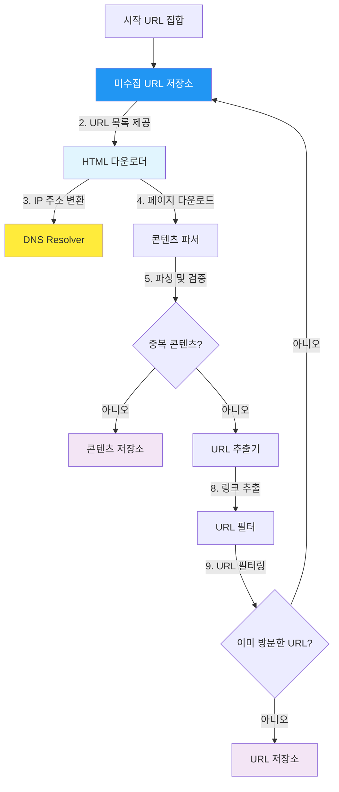
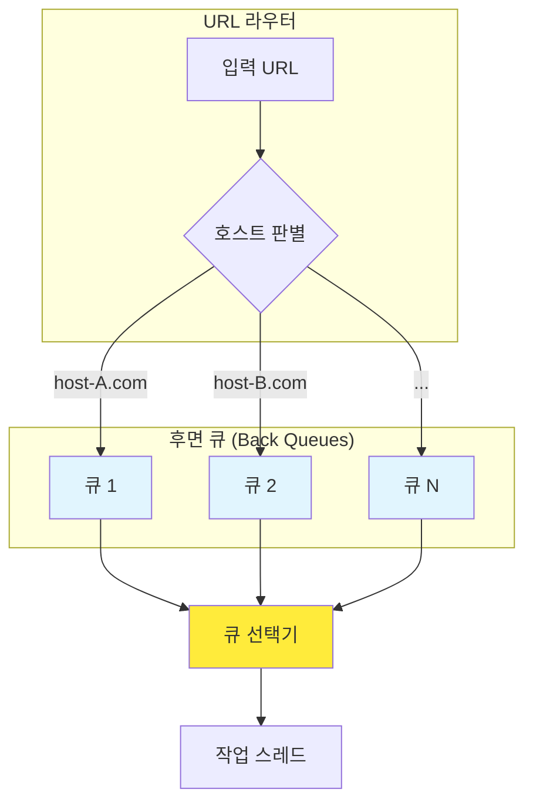
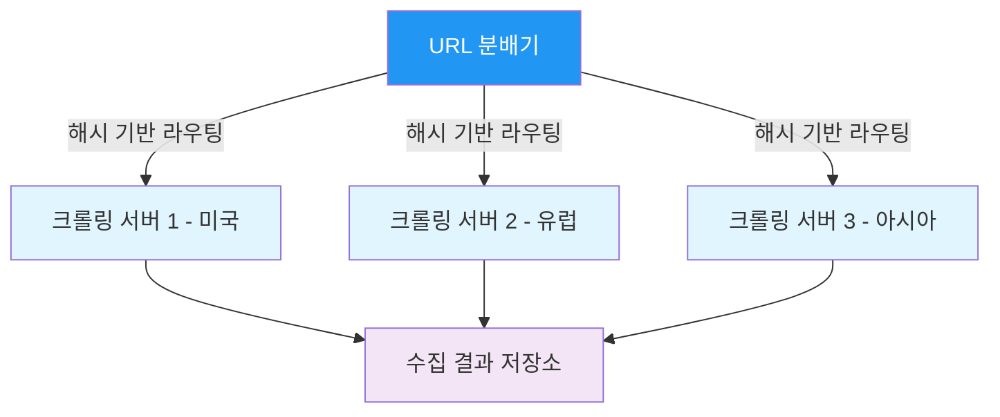
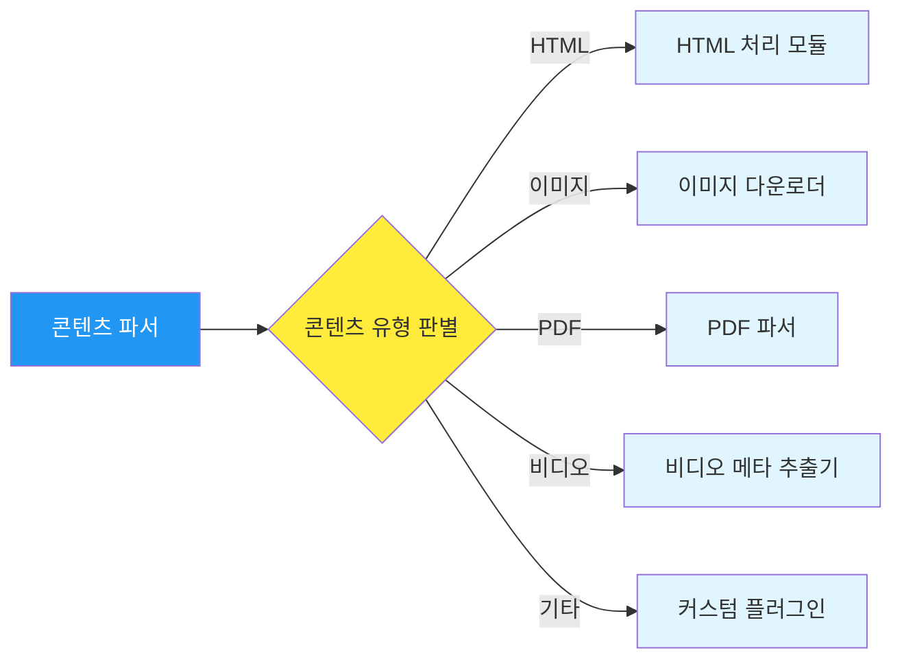

## 시작하며

가면사배 스터디 5주차에 접어들었습니다! 지난 8장 "URL 단축기 설계"에서 긴 URL을 효율적으로 줄여 관리하는 기술을 다뤘다면, 이번 9장에서는 **웹 크롤러 설계**를 깊이 있게 파헤쳐보려고 합니다.

사실 처음에는 웹 크롤러라고 하면 단순히 "웹 사이트 URL을 타고 들어가서 HTML을 긁어오는 프로그램" 정도로만 생각했었거든요. Python으로 `requests` + `BeautifulSoup`만 쓰면 금방 만들 수 있을 줄 알았습니다. 그런데 이번 장을 읽으면서 제가 얼마나 순진했는지 깨달았습니다. 수십억 개의 페이지를 매일같이 수집하고 인덱싱하는 구글 같은 대규모 검색 엔진의 크롤러는 단순한 스크립트가 아니라, 전 세계의 서버와 네트워크를 효율적으로 활용해야 하는 거대한 분산 시스템이더라고요.

특히 단순히 데이터를 "가져오는 것"에 그치지 않고, 수집 대상 서버에 피해를 주지 않는 "예의(Politeness)"를 지키는 법, 그리고 끝을 알 수 없는 무한 루프나 악성 콘텐츠 사이에서도 살아남는 "안정성"을 확보하는 과정이 정말 흥미로웠습니다. 스터디원들과 "우리가 평소에 검색 창에 단어 하나를 칠 때, 그 뒤에서는 이런 로봇들이 얼마나 치열하게 일하고 있을까"라며 감탄했던 기억이 나네요. 제가 이번 챕터를 공부하며 느꼈던 핵심 포인트들과 실무적인 고민들을 차근차근 정리해보겠습니다.

## 문제 이해 및 설계 범위 확정

설계를 시작하기 전에 항상 하는 일이지만, 웹 크롤러의 목적과 규모를 명확히 하는 것이 가장 중요했습니다. 크롤러는 활용 목적에 따라 설계 방향이 완전히 달라질 수 있거든요.

면접에서도 "어떤 용도의 크롤러인지", "한 달에 몇 페이지를 수집해야 하는지", "수집한 데이터는 얼마나 보관해야 하는지" 같은 질문들을 먼저 던져서 범위를 좁히는 게 좋은 출발점이라는 걸 이 챕터에서 다시 한번 확인했습니다.

### 웹 크롤러의 주요 용도

웹 크롤러는 단순히 검색 엔진을 위해서만 존재하는 것이 아닙니다. 기술이 발전하면서 그 활용도는 더욱 넓어지고 있죠.

| 용도 | 설명 | 대표 사례 |
|------|------|-----------|
| **검색 엔진 인덱싱** | 웹 페이지를 모아 검색 인덱스 구축 | Google, Naver |
| **웹 아카이빙** | 웹 정보를 장기 보관 | Internet Archive |
| **웹 마이닝** | 데이터 추출로 트렌드·평판 분석 | 금융 데이터 수집, LLM 학습 데이터 |
| **웹 모니터링** | 저작권 침해·불법 복제 감시 | 브랜드 보호 서비스 |

특히 요즘 AI 시대에는 LLM 학습용 데이터를 수집하는 데 크롤러가 빠질 수 없는 기술이 되었습니다. ChatGPT나 Claude 같은 대형 언어 모델이 학습하는 텍스트 데이터의 상당 부분이 웹 크롤링을 통해 수집된 것이거든요. 스터디에서도 "결국 AI의 시작점이 크롤러일 수도 있겠다"라는 이야기가 나왔었습니다.

### 이번 설계의 목표 수치

스터디에서 정한 요구사항은 다음과 같았습니다. 이 수치들을 보면서 "와, 이게 가능한 수치인가?" 싶을 정도로 규모가 컸습니다.

| 항목 | 수치 | 비고 |
|------|------|------|
| **수집 규모** | 매달 10억 페이지 | 신규 또는 수정된 페이지 |
| **저장 기간** | 5년 | 아카이빙 목적 |
| **콘텐츠 종류** | HTML 중심 | 이미지/비디오 확장 고려 |
| **중복 처리** | 중복 콘텐츠 수집 안 함 | 해시 기반 탐지 |

이 숫자를 바탕으로 개략적인 규모를 추정해보면 정말 입이 벌어집니다.

- **QPS**: 10억 ÷ 30일 ÷ 24시간 ÷ 3600초 ≈ **400 QPS** (피크 시 800 QPS)
- **월간 저장량**: 10억 × 500KB = **500TB/월**
- **5년 총 저장량**: 500TB × 12 × 5 = **약 30PB**

이 정도 규모라면 단순히 서버 한두 대로 해결할 수 있는 수준이 아니죠. 500TB/월이라는 숫자만 봐도, 단순 계산으로 하루에 약 16.7TB씩 쌓인다는 뜻입니다. 10TB짜리 하드디스크를 매일 1~2개씩 추가해야 하는 셈이니, 물리적 저장소 관리만 해도 보통 일이 아닙니다.

그래서 책에서는 좋은 크롤러가 갖춰야 할 **4대 속성**을 강조합니다.

### 좋은 크롤러의 4대 속성

1. **규모 확장성(Scalability)**: 수십억 개의 웹 페이지를 병렬로 효율 처리
2. **안정성(Robustness)**: 잘못된 HTML, 응답 없는 서버, 악성 링크 등 비정상 환경에 대한 방어
3. **예의(Politeness)**: 특정 웹 사이트에 과도한 부하를 주지 않도록 요청 빈도 조절
4. **확장성(Extensibility)**: 새로운 콘텐츠 유형을 쉽게 추가할 수 있는 플러그인 구조

이 키워드들을 머릿속에 넣고 다음 단계인 아키텍처 설계를 살펴보니 훨씬 이해가 잘 됐습니다. 스터디에서도 "이 4가지를 동시에 만족시키는 게 가능해?"라는 질문이 나왔는데, 결론은 "각 속성 간의 트레이드오프를 인정하고 우선순위를 정하는 것"이 핵심이었습니다.

예를 들어, 예의를 최대한 지키면(요청 간격을 길게 두면) 규모 확장성은 떨어집니다. 반대로 최대한 빠르게 수집하려면 상대 서버에 부담을 주게 되죠. 이런 트레이드오프를 면접에서 언급하면서 "우리 시스템의 최우선 목표는 X이므로, Y를 일부 포기하는 대신 Z를 선택했다"라고 설명할 수 있으면 강력한 인상을 줄 수 있습니다.

## 웹 크롤러의 개략적 설계안

대규모 웹 크롤러는 여러 개의 전용 컴포넌트가 톱니바퀴처럼 맞물려 돌아가는 구조를 가집니다. 하나의 거대한 모놀리식 프로그램이 아니라, 각 역할에 특화된 독립 모듈들이 파이프라인 형태로 연결되어 있죠.

전체적인 데이터 흐름을 다이어그램으로 정리해보면 다음과 같습니다.



전체적인 로직은 **시작 URL**에서 출발해 페이지를 내려받고, 그 안에서 새로운 링크를 찾아 다시 큐에 넣는 순환 구조입니다. 하지만 각 단계에는 숨겨진 노하우들이 가득했습니다.

### 시작 URL (Seed URL) 전략

아키텍처에서 가장 첫 번째 단계인 "시작 URL 집합"도 사실 아무렇게나 정할 수 있는 게 아닙니다. 전 세계 웹을 가장 적은 홉(Hop) 수로 커버하려면 시작점 선택이 중요하거든요.

> 좋은 시작 URL은 크롤러가 가능한 한 많은 링크를 탐색하도록 하는 URL이어야 합니다.

일반적으로는 나라별 인기 사이트의 도메인 목록을 시작점으로 사용합니다. 예를 들어 한국이라면 naver.com, daum.net 같은 포털, 미국이라면 wikipedia.org, reddit.com 같은 허브 사이트가 시작점이 되겠죠. 이런 사이트들은 외부 링크가 많아서 크롤러가 빠르게 다양한 도메인으로 퍼져나갈 수 있습니다.

또 다른 전략은 주제(Topic)별로 시작 URL을 나누는 것입니다. 쇼핑 관련 크롤링이라면 쿠팡이나 아마존에서 시작하고, 뉴스 크롤링이라면 주요 언론사 메인 페이지에서 시작하는 식이죠. 결국 "어디서 출발하느냐"에 따라 크롤러가 수집하는 데이터의 범위와 품질이 크게 달라지기 때문에, 시작 URL 선정은 단순한 초기 설정이 아니라 하나의 전략적 결정입니다.

### 핵심 컴포넌트별 상세 역할

- **미수집 URL 저장소 (URL Frontier)**: "다음에 어디를 갈까?"를 결정하는 스케줄러입니다. 단순히 순서대로 가는 게 아니라 중요도와 예의를 따집니다.
- **HTML 다운로더**: 웹 페이지를 실제로 가져오는 엔진입니다. 수천 개의 스레드가 동시에 돌아가며 HTTP 요청을 보냅니다.
- **DNS Resolver**: URL 호스트 이름을 IP 주소로 바꿔주는 역할을 합니다. 수억 개의 요청이 발생하므로 DNS 조회 지연을 줄이기 위해 전용 캐시를 두는 것이 좋습니다.
- **콘텐츠 파서 (Content Parser)**: 다운로드한 페이지가 깨지지는 않았는지, 올바른 형식인지 검증합니다. 잘못된 HTML을 만났을 때 시스템이 죽지 않도록 방어하는 첫 번째 방어선입니다. 실제 웹에서 유효하지 않은 HTML의 비율이 얼마나 높은지 알게 되면 깜짝 놀랄 겁니다.
- **중복 콘텐츠 판별 (Content Seen?)**: 똑같은 페이지를 여러 번 저장하지 않기 위해 해시(Hash) 값을 비교합니다. 웹에는 중복 데이터가 생각보다 많아서, 이 과정만으로도 저장 공간을 엄청나게 절약할 수 있습니다. 연구에 따르면 웹 페이지의 약 29%가 중복이라고 하더라고요.
- **URL 추출기**: HTML 내부의 `<a>` 태그 등을 분석해 새로운 링크를 뽑아냅니다. 상대 경로를 절대 경로로 변환하는 작업도 여기서 이루어집니다.
- **URL 필터**: 특정 파일 확장자(.zip, .exe 등)나 접근 금지된 도메인(Deny List)을 걸러냅니다. 불필요한 URL을 초기에 제거함으로써 다운로더의 부하를 크게 줄일 수 있습니다.
- **URL 저장소 (URL Seen?)**: 이미 가본 곳인지 확인하여 무한 루프를 방지합니다. 수십억 개의 URL을 관리해야 하므로 일반적인 해시 테이블보다는 **블룸 필터(Bloom Filter)** 같은 확률적 자료구조를 주로 사용합니다. 블룸 필터는 메모리를 적게 쓰면서도 "이 URL을 본 적 있는가?"라는 질문에 빠르게 답할 수 있거든요. 다만 거짓 양성(False Positive)이 소량 발생할 수 있지만, 이미 방문한 URL을 한 번 더 방문하는 정도는 큰 문제가 아닙니다.

이 부분을 보면서 "아, 컴포넌트를 이렇게 세밀하게 쪼개놓으니 각 부분을 독립적으로 최적화하기 좋겠구나"라는 생각이 들었습니다. 예를 들어 다운로더가 느리면 다운로더 서버만 증설하면 되고, URL 필터링 로직이 바뀌어도 다른 곳은 영향을 받지 않으니까요.

> **핵심 포인트**: 대규모 크롤러의 본질은 "잘게 쪼개서 각각 독립적으로 확장할 수 있게 만드는 것"입니다. 마이크로서비스 아키텍처의 정신과 정확히 일치하는 설계 철학이죠.

## 상세 설계: 미수집 URL 저장소 (URL Frontier)

가장 머리를 많이 써야 하는 부분은 역시 **미수집 URL 저장소(URL Frontier)**였습니다. 크롤러의 지능이 여기서 결정된다고 해도 과언이 아니거든요.

### BFS(너비 우선 탐색)의 한계

웹 크롤링의 기본 알고리즘은 BFS입니다. 시작 URL에서 출발해서 발견되는 링크를 큐에 넣고, 하나씩 꺼내서 방문하는 방식이죠. 하지만 대규모 크롤링에 단순 BFS를 적용하면 두 가지 큰 함정에 빠지게 됩니다.

1. **무례함 (Impoliteness)**: 특정 웹사이트에 초당 수천 번의 요청을 보내서 해당 사이트를 마비시켜버리는 상황입니다. BFS는 큐에 들어온 순서대로 처리하기 때문에, 같은 도메인의 URL이 연속으로 큐에 쌓이면 그 사이트에 요청이 집중됩니다. 이는 사실상 분산 서비스 거부 공격(DDoS)과 다를 바 없죠.
2. **우선순위 부재**: FIFO 큐는 "먼저 들어온 것 먼저 나간다"가 전부입니다. 스팸 사이트나 영양가 없는 페이지를 수집하느라 정작 중요한 뉴스나 실시간 업데이트를 놓칠 수 있습니다.

이 두 문제를 동시에 해결하기 위해 URL Frontier는 **전면 큐(Front Queues)**와 **후면 큐(Back Queues)**라는 이중 구조를 도입합니다. 전면 큐는 우선순위를, 후면 큐는 예의를 담당하는 것이죠.

### 1. 예의(Politeness) 확보를 위한 큐 설계

해결책은 호스트별로 큐를 분리하는 것이었습니다. 동일한 도메인(예: wikipedia.org)에 속한 URL은 하나의 큐에만 들어가도록 하고, 각 작업 스레드는 서로 다른 큐에서 하나씩 URL을 가져가도록 만듭니다.



이렇게 하면 한 스레드가 특정 사이트만 주구장창 공격하는 일을 원천 봉쇄할 수 있습니다. 스레드 사이의 요청 간격(Delay)을 조절하면 "좋은 크롤러"로서 웹 생태계와 공존할 수 있게 되는 거죠.

이 로직을 보면서 "아, 분산 시스템에서의 Rate Limiting이 이런 식으로도 구현될 수 있구나"라고 무릎을 탁 쳤습니다. 4장에서 배웠던 처리율 제한 장치(Rate Limiter)가 여기서도 쓰이는 셈이거든요. 차이점이 있다면, 4장에서는 우리 서버를 보호하기 위한 것이었고, 여기서는 남의 서버를 보호하기 위한 것이라는 점입니다. 관점만 다를 뿐, 핵심 메커니즘은 같습니다.

실제로 구현할 때는 각 호스트에 대한 마지막 요청 시간을 기록해두고, 다음 요청까지 최소 N초의 간격을 두도록 하는 방식을 많이 씁니다. robots.txt의 `Crawl-delay` 지시문에 명시된 값을 그대로 사용하기도 하고요.

### 2. 우선순위(Priority) 부여 및 전면 큐

웹 페이지의 가치는 천차만별입니다. 구글 메인 페이지와 제 블로그의 방명록 페이지를 똑같은 빈도로 크롤링할 필요는 없겠죠. **PageRank**, 트래픽 양, 업데이트 빈도 등을 계산하는 순위 결정 장치를 두고, 우선순위가 높은 URL은 더 자주 처리되는 전면 큐(Front Queues)에 배정합니다.

실무에서도 배치 작업을 설계할 때 비슷한 고민을 한 적이 있습니다. 모든 요청을 하나의 Kafka 토픽에 넣었다가, 정작 즉시 처리해야 할 높은 우선순위 알림이 뒤로 밀려버린 적이 있었거든요. "우선순위에 따라 물리적으로 큐를 나누고 소비 비중을 조절하는 것"이 얼마나 직관적이면서도 강력한 해결책인지 다시금 배웠습니다.

> **면접 팁**: 면접에서 URL Frontier를 설명할 때 "전면 큐는 우선순위 결정, 후면 큐는 예의 보장"이라는 한 문장으로 핵심을 요약하면 깔끔합니다. 두 큐의 역할 분리가 이 시스템의 핵심 설계 포인트니까요.

### 3. 신선도(Freshness) 유지 전략

웹 페이지는 수시로 변경됩니다. 한 번 수집했다고 끝이 아니라, 변경된 페이지를 주기적으로 **재수집**해야 데이터의 신선함을 유지할 수 있습니다.

모든 페이지를 동일한 주기로 재수집하는 것은 비효율적이기 때문에, 페이지별로 재수집 주기를 차등 적용하는 전략이 필요합니다.

- **변경 이력 기반**: 과거에 자주 바뀌었던 페이지는 앞으로도 자주 바뀔 가능성이 높으므로 재수집 주기를 짧게 설정합니다.
- **중요도 기반**: PageRank가 높거나 트래픽이 많은 페이지는 항상 최신 상태를 유지해야 하므로 우선적으로 재수집합니다.
- **콘텐츠 유형 기반**: 뉴스 사이트는 매시간 바뀌지만, 위키피디아의 역사 문서는 몇 달에 한 번 바뀔까 말까 합니다.

이런 차등 전략을 적용하면 한정된 크롤링 자원으로도 데이터의 전체적인 신선도를 크게 높일 수 있습니다. 모든 페이지를 매일 재수집하는 것은 물리적으로 불가능하니까, 결국 "어디에 집중할지를 똑똑하게 결정하는 것"이 핵심이죠.

마치 게임에서 한정된 행동력을 어느 퀘스트에 쓸지 고민하는 것과 비슷하달까요. 메인 퀘스트(자주 바뀌는 뉴스 사이트)에 행동력을 집중하되, 서브 퀘스트(변동이 적은 정적 페이지)는 여유가 있을 때 돌아가며 처리하는 전략입니다.

## HTML 다운로더와 성능 최적화

수십억 개의 페이지를 가져와야 하는 **다운로더** 서버군에서는 1ms를 아끼는 것이 돈으로 직결됩니다.

### Robots.txt 규약 준수

다운로더가 웹 페이지를 가져오기 전에 반드시 확인해야 하는 것이 바로 **robots.txt** 파일입니다. 이 파일은 웹사이트 소유자가 "우리 사이트에서 크롤러가 어디까지 접근해도 되는지"를 명시해놓은 규칙서입니다.

```
# robots.txt 예시
User-agent: Googlebot
Disallow: /admin/
Disallow: /private/
Allow: /public/

User-agent: *
Disallow: /tmp/
Crawl-delay: 10
```

이 파일을 무시하고 마구잡이로 크롤링하면 법적 분쟁에 휘말릴 수도 있고, IP가 차단당할 수도 있습니다. 그래서 크롤러는 새로운 도메인에 접근하기 전에 해당 도메인의 robots.txt를 먼저 다운로드하고 캐싱해둡니다. 매번 새로 받으면 그것 자체가 또 하나의 요청 부담이 되니까요.

### 분산 크롤링(Distributed Crawling)

매달 10억 페이지를 혼자 힘으로 가져올 수는 없습니다. 크롤링 작업을 여러 서버에 분산하여 병렬로 처리해야 합니다.



URL의 호스트명을 해시 함수에 넣어서 어떤 서버가 어떤 도메인을 담당할지 결정합니다. 이렇게 하면 같은 도메인에 대한 요청이 한 서버에 집중되어 robots.txt 캐시를 효율적으로 활용할 수 있고, 예의(Politeness) 규칙 관리도 쉬워집니다.

### 성능을 끌어올리는 비결들

- **DNS 캐시**: DNS 조회는 네트워크 왕복이 필요한 동기 작업입니다. 한 번 알아낸 IP 주소는 메모리 캐시에 올려두고 재사용하는 것이 필수입니다. 보통 DNS 서버는 UDP를 쓰지만, 대규모 요청에서는 이조차도 지연이 될 수 있거든요.
- **지역성(Locality)**: 수집하려는 대상 서버가 미국에 있다면, 미국에 있는 크롤링 서버가 가져오는 게 훨씬 빠릅니다. 전 세계에 크롤링 서버를 분산 배치하여 네트워크 지연 시간을 최소화하는 전략입니다.
- **비동기 I/O와 짧은 타임아웃**: 응답이 오지 않는 사이트를 무한정 기다리는 것은 자원 낭비입니다. 적절한 타임아웃을 설정하고, 기다리는 동안 다른 요청을 처리할 수 있도록 비동기 방식으로 설계해야 합니다.

### 시스템의 안정성을 지키는 방법

웹은 생각보다 거친 곳입니다. 잘못된 HTML 코드부터 시작해서 크롤러를 괴롭히는 장치들이 가득하죠.

- **안정 해시 (Consistent Hashing)**: 다운로더 서버들 사이에 부하를 균등하게 나누기 위해 5장에서 배웠던 안정 해시를 적용합니다. 서버 한 대가 죽어도 영향 범위를 최소화하고 데이터를 재분산할 수 있습니다. 이전 챕터에서 배운 내용이 여기서 자연스럽게 재활용되니, 시스템 설계의 기본 개념들이 레고 블록처럼 조합된다는 느낌을 받았습니다.
- **상태 저장 (Persistence Checkpoint)**: 크롤링 도중 서버가 뻗었을 때 처음부터 다시 시작할 수는 없습니다. 현재 어디까지 수집했는지, 큐의 상태는 어떤지를 디스크에 주기적으로 기록해두어야 합니다. 게임의 세이브 포인트와 같은 개념이죠.
- **거미 덫 (Spider Trap)**: URL의 경로를 무한정 깊게 만들거나(예: `/a/b/c/a/b/c...`), 무한한 페이지를 생성해내는 악성 사이트들입니다. 이런 곳에 빠지면 크롤러의 자원이 순식간에 고갈됩니다.
  - **URL 최대 길이 제한**: 비정상적으로 긴 URL은 거미 덫일 확률이 높습니다.
  - **도메인별 페이지 수 상한**: 한 도메인에서 수만 페이지 이상 발견되면 의심해볼 필요가 있습니다.
  - **수동 차단 목록(Deny List)**: 자동 탐지가 어려운 경우 운영자가 직접 차단 목록에 추가합니다.

이런 세부적인 "방어 설계"를 보면서 대규모 시스템 엔지니어링은 단순히 기능을 만드는 게 아니라, 발생할 수 있는 모든 나쁜 상황에 대비하는 과정이라는 걸 다시금 느꼈습니다.

스터디에서 한 스터디원이 "방어 코드를 80%, 비즈니스 로직을 20% 짠다는 말이 괜히 나온 게 아니다"라고 했는데, 크롤러야말로 그 비율이 가장 극단적으로 치우치는 시스템인 것 같습니다. 정상적인 웹 페이지를 수집하는 로직 자체는 단순하지만, 비정상적인 상황에 대한 방어 로직이 전체 코드의 대부분을 차지하거든요.

> 크롤러의 코드량 비율을 따져보면, **수집 로직 20% + 방어 로직 80%**라고 해도 과언이 아닙니다.

## 확장성 확보와 문제 있는 콘텐츠 처리

웹은 텍스트(HTML)로만 이루어져 있지 않습니다. 이미지, PDF, 동영상 등 수집해야 할 유형은 계속 늘어납니다.

책에서는 이를 위해 **플러그인(Plug-in) 아키텍처**를 제안합니다. 새로운 콘텐츠 타입을 처리하는 모듈을 기존 로직을 건드리지 않고도 뗐다 붙였다 할 수 있게 만드는 거죠.



이런 플러그인 구조는 소프트웨어 설계 원칙 중 **개방-폐쇄 원칙(OCP: Open-Closed Principle)**을 잘 보여주는 사례입니다. "확장에는 열려 있고, 수정에는 닫혀 있다"는 원칙이죠. 실무에서도 새로운 요구사항이 들어올 때마다 기존 코드를 갈아엎는 것이 아니라, 인터페이스를 정해놓고 새로운 구현체만 추가하는 방식이 유지보수에 훨씬 유리합니다.

유명한 오픈소스 크롤러인 **Apache Nutch**나 **Scrapy**도 바로 이런 플러그인 구조를 채택하고 있습니다. Nutch는 파서, 인덱서, 필터 등을 플러그인으로 교체할 수 있고, Scrapy는 미들웨어와 파이프라인을 통해 데이터 처리 흐름을 자유롭게 커스터마이즈할 수 있습니다.

### 주요 이슈와 해결 전략

| 이슈 타입 | 대응 기술 및 전략 | 개인적인 견해 |
| :--- | :--- | :--- |
| **중복 콘텐츠** | SimHash / MinHash 알고리즘 활용 | 내용이 완전히 같지 않아도(예: 광고나 타임스탬프만 다름) 중복으로 잡는 게 기술력이더라고요. |
| **거미 덫** | URL 깊이 제한 및 최대 길이 필터링 | 무한 루프는 시스템 다운의 주범이라 가장 먼저 챙겨야 할 포인트입니다. |
| **데이터 노이즈** | 광고 제거 및 스팸 필터링 | 수집한 데이터의 품질이 낮으면 나중에 인덱싱하거나 분석할 때 엄청난 고생을 하게 됩니다. |
| **동적 콘텐츠** | 서버 측 렌더링(SSR) 적용 | 최근 SPA가 많아지면서 렌더링 없이 HTML만 가져오면 내용이 텅 비어 있는 경우가 많아졌습니다. |

특히 **동적 콘텐츠 크롤링** 부분이 요즘 시대에는 정말 중요합니다. React나 Vue로 만든 사이트들은 브라우저 엔진(Puppeteer나 Selenium 등)을 띄워서 JavaScript를 실행시킨 뒤의 결과를 긁어와야 하거든요. 하지만 이 작업은 일반 HTML 수집보다 리소스를 수십 배 더 쓰기 때문에, 어떤 페이지를 렌더링할지 선별하는 과정이 정말 정교해야겠다는 생각이 들었습니다.

스터디에서 논의했던 재밌는 아이디어 중 하나는, "일단 HTML만 받아보고 `<noscript>` 태그나 빈 `<div id='root'>` 같은 SPA 특유의 패턴이 감지되면 그때만 브라우저 렌더링을 돌리는 2단계 전략"이었습니다. 모든 페이지를 렌더링하는 것보다 훨씬 효율적이면서도 커버리지를 높일 수 있는 실용적인 접근이라고 생각합니다.

또 한 가지 주목할 점은, 중복 콘텐츠 판별에서 단순 해시 비교가 아닌 **SimHash**나 **MinHash** 같은 유사도 해시 알고리즘을 사용한다는 것입니다. 광고 배너만 다르고 본문 내용은 같은 뉴스 기사 페이지들을 잡아내려면 "정확히 같은지"가 아니라 "대략 비슷한지"를 판단하는 능력이 필요한데, 이 알고리즘들이 바로 그 역할을 합니다.

## 마무리 및 추가 논의사항

9장 "웹 크롤러 설계"를 정리하며 느낀 점은, 크롤러가 단순히 정보를 긁어오는 도구가 아니라 **분산 시스템의 정수**를 담고 있는 복합적인 엔지니어링 과제라는 점이었습니다.

### 추가로 고민해볼 포인트

- **데이터베이스의 한계 도전**: 30PB에 달하는 데이터를 저장하고 검색하기 위해 샤딩(Sharding)과 다중화(Replication)는 선택이 아닌 필수였습니다. 단순히 관계형 DB 하나로는 해결할 수 없어 NoSQL이나 분산 파일 시스템(HDFS 등)을 고민하게 되죠.
- **무상태성(Statelessness)**: 수평 확장을 위해 각 크롤링 서버는 독립적으로 움직여야 하며, 상태 관리는 별도의 공유 저장소나 데이터베이스를 활용해야 합니다.
- **서버 측 렌더링(SSR)**: JavaScript로 동적 생성되는 콘텐츠를 수집하려면 Puppeteer 같은 헤드리스 브라우저 엔진을 돌려야 합니다. 하지만 이 비용이 일반 HTTP 요청 대비 수십 배에 달하므로, 어떤 페이지를 렌더링할지 선별하는 기준이 중요합니다.
  SPA가 전체 웹의 상당 부분을 차지하는 요즘, 이 문제를 해결하지 않으면 크롤링 커버리지에 큰 구멍이 생깁니다.
- **데이터 분석과 AI**: 단순 수집을 넘어 트렌드를 분석하거나 검색 인덱스 품질 향상 등 수집된 데이터를 어떻게 요리할 것인가에 대한 고민이 더 중요해지고 있습니다.
  수집은 시작일 뿐이고, 그 데이터를 어떻게 가공해서 가치를 만들어내느냐가 진짜 승부처입니다.

### Do's and Don'ts

| Do (이렇게 하자) | Don't (이러지 말자) |
|:---|:---|
| robots.txt를 반드시 확인하고 캐싱하기 | robots.txt를 무시하고 무차별 크롤링 |
| 호스트별 큐를 나눠서 요청 빈도 조절하기 | 단일 FIFO 큐로 특정 사이트에 요청 집중 |
| DNS 조회 결과를 애플리케이션 레벨에서 캐싱하기 | 매 요청마다 DNS 서버에 조회하기 |
| URL 길이 제한으로 거미 덫 방어하기 | 무한 루프 URL을 타임아웃 없이 따라가기 |
| 해시 기반 중복 콘텐츠 판별하기 | 이미 수집한 페이지를 계속 저장하기 |
| 우선순위 큐로 중요 페이지 먼저 수집하기 | 모든 페이지를 동일한 비중으로 취급하기 |

스터디를 마치며 "우리 서비스에서도 외부 시스템과 통신하는 로직이 많은데, 이 챕터에서 배운 '예의'와 '안정성' 원칙을 얼마나 지키고 있었나" 하고 돌아보게 되더라고요. 특히 예외 상황에 대한 타임아웃 설정이나 지수 백오프(Exponential Backoff) 같은 기본적인 것부터 다시 한번 챙겨야겠다고 다짐했습니다.
이런 기본기가 탄탄해야 대규모 시스템을 자신 있게 설계할 수 있으니까요.

## 실무에 적용할 수 있는 인사이트들

### 1. 외부 시스템에 대한 '예의'가 곧 우리 시스템의 '안정성'

외부 API를 호출할 때 속도 제한(Rate Limit)을 두지 않으면 상대 서버에서 차단당할 뿐만 아니라, 우리 쪽 워커 스레드도 대기 상태로 고갈될 수 있습니다. 호스트별로 요청 속도를 제어하는 방식은 모든 연동 시스템 설계의 기본이 되어야 합니다.

실무에서 외부 결제 API를 연동할 때도 마찬가지인데요. PG사마다 허용하는 초당 요청 수가 다르기 때문에, 호스트별 큐 분리 패턴을 그대로 적용해서 PG사별 요청 속도를 조절하면 차단 없이 안정적으로 운영할 수 있습니다.

### 2. DNS 조회의 무서움을 잊지 말자

대규모 요청을 보낼 때 DNS 조회가 차지하는 비중은 생각보다 큽니다. 애플리케이션 레벨의 DNS 캐싱이나 로컬 호스트 파일 활용 등 DNS 병목을 줄이는 것만으로도 성능이 비약적으로 향상됩니다.

실제 프로덕션 환경에서도 DNS 이슈로 전체 시스템이 느려지는 경우가 종종 있더라고요. DNS TTL(Time to Live)이 너무 짧게 설정되어 있으면 캐시가 자주 만료되어 불필요한 조회가 반복되고, 너무 길면 IP 변경에 즉시 대응하지 못합니다. 이 균형점을 찾는 것도 운영 노하우 중 하나입니다.

### 3. 방어적 설계: 외부 데이터는 언제나 '오염'되어 있다

깨진 HTML, 무한 루프 URL, 악성 스크립트 등 외부 데이터는 결코 친절하지 않습니다. 타임아웃, 예외 처리, 데이터 검증 로직을 겹겹이 쌓는 것이 대규모 시스템을 지탱하는 힘입니다.

크롤러뿐만 아니라 웹훅(Webhook)을 받는 서버도 마찬가지입니다. 외부에서 보내주는 데이터의 형식이 문서와 다르거나, 예상치 못한 필드가 추가되거나, 아예 빈 JSON이 날아오는 경우를 방어하지 않으면 장애가 순식간에 전파됩니다.

### 4. 확장성을 고려한 플러그인 구조

요구사항은 반드시 바뀝니다. 이미지 수집이 추가되거나 필터링 로직이 복잡해질 때 기존 코드를 갈아엎지 않도록, 처음부터 인터페이스 기반의 플러그인 구조로 설계하는 습관을 들여야겠습니다.

이 원칙은 크롤러만의 이야기가 아닙니다. 예를 들어 알림 시스템에서도 처음에는 이메일만 지원하다가 나중에 푸시 알림, SMS, 슬랙 메시지 등이 추가될 수 있으니, "알림 채널"이라는 인터페이스를 두고 구현체를 끼워 넣는 구조가 훨씬 유리합니다.

### 5. 블룸 필터의 가성비

수십억 개의 URL을 "방문했는지 안 했는지" 기록하려면 일반 해시맵으로는 메모리가 터집니다. 블룸 필터는 약간의 오탐(False Positive)을 허용하는 대신 메모리 사용량을 극적으로 줄이는 확률적 자료구조입니다. 크롤러처럼 "약간의 중복 방문은 괜찮지만 메모리는 절약해야 하는" 상황에 딱 맞는 도구죠. 이렇게 상황에 맞는 자료구조를 골라 쓰는 것도 시스템 설계의 중요한 역량입니다.

## 마무리

이번 웹 크롤러 설계 챕터는 분산 시스템이 갖춰야 할 미덕들을 골고루 맛볼 수 있는 좋은 시간이었습니다. 특히 규모 확장성도 중요하지만, 그 안에서 돌아가는 소프트웨어가 얼마나 "안정적이고 예의 바르게" 동작해야 하는지를 배울 수 있었어요.

돌이켜보면, 이번 챕터에서 가장 크게 배운 점은 크게 세 가지로 요약할 수 있을 것 같습니다.

1. **시스템 설계에서 "예의"라는 개념이 존재한다는 것** — 기술적으로 가능하다고 해서 무조건 빠르게 요청을 보내는 것이 능사가 아닙니다. 상대방 서버의 부하를 배려하는 것이 결국 우리 시스템의 안정성으로 돌아옵니다.
2. **단순한 알고리즘(BFS)의 한계를 인지하고 개선하는 과정** — 이론적으로는 완벽해 보이는 알고리즘도 실제 대규모 환경에서는 예상치 못한 문제를 일으킵니다. 현실 세계의 엣지 케이스를 고려하는 것이 엔지니어링의 본질이라는 걸 느꼈습니다.
3. **방어적 설계의 중요성** — 거미 덫, 악성 HTML, 무한 루프 URL 등 웹은 항상 적대적인 환경입니다. 시스템을 설계할 때 "정상 동작"보다 "비정상 상황 대처"에 더 많은 고민을 쏟아야 한다는 교훈을 얻었습니다.

우리가 매일 쓰는 검색 엔진의 뒤편에는 이런 복잡한 로봇들의 치열한 사투가 있었다는 사실이 새삼 놀랍게 느껴집니다. 제가 만드는 기능 하나하나에도 이런 견고한 철학을 녹여낼 수 있도록 더 고민해봐야겠습니다.

다음 포스트에서는 10장 **"알림 시스템 설계"**를 다룰 예정입니다. 수백만 명에게 지연 없이 알림을 쏘아 올리는 기술은 또 어떤 신기한 아키텍처 위에 구현되어 있을지 벌써부터 기대되네요!

### 🏗️ 아키텍처와 설계에 대한 질문

- 큐 선택기(Queue Selector) 로직에서 스레드 가용성을 최대화하면서도 특정 호스트에 무리를 주지 않는 가장 적절한 스케줄링 알고리즘은 무엇일까요?
- 시작 URL(Seed URL)을 선정할 때, 전 세계 웹을 가장 적은 홉(Hop) 수로 커버하기 위한 전략이 따로 있을까요?
- 크롤러 서버가 무상태(Stateless)여야 한다고 했는데, '이미 방문한 URL 목록' 같은 수십억 개의 데이터를 메모리와 디스크 사이에서 어떻게 조율하며 관리하는 것이 좋을까요?

### ⚡ 성능과 최적화에 대한 질문

- DNS 리졸버 병목을 해결하기 위해 직접 DNS 서버를 구축하는 것과 Redis 같은 캐시 레이어를 두는 것 중 대규모 환경에서 더 유리한 쪽은 어디일까요?
- 수집한 데이터가 30PB에 이를 때, 실시간으로 중복 콘텐츠를 판별하기 위한 해시 인덱스의 크기와 성능은 어떻게 관리할 수 있을까요?
- 동적 콘텐츠(SPA) 크롤링 시 브라우저 렌더링 비용이 너무 큰데, 이를 획기적으로 줄일 수 있는 캐싱 전략이나 렌더링 대행 서비스 활용에 대해 어떻게 생각하시나요?

### 🛠️ 운영과 비즈니스에 대한 질문

- 만약 크롤링 대상 사이트가 `robots.txt`를 실시간으로 바꿔가며 크롤러를 혼란에 빠득드린다면, 시스템적으로 어떤 대응 시나리오를 가질 수 있을까요?
- 수집된 페이지의 '신선도(Freshness)'를 측정하기 위해 마지막 수정 시간 외에 어떤 메타데이터를 활용하면 좋을까요?
- 법적인 분쟁을 피하면서도 비즈니스에 유효한 데이터를 수집하기 위해, 개발 초기 단계부터 고려해야 할 데이터 윤리와 보안 정책은 무엇이 있을까요?

댓글로 공유해주시면 함께 배워나갈 수 있을 것 같습니다!
