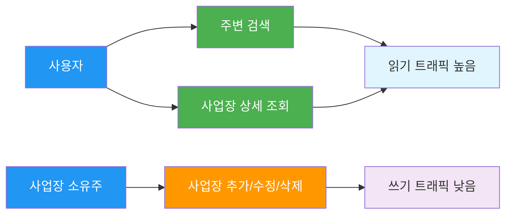
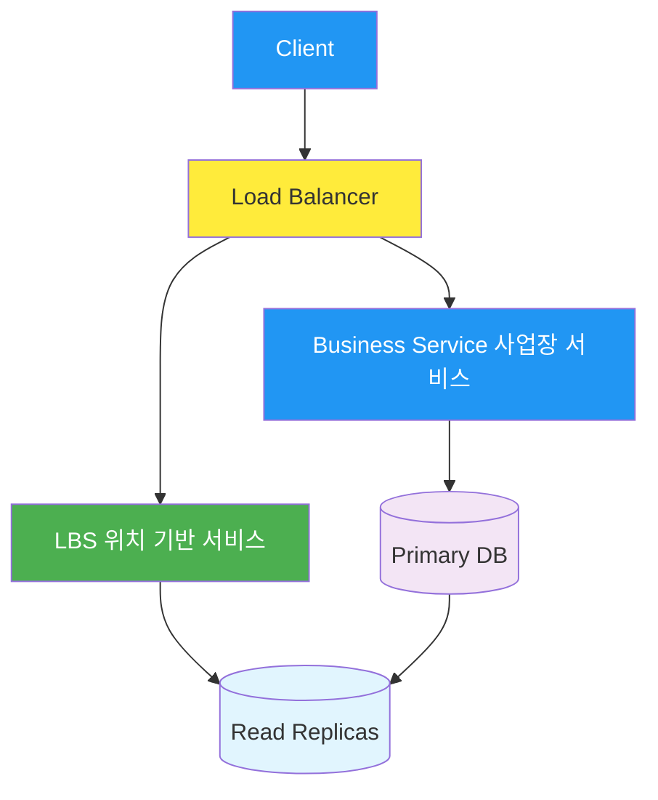
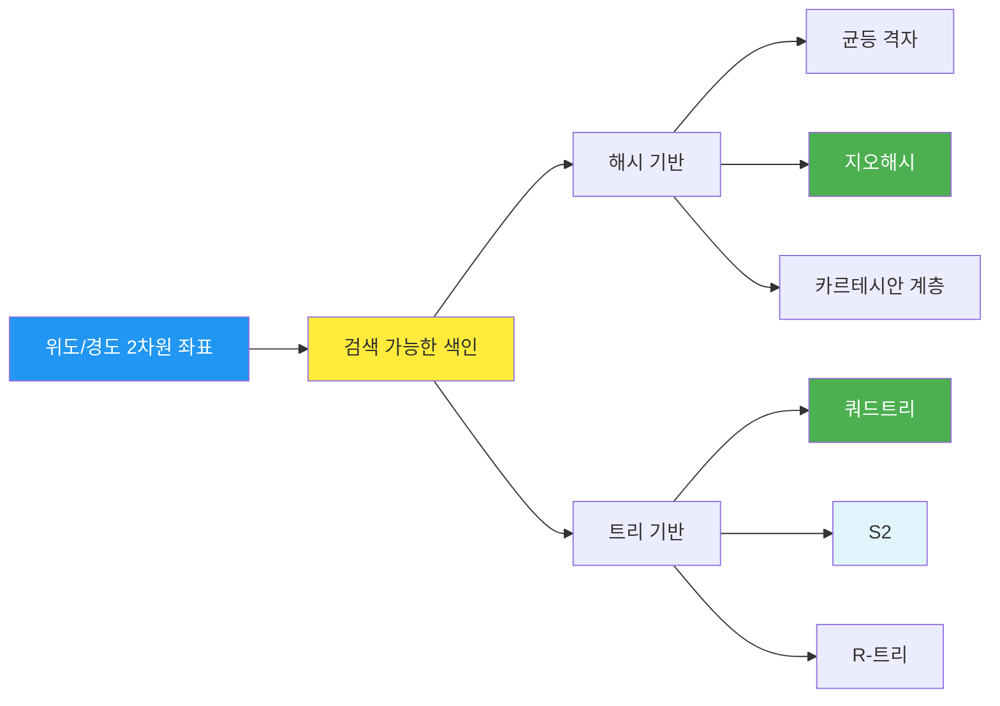
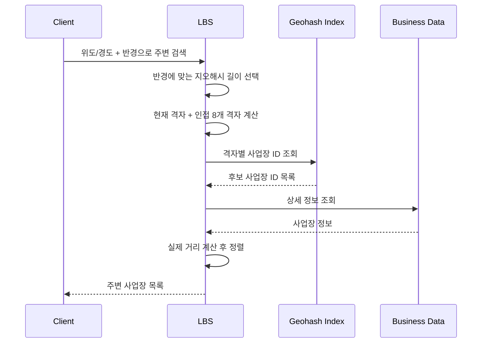
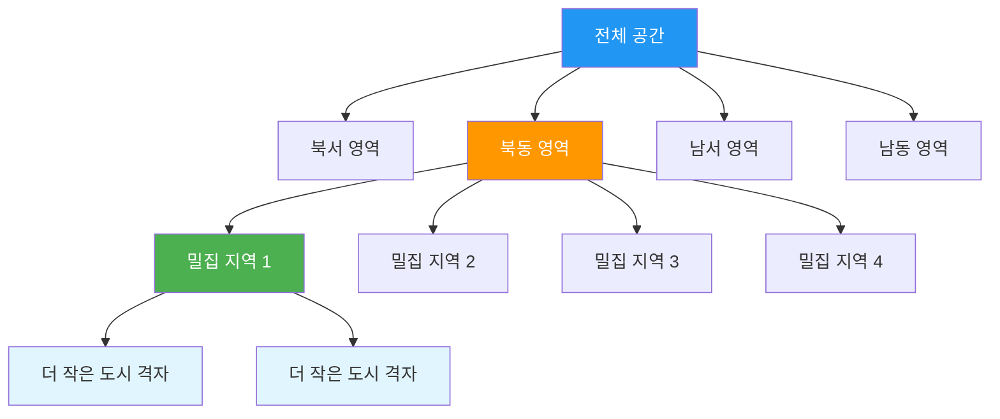
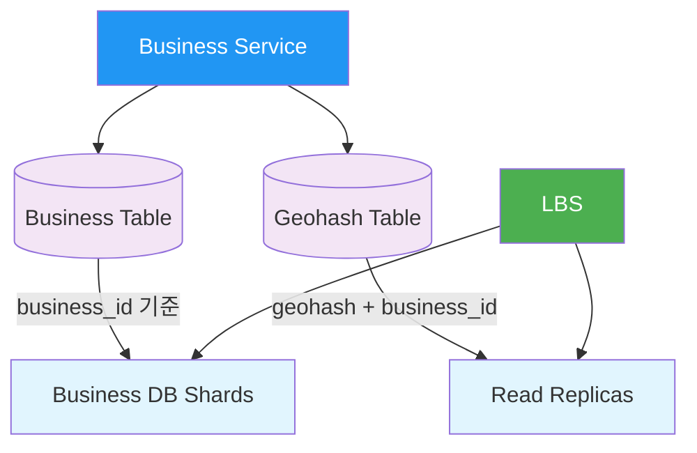
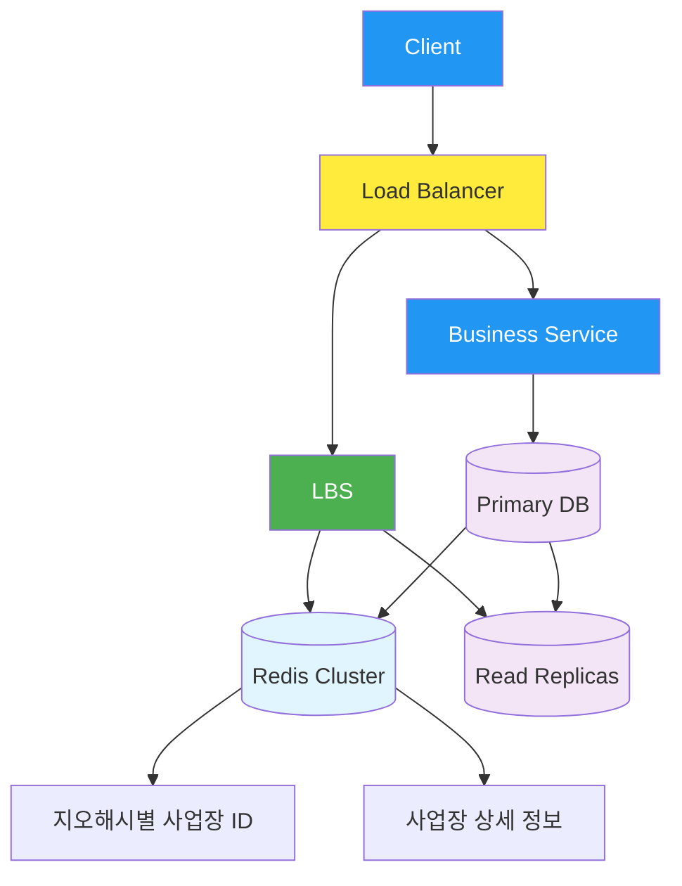

## 시작하며

가면사배2 시리즈를 새로 시작합니다. 1권에서는 사용자 수에 따른 규모 확장, 처리율 제한 장치, 안정 해시, URL 단축기처럼 시스템 설계 면접의 기본기를 많이 다뤘다면, 2권은 조금 더 현실 서비스에 가까운 문제로 들어갑니다. 그 첫 번째 주제가 **근접성 서비스(Proximity Service)**입니다.

근접성 서비스는 말 그대로 현재 위치에서 가까운 시설을 찾아주는 시스템입니다. Yelp에서 주변 식당을 찾거나, Google Maps에서 근처 주유소를 찾거나, 배달 앱에서 내 주변 가게를 보여주는 기능이 여기에 들어갑니다. 처음에는 "위도와 경도만 있으면 DB에서 근처 좌표를 검색하면 되는 거 아닌가?"라고 생각했는데, 책을 읽다 보니 그 단순한 문장 안에 색인, 캐시, 데이터 갱신, 개인정보 보호까지 꽤 많은 문제가 숨어 있더라고요.

특히 재미있었던 지점은 2차원 좌표를 그대로 다루지 않고, **검색하기 쉬운 형태로 바꿔야 한다**는 점이었습니다. 지오해시는 좌표를 문자열로 바꾸고, 쿼드트리는 공간을 밀도에 따라 나눕니다. 둘 다 "가까운 장소를 찾는다"는 같은 문제를 풀지만, 접근 방식과 운영 난이도가 달라서 비교하면서 읽는 맛이 있었습니다.

이번 글에서는 1장 발표자료와 OCR 원문을 바탕으로, 근접성 서비스를 어떻게 설계하는지 순서대로 정리해보겠습니다. 단순히 지오해시가 좋다, 쿼드트리가 좋다로 끝내기보다, 면접에서 어떤 질문을 받고 어떤 근거로 선택해야 하는지까지 같이 보겠습니다.

## 근접성 서비스가 풀어야 하는 문제

근접성 서비스의 입력은 단순합니다. 사용자의 현재 위치, 보통 위도와 경도, 그리고 검색 반경이 들어옵니다. 출력은 그 반경 안에 있는 사업장 목록입니다. 음식점, 호텔, 극장, 박물관, 주유소 같은 것들이 결과가 될 수 있습니다.

하지만 면접에서는 이 한 줄짜리 요구사항을 그대로 받아들이면 안 됩니다. 책에서도 먼저 면접관과 지원자가 범위를 좁히는 대화를 합니다. 사용자가 검색 반경을 직접 지정할 수 있는지, 최대 반경은 얼마인지, 사업장 정보 변경이 실시간으로 반영되어야 하는지, 이동 중인 사용자의 결과를 자동 갱신해야 하는지 같은 질문이 나옵니다.

이 부분을 읽으면서 "아, 위치 기반 서비스는 검색 알고리즘보다 요구사항 정리가 먼저구나"라는 생각이 들었습니다. 실시간으로 위치가 계속 바뀌는 내비게이션 문제인지, 사용자가 버튼을 눌렀을 때 주변 가게를 보여주는 검색 문제인지에 따라 설계가 크게 달라지기 때문입니다.

이 장에서는 범위를 다음처럼 잡습니다.

| 구분 | 이번 장의 가정 |
|---|---|
| 검색 반경 | 사용자가 0.5km, 1km, 2km, 5km, 20km 중 선택 |
| 최대 반경 | 20km |
| 사업장 정보 변경 | 사업장 소유주가 추가/삭제/수정 가능 |
| 변경 반영 시점 | 다음날까지 반영되면 충분 |
| 자동 갱신 | 사용자가 빠르게 이동하지 않는다고 보고 상시 갱신하지 않음 |
| 핵심 기능 | 위치와 반경에 맞는 사업장 목록 반환 |

이 가정이 꽤 중요합니다. 사업장 변경이 다음날 반영되어도 된다는 조건 덕분에 실시간 인덱스 갱신의 부담이 줄어듭니다. 반대로 배달 앱처럼 영업 중/마감 상태가 자주 바뀌고, 가게 노출이 실시간 매출에 영향을 준다면 이 가정은 바로 깨집니다.

이번 장에서 집중하는 기능 요구사항은 세 가지입니다.

| 요구사항 | 설명 |
|---|---|
| 주변 사업장 검색 | 사용자의 위도/경도와 검색 반경에 맞는 사업장 목록 반환 |
| 사업장 CRUD | 사업장 소유주가 사업장 정보를 추가, 삭제, 수정 |
| 상세 정보 조회 | 고객이 사업장 상세 페이지에서 사진, 리뷰, 별점 등을 확인 |

비기능 요구사항도 빠질 수 없습니다. 주변 검색은 사용자가 앱을 켜고 바로 기대하는 기능이라 응답 지연이 짧아야 합니다. 위치 정보는 민감한 개인정보라 GDPR이나 CCPA 같은 보호 요구도 고려해야 합니다. 그리고 점심시간, 저녁시간, 번화가처럼 특정 지역과 시간대에 트래픽이 몰릴 수 있으니 고가용성과 확장성도 필요합니다.

## 규모 추정으로 시스템의 체급 잡기

책에서는 일간 능동 사용자 1억 명, 등록된 사업장 2억 개를 가정합니다. 그리고 한 사용자가 하루에 5번 검색한다고 둡니다.

```text
DAU = 100,000,000명
사용자당 일일 검색 = 5회
하루를 대략 100,000초로 계산

QPS = (100,000,000 × 5) / 100,000 = 5,000 QPS
```

5,000 QPS라는 숫자만 보면 아주 무지막지해 보이지는 않습니다. 하지만 위치 기반 검색은 단순한 key-value 조회가 아닙니다. 사용자의 좌표 근처에 있는 사업장을 찾고, 반경에 맞춰 필터링하고, 상세 정보를 붙이고, 거리순이나 관련도순으로 정렬해야 합니다.

여기서 중요한 점은 읽기와 쓰기의 비율입니다. 주변 사업장 검색과 사업장 상세 조회는 매우 자주 발생합니다. 반면 사업장 추가, 수정, 삭제는 상대적으로 드뭅니다. 그래서 전체 시스템은 **읽기 중심**으로 최적화하는 방향이 자연스럽습니다.



이 다이어그램을 보면 설계 방향이 조금 더 선명해집니다. 사업장 정보 변경은 느려도 괜찮지만, 검색은 빨라야 합니다. 그래서 쓰기 경로와 읽기 경로를 분리하고, 읽기 쪽에는 복제본이나 캐시를 붙이는 구성이 자연스럽게 나옵니다.

실무에서도 이런 읽기/쓰기 비율을 먼저 보는 습관이 중요하다고 느꼈습니다. 기능 이름만 보고 "검색이니까 Elasticsearch를 써야지"처럼 바로 기술을 고르면, 실제 병목이나 데이터 갱신 특성을 놓치기 쉽습니다. 면접에서도 숫자를 대충이라도 잡아두면 이후의 설계 선택에 근거가 생깁니다.

## API는 단순하게, 하지만 결과의 성격은 분리하기

주변 사업장 검색 API는 RESTful하게 설계할 수 있습니다.

```http
GET /v1/search/nearby?latitude={lat}&longitude={lng}&radius={radius}
```

요청 파라미터는 단순합니다.

| 필드 | 설명 | 자료형 |
|---|---|---|
| `latitude` | 검색 기준 위도 | decimal |
| `longitude` | 검색 기준 경도 | decimal |
| `radius` | 검색 반경, 기본값 5000m | int |

응답은 사업장 목록입니다.

```json
{
  "total": 10,
  "businesses": [
    {
      "businessId": "b-123",
      "name": "근처 식당",
      "latitude": 37.123,
      "longitude": 127.123,
      "distance": 420
    }
  ]
}
```

여기서 검색 결과 페이지와 상세 페이지를 분리하는 점이 좋았습니다. 검색 결과에는 목록에 필요한 정보만 담고, 사진, 리뷰, 별점 같은 무거운 정보는 상세 API에서 다시 가져오도록 합니다. 검색 API가 너무 많은 데이터를 반환하면 목록 화면 하나를 띄우는 데 불필요한 비용이 커집니다.

사업장 관련 API는 별도로 둡니다.

| API | 설명 |
|---|---|
| `GET /v1/businesses/:id` | 특정 사업장의 상세 정보 반환 |
| `POST /v1/businesses` | 새로운 사업장 추가 |
| `PUT /v1/businesses/:id` | 사업장 상세 정보 갱신 |
| `DELETE /v1/businesses/:id` | 특정 사업장 정보 삭제 |

이렇게 나누면 검색을 담당하는 위치 기반 서비스와 사업장 정보를 관리하는 서비스를 분리하기 쉬워집니다. 검색은 QPS가 높고 무상태로 수평 확장하기 좋게 만들고, 사업장 서비스는 CRUD와 데이터 정합성에 집중할 수 있습니다.

## 개략적 아키텍처: LBS와 사업장 서비스를 분리하기

책의 개략 설계는 크게 두 갈래입니다. 하나는 주변 검색을 처리하는 LBS(Location-Based Service), 다른 하나는 사업장 정보를 관리하는 Business Service입니다.



로드밸런서는 URL 경로에 따라 요청을 나눕니다. `/v1/search/nearby`는 LBS로 보내고, `/v1/businesses` 계열은 Business Service로 보냅니다. LBS는 읽기 중심이고 상태를 들고 있지 않게 만들면 서버를 늘리는 방식으로 QPS를 처리할 수 있습니다.

Business Service는 쓰기 요청을 Primary DB에 반영합니다. 검색 쪽은 Read Replica를 읽습니다. 사업장 정보가 다음날까지 반영되면 충분하다는 가정이 있으니, Primary와 Replica 사이의 약간의 지연은 받아들일 수 있습니다.

처음에는 "그냥 하나의 API 서버에서 다 처리해도 되지 않나?"라고 생각할 수 있습니다. 하지만 검색 요청과 사업장 관리 요청은 트래픽 패턴이 다릅니다. 검색은 짧고 많이 들어오며, 사업장 CRUD는 적지만 정합성이 더 중요합니다. 둘을 분리하면 각자 다른 확장 전략을 가져갈 수 있습니다.

이 부분을 읽으면서 실무의 서비스 분리도 결국 트래픽과 책임의 차이에서 시작한다는 생각이 들었습니다. 마이크로서비스라서 나누는 게 아니라, 서로 다른 부하와 변경 이유가 있을 때 나누는 게 훨씬 자연스럽습니다.

## 왜 위도와 경도만으로는 부족할까

가장 순진한 접근은 위도와 경도의 범위를 계산해서 DB에서 조회하는 것입니다.

```sql
SELECT business_id
FROM business
WHERE latitude BETWEEN {lat - r} AND {lat + r}
  AND longitude BETWEEN {lng - r} AND {lng + r};
```

이 방식은 이해하기 쉽지만, 대규모 데이터에서는 문제가 큽니다. 위도와 경도 각각에 인덱스를 만들어도 두 조건의 교집합을 빠르게 찾는 일이 쉽지 않습니다. 범위 검색은 결과 후보를 많이 만들 수 있고, 그 후보에서 실제 반경 안에 있는지 다시 계산해야 합니다.

근접성 서비스의 어려움은 **2차원 공간 검색을 빠르게 해야 한다**는 데 있습니다. 일반적인 B-Tree 인덱스는 1차원 값에 강합니다. 그래서 책에서는 2차원 위치 정보를 1차원 색인으로 바꾸는 접근을 설명합니다.



이번 장에서 특히 많이 다루는 방식은 지오해시와 쿼드트리입니다. 지오해시는 좌표를 문자열로 인코딩합니다. 쿼드트리는 공간을 네 조각씩 나누면서 데이터 밀도에 맞춰 더 잘게 쪼갭니다.

이런 변환을 거치면 검색 과정이 훨씬 쉬워집니다. "이 좌표 근처의 모든 사업장을 찾아줘"가 아니라, "이 지오해시 격자와 주변 격자에 속한 사업장을 찾아줘"처럼 문제를 바꿀 수 있기 때문입니다.

## 지오해시: 좌표를 문자열 접두어로 바꾸기

지오해시(Geohash)는 2차원 좌표를 1차원 문자열로 바꾸는 방식입니다. 전 세계를 계속 반으로 나누고, 위도와 경도 정보를 번갈아 인코딩한 뒤 Base32 문자열로 표현합니다. 예를 들어 어떤 위치가 `9q9hvu` 같은 문자열로 표현될 수 있습니다.

지오해시의 좋은 점은 **공간적으로 가까운 위치가 비슷한 접두어를 공유하는 경향**이 있다는 것입니다. 접두어가 길수록 더 작은 격자를 의미합니다. 그래서 검색 반경이 작을수록 긴 지오해시를 쓰고, 반경이 클수록 짧은 지오해시를 씁니다.

| 지오해시 길이 | 대략적인 격자 크기 | 쓰임새 |
|---|---|---|
| 4 | 39.1km × 19.5km | 넓은 범위 검색 |
| 5 | 4.9km × 4.9km | 중간 범위 검색 |
| 6 | 1.2km × 609m | 근거리 검색 |

검색 반경과 지오해시 길이는 이렇게 매핑할 수 있습니다.

| 검색 반경 | 지오해시 길이 |
|---|---|
| 0.5km | 6 |
| 1~2km | 5 |
| 5~20km | 4 |

검색 흐름은 단순합니다.

1. 사용자의 위도와 경도를 지오해시로 변환합니다.
2. 검색 반경에 맞는 지오해시 길이를 선택합니다.
3. 현재 격자와 인접한 8개 격자를 구합니다.
4. 각 격자에 속한 사업장 ID를 조회합니다.
5. 실제 거리 계산으로 반경 밖의 후보를 제거합니다.
6. 정렬해서 반환합니다.



처음에는 현재 지오해시 하나만 보면 될 것 같지만, 실제로는 경계 조건 때문에 인접 격자를 같이 봐야 합니다. 사용자가 격자 경계선 바로 옆에 있으면, 눈으로 보기에는 매우 가까운 사업장이 다른 격자에 들어갈 수 있습니다. 심지어 가까운데 공통 접두어가 거의 없는 경우도 생깁니다.

이 경계 조건이 면접에서 자주 나올 만한 포인트라고 느꼈습니다. 지오해시를 안다고 말하는 것보다, 지오해시가 깨지는 상황을 알고 보완책을 말하는 게 더 설득력 있습니다. "현재 격자만 조회합니다"에서 끝나면 실제 서비스에서는 검색 결과가 이상하게 비는 위치가 생길 수 있습니다.

## 쿼드트리: 밀도에 따라 공간을 나누기

쿼드트리(Quadtree)는 공간을 네 개의 사분면으로 나누는 트리 구조입니다. 어떤 영역에 사업장이 너무 많으면 그 영역을 다시 네 개로 나눕니다. 이 과정을 반복해서 각 말단 노드가 감당할 수 있는 사업장 수 이하가 되도록 만듭니다.

이번 장에서는 격자당 사업장 수가 100개 이하가 될 때까지 분할한다고 설명합니다.

```java
public void buildQuadtree(TreeNode node) {
  if (countBusinesses(node) > 100) {
    node.subdivide();
    for (TreeNode child : node.getChildren()) {
      buildQuadtree(child);
    }
  }
}
```

쿼드트리의 장점은 데이터 밀도에 맞춰 공간을 나눈다는 점입니다. 뉴욕처럼 사업장이 많은 지역은 더 작게 쪼개고, 사막처럼 사업장이 거의 없는 지역은 크게 둡니다. 균등 격자가 모든 지역을 같은 크기로 나누는 것과 다르게, 데이터 분포를 반영합니다.



메모리 계산도 인상적이었습니다. 등록된 사업장이 2억 개이고, 말단 노드당 100개 사업장을 담는다고 하면 말단 노드는 약 200만 개가 필요합니다. 말단 노드 하나가 832 bytes, 내부 노드 하나가 64 bytes 정도라고 보면 전체가 약 1.71GB 정도입니다.

```text
사업장 수 = 200M
격자당 최대 사업장 수 = 100
말단 노드 수 = 200M / 100 = 2M
내부 노드 수 ≈ 2M × 1/3 = 0.67M
말단 메모리 ≈ 2M × 832B = 1.66GB
내부 메모리 ≈ 0.67M × 64B = 0.04GB
총 메모리 ≈ 1.71GB
```

1.71GB라는 숫자를 보면서 "생각보다 작네?"라는 느낌이 들었습니다. 모든 것을 DB 쿼리로 풀려고 하기보다, 읽기 전용 색인 구조를 메모리에 올려두는 방식이 충분히 현실적일 수 있습니다. 다만 서버 시작 시 트리를 구축해야 하고, 배포 때 여러 서버를 동시에 재시작하면 트리 구축 부하가 한꺼번에 몰릴 수 있습니다.

실시간 갱신이 많아지면 쿼드트리는 더 어려워집니다. 트리 구조를 변경할 때 동시성 제어가 필요하고, 여러 LBS 서버가 같은 트리 상태를 유지해야 하기 때문입니다. 이번 장의 가정처럼 사업장 정보가 다음날 반영되어도 된다면 쿼드트리를 배치로 다시 만들 수 있어 부담이 줄어듭니다.

## 지오해시와 쿼드트리 비교하기

지오해시와 쿼드트리는 둘 다 위치 기반 검색을 풀 수 있지만, 성격이 꽤 다릅니다.

| 항목 | 지오해시 | 쿼드트리 |
|---|---|---|
| 구현 난이도 | 비교적 쉬움 | 트리 구축과 운영이 더 어려움 |
| 격자 크기 | 길이에 따라 고정 | 데이터 밀도에 따라 동적 |
| 인덱스 갱신 | 사업장 좌표를 해시로 바꾸면 되므로 단순 | 노드 이동, 분할, 동시성 제어 고려 필요 |
| 경계 조건 | 인접 8개 격자 조회 필요 | 탐색 범위 계산 필요 |
| k-nearest 검색 | 추가 로직 필요 | 트리 탐색으로 더 자연스럽게 지원 |
| 멀티스레드 운영 | 상대적으로 단순 | 업데이트 시 락이나 버전 관리 필요 |

제가 면접에서 하나를 고르라면, 이번 장의 요구사항에서는 지오해시를 먼저 선택할 것 같습니다. 이유는 사업장 정보 갱신이 아예 없는 것은 아니고, 검색 반경도 정해진 몇 가지 옵션으로 제한되어 있기 때문입니다. Redis나 DB에서 지오해시를 활용하기도 쉬워서 구현 리스크가 낮습니다.

반대로 "가장 가까운 k개 주유소를 무조건 빠르게 찾아야 한다"처럼 k-nearest가 핵심이면 쿼드트리가 더 매력적일 수 있습니다. 특히 지역별 밀도 차이가 크고, 메모리에 색인을 올려둘 수 있다면 쿼드트리의 동적 분할이 장점이 됩니다.

여기서 중요한 건 정답을 외우는 게 아니라, **요구사항에 따라 선택 기준을 설명하는 것**이라고 느꼈습니다. 지오해시가 쉽다고 무조건 지오해시를 고르면 경계 조건이나 k-nearest에서 약점이 생깁니다. 쿼드트리가 똑똑해 보인다고 무조건 고르면 운영과 갱신 복잡도가 커집니다.

## 데이터 모델과 읽기 확장

데이터 모델은 크게 사업장 정보와 지리 정보 색인으로 나눌 수 있습니다. 사업장 정보는 이름, 주소, 위치, 설명, 영업 정보 같은 상세 데이터를 담습니다. 지리 정보 색인은 특정 지오해시 또는 격자에 어떤 사업장 ID가 속하는지 알려줍니다.

사업장 테이블은 `business_id`를 기준으로 샤딩할 수 있습니다. 상세 정보 조회나 CRUD는 사업장 ID를 기준으로 접근하기 좋기 때문입니다. 반면 지오해시 테이블은 전체 크기가 그리 크지 않다면 샤딩보다 Read Replica 증설로 읽기 부하를 분산하는 편이 단순합니다.

지오해시 테이블 설계는 두 가지를 생각할 수 있습니다.

| 방식 | 예시 | 장점 | 단점 |
|---|---|---|---|
| 배열 저장 | `[geohash, JSON_array_of_business_ids]` | 한 격자의 ID 목록을 한 번에 읽기 쉬움 | 갱신 시 배열 수정과 락 관리가 까다로움 |
| 복합 키 저장 | `[geohash, business_id]` | 추가/삭제가 단순하고 쿼리하기 좋음 | 조회 후 목록 조립 필요 |

책에서는 복합 키 방식이 더 낫다고 봅니다. 저도 이 선택이 더 자연스럽게 느껴졌습니다. JSON 배열 하나에 ID 목록을 몰아넣으면 읽기는 편해 보이지만, 사업장이 추가되거나 삭제될 때 한 레코드에 쓰기 경합이 생길 수 있습니다. 복합 키는 행 수가 많아지더라도 변경 단위가 작아서 운영하기 좋습니다.



이 설계를 보면서 읽기 모델을 따로 만든다는 감각이 중요하다고 느꼈습니다. 사업장 상세 정보의 정규화된 모델과 주변 검색을 위한 색인 모델은 목적이 다릅니다. 하나의 테이블로 모든 요구를 만족시키려 하면 쿼리도 복잡해지고 확장 전략도 애매해집니다.

## 캐시는 언제 넣어야 할까

이 장에서 의외로 좋았던 부분은 "캐시가 정말 필요한가?"라는 질문입니다. 시스템 설계 문제를 풀다 보면 Redis를 거의 반사적으로 붙이게 되는데, 책은 데이터 크기와 읽기 복제본만으로 충분할 수 있다는 점을 짚습니다.

전체 지리 정보 색인이 약 1.71GB 수준이라면 메모리에 올릴 수 있고, Read Replica로도 5,000 QPS를 감당할 가능성이 있습니다. 그러면 캐시를 추가하기 전에 벤치마킹으로 실제 병목을 확인하는 게 맞습니다.

그래도 캐시가 필요하다면 키 설계가 중요합니다. 위도와 경도를 그대로 캐시 키로 쓰면 사용자의 위치가 조금만 바뀌어도 캐시 미스가 납니다. 반대로 지오해시를 캐시 키로 쓰면 같은 격자 안의 요청을 묶을 수 있습니다.

| 캐시 키 | 문제/장점 |
|---|---|
| `lat:37.123,lng:127.456,radius:500` | 위치가 조금만 달라져도 다른 키가 되어 캐시 효율 낮음 |
| `geohash:wydm6,radius:500` | 같은 격자의 요청을 재사용할 수 있음 |
| `business:&#123;businessId&#125;` | 사업장 상세 정보를 재사용하기 좋음 |

최종 검색 흐름에 Redis를 붙이면 다음과 같은 모양이 됩니다.



실무에서는 캐시를 넣는 순간 무효화 문제가 따라옵니다. 이번 장의 가정처럼 사업장 정보가 다음날 반영되어도 된다면 TTL 기반이나 야간 배치 갱신이 잘 맞을 수 있습니다. 하지만 실시간 반영이 필요해지면 이벤트 기반 무효화, CDC, 메시지 큐 같은 장치가 필요해집니다.

이 부분을 읽으면서 "캐시는 성능 기능이 아니라 운영 기능이기도 하다"는 생각을 했습니다. 캐시를 넣는 건 쉽지만, 언제 지우고 언제 다시 채울지까지 정해야 진짜 설계가 됩니다.

## 개인정보 보호도 설계 범위에 들어간다

위치 정보는 민감합니다. 사용자의 현재 위치, 이동 패턴, 자주 방문하는 장소는 개인의 생활 패턴을 그대로 드러낼 수 있습니다. 그래서 근접성 서비스는 단순한 검색 시스템이 아니라 개인정보 보호 요구를 함께 다뤄야 합니다.

책에서도 비기능 요구사항으로 데이터 보호를 언급합니다. GDPR이나 CCPA 같은 법적 요구를 고려해야 하고, 위치 정보를 필요 이상으로 저장하지 않는 방향이 좋습니다.

제가 생각한 설계 원칙은 세 가지입니다.

| 원칙 | 설명 |
|---|---|
| 최소 수집 | 검색에 필요한 위치만 사용하고 불필요한 위치 이력은 저장하지 않음 |
| 목적 제한 | 주변 검색 목적 외로 위치 데이터를 재사용하지 않음 |
| 삭제 가능성 | 사용자가 요청하면 관련 데이터 삭제 또는 익명화 가능 |

특히 주변 검색 자체는 매 요청의 현재 위치만으로도 처리할 수 있습니다. 검색 품질 개선이나 개인화 때문에 위치 이력을 저장하고 싶어질 수 있지만, 그때는 사용자 동의와 보관 기간, 익명화 수준을 명확히 해야 합니다.

이 내용은 면접에서도 좋은 차별점이 될 것 같습니다. 알고리즘만 이야기하면 기술적인 답변에 머물 수 있는데, 위치 기반 서비스에서 개인정보를 함께 언급하면 실제 서비스를 운영해본 사람처럼 보일 수 있습니다.

## 장애와 운영 관점에서 다시 보기

근접성 서비스는 특정 시간과 지역에 트래픽이 몰릴 수 있습니다. 점심시간의 강남역, 주말 저녁의 번화가, 여행 시즌의 공항 근처처럼 요청이 몰리는 구간이 생깁니다. 그래서 LBS는 무상태로 만들고 수평 확장할 수 있어야 합니다.

또 하나의 운영 포인트는 색인 재구축입니다. 쿼드트리를 쓰는 경우 서버 시작 시 트리를 만들 수 있습니다. 이때 모든 서버를 동시에 재시작하면 DB나 파일 저장소에 부하가 몰릴 수 있습니다. 청/녹 배포나 롤링 배포가 필요한 이유입니다.

지오해시 방식도 운영 이슈가 있습니다. 사업장 위치가 바뀌면 기존 지오해시에서 제거하고 새 지오해시에 추가해야 합니다. 캐시가 있다면 이전 격자와 새 격자 모두 무효화해야 할 수 있습니다. 단순히 DB 행 하나만 바꾸는 문제가 아닙니다.

운영 관점에서 보면 다음처럼 정리할 수 있습니다.

| 상황 | 고려할 점 |
|---|---|
| LBS 서버 증설 | 무상태 설계, 로드밸런서 라우팅 |
| 사업장 정보 배치 반영 | 지오해시 색인 재생성 또는 증분 업데이트 |
| 쿼드트리 서버 재시작 | 트리 구축 시간, 롤링 배포 |
| 캐시 적용 | TTL, 이벤트 기반 무효화, 캐시 워밍 |
| 지역별 트래픽 급증 | 다중 리전, 지역별 replica, 오토스케일링 |

이 장은 알고리즘 장처럼 보이지만, 읽다 보면 운영 문제가 계속 따라옵니다. 지오해시를 쓸지 쿼드트리를 쓸지 결정하는 것도 결국 "우리 팀이 어떤 운영 복잡도를 감당할 수 있는가"와 연결됩니다.

## 면접에서 받을 만한 질문들

이 장의 면접 질문은 대부분 선택의 근거를 묻습니다. 지오해시와 쿼드트리 중 무엇을 선택할지, 경계 조건은 어떻게 처리할지, QPS 5,000은 어떻게 처리할지 같은 질문입니다.

### Q1. 지오해시와 쿼드트리 중 어떤 것을 선택할까?

저라면 이번 요구사항에서는 지오해시를 먼저 선택하겠습니다. 구현이 단순하고, 검색 반경이 정해진 몇 가지 옵션으로 제한되어 있으며, 사업장 정보 갱신도 배치성에 가깝기 때문입니다.

다만 k-nearest 검색이 핵심이고 데이터 밀도 편차를 더 잘 반영해야 한다면 쿼드트리를 고려하겠습니다. 이 답변에서 중요한 건 하나를 절대적인 정답으로 말하지 않는 것입니다.

### Q2. 지오해시 경계 조건은 어떻게 해결할까?

현재 격자만 조회하지 않고 인접 8개 격자를 함께 조회합니다. 그 뒤 실제 거리 계산으로 반경 밖의 사업장을 제거합니다. 이렇게 하면 격자 경계선 근처에서 결과가 빠지는 문제를 줄일 수 있습니다.

### Q3. 5,000 QPS는 어떻게 처리할까?

LBS를 무상태로 두고 수평 확장합니다. DB는 Read Replica로 읽기 부하를 분산합니다. 캐시는 벤치마킹 후 필요하면 지오해시 키 기반으로 붙입니다. 피크 시간에는 오토스케일링과 지역별 트래픽 분산을 고려할 수 있습니다.

### Q4. 캐시가 꼭 필요할까?

무조건 필요하다고 말하기보다, 데이터 크기와 replica 성능을 먼저 봐야 합니다. 색인 데이터가 메모리에 올라갈 정도로 작고 QPS가 replica로 감당된다면 캐시 없이도 충분할 수 있습니다. 캐시는 성능을 올려주지만 무효화와 일관성 문제를 같이 가져옵니다.

### Q5. 실시간 사업장 갱신이 필요해지면 무엇이 바뀔까?

지오해시는 캐시 무효화와 색인 갱신 전략이 필요합니다. 쿼드트리는 트리 업데이트와 동시성 제어가 더 복잡해집니다. 변경 이벤트를 메시지 큐로 흘리고, 검색 색인을 비동기로 갱신하는 구조가 필요할 수 있습니다.

이 질문들을 보면서 면접 답변은 기술 이름보다 조건과 근거가 중요하다는 걸 다시 느꼈습니다. "Redis를 씁니다"보다 "위도/경도 직접 캐시 키는 미스가 많으니 지오해시를 키로 쓰겠습니다"가 훨씬 좋은 답변입니다.

## 실무에 적용할 수 있는 인사이트들

### 1. 좌표 검색은 색인 문제로 바꿔서 봐야 한다

- 위도와 경도는 사람이 이해하기 좋은 표현이지, 대규모 검색에 바로 좋은 키는 아닙니다.
- 지오해시처럼 좌표를 검색 가능한 접두어로 바꾸면 문제를 훨씬 단순하게 만들 수 있습니다.
- 실무에서 위치 기반 기능을 만들 때도 먼저 "검색 키를 무엇으로 둘 것인가"를 정해야 합니다.

### 2. 캐시는 벤치마킹 뒤에 넣는 편이 낫다

- 이 장은 캐시를 반사적으로 추가하지 않는 태도가 좋았습니다.
- 데이터가 작고 Read Replica로 충분하다면 Redis를 붙이지 않는 선택도 가능합니다.
- 캐시는 성능을 올릴 수 있지만 무효화, 워밍, 장애 대응까지 같이 설계해야 합니다.

### 3. 경계 조건은 알고리즘 이해도를 보여준다

- 지오해시를 설명할 때 현재 격자만 말하면 절반만 이해한 것입니다.
- 인접 8개 격자 검색과 실제 거리 필터링을 같이 설명해야 실제 서비스에서 결과 누락을 줄일 수 있습니다.
- 면접에서는 이런 예외 상황을 먼저 언급하는 게 신뢰를 줍니다.

### 4. 데이터 갱신 주기가 설계를 바꾼다

- 사업장 정보가 다음날 반영되어도 된다면 배치 갱신과 읽기 최적화가 쉬워집니다.
- 실시간 반영이 필요하면 메시지 큐, 캐시 무효화, 색인 증분 업데이트가 필요합니다.
- 요구사항에서 "언제까지 반영되어야 하는가"를 꼭 물어봐야 하는 이유입니다.

### 5. 위치 정보는 개인정보라는 전제를 놓치면 안 된다

- 위치 기반 서비스는 검색 품질만큼 데이터 보호도 중요합니다.
- 위치 이력을 저장하지 않아도 되는 기능이라면 저장하지 않는 편이 안전합니다.
- 저장이 필요하다면 동의, 보관 기간, 삭제 요청, 익명화까지 같이 설계해야 합니다.

## 마무리

가면사배2 첫 장은 근접성 서비스였습니다. 처음에는 위치 기반 검색 알고리즘 하나를 배우는 장이라고 생각했는데, 읽고 나니 요구사항 정리, 공간 색인, 캐시 판단, 운영, 개인정보 보호까지 연결되는 꽤 넓은 문제였습니다.

가장 기억에 남는 건 지오해시와 쿼드트리의 비교였습니다. 지오해시는 단순하고 운영하기 쉽지만 경계 조건을 조심해야 합니다. 쿼드트리는 데이터 밀도를 잘 반영하지만 구축과 갱신이 더 어렵습니다. 결국 선택은 문제의 조건에 달려 있습니다.

개인적으로는 "캐시를 넣을까?"라는 질문을 무조건적인 yes/no가 아니라 벤치마킹과 데이터 크기 관점에서 보는 부분이 좋았습니다. 시스템 설계 면접에서는 기술을 많이 붙이는 것보다, 붙이지 않아도 되는 이유를 설명하는 능력도 중요하다는 걸 느꼈습니다.

다음 포스트에서는 2장 "주변 친구"를 다룰 예정입니다. 근접성 서비스가 주변 사업장을 찾는 문제였다면, 다음 장은 주변에 있는 사람을 찾는 문제라서 위치 데이터와 실시간성에 대한 고민이 더 커질 것 같습니다.

### 🗺️ 위치 색인에 대한 질문

- 지오해시를 사용할 때 현재 격자와 인접 8개 격자를 함께 조회하면 모든 경계 문제가 해결될까요?
- 쿼드트리를 메모리에 올려두는 방식은 서버 재시작이나 배포 과정에서 어떤 리스크를 만들까요?
- 검색 반경이 사용자가 자유롭게 입력하는 값이라면 지오해시 길이 매핑을 어떻게 설계하는 게 좋을까요?

### ⚡ 캐시와 성능에 대한 질문

- Read Replica만으로 충분한 상황에서도 Redis 캐시를 넣어야 하는 기준은 무엇일까요?
- 지오해시별 사업장 ID 캐시와 사업장 상세 정보 캐시의 TTL은 서로 같아야 할까요?
- 사업장 정보가 변경됐을 때 TTL 기반 무효화와 이벤트 기반 무효화 중 어떤 쪽이 운영하기 쉬울까요?

### 🔐 개인정보 보호에 대한 질문

- 주변 검색을 위해 사용자의 위치 이력을 저장해야 하는 경우와 저장하지 않아도 되는 경우를 어떻게 나눌 수 있을까요?
- 위치 데이터를 익명화하더라도 재식별 위험은 어떻게 줄일 수 있을까요?
- 지역별 데이터 보호 규제가 다르면 LBS의 리전 설계도 달라져야 할까요?

### 🧭 서비스 요구사항에 대한 질문

- 배달 앱처럼 영업 상태가 자주 바뀌는 서비스라면 이번 장의 "다음날 반영" 가정은 어떻게 바뀌어야 할까요?
- 주변 사업장이 충분하지 않을 때 검색 반경을 자동으로 넓히는 기능은 사용자 경험과 성능 중 어느 쪽에 더 큰 영향을 줄까요?
- k-nearest 검색이 중요해지는 순간, 지오해시 기반 설계는 어디까지 유지할 수 있을까요?

댓글로 공유해주시면 함께 배워나갈 수 있을 것 같습니다!
