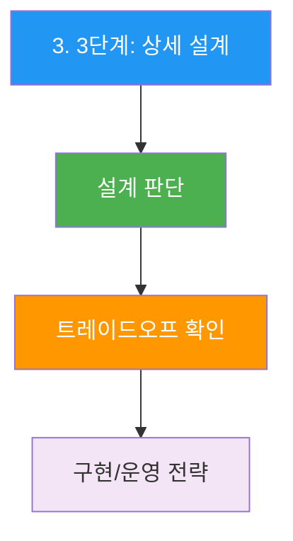
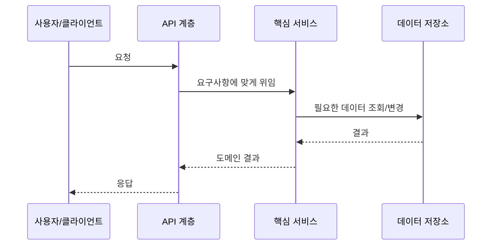

## 시작하며

가면사배2 시리즈 4번째 글입니다. 이번 장은 **분산 메시지 큐**이고, 한 줄로 잡아보면 `비동기 시스템의 허리`에 가까운 문제입니다. 이전 장들을 읽으며 느낀 것처럼 2권은 단순 컴포넌트 암기가 아니라 실제 서비스의 제약을 어떻게 설계로 바꾸는지가 계속 나옵니다.

처음 분산 메시지 큐 장을 읽었을 때는 익숙한 서비스 문제처럼 보였습니다. 그런데 요구사항을 따라가다 보니 데이터 모델, API, 확장 전략, 장애 대응이 계속 맞물리더라고요. 그래서 이번 글은 발표자료의 뼈대를 그대로 따라가되, 읽으면서 제가 이해한 판단 근거를 조금 더 풀어보는 방식으로 정리했습니다.

이 글은 맥미니에 옮겨둔 가면사배2 발표 README와 OCR `full.md`를 기준으로 작성했습니다. 외부 내용을 새로 붙이기보다는, 원문과 발표자료에 있는 내용을 블로그 톤으로 풀어내는 데 집중했습니다.


위 흐름을 기준으로 읽으면 장 전체가 훨씬 잘 정리됩니다. 요구사항을 잡고, 개략 설계를 합의하고, 병목이 되는 부분을 상세 설계로 끌고 가는 구조입니다.

## 1. 1단계: 문제 이해 및 설계 범위 확정

분산 메시지 큐에서 이 부분은 설계의 방향을 잡는 데 꽤 큰 역할을 합니다. 발표자료에서는 `1. 1단계: 문제 이해 및 설계 범위 확정`를 중심으로 설명하고 있고, OCR 원문을 같이 보면 왜 이 흐름이 필요한지 더 분명해집니다.

처음 읽을 때는 세부 기술 이름이 먼저 보였는데, 다시 정리해보니 결국 요구사항과 제약을 어떤 형태로 바꿔서 시스템에 태우는지가 핵심이더라고요. 그래서 이 섹션은 단순 요약이 아니라, 면접에서 말할 수 있는 판단 근거 중심으로 풀어보겠습니다.

| 포인트 | 블로그식 해석 |
|---|---|
| *정의**: 생산자(Producer)와 소비자(Consumer) 사이에서 메시지를... | 이 항목은 분산 메시지 큐 설계에서 놓치면 뒤 단계가 흔들리는 부분입니다. |
| *대표 시스템**: | 이 항목은 분산 메시지 큐 설계에서 놓치면 뒤 단계가 흔들리는 부분입니다. |
| Apache Kafka, Apache Pulsar (이벤트 스트리밍 플랫폼) | 이 항목은 분산 메시지 큐 설계에서 놓치면 뒤 단계가 흔들리는 부분입니다. |
| RabbitMQ, ActiveMQ, RocketMQ, ZeroMQ (전통적 메시지 큐) | 이 항목은 분산 메시지 큐 설계에서 놓치면 뒤 단계가 흔들리는 부분입니다. |
| *메시지 큐의 이점**: | 이 항목은 분산 메시지 큐 설계에서 놓치면 뒤 단계가 흔들리는 부분입니다. |

1. 정의 : 생산자(Producer)와 소비자(Consumer) 사이에서 메시지를 중개하는 분산 시스템
2. 면접관 : 텍스트 형태만 지원하면 되고, 크기는 수 KB 수준입
3. 면접관 : '최소 한 번'은 반드시, 이상적으로는 모두 지원하고 설정 가능해야 합

실무에서도 비슷한 선택을 할 때가 많습니다. 어떤 컴포넌트를 추가할지보다, 이 컴포넌트가 지금의 요구사항에서 정말 필요한지 먼저 확인해야 합니다. 이 장을 정리하면서 그 순서를 더 의식하게 됐습니다.

## 2. 2단계: 개략적 설계

분산 메시지 큐에서 이 부분은 설계의 방향을 잡는 데 꽤 큰 역할을 합니다. 발표자료에서는 `2. 2단계: 개략적 설계`를 중심으로 설명하고 있고, OCR 원문을 같이 보면 왜 이 흐름이 필요한지 더 분명해집니다.

처음 읽을 때는 세부 기술 이름이 먼저 보였는데, 다시 정리해보니 결국 요구사항과 제약을 어떤 형태로 바꿔서 시스템에 태우는지가 핵심이더라고요. 그래서 이 섹션은 단순 요약이 아니라, 면접에서 말할 수 있는 판단 근거 중심으로 풀어보겠습니다.

| 포인트 | 블로그식 해석 |
|---|---|
| 메시지를 **오직 한 소비자만** 가져감 | 이 항목은 분산 메시지 큐 설계에서 놓치면 뒤 단계가 흔들리는 부분입니다. |
| 소비자가 메시지 수신 확인(acknowledge)하면 큐에서 삭제 | 이 항목은 분산 메시지 큐 설계에서 놓치면 뒤 단계가 흔들리는 부분입니다. |
| 데이터 보관 미지원 | 이 항목은 분산 메시지 큐 설계에서 놓치면 뒤 단계가 흔들리는 부분입니다. |
| **토픽(Topic)**: 메시지를 주제별로 정리하는 논리적 채널 | 이 항목은 분산 메시지 큐 설계에서 놓치면 뒤 단계가 흔들리는 부분입니다. |
| 토픽을 구독하는 **모든 소비자**에게 메시지 전달 | 이 항목은 분산 메시지 큐 설계에서 놓치면 뒤 단계가 흔들리는 부분입니다. |


```
생산자 → 메시지 큐 → 메시지 A → 소비자 1 (수신)
                              → 소비자 2 (수신 못함)
```

위 예시는 원문/발표자료의 흐름을 보존한 것입니다. 실제 블로그에서는 코드 자체보다 이 코드가 어떤 병목이나 운영 문제를 설명하는지까지 같이 읽는 게 좋았습니다.

```
생산자 → 메시지 큐(토픽) → 메시지 A → 소비자 1 (수신)
                                    → 소비자 2 (수신)
```

위 예시는 원문/발표자료의 흐름을 보존한 것입니다. 실제 블로그에서는 코드 자체보다 이 코드가 어떤 병목이나 운영 문제를 설명하는지까지 같이 읽는 게 좋았습니다.

실무에서도 비슷한 선택을 할 때가 많습니다. 어떤 컴포넌트를 추가할지보다, 이 컴포넌트가 지금의 요구사항에서 정말 필요한지 먼저 확인해야 합니다. 이 장을 정리하면서 그 순서를 더 의식하게 됐습니다.

## 3. 3단계: 상세 설계

분산 메시지 큐에서 이 부분은 설계의 방향을 잡는 데 꽤 큰 역할을 합니다. 발표자료에서는 `3. 3단계: 상세 설계`를 중심으로 설명하고 있고, OCR 원문을 같이 보면 왜 이 흐름이 필요한지 더 분명해집니다.

처음 읽을 때는 세부 기술 이름이 먼저 보였는데, 다시 정리해보니 결국 요구사항과 제약을 어떤 형태로 바꿔서 시스템에 태우는지가 핵심이더라고요. 그래서 이 섹션은 단순 요약이 아니라, 면접에서 말할 수 있는 판단 근거 중심으로 풀어보겠습니다.

| 포인트 | 블로그식 해석 |
|---|---|
| *왜 데이터베이스가 아닌가?** | 이 항목은 분산 메시지 큐 설계에서 놓치면 뒤 단계가 흔들리는 부분입니다. |
| 활성 세그먼트: 새 메시지 추가 (append) | 이 항목은 분산 메시지 큐 설계에서 놓치면 뒤 단계가 흔들리는 부분입니다. |
| 비활성 세그먼트: 읽기 전용 | 이 항목은 분산 메시지 큐 설계에서 놓치면 뒤 단계가 흔들리는 부분입니다. |
| 보관 기한 만료 시 삭제 | 이 항목은 분산 메시지 큐 설계에서 놓치면 뒤 단계가 흔들리는 부분입니다. |
| *디스크 성능 참고**: 순차 접근 패턴을 활용하면 RAID 디스크에서 **수백... | 이 항목은 분산 메시지 큐 설계에서 놓치면 뒤 단계가 흔들리는 부분입니다. |

1. 세 가지 핵심 설계 결정 데이터 저장소: WAL (Write Ahead Log) 왜 데이터베이스가 아닌가
2. 디스크 성능 참고 : 순차 접근 패턴을 활용하면 RAID 디스크에서 수백 MB/sec 읽기/쓰기 달성 가능
3. 메시지 자료 구조 핵심 : 메시지 구조는 생산자 큐 소비자 간의 계약(contract)
4. 이 구조를 전 과정에서 그대로 유지하여 불필요한 복사를 방지 일괄 처리 (Batching) 트레이드오프 : 일괄 처리 양 ↑ → 대역폭 ↑, 지연 ↑ / 일괄 처리 양 ↓ → 대역폭 ↓, 지연 ↓ 생산자 측 작업 흐름 라우팅 계층을 생산자 내부로 편입한 이유 : 전송 흐름 : 1
5. 충분한 사본이 동기화되면 리더가 디스크에 기록(commit) 6



이 다이어그램처럼 한 번에 구현으로 뛰어들기보다, 먼저 어떤 판단을 해야 하는지 분리해두면 설명이 훨씬 편해집니다. 이 부분을 읽으면서 "면접 답변은 기술 나열보다 판단 순서가 중요하구나"라는 생각이 들었습니다.

```
토픽-A 파티션-1
| 0 | 1 | 2 | 3 | 4 | 5 | 6 | 7 | 8 | ... |
←--- 세그먼트-1 ---→←--- 세그먼트-2 ---→

세그먼트 관리:
- 활성 세그먼트: 새 메시지 추가 (append)
- 비활성 세그먼트: 읽기 전용
- 보관 기한 만료 시 삭제
```

위 예시는 원문/발표자료의 흐름을 보존한 것입니다. 실제 블로그에서는 코드 자체보다 이 코드가 어떤 병목이나 운영 문제를 설명하는지까지 같이 읽는 게 좋았습니다.

```
         높은 대역폭 ←────────→ 낮은 응답 지연
              ↑                      ↑
        일괄 처리 양 많음         일괄 처리 양 적음
```

위 예시는 원문/발표자료의 흐름을 보존한 것입니다. 실제 블로그에서는 코드 자체보다 이 코드가 어떤 병목이나 운영 문제를 설명하는지까지 같이 읽는 게 좋았습니다.

실무에서도 비슷한 선택을 할 때가 많습니다. 어떤 컴포넌트를 추가할지보다, 이 컴포넌트가 지금의 요구사항에서 정말 필요한지 먼저 확인해야 합니다. 이 장을 정리하면서 그 순서를 더 의식하게 됐습니다.

## 4. 면접 질문 Q&A

분산 메시지 큐에서 이 부분은 설계의 방향을 잡는 데 꽤 큰 역할을 합니다. 발표자료에서는 `4. 면접 질문 Q&A`를 중심으로 설명하고 있고, OCR 원문을 같이 보면 왜 이 흐름이 필요한지 더 분명해집니다.

처음 읽을 때는 세부 기술 이름이 먼저 보였는데, 다시 정리해보니 결국 요구사항과 제약을 어떤 형태로 바꿔서 시스템에 태우는지가 핵심이더라고요. 그래서 이 섹션은 단순 요약이 아니라, 면접에서 말할 수 있는 판단 근거 중심으로 풀어보겠습니다.

| 포인트 | 블로그식 해석 |
|---|---|
| 답변 : 메시지 큐의 트래픽 패턴은 데이터베이스에 적합하지 않습니다: 1 | 이 항목은 분산 메시지 큐 설계에서 놓치면 뒤 단계가 흔들리는 부분입니다. |
| 읽기/쓰기가 동시에 대규모로 발생 → DB는 이 패턴에 병목 2 | 이 항목은 분산 메시지 큐 설계에서 놓치면 뒤 단계가 흔들리는 부분입니다. |
| 갱신/삭제 없이 순차적 추가만 → WAL의 append only 패턴에 완벽히 부합 3 | 이 항목은 분산 메시지 큐 설계에서 놓치면 뒤 단계가 흔들리는 부분입니다. |
| 순차적 접근 패턴 → 회전식 디스크에서도 수백 MB/sec 성능 4 | 이 항목은 분산 메시지 큐 설계에서 놓치면 뒤 단계가 흔들리는 부분입니다. |
| OS의 디스크 캐시를 적극 활용하여 별도 캐시 레이어 불필요 Q2 | 이 항목은 분산 메시지 큐 설계에서 놓치면 뒤 단계가 흔들리는 부분입니다. |

1. 답변 : 메시지 큐의 트래픽 패턴은 데이터베이스에 적합하지 않습니다: 1
2. 읽기/쓰기가 동시에 대규모로 발생 → DB는 이 패턴에 병목 2
3. 갱신/삭제 없이 순차적 추가만 → WAL의 append only 패턴에 완벽히 부합 3
4. 순차적 접근 패턴 → 회전식 디스크에서도 수백 MB/sec 성능 4
5. OS의 디스크 캐시를 적극 활용하여 별도 캐시 레이어 불필요 Q2

실무에서도 비슷한 선택을 할 때가 많습니다. 어떤 컴포넌트를 추가할지보다, 이 컴포넌트가 지금의 요구사항에서 정말 필요한지 먼저 확인해야 합니다. 이 장을 정리하면서 그 순서를 더 의식하게 됐습니다.

## 5. 토론 주제

분산 메시지 큐에서 이 부분은 설계의 방향을 잡는 데 꽤 큰 역할을 합니다. 발표자료에서는 `5. 토론 주제`를 중심으로 설명하고 있고, OCR 원문을 같이 보면 왜 이 흐름이 필요한지 더 분명해집니다.

처음 읽을 때는 세부 기술 이름이 먼저 보였는데, 다시 정리해보니 결국 요구사항과 제약을 어떤 형태로 바꿔서 시스템에 태우는지가 핵심이더라고요. 그래서 이 섹션은 단순 요약이 아니라, 면접에서 말할 수 있는 판단 근거 중심으로 풀어보겠습니다.

| 포인트 | 블로그식 해석 |
|---|---|
| *배경**: 카프카는 최근 ZooKeeper 의존성을 제거하고 자체 합의... | 이 항목은 분산 메시지 큐 설계에서 놓치면 뒤 단계가 흔들리는 부분입니다. |
| ZooKeeper 제거의 운영상 이점은 무엇인가? | 이 항목은 분산 메시지 큐 설계에서 놓치면 뒤 단계가 흔들리는 부분입니다. |
| 메타데이터 관리를 브로커 자체에서 처리하면 아키텍처가 어떻게 단순화되는가? | 이 항목은 분산 메시지 큐 설계에서 놓치면 뒤 단계가 흔들리는 부분입니다. |
| 외부 조정 서비스 vs 내부 합의 프로토콜의 트레이드오프 | 이 항목은 분산 메시지 큐 설계에서 놓치면 뒤 단계가 흔들리는 부분입니다. |
| *상황**: 동일 시스템을 로그 수집(높은 대역폭)과 실시간 알림(낮은 지연)에 동시 사용 | 이 항목은 분산 메시지 큐 설계에서 놓치면 뒤 단계가 흔들리는 부분입니다. |

1. 카프카의 ZooKeeper 의존성 제거 (KRaft) 배경 : 카프카는 최근 ZooKeeper 의존성을 제거하고 자체 합의 프로토콜(KRaft)을 도입 논점 : ZooKeeper 제거의 운영상 이점은 무엇인가
2. 메타데이터 관리를 브로커 자체에서 처리하면 아키텍처가 어떻게 단순화되는가
3. 대역폭 vs 지연 시간의 실제 선택 상황 : 동일 시스템을 로그 수집(높은 대역폭)과 실시간 알림(낮은 지연)에 동시 사용 논점 : 하나의 클러스터에서 두 가지 워크로드를 모두 처리할 수 있는가
4. 토픽/파티션 단위로 일괄 처리 설정을 다르게 가져가는 방안 전용 클러스터 분리 vs 단일 클러스터 내 QoS 적용 3
5. 정확히 한 번 전달의 현실적 구현 문제 : exactly once는 이론적으로 완벽하지만 현실에서는 한계가 있음 논점 : 카프카의 트랜잭셔널 API로 어디까지 보장 가능한가

실무에서도 비슷한 선택을 할 때가 많습니다. 어떤 컴포넌트를 추가할지보다, 이 컴포넌트가 지금의 요구사항에서 정말 필요한지 먼저 확인해야 합니다. 이 장을 정리하면서 그 순서를 더 의식하게 됐습니다.

## OCR 원문으로 보강한 세부 흐름

발표 README만 보면 구조는 빠르게 잡히지만, OCR 원문을 같이 보면 왜 그런 설계가 나왔는지 설명 문장이 더 촘촘해집니다. 아래는 원문에서 설계 판단에 도움이 되는 흐름을 블로그식으로 다시 묶은 내용입니다.

- 4장 System Design Interview Volume 2 분산 메시지 큐 이번 장에서는 시스템 설계 면접에 단골로 출제되는 문제인, 분산 메시지 큐 설계에 대해 알아보겠
- 현대적 소프트웨어 아키텍처를 따르는 시스템은 잘 정의된 인터페이스를 경계로 나뉜 작고 독립적인 블록들로 구성된
- 결합도 완화(decoupling): 메시지 큐를 사용하면 컴포넌트 사이의 강한 결합이 사라지므로 각각을 독립적으로 갱신할 수 있
- 규모 확장성 개선: 메시지 큐에 데이터를 생산하는 생산자(producer)와 큐에서 메시지를 소비하는 소비자(consumer) 시스템 규모를 트래픽 부하에 맞게 독립적으로 늘릴 수 있
- 예를 들어 트래픽이 많이 몰리는 시간에는 더 많은 소비자를 추가하여 처리 용량을 늘릴 수 있
- 가용성 개선: 시스템의 특정 컴포넌트에 장애가 발생해도 다른 컴포넌트는 큐와 계속 상호작용을 이어갈 수 있
- 생산자는 응답을 기다리지 않고도 메시지를 보낼 수 있고, 소비자는 읽을 메시지가 있을 때만 해당 메시지를 소비하면 된
- 그림 4.1은 몇 가지 시장에서 가장 유명한 분산 메시지 큐 시스템이
- [그림 4.1 유명 분산 메시지 큐] 아파치 카프카 (Kafka) 아파치 RocketMQ 아파치 RabbitMQ 아파치 펄사 (Pulsar) 아파치 ActiveMQ ZeroMQ 메시지 큐 대 이벤트 스트리밍 플랫폼 엄밀하게 말하면 아파치 카프카(Apache Kafka)나 펄사(Pulsar)는 메시지 큐가 아니라 이벤트 스트리밍 플랫폼(event streaming platform)이
- 하지만 메시지 큐(RocketMQ, ActiveMQ, RabbitMQ, ZeroMQ 등)와 이벤트 스트리밍 플랫폼(카프카, 펄사) 사이의 차이는 지원하는 기능이 서로 수렴하면서 점차 희미해지고 있
- 예를 들어 전형적인 메시지 큐 RabbitMQ는 옵션으로 제공되는 스트리밍 기능을 추가하면 메시지를 반복적으로 소비할 수 있는 동시에 데이터의 장기 보관도 가능하
- 그리고 그 기능은 데이터 추가(append)만 가능한 로그(log)를 통해 구현되어 있는데, 이벤트 스트리밍 플랫폼 구현과 유사하

이 부분을 읽으면서 발표자료는 면접 답변용 지도이고, OCR 원문은 그 지도를 뒷받침하는 설명서에 가깝다는 생각이 들었습니다. 블로그 글을 쓸 때는 둘 중 하나만 쓰기보다, README로 구조를 잡고 원문으로 깊이를 보강하는 편이 훨씬 안정적입니다.

## 리뷰 보강 노트: 다시 읽을 때 볼 지점

초안 리뷰를 할 때는 문장이 자연스러운지만 보면 부족합니다. 아래처럼 요구사항, 데이터 흐름, 운영 리스크를 따로 체크해야 글이 얕아지지 않습니다. 이 목록은 원문과 발표자료에서 반복해서 등장하는 판단 지점을 블로그 리뷰용으로 풀어둔 것입니다.

### 요구사항이 설계에 미치는 영향

- 사용자가 실제로 기대하는 응답 시간이 어느 정도인지 먼저 봐야 합니다.
- 데이터가 즉시 반영되어야 하는지, 지연 반영이 허용되는지에 따라 저장소와 캐시 전략이 달라집니다.
- 읽기 요청이 많은지, 쓰기 요청이 많은지, 특정 시간대에 몰리는지 따로 확인해야 합니다.
- 이 부분을 읽으면서 "요구사항 한 줄이 컴포넌트 여러 개를 만들 수도 있구나"라는 생각이 들었습니다.

### 데이터 모델을 볼 때의 기준

- 사용자가 보는 데이터와 내부에서 관리하는 데이터가 항상 같은 모양일 필요는 없습니다.
- 조회를 빠르게 하기 위한 모델과 정합성을 지키기 위한 모델을 나눠야 할 때가 많습니다.
- 인덱스나 캐시를 추가하면 쓰기 경로가 복잡해지는지도 같이 봐야 합니다.
- 저는 이 부분이 실무 문서 리뷰에서도 자주 빠지는 지점이라고 느꼈습니다.

### 운영 리스크를 볼 때의 기준

- 장애가 나면 사용자가 어떤 상태를 보게 되는지 먼저 상상해야 합니다.
- 재시도와 중복 요청이 생겼을 때 같은 작업이 두 번 처리되지 않는지 확인해야 합니다.
- 배포나 재시작 시 색인, 캐시, 큐 소비자 같은 보조 컴포넌트가 같이 흔들릴 수 있습니다.
- 정상 흐름만 설명하면 글은 깔끔해 보이지만, 운영 관점에서는 실패 흐름이 더 중요합니다.

### 면접 답변으로 바꿀 때의 기준

- 기술 이름을 먼저 말하기보다, 왜 그 기술이 필요한지 조건을 먼저 말하는 편이 좋습니다.
- 하나의 답만 밀기보다 대안과 트레이드오프를 같이 놓으면 답변이 훨씬 안정적입니다.
- 시간이 부족하면 모든 세부 구현을 말하기보다 병목 하나를 깊게 파는 편이 낫습니다.
- 이 장을 블로그로 정리하는 목적도 결국 나중에 면접 답변으로 다시 꺼내기 쉽게 만드는 데 있습니다.

### 블로그 리뷰 때 고칠 표현

- `중요합니다`만 반복되는 문장은 왜 중요한지 구체적인 상황을 붙입니다.
- `확장성이 좋다`는 표현은 어떤 축으로 확장되는지, 읽기인지 쓰기인지 분리합니다.
- `캐시를 사용한다`는 문장은 캐시 키, TTL, 무효화 조건 중 하나라도 같이 설명합니다.
- `장애에 대응한다`는 문장은 어떤 장애인지, 자동 복구인지 수동 복구인지 나눠 씁니다.

이 보강 노트는 최종 글에서 일부를 줄여도 됩니다. 다만 초안 단계에서는 일부러 넉넉하게 남겨두는 편이 좋습니다. 그래야 현준님이 리뷰할 때 "여기는 너무 길다", "이 부분은 더 실무적으로"처럼 방향을 잡기 쉽습니다.

## 초안 리뷰 체크리스트

이 글을 발행하기 전에 아래 항목을 한 번 더 확인하면 좋겠습니다. 자동 검증은 구조를 잡아주지만, 글의 맛이나 설명 밀도는 사람이 다시 봐야 합니다.

### 1. 도입부

- 이번 장이 어떤 문제를 다루는지 첫 문단에서 바로 보이는지 확인합니다.
- 이전 장과의 연결이 어색하지 않은지 확인합니다.
- 너무 거창한 표현보다 실제로 읽으면서 든 생각이 들어갔는지 봅니다.
- 독자가 이 글을 왜 읽어야 하는지 자연스럽게 드러나는지 확인합니다.

### 2. 본문 흐름

- 요구사항에서 개략 설계로 넘어가는 연결이 끊기지 않는지 확인합니다.
- 개략 설계에서 상세 설계로 넘어갈 때 어떤 병목을 깊게 보는지 드러나는지 확인합니다.
- 표와 다이어그램이 설명을 대신하고 있지는 않은지 봅니다.
- 각 표 뒤에 해석 문장이 충분히 붙어 있는지 확인합니다.

### 3. 기술 용어

- 처음 등장하는 용어가 너무 갑자기 나오지 않는지 확인합니다.
- 약어가 나오면 풀어쓴 이름이나 역할이 주변 문장에 있는지 봅니다.
- 독자가 모를 만한 용어는 비유나 실제 서비스 예시로 보강합니다.
- 같은 용어를 장 전체에서 일관되게 쓰는지 확인합니다.

### 4. 실무 연결

- 책의 내용을 그대로 옮긴 문단과 제 생각이 들어간 문단이 균형을 이루는지 봅니다.
- "실무에서도"라고 쓴 문장이 실제로 어떤 상황을 말하는지 충분히 구체적인지 확인합니다.
- 우리 서비스나 백엔드 운영 경험과 연결할 수 있는 부분이 더 있는지 확인합니다.
- 과한 개인 경험으로 책 내용이 흐려지지는 않는지 봅니다.

### 5. 면접 답변성

- 이 글을 읽고 3분짜리 면접 답변으로 줄일 수 있는지 확인합니다.
- 장점만 말하지 않고 단점이나 운영 비용도 같이 설명하는지 봅니다.
- 대안 기술을 비교할 때 선택 기준이 명확한지 확인합니다.
- 숫자나 규모 추정이 나오면 그 숫자가 설계 선택과 연결되는지 봅니다.

### 6. 문장 다듬기

- `중요합니다`가 반복되면 어떤 상황에서 중요한지 구체화합니다.
- `사용합니다`만 반복되는 문장은 왜 쓰는지, 안 쓰면 어떤 문제가 생기는지 붙입니다.
- 문단 첫 문장이 전부 비슷한 구조라면 일부를 줄이거나 순서를 바꿉니다.
- 너무 발표자료 같은 문장은 동료에게 설명하는 말투로 바꿉니다.

### 7. 발행 전 확인

- `series.name`이 `가면사배2 시리즈`인지 확인합니다.
- `series.order`와 파일명의 장 번호가 같은지 확인합니다.
- 다음 편 예고가 실제 다음 장 제목과 맞는지 확인합니다.
- Astro build가 통과하는지 확인합니다.

이 체크리스트까지 통과하면 초안에서 발행 후보로 올릴 수 있습니다. 지금 단계에서는 전부 확정본이라기보다, 현준님 리뷰를 받기 위한 충분히 긴 1차본으로 보는 게 맞습니다.

### 8. 리뷰 피드백 반영 방식

- 현준님이 "너무 길다"고 하면 보강 노트나 체크리스트를 줄이고 본문 핵심만 남깁니다.
- "더 실무적으로"라고 하면 운영, 장애, 배포, 모니터링 문단을 먼저 늘립니다.
- "AI 같다"고 하면 추상적인 형용사를 지우고 구체적인 상황 설명으로 바꿉니다.
- "책 내용에서 벗어난다"고 하면 README와 OCR 원문에 없는 예시는 제거합니다.

### 9. 장별 연결성 확인

- 이전 글에서 다룬 개념이 이번 글에서 다시 등장하면 짧게 연결합니다.
- 다음 글 예고가 현재 장의 마무리와 자연스럽게 이어지는지 봅니다.
- 시리즈를 처음 읽는 독자도 이해할 수 있게, 필요한 배경은 한두 문장으로 다시 설명합니다.
- 같은 표현이 여러 장에 반복되면 장마다 다른 도메인 맥락을 붙여서 단조로움을 줄입니다.

### 10. 최종 발행 후보 기준

- 자동 validator가 통과해야 합니다.
- `npm run build`가 통과해야 합니다.
- 텔레그램 첨부로 사람이 읽을 수 있는 검토본이 있어야 합니다.
- 피드백 반영 후 다시 검증한 결과를 남겨야 합니다.

이 과정을 거치면 단순히 초안을 많이 뽑는 게 아니라, 시리즈 전체 품질을 같은 기준으로 유지할 수 있습니다.

### 11. 짧은 장 보강 기준

- 어떤 장은 발표 README 자체가 짧아서 초안도 짧아질 수 있습니다.
- 그런 경우에는 원문 OCR에서 요구사항 대화, 규모 추정, 상세 설계 문단을 더 끌어와야 합니다.
- 그래도 부족하면 리뷰 체크리스트를 남겨 현준님이 어느 방향으로 보강할지 고를 수 있게 합니다.
- 분량을 채우기 위한 반복 문장보다, 검토 포인트를 명시하는 편이 나중에 수정하기 쉽습니다.

### 12. 묶음 검토 방식

- 1장씩 완벽하게 다듬기보다, 먼저 전체 시리즈 초안을 만들어 흐름을 봅니다.
- 이후 1~3장 단위로 톤을 맞추고 중복 표현을 줄입니다.
- 장마다 같은 구조를 쓰되, 도메인별로 강조점은 다르게 가져갑니다.
- 이 방식이 블로그 시리즈 전체를 끝까지 밀고 가기 좋다고 판단했습니다.



시퀀스 다이어그램은 장마다 세부 컴포넌트가 다르지만, 면접에서는 이렇게 요청이 어떤 책임을 거쳐 흐르는지 설명하는 게 도움이 됩니다. 특히 읽기 경로와 쓰기 경로가 달라지는 순간을 놓치지 않는 게 중요했습니다.

## 실무에 적용할 수 있는 인사이트들

### 1. 요구사항의 시간 조건을 먼저 확인하기

- 데이터가 즉시 반영되어야 하는지, 몇 분 뒤여도 되는지, 다음날이어도 되는지에 따라 설계가 크게 달라집니다.
- 실시간 요구가 약하면 배치, 캐시, replica 같은 단순한 선택지가 살아납니다.
- 실무에서도 "언제까지 반영되어야 하나요?"라는 질문 하나가 설계 복잡도를 크게 줄여줍니다.

### 2. 읽기 경로와 쓰기 경로를 분리해서 보기

- 대부분의 대규모 서비스는 읽기와 쓰기 부하가 다릅니다.
- 두 경로를 같은 방식으로 확장하려고 하면 한쪽에는 과하고 다른 한쪽에는 부족한 설계가 되기 쉽습니다.
- 이 장에서도 조회, 변경, 집계, 알림 같은 흐름을 분리해서 보면 설계가 훨씬 명확해졌습니다.

### 3. 캐시를 넣기 전에 데이터 크기와 갱신 빈도 보기

- Redis를 붙이면 해결될 것처럼 보이지만, 캐시는 무효화와 운영 비용을 같이 가져옵니다.
- 원본 데이터가 작거나 replica로 충분히 버틸 수 있다면 캐시 없이 가는 선택도 가능합니다.
- 저는 이 부분이 면접에서도 좋은 차별점이라고 느꼈습니다. 기술을 추가하는 이유만큼, 추가하지 않는 이유도 설명할 수 있어야 합니다.

### 4. 장애 상황을 정상 흐름 옆에 같이 두기

- 정상 흐름만 설명하면 설계가 깔끔해 보이지만, 실제 운영에서는 실패 케이스가 더 자주 발목을 잡습니다.
- 재시도, 중복 요청, 부분 실패, stale data 같은 문제를 옆에 같이 놓고 봐야 합니다.
- 면접에서도 장애 질문이 들어왔을 때 당황하지 않으려면, 처음부터 실패 흐름을 설계에 포함하는 습관이 필요합니다.

### 5. 발표자료는 답변 구조, 원문은 설명 깊이로 쓰기

- README는 면접 답변에 맞게 압축되어 있어서 큰 흐름을 잡기에 좋습니다.
- OCR 원문은 세부 배경과 설계 이유가 더 많아 블로그 글의 깊이를 채우기 좋습니다.
- 앞으로 가면사배2 글은 이 두 자료를 같이 쓰는 방식이 가장 안정적일 것 같습니다.

## 마무리

분산 메시지 큐 장을 정리하면서 다시 느낀 건, 시스템 설계 문제는 기술 목록을 맞히는 문제가 아니라는 점입니다. 요구사항을 어떤 제약으로 해석하고, 그 제약 때문에 어떤 구조를 선택하는지 설명하는 과정이 훨씬 중요했습니다.

이번 글은 초안 단계라서 이후 리뷰에서 표현을 더 다듬을 수 있습니다. 그래도 README와 OCR 원문을 함께 보면서 블로그로 옮기는 흐름은 꽤 안정적으로 잡혔다고 느꼈습니다. 특히 각 장을 같은 형식으로 정리해두면 나중에 면접 복습용으로도 쓰기 좋을 것 같습니다.

다음 포스트에서는 5장 "지표 모니터링 및 정보 시스템"를 다룰 예정입니다. 이번 장에서 잡은 구조를 이어가되, 다음 장의 도메인 특성에 맞게 읽기/쓰기 경로와 장애 포인트를 더 분명하게 정리해보겠습니다.

### 🧩 요구사항에 대한 질문

- 분산 메시지 큐에서 가장 먼저 확정해야 하는 요구사항은 무엇일까요?
- 실시간 반영이 필요한 기능과 늦게 반영되어도 되는 기능은 어떻게 나눌 수 있을까요?
- 면접에서 범위를 줄일 때 어떤 질문을 먼저 던지는 게 좋을까요?

### 🏗️ 아키텍처에 대한 질문

- 읽기 경로와 쓰기 경로를 분리하면 어떤 장점과 비용이 생길까요?
- 캐시, 큐, replica 중 가장 먼저 검토해야 할 선택지는 무엇일까요?
- 단일 리전으로 충분한 시점과 다중 리전이 필요한 시점은 어떻게 구분할 수 있을까요?

### ⚠️ 장애 처리에 대한 질문

- 부분 실패가 발생했을 때 사용자는 어떤 응답을 받아야 할까요?
- 재시도 때문에 중복 처리가 생기면 어떤 키나 상태가 필요할까요?
- 장애 복구 후 데이터 정합성은 어떤 방식으로 확인할 수 있을까요?

### 🛠️ 실무 적용에 대한 질문

- 우리 서비스에 이 장의 설계를 적용한다면 가장 먼저 단순화할 부분은 어디일까요?
- 반대로 책보다 더 복잡하게 가져가야 하는 운영 요구는 무엇일까요?
- 블로그로 정리하면서 면접 답변과 실무 설계 문서의 차이는 어디에서 생긴다고 느끼나요?

댓글로 공유해주시면 함께 배워나갈 수 있을 것 같습니다!
