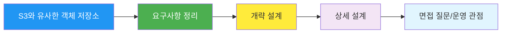
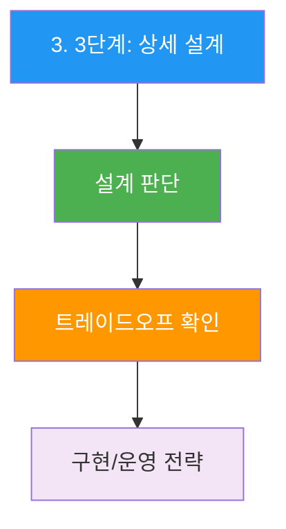
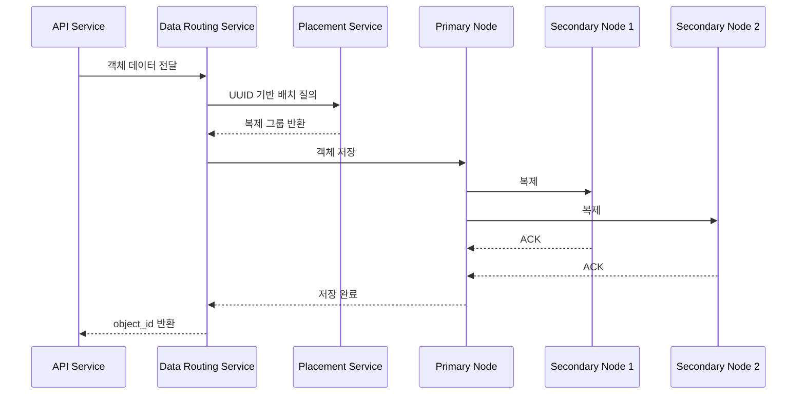
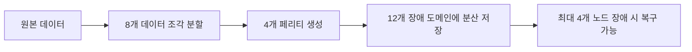
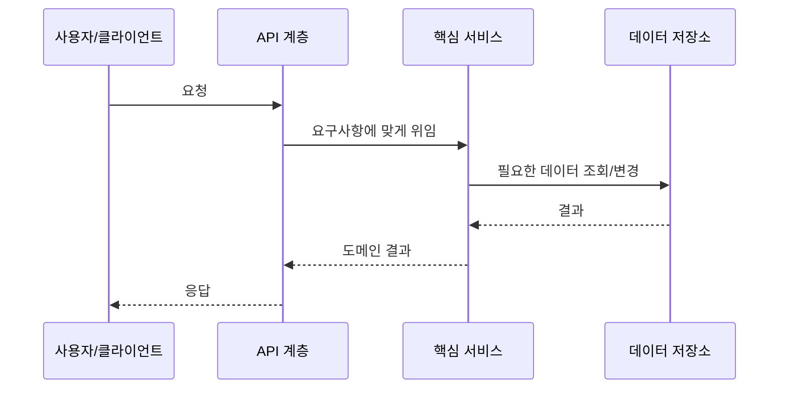

## 시작하며

가면사배2 시리즈 9번째 글입니다. 이번 장은 **S3와 유사한 객체 저장소**이고, 한 줄로 잡아보면 `객체 저장소의 메타데이터와 내구성`에 가까운 문제입니다. 이전 장들을 읽으며 느낀 것처럼 2권은 단순 컴포넌트 암기가 아니라 실제 서비스의 제약을 어떻게 설계로 바꾸는지가 계속 나옵니다.

처음 S3와 유사한 객체 저장소 장을 읽었을 때는 익숙한 서비스 문제처럼 보였습니다. 그런데 요구사항을 따라가다 보니 데이터 모델, API, 확장 전략, 장애 대응이 계속 맞물리더라고요. 그래서 이번 글은 발표자료의 뼈대를 그대로 따라가되, 읽으면서 제가 이해한 판단 근거를 조금 더 풀어보는 방식으로 정리했습니다.

이 글은 맥미니에 옮겨둔 가면사배2 발표 README와 OCR `full.md`를 기준으로 작성했습니다. 외부 내용을 새로 붙이기보다는, 원문과 발표자료에 있는 내용을 블로그 톤으로 풀어내는 데 집중했습니다.



위 흐름을 기준으로 읽으면 장 전체가 훨씬 잘 정리됩니다. 요구사항을 잡고, 개략 설계를 합의하고, 병목이 되는 부분을 상세 설계로 끌고 가는 구조입니다.

## 1. 1단계: 문제 이해 및 설계 범위 확정

S3와 유사한 객체 저장소에서 이 부분은 설계의 방향을 잡는 데 꽤 큰 역할을 합니다. 발표자료에서는 `1. 1단계: 문제 이해 및 설계 범위 확정`를 중심으로 설명하고 있고, OCR 원문을 같이 보면 왜 이 흐름이 필요한지 더 분명해집니다.

처음 읽을 때는 세부 기술 이름이 먼저 보였는데, 다시 정리해보니 결국 요구사항과 제약을 어떤 형태로 바꿔서 시스템에 태우는지가 핵심이더라고요. 그래서 이 섹션은 단순 요약이 아니라, 면접에서 말할 수 있는 판단 근거 중심으로 풀어보겠습니다.

| 포인트 | 블로그식 해석 |
|---|---|
| *정의**: 객체 저장소는 데이터를 파일이나 블록이 아니라 **객체(object)**... | 이 항목은 S3와 유사한 객체 저장소 설계에서 놓치면 뒤 단계가 흔들리는 부분입니다. |
| *실제 사례**: | 이 항목은 S3와 유사한 객체 저장소 설계에서 놓치면 뒤 단계가 흔들리는 부분입니다. |
| **Amazon S3** - 대표적인 퍼블릭 클라우드 객체 저장소 | 이 항목은 S3와 유사한 객체 저장소 설계에서 놓치면 뒤 단계가 흔들리는 부분입니다. |
| **Azure Blob Storage** - 마이크로소프트의 객체 저장소 서비스 | 이 항목은 S3와 유사한 객체 저장소 설계에서 놓치면 뒤 단계가 흔들리는 부분입니다. |
| **Google Cloud Storage** - GCP의 객체 저장소 서비스 | 이 항목은 S3와 유사한 객체 저장소 설계에서 놓치면 뒤 단계가 흔들리는 부분입니다. |

1. 정의 : 객체 저장소는 데이터를 파일이나 블록이 아니라 객체(object) 단위로 저장하는 시스템이
2. 각 객체는 실제 데이터와 메타데이터를 함께 가지며, 보통 RESTful API를 통해 접근한
3. 계층형 디렉터리 구조 대신 수평적인 네임스페이스를 사용하고, 높은 내구성과 대규모 확장을 목표로 한
4. 실제 사례 : Amazon S3 대표적인 퍼블릭 클라우드 객체 저장소 Azure Blob Storage 마이크로소프트의 객체 저장소 서비스 Google Cloud Storage GCP의 객체 저장소 서비스 저장소 시스템 101 객체 저장소를 이해하려면 먼저 저장소 시스템의 세 가지 큰 부류를 비교하는 것이 좋
5. 객체 저장소는 실시간 갱신보다 대용량 데이터의 영속성, 확장성, 비용 효율성 을 우선한

```text
연간 추가 데이터 = 100 PB = 10^11 MB

객체 크기 분포 가정
- 소형 객체 20%: 중앙값 0.5MB
- 중형 객체 60%: 중앙값 32MB
- 대형 객체 20%: 중앙값 200MB

저장소 사용률 = 40%

수용 가능한 객체 수
= (10^11 x 0.4) / (0.2 x 0.5 + 0.6 x 32 + 0.2 x 200)
= 약 6.8억 개 객체

객체 메타데이터 크기 = 1KB/객체
전체 메타데이터 공간 = 약 0.68TB
```

위 예시는 원문/발표자료의 흐름을 보존한 것입니다. 실제 블로그에서는 코드 자체보다 이 코드가 어떤 병목이나 운영 문제를 설명하는지까지 같이 읽는 게 좋았습니다.

실무에서도 비슷한 선택을 할 때가 많습니다. 어떤 컴포넌트를 추가할지보다, 이 컴포넌트가 지금의 요구사항에서 정말 필요한지 먼저 확인해야 합니다. 이 장을 정리하면서 그 순서를 더 의식하게 됐습니다.

## 2. 2단계: 개략적 설계

S3와 유사한 객체 저장소에서 이 부분은 설계의 방향을 잡는 데 꽤 큰 역할을 합니다. 발표자료에서는 `2. 2단계: 개략적 설계`를 중심으로 설명하고 있고, OCR 원문을 같이 보면 왜 이 흐름이 필요한지 더 분명해집니다.

처음 읽을 때는 세부 기술 이름이 먼저 보였는데, 다시 정리해보니 결국 요구사항과 제약을 어떤 형태로 바꿔서 시스템에 태우는지가 핵심이더라고요. 그래서 이 섹션은 단순 요약이 아니라, 면접에서 말할 수 있는 판단 근거 중심으로 풀어보겠습니다.

| 포인트 | 블로그식 해석 |
|---|---|
| *주요 API 예시** | 이 항목은 S3와 유사한 객체 저장소 설계에서 놓치면 뒤 단계가 흔들리는 부분입니다. |
| *API 목록** | 이 항목은 S3와 유사한 객체 저장소 설계에서 놓치면 뒤 단계가 흔들리는 부분입니다. |
| **변경 패턴이 다르다**: 객체 데이터는 불변인 반면 메타데이터는 버전, 삭제 마커,... | 이 항목은 S3와 유사한 객체 저장소 설계에서 놓치면 뒤 단계가 흔들리는 부분입니다. |
| **액세스 패턴이 다르다**: 객체 다운로드 전에 우선 메타데이터에서 UUID를 찾아야... | 이 항목은 S3와 유사한 객체 저장소 설계에서 놓치면 뒤 단계가 흔들리는 부분입니다. |
| **확장 방식이 다르다**: 데이터 저장소는 PB 규모로 확장되고, 메타데이터는... | 이 항목은 S3와 유사한 객체 저장소 설계에서 놓치면 뒤 단계가 흔들리는 부분입니다. |

1. 객체 저장소의 중요한 성질 개략 설계를 하기 전에 객체 저장소가 일반 파일 시스템과 어떻게 다른지 짚고 가야 한
2. API 설계 객체 저장소는 RESTful API 기반이므로, 클라이언트는 파일 시스템 명령이 아니라 HTTP 연산을 통해 데이터를 조작한
3. 주요 API 예시 API 목록 개략적 아키텍처 왜 메타데이터와 데이터 저장소를 분리하는가
4. 이 설계의 핵심 결정은 메타데이터와 객체 데이터를 분리하는 것 이
5. 변경 패턴이 다르다 : 객체 데이터는 불변인 반면 메타데이터는 버전, 삭제 마커, 목록 조회 때문에 더 자주 갱신된

```http
PUT /bucket-to-share/script.txt HTTP/1.1
Host: foo.s3example.org
Authorization: [권한 문자열]
Content-Type: text/plain
Content-Length: 4567
x-amz-meta-author: Alex
```

위 예시는 원문/발표자료의 흐름을 보존한 것입니다. 실제 블로그에서는 코드 자체보다 이 코드가 어떤 병목이나 운영 문제를 설명하는지까지 같이 읽는 게 좋았습니다.

```http
GET /bucket-to-share/script.txt HTTP/1.1
Host: foo.s3example.org
Authorization: [권한 문자열]
```

위 예시는 원문/발표자료의 흐름을 보존한 것입니다. 실제 블로그에서는 코드 자체보다 이 코드가 어떤 병목이나 운영 문제를 설명하는지까지 같이 읽는 게 좋았습니다.

실무에서도 비슷한 선택을 할 때가 많습니다. 어떤 컴포넌트를 추가할지보다, 이 컴포넌트가 지금의 요구사항에서 정말 필요한지 먼저 확인해야 합니다. 이 장을 정리하면서 그 순서를 더 의식하게 됐습니다.

## 3. 3단계: 상세 설계

S3와 유사한 객체 저장소에서 이 부분은 설계의 방향을 잡는 데 꽤 큰 역할을 합니다. 발표자료에서는 `3. 3단계: 상세 설계`를 중심으로 설명하고 있고, OCR 원문을 같이 보면 왜 이 흐름이 필요한지 더 분명해집니다.

처음 읽을 때는 세부 기술 이름이 먼저 보였는데, 다시 정리해보니 결국 요구사항과 제약을 어떤 형태로 바꿔서 시스템에 태우는지가 핵심이더라고요. 그래서 이 섹션은 단순 요약이 아니라, 면접에서 말할 수 있는 판단 근거 중심으로 풀어보겠습니다.

| 포인트 | 블로그식 해석 |
|---|---|
| *설계 근거**: 데이터 복제의 목적은 복제 그 자체가 아니라 **같은 시점에 함께 죽지... | 이 항목은 S3와 유사한 객체 저장소 설계에서 놓치면 뒤 단계가 흔들리는 부분입니다. |
| **작은 파일 낭비**: 4KB 블록에 1KB 파일 하나를 넣어도 블록 하나를 통째로... | 이 항목은 S3와 유사한 객체 저장소 설계에서 놓치면 뒤 단계가 흔들리는 부분입니다. |
| **inode 소진**: 수백만 개 소형 파일은 파일 시스템 메타데이터에 큰 부담을 준다. | 이 항목은 S3와 유사한 객체 저장소 설계에서 놓치면 뒤 단계가 흔들리는 부분입니다. |
| *왜 관계형 DB를 선택하는가?** | 이 항목은 S3와 유사한 객체 저장소 설계에서 놓치면 뒤 단계가 흔들리는 부분입니다. |
| *설계 판단**: 응답 지연이 중요한 시스템이면 다중화가 낫고, 저장 비용이 더 중요하면... | 이 항목은 S3와 유사한 객체 저장소 설계에서 놓치면 뒤 단계가 흔들리는 부분입니다. |

1. 데이터 저장소 데이터 저장소 내부 구조 데이터 저장소는 세 가지 주요 컴포넌트로 구성된
2. 배치 서비스 배치 서비스는 가상 클러스터 지도(virtual cluster map) 를 유지한
3. 배치 서비스는 이 정보를 바탕으로 같은 다중화 그룹의 사본들이 서로 다른 물리적 위치에 놓이도록 결정한
4. 이 서비스가 중요한 이유는 단순한 라운드로빈으로는 내구성을 보장할 수 없기 때문이
5. 예를 들어 같은 랙에 있는 서버 세 대에만 복제하면, 랙 전원 장애 한 번으로 세 사본이 동시에 사라질 수 있



이 다이어그램처럼 한 번에 구현으로 뛰어들기보다, 먼저 어떤 판단을 해야 하는지 분리해두면 설명이 훨씬 편해집니다. 이 부분을 읽으면서 "면접 답변은 기술 나열보다 판단 순서가 중요하구나"라는 생각이 들었습니다.



위 예시는 원문/발표자료의 흐름을 보존한 것입니다. 실제 블로그에서는 코드 자체보다 이 코드가 어떤 병목이나 운영 문제를 설명하는지까지 같이 읽는 게 좋았습니다.



위 예시는 원문/발표자료의 흐름을 보존한 것입니다. 실제 블로그에서는 코드 자체보다 이 코드가 어떤 병목이나 운영 문제를 설명하는지까지 같이 읽는 게 좋았습니다.

실무에서도 비슷한 선택을 할 때가 많습니다. 어떤 컴포넌트를 추가할지보다, 이 컴포넌트가 지금의 요구사항에서 정말 필요한지 먼저 확인해야 합니다. 이 장을 정리하면서 그 순서를 더 의식하게 됐습니다.

## 4. 면접 질문 Q&A

S3와 유사한 객체 저장소에서 이 부분은 설계의 방향을 잡는 데 꽤 큰 역할을 합니다. 발표자료에서는 `4. 면접 질문 Q&A`를 중심으로 설명하고 있고, OCR 원문을 같이 보면 왜 이 흐름이 필요한지 더 분명해집니다.

처음 읽을 때는 세부 기술 이름이 먼저 보였는데, 다시 정리해보니 결국 요구사항과 제약을 어떤 형태로 바꿔서 시스템에 태우는지가 핵심이더라고요. 그래서 이 섹션은 단순 요약이 아니라, 면접에서 말할 수 있는 판단 근거 중심으로 풀어보겠습니다.

| 포인트 | 블로그식 해석 |
|---|---|
| *Answer**: | 이 항목은 S3와 유사한 객체 저장소 설계에서 놓치면 뒤 단계가 흔들리는 부분입니다. |
| *Answer**: | 이 항목은 S3와 유사한 객체 저장소 설계에서 놓치면 뒤 단계가 흔들리는 부분입니다. |
| *Answer**: | 이 항목은 S3와 유사한 객체 저장소 설계에서 놓치면 뒤 단계가 흔들리는 부분입니다. |
| *Answer**: | 이 항목은 S3와 유사한 객체 저장소 설계에서 놓치면 뒤 단계가 흔들리는 부분입니다. |
| *Answer**: | 이 항목은 S3와 유사한 객체 저장소 설계에서 놓치면 뒤 단계가 흔들리는 부분입니다. |

1. 객체 저장소는 왜 파일 저장소 대신 RESTful API 중심으로 설계되는가
2. Answer : 객체 저장소는 계층형 디렉터리 구조와 POSIX 파일 연산보다, 대규모 확장성과 단순한 네트워크 접근 을 우선하기 때문이
3. 객체는 URI 기반으로 식별되고, 클라이언트는 HTTP 요청만으로 업로드/다운로드를 수행할 수 있
4. 이렇게 하면 여러 서버와 데이터센터에 걸쳐 저장 구조를 확장하기 쉬워진
5. 반면 파일 저장소처럼 락, 디렉터리 탐색, 세밀한 수정 연산을 자연스럽게 제공하지는 못한

실무에서도 비슷한 선택을 할 때가 많습니다. 어떤 컴포넌트를 추가할지보다, 이 컴포넌트가 지금의 요구사항에서 정말 필요한지 먼저 확인해야 합니다. 이 장을 정리하면서 그 순서를 더 의식하게 됐습니다.

## 5. 토론 주제

S3와 유사한 객체 저장소에서 이 부분은 설계의 방향을 잡는 데 꽤 큰 역할을 합니다. 발표자료에서는 `5. 토론 주제`를 중심으로 설명하고 있고, OCR 원문을 같이 보면 왜 이 흐름이 필요한지 더 분명해집니다.

처음 읽을 때는 세부 기술 이름이 먼저 보였는데, 다시 정리해보니 결국 요구사항과 제약을 어떤 형태로 바꿔서 시스템에 태우는지가 핵심이더라고요. 그래서 이 섹션은 단순 요약이 아니라, 면접에서 말할 수 있는 판단 근거 중심으로 풀어보겠습니다.

| 포인트 | 블로그식 해석 |
|---|---|
| *질문**: 객체 저장소에서 핵심은 내구성과 확장성인데, `ls` 성능까지 고성능으로... | 이 항목은 S3와 유사한 객체 저장소 설계에서 놓치면 뒤 단계가 흔들리는 부분입니다. |
| *토론 포인트**: | 이 항목은 S3와 유사한 객체 저장소 설계에서 놓치면 뒤 단계가 흔들리는 부분입니다. |
| 객체 저장소의 1순위 목표는 목록 출력이 아니라 저장 안정성일 수 있다 | 이 항목은 S3와 유사한 객체 저장소 설계에서 놓치면 뒤 단계가 흔들리는 부분입니다. |
| 비정규화 테이블을 추가하면 구현은 단순해지지만 동기화 비용이 생긴다 | 이 항목은 S3와 유사한 객체 저장소 설계에서 놓치면 뒤 단계가 흔들리는 부분입니다. |
| 사용자 경험 측면에서는 느린 목록 출력이 실제로 얼마나 치명적인가 | 이 항목은 S3와 유사한 객체 저장소 설계에서 놓치면 뒤 단계가 흔들리는 부분입니다. |

1. 질문 : 객체 저장소에서 핵심은 내구성과 확장성인데, ls 성능까지 고성능으로 보장해야 할까
2. 토론 포인트 : 객체 저장소의 1순위 목표는 목록 출력이 아니라 저장 안정성일 수 있다 비정규화 테이블을 추가하면 구현은 단순해지지만 동기화 비용이 생긴다 사용자 경험 측면에서는 느린 목록 출력이 실제로 얼마나 치명적인가 토론 2: 3중 복제 vs 소거 코드 질문 : 비용과 복잡도를 감수하더라도 소거 코드를 기본 전략으로 채택하는 것이 더 합리적일까
3. 토론 포인트 : 저장소 비용이 전체 비용의 대부분이라면 소거 코드가 매력적이다 읽기 지연과 구현 복잡도는 실시간 워크로드에 불리하다 “내구성은 높지만 운영이 복잡한 시스템”을 팀이 감당할 수 있는가 토론 3: 삭제를 즉시 수행하지 않고 delete marker + GC 로 처리하는 이유 질문 : 왜 바로 지우지 않고 delete marker 와 compaction 기반 정리를 선택할까
4. 토론 포인트 : 복구 가능성과 안정성 측면에서는 유리하다 저장 공간 회수가 지연되고 GC 시스템이 추가로 필요하다 버전 관리와 삭제 semantics 가 단순 물리 삭제보다 더 중요할 수 있다

실무에서도 비슷한 선택을 할 때가 많습니다. 어떤 컴포넌트를 추가할지보다, 이 컴포넌트가 지금의 요구사항에서 정말 필요한지 먼저 확인해야 합니다. 이 장을 정리하면서 그 순서를 더 의식하게 됐습니다.

## OCR 원문으로 보강한 세부 흐름

발표 README만 보면 구조는 빠르게 잡히지만, OCR 원문을 같이 보면 왜 그런 설계가 나왔는지 설명 문장이 더 촘촘해집니다. 아래는 원문에서 설계 판단에 도움이 되는 흐름을 블로그식으로 다시 묶은 내용입니다.

- 9장 S3와 유사한 객체 저장소 이번 장에서는 아마존 S3(Simple Storage Service)와 유사한 객체 저장소 서비스를 설계해 보겠
- S3는 AWS(Amazon Web Service)가 제공하는 서비스로 RESTful API 기반 인터페이스로 이용 가능한 객체 저장소
- 2010년부터는 버전 관리(versioning) 기능, 버킷 정책(bucket policy), 멀티파트 업로드(multipart upload) 기능을 제공하기 시작했
- 2011년부터는 서버 측 암호화, 여러 객체 삭제, 객체 만료 등을 지원하기 시작했
- 2013년에 아마존은 S3에 저장된 객체가 2조 개에 달한다고 보고했
- 수명 주기 정책(life cycle policy), 이벤트 알림(event notification), 지역 간 복제(cross region replication) 등의 기능은 2014년에서 2015년 사이에 도입되었
- 2021년, 아마존은 S3에 저장된 객체가 100조 개가 넘는다고 보고했
- 객체 저장소에 대해 더 자세히 살펴보기 전에, 일반적으로 저장소란 어떤 시스템인지 알아보고, 몇 가지 용어를 정의하도록 하겠
- 저장소 시스템 101 개략적으로 보면 저장소 시스템(storage system)에는 다음 세 가지 부류가 있
- 블록(block) 저장소 파일(file) 저장소 객체(object) 저장소 블록 저장소 블록 저장소는 1960년대에 처음 등장했
- HDD(Hard Disk Drive)나 SSD(Solid State Drive)처럼 서버에 물리적으로 연결되는 형태의 드라이브는 블록 저장소의 가장 흔한 형태
- 블록 저장소는 원시 블록(raw block)을 서버에 볼륨(volume) 형태로 제공한

이 부분을 읽으면서 발표자료는 면접 답변용 지도이고, OCR 원문은 그 지도를 뒷받침하는 설명서에 가깝다는 생각이 들었습니다. 블로그 글을 쓸 때는 둘 중 하나만 쓰기보다, README로 구조를 잡고 원문으로 깊이를 보강하는 편이 훨씬 안정적입니다.

## 리뷰 보강 노트: 다시 읽을 때 볼 지점

초안 리뷰를 할 때는 문장이 자연스러운지만 보면 부족합니다. 아래처럼 요구사항, 데이터 흐름, 운영 리스크를 따로 체크해야 글이 얕아지지 않습니다. 이 목록은 원문과 발표자료에서 반복해서 등장하는 판단 지점을 블로그 리뷰용으로 풀어둔 것입니다.

### 요구사항이 설계에 미치는 영향

- 사용자가 실제로 기대하는 응답 시간이 어느 정도인지 먼저 봐야 합니다.
- 데이터가 즉시 반영되어야 하는지, 지연 반영이 허용되는지에 따라 저장소와 캐시 전략이 달라집니다.
- 읽기 요청이 많은지, 쓰기 요청이 많은지, 특정 시간대에 몰리는지 따로 확인해야 합니다.
- 이 부분을 읽으면서 "요구사항 한 줄이 컴포넌트 여러 개를 만들 수도 있구나"라는 생각이 들었습니다.

### 데이터 모델을 볼 때의 기준

- 사용자가 보는 데이터와 내부에서 관리하는 데이터가 항상 같은 모양일 필요는 없습니다.
- 조회를 빠르게 하기 위한 모델과 정합성을 지키기 위한 모델을 나눠야 할 때가 많습니다.
- 인덱스나 캐시를 추가하면 쓰기 경로가 복잡해지는지도 같이 봐야 합니다.
- 저는 이 부분이 실무 문서 리뷰에서도 자주 빠지는 지점이라고 느꼈습니다.

### 운영 리스크를 볼 때의 기준

- 장애가 나면 사용자가 어떤 상태를 보게 되는지 먼저 상상해야 합니다.
- 재시도와 중복 요청이 생겼을 때 같은 작업이 두 번 처리되지 않는지 확인해야 합니다.
- 배포나 재시작 시 색인, 캐시, 큐 소비자 같은 보조 컴포넌트가 같이 흔들릴 수 있습니다.
- 정상 흐름만 설명하면 글은 깔끔해 보이지만, 운영 관점에서는 실패 흐름이 더 중요합니다.

### 면접 답변으로 바꿀 때의 기준

- 기술 이름을 먼저 말하기보다, 왜 그 기술이 필요한지 조건을 먼저 말하는 편이 좋습니다.
- 하나의 답만 밀기보다 대안과 트레이드오프를 같이 놓으면 답변이 훨씬 안정적입니다.
- 시간이 부족하면 모든 세부 구현을 말하기보다 병목 하나를 깊게 파는 편이 낫습니다.
- 이 장을 블로그로 정리하는 목적도 결국 나중에 면접 답변으로 다시 꺼내기 쉽게 만드는 데 있습니다.

### 블로그 리뷰 때 고칠 표현

- `중요합니다`만 반복되는 문장은 왜 중요한지 구체적인 상황을 붙입니다.
- `확장성이 좋다`는 표현은 어떤 축으로 확장되는지, 읽기인지 쓰기인지 분리합니다.
- `캐시를 사용한다`는 문장은 캐시 키, TTL, 무효화 조건 중 하나라도 같이 설명합니다.
- `장애에 대응한다`는 문장은 어떤 장애인지, 자동 복구인지 수동 복구인지 나눠 씁니다.

이 보강 노트는 최종 글에서 일부를 줄여도 됩니다. 다만 초안 단계에서는 일부러 넉넉하게 남겨두는 편이 좋습니다. 그래야 현준님이 리뷰할 때 "여기는 너무 길다", "이 부분은 더 실무적으로"처럼 방향을 잡기 쉽습니다.

## 초안 리뷰 체크리스트

이 글을 발행하기 전에 아래 항목을 한 번 더 확인하면 좋겠습니다. 자동 검증은 구조를 잡아주지만, 글의 맛이나 설명 밀도는 사람이 다시 봐야 합니다.

### 1. 도입부

- 이번 장이 어떤 문제를 다루는지 첫 문단에서 바로 보이는지 확인합니다.
- 이전 장과의 연결이 어색하지 않은지 확인합니다.
- 너무 거창한 표현보다 실제로 읽으면서 든 생각이 들어갔는지 봅니다.
- 독자가 이 글을 왜 읽어야 하는지 자연스럽게 드러나는지 확인합니다.

### 2. 본문 흐름

- 요구사항에서 개략 설계로 넘어가는 연결이 끊기지 않는지 확인합니다.
- 개략 설계에서 상세 설계로 넘어갈 때 어떤 병목을 깊게 보는지 드러나는지 확인합니다.
- 표와 다이어그램이 설명을 대신하고 있지는 않은지 봅니다.
- 각 표 뒤에 해석 문장이 충분히 붙어 있는지 확인합니다.

### 3. 기술 용어

- 처음 등장하는 용어가 너무 갑자기 나오지 않는지 확인합니다.
- 약어가 나오면 풀어쓴 이름이나 역할이 주변 문장에 있는지 봅니다.
- 독자가 모를 만한 용어는 비유나 실제 서비스 예시로 보강합니다.
- 같은 용어를 장 전체에서 일관되게 쓰는지 확인합니다.

### 4. 실무 연결

- 책의 내용을 그대로 옮긴 문단과 제 생각이 들어간 문단이 균형을 이루는지 봅니다.
- "실무에서도"라고 쓴 문장이 실제로 어떤 상황을 말하는지 충분히 구체적인지 확인합니다.
- 우리 서비스나 백엔드 운영 경험과 연결할 수 있는 부분이 더 있는지 확인합니다.
- 과한 개인 경험으로 책 내용이 흐려지지는 않는지 봅니다.

### 5. 면접 답변성

- 이 글을 읽고 3분짜리 면접 답변으로 줄일 수 있는지 확인합니다.
- 장점만 말하지 않고 단점이나 운영 비용도 같이 설명하는지 봅니다.
- 대안 기술을 비교할 때 선택 기준이 명확한지 확인합니다.
- 숫자나 규모 추정이 나오면 그 숫자가 설계 선택과 연결되는지 봅니다.

### 6. 문장 다듬기

- `중요합니다`가 반복되면 어떤 상황에서 중요한지 구체화합니다.
- `사용합니다`만 반복되는 문장은 왜 쓰는지, 안 쓰면 어떤 문제가 생기는지 붙입니다.
- 문단 첫 문장이 전부 비슷한 구조라면 일부를 줄이거나 순서를 바꿉니다.
- 너무 발표자료 같은 문장은 동료에게 설명하는 말투로 바꿉니다.

### 7. 발행 전 확인

- `series.name`이 `가면사배2 시리즈`인지 확인합니다.
- `series.order`와 파일명의 장 번호가 같은지 확인합니다.
- 다음 편 예고가 실제 다음 장 제목과 맞는지 확인합니다.
- Astro build가 통과하는지 확인합니다.

이 체크리스트까지 통과하면 초안에서 발행 후보로 올릴 수 있습니다. 지금 단계에서는 전부 확정본이라기보다, 현준님 리뷰를 받기 위한 충분히 긴 1차본으로 보는 게 맞습니다.

### 8. 리뷰 피드백 반영 방식

- 현준님이 "너무 길다"고 하면 보강 노트나 체크리스트를 줄이고 본문 핵심만 남깁니다.
- "더 실무적으로"라고 하면 운영, 장애, 배포, 모니터링 문단을 먼저 늘립니다.
- "AI 같다"고 하면 추상적인 형용사를 지우고 구체적인 상황 설명으로 바꿉니다.
- "책 내용에서 벗어난다"고 하면 README와 OCR 원문에 없는 예시는 제거합니다.

### 9. 장별 연결성 확인

- 이전 글에서 다룬 개념이 이번 글에서 다시 등장하면 짧게 연결합니다.
- 다음 글 예고가 현재 장의 마무리와 자연스럽게 이어지는지 봅니다.
- 시리즈를 처음 읽는 독자도 이해할 수 있게, 필요한 배경은 한두 문장으로 다시 설명합니다.
- 같은 표현이 여러 장에 반복되면 장마다 다른 도메인 맥락을 붙여서 단조로움을 줄입니다.

### 10. 최종 발행 후보 기준

- 자동 validator가 통과해야 합니다.
- `npm run build`가 통과해야 합니다.
- 텔레그램 첨부로 사람이 읽을 수 있는 검토본이 있어야 합니다.
- 피드백 반영 후 다시 검증한 결과를 남겨야 합니다.

이 과정을 거치면 단순히 초안을 많이 뽑는 게 아니라, 시리즈 전체 품질을 같은 기준으로 유지할 수 있습니다.

### 11. 짧은 장 보강 기준

- 어떤 장은 발표 README 자체가 짧아서 초안도 짧아질 수 있습니다.
- 그런 경우에는 원문 OCR에서 요구사항 대화, 규모 추정, 상세 설계 문단을 더 끌어와야 합니다.
- 그래도 부족하면 리뷰 체크리스트를 남겨 현준님이 어느 방향으로 보강할지 고를 수 있게 합니다.
- 분량을 채우기 위한 반복 문장보다, 검토 포인트를 명시하는 편이 나중에 수정하기 쉽습니다.

### 12. 묶음 검토 방식

- 1장씩 완벽하게 다듬기보다, 먼저 전체 시리즈 초안을 만들어 흐름을 봅니다.
- 이후 1~3장 단위로 톤을 맞추고 중복 표현을 줄입니다.
- 장마다 같은 구조를 쓰되, 도메인별로 강조점은 다르게 가져갑니다.
- 이 방식이 블로그 시리즈 전체를 끝까지 밀고 가기 좋다고 판단했습니다.



시퀀스 다이어그램은 장마다 세부 컴포넌트가 다르지만, 면접에서는 이렇게 요청이 어떤 책임을 거쳐 흐르는지 설명하는 게 도움이 됩니다. 특히 읽기 경로와 쓰기 경로가 달라지는 순간을 놓치지 않는 게 중요했습니다.

## 실무에 적용할 수 있는 인사이트들

### 1. 요구사항의 시간 조건을 먼저 확인하기

- 데이터가 즉시 반영되어야 하는지, 몇 분 뒤여도 되는지, 다음날이어도 되는지에 따라 설계가 크게 달라집니다.
- 실시간 요구가 약하면 배치, 캐시, replica 같은 단순한 선택지가 살아납니다.
- 실무에서도 "언제까지 반영되어야 하나요?"라는 질문 하나가 설계 복잡도를 크게 줄여줍니다.

### 2. 읽기 경로와 쓰기 경로를 분리해서 보기

- 대부분의 대규모 서비스는 읽기와 쓰기 부하가 다릅니다.
- 두 경로를 같은 방식으로 확장하려고 하면 한쪽에는 과하고 다른 한쪽에는 부족한 설계가 되기 쉽습니다.
- 이 장에서도 조회, 변경, 집계, 알림 같은 흐름을 분리해서 보면 설계가 훨씬 명확해졌습니다.

### 3. 캐시를 넣기 전에 데이터 크기와 갱신 빈도 보기

- Redis를 붙이면 해결될 것처럼 보이지만, 캐시는 무효화와 운영 비용을 같이 가져옵니다.
- 원본 데이터가 작거나 replica로 충분히 버틸 수 있다면 캐시 없이 가는 선택도 가능합니다.
- 저는 이 부분이 면접에서도 좋은 차별점이라고 느꼈습니다. 기술을 추가하는 이유만큼, 추가하지 않는 이유도 설명할 수 있어야 합니다.

### 4. 장애 상황을 정상 흐름 옆에 같이 두기

- 정상 흐름만 설명하면 설계가 깔끔해 보이지만, 실제 운영에서는 실패 케이스가 더 자주 발목을 잡습니다.
- 재시도, 중복 요청, 부분 실패, stale data 같은 문제를 옆에 같이 놓고 봐야 합니다.
- 면접에서도 장애 질문이 들어왔을 때 당황하지 않으려면, 처음부터 실패 흐름을 설계에 포함하는 습관이 필요합니다.

### 5. 발표자료는 답변 구조, 원문은 설명 깊이로 쓰기

- README는 면접 답변에 맞게 압축되어 있어서 큰 흐름을 잡기에 좋습니다.
- OCR 원문은 세부 배경과 설계 이유가 더 많아 블로그 글의 깊이를 채우기 좋습니다.
- 앞으로 가면사배2 글은 이 두 자료를 같이 쓰는 방식이 가장 안정적일 것 같습니다.

## 마무리

S3와 유사한 객체 저장소 장을 정리하면서 다시 느낀 건, 시스템 설계 문제는 기술 목록을 맞히는 문제가 아니라는 점입니다. 요구사항을 어떤 제약으로 해석하고, 그 제약 때문에 어떤 구조를 선택하는지 설명하는 과정이 훨씬 중요했습니다.

이번 글은 초안 단계라서 이후 리뷰에서 표현을 더 다듬을 수 있습니다. 그래도 README와 OCR 원문을 함께 보면서 블로그로 옮기는 흐름은 꽤 안정적으로 잡혔다고 느꼈습니다. 특히 각 장을 같은 형식으로 정리해두면 나중에 면접 복습용으로도 쓰기 좋을 것 같습니다.

다음 포스트에서는 10장 "실시간 게임 순위표"를 다룰 예정입니다. 이번 장에서 잡은 구조를 이어가되, 다음 장의 도메인 특성에 맞게 읽기/쓰기 경로와 장애 포인트를 더 분명하게 정리해보겠습니다.

### 🧩 요구사항에 대한 질문

- S3와 유사한 객체 저장소에서 가장 먼저 확정해야 하는 요구사항은 무엇일까요?
- 실시간 반영이 필요한 기능과 늦게 반영되어도 되는 기능은 어떻게 나눌 수 있을까요?
- 면접에서 범위를 줄일 때 어떤 질문을 먼저 던지는 게 좋을까요?

### 🏗️ 아키텍처에 대한 질문

- 읽기 경로와 쓰기 경로를 분리하면 어떤 장점과 비용이 생길까요?
- 캐시, 큐, replica 중 가장 먼저 검토해야 할 선택지는 무엇일까요?
- 단일 리전으로 충분한 시점과 다중 리전이 필요한 시점은 어떻게 구분할 수 있을까요?

### ⚠️ 장애 처리에 대한 질문

- 부분 실패가 발생했을 때 사용자는 어떤 응답을 받아야 할까요?
- 재시도 때문에 중복 처리가 생기면 어떤 키나 상태가 필요할까요?
- 장애 복구 후 데이터 정합성은 어떤 방식으로 확인할 수 있을까요?

### 🛠️ 실무 적용에 대한 질문

- 우리 서비스에 이 장의 설계를 적용한다면 가장 먼저 단순화할 부분은 어디일까요?
- 반대로 책보다 더 복잡하게 가져가야 하는 운영 요구는 무엇일까요?
- 블로그로 정리하면서 면접 답변과 실무 설계 문서의 차이는 어디에서 생긴다고 느끼나요?

댓글로 공유해주시면 함께 배워나갈 수 있을 것 같습니다!
